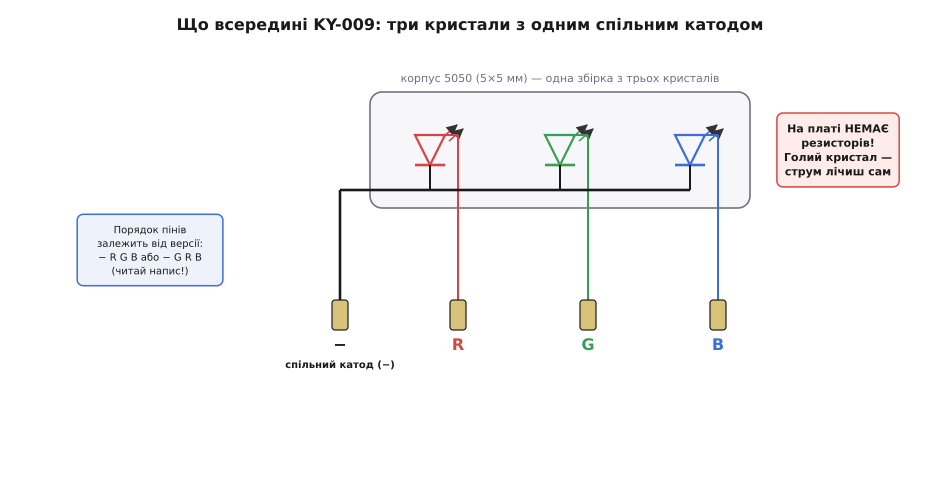
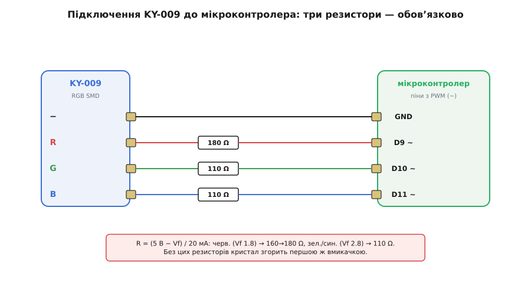

# KY-009 — RGB SMD-модуль

<preknowlist>
- [Світлодіод (LED)](book:electronics/led) — чому діод світиться лише в один бік, що таке пряма напруга (Vf) й чому струм крізь нього треба обмежувати ззовні; без цього KY-009 згорить.
- [Закон Ома](book:electronics/ohms-law) — напруга = струм · опір; саме ним рахують гасильний резистор для кожного кольору.
- [Широтно-імпульсна модуляція (PWM)](book:programming/pwm-on-mcu) — як мікроконтролер «притлумлює» вихід швидким миготінням зі змінною шпаруватістю; так з трьох яскравостей R, G, B змішують будь-який колір.
- [Рівні «0» і «1»](book:electronics/logic-levels-as-ranges) — що таке 3.3- і 5-вольтова логіка й чому напруга піна МК визначає струм крізь світлодіод.
- [KY-серія (Keyes 37-в-1)](book:sensors/ky-series) — звідки взялися сині платки з написом «KY», спільна гребінка й манера підключення всієї родини.
</preknowlist>

Серед десятків синіх платок стартового набору «37 давачів» є одна, що не міряє нічого — вона світить. На ній сидить єдиний блискучий квадратик завбільшки п'ять на п'ять міліметрів, а від нього до гребінки тягнуться чотири піни з написами на кшталт `−`, `R`, `G`, `B`. Це KY-009: **повнокольоровий світлодіод у поверхневому корпусі, виведений на маленьку плату**. Одним таким квадратиком можна засвітити практично будь-який колір — від теплого бурштину до крижаного блакиту — і саме тому він так часто стає першим «виконавчим» пристроєм, який новачок чіпляє до плати після купи давачів.

Але за цією простотою ховається пастка, на якій згоряє чи не кожен другий такий модуль першої ж хвилини. Розберімо KY-009 так, щоб упізнати його серед решти заліза, зрозуміти, що саме там усередині, як його правильно під'єднати — і чому без трьох копійчаних резисторів він живе лічені секунди.

## Що це таке й до чого тут «RGB»

KY-009 належить до [KY-серії](book:sensors/ky-series) — родини китайської компанії Keyes, де кожен модуль має наскрізний номер і спільний формат. Спільну історію бренду й те, чому ці платки скрізь однакові, винесено в оглядову статтю родини; тут нам вистачить того, що **номер KY-009 завжди означає одне: RGB-світлодіод у SMD-корпусі**, хоч би хто його спаяв.

Абревіатура **RGB** — це три перші літери англійських **R**ed, **G**reen, **B**lue (червоний, зелений, синій). Це не якийсь особливий колір, а рецепт: усередині модуля не один світлодіод, а **три окремі кристали** — червоний, зелений і синій, — упаковані в один спільний корпус. Око не бачить їх нарізно, бо вони крихітні й тісно поруч; воно бачить лише **суму їхнього світла**. А сума трьох чистих кольорів, узятих у різній пропорції, дає майже весь видимий спектр. Це те саме додаткове змішування кольору (лат. *additivus* — доданий), на якому працює кожен екран: піксель монітора — теж трійця R-G-B субпікселів.

Літери **SMD** (англ. **S**urface-**M**ounted **D**evice — прилад поверхневого монтажу) кажуть про корпус: кристали сидять у пласкому квадратному корпусі, припаяному просто на поверхню плати, без ніжок, що протикають її наскрізь. Конкретний тип корпусу — **5050**: назва — це просто розмір у десятих міліметра, 5.0 × 5.0 мм. Саме такі 5050-світлодіоди стоять у світлодіодних стрічках, тож KY-009 — це, по суті, один «піксель» такої стрічки, виведений на зручну плату з гребінкою.

> 🔧 **Навіщо це.** Коли в списку деталей бачиш «KY-009» або «RGB 5050 module», не шукай екзотики: це три звичайні світлодіоди в одному корпусі, якими керуєш **незалежно**. Уся хитрість — у тому, щоб подати на кожен свою яскравість; змішування в потрібний колір відбувається вже в оці. І ще: 5050 — той самий кристал, що в стрічках, тож усе, що навчишся робити з KY-009, один-в-один переноситься на світлодіодну стрічку.

## Спільний катод: чому мінус один на всіх

Три кристали в корпусі поєднані не абияк. У KY-009 усі три **катоди** (мінусові виводи діодів) з'єднані разом в одну спільну точку, а назовні виходять три окремі **аноди** (плюсові виводи) — по одному на колір. Така схема зветься **спільний катод** (англ. *common cathode*). Ось що там усередині:



*Три кристали в одному корпусі 5050. Аноди (плюси) червоного, зеленого й синього виходять окремими пінами R, G, B, а всі три катоди зведені в один спільний мінус (−). Головне: на самій платі немає жодного резистора — це голий світлодіод.*

Що з цього випливає для підключення? Спільний мінус іде на землю плати (GND) — раз і назавжди. А кожен колір ти «вмикаєш», подаючи **плюс** на його анод: підняв напругу на піні `R` — засвітився червоний кристал; на `G` — зелений; на `B` — синій. Логіка пряма й приємна: **вища напруга (лог. «1») на кольоровому піні → цей колір горить**. Хочеш жовтий — засвіти червоний і зелений разом; хочеш білий — усі три; хочеш чорний (темряву) — погаси всі.

Тут варто одразу назвати протилежну схему, бо на ній легко обпектися. Буває **спільний анод** (*common anode*): там навпаки — спільним є плюс, а кольори вмикаються поданням **мінуса** («0») на пін. Логіка інвертується: щоб засвітити колір, треба подати на нього не «1», а «0». KY-009 — саме **спільний катод**, тож для нього «1 засвічує». Але споріднений [KY-016 — RGB у 5-мм корпусі](book:actuators/ky-016-rgb) теж спільнокатодний, а от безіменні RGB-світлодіоди з розсипу бувають будь-якими — тому за незнайомого модуля перше питання завжди: **катод спільний чи анод?**

> 🔧 **Навіщо це.** Плутанина «катод/анод» — найтихіша з помилок: код ніби правильний, а замість білого світиться чорне (усе інвертовано), або навпаки — усе горить, коли має бути темно. Якщо модуль поводиться «навиворіт» — не переписуй логіку наосліп, спершу з'ясуй тип спільного виводу. Для спільного катода: значення яскравості 0 = темно, 255 = яскраво. Для спільного анода все дзеркально, і в коді це виправляють одним рядком — `255 − value`.

## Пастка, на якій усе згоряє: голий кристал без резистора

Тепер — найважливіше речення всієї статті. **На платі KY-009 немає жодного гасильного резистора.** Ані на вході, ані в лінії кольорів — нічого. Те, що ти тримаєш, — це буквально голий світлодіод, до якого просто припаяли зручну гребінку. І в цьому вся небезпека.

Щоб зрозуміти, чому це смертельно, згадаймо, як поводиться [світлодіод](book:electronics/led). Діод — не резистор: у нього немає сталого опору. До певної напруги (**пряма напруга**, Vf) він майже не пропускає струм, а щойно напруга сягає Vf — струм зростає **лавиною**, майже вертикально. Крихітна добавка напруги над Vf дає величезний стрибок струму. Тому якщо просто з'єднати світлодіод із джерелом п'яти вольтів, крізь нього піде струм, обмежений лише опором дротів — десятки, а то й сотні міліампер, — і кристал згорить за частку секунди, спалахнувши востаннє.

Струм крізь світлодіод **мусить обмежувати щось зовні**. Класично — послідовний резистор. Він бере на себе різницю між напругою джерела й прямою напругою діода й перетворює її на потрібний, безпечний струм. У модулів на кшталт [KY-016](book:actuators/ky-016-rgb) такі резистори вже вбудовані в плату (там стоять три штуки по ~150 Ом), тож його можна чіпляти до піна напряму. **У KY-009 їх немає** — і саме тому його **не можна** під'єднувати до піна мікроконтролера безпосередньо. Треба поставити свій резистор у кожну з трьох кольорових ліній.

Скільки саме опору? Рахує це [закон Ома](book:electronics/ohms-law), застосований до різниці напруг на резисторі:

**Резистор для червоного кристала (живлення 5 В, Vf червоного ≈ 1.8 В, бажаний струм 20 мА):**
```
Напруга, що падає на резисторі:  U_R = 5 В − 1.8 В = 3.2 В
Потрібний опір:                  R   = U_R / I = 3.2 В / 0.02 А = 160 Ом
Найближчий стандартний номінал:  180 Ом   (трохи більший → трохи тьмяніше, зате безпечно)
```

**Резистор для зеленого й синього (їхня Vf вища, ≈ 2.8 В):**
```
U_R = 5 В − 2.8 В = 2.2 В
R   = 2.2 В / 0.02 А = 110 Ом
```

Зверни увагу на тонкість: **три кольори просять різних резисторів**. Червоний кристал має нижчу пряму напругу (≈ 1.8 В), тож на його резисторі падає більше — і опір виходить більшим (180 Ом). Зелений і синій «з'їдають» більше напруги самі (≈ 2.8 В), лишаючи резистору менше, — тому їм досить ~110 Ом. Якщо поставити на всі три однакові резистори (скажімо, по 220 Ом «щоб напевно»), нічого не згорить, але кольори будуть **незбалансовані**: червоний засвітиться яскравіше за належне, і «білий» піде в рожевий. Тому для правильного білого номінали й підбирають окремо.

> 🔧 **Навіщо це.** Правило, яке рятує модуль: **побачив KY-009 — одразу приготуй три резистори**. Немає під рукою точних 180 і 110 Ом — став будь-що в діапазоні 100–330 Ом на кожну лінію: колір трохи зміститься чи потьмяніє, але кристал виживе. Смертельний варіант лише один — узагалі без резистора. І не «економ» на них, поставивши один спільний резистор у лінію мінуса: тоді три кольори почнуть ділити струм між собою, і яскравість кожного залежатиме від того, скільки інших горить одночасно, — колір «попливе». Резистор — свій на кожен колір, у лінії анода.

## Як під'єднати: пін-у-пін

Зберемо все докупи. KY-009 має чотири піни; підписи на платі — `−` (або `G`/`GND`), `R`, `G`, `B`. Спільний мінус іде на землю плати, а кожен колір — через **свій** резистор — на окремий вихід мікроконтролера. Щоб керувати яскравістю (а не лише «горить/не горить»), кольорові піни чіпляють до виводів, які вміє смикати апаратний таймер, — тобто до [PWM](book:programming/pwm-on-mcu)-виходів. Такий вивід є не всякий: на платах Arduino їх позначають тильдою `~`, на STM32 це піни, розписані на канали таймера `TIMx`, на ESP32 — майже будь-який GPIO, бо там канал PWM (`LEDC`) прив'язують до піна програмно.



*Підключення пін-у-пін. Мінус (−) — прямо на землю. Червоний, зелений і синій — кожен через власний гасильний резистор (180 Ом на червоний, по 110 Ом на зелений і синій) до окремого PWM-виходу. Без цих резисторів кристал згорає першою ж вмикачкою.*

Тепер про **напругу живлення**, бо тут ховається другий, тихіший наслідок «голого кристала». KY-009 не має власного джерела — його «живить» сам сигнальний пін мікроконтролера. А напруга піна дорівнює напрузі логіки плати: 5 В на класичному Arduino Uno, 3.3 В на ESP32 чи STM32. Це змінює арифметику резистора. За 3.3 В на червоному падатиме вже не 3.2, а лише `3.3 − 1.8 = 1.5 В`, і для тих самих 20 мА резистор потрібен менший — близько 75 Ом. Ба більше, синій і зелений із Vf ≈ 2.8 В за живлення 3.3 В світитимуться **ледь-ледь**: на резистор лишається якихось `3.3 − 2.8 = 0.5 В`, струм виходить мізерний. Тому на 3.3-вольтових платах або беруть менші резистори, або мусять миритися з тим, що синій і зелений тьмяніші за червоний. Головне правило те саме, що для всієї [KY-серії](book:sensors/ky-series): **напругу узгоджуй із логікою своєї плати**, а номінали резисторів рахуй під ту напругу, яку реально подаєш.

І остання пастка підключення — **порядок пінів**. Існує дві апаратні версії KY-009: на одних піни йдуть у порядку `− R G B`, на інших — `− G R B` (зелений і червоний поміняні місцями, бо саме так виведені ніжки кристала всередині 5050). Наслідок буденний: збираєш за схемою, вмикаєш «червоний» — а спалахує зелений. Це не поломка, а просто інша версія платки. Тому дивись не на очікуваний порядок, а на **написи біля пінів конкретної плати**, і за потреби поміняй місцями два дроти (або два рядки в коді).

## Керування кольором: три яскравості замість однієї

Засвітити колір — це подати «1» на його пін. Але цікаве починається, коли треба не просто «червоний увімкнено», а конкретний відтінок — скажімо, помаранчевий або бузковий. Тут і вступає в дію [широтно-імпульсна модуляція](book:programming/pwm-on-mcu).

Ідея проста до краси. Світлодіод не вміє світити «наполовину» — він або горить, або ні. Але якщо вмикати й вимикати його дуже швидко — сотні разів на секунду — і тримати ввімкненим, скажімо, лише третину часу, око не помітить миготіння, а побачить **третину яскравості**. Керуючи цією часткою (шпаруватістю) для кожного з трьох кольорів окремо, ти задаєш три незалежні яскравості — а їхня сума в оці й дає потрібний колір. Червоний на повну + зелений наполовину + синій вимкнено = помаранчевий. Усі три приблизно порівну = білий (чи сірий, якщо неповну). Саме так три числа «скільки червоного, скільки зеленого, скільки синього» — знайомий запис кольору на кшталт (255, 128, 0) — перетворюються на живе світло.

У коді це щоразу три однакові дії: завести три канали PWM на трьох виводах і задати кожному свою шпаруватість. Назви викликів у кожному середовищі свої, суть — та сама. Ось помаранчевий (пам'ятаючи, що піни йдуть до виходів **через резистори**):

:::tabs
```arduino
// KY-009, спільний катод. R→D9, G→D10, B→D11 (кожен ЧЕРЕЗ резистор); − → GND.
const int R = 9, G = 10, B = 11;

void setup() {
  pinMode(R, OUTPUT);
  pinMode(G, OUTPUT);
  pinMode(B, OUTPUT);
}

void loop() {
  // Помаранчевий: повний червоний, півзеленого, без синього.
  // Спільний катод → більше число = яскравіше.
  analogWrite(R, 255);   // червоний на повну
  analogWrite(G, 128);   // зелений наполовину
  analogWrite(B, 0);     // синій вимкнено
}
```
```esp-idf
// KY-009, спільний катод. R→GPIO25, G→GPIO26, B→GPIO27 (кожен ЧЕРЕЗ резистор); − → GND.
#include "driver/ledc.h"

#define RGB_MODE LEDC_LOW_SPEED_MODE
static const int rgb_gpio[3] = { 25, 26, 27 };

static void rgb_init(void) {
  ledc_timer_config_t tcfg = {
    .speed_mode      = RGB_MODE,
    .timer_num       = LEDC_TIMER_0,
    .duty_resolution = LEDC_TIMER_8_BIT,   // шпаруватість 0…255
    .freq_hz         = 1000,               // 1 кГц — око миготіння не бачить
    .clk_cfg         = LEDC_AUTO_CLK,
  };
  ESP_ERROR_CHECK(ledc_timer_config(&tcfg));

  for (int i = 0; i < 3; i++) {            // три канали на одному таймері
    ledc_channel_config_t ccfg = {
      .gpio_num   = rgb_gpio[i],
      .speed_mode = RGB_MODE,
      .channel    = (ledc_channel_t)(LEDC_CHANNEL_0 + i),
      .timer_sel  = LEDC_TIMER_0,
      .duty       = 0,
      .hpoint     = 0,
    };
    ESP_ERROR_CHECK(ledc_channel_config(&ccfg));
  }
}

static void rgb_set(uint32_t r, uint32_t g, uint32_t b) {
  const uint32_t duty[3] = { r, g, b };    // спільний катод → більше = яскравіше
  for (int i = 0; i < 3; i++) {
    ledc_channel_t ch = (ledc_channel_t)(LEDC_CHANNEL_0 + i);
    ESP_ERROR_CHECK(ledc_set_duty(RGB_MODE, ch, duty[i]));
    ESP_ERROR_CHECK(ledc_update_duty(RGB_MODE, ch));   // нова шпаруватість діє лише після update
  }
}

void app_main(void) {
  rgb_init();
  rgb_set(255, 128, 0);                    // помаранчевий
}
```
```stm32
// KY-009, спільний катод. R→TIM3_CH1, G→TIM3_CH2, B→TIM3_CH3 (кожен ЧЕРЕЗ резистор); − → GND.
// Таймер налаштовано в CubeMX як PWM Generation, ARR = 255 → шпаруватість теж 0…255.
#include "main.h"

extern TIM_HandleTypeDef htim3;

static void rgb_start(void) {
  HAL_TIM_PWM_Start(&htim3, TIM_CHANNEL_1);   // червоний
  HAL_TIM_PWM_Start(&htim3, TIM_CHANNEL_2);   // зелений
  HAL_TIM_PWM_Start(&htim3, TIM_CHANNEL_3);   // синій
}

static void rgb_set(uint8_t r, uint8_t g, uint8_t b) {
  // Запис у регістр порівняння каналу — це і є «задати яскравість».
  __HAL_TIM_SET_COMPARE(&htim3, TIM_CHANNEL_1, r);   // спільний катод → більше = яскравіше
  __HAL_TIM_SET_COMPARE(&htim3, TIM_CHANNEL_2, g);
  __HAL_TIM_SET_COMPARE(&htim3, TIM_CHANNEL_3, b);
}

// у main(), після MX_TIM3_Init():
//   rgb_start();
//   rgb_set(255, 128, 0);   // помаранчевий: повний червоний, півзеленого, без синього
```
:::

Число, яким задають шпаруватість, живе в межах **роздільності каналу**: вісім біт дають звичні 0…255, а на STM32 стелею є значення `ARR` таймера — воно яке завгодно, і «повна яскравість» дорівнює саме йому. Хоч би яка стеля, сенс той самий: 0 — колір погашено, стеля — повна яскравість. Для спільного катода число прямо відповідає яскравості; якби модуль був спільноанодним, ті самі кольори задавали б дзеркальними числами (нуль світив би червоний на повну). Плавні переходи, райдугу «по колу» й перетворення звичного кольору (відтінок-насиченість-яскравість) на трійку R-G-B — тобто повний практичний код керування з типовими пастками (гама-корекція, чому «половина числа» не виглядає як «половина яскравості», та керування на ESP32 через `ledc`) — зібрано окремо в [практиці керування KY-009](book:actuators/ky-009-rgb-smd/proj-ky009-color.md).

> 🔧 **Навіщо це.** Три канали PWM — три `analogWrite`, три `ledc_set_duty`, три `__HAL_TIM_SET_COMPARE` — це вся техніка керування будь-яким RGB-світлодіодом без адресації. Але пам'ятай про фізику ока: воно сприймає яскравість нелінійно, тож (128, 128, 128) виглядає не як «половина білого», а помітно яскравіше. Для гарних плавних згасань і природних кольорів числа проганяють через гама-криву — інакше затемнення «стрибає» вкінці. Це не примха KY-009, а властивість зору, однакова для всіх світлодіодів.

## Чого стерегтися й де межа можливостей

KY-009 чудовий, поки пам'ятаєш його природу голого світлодіода. Кілька речей, які варто тримати в голові.

**Струм із піна.** Кожен колір тягне до 20 мА, і всі три разом — до 60 мА, якщо світиш білим на повну. Один пін мікроконтролера здебільшого витримує 20 мА, тож поки кожен колір висить на **окремому** піні (як і має бути), усе гаразд. Але якщо колись захочеш живити яскравіше або чіпляти кілька модулів на один вихід — струм піна перевищиш, і треба буде транзистор чи драйвер між піном і світлодіодом. Для одного KY-009 із трьома PWM-пінами цього не потрібно.

**Це не «розумний» світлодіод.** KY-009 не має ані контролера, ані пам'яті, ані адреси — на відміну від [адресовних світлодіодів](book:electronics/addressable-leds) типу WS2812 («NeoPixel»), де в кожен піксель вбудовано мікросхему й ланцюжок керується одним дротом. KY-009 займає **три піни** плати й світить лише те, що ти на нього подаєш просто зараз. Хочеш багато незалежних кольорових точок одним дротом — це інша деталь; KY-009 — це одна точка на три піни.

**Якість і розкид.** Як і вся [KY-серія](book:sensors/ky-series), ці модулі дешеві й нерівні: два KY-009 з різних партій можуть давати трохи різний «білий» за однакових чисел, бо кристали й корпуси різняться. Для індикації це байдуже; для точного відтворення кольору — калібруй під конкретну платку.

> 🔧 **Навіщо це.** KY-009 — ідеальний перший RGB: копійчаний, наочний, і на ньому дешево вивчити всю кухню кольорового світла — спільний катод, гасильні резистори, PWM-змішування. Усе це один-в-один переноситься на світлодіодні стрічки й потужніші RGB-модулі. Головне засвоїти три речі: **мінус спільний і йде на землю**, **кожен колір — через свій резистор** (бо на платі їх немає), і **яскравість кожного кольору задаєш PWM-ом**. Тримай ці три в голові — і маленький квадратик засвітиться будь-яким кольором, який захочеш, і житиме довго.

## Що з цього винести

KY-009 — це **повнокольоровий світлодіод у SMD-корпусі 5050, виведений на плату [KY-серії](book:sensors/ky-series)**. Усередині — три кристали (червоний, зелений, синій) зі **спільним катодом**: мінус один на всіх іде на землю, а кожен колір вмикається поданням плюса на його пін, і «1» означає «світити». Найголовніше й найнебезпечніше: **на платі немає гасильних резисторів** — це голий світлодіод, тож у кожну з трьох кольорових ліній обов'язково ставлять свій резистор (близько 180 Ом на червоний, по 110 Ом на зелений і синій за 5 В), інакше кристал згорить одразу. Керують кольором через [PWM](book:programming/pwm-on-mcu): три незалежні яскравості R, G, B, змішані в оці, дають майже будь-який відтінок. Стережися двох версій порядку пінів (`− R G B` чи `− G R B` — читай написи), узгоджуй напругу з логікою плати й пам'ятай, що це проста, «нерозумна» точка на три піни, а не адресовний піксель. Опануєш цей квадратик — і вся кольорова світлодіодна техніка, від стрічок до матриць, стане зрозумілою.
