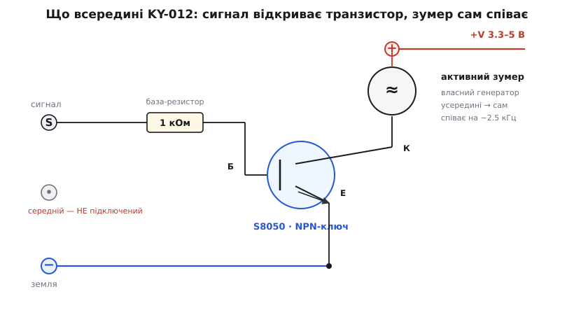
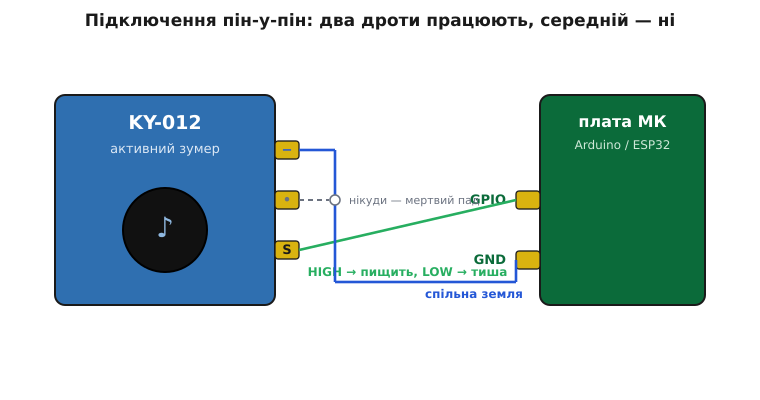

# KY-012 — активний зумер

<preknowlist>
- [KY-серія (Keyes 37-в-1)](book:sensors/ky-series) — спільний формат цих синіх платок: гребінка S / + / −, живлення в середині, три лекала поведінки; KY-012 — представник лекала «цифровий випромінювач».
- [Бузер активний і пасивний](book:programming/pwm/comp-buzzer.md) — головна розвилка: активний має власний генератор і видає один фіксований тон від сталого живлення; пасивний мовчить без зовнішнього ШІМ. KY-012 — саме активний.
- [П'єзоефект](book:physics/piezoelectric-effect) — напруга вигинає п'єзопластину, перемикання туди-сюди штовхає повітря й народжує звук; це фізична основа того, що всередині пищить.
- [Рівні «0» і «1»](book:electronics/logic-levels-as-ranges) — що таке HIGH і LOW на піні й чому напруга живлення визначає, чи вистачить сигналу відкрити транзистор.
- [Транзистор як ключ](book:electronics/transistor-switch) — як маленький струм у базу вмикає більший струм у навантаженні; на платі KY-012 стоїть саме такий ключ.
- [GPIO — вивід загального призначення](book:electronics/gpio) — цифровий вивід, що видає «0» або «1»; сигнальний штир зумера висить на одному такому.
</preknowlist>

На макетній платі серед синіх KY-платок трапляється одна, у якої зверху сидить чорний циліндрик завбільшки з горошину, заклеєний наліпкою з дірочкою або без, а знизу — три штирі гребінки з написом на кшталт `S`, порожнеча, `−`. Це **KY-012** — модуль активного зумера (англ. *buzzer* — той, що дзижчить; від *buzz* — дзижчання). Подаси на нього одиницю з мікроконтролера — і він одразу заводить рівний різкий писк, десь на дві з половиною тисячі коливань за секунду. Зніми сигнал — замовкне. Оце і все, що він уміє: один тон, увімк-вимк.

Саме ця простота робить його улюбленим першим «голосом» для навчального проєкту: сигнал готовності, «біп» на натиснуту клавішу, тривога, коли давач щось помітив. Керуєш ним буквально як світлодіодом — `digitalWrite(pin, HIGH)`, і жодної мороки з частотами. Але за трьома штирями ховаються дві речі, на яких новачок стабільно спотикається: **середній штир, який нікуди не веде**, і той факт, що всередині платки не просто пищалка, а маленька схема з транзистором. Розберімо цей конкретний модуль так, щоб упізнати його серед схожих, під'єднати з першого разу і не піти хибним шляхом за неправильними картинками, яких у мережі повно.

## Активний — означає «сам собі генератор»

Слово «активний» тут — не про потужність, а про те, **чи має пристрій усередині власне джерело коливань**. І це найважливіша характеристика зумера, бо від неї залежить геть усе — і як його вмикати, і що він може, а чого ні.

Голий п'єзовипромінювач — це просто мембрана: подаси напругу, вона вигнеться і завмре; знімеш — вернеться. Щоб вона *звучала*, її треба **розгойдувати** — швидко перемикати напругу туди-сюди тисячі разів на секунду. Питання лише в тому, хто це перемикання робить. Тут і проходить межа між двома різновидами, яку детальніше розібрано в загальній вставці про [активний і пасивний бузер](book:programming/pwm/comp-buzzer.md):

- **Пасивний** зумер (як [KY-006](book:actuators/ky-006-buzzer)) генератора не має. Він чекає, щоб мікроконтролер сам подавав йому меандр потрібної частоти — і тоді співає ту ноту, яку йому диктують. Це дає мелодії, але коштує пінового таймера й трохи коду.
- **Активний** зумер (наш KY-012) носить генератор **усередині**. Подаси йому сталу напругу — крихітна схема всередині сама почне розгойдувати мембрану на своїй заводській частоті. Твоя робота зводиться до «дати живлення / забрати живлення».

> 🔧 **Навіщо це.** Активний зумер знімає з мікроконтролера і піни, і такт. Тобі не треба крутити ШІМ, не треба тримати зайнятим апаратний таймер, не треба навіть думати про частоту — достатньо одного звичайного цифрового виводу і двох рядків коду. Ціна цієї зручності — **ти не керуєш висотою тону**: частота зашита заводом (тут ≈ 2.5 кГц) і не міняється. Тому вибір між активним і пасивним — це вибір «один простий біп задарма» проти «будь-яка нота, але сам грай її сигналом». Треба лише сповістити («готово», «помилка», «увага») — бери активний і не думай; треба мелодію чи змінний тон — тільки пасивний.

Ця заводська частота вибрана не випадково: близько 2–3 кГц — приблизно та смуга, до якої людське вухо найчутливіше, тому дешева пищалка на кількох міліватах чутна крізь шум кімнати. KY-012 дає **приблизно 2.5 кГц (з розкидом ±300 Гц)** і на відстані 10 см видає близько 85 децибел — це помітно голосно, як настирливий будильник, тож для тривоги його стане з головою.

## Що всередині платки: не пищалка, а ключ із пищалкою

Якби на платі стояв **тільки** зумер, вона була б безглуздою — сам зумер уже має дві ніжки, паяй та й годі. Уся суть модуля в тому, що навколо пищалки додано **обв'язку, яка дозволяє керувати нею прямо з логічного виводу**, не боячись його спалити. І головна деталь цієї обв'язки — **транзистор-ключ**.

Придивімося, чому він потрібен. Активний зумер на повній гучності тягне до 30 міліампер. Багато логічних виводів таке ще потягнуть, але покладатися на це — погана звичка: у частини мікроконтролерів пін віддає безпечно менше, а на межі струму просідає напруга й гріється кристал. Розробник модуля прибирає це питання раз і назавжди: між живленням і зумером ставить [транзистор як ключ](book:electronics/transistor-switch), а сигнальний вивід заводить лише на його **базу** — крізь струмообмежувальний резистор. Тепер робочий струм зумера тече не через пін, а через транзистор із шини живлення; від піна ж потрібні лише мікроампери, щоб цей ключ відкрити.


*Сигнал з піна йде на базу транзистора S8050 через резистор 1 кОм (він обмежує струм бази й береже і транзистор, і пін). Поки на S нуль — транзистор закритий, кола немає, тиша. Подаси HIGH — транзистор відкривається, струм тече з +V крізь зумер у колектор і далі в землю, а власний генератор зумера озвучує мембрану. Середній штир до схеми не приєднаний.*

Конкретика цієї платки, яку варто знати: транзистор — **S8050** (поширений маломпотужний NPN), базовий резистор — **1 кОм**. Ланцюжок подій, коли ти виставляєш на піні одиницю, читається зліва направо: напруга з виводу → крізь 1 кОм у базу → транзистор S8050 відкривається → замикається коло «+V → зумер → колектор → емітер → земля» → на зумер приходить живлення → його **внутрішній генератор** сам розгойдує п'єзомембрану → лунає тон. Прибираєш одиницю — база знеструмлюється, транзистор закривається, коло рветься, звук гасне. Транзистор тут працює двома корисними способами відразу: **розвантажує пін** (робочий струм бере не з нього) і **підсилює** — кількох мікроампер бази досить, щоб пропустити всі 30 міліампер зумера, тож пищить він на повну.

> 🔧 **Навіщо це.** Ключ на платі означає, що KY-012 можна чіпляти прямо до GPIO і 3.3-вольтової, і 5-вольтової плати, не рахуючи струм і не боячись за вивід — обв'язка вже про це подбала. Але з цього ж випливає, чому середній штир «не той, що ти думаєш»: живлення зумера заведено **всередині плати** на шину через транзистор, а не виведене окремим контактом так, як на звичайних давачах серії. Тому звична для KY-модулів примовка «плюс — це середній штир» на цій платці **зраджує**, і саме на цьому губиться найбільше часу.

## Три штирі, з яких працюють два

Ось де KY-012 ламає очікування. Уся [KY-серія](book:sensors/ky-series) привчає: три штирі — це `S`, `+` (посередині), `−`, і живлення сидить у середині навмисне, щоб випадково не зіскочити дротом. На більшості модулів так і є. **На KY-012 — ні.**

На стандартній платі Keyes контакти такі:

```
S        —  сигнал: сюди заводиш цифровий вивід мікроконтролера (вхід модуля!)
середній —  НЕ підключений: доріжка обривається пустим падом, нікуди не веде
−        —  земля (GND): на спільну землю з платою
```

Тобто робочих дротів **лише два**: сигнал на GPIO і земля на GND. Середній штир — це **мертвий пад**: фізично він стоїть, але доріжки від нього немає, і подавати на нього щось — марно (у кращому разі нічого не станеться, бо він ні до чого не приєднаний). Живлення зумер отримує не з окремого штиря, а **через сигнальний вивід**: коли ти даєш на `S` високий рівень, той самий рівень через резистор відкриває транзистор і живить пищалку. Сигнал і живлення тут — одне й те саме.


*Два дроти, що працюють: `S` → будь-який цифровий GPIO плати (звідси приходить HIGH/LOW), `−` → GND (спільна земля обов'язкова). Середній штир не під'єднуєш нікуди — він ні до чого не веде. Керування: HIGH на GPIO — зумер пищить, LOW — мовчить.*

Це джерело сумної класики: у мережі гуляє купа схем підключення KY-012, де середній штир підписано як `+V` і радять завести його на 5 вольтів. **Такі схеми хибні** для стандартної платки — вони переносять на KY-012 звичку з інших KY-модулів. Підключиш за такою картинкою, лишивши `S` без сигналу, — зумер мовчатиме, бо весь механізм тримається на тому, що керує саме сигнальний вивід. Правило просте й рятівне: **на KY-012 дивись на букви, а середній штир не чіпай**. Робочих дротів два.

(Дрібне застереження про клони: KY-серію копіюють усі, і зрідка трапляється платка, де розводку зробили інакше — наприклад, задіяли всі три контакти. Це виняток, не норма. Тому загальне правило серії лишається головним: **звіряй написи конкретної платки перед підключенням**, а не покладайся на пам'ять чи чужу картинку. Якщо `S` + `−` не запищали — тоді вже придивляйся до середнього.)

> 🔧 **Навіщо це.** Два дроти замість трьох — це не дрібниця, а безпосередній наслідок схемотехніки модуля, і плутанина тут коштує найбільше часу з усього KY-012. Людина під'єднує «як усі KY» — плюс у середину, — залишає сигнальний штир без сигналу й півгодини шукає «поганий контакт» або «биту платку», хоча платка ціла, а винна одна неправильна картинка. Запам'ятай механізм — «сигнал і є живлення, живить через транзистор» — і питання «куди середній штир» відпадає само: нікуди.

## Як увімкнути з коду: це просто цифровий вивід

Оскільки живлення зумера робить сам сигнал, керування зводиться до звичайного цифрового виводу — рівно як зі світлодіодом. Ніякої ШІМ, ніяких таймерів, ніякого `tone()`. Один пін у режимі виходу: HIGH — пищить, LOW — тиша.

Зумер сидить на залізі мікроконтролера, тож приклад природно лягає і на Arduino-фреймворк (C++), і на MicroPython — покажу обидва.

:::tabs
```cpp
// KY-012 активний зумер.  S → пін 8;  − → GND;  середній штир — нікуди.
const int BUZZER = 8;

void setup() {
  pinMode(BUZZER, OUTPUT);   // сигнальний штир — як звичайний вихід
}

void loop() {
  digitalWrite(BUZZER, HIGH); // подали одиницю → транзистор відкрився → пищить (~2.5 кГц)
  delay(200);                 // 0.2 с звуку
  digitalWrite(BUZZER, LOW);  // забрали → тиша
  delay(1800);                // 1.8 с паузи — виходить «біп» раз на 2 секунди
}
```
```python
# KY-012 активний зумер.  S → пін 8;  − → GND;  середній штир — нікуди.
from machine import Pin
import time

buzzer = Pin(8, Pin.OUT)      # сигнальний штир — як звичайний вихід

while True:
    buzzer.value(1)           # одиниця → транзистор відкрився → пищить (~2.5 кГц)
    time.sleep_ms(200)        # 0.2 с звуку
    buzzer.value(0)           # нуль → тиша
    time.sleep_ms(1800)       # 1.8 с паузи
```
:::

Порівняй це з пасивним зумером: там довелося б налаштовувати ШІМ-канал, задавати частоту кожної ноти, стежити, щоб `0 Гц` справді дало тишу. Тут — нічого з цього. **Уся «мелодія» KY-012 — це ритм увімкнень і вимкнень**: короткі однакові біпи для «готово», довгий безперервний тон для тривоги, серія швидких — для помилки. Висоту ти не змінюєш, але ритмом можна сказати навдивовижу багато. Готову невелику бібліотечку зі зручними «біп раз», «біп N разів», «тривога» винесено в [окремий опис API](book:actuators/ky-012-buzzer/proj-blink-beep.md), щоб не роздувати цей текст патернами.

## Характеристики, які варто знати

Зведімо в одне місце те, за чим упізнають і підбирають саме цей модуль:

```
Тип               активний п'єзозумер (генератор усередині)
Робоча напруга    3.3 – 5 В  (працює і з 3.3-, і з 5-вольтовою логікою)
Струм             до ≈ 30 мА (на повній гучності)
Частота тону      ≈ 2.5 кГц ± 300 Гц  (фіксована, не змінюється)
Гучність          ≈ 85 дБ на відстані 10 см
Керування         HIGH-тригер: одиниця пищить, нуль мовчить
Робочі штирі      S (сигнал/живлення) + − (земля); середній — NC
На платі          NPN-транзистор S8050 + базовий резистор 1 кОм
Температура       робоча −20…+70 °C
```

Кілька практичних наслідків із цієї таблички. **Напруга 3.3–5 В** означає, що модуль всеїдний: транзистор-ключ розв'язує зумер від логіки, тож і ESP32 на 3.3 В, і Arduino на 5 В керують ним однаково, без переробок (на 5 В зумер трохи гучніший, бо на нього приходить більше напруги). **HIGH-тригер** тут — норма стандартної платки: спокій — це нуль на піні, звук — одиниця; жодної інверсії, на відміну від багатьох компараторних KY-модулів із їхнім вивернутим `DO`. **Фіксована частота** — це не вада, а сама природа активного зумера: хочеш іншу висоту чи мелодію — це вже задача для пасивного, а KY-012 знає рівно одну ноту й видає її бездоганно надійно.

## Граблі, на яких спотикаються з KY-012

Зберімо в одному місці те, що з'їдає найбільше часу саме з цим модулем.

**Плутанина з середнім штирем.** Найчастіша й найпідступніша. Звичка «плюс — у середину» з інших KY-модулів приводить до схеми, де сигнальний штир лишається без діла, а живлення марно подають на мертвий пад. Наслідок — тиша й пошук неіснуючої несправності. **Робочих дротів два: `S` на GPIO, `−` на GND**, середній не чіпаєш.

**Довіра до чужих картинок.** У мережі гуляють схеми KY-012 з підписом `+V` на середньому штирі. Вони помилкові для стандартної платки. Не збирай наосліп за першою знайденою картинкою — звір з написами на **своїй** платі; якщо `S`+`−` не запищали, тоді вже придивляйся до варіанту-клона.

**Очікування мелодії від активного зумера.** Спроба «зіграти» на KY-012, подаючи ШІМ чи різні частоти, ні до чого: генератор усередині все одно веде свою заводську ноту, а зовнішня частота лише вмикає-вимикає її. Змінні тони й мелодії — це [пасивний зумер](book:actuators/ky-006-buzzer), не цей.

**Плутанина активного з пасивним у коробці.** Дві однакові на вигляд платки — KY-006 і KY-012 — легко переплутати. Найшвидший тест: **дай на сигнальний штир сталу одиницю**. Активний (KY-012) одразу зайдеться рівним писком; пасивний (KY-006) лише тихо клацне й замовкне, бо йому нема чим себе розгойдати. Пищить від сталого рівня — активний.

**Безперервний писк дратує на робочому столі.** 85 децибел зблизька — це справді голосно й швидко набридає під час налагодження. На час розробки зменшуй тривалість біпів у коді або тимчасово заклей отвір — на робочому столі повний безперервний тон витримати важко.

**«Тихіше, ніж очікував» на 3.3 В.** На нижчій напрузі зумер трохи тихіший, ніж на 5 В, — це нормально: на п'єзо приходить менша амплітуда. Якщо для тривоги треба максимум гучності, а плата дозволяє, живи проєкт від 5 В.
