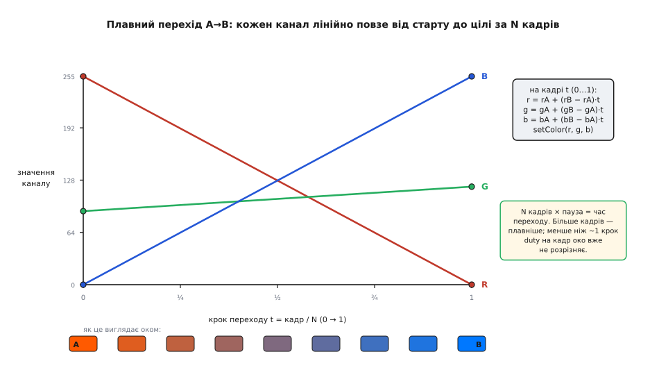

# 📋 Керування KY-016 у коді: setColor, гамма, катод/анод і LEDC на ESP32

Запалити на KY-016 один колір — це три записи шпаруватості ШІМ, по одному на канал (на Arduino — три рядки `analogWrite`). Але щойно проєкт хоче більшого — плавно перетікати між кольорами, дихати світлом, показувати рівну на око яскравість, та ще й працювати на платі, яка може виявитися і зі спільним катодом, і зі спільним анодом, — три голі записи шпаруватості розсипаються по всій програмі, а разом із ними розсипаються й помилки: тут забув інвертувати, там пін виявився не-PWM, а колір «жовтий» чомусь світить бузковим. Розберімо, як зібрати з цих трьох рядків **невеличку бібліотечку керування**, яка ховає всі ці дрібниці за парою чесних функцій — `setColor(r, g, b)` і `fade(...)` — і працює однаково, хоч би яка платка тобі трапилась.

Ідея всієї вставки проста: **весь бруд — в одному місці**. Пряме звертання до пінів, інверсія для анода, гамма-корекція, різниця між платформами (Uno, ESP32, STM32) — усе це живе всередині кількох функцій, а решта програми говорить лише «зроби помаранчевий» чи «перетечи за секунду в блакитний». Коли бруд зібрано в одну купку, його легко один раз налагодити — і забути.

## Крок перший: чесний setColor, що знає про катод і анод

Найдрібніша, але найпідступніша річ у KY-016 — те, що плата буває **двох дзеркальних типів**. Зі спільним катодом (`−` на землі) колір горить, коли на його пін подано «+»: `255` — повна яскравість, `0` — темрява. Зі спільним анодом (`+` на живленні) усе навпаки: колір вмикає **низький** рівень на піні, тож `0` — повна яскравість, а `255` — темрява. Якщо жорстко зашити один варіант, на іншій платі весь код поводитиметься навиворіт.

Правильна відповідь — **не зашивати, а винести в прапорець**. Заведи одну булеву змінну «це спільний анод?» і став перед самим записом шпаруватості рівно одне питання: якщо анод — подавай `255 − value` замість `value`. Уся дзеркальність зникає в одному місці, а весь інший код пише яскравість «як думає», по-людськи: `255` завжди означає «яскраво».


*Та сама бажана яскравість «на ¾» дає на піні протилежну шпаруватість залежно від типу плати. Спільний катод: `duty = 191`. Спільний анод: `duty = 255 − 191 = 64`. Один прапорець `common_anode` з інверсією `255 − value` обслуговує обидві плати — а весь решта код задає яскравість однаково, `255` = «яскраво».*

Ось базова версія — те саме `setColor`, що обіцяла головна стаття, але вже з підтримкою обох типів. Завдання на будь-якому МК одне: три канали ШІМ і одна-єдина точка, де живе інверсія; різняться лише команди, якими шпаруватість задають:

:::tabs
```arduino
// --- KY-016: керування кольором, катод АБО анод ---
const uint8_t PIN_R = 9;      // усі три — PWM-піни (з «~» на Uno)
const uint8_t PIN_G = 10;
const uint8_t PIN_B = 11;

// true  — плата зі СПІЛЬНИМ АНОДОМ (колір вмикає низький рівень)
// false — плата зі СПІЛЬНИМ КАТОДОМ (колір вмикає високий рівень)
const bool COMMON_ANODE = false;

// один вихід каналу: тут і тільки тут живе інверсія для анода
static inline uint8_t level(uint8_t v) {
  return COMMON_ANODE ? (uint8_t)(255 - v) : v;
}

void setColor(uint8_t r, uint8_t g, uint8_t b) {
  analogWrite(PIN_R, level(r));   // r,g,b — «людська» яскравість: 255 = яскраво
  analogWrite(PIN_G, level(g));
  analogWrite(PIN_B, level(b));
}

void setup() {
  pinMode(PIN_R, OUTPUT);
  pinMode(PIN_G, OUTPUT);
  pinMode(PIN_B, OUTPUT);
  setColor(255, 90, 0);           // теплий помаранчевий — однаково на обох типах плат
}

void loop() {}
```
```esp-idf
// --- KY-016 на ESP-IDF: три канали апаратного модуля LEDC ---
#include "driver/ledc.h"
#include "esp_err.h"

#define PIN_R 25
#define PIN_G 26
#define PIN_B 27

// true — плата зі СПІЛЬНИМ АНОДОМ (колір вмикає низький рівень)
#define COMMON_ANODE 0

// один вихід каналу: тут і тільки тут живе інверсія для анода
// (LEDC уміє інвертувати й апаратно — flags.output_invert; лишаємо явно, щоб було видно)
static inline uint32_t level(uint8_t v) { return COMMON_ANODE ? 255u - v : v; }

static void rgb_init(void) {
    ledc_timer_config_t timer = {
        .speed_mode      = LEDC_LOW_SPEED_MODE,
        .timer_num       = LEDC_TIMER_0,
        .duty_resolution = LEDC_TIMER_8_BIT,   // шкала duty 0..255, як на Uno
        .freq_hz         = 5000,               // 5 кГц — без видимого мерехтіння
        .clk_cfg         = LEDC_AUTO_CLK,
    };
    ESP_ERROR_CHECK(ledc_timer_config(&timer));

    const int pins[3] = { PIN_R, PIN_G, PIN_B };
    for (int i = 0; i < 3; i++) {
        ledc_channel_config_t ch = {
            .gpio_num   = pins[i],
            .speed_mode = LEDC_LOW_SPEED_MODE,
            .channel    = (ledc_channel_t)(LEDC_CHANNEL_0 + i),
            .timer_sel  = LEDC_TIMER_0,
            .duty       = 0,
            .hpoint     = 0,
        };
        ESP_ERROR_CHECK(ledc_channel_config(&ch));
    }
}

static void write_ch(ledc_channel_t ch, uint8_t v) {
    ledc_set_duty(LEDC_LOW_SPEED_MODE, ch, level(v));
    ledc_update_duty(LEDC_LOW_SPEED_MODE, ch);   // duty набирає сили лише тут
}

void set_color(uint8_t r, uint8_t g, uint8_t b) {
    write_ch(LEDC_CHANNEL_0, r);   // r,g,b — «людська» яскравість: 255 = яскраво
    write_ch(LEDC_CHANNEL_1, g);
    write_ch(LEDC_CHANNEL_2, b);
}

void app_main(void) {
    rgb_init();
    set_color(255, 90, 0);         // теплий помаранчевий
}
```
```stm32
// --- KY-016 на STM32 HAL: три канали ОДНОГО таймера ---
// TIM3 CH1/CH2/CH3 у режимі PWM Generation, ARR = 255 → шкала duty 0..255;
// частоту дає прескалер: f = f_TIM / (PSC+1) / (ARR+1) ≈ 5 кГц.
#include "main.h"

extern TIM_HandleTypeDef htim3;   // дескриптор таймера, згенерований CubeMX

#define COMMON_ANODE 0
#define DUTY_MAX 255              // = ARR таймера

// один вихід каналу: тут і тільки тут живе інверсія для анода
static inline uint32_t level(uint8_t v) {
  return COMMON_ANODE ? (uint32_t)(DUTY_MAX - v) : (uint32_t)v;
}

void set_color(uint8_t r, uint8_t g, uint8_t b) {
  __HAL_TIM_SET_COMPARE(&htim3, TIM_CHANNEL_1, level(r));   // пишемо в CCR каналу
  __HAL_TIM_SET_COMPARE(&htim3, TIM_CHANNEL_2, level(g));
  __HAL_TIM_SET_COMPARE(&htim3, TIM_CHANNEL_3, level(b));
}

void rgb_init(void) {
  HAL_TIM_PWM_Start(&htim3, TIM_CHANNEL_1);   // пустити ШІМ на трьох каналах
  HAL_TIM_PWM_Start(&htim3, TIM_CHANNEL_2);
  HAL_TIM_PWM_Start(&htim3, TIM_CHANNEL_3);
  set_color(255, 90, 0);                      // теплий помаранчевий
}
```
:::

> 🔧 **Навіщо це.** Прапорець замість зашитого варіанта — це не педантизм, а страховка від найтиповішої втрати вечора. Замовив ти дві однакові з вигляду платки в різних продавців — одна катодна, друга анодна, і зовні їх не відрізниш. Код, у якому інверсія схована за одним `COMMON_ANODE`, переноситься з плати на плату **зміною одного рядка**, а не полюванням на кожен `analogWrite` у програмі. Той самий прийом — «весь варіант заліза за одним прапорцем» — рятує скрізь, де є дзеркальна логіка: активний-низький скидання, інверсні входи оптопар, реле, що замикається землею.

Зверни увагу на функцію `level` — вона крихітна, `static inline`, і компілятор при `COMMON_ANODE = false` викине з неї геть усе, лишивши голий запис `v` у канал. Тобто підтримка обох типів **нічого не коштує** на етапі виконання: гілку, якої немає, компілятор бачить наскрізь і прибирає. Ти платиш за гнучкість лише читабельністю вихідника, а не швидкодією.

## Крок другий: fade — плавний перехід між двома довільними кольорами

«Запалити колір» — це миттєвий стрибок. А душа RGB — у **переходах**: помаранчевий, що за секунду перетікає в блакитний, вогник, що дихає то яскравіше то тьмяніше. Як зробити плавний перехід із двох `setColor`?

Ідея — та сама, що й у будь-якій анімації: розбити шлях на **багато дрібних кроків** і на кожному трохи посунутися до цілі. Колір — це три числа, тож перехід від кольору A до кольору B — це три незалежні поповзання: червоний повзе від `rA` до `rB`, зелений від `gA` до `gB`, синій від `bA` до `bB`. Якщо кожен канал іде **прямою лінією**, дістанемо рівномірне лінійне перетікання. На частці шляху `t` (від 0 на старті до 1 у кінці) значення каналу — це:

```
r(t) = rA + (rB − rA) · t
g(t) = gA + (gB − gA) · t
b(t) = bA + (bB − bA) · t
```

При `t = 0` виходить рівно A, при `t = 1` — рівно B, а посередині — чесна суміш. Ось як три канали їдуть кожен своєю прямою і що око бачить уздовж переходу:



*Перехід від A = (255, 90, 0) до B = (0, 120, 255) як три незалежні лінійні поповзання. На кроці `t` кожен канал — це `значення_A + (значення_B − значення_A) · t`. Смуга внизу — та сама формула, розрахована для дев'яти кадрів: колір рівно перетікає з помаранчевого в блакитний. Кількість кадрів N і пауза між ними разом задають час і плавність переходу.*

Тепер це в коді. Найпростіший, **блокувальний** варіант — цикл на N кроків із паузою (а де таймер уміє доводити шпаруватість до цілі сам, цикл не потрібен зовсім — вкладка ESP-IDF):

:::tabs
```arduino
// плавний перехід поточного кольору A → цільового B за час ~ (steps * wait) мс
void fade(uint8_t rA, uint8_t gA, uint8_t bA,
          uint8_t rB, uint8_t gB, uint8_t bB,
          uint16_t steps, uint16_t wait) {
  for (uint16_t i = 0; i <= steps; i++) {
    float t = (float)i / steps;                 // 0.0 → 1.0
    uint8_t r = rA + (int)((rB - rA) * t);      // лінійна інтерполяція каналу
    uint8_t g = gA + (int)((gB - gA) * t);
    uint8_t b = bA + (int)((bB - bA) * t);
    setColor(r, g, b);
    delay(wait);                                // пауза між кадрами
  }
}

void loop() {
  fade(255, 90, 0,  0, 120, 255,  60, 12);   // помаранчевий → блакитний, ~0.7 с
  fade(0, 120, 255,  255, 90, 0,  60, 12);   // і назад
}
```
```esp-idf
// На ESP32 перехід уміє саме залізо: LEDC має вбудований фейдер, який доводить
// duty до цілі за задані мілісекунди без участі процесора. Кадри рахувати не треба.
#include "driver/ledc.h"

static void fade_ch(ledc_channel_t ch, uint8_t v, uint32_t ms) {
    ledc_set_fade_with_time(LEDC_LOW_SPEED_MODE, ch, level(v), ms);
    ledc_fade_start(LEDC_LOW_SPEED_MODE, ch, LEDC_FADE_NO_WAIT);  // не блокує задачу
}

void fade_to(uint8_t r, uint8_t g, uint8_t b, uint32_t ms) {
    fade_ch(LEDC_CHANNEL_0, r, ms);   // три канали їдуть до цілі одночасно
    fade_ch(LEDC_CHANNEL_1, g, ms);
    fade_ch(LEDC_CHANNEL_2, b, ms);
}

static void rgb_task(void *arg) {
    ESP_ERROR_CHECK(ledc_fade_func_install(0));   // один раз: сервіс фейду + його ISR
    for (;;) {
        fade_to(0, 120, 255, 700);                // помаранчевий → блакитний, 0.7 с
        vTaskDelay(pdMS_TO_TICKS(700));
        fade_to(255, 90, 0, 700);                 // і назад
        vTaskDelay(pdMS_TO_TICKS(700));
    }
}
// у app_main: xTaskCreate(rgb_task, "rgb", 3072, NULL, 5, NULL);
```
```stm32
// плавний перехід поточного кольору A → цільового B за час ~ (steps * wait) мс
void fade(uint8_t rA, uint8_t gA, uint8_t bA,
          uint8_t rB, uint8_t gB, uint8_t bB,
          uint16_t steps, uint16_t wait) {
  for (uint16_t i = 0; i <= steps; i++) {
    float t = (float)i / steps;                 // 0.0 → 1.0
    uint8_t r = rA + (int)((rB - rA) * t);      // лінійна інтерполяція каналу
    uint8_t g = gA + (int)((gB - gA) * t);
    uint8_t b = bA + (int)((bB - bA) * t);
    set_color(r, g, b);
    HAL_Delay(wait);                            // пауза між кадрами, крок SysTick — 1 мс
  }
}

int main(void) {
  /* HAL_Init(), SystemClock_Config(), MX_TIM3_Init() — від CubeMX */
  rgb_init();
  while (1) {
    fade(255, 90, 0,  0, 120, 255,  60, 12);   // помаранчевий → блакитний, ~0.7 с
    fade(0, 120, 255,  255, 90, 0,  60, 12);   // і назад
  }
}
```
:::

Одна тонкість у арифметиці: різницю `(rB - rA)` треба рахувати **зі знаком**, бо канал може і спадати (червоний з 255 до 0 дає різницю −255). Тому множення `(rB - rA) * t` беремо в `int`, а вже суму присвоюємо в `uint8_t` — інакше на спадному каналі отримаєш переповнення й колір смикнеться. Дрібниця, але саме на ній ламаються перші саморобні fade.

**Скільки брати кроків?** Рівно стільки, щоб око не бачило «сходинок». Канал має 256 рівнів, тож більше ніж ~256 кроків на повний розмах — марнування: сусідні кадри дадуть однакове ціле `duty`, і плавніше вже не стане. Знизу межа — коли між кадрами стрибок duty завеликий і видно рвані переходи. Практично **30–100 кроків** на перехід виглядають гладко; час переходу задає добуток `steps · wait`.

## Крок третій: чому півшляху — це не «півколір», і як лікує гамма

Запусти fade з попереднього коду й придивися: перехід **нерівний**. У темній частині колір міняється ривками й швидко «вистрілює» в яскравість, а у світлій — ніби застигає, майже не рухаючись. Хоча `duty` повзе рівно, **на око** яскравість стрибає на початку й тупцює в кінці. Чому?

Бо око сприймає світло **не лінійно**. Подвоївши шпаруватість ШІМ, ти подвоюєш фізичну кількість світла — але око каже, що стало ясніше лише «трохи». Наше сприйняття яскравості ближче до **степеневої** залежності: приблизно `сприйняте ≈ фізичне^(1/2.2)`. Через це шпаруватість 50 % око бачить не як «половину», а лише як десь **чверть** яскравості. Лінійний по `duty` перехід тому й здається кривим: він рівний у фізиці, але не в сприйнятті.

Це та сама **гамма** (грец. буква γ, якою в аналізі зображень позначають показник цієї кривої), що керує яскравістю на кожному моніторі. Число 2.2 стало практичним стандартом ще з часів електронно-променевих моніторів, у яких яскравість променя залежала від напруги приблизно як `напруга^2.2`; згодом виявилося, що ця крива майже збігається з нелінійністю ока, тож її лишили як зручний стандарт кодування яскравості. *(Точніша модель сприйняття — **CIE L\*** з формули колірного простору CIELAB, і для ідеального балансу беруть саме її; але для індикатора-вогника на KY-016 гамма 2.2 дає результат, що вже не відрізниш оком, і рахується таблицею тривіально. Статус: 2.2 — усталений практичний стандарт, CIE L\* — точніша, але для цього завдання надлишкова.)*

Лікування пряме: між «бажаною яскравістю» і «шпаруватістю, яку подати на пін» вставляємо **криву-перекладач**. Хочеш яскравість `L` (0…255) — подай на пін не `L`, а `255 · (L / 255)^2.2`, заокруглене до цілого. Тоді рівний по `L` перехід стане рівним **на око**, бо крива компенсує нелінійність сприйняття наперед.

Рахувати `pow()` на кожен піксель у циклі — марнотратно (особливо на Uno без апаратної плаваючої коми). Тому криву **прораховують один раз таблицею** на всі 256 значень і кладуть у постійну пам'ять, а в роботі просто беруть готове число за індексом. На AVR (Uno) флеш і ОЗП — різні адресні простори, тож там таблиця вимагає `PROGMEM` і `pgm_read_byte`; на 32-бітних МК (ESP32, STM32) простір спільний і вистачає звичайного `const uint8_t GAMMA8[256] = {…}` із прямим `GAMMA8[v]`:

```avr
#include <avr/pgmspace.h>

// gamma-таблиця: вхід «бажана яскравість» 0..255 → вихід «duty на пін» 0..255,
// прорахована за duty = round(255 * (in/255)^2.2). Лежить у флеші (PROGMEM).
const uint8_t GAMMA8[256] PROGMEM = {
    0,  0,  0,  0,  0,  0,  0,  0,  0,  0,  0,  0,  0,  0,  0,  1,
    1,  1,  1,  1,  1,  1,  1,  1,  1,  2,  2,  2,  2,  2,  2,  2,
    3,  3,  3,  3,  3,  4,  4,  4,  4,  5,  5,  5,  5,  6,  6,  6,
    6,  7,  7,  7,  8,  8,  8,  9,  9,  9, 10, 10, 11, 11, 11, 12,
   12, 13, 13, 13, 14, 14, 15, 15, 16, 16, 17, 17, 18, 18, 19, 19,
   20, 20, 21, 22, 22, 23, 23, 24, 25, 25, 26, 26, 27, 28, 28, 29,
   30, 30, 31, 32, 33, 33, 34, 35, 35, 36, 37, 38, 39, 39, 40, 41,
   42, 43, 43, 44, 45, 46, 47, 48, 49, 49, 50, 51, 52, 53, 54, 55,
   56, 57, 58, 59, 60, 61, 62, 63, 64, 65, 66, 67, 68, 69, 70, 71,
   73, 74, 75, 76, 77, 78, 79, 81, 82, 83, 84, 85, 87, 88, 89, 90,
   91, 93, 94, 95, 97, 98, 99,100,102,103,105,106,107,109,110,111,
  113,114,116,117,119,120,121,123,124,126,127,129,130,132,133,135,
  137,138,140,141,143,145,146,148,149,151,153,154,156,158,159,161,
  163,165,166,168,170,172,173,175,177,179,181,182,184,186,188,190,
  192,194,196,197,199,201,203,205,207,209,211,213,215,217,219,221,
  223,225,227,229,231,234,236,238,240,242,244,246,248,251,253,255,
};

static inline uint8_t gamma8(uint8_t v) {
  return pgm_read_byte(&GAMMA8[v]);
}
```

Тепер `setColor` бере «людську» яскравість, **спершу проганяє її крізь гамму**, а вже тоді через інверсію катод/анод — на пін:

:::tabs
```arduino
void setColor(uint8_t r, uint8_t g, uint8_t b) {
  analogWrite(PIN_R, level(gamma8(r)));   // спершу гамма, потім катод/анод
  analogWrite(PIN_G, level(gamma8(g)));
  analogWrite(PIN_B, level(gamma8(b)));
}
```
```esp-idf
void set_color(uint8_t r, uint8_t g, uint8_t b) {
    write_ch(LEDC_CHANNEL_0, gamma8(r));   // level() сидить усередині write_ch
    write_ch(LEDC_CHANNEL_1, gamma8(g));   // — порядок той самий: гамма, потім анод
    write_ch(LEDC_CHANNEL_2, gamma8(b));
}
```
```stm32
void set_color(uint8_t r, uint8_t g, uint8_t b) {
  __HAL_TIM_SET_COMPARE(&htim3, TIM_CHANNEL_1, level(gamma8(r)));   // спершу гамма,
  __HAL_TIM_SET_COMPARE(&htim3, TIM_CHANNEL_2, level(gamma8(g)));   // потім катод/анод
  __HAL_TIM_SET_COMPARE(&htim3, TIM_CHANNEL_3, level(gamma8(b)));
}
```
:::

Порядок двох перетворень тут не байдужий: гамма — це **сприйняття** (перекладає бажану яскравість у фізичну шпаруватість), інверсія анода — це **електрика піна** (перекладає шпаруватість у рівень на дроті). Спершу вирішуємо, скільки світла хочемо (гамма), і аж потім — яким рівнем його на цій платі ввімкнути (інверсія). Переплутаєш порядок — на анодній платі гамма ляже навиворіт, і крива «виправлятиме» темряву замість світла.

> 🔧 **Навіщо це.** Гамма-таблиця — це різниця між «дешевим саморобним» і «фабрично-плавним» світлом. Без неї дихання світла смикається й гасне ривками; з нею вогник розгоряється й тане так само м'яко, як індикатор на дорогому приладі. Той самий трюк — «таблиця замість формули в циклі» — усюди в вбудованих системах, де порахувати наперед дешевше, ніж рахувати щоразу: синус для генерації тону, лінеаризація давача, перерахунок кодів. 256 байтів флешу за рівне на око світло — вигідний обмін.

Таблицю зручно не вписувати руками, а **згенерувати** — тим самим Python, що робить фігури. Ось короткий генератор, що друкує C-масив під будь-яку гамму:

```python
# друкує C-масив GAMMA8[256] для заданої гамми (за замовчуванням 2.2)
g = 2.2
vals = [round(255 * (i / 255) ** g) for i in range(256)]
print("const uint8_t GAMMA8[256] PROGMEM = {")
for i in range(0, 256, 16):
    print("  " + ",".join("%3d" % v for v in vals[i:i + 16]) + ",")
print("};")
```

## Крок четвертий: ESP32 — той самий колір, інша команда

На **[ESP32](book:boards/esp32-family)** уся логіка — `setColor`, інверсія, гамма, `fade` — лишається слово-в-слово. Міняється тільки **найнижчий шар**: як задати шпаруватість на піні. Команди `analogWrite` в Arduino-ESP32 довго не було зовсім (з'явилася пізно й лишається обгорткою), а рідний спосіб керувати ШІМ там — окремий апаратний модуль **LEDC** (LED Control), створений саме під світлодіоди. Замість одного `analogWrite` він розводить роботу на два кроки: спершу **налаштувати канал** (частота, роздільність), потім **прив'язати** його до піна — і аж тоді писати шпаруватість.

У класичному вигляді (Arduino-ESP32 версії 2.x) це три виклики:

:::tabs
```arduino
// ESP32 (Arduino-ESP32 2.x): три канали LEDC під три кольори KY-016
const uint8_t PIN_R = 25, PIN_G = 26, PIN_B = 27;   // на ESP32 підійде майже будь-який GPIO
const uint8_t CH_R = 0,  CH_G = 1,  CH_B = 2;       // три апаратні канали LEDC
const uint32_t PWM_FREQ = 5000;                      // 5 кГц — поза чутністю, без мерехтіння
const uint8_t  PWM_BITS = 8;                         // 8-бітна роздільність → duty 0..255

const bool COMMON_ANODE = false;

static inline uint8_t level(uint8_t v) {
  return COMMON_ANODE ? (uint8_t)(255 - v) : v;
}

void setColor(uint8_t r, uint8_t g, uint8_t b) {
  ledcWrite(CH_R, level(gamma8(r)));   // на ESP32 пишемо в КАНАЛ, не в пін
  ledcWrite(CH_G, level(gamma8(g)));
  ledcWrite(CH_B, level(gamma8(b)));
}

void setup() {
  ledcSetup(CH_R, PWM_FREQ, PWM_BITS);   // 1) налаштувати канал: частота + роздільність
  ledcSetup(CH_G, PWM_FREQ, PWM_BITS);
  ledcSetup(CH_B, PWM_FREQ, PWM_BITS);
  ledcAttachPin(PIN_R, CH_R);            // 2) прив'язати канал до фізичного піна
  ledcAttachPin(PIN_G, CH_G);
  ledcAttachPin(PIN_B, CH_B);
  setColor(255, 90, 0);
}

void loop() {}
```
```esp-idf
// Те саме без обгорток: ledcSetup — це ledc_timer_config(), ledcAttachPin —
// ledc_channel_config(), ledcWrite — ledc_set_duty() + ledc_update_duty().
ledc_timer_config_t timer = {
    .speed_mode      = LEDC_LOW_SPEED_MODE,
    .timer_num       = LEDC_TIMER_0,
    .duty_resolution = LEDC_TIMER_8_BIT,   // 1) роздільність: duty 0..255
    .freq_hz         = 5000,               // 2) частота: 5 кГц
    .clk_cfg         = LEDC_AUTO_CLK,
};
ESP_ERROR_CHECK(ledc_timer_config(&timer));

ledc_channel_config_t ch_r = {            // 3) канал ↔ пін: прив'язка окремим кроком
    .gpio_num = PIN_R, .speed_mode = LEDC_LOW_SPEED_MODE,
    .channel  = LEDC_CHANNEL_0, .timer_sel = LEDC_TIMER_0,
    .duty = 0, .hpoint = 0,
};
ESP_ERROR_CHECK(ledc_channel_config(&ch_r));   // так само CH_G/PIN_G і CH_B/PIN_B

ledc_set_duty(LEDC_LOW_SPEED_MODE, LEDC_CHANNEL_0, level(gamma8(r)));
ledc_update_duty(LEDC_LOW_SPEED_MODE, LEDC_CHANNEL_0);
```
```stm32
// Ті самі три ручки на STM32, лише називаються по-таймерному:
// роздільність = ARR, частота = f_TIM/((PSC+1)·(ARR+1)), канал ≠ пін.
TIM_HandleTypeDef htim3;

void rgb_init(void) {
  __HAL_RCC_TIM3_CLK_ENABLE();
  htim3.Instance = TIM3;
  htim3.Init.Prescaler = 65 - 1;              // 84 МГц / 65 ≈ 1.29 МГц
  htim3.Init.Period    = 256 - 1;             // ARR = 255 → duty 0..255 (8 біт)
  htim3.Init.CounterMode   = TIM_COUNTERMODE_UP;   // 1.29 МГц / 256 ≈ 5 кГц
  htim3.Init.ClockDivision = TIM_CLOCKDIVISION_DIV1;
  HAL_TIM_PWM_Init(&htim3);

  TIM_OC_InitTypeDef oc = { .OCMode = TIM_OCMODE_PWM1, .Pulse = 0,
                            .OCPolarity = TIM_OCPOLARITY_HIGH, .OCFastMode = TIM_OCFAST_DISABLE };
  HAL_TIM_PWM_ConfigChannel(&htim3, &oc, TIM_CHANNEL_1);   // канал 1 → PB4 (AF2)
  HAL_TIM_PWM_ConfigChannel(&htim3, &oc, TIM_CHANNEL_2);   // канал 2 → PB5
  HAL_TIM_PWM_ConfigChannel(&htim3, &oc, TIM_CHANNEL_3);   // канал 3 → PB0
  HAL_TIM_PWM_Start(&htim3, TIM_CHANNEL_1);
  HAL_TIM_PWM_Start(&htim3, TIM_CHANNEL_2);
  HAL_TIM_PWM_Start(&htim3, TIM_CHANNEL_3);
}
// (піни в режимі альтернативної функції — окремо, у HAL_TIM_MspPostInit)
```
:::

Три речі, які тут інші, ніж на Uno, і які варто зрозуміти, а не завчити:

Перше — **пишемо не в пін, а в канал**. `analogWrite(pin, v)` сам собі і канал, і пін; LEDC їх розділяє, бо один канал можна вивести на кілька пінів, а роздільність задають окремо. Тому `ledcWrite` бере **номер каналу** (`CH_R`), а не піна. Це не примха ESP32: у будь-якого МК з апаратним ШІМ шпаруватість живе в **каналі таймера**, а пін до нього лише прив'язують — на STM32 це регістр порівняння `CCR` каналу `TIM`, і пишеш ти теж не «в пін». `analogWrite(pin, v)` — саме та обгортка, що ховає цей поділ.

Друге — **роздільність задаєш сам**. `PWM_BITS = 8` дає звичну шкалу `duty 0…255` (максимум `2^8 − 1 = 255`), і вся гамма-таблиця та інверсія лишаються без змін. Хочеш тонше — постав 10 чи 12 біт, але тоді й `duty` треба масштабувати до `2^bits − 1`, і таблицю прораховувати на новий розмах. Для KY-016 восьми біт із головою.

Третє — **частоту теж задаєш сам**. На Uno вона фіксована (близько 490 Гц, а на пінах 5 і 6 — 980 Гц); на ESP32 бери кілька кілогерц (тут 5 кГц) — досить високо, щоб жодного мерехтіння не було видно навіть краєм ока чи на відео.

> 🔧 **Навіщо це.** Розділення «канал ↔ пін» у LEDC — не примха, а гнучкість, якої на Uno бракує. Апаратних каналів у ESP32 багато, частота й роздільність у кожного свої, тож той самий модуль однаково добре крутить і три кольори світлодіода, і сервопривід (50 Гц), і п'єзозумер (тон), і регулятор яскравості підсвітки — кожному своя частота на своєму каналі. Зрозумівши LEDC на трьох кольорах KY-016, ти вже вмієш апаратний ШІМ ESP32 для будь-чого.

**Обережно з версією ядра.** У Arduino-ESP32 **3.x** цей API **змінили**: `ledcSetup` і `ledcAttachPin` прибрали, зливши в одну команду `ledcAttach(pin, freq, resolution)` — вона й налаштовує, і прив'язує, а канал вибирає сама; `ledcWrite` тоді бере вже **пін**, а не канал. Той самий `setup` під нове ядро коротший:

```arduino
// ESP32 (Arduino-ESP32 3.x): ledcAttach замість ledcSetup + ledcAttachPin
void setup() {
  ledcAttach(PIN_R, PWM_FREQ, PWM_BITS);   // одна команда: канал вибереться сам
  ledcAttach(PIN_G, PWM_FREQ, PWM_BITS);
  ledcAttach(PIN_B, PWM_FREQ, PWM_BITS);
  setColor(255, 90, 0);
}
// і тоді у setColor: ledcWrite(PIN_R, ...), ledcWrite(PIN_G, ...), ledcWrite(PIN_B, ...)
// — пишемо в ПІН, канал більше не згадуємо
```

Це найтиповіша причина, чому чужий приклад для ESP32 «не збирається»: код писали під 2.x, а встановлене ядро — 3.x (або навпаки). Побачив помилку `'ledcSetup' was not declared` — не шукай хибу в схемі, глянь **версію ядра ESP32** у менеджері плат: 3.x хоче `ledcAttach`, 2.x — стару трійцю. *(Статус: усталено за офіційним посібником міграції Arduino-ESP32 2.x → 3.0.)*

## Складність і типові пастки

Уся бібліотечка — це десяток коротких функцій, і жодного важкого алгоритму в ній немає: інтерполяція лінійна (три множення на кадр), гамма — вибірка з таблиці (одне читання з флешу), інверсія — одне віднімання. Обчислювальна складність кожного `setColor` — стала, `O(1)`; `fade` — це `O(N)` за кількістю кадрів. На найслабшому Uno все крутиться з величезним запасом: вузьке місце тут не процесор, а швидкість, з якою око встигає бачити, тобто самі паузи `delay`.

Проте кілька місць ловлять регулярно — і майже всі вони не в алгоритмі, а на стику з залізом.

**Пін без апаратного PWM.** Найчастіша й найпідступніша: завів колір на звичайний цифровий пін (на Uno — без `~`), і `analogWrite` там мовчки працює як `digitalWrite` — колір або повністю ввімкнений, або вимкнений, без проміжних яскравостей. Симптом — «півкольори не виходять», fade стрибає між кількома чистими комбінаціями замість плавного перетікання. На Uno апаратний ШІМ мають лише піни **3, 5, 6, 9, 10, 11**. Лік: садити всі три кольори тільки на них. На іншому МК питання те саме, лише звучить як «чи виведений на цю ніжку канал таймера» — відповідь у таблиці альтернативних функцій даташита; на ESP32 матриця GPIO знімає питання майже зовсім, бо LEDC виводиться на будь-який вільний пін.

**Дрібниця про пін 5 і 6.** Якщо все-таки використовуєш їх, знай: їхній таймер (Timer 0) той самий, що обслуговує `millis()`, `micros()` і `delay()`. Сам `analogWrite` на них працює, але **не чіпай їхню частоту** вручну — зіб'єш відлік часу в усій програмі. Для трьох кольорів KY-016 надійніше взяти піни 9, 10, 11 (Timer 1 і Timer 2) і не турбувати таймер часу зовсім.

**Переплутаний порядок R / G / B.** Просиш червоний — світить синій. На деяких клонах піни підписані не `R G B −`, а в іншому порядку (буває `− R G B` чи `− G R B`). Спокуса — почати переставляти дроти навмання; правильно — **звірити написи на платі** й привести у відповідність номери пінів `PIN_R/PIN_G/PIN_B` у коді. Дроти лишаються, міняються три числа у вихіднику — і плутанина зникає.

**Дзеркальна логіка анода.** Код під катод (`255` — яскраво), а плата виявилася анодною — і все поводиться навиворіт: просиш темряву, а воно розгоряється; fade тече не туди. Лік уже вбудований — постав `COMMON_ANODE = true`, і `level()` сам інвертує кожен канал. Головне пам'ятати, що інверсія має стояти **після** гамми, а не до неї (інакше крива виправлятиме не той бік).

**Спокуса на `delay` у великому проєкті.** Показаний `fade` — **блокувальний**: усередині циклу сидить `delay`, і поки колір тече, плата не робить нічого іншого — не читає кнопку, не слухає давач. Для простого вогника це нормально. Але щойно поряд з'явиться ще якась робота, `delay` почне все гальмувати. Тоді fade переписують **без сплячої паузи**, на лічильнику системного часу (`millis()` на Arduino, `HAL_GetTick()` на STM32, `esp_timer_get_time()` на ESP-IDF): замість «спати між кадрами» щоразу в `loop` перевіряти, чи час наступного кадру вже настав, і якщо так — зробити один крок. Логіка інтерполяції з `fade` при цьому не міняється — переїжджає лише спосіб відмірювати паузу; але це вже окрема, більша розмова про неблокувальний код, а не про сам KY-016.

**Не той тип таблиці на ESP32.** Директива `PROGMEM` і `pgm_read_byte` — це специфіка **AVR** (Uno): на ньому флеш і оперативна пам'ять — різні адресні простори, тож константу з флешу треба читати особливою командою. На ESP32 цього поділу немає — там гамма-таблицю оголошуй звичайним `const uint8_t GAMMA8[256] = {…};` і читай прямо `GAMMA8[v]`, без `PROGMEM` і `pgm_read_byte`. Перенесеш AVR-варіант дослівно — на ESP32 або не збереться, або читатиме не те.

Зібравши все докупи, дістаєш чесний маленький модуль: `setColor(r, g, b)` приймає яскравість по-людськи (`255` = яскраво), сама проганяє її крізь гамму для рівного на око світла й через один прапорець підтримує і катод, і анод; `fade(...)` плавно перетікає між будь-якими двома кольорами; а щоб перенести все на іншу платформу, міняється тільки найнижчий шар — сам запис шпаруватості (`analogWrite` → `ledcWrite` чи `ledc_set_duty` → `__HAL_TIM_SET_COMPARE`) плюс налаштування каналу. Весь бруд заліза — в кількох коротких функціях; решта програми говорить лише кольорами.
