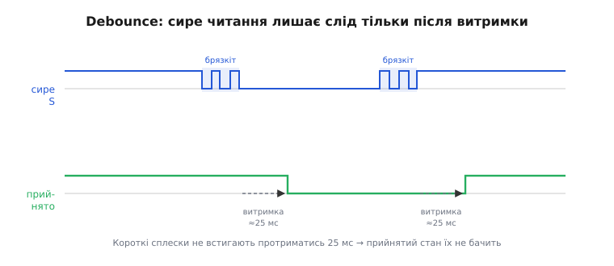

# ⚙️ Проєкт: «магічна чаша» в коді

Дві платки лежать на столі, кожна на чотирьох проводах під'єднана до плати мікроконтролера. Живлення й земля зведено на спільні шини, виходи вимикачів S — на цифрові ноги, входи світлодіодів L — на ноги з ШІМ. Залізо готове й нічого поки не робить: нахиляєш плату — світлодіод на ній так само світить, бо між вимикачем і світлодіодом на платі немає дроту. Увесь ефект перетікання ще попереду — і живе він **тільки в коді**. Плата дає сирі цеглинки: з одного боку віддає «нахилено / ні», з іншого приймає число яскравості. Зв'язати одне з іншим так, щоб світло *перелилося* з чаші в чашу, — задача прошивки, і саме її ми зараз розв'яжемо до останнього рядка.

Від мікроконтролера ця задача просить рівно чотири речі: два цифрові входи, два виходи з апаратним ШІМ, лічильник мілісекунд і головний цикл. Це є в кожному чипі — різняться лише імена, якими воно кличеться. Тому кожен приклад нижче йде вкладками: **Arduino** (ATmega328P на 16 МГц, UNO чи Nano) — бо це найкоротший вхід у тему; поруч **ESP-IDF** і **STM32 HAL** — щоб ту саму задачу впізнав і той, хто скетчів не пише. Це не псевдокод: імена функцій, типи, оголошення — усе таке, як воно є в реальному проєкті, без жодної зовнішньої бібліотеки.

## Що саме треба збудувати

Перш ніж писати, домовмося словами, чого хочемо, — бо половина помилок у таких проєктах від того, що ефект «в голові» і ефект «у коді» розходяться. Поведінка така:

- у спокої обидві чаші світять **наполовину** — світло рівно поділене;
- поки тримаєш нахил у бік чаші A, її світло повільно **наростає**, а чаші B — рівно настільки ж **спадає**;
- відпустив — рух спиняється, чаші лишаються там, де застигли;
- нахил у бік B жене процес назад.

Ключове слово тут — **повільно**. Нахил не *встановлює* яскравість, а лише задає **напрямок руху**: поки вимикач замкнений, спільний рівень повзе на крок щотакту. Тримаєш довше — світло переллється далі; смикнув і відпустив — зрушиться ледь-ледь. Саме тому ефект виглядає як плавне переливання рідини, а не як клацання перемикача. І саме тому кульковий вимикач тут достатній, хоч він і не вміє міряти *кут*: нам потрібен не кут, а лише «в який бік лити».

Звідси й уся архітектура скетча — маленький конвеєр, що прокручується щотакту `loop()`:


*Один прохід головного циклу. Сирий сигнал вимикача брязкотить, тож його спершу «гасять» до чистого «замкнено/розімкнено»; за чистим станом рівень переливу посувають на один крок; рівень задає яскравість чаші A напряму, а чаші B — доповненням до 255. Наступний такт починає все спочатку — і саме з цих дрібних кроків складається плавність.*

Розберемо конвеєр по ланці: спершу як читати вимикач без брязкоту, тоді як зберегти сумарну яскравість, а тоді складемо все в один робочий скетч.

## Ланка перша: читаємо вимикач без брязкоту

Пін S дає рівень «високо/низько» — здавалося б, прочитай стан входу (`digitalRead` в Arduino, `gpio_get_level` в ESP-IDF, `HAL_GPIO_ReadPin` на STM32) і все. Але механічна кулька, докочуючись до контактів, за кілька мілісекунд встигає торкнутись і відскочити багато разів, і читання ніжки в ці миті повертає чергу `1-0-1-0`, перш ніж усе устаканиться. Якщо на кожному такому «0» ми штовхатимемо рівень, один нахил дасть не плавний рух, а рвані стрибки. Тому сире читання треба **згасити** (англ. *debounce*): приймати нове значення лише коли воно протрималося стабільним якийсь час.

Принцип видно на часовій діаграмі. Зверху — що реально приходить на ніжку; знизу — стан, який ми **приймаємо** за правду:


*Сирий рівень (угорі) під час кожного перемикання видає пачку коротких сплесків. Прийнятий стан (унизу) міняється тільки тоді, коли новий рівень протримався стабільним усю витримку (тут ≈25 мс). Короткі сплески не встигають її вистояти — і залишаються непоміченими. Так із брудного сигналу виходить чистий «замкнено/розімкнено».*

Механіка згасання проста: щоразу, коли сире читання **відрізняється** від того, що ми досі вважали станом, ми не віримо йому одразу, а запам'ятовуємо момент і чекаємо. Якщо за час витримки читання лишилося новим — приймаємо; смикнулося назад — скидаємо таймер і чекаємо знову. Ось ця логіка, загорнута в маленьку структуру, щоб на дві плати завести дві незалежні копії:

:::tabs
```arduino
// Стан згасання брязкоту для однієї лінії вимикача.
struct Debounced {
    uint8_t pin;             // до якої ніжки під'єднано S
    bool    stable;          // чистий, уже прийнятий рівень
    bool    lastRaw;         // що прочитали минулого разу (для лову зміни)
    uint32_t changedAt;      // коли сире читання востаннє змінилось (millis)
};

const uint16_t DEBOUNCE_MS = 25;   // скільки треба протриматись, щоб повірити

void debounceBegin(Debounced &d, uint8_t pin) {
    d.pin = pin;
    pinMode(pin, INPUT);           // підтяжка вже на платі — свою не вмикаємо
    d.stable = digitalRead(pin);   // початковий стан — те, що зараз на ніжці
    d.lastRaw = d.stable;
    d.changedAt = millis();
}

// Оновити згасання; повертає ЧИСТИЙ рівень ніжки (уже без брязкоту).
bool debounceRead(Debounced &d) {
    bool raw = digitalRead(d.pin);
    if (raw != d.lastRaw) {        // сире читання щойно змінилось —
        d.lastRaw = raw;           //   запам'ятали нове й засікли час,
        d.changedAt = millis();    //   але ПОКИ не віримо йому
    }
    // Якщо нове читання протрималось усю витримку — приймаємо його за правду.
    if (raw != d.stable && (millis() - d.changedAt) >= DEBOUNCE_MS) {
        d.stable = raw;
    }
    return d.stable;
}
```
```esp-idf
#include "driver/gpio.h"
#include "esp_timer.h"

// Стан згасання брязкоту для однієї лінії вимикача.
typedef struct {
    gpio_num_t pin;          // до якого GPIO під'єднано S
    bool       stable;       // чистий, уже прийнятий рівень
    bool       last_raw;     // що прочитали минулого разу (для лову зміни)
    int64_t    changed_us;   // коли сире читання востаннє змінилось (мкс)
} debounced_t;

#define DEBOUNCE_US 25000    // 25 мс — скільки треба протриматись, щоб повірити

void debounce_begin(debounced_t *d, gpio_num_t pin) {
    gpio_config_t cfg = {
        .pin_bit_mask = 1ULL << pin,
        .mode         = GPIO_MODE_INPUT,
        .pull_up_en   = GPIO_PULLUP_DISABLE,     // підтяжка вже на платі
        .pull_down_en = GPIO_PULLDOWN_DISABLE,
        .intr_type    = GPIO_INTR_DISABLE,
    };
    ESP_ERROR_CHECK(gpio_config(&cfg));
    d->pin = pin;
    d->stable = gpio_get_level(pin);   // початковий стан — те, що зараз на ніжці
    d->last_raw = d->stable;
    d->changed_us = esp_timer_get_time();
}

// Оновити згасання; повертає ЧИСТИЙ рівень ніжки (уже без брязкоту).
bool debounce_read(debounced_t *d) {
    bool raw = gpio_get_level(d->pin);
    if (raw != d->last_raw) {              // сире читання щойно змінилось —
        d->last_raw = raw;                 //   запам'ятали нове й засікли час,
        d->changed_us = esp_timer_get_time();  //   але ПОКИ не віримо йому
    }
    // Якщо нове читання протрималось усю витримку — приймаємо його за правду.
    if (raw != d->stable && esp_timer_get_time() - d->changed_us >= DEBOUNCE_US) {
        d->stable = raw;
    }
    return d->stable;
}
```
```stm32
#include "stm32f4xx_hal.h"
#include <stdbool.h>

// Стан згасання брязкоту для однієї лінії вимикача.
typedef struct {
    GPIO_TypeDef *port;      // порт, у якому сидить ніжка S
    uint16_t      pin;       // сама ніжка (GPIO_PIN_x)
    bool          stable;    // чистий, уже прийнятий рівень
    bool          last_raw;  // що прочитали минулого разу (для лову зміни)
    uint32_t      changed_at;// коли сире читання востаннє змінилось (HAL_GetTick)
} Debounced;

#define DEBOUNCE_MS 25u      // скільки треба протриматись, щоб повірити

// Ніжку вже налаштовано входом БЕЗ підтяжки в MX_GPIO_Init() — підтяжка на платі.
void DebounceBegin(Debounced *d, GPIO_TypeDef *port, uint16_t pin) {
    d->port = port;
    d->pin  = pin;
    d->stable = (HAL_GPIO_ReadPin(port, pin) == GPIO_PIN_SET);  // що зараз на ніжці
    d->last_raw = d->stable;
    d->changed_at = HAL_GetTick();
}

// Оновити згасання; повертає ЧИСТИЙ рівень ніжки (уже без брязкоту).
bool DebounceRead(Debounced *d) {
    bool raw = (HAL_GPIO_ReadPin(d->port, d->pin) == GPIO_PIN_SET);
    if (raw != d->last_raw) {          // сире читання щойно змінилось —
        d->last_raw = raw;             //   запам'ятали нове й засікли час,
        d->changed_at = HAL_GetTick(); //   але ПОКИ не віримо йому
    }
    // Якщо нове читання протрималось усю витримку — приймаємо його за правду.
    if (raw != d->stable && (HAL_GetTick() - d->changed_at) >= DEBOUNCE_MS) {
        d->stable = raw;
    }
    return d->stable;
}
```
:::

Уся суть — в останньому `if`. Ми міняємо `stable` (чистий стан) не тоді, коли сигнал *уперше* стрибнув, а тоді, коли він стрибнув **і** відтоді минуло `DEBOUNCE_MS` без нового стрибка. Пачка коротких сплесків щоразу зсуває `changedAt` на «зараз», лічильник витримки не встигає добігти — і `stable` спокійно стоїть на місці, доки контакт не заспокоїться остаточно.

> 🔧 **Навіщо це.** Спокуса «прочитати S і зреагувати» коштує вечора налагодження. Без згасання перетікання **сіпається**: тримаєш нахил рівно, а рівень то повзе, то підстрибує назад, бо кожен сплеск брязкоту система тлумачить як окрему подію. Найгірше, що плата при цьому **справна** — брязкотить сам механічний контакт, це властивість будь-якого кулькового вимикача, а не дефект примірника. Заведи згасання один раз структурою на кожну лінію — і сирий смітний сигнал перетвориться на чисте «замкнено/розімкнено», з яким уже можна працювати. Докладніше про сам прийом і вибір витримки — [усунення брязкоту контактів](book:electronics/contact-debounce).

Чому 25 мс, а не 5 чи 200? Це компроміс. Замало — крізь фільтр протече частина брязкоту (пачки бувають і на 10 мс). Забагато — вимикач почне «тупити»: швидкий нахил-відпускання система прогавить, бо не дочекається витримки. Для кулькового вимикача 20–50 мс — золота середина; 25 лишає запас в обидва боки. Це число варто мати змінною, а не «магічною» константою в коді, щоб підкрутити під свій примірник, якщо треба.

## Ланка друга: спільний рівень і збереження суми

Тепер серце ефекту. Заведемо **одну** спільну змінну — рівень переливу, ціле число від 0 до 255. Домовимося: це число — **яскравість чаші A**. А яскравість чаші B — його **доповнення до 255**:

```
яскравість A = level
яскравість B = 255 − level
```

Чому саме так — видно, якщо додати два рядки: `A + B = level + (255 − level) = 255`, завжди, за будь-якого `level`. Сума яскравостей двох чаш **стала**. Скільки світла забрали в однієї — рівно стільки додали іншій. Око бачить не появу й зникнення світла, а його **перетікання**: загальна кількість сяйва в парі не міняється, міняється лише його розподіл. Оце «завжди 255» — уся математика фокуса, більше нічого.

Тепер прив'яжемо рух рівня до вимикачів:

- чиста подія «чаша A нахилена» → **збільшуємо** `level` на крок (A яскравішає, B тьмянішає);
- чиста подія «чаша B нахилена» → **зменшуємо** `level` на крок (навпаки);
- жодна не нахилена → `level` стоїть.

І тут — тонкість, яку легко проґавити: `level` не має вилізти за межі `0..255`, бо саме такий діапазон шпаруватості ми домовились виводити на ШІМ (вісім бітів), а `uint8_t`, переповнившись, підступно «загорнеться» з 255 у 0 і чаша різко спалахне навпаки. Тому крок робимо з **упором** об край:

```cpp
uint8_t level = 128;           // спільний рівень переливу; старт — рівно наполовину
const uint8_t STEP = 3;        // на скільки посуваємо рівень за один такт

// Посунути рівень угору/вниз на STEP, не вилізши за межі 0..255.
void nudge(int8_t dir) {       // dir = +1 (до A), −1 (до B), 0 (стоїмо)
    int next = (int)level + dir * STEP;   // рахуємо в int, щоб зловити вихід за край
    if (next < 0)   next = 0;
    if (next > 255) next = 255;
    level = (uint8_t)next;
}
```

Рахунок навмисне ведемо в `int`, а не в `uint8_t`: якби ми писали `level += STEP` прямо у восьмибітній змінній, то на 255 воно б перескочило в 0 (переповнення без попередження), і замість «упертись у стелю» чаша A блимнула б у темряву. Проміжний `int` бачить, що `next` виліз за 255, і ми чесно притискаємо його до краю. Дрібниця на два рядки — але без неї ефект ламається саме на найяскравішому місці, куди дивишся найпильніше.

Швидкість переливу задає `STEP`. Крок 3 за такт при циклі раз на ~4 мс дає повний перелив (0 → 255) приблизно за 255 / 3 × 4 мс ≈ **340 мс** утримання — тобто третину секунди від «повністю A» до «повністю B». Хочеш повільнішого, млявого переливу — зменш `STEP` до 1; хочеш різкого — підніми. Це найголовніша ручка «відчуття» ефекту, і її теж тримаємо змінною.

> 🔧 **Навіщо це.** Одна спільна змінна замість двох окремих яскравостей — не економія пам'яті, а **гарантія**, що сума не попливе. Якби ми крутили яскравість A і B незалежно, довелося б щоразу стежити, щоб вони узгоджувались, і будь-яка неточність накопичувалась би: то сумарне світло тьмяніє, то яскравішає, ефект «дихає». Тримаючи **один** рівень і виводячи B як його дзеркало, ми робимо збереження суми не побажанням, а математичним фактом коду — його неможливо порушити, бо друга яскравість завжди рахується з першої.

## Складаємо робочий скетч

Тепер зшиваємо обидві ланки в цілу прошивку. Розкладка виводів — та сама, що при монтажі пари: S обох плат на будь-які цифрові входи, L обох — **обов'язково** на виводи, здатні видавати ШІМ. На UNO це ноги з позначкою `~` (беремо `~D9` і `~D6`, вимикачі — на `D8` і `D7`); на ESP32 ШІМ дає периферія LEDC, прив'язана до довільного GPIO; на STM32 — канал таймера, виведений на свою ніжку. Це повний файл; збирай і працює.

:::tabs
```arduino
// ── «Магічна чаша» на парі KY-027 (Arduino UNO / Nano, ATmega328P) ──
// S обох плат — на будь-які цифрові ноги; L обох — ТІЛЬКИ на ~ШІМ-ноги.

const uint8_t PIN_S_A = 8;    // вихід вимикача чаші A (цифровий вхід)
const uint8_t PIN_L_A = 9;    // світлодіод чаші A — ШІМ (~D9)
const uint8_t PIN_S_B = 7;    // вихід вимикача чаші B (цифровий вхід)
const uint8_t PIN_L_B = 6;    // світлодіод чаші B — ШІМ (~D6)

// Який рівень на піні S означає «нахилено». Залежить від того, яким боком
// стоїть трубка вимикача: замкнений вимикач тягне S до землі → LOW.
const bool TILTED = LOW;

// ── згасання брязкоту (див. вище) ──
struct Debounced { uint8_t pin; bool stable; bool lastRaw; uint32_t changedAt; };
const uint16_t DEBOUNCE_MS = 25;

void debounceBegin(Debounced &d, uint8_t pin) {
    d.pin = pin; pinMode(pin, INPUT);
    d.stable = digitalRead(pin); d.lastRaw = d.stable; d.changedAt = millis();
}
bool debounceRead(Debounced &d) {
    bool raw = digitalRead(d.pin);
    if (raw != d.lastRaw) { d.lastRaw = raw; d.changedAt = millis(); }
    if (raw != d.stable && (millis() - d.changedAt) >= DEBOUNCE_MS) d.stable = raw;
    return d.stable;
}

// ── спільний рівень переливу ──
uint8_t level = 128;
const uint8_t STEP = 3;
void nudge(int8_t dir) {
    int next = (int)level + dir * STEP;
    if (next < 0) next = 0;
    if (next > 255) next = 255;
    level = (uint8_t)next;
}

Debounced swA, swB;

void setup() {
    debounceBegin(swA, PIN_S_A);
    debounceBegin(swB, PIN_S_B);
    pinMode(PIN_L_A, OUTPUT);
    pinMode(PIN_L_B, OUTPUT);
}

void loop() {
    // 1. Чисті стани обох вимикачів (уже без брязкоту).
    bool tiltA = (debounceRead(swA) == TILTED);
    bool tiltB = (debounceRead(swB) == TILTED);

    // 2. Посунути спільний рівень за нахилом.
    //    A нахилена → до A (+); B нахилена → до B (−); обидві або жодна → стоїмо.
    if (tiltA && !tiltB)       nudge(+1);
    else if (tiltB && !tiltA)  nudge(-1);
    // (tiltA && tiltB) чи (!tiltA && !tiltB) → рівень не рухаємо

    // 3. Вивести рівень на світлодіоди: сума яскравостей завжди 255.
    analogWrite(PIN_L_A, level);
    analogWrite(PIN_L_B, 255 - level);

    delay(4);   // такт ≈4 мс → повний перелив за ~340 мс утримання (STEP=3)
}
```
```esp-idf
// ── «Магічна чаша» на парі KY-027, ESP-IDF (ШІМ — периферія LEDC) ──
#include "driver/gpio.h"
#include "driver/ledc.h"
#include "esp_timer.h"
#include "freertos/FreeRTOS.h"
#include "freertos/task.h"

#define PIN_S_A  GPIO_NUM_4    // вихід вимикача чаші A (цифровий вхід)
#define PIN_L_A  GPIO_NUM_18   // світлодіод чаші A — канал LEDC 0
#define PIN_S_B  GPIO_NUM_5    // вихід вимикача чаші B (цифровий вхід)
#define PIN_L_B  GPIO_NUM_19   // світлодіод чаші B — канал LEDC 1

// Який рівень на піні S означає «нахилено»: замкнений вимикач тягне S до землі.
#define TILTED   0

// ── згасання брязкоту (див. вище) ──
typedef struct { gpio_num_t pin; bool stable; bool last_raw; int64_t changed_us; } debounced_t;
#define DEBOUNCE_US 25000

static void debounce_begin(debounced_t *d, gpio_num_t pin) {
    gpio_config_t cfg = { .pin_bit_mask = 1ULL << pin, .mode = GPIO_MODE_INPUT,
                          .pull_up_en = GPIO_PULLUP_DISABLE,
                          .pull_down_en = GPIO_PULLDOWN_DISABLE,
                          .intr_type = GPIO_INTR_DISABLE };
    ESP_ERROR_CHECK(gpio_config(&cfg));
    d->pin = pin; d->stable = gpio_get_level(pin);
    d->last_raw = d->stable; d->changed_us = esp_timer_get_time();
}
static bool debounce_read(debounced_t *d) {
    bool raw = gpio_get_level(d->pin);
    if (raw != d->last_raw) { d->last_raw = raw; d->changed_us = esp_timer_get_time(); }
    if (raw != d->stable && esp_timer_get_time() - d->changed_us >= DEBOUNCE_US) d->stable = raw;
    return d->stable;
}

// ── ШІМ: один таймер на 5 кГц / 8 бітів, два канали з нього ──
static void pwm_begin(ledc_channel_t ch, gpio_num_t pin) {
    ledc_channel_config_t c = { .gpio_num = pin, .speed_mode = LEDC_LOW_SPEED_MODE,
                                .channel = ch, .timer_sel = LEDC_TIMER_0,
                                .intr_type = LEDC_INTR_DISABLE, .duty = 0, .hpoint = 0 };
    ESP_ERROR_CHECK(ledc_channel_config(&c));
}
static void pwm_write(ledc_channel_t ch, uint32_t duty) {
    ESP_ERROR_CHECK(ledc_set_duty(LEDC_LOW_SPEED_MODE, ch, duty));
    ESP_ERROR_CHECK(ledc_update_duty(LEDC_LOW_SPEED_MODE, ch));
}

// ── спільний рівень переливу ──
static uint8_t level = 128;
#define STEP 3
static void nudge(int dir) {
    int next = (int)level + dir * STEP;
    if (next < 0) next = 0;
    if (next > 255) next = 255;
    level = (uint8_t)next;
}

void app_main(void) {
    static debounced_t sw_a, sw_b;
    debounce_begin(&sw_a, PIN_S_A);
    debounce_begin(&sw_b, PIN_S_B);

    ledc_timer_config_t t = { .speed_mode = LEDC_LOW_SPEED_MODE, .timer_num = LEDC_TIMER_0,
                              .duty_resolution = LEDC_TIMER_8_BIT,   // шпаруватість 0..255
                              .freq_hz = 5000, .clk_cfg = LEDC_AUTO_CLK };
    ESP_ERROR_CHECK(ledc_timer_config(&t));
    pwm_begin(LEDC_CHANNEL_0, PIN_L_A);
    pwm_begin(LEDC_CHANNEL_1, PIN_L_B);

    while (1) {
        // 1. Чисті стани обох вимикачів (уже без брязкоту).
        bool tilt_a = (debounce_read(&sw_a) == TILTED);
        bool tilt_b = (debounce_read(&sw_b) == TILTED);

        // 2. Посунути спільний рівень за нахилом; обидві або жодна → стоїмо.
        if (tilt_a && !tilt_b)      nudge(+1);
        else if (tilt_b && !tilt_a) nudge(-1);

        // 3. Вивести рівень: сума яскравостей завжди 255.
        pwm_write(LEDC_CHANNEL_0, level);
        pwm_write(LEDC_CHANNEL_1, 255 - level);

        vTaskDelay(pdMS_TO_TICKS(4));   // такт ≈4 мс → повний перелив за ~340 мс
    }
}
```
```stm32
// ── «Магічна чаша» на парі KY-027, STM32 HAL (ШІМ — два канали TIM3) ──
// TIM3 налаштовано в CubeMX: Prescaler під 5 кГц, ARR = 255 → CCR = 0..255.
#include "main.h"
#include <stdbool.h>

extern TIM_HandleTypeDef htim3;

#define PORT_S_A  GPIOA          // вихід вимикача чаші A (цифровий вхід)
#define PIN_S_A   GPIO_PIN_0
#define PORT_S_B  GPIOA          // вихід вимикача чаші B
#define PIN_S_B   GPIO_PIN_1
#define CH_L_A    TIM_CHANNEL_1  // світлодіод чаші A — PA6 (TIM3_CH1)
#define CH_L_B    TIM_CHANNEL_2  // світлодіод чаші B — PA7 (TIM3_CH2)

// Який рівень на піні S означає «нахилено»: замкнений вимикач тягне S до землі.
#define TILTED    false

// ── згасання брязкоту (див. вище) ──
typedef struct { GPIO_TypeDef *port; uint16_t pin; bool stable, last_raw; uint32_t changed_at; } Debounced;
#define DEBOUNCE_MS 25u

static void DebounceBegin(Debounced *d, GPIO_TypeDef *port, uint16_t pin) {
    d->port = port; d->pin = pin;
    d->stable = (HAL_GPIO_ReadPin(port, pin) == GPIO_PIN_SET);
    d->last_raw = d->stable; d->changed_at = HAL_GetTick();
}
static bool DebounceRead(Debounced *d) {
    bool raw = (HAL_GPIO_ReadPin(d->port, d->pin) == GPIO_PIN_SET);
    if (raw != d->last_raw) { d->last_raw = raw; d->changed_at = HAL_GetTick(); }
    if (raw != d->stable && (HAL_GetTick() - d->changed_at) >= DEBOUNCE_MS) d->stable = raw;
    return d->stable;
}

// ── спільний рівень переливу ──
static uint8_t level = 128;
#define STEP 3
static void Nudge(int dir) {
    int next = (int)level + dir * STEP;
    if (next < 0) next = 0;
    if (next > 255) next = 255;
    level = (uint8_t)next;
}

int main(void) {
    HAL_Init();
    SystemClock_Config();
    MX_GPIO_Init();               // S обох плат — входи без підтяжки (вона на платі)
    MX_TIM3_Init();

    Debounced swA, swB;
    DebounceBegin(&swA, PORT_S_A, PIN_S_A);
    DebounceBegin(&swB, PORT_S_B, PIN_S_B);
    HAL_TIM_PWM_Start(&htim3, CH_L_A);
    HAL_TIM_PWM_Start(&htim3, CH_L_B);

    while (1) {
        // 1. Чисті стани обох вимикачів (уже без брязкоту).
        bool tiltA = (DebounceRead(&swA) == TILTED);
        bool tiltB = (DebounceRead(&swB) == TILTED);

        // 2. Посунути спільний рівень за нахилом; обидві або жодна → стоїмо.
        if (tiltA && !tiltB)      Nudge(+1);
        else if (tiltB && !tiltA) Nudge(-1);

        // 3. Вивести рівень у порівняльні регістри: сума яскравостей завжди 255.
        __HAL_TIM_SET_COMPARE(&htim3, CH_L_A, level);
        __HAL_TIM_SET_COMPARE(&htim3, CH_L_B, 255 - level);

        HAL_Delay(4);   // такт ≈4 мс → повний перелив за ~340 мс утримання
    }
}
```
:::

Пройдімо головний цикл очима, бо в цих п'ятнадцяти рядках — увесь ефект. Спершу дістаємо **чисті** стани обох вимикачів: `debounceRead` повертає згашений рівень, а порівняння з `TILTED` перетворює його на зрозуміле `true/false` — «нахилено чи ні». Далі — правило руху: якщо нахилена **тільки** A, штовхаємо рівень до неї; тільки B — до неї; якщо тримають обидві або жодної, навмисно нічого не робимо (перелив спиняється). І насамкінець виводимо: `level` іде на світлодіод A напряму, `255 − level` — на B. Один прохід зрушує світло на мікрокрок; сотні проходів за секунду зливають його з чаші в чашу плавно.

Пауза наприкінці такту (`delay(4)`, `vTaskDelay`, `HAL_Delay(4)` — одне й те саме) не марнує час, а **задає темп** переливу. Кожні 4 мс рівень посувається на `STEP`, і разом ці два числа визначають, за скільки світло перетече повністю. Просто заснути тут припустимо, бо прошивка більше нічого не робить: уся її робота — читати два піни й писати два. Якби плата паралельно вела ще щось (мережу, дисплей), паузу довелось би прибрати й рухати рівень за годинником (`millis()`, `esp_timer_get_time()`, `HAL_GetTick()`), але для самого ефекту чаші це зайве ускладнення.

> 🔧 **Навіщо це.** Зверни увагу на випадок «обидві нахилені разом» — `tiltA && tiltB`. Легко його проґавити й написати два незалежні `if`, і тоді при одночасному спрацюванні рівень за один такт смикнеться і туди, і сюди — ефект «затремтить». Умова `tiltA && !tiltB` («тільки A») закриває це чисто: коли активні обидва вимикачі, жодна гілка не спрацьовує, рівень стоїть. Для дзеркально змонтованої пари таке трапляється рідко (один нахил вмикає одну плату й **відпускає** іншу), але покласти цей запобіжник у код — дешевше, ніж ловити тремтіння потім.

Ось і вся «магія» — п'ятнадцять рядків циклу плюс дві допоміжні функції. Жодної бібліотеки, жодного ШІМ там, де вивід його не вміє. Тепер варіанти.

## Варіант без пари: одна плата як індикатор нахилу

А що, як плата в тебе одна? Пари для повного ефекту нема, але сама зв'язка «вимикач → плавне світло» лишається повчальною й корисною сама по собі. Найпростіше застосування однієї KY-027 — **індикатор нахилу з плавним відгуком**: тримаєш плату рівно — світлодіод пригашений, нахиляєш — він плавно **розгоряється** до повної яскравості, вертаєш — так само плавно гасне. Не клац-клац, а м'яке «дихання» у відповідь на нахил.

Логіка та сама, лише замість двох світлодіодів з дзеркальними яскравостями — один, і рівень тепер повзе до максимуму, поки нахилено, і до нуля, поки рівно:

:::tabs
```arduino
// ── Одна KY-027 як плавний індикатор нахилу (Arduino) ──
const uint8_t PIN_S = 8;      // вихід вимикача (цифровий вхід)
const uint8_t PIN_L = 9;      // світлодіод — ШІМ (~D9)
const bool    TILTED = LOW;   // рівень S, що означає «нахилено»

struct Debounced { uint8_t pin; bool stable; bool lastRaw; uint32_t changedAt; };
const uint16_t DEBOUNCE_MS = 25;
void debounceBegin(Debounced &d, uint8_t pin) {
    d.pin = pin; pinMode(pin, INPUT);
    d.stable = digitalRead(pin); d.lastRaw = d.stable; d.changedAt = millis();
}
bool debounceRead(Debounced &d) {
    bool raw = digitalRead(d.pin);
    if (raw != d.lastRaw) { d.lastRaw = raw; d.changedAt = millis(); }
    if (raw != d.stable && (millis() - d.changedAt) >= DEBOUNCE_MS) d.stable = raw;
    return d.stable;
}

Debounced sw;
uint8_t bright = 0;           // поточна яскравість 0..255
const uint8_t STEP = 4;

void setup() {
    debounceBegin(sw, PIN_S);
    pinMode(PIN_L, OUTPUT);
}

void loop() {
    bool tilted = (debounceRead(sw) == TILTED);
    // Нахилено → повземо до 255; рівно → сповзаємо до 0. Обидва — з упором.
    int next = (int)bright + (tilted ? +STEP : -STEP);
    if (next < 0) next = 0;
    if (next > 255) next = 255;
    bright = (uint8_t)next;

    analogWrite(PIN_L, bright);
    delay(6);                 // темп наростання/згасання
}
```
```esp-idf
// ── Одна KY-027 як плавний індикатор нахилу (ESP-IDF, ШІМ через LEDC) ──
#include "driver/gpio.h"
#include "driver/ledc.h"
#include "esp_timer.h"
#include "freertos/FreeRTOS.h"
#include "freertos/task.h"

#define PIN_S   GPIO_NUM_4     // вихід вимикача (цифровий вхід)
#define PIN_L   GPIO_NUM_18    // світлодіод — канал LEDC 0
#define TILTED  0              // рівень S, що означає «нахилено»

typedef struct { gpio_num_t pin; bool stable; bool last_raw; int64_t changed_us; } debounced_t;
#define DEBOUNCE_US 25000

static void debounce_begin(debounced_t *d, gpio_num_t pin) {
    gpio_config_t cfg = { .pin_bit_mask = 1ULL << pin, .mode = GPIO_MODE_INPUT,
                          .pull_up_en = GPIO_PULLUP_DISABLE,
                          .pull_down_en = GPIO_PULLDOWN_DISABLE,
                          .intr_type = GPIO_INTR_DISABLE };
    ESP_ERROR_CHECK(gpio_config(&cfg));
    d->pin = pin; d->stable = gpio_get_level(pin);
    d->last_raw = d->stable; d->changed_us = esp_timer_get_time();
}
static bool debounce_read(debounced_t *d) {
    bool raw = gpio_get_level(d->pin);
    if (raw != d->last_raw) { d->last_raw = raw; d->changed_us = esp_timer_get_time(); }
    if (raw != d->stable && esp_timer_get_time() - d->changed_us >= DEBOUNCE_US) d->stable = raw;
    return d->stable;
}

#define STEP 4

void app_main(void) {
    static debounced_t sw;
    debounce_begin(&sw, PIN_S);

    ledc_timer_config_t t = { .speed_mode = LEDC_LOW_SPEED_MODE, .timer_num = LEDC_TIMER_0,
                              .duty_resolution = LEDC_TIMER_8_BIT,   // 0..255
                              .freq_hz = 5000, .clk_cfg = LEDC_AUTO_CLK };
    ESP_ERROR_CHECK(ledc_timer_config(&t));
    ledc_channel_config_t c = { .gpio_num = PIN_L, .speed_mode = LEDC_LOW_SPEED_MODE,
                                .channel = LEDC_CHANNEL_0, .timer_sel = LEDC_TIMER_0,
                                .intr_type = LEDC_INTR_DISABLE, .duty = 0, .hpoint = 0 };
    ESP_ERROR_CHECK(ledc_channel_config(&c));

    uint8_t bright = 0;                  // поточна яскравість 0..255
    while (1) {
        bool tilted = (debounce_read(&sw) == TILTED);
        // Нахилено → повземо до 255; рівно → сповзаємо до 0. Обидва — з упором.
        int next = (int)bright + (tilted ? +STEP : -STEP);
        if (next < 0) next = 0;
        if (next > 255) next = 255;
        bright = (uint8_t)next;

        ESP_ERROR_CHECK(ledc_set_duty(LEDC_LOW_SPEED_MODE, LEDC_CHANNEL_0, bright));
        ESP_ERROR_CHECK(ledc_update_duty(LEDC_LOW_SPEED_MODE, LEDC_CHANNEL_0));
        vTaskDelay(pdMS_TO_TICKS(6));    // темп наростання/згасання
    }
}
```
```stm32
// ── Одна KY-027 як плавний індикатор нахилу (STM32 HAL, ШІМ на TIM3_CH1) ──
// TIM3 у CubeMX: ARR = 255 → CCR приймає рівно 0..255.
#include "main.h"
#include <stdbool.h>

extern TIM_HandleTypeDef htim3;

#define PORT_S  GPIOA            // вихід вимикача (цифровий вхід)
#define PIN_S   GPIO_PIN_0
#define CH_L    TIM_CHANNEL_1    // світлодіод — PA6 (TIM3_CH1)
#define TILTED  false            // рівень S, що означає «нахилено»

typedef struct { GPIO_TypeDef *port; uint16_t pin; bool stable, last_raw; uint32_t changed_at; } Debounced;
#define DEBOUNCE_MS 25u

static void DebounceBegin(Debounced *d, GPIO_TypeDef *port, uint16_t pin) {
    d->port = port; d->pin = pin;
    d->stable = (HAL_GPIO_ReadPin(port, pin) == GPIO_PIN_SET);
    d->last_raw = d->stable; d->changed_at = HAL_GetTick();
}
static bool DebounceRead(Debounced *d) {
    bool raw = (HAL_GPIO_ReadPin(d->port, d->pin) == GPIO_PIN_SET);
    if (raw != d->last_raw) { d->last_raw = raw; d->changed_at = HAL_GetTick(); }
    if (raw != d->stable && (HAL_GetTick() - d->changed_at) >= DEBOUNCE_MS) d->stable = raw;
    return d->stable;
}

#define STEP 4

int main(void) {
    HAL_Init();
    SystemClock_Config();
    MX_GPIO_Init();
    MX_TIM3_Init();

    Debounced sw;
    DebounceBegin(&sw, PORT_S, PIN_S);
    HAL_TIM_PWM_Start(&htim3, CH_L);

    uint8_t bright = 0;                  // поточна яскравість 0..255
    while (1) {
        bool tilted = (DebounceRead(&sw) == TILTED);
        // Нахилено → повземо до 255; рівно → сповзаємо до 0. Обидва — з упором.
        int next = (int)bright + (tilted ? +STEP : -STEP);
        if (next < 0) next = 0;
        if (next > 255) next = 255;
        bright = (uint8_t)next;

        __HAL_TIM_SET_COMPARE(&htim3, CH_L, bright);
        HAL_Delay(6);                    // темп наростання/згасання
    }
}
```
:::

Тут видно, що прийом ширший за саму чашу. «Накопичувати рівень і виводити його через ШІМ» — універсальний спосіб перетворити **дискретну** подію (нахилено / ні) на **плавну** реакцію. Та сама заготовка робить нічник, що м'яко світлішає, коли його беруть у руку й нахиляють; індикатор, що плавно набирає яскравість від струсу; реакцію іграшки на рух. Пара з двох плат — лише найгарніший окремий випадок, де «плавна реакція» однієї чаші — це «спад» іншої.

> 🔧 **Навіщо це.** Помітна деталь: тут ми не вмикаємо світлодіод *миттю* при нахилі, хоч могли б (`digitalWrite(PIN_L, tilted)`). Плавність — навмисна: різкий спалах видає, що всередині просто вимикач, а м'яке наростання **приховує** дискретність події й виглядає «розумно». Це загальний прийом дизайну відгуку: між грубим датчиком і оком постав інтегратор (накопичення рівня), і поведінка стане плавною, хоч джерело — двійкове «так/ні». Той самий трюк, що робить чашу магічною, робить приємним будь-який індикатор на копійчаному вимикачі.

## Перенесення на ESP32: ledc замість analogWrite

Arduino-вкладка вище приколочена до ATmega328P однією річчю — функцією `analogWrite`. Якщо лишатися в звичному Arduino-середовищі, але взяти ESP32, то на ньому її класична форма поводиться інакше (в старих версіях ядра її взагалі не було, у нових вона є, але ШІМ там влаштований інакше), тож перелив краще будувати на «рідному» для ESP32 генераторі ШІМ — периферії **LEDC** (англ. *LED Control*). Різниць рівно три, і кожну варто знати, бо на них спотикаються при переході.

**Перша — напруга. ESP32 живиться й працює від 3.3 В, не 5.** Плати KY-027 це терплять (усередині лише світлодіод із резистором і підтяжка), але світлодіод від 3.3 В світить помітно тьмяніше: менша напруга — менший струм крізь той самий гасильний резистор. Для наочної демонстрації в яскравій кімнаті це відчутно; лік — або мати темніше тло, або (акуратно) зменшити гасильний резистор на платі. Пін `+` чаш вішаємо на `3V3`, не на 5 В.

**Друга — ніжки. У ESP32 ШІМ доступний майже на будь-якому виводі**, а не лише на позначених `~`, бо LEDC — це матриця з кількох незалежних каналів-таймерів, які можна «прив'язати» до потрібних GPIO. Але деякі ноги зайняті або примхливі (ноги завантаження, лише-вхідні GPIO 34–39), тож беремо звичайні безпечні виходи, скажімо `GPIO 18` і `GPIO 19`.

**Третя — сам виклик.** Замість `analogWrite(pin, value)` на ESP32 ШІМ спершу **налаштовують** на ніжці (частота й розрядність), а тоді пишуть у неї шпаруватість. У сучасному ядрі Arduino-ESP32 (версія 3.x, 2024 і новіші) це роблять двома функціями:

```cpp
ledcAttach(pin, frequency, resolution_bits);   // налаштувати ШІМ на ніжці
ledcWrite(pin, duty);                           // виставити шпаруватість
```

`ledcAttach` замінила пару старих `ledcSetup` + `ledcAttachPin` і сама роздає внутрішні канали — раніше канал доводилось заводити вручну. Розрядність — скільки бітів у числі шпаруватості: візьмемо **8 бітів**, і тоді діапазон `duty` — рівно `0..255`, той самий, що звик `analogWrite`, і решта коду переливу лишається без змін. Частоту для світлодіода досить узяти близько **5 кГц** — далеко за межею, де око ловить блимання.

Ось той самий ефект чаші, перенесений на ESP32 у середовищі Arduino; уся логіка (згасання, рівень, збереження суми) — дослівно та сама, підмінилися лише три рядки роботи з ніжками:

```arduino
// ── «Магічна чаша» на парі KY-027, ESP32 (Arduino-ESP32 core 3.x) ──
// Живлення плат — 3V3. ШІМ через LEDC; на ESP32 майже будь-який GPIO — вихід.

const uint8_t PIN_S_A = 4;    // вимикач A — цифровий вхід
const uint8_t PIN_L_A = 18;   // світлодіод A — ШІМ через LEDC
const uint8_t PIN_S_B = 5;    // вимикач B — цифровий вхід
const uint8_t PIN_L_B = 19;   // світлодіод B — ШІМ через LEDC
const bool    TILTED  = LOW;

const uint32_t PWM_FREQ = 5000;   // 5 кГц — оку не видно блимання
const uint8_t  PWM_BITS = 8;      // 8 біт → шпаруватість 0..255, як analogWrite

struct Debounced { uint8_t pin; bool stable; bool lastRaw; uint32_t changedAt; };
const uint16_t DEBOUNCE_MS = 25;
void debounceBegin(Debounced &d, uint8_t pin) {
    d.pin = pin; pinMode(pin, INPUT);
    d.stable = digitalRead(pin); d.lastRaw = d.stable; d.changedAt = millis();
}
bool debounceRead(Debounced &d) {
    bool raw = digitalRead(d.pin);
    if (raw != d.lastRaw) { d.lastRaw = raw; d.changedAt = millis(); }
    if (raw != d.stable && (millis() - d.changedAt) >= DEBOUNCE_MS) d.stable = raw;
    return d.stable;
}

uint8_t level = 128;
const uint8_t STEP = 3;
void nudge(int8_t dir) {
    int next = (int)level + dir * STEP;
    if (next < 0) next = 0;
    if (next > 255) next = 255;
    level = (uint8_t)next;
}

Debounced swA, swB;

void setup() {
    debounceBegin(swA, PIN_S_A);
    debounceBegin(swB, PIN_S_B);
    ledcAttach(PIN_L_A, PWM_FREQ, PWM_BITS);   // ШІМ на ніжці A
    ledcAttach(PIN_L_B, PWM_FREQ, PWM_BITS);   // ШІМ на ніжці B
}

void loop() {
    bool tiltA = (debounceRead(swA) == TILTED);
    bool tiltB = (debounceRead(swB) == TILTED);

    if (tiltA && !tiltB)       nudge(+1);
    else if (tiltB && !tiltA)  nudge(-1);

    ledcWrite(PIN_L_A, level);          // замість analogWrite(...)
    ledcWrite(PIN_L_B, 255 - level);
    delay(4);
}
```

Порівняй два скетчі поряд — і видно, що чаша **не залежить** від конкретного чипа. Уся її суть (згасити брязкіт, тримати один рівень, вивести його доповненням) переносна дослівно; чипозалежні лише три речі — як налаштувати ніжку під ШІМ, як у неї писати і яка напруга живлення. Це добра наука взагалі: коли пишеш прошивку, тримай **логіку ефекту** окремо від **доступу до заліза**, і перенесення на інший мікроконтролер зведеться до підміни кількох рядків, а не переписування всього.

> 🔧 **Навіщо це.** Якщо в тебе ядро Arduino-ESP32 **старіше** за 3.x, `ledcAttach` не існуватиме — компілятор лайнеться на невідому функцію. Тоді або онови ядро (найпростіше), або зверни виклики на давню трійцю: `ledcSetup(channel, freq, bits)` заводить канал, `ledcAttachPin(pin, channel)` чіпляє його до ніжки, а `ledcWrite(channel, duty)` пише вже **в канал**, не в ніжку. Це найчастіша причина, чому чужий ESP32-скетч із інтернету «не збирається»: код і версія ядра з різних епох. Спершу перевір версію ядра, тоді вибирай форму викликів.

## Складність і пастки: де перелив ламається

Усі варіанти вище ми довели до робочих. Тепер чесний перелік того, на чому цей код спотикається найчастіше, — кожен пункт з'їв у когось вечір.

**L на не-ШІМ-нозі — найпоширеніша.** На UNO `analogWrite` дає плавну яскравість **тільки** на ногах із позначкою `~` (3, 5, 6, 9, 10, 11). Повісиш L на звичайну ногу (скажімо, D8) — і `analogWrite` там перетвориться на грубе «увімк/вимк»: значення нижче 128 дасть темно, вище — повну яскравість, і жодного проміжку. Перелив розсиплеться на клацання: замість плавного зливання світло стрибатиме між «яскраво» і «темно». Плата й код справні — просто нога не вміє ШІМ. Лік: тримай L обох чаш на `~`-ногах, а вимикачі (яким ШІМ не потрібен) — на будь-яких цифрових.

**Забутий debounce — сіпання переливу.** Читаєш S голим `digitalRead` без згасання — і кожен сплеск брязкоту система рахує як окрему подію нахилу. Тримаєш плату рівно, а рівень то повзе, то стрибає назад; лічба «скільки разів нахилили» бреше. Це не дефект вимикача, це його природа. Без ланки згасання ефект виглядає нервовим і несправним, хоч залізо ціле.

**Неправильна орієнтація вимикача — «спокій» переплутано зі «нахилом».** Кульковий вимикач несиметричний і чутливий переважно до нахилу в **один** бік. Поставиш трубку не тим боком — і в спокої вона вважатиметься «нахиленою», а справжній нахил читатиметься як спокій. Ефект працюватиме «навпаки» або взагалі не спинятиметься. Проявляється як «світло тече саме собою, без нахилу» або «нахиляю, а нічого». Лік не в коді логіки, а в константі `TILTED` (який рівень S означає «нахилено» для *твоєї* орієнтації) і в тому, яким боком фізично лежить плата. Пару монтують дзеркально, щоб один нахил вмикав одну й відпускав другу.

**Полярність / плутанина, який рівень «нахилено».** Пін S показує стан вимикача через підтяжку «навпаки»: замкнений вимикач тягне S **до землі** (LOW), розімкнений — підтяжка тримає HIGH. Легко вписати `TILTED = HIGH`, коли насправді `LOW`, — і вся реакція перевернеться. Якщо перелив іде не в той бік або взагалі не спиняється, перше, що перевіряй, — значення `TILTED`: заміни `LOW` на `HIGH` (чи навпаки) і подивись, чи стало правильно. Це одна константа, а не переробка коду.

**Переповнення рівня — спалах на краю.** Якщо посувати `level` прямо у `uint8_t` (`level += STEP`), то на 255 воно перескочить у 0 (а на 0 при відніманні — у 255): найяскравіша чаша раптом провалиться в темряву, а темна спалахне на повну. Це видно саме на краях переливу, куди дивишся найпильніше. Лік — рахувати наступне значення в `int` і **притискати** до `0..255`, як у `nudge()`. Два зайві рядки рятують ефект від різкого стрибка на межі.

**ESP32: стара vs нова форма ledc.** Скетч під ESP32 не збереться, якщо форма викликів LEDC не збігається з версією ядра. Ядро 3.x і новіше хоче `ledcAttach(pin, freq, bits)` + `ledcWrite(pin, duty)`; ядро 2.x хоче `ledcSetup` + `ledcAttachPin` + `ledcWrite(channel, duty)`. Симптом — помилка компіляції «`ledcAttach` was not declared» (стара версія) або «too few arguments to `ledcWrite`» (нова версія зі старим кодом). Перевір версію Arduino-ESP32 і бери відповідну форму.

**ESP32: 3.3 В — тьмяно.** Той самий скетч на ESP32 світить помітно блідіше, ніж на UNO, бо живлення 3.3 В замість 5. Ефект **фізично** такий самий (сума яскравостей стала), але видно його гірше в яскравому світлі. Це не помилка коду — це напруга. Демонструй у тіні або зменш гасильний резистор.

Наскрізна думка під усіма пастками одна. Залізо KY-027 віддає лише сирі цеглинки: «нахилено / ні» з одного боку, число яскравості — з іншого. **Увесь ефект — у трьох речах коду**: згасити брязкіт до чистої події, тримати один спільний рівень і посувати його за нахилом, вивести його як дзеркальну пару яскравостей через ШІМ. Прибери бодай одну — і магія розсиплеться: без згасання вона сіпається, без спільного рівня сума пливе, без ШІМ-ноги перелив стає клацанням. А склади всі три правильно — і два копійчані кулькові вимикачі почнуть переливати світло з чаші в чашу так, наче в них справді щось налито.
