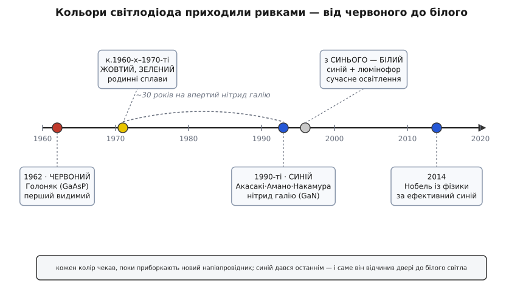

# 📜 Як народилося видиме світло діода

Крапля червоного світла над макетною платою здається чимось природним, майже безкоштовним — ну світиться й світиться. Але за цією червоною крапкою стоїть цілком конкретний день, конкретна людина й конкретна ставка проти майже всієї галузі. **9 жовтня 1962 року** в лабораторії напівпровідників компанії General Electric поблизу Сіракуз (штат Нью-Йорк) уперше в історії засвітився діод, чиє світло могло побачити людське око. До того дня діоди теж «світилися» — але в інфрачервоному, невидимому. Той, хто змусив діод світити червоним, ішов проти течії: усі поважні люди в галузі полювали на інфрачервоне, а він поставив на видиме — і виграв.

Щоб відчути, чому це був подвиг, а не дрібне вдосконалення, треба спершу зрозуміти, чому світло діода взагалі має колір і чому цей колір так важко пересунути в потрібний бік.

## Чому колір діода — це його матеріал, а не примха

Світло народжується в діоді, коли електрон перескакує через межу двох областей напівпровідника — p-n-перехід — і на цьому стрибку віддає надлишок енергії. Іноді ця енергія йде теплом; в особливих матеріалах — вилітає порцією світла, фотоном. Сам механізм цього випромінювання — чому в одних кристалах перехід гріється, а в інших світиться — розібрано у статті про [світлодіод](book:electronics/led): нам тут досить одного її висновку. І цей висновок ключовий: **енергія фотона намертво прив'язана до висоти «сходинки», яку долає електрон**. Цю висоту звуть шириною забороненої зони, і в кожного напівпровідникового сплаву вона своя.

А енергія фотона — це і є його колір. Зв'язок простий і невблаганний:

```
E = h · c / λ

E — енергія фотона
λ — довжина хвилі (колір)
h · c ≈ 1240 еВ·нм   (зручна стала для оптики)

звідси:  λ (нм) ≈ 1240 / E (еВ)

червоний  ~1.9 еВ → λ ≈ 650 нм
зелений   ~2.3 еВ → λ ≈ 540 нм
синій     ~2.7 еВ → λ ≈ 460 нм
```

Наслідок фундаментальний: **щоб змінити колір діода, треба змінити сам матеріал** — узяти сплав з іншою шириною забороненої зони. Не можна «підкрутити» червоний діод до синього, як гучність. Синій потребує вищої сходинки, вищої сходинки потребує іншого кристала, а інший кристал доводиться навчитися вирощувати з нуля. Саме тому історія кольорів світлодіода — це не плавна крива, а три ривки з довгими паузами: кожен новий колір чекав, поки хтось приборкає новий матеріал. Червоний дався у 1962-му. Синій — аж у 1990-х. Тридцять років різниці — і в цій прірві вся драма.

## Людина, що пішла проти інфрачервоного

На початку 1960-х напівпровідникова оптика вже ворушилася. У тій самій General Electric колега на ім'я **Роберт Голл (Robert N. Hall)** щойно показав напівпровідниковий лазер на арсеніді галію (GaAs) — але він світив в інфрачервоному, оком невидимому. І майже всі в галузі вважали це правильним напрямом: інфрачервоне легше, матеріал відомий, застосування (зв'язок, датчики) очевидні. Полювати на видиме світло здавалося примхою — сплави складніші, вирощувати важче, а навіщо, якщо є лампа розжарення.

Проти цього консенсусу став **Нік Голоняк-молодший (Nick Holonyak Jr.)**. Замість чистого арсеніду галію він узяв потрійний сплав — **арсенід-фосфід галію (GaAsP)**, точніше склад GaAs₀·₆P₀·₄. Додавання фосфору піднімало сходинку забороненої зони рівно настільки, щоб фотон вискочив уже у видимому червоному діапазоні, а не в інфрачервоному. Ідея звучить просто заднім числом; на ділі це означало навчитися вирощувати якісні кристали нового трикомпонентного сплаву, у якому пропорції норовили «попливти». Голоняк упорався — і 9 жовтня 1962 року отримав перше червоне світло. Того ж року він зробив на цьому сплаві й перший напівпровідниковий лазер, що працював у видимому спектрі.

> 🔧 **Навіщо це.** Той вибір «видиме проти інфрачервоного» — причина, чому в твоєму наборі перший колір саме червоний, а не якийсь інший. Червоний GaAsP був технологічно найдешевшою сходинкою у видиме: трохи фосфору до вже освоєного арсеніду галію. Тому червоні світлодіоди десятиліттями лишалися найдешевшими й найпоширенішими, і саме червоний став універсальним «увімкнено». Історія матеріалу досі лежить у ціннику: червоних у пакетику зазвичай найбільше й вони найдешевші не випадково.

*(Усталений факт, підтверджений біографіями GE та Іллінойського університету, IEEE й Британікою: дата 9 жовтня 1962, місце — лабораторія GE у Сіракузах, сплав GaAsP, автор — Нік Голоняк-мол.)*

## Хто такий Голоняк — і чому важливо назвати його точно

Тут потрібна точність, бо ім'я легко змазати недбалим ярликом. Ніка Голоняка часто називають просто «американцем», а подекуди — і геть хибно — «росіянином». Ні те, ні те не передає, ким він був за походженням.

Народився він **3 листопада 1928 року в містечку Зіглер (Zeigler), штат Іллінойс** — тобто самé він американець за громадянством і місцем народження. Але його родина — **карпаторусинська (Carpatho-Rusyn)**, і це не дрібна етнографічна примітка, а те, ким Голоняк себе усвідомлював усе життя. Батьки — емігранти з карпатських земель, що тоді входили до Австро-Угорщини, а нині це **Закарпатська область України**:

- **Батько**, Микола Голоняк-старший, походив із села **Новоселиця Міжгірського краю** (тодішній комітат Мараморош), приїхав до США **1909 року** й усе життя гарував **шахтарем** на копальнях Іллінойсу та Пенсільванії, а також на залізниці.
- **Мати**, Анна (з дому Росоха), — з села поблизу **Хуста**, приїхала **1921 року**; вона була неписьменна, формальної освіти не мала.

Удома родина розмовляла **русинською**, і Нік вільно володів нею до кінця днів: у технічних інтерв'ю через десятиліття він вставляв русинські слова — «копай», «де будеш спати» — і залюбки розповідав карпаторусинські історії. Тобто це не «кров, про яку забули», а жива мова й жива самосвідомість.

Через це недбалі ярлики особливо ріжуть. Русинів історично затягували то в австро-угорську, то в польську, то в радянську рамку; називати русина «росіянином» — це стерти окрему ідентичність цілого народу заради зручного великого ярлика. Точно буде так: **Нік Голоняк — американський фізик карпаторусинського (закарпатського) походження**, син шахтаря-емігранта з-під Хуста.

> 🔧 **Навіщо це.** Технічний факт «перший видимий LED зробив Голоняк» без точної ідентичності стає безбарвним. А з нею він оживає: винахід, який сьогодні світиться в кожному приладі планети, зробив син неписьменної селянки з-під Хуста й шахтаря з Міжгірщини — людей, що втекли від злиднів Карпат на копальні Іллінойсу. Це не пафос заради пафосу: це нагадування, що інженерна історія робиться конкретними людьми з конкретним корінням, і стирати те коріння ярликом — значить брехати про те, як усе було насправді.

*(Джерела по ідентичності узгоджені: карпаторусинська організація Carpatho-Rusyn Society, обітуарії Optica та Physics Today, біографія Іллінойського університету. Села Новоселиця й околиці Хуста — нинішня Закарпатська обл. України; на час еміграції — Австро-Угорщина. Статус: усталений факт.)*

## Родовід від транзистора

Є ще одна ниточка, що робить постать Голоняка не випадковою. Докторат він захистив у **1954 році в Іллінойському університеті**, і був **першим аспірантом Джона Бардіна (John Bardeen)** — того самого Бардіна, який співтворив транзистор і єдиний в історії двічі отримав Нобелівську премію з фізики (за транзистор і за теорію надпровідності). Перш ніж піти в GE, Голоняк ще й попрацював у Bell Labs над кремнієвими транзисторами.

Тобто лінія пряма: **транзистор → напівпровідникова школа Бардіна → видиме світло діода**. Людина, що навчилася в батька приборкувати p-n-переходи для підсилення струму, застосувала ту саму інтуїцію, щоб змусити перехід випромінювати світло. Світлодіод — це не окремий випадковий винахід, а гілка з того самого напівпровідникового дерева, що дало транзистор; і Голоняк буквально ріс на цьому дереві.

## Жовтий, зелений — і тридцятирічна стіна перед синім

Після червоного галузь порівняно швидко добрала ще два кольори «донизу» по енергії, бо для них годилися родинні сплави. Наприкінці 1960-х і в 1970-х з'явилися **жовті й зелені** світлодіоди — знову на основі GaAsP та споріднених матеріалів, лише з іншими пропорціями й домішками. Три кольори — червоний, жовтий, зелений — стали класичним набором індикаторів (і, до речі, готовим набором світлофора).

А далі впала стіна. **Синій діод не давався десятиліттями.** Причина — рівно та сама фізика сходинки: синьому потрібна висока заборонена зона, а матеріал з потрібною зоною — **нітрид галію (GaN)** — виявився пекельно норовливим. Його не вміли вирощувати якісним монокристалом; іще гірше — не вміли зробити його p-типу, а без обох типів немає p-n-переходу, а без переходу немає діода. Багато лабораторій пробували й здавалися; чимало серйозних людей вважали, що ефективний синій на нітриді галію практично недосяжний.

Пробили стіну троє японських дослідників у 1980-х–90-х:

- **Ісаму Акасакі (Isamu Akasaki)** та **Хіросі Амано (Hiroshi Amano)** у 1986-му вперше виростили якісний кристал нітриду галію (шар нітриду алюмінію на сапфіровій підкладці, а вже на ньому — добрий GaN) і 1992-го показали яскравий синій діод.
- **Сюдзі Накамура (Shuji Nakamura)**, працюючи в невеликій японській фірмі Nichia, незалежно довів технологію до практичного, дешевого й яскравого синього діода: до 1993-го його синій світив, як свічка.

За це у **2014 році** їм трьом присудили **Нобелівську премію з фізики** — з формулюванням «за винахід ефективних синіх світлодіодів, які уможливили яскраві й енергоощадні джерела білого світла».


*Кольори світлодіода приходили ривками, бо кожен вимагав приборкати новий напівпровідниковий сплав. Червоний, жовтий і зелений лягли на споріднені сплави арсенід-фосфіду галію відносно швидко. Синій уперся в нітрид галію й чекав тридцять років — і саме він, останнім у ряду, відчинив двері до білого світла. Довжина «провалля» перед синім — це буквально час, за який людство вчилося вирощувати один упертий кристал.*

## Чому саме синій змінив світ — і гірка симетрія фіналу

Може здатися дивним: чому Нобеля дали за синій, а не за перший-у-світі червоний Голоняка? Відповідь — у тому, що **білого світлодіода без синього не буває**. Білий діод — це насправді **синій кристал під шаром жовтого люмінофора**: люмінофор перехоплює частину синього світла й перевипромінює жовтим, а синє плюс жовте око зводить у біле. Тому доки не було ефективного синього, не було й білого; а без білого світлодіод лишався індикаторною цяткою, а не джерелом освітлення. Синій діод перетворив нішеву сигнальну деталь на те, що сьогодні світить у кожній лампі, екрані й ліхтарику, — і саме тому його визнали переворотом, вартим Нобеля.

І тут ховається гірка симетрія. **Сам Голоняк, що запалив перше видиме світло діода, Нобелівської премії так і не отримав** і, за розповідями, вважав це несправедливим — адже все дерево видимих світлодіодів проросло з його червоного 1962 року. Історія техніки часто така: той, хто відчинив двері, лишається в тіні тих, хто через ці двері зайшов найдалі. Це не привід применшувати японську трійку — їхній синій справді дався ціною десятиліть чужих провалів. Це лише привід тримати обидва імені поруч: **червоне світло Голоняка** відкрило, що діод узагалі може світити видимим, а **синє світло Акасакі, Амано й Накамури** зробило це світло білим і повсюдним.

*(Статуси: дата й склад Нобелівської премії 2014, формулювання, ролі трьох лауреатів і хронологія нітриду галію — усталений факт за матеріалами Нобелівського комітету. «Голоняк вважав неотримання премії несправедливим» — переказ із інтерв'ю та обітуаріїв, тобто добре засвідчене свідчення, а не документ; подано як переказ.)*

Тож наступного разу, витягаючи з пакетика червону краплю на дві ніжки, згадай: це найстаріший колір у ряду, запалений 1962-го сином шахтаря з-під Хуста проти волі цілої галузі, — а біла крапля поряд світить лише тому, що через тридцять років троє в Японії таки приборкали впертий синій кристал.
