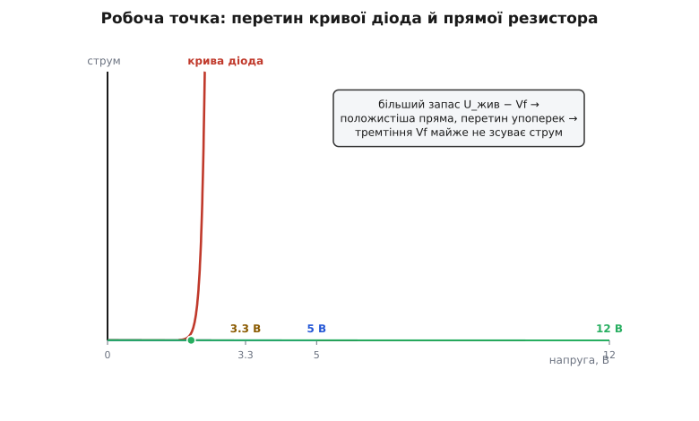
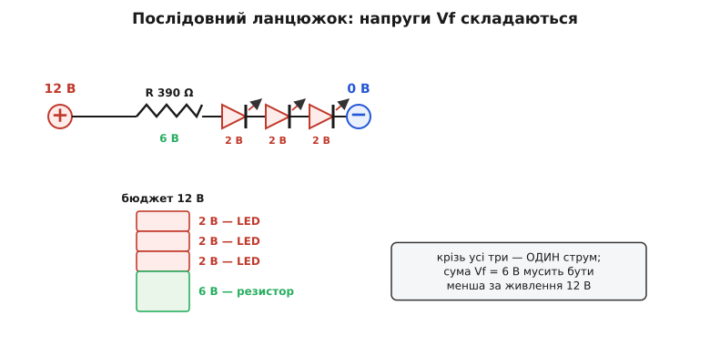
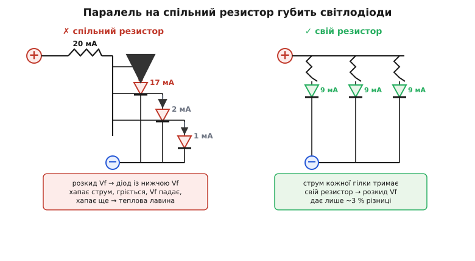

# 🧮 Математика гасильного резистора

<preknowlist>
- [Закон Ома](topic:electronics/ohms-law) — напруга = струм · опір; на ньому тримається вся формула гасильного резистора.
- [Драйвер LED](topic:electronics/led-driver) — чому світлодіод живлять струмом, а не напругою; тут — математичний бік цього твердження.
- [Дільник напруги](topic:electronics/voltage-divider) — послідовне коло, у якому напруги складаються; звідси й видно, куди дівається зайвий вольт.
</preknowlist>

Один рядок «R = (U − Vf)/I» друкують у кожному пораднику для початківців, і його заучують як заклинання, не питаючи, звідки він і чому саме такий. А варто спитати — і за цим коротким виразом відкривається вся логіка того, як живлять світлодіод: чому резистор узагалі мусить бути, чому його опір саме такий, скільки на ньому виділяється тепла, чому кілька світлодіодів можна зчепити один за одним, але не можна поставити поряд на спільний резистор. Розберімо цю формулу не як готовий рецепт, а як наслідок — вивівши її з першопричин і простеживши, куди веде кожне число.

## Чому взагалі потрібен резистор: діод — не опір

Почнімо з питання, яке зазвичай пропускають: а чому не можна просто подати на світлодіод потрібну напругу й на цьому заспокоїтися? Відповідь ховається в тому, як діод відповідає струмом на напругу — і ця відповідь принципово інша, ніж у резистора.

У резистора зв'язок напруги і струму — пряма лінія: подвоїв напругу — подвоївся струм, це і є закон Ома. У діода — зовсім не лінія. Струм крізь p-n-перехід росте з напругою **експоненційно**, і описує це рівняння Шоклі (за іменем Вільяма Шоклі, одного з винахідників транзистора, Нобелівська премія з фізики 1956 року — усталений факт):

```
I = I_s · (e^(V / (n · V_T)) − 1)
```

Тут `I_s` — крихітний струм насичення, `V_T` — тепловий потенціал (при кімнатній температурі ≈ 0.026 В), `n` — коефіцієнт неідеальності (для світлодіодів помітно більший за одиницю). Не треба рахувати цим рівнянням резистори — воно тут для однієї-єдиної думки: **струм залежить від напруги не прямо, а через експоненту**. А експонента — це стрімкість. Подивімося, наскільки стрімка.

Візьмімо число з практики. Щоб струм крізь світлодіод змінився вдесятеро, напругу треба змінити всього на кілька десятих вольта — типово 0.1–0.2 В. Тобто напруга майже стоїть на місці (звідси й поняття «пряма напруга Vf» — світлодіод ніби «фіксує» на собі свої 2 чи 3 вольти в широкому діапазоні струмів), а струм за той самий крок напруги стрибає на порядок. Порахуймо чутливість навпаки — наскільки струм зривається від крихітної добавки напруги:

**Умова: на скільки зросте струм від зайвих 0.1 В на червоному світлодіоді**

```
хай при Vf = 1.9 В крізь LED тече I₁ = 5 мА
кут експоненти: струм росте вдесятеро на кожні ≈ 0.13 В
                (для LED беремо n·V_T ≈ 0.057 В, десятковий крок = 2.303 · 0.057 ≈ 0.13 В)

додаймо всього 0.1 В → V = 2.0 В:
   I₂ = I₁ · 10^(0.1 / 0.13) = 5 мА · 10^0.77 = 5 · 5.9 ≈ 29 мА

додаймо ще 0.1 В → V = 2.1 В:
   I₃ = 5 мА · 10^(0.2 / 0.13) = 5 · 35 ≈ 175 мА
```

Ось воно. Крок напруги 0.2 В — а струм із безпечних п'яти міліампер злетів до майже двохсот, тобто вжарив кристал у десятки разів понад норму. І це головна причина, чому світлодіод **не можна живити напругою**: щоб задати струм напругою, довелося б утримувати її з точністю до сотих вольта й ще стежити за температурою (з нагрівом крива повзе, і той самий вольт дає інший струм). Жодне звичайне джерело так не вміє. Тому струм задають **не** напругою.

> 🔧 **Навіщо це.** Саме звідси випливає золоте правило «світлодіод живлять струмом, а не напругою». Не тому, що так велить традиція, а тому, що вольт-амперна крива діода майже вертикальна: біля робочої точки крихітна невизначеність у напрузі обертається величезною невизначеністю в струмі. А струм — це те, що гріє й убиває кристал. Отже, нам потрібен спосіб **задати струм**, поклавши на світлодіод рівно стільки напруги, скільки він сам захоче, і ні на сотку більше.

## Резистор як стабілізатор струму

І тут з'являється резистор — найдешевший спосіб перетворити «джерело напруги» на «джерело струму» для нашої скромної задачі. Ідея елегантна саме тим, що працює всупереч норову діода, а не проти нього.

Поставмо резистор послідовно зі світлодіодом і подамо на пару напругу живлення `U_жив`. У послідовному колі струм крізь обидві деталі однаковий, а напруги на них **складаються** й мусять у сумі дати напругу джерела ([дільник напруги](topic:electronics/voltage-divider) — той самий принцип). Світлодіод, хай там що, візьме на себе свою пряму напругу `Vf` — майже незмінну. Значить, усе, що лишилося, — різниця `U_жив − Vf` — падає **на резисторі**. А на резисторі, на відміну від діода, струм і напруга зв'язані чесною прямою лінією закону Ома. Тому струм у колі задає саме резистор:

```
I = (U_жив − Vf) / R
```

Тепер — найважливіше, стабілізаційна магія. Уяви, що світлодіод трохи «захотів» більшого струму (нагрівся, крива поповзла). Більший струм — більше падіння на резисторі (`I · R`). Але сума напруг фіксована, дорівнює `U_жив`. Отже, коли на резисторі впало більше, на світлодіод лишилося **менше** — а менша напруга на діоді за його крутою кривою миттю збиває струм назад. Резистор сам, без жодної електроніки, гасить будь-який порив струму: чим більший струм, тим сильніше резистор «забирає» напругу в діода. Це і є зворотний зв'язок, вбудований у звичайний шматок опору. Що більший цей опір, то жорсткіше він тримає струм — тому інженери й кажуть «баластний» або «гасильний» резистор.

Тепер розв'яжемо цей самий вираз відносно `R` — і ось звідки береться та формула-заклинання:

```
R = (U_жив − Vf) / I
```

Вона не постулат, а простий наслідок: «різницю напруг ділимо на бажаний струм, бо на резисторі діють закон Ома». Жодної магії — уся магія лишилася в тому, ЧОМУ ми взагалі ставимо резистор.

> 🔧 **Навіщо це.** Формула `R = (U_жив − Vf)/I` читається як речення, коли бачиш її походження: чисельник — це «зайва» напруга, яку нема куди подіти, крім як спалити на резисторі; знаменник — струм, який ми хочемо пропустити. Тому в ній усе логічно на дотик: більша напруга живлення → більше гасити → більший опір; більший бажаний струм → менший опір. Заучувати нема чого — досить розуміти, що резистор з'їдає різницю.

## Числа: різні кольори, різні напруги

Тепер пустимо формулу в діло на реальних числах. Головна пастка початківця — вважати, що резистор «під світлодіод» один на всі випадки. Ні: він залежить і від напруги живлення, і від кольору (бо колір задає `Vf`). Порахуймо кілька типових поєднань, які трапляються щодня.

**Умова: червоний (Vf = 2.0 В) від 5 В, струм 10 мА**

```
U_R = U_жив − Vf = 5 − 2.0 = 3.0 В
R   = U_R / I    = 3.0 / 0.010 = 300 Ω  →  найближче з ряду E12: 330 Ω
```

**Умова: синій (Vf = 3.2 В) від 5 В, струм 10 мА**

```
U_R = 5 − 3.2 = 1.8 В
R   = 1.8 / 0.010 = 180 Ω  →  з ряду вже готове: 180 Ω
```

Уже видно урок: **на тому самому живленні й струмі синьому треба МЕНШИЙ резистор**, ніж червоному (180 проти 330 Ω). Причина проста — синій сам «з'їдає» більше напруги, тож гасити резистору лишається менше, а менше гасити при тому самому струмі — це менший опір. Поставиш під синій резистор, порахований для червоного (330 Ω), — струм упаде до `1.8 / 330 ≈ 5.5 мА`, і синій світитиме помітно тьмяніше.

**Умова: червоний (Vf = 2.0 В) від 3.3 В, струм 10 мА** (типове живлення логіки мікроконтролера)

```
U_R = 3.3 − 2.0 = 1.3 В
R   = 1.3 / 0.010 = 130 Ω  →  з ряду E12: 120 Ω (струм трохи більший) або 150 Ω (трохи менший)
```

**Умова: червоний (Vf = 2.0 В) від 12 В, струм 10 мА** (автомобільне/стрічкове живлення)

```
U_R = 12 − 2.0 = 10 В
R   = 10 / 0.010 = 1000 Ω = 1 кΩ  →  з ряду готове
```

І тут цікавий поворот, який видно лише в числах: **що вища напруга живлення, то БАЙДУЖІШИЙ результат до кольору й точного Vf**. Порахуймо синій від 12 В: `U_R = 12 − 3.2 = 8.8 В`, `R = 880 Ω`. Різниця з червоним (1000 Ω) — якісь 12 %, дрібниця. А від 3.3 В та сама різниця в 1.2 В кольору — це вже прірва: для червоного 130 Ω, а синьому (Vf 3.2 В) від 3.3 В лишається аж `0.1 В`, і резистор виходить безглуздий. Причина одна: коли `U_жив` набагато більша за `Vf`, невизначеність `Vf` у кілька десятих вольта губиться на тлі великого чисельника; а коли `U_жив` ледь перевищує `Vf`, ті самі десяті десятих вольта вирішують усе. Звідси практичне:

```
запас напруги  U_жив − Vf     поведінка
────────────────────────────────────────────────────────────
< 0.5 В        мізерний        струм «пливе» від дрібниць, колір критичний
0.5 … 1.5 В    малий           працює, але Vf треба знати точно
> 1.5 В        комфортний      резистор жорстко тримає струм, Vf неважливий
```


*Графічний зміст формули. Крута крива, що злітає вгору, — вольт-амперна характеристика світлодіода: біля порогу Vf вона майже вертикальна. Похилі прямі — «навантажувальні лінії» резистора для трьох напруг живлення; кожна перетинає вісь напруги в точці U_жив, а її нахил задає опір. Робочий струм — там, де пряма перетинає криву. Головне видно очима: при 12 В пряма положиста й перетинає круту криву майже під прямим кутом — маленьке тремтіння Vf майже не зсуває струм; при 3.3 В пряма встромляється в криву по дотичній — те саме тремтіння Vf гуляє струмом угору-вниз. Ось чому «запас напруги» — це стабільність.*

> 🔧 **Навіщо це.** Звідси випливає, чому синій і білий світлодіоди безглуздо вмикати через резистор від 3-вольтової батарейки, а червоний — можна. У синього Vf ≈ 3.2 В, і від 3.3 В на резистор лишається `0.1 В` — гасити нема чого, струм задають не ти, а випадковий розкид Vf і просідання батарейки. Червоному ж (Vf 2 В) від 3.3 В лишається `1.3 В` цілком робочого запасу. Тому правило: **чим ближче Vf до напруги живлення, тим гірше поводиться проста схема з резистором** — і тим раніше треба думати про спеціальний драйвер зі стабілізацією струму замість резистора.

## Потужність: коли резистор гріється й коли 0.25 Вт мало

Резистор бере на себе зайву напругу — а напруга помножена на струм є потужність, і ця потужність виділяється **теплом**. Крихітний резистор, розсіюючи забагато тепла, перегрівається, змінює опір, темніє, а зрештою вигорає. Тому після опору завжди рахують потужність.

Потужність на резисторі можна порахувати трьома рівнозначними виразами — усі це той самий закон Джоуля `P = U · I`, лише через закон Ома підставлено різне:

```
P_R = U_R · I  =  I² · R  =  U_R² / R
```

Найзручніший тут — останній, бо `U_R` (напруга на резисторі) і `R` (опір) у нас уже пораховані. Пройдімося тими самими прикладами.

**Умова: потужність на резисторі, червоний від 5 В**

```
U_R = 3.0 В,  R = 330 Ω
P_R = U_R² / R = 3.0² / 330 = 9 / 330 ≈ 0.027 Вт = 27 мВт
```

Двадцять сім міліватів проти чверті вата (0.25 Вт), які тримає звичайний виводний резистор, — запас у майже десять разів. Підійде будь-який. А тепер піднімемо напругу й струм:

**Умова: потужність на резисторі, червоний від 12 В при 20 мА**

```
U_R = 12 − 2 = 10 В,  I = 0.020 А
R   = 10 / 0.020 = 500 Ω  →  з ряду 510 Ω
P_R = U_R · I = 10 · 0.020 = 0.20 Вт = 200 мВт
```

Ось воно й підкралося: 0.20 Вт — це вже **80 % від межі** звичайного 0.25-ватного резистора. Формально влазить, але на межі: резистор буде відчутно теплий, а в закритому корпусі без провітрювання довго так тримати ризиковано (реальну потужність беруть з запасом удвічі, тобто хочуть резистор на 0.5 Вт). Піднімімо ще:

**Умова: потужність на резисторі, червоний від 24 В при 20 мА**

```
U_R = 24 − 2 = 22 В,  I = 0.020 А
P_R = 22 · 0.020 = 0.44 Вт
```

Тут 0.25-ватний резистор уже **згорить** — треба брати 1-ватний (з запасом на 0.44 Вт беруть саме 1 Вт, бо 0.5 Вт лишає лише 14 % запасу). Видно закономірність: потужність на резисторі росте разом із «зайвою» напругою `U_R`, а та росте з напругою живлення. Тому небезпека перегріти резистор приходить **не** від кольору світлодіода, а від **високого живлення при пристойному струмі**. Прикинемо межу для типового 0.25-ватного резистора при повних 20 мА, взявши запас удвічі (робоча стеля 0.125 Вт):

```
P_допустима(робоча) = 0.125 Вт
U_R(гранична)        = P / I = 0.125 / 0.020 = 6.25 В
```

Тобто **при 20 мА одному 0.25-ватному резистору безпечно можна віддати гасити близько 6 В**, не більше. Для 5 В і 3.3 В це з головою (там `U_R` — одиниці вольтів), а от від 12 В при повному струмі вже треба або менший струм, або потужніший резистор, або два резистори послідовно (кожен ділить тепло навпіл).

> 🔧 **Навіщо це.** Дві дії після розрахунку опору рятують від тихої біди. Перша: завжди порахуй `P_R = U_R · I` і звірся з ватажем резистора — і бери запас **удвічі** (0.25-ватний навантажуй не більш як на 0.125 Вт), бо паспортна цифра — це стеля при добрій вентиляції, а не робоча точка. Друга: якщо потужність підповзає до межі, найдешевший вихід — **розбити опір на два послідовні резистори**: кожен матиме половину напруги й розсіюватиме половину тепла, а ватаж у них додається. Забудеш порахувати потужність — і схема, що «працювала на столі», за годину в закритій коробці почне тхнути смаленим.

## Кілька світлодіодів послідовно: напруги складаються

Часто хочеться запалити не один світлодіод, а низку — скажімо, підсвітити щось рівним рядком. Перший здоровий інстинкт — зчепити їх **послідовно**, один за одним, і це правильний інстинкт: у послідовному ланцюжку крізь усі тече **той самий струм**, тож усі світять однаково яскраво, а гасити треба лише одну спільну «зайву» напругу — виходить один резистор на весь ланцюжок.

Математика проста: у послідовному колі напруги складаються, тож світлодіоди з'їдають суму своїх `Vf`, а резистор гасить решту:

```
R = (U_жив − Vf₁ − Vf₂ − … − Vf_n) / I
```

**Умова: три червоні світлодіоди (Vf = 2 В кожен) послідовно від 12 В, струм 15 мА**

```
сума прямих напруг:  ΣVf = 3 · 2 = 6 В
зайва напруга:       U_R = 12 − 6 = 6 В
опір:                R = 6 / 0.015 = 400 Ω  →  з ряду 390 Ω
потужність:          P_R = U_R · I = 6 · 0.015 = 0.09 Вт  (0.25-ватного вистачає)
```

Три світлодіоди — а резистор один, і гасить він тепер удвічі менше напруги, ніж гасив би на один світлодіод (бо два зайві вольти пішли не в тепло резистора, а в світло двох додаткових діодів). Послідовне вмикання **економніше**: менше енергії згорає намарно на резисторі. Але в нього є жорстка стеля.

**Стеля — це напруга живлення.** Кожен доданий світлодіод з'їдає ще `Vf`, і сума `ΣVf` росте. Щойно вона наблизиться до `U_жив`, гасити резистору стане нічого, а коли перевищить — струму не буде взагалі, ланцюжок не засвітиться навіть **без** резистора. Порахуймо межу для червоних (Vf 2 В):

```
максимум світлодіодів у ланцюжку ≈ (U_жив − мінімальний запас на резистор) / Vf

від 5 В:   треба лишити резистору хоч ~1 В  →  (5 − 1)/2 = 2 світлодіоди
від 12 В:  (12 − 1)/2 = 5.5  →  5 світлодіодів
від 24 В:  (24 − 1)/2 = 11.5 →  11 світлодіодів
```

А для синіх (Vf 3.2 В) стеля куди нижча: від 12 В влазить лише `(12 − 1)/3.2 ≈ 3` штуки. Ось чому довгі стрічки світлодіодів усередині розбито на короткі послідовні групи по 3 (для 12 В) — це рівно стільки, скільки напруги стачає, а групи вже з'єднано паралельно, **кожну зі своїм резистором**.


*Послідовний ланцюжок і його «бюджет напруги». Крізь усі три світлодіоди й резистор тече один і той самий струм — тому світять однаково. Праворуч — на що витрачається живлення: кожен світлодіод забирає свою пряму напругу (тут 2 В), а все, що лишилося після суми, падає на резисторі. Стовпчик наочно показує стелю: якби світлодіодів було стільки, що їхня сума дорівнює 12 В, резистору не лишилося б нічого — і струм задавати вже нічим.*

> 🔧 **Навіщо це.** Послідовне вмикання — правильний і економний спосіб живити кілька світлодіодів **одним** струмом і **одним** резистором, і саме так улаштовані світлодіодні стрічки й багато індикаторів. Але завжди спершу порахуй суму `ΣVf` і переконайся, що вона з запасом (хоч на вольт-два) менша за `U_жив` — інакше ланцюжок або ледь тлітиме, або зовсім не засвітиться, і жодна заміна резистора не допоможе, бо проблема не в резисторі, а в тому, що напруги фізично забракло.

## Чому НЕ МОЖНА паралелити світлодіоди на один резистор

А тепер — найпоширеніша, найспокусливіша й найзгубніша помилка. Якщо послідовно можна, то, здається, і паралельно теж: постав три світлодіоди поряд, з'єднай усі аноди разом, усі катоди разом, повісь один резистор на всіх — і хай собі світять. Схема виглядає симетрично й ощадливо. Насправді вона нежиттєздатна, і математика пояснює чому — жорстко й наочно.

Корінь біди — той самий експоненційний норов діода плюс невблаганний **розкид Vf** між екземплярами. Два світлодіоди з одного пакетика, «однакові» на вигляд, майже завжди мають трохи різну пряму напругу — розбіжність у 0.1–0.2 В цілком звичайна навіть у межах однієї партії. У послідовному колі це байдуже (струм спільний, кожен просто візьме свою напругу). А в паралельному — навпаки: усі світлодіоди з'єднані **на ту саму напругу**, бо їхні виводи спаяно разом.

І тут спрацьовує пастка. Паралельні гілки ділять між собою спільний струм, що йде крізь один резистор. Але на кривій діода менша `Vf` означає при тій самій напрузі **набагато більший струм** (експонента!). Той світлодіод, у якого поріг хоч на десяту вольта нижчий, візьме на себе левову частку струму — він «перетягує ковдру». Порахуймо, наскільки нерівно ділиться струм між двома «майже однаковими» діодами:

**Умова: два паралельні світлодіоди, Vf різняться на 0.1 В, спільний струм 20 мА**

```
крок напруги на десятикратний струм для LED:  ≈ 0.13 В  (як рахували вище)
різниця порогів:  ΔVf = 0.1 В

обидва під однаковою напругою → їхні струми відносяться як експонента різниці:
   I_слабший / I_сильніший = 10^(−ΔVf / 0.13) = 10^(−0.1/0.13) = 10^(−0.77) ≈ 0.17

тобто «слабший» діод бере лише 17 % струму сильнішого. Розкладімо 20 мА:
   I_сильніший · (1 + 0.17) = 20 мА
   I_сильніший = 20 / 1.17 ≈ 17.1 мА
   I_слабший   = 20 − 17.1 ≈ 2.9 мА
```

Різниця Vf лише в одну десяту вольта — а струм поділився **17 проти 3 міліампер**, тобто «жадібний» діод узяв майже вшестеро більше. Тепер увімкнемо ланцюжок причин-наслідків. Жадібний діод, беручи більший струм, **більше гріється**. Від нагріву його `Vf` ще трохи падає (пряма напруга діода зменшується з температурою — усталений факт, ≈ −2 мВ на градус). Менша `Vf` — при спільній напрузі ще більший струм. Ще більший струм — ще сильніший нагрів. Це **позитивний зворотний зв'язок**, теплова лавина: діод сам себе розганяє, поки не візьме майже весь струм, спалахне неприродно яскраво й вигорить. Щойно він гине (обривається), уся його частка струму перекидається на наступний найслабший — і той повторює шлях. Світлодіоди гинуть один за одним, як доміно.

Порівняймо різницю з послідовним увімкненням в одній рамці, щоб контраст засів:

```
                     послідовно                паралельно (спільний R)
─────────────────────────────────────────────────────────────────────────
струм крізь LED      однаковий (спільний)      ділиться НЕРІВНО за Vf
розкид Vf            нешкідливий               фатальний: струм-хог
теплова лавина       неможлива                 неминуча
що з яскравістю      усі рівні                 один палає, решта тьмяні
резисторів треба     один на ланцюжок          свій на КОЖЕН світлодіод
```


*Чому паралель на спільний резистор — пастка. Три світлодіоди спаяно на одну напругу. Резистор задає лише СУМАРНИЙ струм (тут 20 мА), а як він поділиться між гілками — вирішує розкид Vf, і ділиться він жорстко нерівно: діод із найнижчим порогом (ліворуч) хапає товсту частку струму, розігрівається, його поріг падає ще нижче — і зворотний зв'язок женеться по колу, аж поки цей діод не спалахне й не згорить. Правильна схема поряд: кожному світлодіоду — свій резистор, і тоді кожна гілка тримає свій струм сама, розкид Vf уже нікого не рятує й не губить.*

Правильне рішення просте й випливає прямо з математики: **кожному світлодіоду — свій власний резистор**. Тоді струм кожної гілки задає її персональний резистор за законом Ома, а не спільна напруга за експонентою діода. Розкид Vf тепер нешкідливий: якщо у якогось діода `Vf` на 0.1 В нижча, на його резисторі просто впаде на 0.1 В більше, і струм зміниться на дрібницю. Порахуймо цю дрібницю, щоб побачити, наскільки резистор усе рятує:

**Умова: наскільки різнить струм розкид Vf 0.1 В, коли в кожного свій резистор (330 Ω, 5 В)**

```
діод A (Vf = 2.0 В):  I_A = (5 − 2.0) / 330 = 3.0 / 330 = 9.1 мА
діод B (Vf = 1.9 В):  I_B = (5 − 1.9) / 330 = 3.1 / 330 = 9.4 мА
різниця струмів:      лише 0.3 мА (близько 3 %) — око не помітить
```

Ось у чому вся сила гасильного резистора у паралельній збірці: він **розв'язує** гілки. Та сама різниця Vf 0.1 В, що в спільній схемі роздирала струм на 17 проти 3, тепер дає жалюгідні 3 % різниці, бо тепер струм тримає велика напруга на резисторі (3 В), а не крихка експонента діода. Зайвий резистор на кожен світлодіод — не марнотратство, а єдиний спосіб змусити однакові діоди світити однаково.

> 🔧 **Навіщо це.** Правило «ніколи не вішай кілька світлодіодів на один резистор паралельно» — не забобон, а прямий наслідок експоненційної кривої й розкиду Vf: спільний резистор задає лише суму струмів, а ділять її діоди між собою нещадно нерівно, аж до теплової лавини й загибелі. Коли треба багато однакових світлодіодів — або зчепи їх **послідовно** (спільний струм, один резистор — якщо стачає напруги на суму Vf), або дай **кожному свій резистор** (розв'язані гілки). Третього безпечного шляху з простим резистором немає; «зекономлений» один резистор коштує згорілих світлодіодів.

## Який струм обирати: 2–20 мА і ліміти виводів

Лишилося останнє число у формулі — сам струм `I`, який ми досі підставляли то 10, то 15, то 20 мА, ніби він відомий. Звідки він береться і чому саме такий діапазон?

Верхню межу задає **сам світлодіод**: для типового індикаторного 5мм світлодіода паспортний максимум тривалого струму — близько 20 мА (усталений факт для більшості індикаторних LED; потужні освітлювальні — окрема історія). Гнати більше — коротшати життя кристала: він деградує від жару, тьмяніє, а при добрячому перевищенні гине одразу. Тому 20 мА — це стеля, а не робоча точка.

Нижню розумну межу задає **око** — і тут криється приємна економія. Зір людини **логарифмічний**: він відчуває не абсолютну яскравість, а її кратність. Тому подвоєння струму око сприймає лише як невеликий приріст яскравості, а різницю між 15 і 20 мА майже не бачить. Це означає, що ганятися за повними 20 мА заради простого індикатора немає сенсу:

```
струм    що бачить око                       навіщо
──────────────────────────────────────────────────────────────
2 мА     цілком добре видно в приміщенні     економний індикатор, батарейка
5 мА     яскраво, комфортно                  типова індикація «увімкнено»
10 мА    дуже яскраво                        добре видно навіть при світлі
20 мА     максимум, сліпуче зблизька         тільки якщо треба бити в очі здалеку
```

Для «блималки» й індикатора стану **2–10 мА вистачає з головою**, і це вже готова економія струму (важливо для живлення від батареї) та менший нагрів. Ставити 20 мА варто лише там, де світлодіод має бути помітним у яскравому світлі чи здалеку.

Але є ще одна межа, жорсткіша за око, — **вивід мікроконтролера**, коли світлодіод чіпляють прямо на ніжку логіки (класична «блималка»). Ніжка МК не бездонна: вона може віддати чи прийняти лише обмежений струм, і перевищення її псує. Ось перевірені паспортні числа двох найпопулярніших плат:

```
плата / чип           безпечно на вивід    абсолютний максимум    сумарно на чип
────────────────────────────────────────────────────────────────────────────────
Arduino Uno/Nano       ~20 мА (рекоменд.)   40 мА                  200 мА (усі виводи)
(ATmega328P)
ESP32                  ~20 мА (типово)      40 мА                  сумарний ліміт
                       (drive strength                             живлення чипа
                        налаштовний 10/20/40/80 мА, типово ~20)
```

*(Усталений факт: числа з офіційних datasheet — Microchip ATmega328P та Espressif ESP32; «абсолютний максимум» — це аварійна межа, за якою чип псується, а не робоча точка.)*

Звідси проста інженерна дисципліна: тримай струм світлодіода **комфортно нижче** безпечного ліміту виводу — 5–10 мА і світлодіоду вистачає, і вивід МК живе спокійно з добрим запасом. Мнемоніка «на 5 В — резистор 330 Ω» дає рівно `(5 − 2)/330 ≈ 9 мА` для червоного — акурат у цьому безпечному вікні, тому вона й прижилася. А якщо світлодіодів багато й кожен на своєму виводі, згадай і **сумарну** межу: десять світлодіодів по 10 мА — це вже 100 мА, половина всього, що ATmega328P здатна пропустити крізь себе.

**Умова: резистор під струм 5 мА (щадний режим), червоний від 5 В**

```
U_R = 5 − 2 = 3 В
R   = 3 / 0.005 = 600 Ω  →  з ряду 620 Ω (трохи менший струм) або залишити з запасом
```

І симетричний зворотний висновок, яким користуються при діагностиці: якщо світлодіод світить підозріло **тьмяно**, порахуй, який струм дає стоячий резистор. Побачив 10 кΩ на 5 В — це `(5 − 2)/10000 = 0.3 мА`, мізер: деталь ціла, просто струму замало, поміняй резистор на менший. Одна формула так само пояснює і смерть від надлишку струму, і немічність від нестачі — усе залежить від того, у який бік помилилися з опором.

> 🔧 **Навіщо це.** Робочий струм — це не «чим більше, тим яскравіше», а компроміс між видимістю, довговічністю світлодіода та лімітом джерела. Через логарифмічність зору **2–10 мА майже завжди досить**, і цей помірний струм одразу дає три вигоди: світлодіод живе довше, вивід мікроконтролера не перевантажений, а живлення від батареї тягне довше. Повні 20 мА лишай на випадки, коли світло справді має бути яскравим, — а не за звичкою. І завжди звіряйся з паспортом виводу: спалити ніжку МК зайвим струмом світлодіода — прикра й цілком уникна помилка.

## Уся математика в одному погляді

Зберімо докупи те, що вивели, — не як список формул, а як зв'язну логіку. Світлодіод не можна живити напругою, бо його струм росте з напругою експоненційно й зривається від дрібниць — тому струм задають резистором, що бере на себе зайву напругу `U_жив − Vf` за чесним законом Ома, звідки й `R = (U_жив − Vf)/I`. На цьому резисторі виділяється тепло `U_R · I`, і при високому живленні воно легко переростає 0.25 Вт — тоді беруть потужніший резистор або ділять опір навпіл. Кілька світлодіодів зчіплюють **послідовно** (спільний струм, один резистор, але сума `Vf` мусить бути менша за живлення) — і **ніколи** не вішають паралельно на спільний резистор, бо розкид `Vf` роздирає струм нерівно аж до теплової лавини; правильно — кожному свій резистор. А сам струм беруть скромний, 2–10 мА, бо око логарифмічне, а вивід мікроконтролера має свою межу. Три числа — `U_жив`, `Vf`, `I` — і одна формула, з якої випливає все інше.
