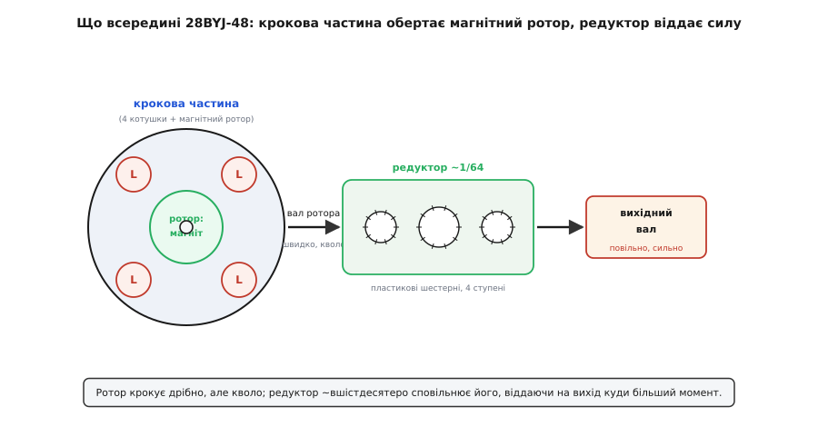
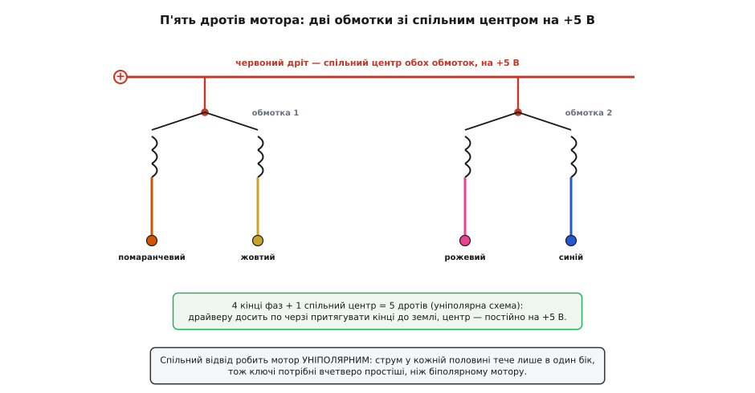
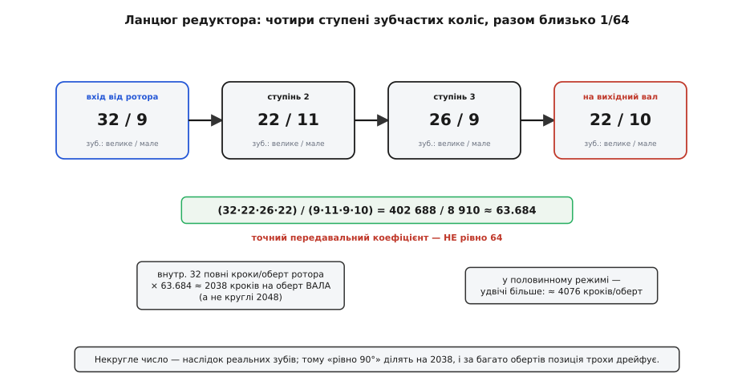

# 28BYJ-48 — кроковий мотор (5V)

<preknowlist>
- [Кроковий мотор](book:electronics/stepper-motor) — крутиться не плавно, а фіксованими кроками; котушки треба вмикати по черзі в правильному порядку, щоб вал повернувся на крок.
- [Електромагніт](book:physics/electromagnet) — котушка зі струмом стає магнітом; вимкнув струм — магнетизм зник. На цьому тримається вся крокова частина.
- [Котушка](book:electronics/inductor-coil) — виток дроту, що накопичує енергію в магнітному полі й опирається різкій зміні струму; кожна обмотка мотора і є така котушка.
- [Редуктор](book:electronics/gears-transmission) — набір зубчастих коліс, що міняє швидкість на силу: менше обертів, зате більший момент.
</preknowlist>

Візьміть у руки маленький сріблястий циліндрик, завбільшки з чималий ґудзик — приблизно 28 міліметрів у поперечнику й із сантиметр заввишки, з прямокутним «вушком» кріплення збоку й тонким білим джгутом на п'ять різнокольорових дротів, що закінчується білою колодкою-роз'ємом. З одного боку стирчить коротка металева вісь із лискою, зазвичай уже з насадженим пластиковим «прапорцем» чи шестернею. Це **28BYJ-48** — найпоширеніший у світі навчальний кроковий мотор, той самий, що лежить майже в кожному стартовому наборі поряд із зеленою платкою драйвера. Коштує копійки, живиться п'ятьма вольтами й уміє одне, зате добре: обертати свою вісь **точними, порахованими кроками**, а не просто «крутитися», як звичайний моторчик.

Саме на ньому найзручніше вперше зрозуміти, чим кроковий мотор відрізняється від решти й чому за копійчаний пластиковий вузол інженери беруться там, де треба **знати кут повороту, не міряючи його**. Звичайному колекторному моторчику ви подаєте напругу — він крутиться, знімаєте — зупиняється, але **де** саме зупинився вал, ви не знаєте: він проскочив за інерцією на невизначений кут. Кроковому ж ви кажете «зроби рівно 512 кроків» — і він повертає вісь на строго відміряну частку оберту й **застигає** там сам, утримуючи позицію. Ось ця здатність рахувати оберт кроками, без жодного давача положення, і є те, за що 28BYJ-48 цінують у стрілках годинників, заслінках, повільних поворотах камери й сотнях саморобок.

### Що означає ця назва

Маркування читається не як випадковий набір, а майже як паспорт. **28** — це діаметр корпусу в міліметрах: мотор належить до цілої китайської родини **BYJ**-моторів різного розміру (є 20BYJ, 24BYJ, 28BYJ, 35BYJ — число завжди діаметр). **BYJ** — це скорочення з китайської транслітерації, що позначає саме цей клас: **кроковий двигун постійного струму з постійним магнітом і вбудованим редуктором** (усталене галузеве позначення серії; точна розшифровка піньїню в англомовних джерелах різниться, тож обмежуся підтвердженим — це серійний код PM-крокового редукторного мотора). **48** — код конкретного виконання в межах серії. Отже, уже з назви видно головне про пристрій: він **маленький** (28 мм), **кроковий**, **з магнітним ротором** і — що найважливіше для його поведінки — **з редуктором усередині**.

Останнє слово тут ключове. Без редуктора крокова частина 28BYJ-48 робила б грубі кроки по 11.25 градуса й майже не мала б сили. Пластиковий редуктор усередині корпусу міняє це докорінно — і саме він, а не сам електромагнітний рушій, робить цей мотор таким, яким ви його знаєте.

### Як він влаштований усередині

Розберімо циліндрик подумки на шари. Зверху сидить власне **крокова частина** — те, що перетворює електрику на обертання, а під нею, у тому ж корпусі, ховається **редуктор** із пластикових шестерень.


*Котушки статора по черзі притягують магнітний ротор, і той крокує дрібно, але з мізерною силою. Його швидка квола вісь заходить у редуктор, який сповільнює обертання приблизно в 64 рази — і тим самим у стільки ж разів множить момент. На виході — вал, що крутиться повільно, зате здатний щось повернути.*

Крокова частина працює на простому фізичному законі: [котушка зі струмом стає електромагнітом](book:physics/electromagnet). По колу нерухомого статора розставлено обмотки; у центрі на осі сидить **ротор — постійний магніт** зі своїми полюсами. Увімкнули струм в одній обмотці — вона стала магнітом і **притягла** до себе найближчий полюс ротора, повернувши вал на маленький кут. Вимкнули її, увімкнули сусідню — ротор перескочив до неї. Женете живлення по обмотках по колу — і магнітне поле «біжить» довкола статора, а ротор слухняно крокує за ним, полюс за полюсом. У цьому вся суть кроку: не плавне тягнення, а серія притягань до обмоток, що загоряються по черзі. (Докладніше сам механізм крокування — у статті про [кроковий мотор](book:electronics/stepper-motor); тут важлива саме реалізація в 28BYJ-48.)

Ротор 28BYJ-48 влаштований так, що на повний оберт **його самого** припадає **32 кроки** в найпростішому режимі — тобто один крок повертає магніт на 11.25 градуса (360 / 32). Це грубо: 32 положення на оберт мало для будь-якої точної роботи, та й момент однієї маленької котушки мізерний — такий ротор і паперовий важіль ледве проверне.

Ось тут у гру входить **редуктор**, і саме він робить 28BYJ-48 корисним. Вал ротора — швидкий і слабкий — заходить у ланцюг пластикових шестерень, який сповільнює обертання приблизно **у 64 рази**. А сповільнення в зубчастій передачі завжди означає рівно стільки ж **множення сили**: у скільки разів упали оберти, у стільки ж виріс момент (закон збереження — потужність на вході й виході майже однакова, тож менше швидкості = більше сили). Тому на вихідному валу ви маєте мотор, що крутиться поволі, зате здатний реально щось повернути — стрілку, заслінку, невеликий важіль.

> 🔧 **Навіщо це.** Ось чому 28BYJ-48 — саме «редукторний» кроковий, а не голий. Голий крокач такого розміру давав би грубий крок і смішну силу — жодного застосування. Редуктор одночасно **подрібнює крок** (2038 положень на оберт замість 32 — про це нижче) **і додає момент**, перетворюючи іграшковий рушій на щось, чим уже можна крутити реальні речі. За це платимо швидкістю: вихідний вал повільний, кільканадцять обертів за хвилину на межі. Треба точно й сильно, але неспішно — це його ніша; треба швидко — беруть інший мотор.

### П'ять дротів: чому їх саме стільки

Найперше, за чим упізнають 28BYJ-48, — це **п'ять** дротів у джгуті, а не два (як у звичайного моторчика) чи чотири. Колір стандартний і сталий: **червоний, помаранчевий, жовтий, рожевий, синій**. Розібратися, чому їх п'ять, — значить зрозуміти половину того, як цим мотором керувати.


*Усередині — дві обмотки, кожна з відводом посередині (центральний відвід). Обидва центри зведено на один червоний дріт, який тримають на +5 В. Драйверу лишається по черзі притягувати до землі чотири кольорові кінці — і струм по половинках обмоток замикається то в один бік, то в інший. Це й зветься уніполярною схемою.*

Усередині мотора не чотири окремі котушки, а **дві обмотки**, і в кожної є **відвід від середини** (англ. *center tap* — центральний відвід). Виходить схема, як два коромисла: у кожної обмотки два кінці й одна точка посередині. Кінців усього чотири (помаранчевий, жовтий, рожевий, синій), а два середні відводи зведено разом в один-єдиний **червоний** дріт. Чотири плюс один — п'ять.

Навіщо так хитро? Заради **простоти керування**. Червоний, спільний, дріт постійно тримають на **+5 вольт**. Тепер, щоб пропустити струм крізь якусь половину обмотки, драйверу досить **притягнути до землі** відповідний кінець — і струм побіжить від плюса через центр до цього кінця. Притягнув інший кінець — струм побіг у другу половину, у **протилежному** напрямку по обмотці. Тобто напрямок магнітного поля міняється не зміною полярності живлення (як довелося б у мотора без відводу), а просто **вибором, який кінець заземлити**. Це і зветься **уніполярним** (лат. *uni* — один, + полюс) вмиканням: живлення завжди одної полярності, а перемикається лише земля.

> 🔧 **Навіщо це.** Уніполярна схема — головна причина, чому 28BYJ-48 такий дешевий у керуванні. Драйверу не треба вміти подавати струм в обидва боки крізь обмотку (для цього потрібен складний [H-міст](book:electronics/h-bridge) з чотирьох ключів на обмотку). Досить чотирьох найпростіших ключів «притягни до землі» — рівно тих, що дає дешева мікросхема [ULN2003](book:power/uln2003-driver). Плата за це — половина міді обмотки в кожен момент простоює (працює лише та половина, чий кінець заземлено), тож момент трохи менший, ніж дав би той самий мотор у біполярному ввімкненні. Для навчального й побутового мотора це чесний розмін: віддали дрібку сили — отримали копійчаний драйвер.

Кольори варто запам'ятати, бо в коді знадобиться саме їхній порядок: **червоний — спільний (+5 В)**, а чотири фази у природній послідовності обмоток ідуть **помаранчевий, рожевий, жовтий, синій** (парами по обмотках: помаранчевий-жовтий — одна, рожевий-синій — друга). Якщо мотор крутиться не в той бік або тремтить на місці — майже завжди переплутано порядок цих чотирьох кінців у коді, а не щось у залізі.

### Скільки кроків на оберт: славнозвісні 2038, а не 2048

Найтонше й найцікавіше число цього мотора — скільки кроків він робить на повний оберт **вихідного** вала. Тут ховається пастка, на якій спотикаються всі, хто пише для нього код уперше.

Спокуслива логіка така: ротор робить 32 кроки на свій оберт, редуктор сповільнює в 64 рази, отже на вихідний вал — 32 × 64 = **2048** кроків, кругле й гарне число. Майже правильно. Халепа в тому, що **передавальний коефіцієнт редуктора не рівно 64**.


*Редуктор складається з чотирьох послідовних ступенів зубчастих пар. Добуток їхніх передавальних співвідношень дає не рівно 64, а приблизно 63.684 — некругле число, бо реальні шестерні мають цілу кількість зубів, яку не підігнати точно під 64. Помноживши 32 внутрішні кроки на цей коефіцієнт, дістаємо близько 2038 кроків на оберт вихідного вала.*

Точний коефіцієнт визначається кількістю зубів на кожній шестерні редуктора — а зубів завжди ціле число, і підібрати їх так, щоб добуток вийшов рівно 64, конструктори не змогли (та й не мали потреби). Ентузіасти розібрали мотор, полічили зуби й вирахували справжнє значення:

```
передавальний коефіцієнт = (32·22·26·22) / (9·11·9·10) ≈ 63.684
кроків на оберт вала (повний крок) = 32 · 63.684 ≈ 2038
кроків на оберт вала (половинний крок) = 2 · 2038 ≈ 4076
```

Тому в коді «кроків на оберт» треба зашивати **2038**, а не спокусливі 2048 (усталений факт, підтверджений розрахунком за зубами шестерень; трапляються партії з трохи іншим редуктором і коефіцієнтом близько 63.9, але 63.684 — типове й найпоширеніше). Різниця здається дрібною — менш ніж півпроцента, — але вона **накопичується**: якщо крутити мотор на десятки обертів, помилка «2048 замість 2038» зсуне позицію на цілі кроки, і «поверни рівно на 10 обертів» промахнеться на помітний кут.

> 🔧 **Навіщо це.** Некругле число — не дефект, а прямий наслідок того, що шестерні реальні, а не ідеальні. Практичний висновок серйозний: 28BYJ-48 **не годиться для точного абсолютного позиціювання** без звірки. За один оберт похибка мізерна, і для стрілки чи заслінки байдужа. Але тримати абсолютний кут, лічачи кроки тисячами, він не вміє — дрейф з'їсть точність. Де потрібна певна позиція надовго (нуль механізму, крайнє положення) — її звіряють **кінцевим вимикачем чи давачем**, а лічильник кроків використовують лише для відносних рухів між звірками. Це загальне правило крокових приводів без зворотного зв'язку, і 28BYJ-48 — його наочний приклад.

### Як його крутять: драйвер і послідовність

Сам мотор — це лише котушки й магніт; жодної електроніки в ньому немає. Щоб він закрокував, потрібні дві речі: **достатній струм** і **правильна послідовність** увімкнень.

Чому не можна крутити його прямо з мікроконтролера? Одна обмотка 28BYJ-48 при п'яти вольтах тягне на себе десь **160–200 міліампер** струму, а вивід Arduino чи ESP32 безпечно віддає лише 20–40. Спробуєте живити обмотку прямо з ніжки — або ніжка згорить, або струму просто не вистачить, і вал не зрушить. Потрібен **силовий посередник** — драйвер, що слухається слабкого сигналу, а сам пропускає крізь себе великий струм обмотки.

Для 28BYJ-48 цим посередником майже завжди служить плата на мікросхемі **ULN2003** — та сама зелена (чи синя) платка, що продається з мотором однією парою. Вона має білу п'ятиконтактну колодку рівно під роз'єм цього мотора, чотири входи під сигнали мікроконтролера, клему живлення й чотири світлодіоди-індикатори. Уся її розводка, схема ключів, підключення пін-у-пін і чому вона притягує виходи до землі — розібрані [в окремій статті про плату ULN2003](book:power/uln2003-driver); повторювати їх тут не буду, бо це вже про драйвер, а не про мотор.

Що ж стосується самого мотора, то від драйвера він хоче однієї речі — щоб обмотки вмикали **в суворій послідовності**, яка жене магнітне поле по колу. Найкраще з 28BYJ-48 працює **половинний крок** (англ. *half-step*): режим, де обмотки вмикають то поодинці, то парами внахлест, і поле повертається на пів звичайного кроку за такт. Це дає вдвічі дрібніший крок і помітно плавніший, тихіший хід. Уся послідовність — вісім станів чотирьох фаз, де точка живлення «пливе» по обмотках:

```
такт   помаранч.  рожевий  жовтий  синій
 1        1         0        0       0
 2        1         1        0       0
 3        0         1        0       0
 4        0         1        1       0
 5        0         0        1       0
 6        0         0        1       1
 7        0         0        0       1
 8        1         0        0       1
```

Одиниця тут означає «цей кінець обмотки заземлено, півобмотка під струмом». Придивіться до візерунка: одиниця плавно перетікає згори вниз по стовпцях, а між чистими станами (одна фаза) вклинюються перехідні (дві сусідні разом) — саме ці пари й додають половинний крок. Дійшовши до восьмого рядка, повертаються на перший, і вал крутиться далі. Женете рядки у зворотному порядку — мотор іде назад. Швидше міняєте рядки — швидше крутиться, до межі, за якою ротор перестає встигати за полем і «зривається»: гуде, тремтить, але не обертається.

На практиці цю вісімку рідко набивають руками — стандартні бібліотеки роблять це за вас. У світі Arduino це `Stepper` чи спеціалізована `AccelStepper`; вони самі женуть послідовність, тримають лічильник кроків і дають команди штибу «поверни на N кроків» чи «крутись зі швидкістю V». Готовий робочий приклад коду — як під'єднати, як задати ті самі 2038 кроків на оберт, як керувати напрямом і швидкістю, і на яку пастку з **порядком фаз** тут наступають чи не всі — зібрано в [окремому проєкті-вставці з API](book:actuators/28byj-48-stepper/api-arduino.md).

### Чого стерегтися й де його місце

28BYJ-48 — чудовий, але має чіткі межі, і чесно їх знати наперед.

**Він повільний.** Через редуктор вихідний вал крутиться неквапом — типово до 15 обертів за хвилину, вище він просто зривається. Для стрілки, заслінки, повільного панорамування камери це якраз добре; для швидкого приводу — беруть інше.

**Момент скромний.** Пластиковий редуктор дає непоганий момент для такого розміру (близько 300 грам-сантиметрів у типового зразка), але це все ж іграшковий мотор — вал легко заклинити пальцями, а пластикові зуби можна зірвати різким ударним навантаженням. Навантажуйте в межах сотень грам-сантиметрів, не більше.

**Він гріється, коли стоїть під струмом.** Якщо лишити обмотку ввімкненою, щоб мотор **тримав** позицію, крізь неї весь час тече струм — і мотор помітно теплішає, дарма що не рухається. Це нормально для крокового мотора (так він і утримує вал), але якщо тримати позицію не треба, у коді варто **знеструмлювати обмотки** (усі фази в нуль) між рухами — і холодніше, і струм економиться.

**Він точний лише відносно.** Через некруглий редуктор (ті самі 2038, а не 2048) абсолютну позицію за багато обертів він губить. Для повторюваних відносних рухів це неважливо; для «стань рівно сюди й тримай координату місяцями» — звіряйте з давачем.

**Живлення — окреме й не з USB-ніжки.** Мотор у пікові моменти бере кількасот міліампер, тож живити його з виводу 5 В плати, коли та сама висить на USB, — погана ідея: USB часто не тягне пусковий струм, плата перезавантажується. Дайте мотору окреме 5-вольтове джерело, здатне на щонайменше ампер, а землю його **обов'язково** об'єднайте із землею мікроконтролера, інакше сигнали не матимуть спільної точки відліку.

Насамкінець — головна думка, яку цей копійчаний циліндрик вкладає в голову. Кроковий мотор дає те, чого не дає жоден звичайний моторчик: **обертання, поділене на пораховані кроки**, тож кут повороту ви **задаєте числом**, а не міряєте. 28BYJ-48 робить цю ідею доступною за копійки — ціною швидкості й абсолютної точності. Зрозумівши, чому в нього п'ять дротів (уніполярна схема з центральним відводом), чому 2038, а не 2048 кроків (реальні зуби редуктора), і чому між ним і мікроконтролером завжди стоїть драйвер (обмотка хоче струму, якого ніжка не дасть), — ви розібралися не лише в цьому моторі, а в тому, як узагалі влаштоване точне крокове обертання від електрики.
