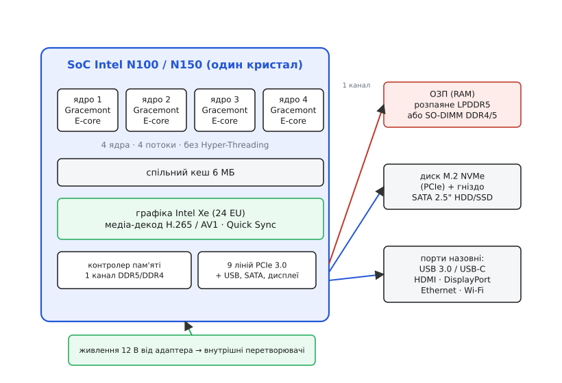
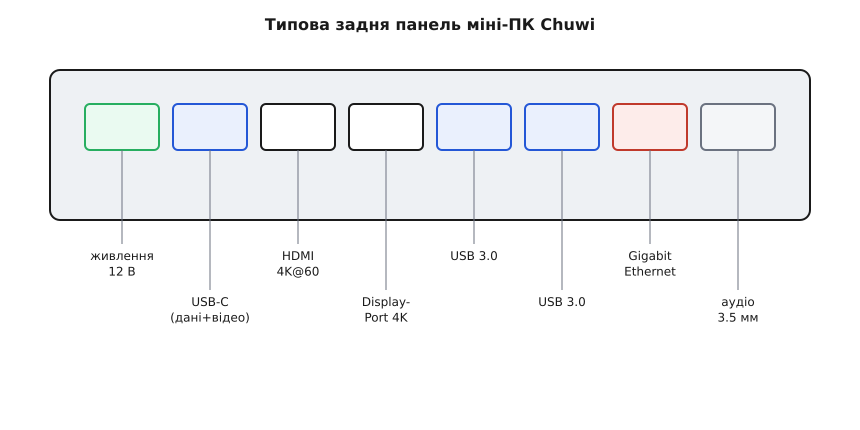

# Міні-ПК Chuwi (x86)

<preknowlist>
- [Одноплатний комп'ютер (SBC)](topic:programming/single-board-computer) — що це за клас: повний комп'ютер на одній платі, вантажить ОС, працює як малий сервер; саме з ним порівнюємо x86-міні-ПК.
- [Мікроконтролер](topic:programming/microcontroller) — щоб бачити межу спектра: міні-ПК — не МК, у нього повна ОС і диск, а не гола прошивка на голому кремнії.
</preknowlist>

На долоні лежить коробочка завбільшки з дві колоди карт — квадрат приблизно 13×13 сантиметрів, заввишки з палець, вагою десь із півкіло. Ззаду — ряд знайомих гнізд: HDMI, кілька USB, мережевий роз'єм, кругле гніздо живлення. Це **Chuwi** — марка недорогих готових **x86-міні-ПК** із Шеньчженю (компанію засновано 2004 року, спершу вона робила MP3-плеєри, згодом планшети, а тепер і ці малі комп'ютери). Усередині — не мікроконтролер і не «покращена малинка», а **справжній персональний комп'ютер з архітектурою Intel x86**: той самий набір команд, що й у ноутбука чи настільної машини, лише втиснутий у крихітний корпус із процесором, який їсть одиниці ват.

Головна думка, з якої варто почати: **це не плата для паяння, це закінчений комп'ютер**. У нього немає гребінки GPIO, до нього не чіпляють давачі дротами, з нього не «прошивають» світлодіод. Він приходить у зібраному корпусі, з блоком живлення, часто вже з Windows на диску — увімкнув, підключив монітор і клавіатуру, і за хвилину перед тобою робочий стіл. Саме тому його беруть не туди, куди беруть Arduino чи навіть Raspberry Pi, а туди, де потрібен **тихий, дешевий і маленький повноцінний ПК**: домашній сервер, медіацентр під телевізором, офісна машинка для документів, вузол, що цілодобово крутить кілька програм у кутку кімнати.

Розберімо цю річ так, щоб її впізнати, зрозуміти, що в неї всередині й на що вона здатна, як її під'єднати й чого від неї не варто чекати.

## Чому «x86» — і чому це не Raspberry Pi

Слово **x86** (від назви процесорів Intel серії 8086 і далі — 80286, 80386, «…86») позначає **сімейство архітектур набору команд** (англ. *instruction set architecture*), яке десятиліттями панує в настільних ПК і ноутбуках. Це важливо не заради історії, а через **сумісність із програмами**. Величезний світ готового софту — Windows, звичайний десктопний Linux, x86-збірки застосунків, бінарні пакети, ігри, драйвери — скомпільований саме під x86. Вставив у міні-ПК образ Windows чи Ubuntu — і воно просто працює, без жодних «а чи є збірка під мою плату».

Порівняння з [Raspberry Pi](topic:boards/rpi5) робить різницю відчутною. Малинка — це **ARM-SBC** (одноплатний комп'ютер на процесорі архітектури ARM). Вона теж комп'ютер, теж крутить Linux, теж маленька — але архітектура інша, тож частина програм під неї не зібрана або йде в емуляції. Натомість у малинки є те, чого нема в міні-ПК: **гребінка GPIO** — рядок виводів, якими вона напряму смикає «залізо» (світлодіоди, давачі, мотори через драйвери), говорить по [SPI](topic:communications/spi-bus), I²C, читає аналог. Ось справжня межа між ними:

```
                Chuwi (x86-міні-ПК)      Raspberry Pi (ARM-SBC)
────────────────────────────────────────────────────────────────
архітектура     Intel x86                ARM
GPIO / «залізо» немає                    є (40 виводів)
запуск ПЗ       будь-який x86-софт        ARM-збірки
типова роль     сервер, десктоп, медіа    робота з електронікою + Linux
живлення        ~6–25 Вт (адаптер 12 В)   ~3–8 Вт (USB-C)
```

Звідси проста настанова вибору. Треба **керувати електронікою** — давачі, мотори, шини — бери SBC з GPIO (малинку) або мікроконтролер. Треба **дешевий тихий повноцінний ПК** — щоб крутив звичайний софт, тримав сервіси, показував відео на телевізорі — бери x86-міні-ПК на кшталт Chuwi. Це різні інструменти, і плутати їх — марнувати гроші й нерви.

> 🔧 **Навіщо це.** Найчастіша помилка новачка — купити міні-ПК, щоб «підключити давач температури й помигати світлодіодом». До нього фізично нема куди — GPIO немає, є лише USB. Довелося б докуповувати USB-перехідники на GPIO/I²C, і це виходить незграбно й дорожче за малинку. Правило коротке: якщо в задачі є **дроти до давачів і виконавчих пристроїв** — це не робота для x86-міні-ПК; якщо задача — **обчислення, сервіси, екран** — це саме він.

## Що всередині: система-на-кристалі Intel N100 / N150

Серце цих коробочок — **система-на-кристалі** (англ. *SoC, System on a Chip*): один шматок кремнію, у якому зібрано процесорні ядра, графіку, контролер пам'яті й контролери периферії разом. У бюджетних Chuwi це майже завжди Intel лінійки **N** — насамперед **N100**, а в новіших моделях його трохи розігнаний нащадок **N150**.

Придивімось, чому саме ці чипи зробили клас дешевих міні-ПК можливим. N100 належить до архітектури Intel під назвою **Alder Lake-N**. У ньому **чотири ядра типу Gracemont** — це так звані **E-ядра** (від *efficient*, «ощадливі»): ті самі малі енергоефективні ядра, що у великих настільних процесорах Intel стоять поряд із «продуктивними» P-ядрами й доробляють фонову роботу. Тут P-ядер немає взагалі — лише чотири малих. Важлива дрібниця: ці ядра **не мають Hyper-Threading**, тож чотири ядра дають рівно **чотири потоки** (не вісім). Тактова частота гуляє приблизно від 1 до 3.4 ГГц, спільного кешу — 6 МБ.


*Один кристал містить чотири ядра Gracemont, спільний кеш, графіку Intel Xe з медіа-декодером і контролери пам'яті та PCIe. Плата навколо додає ОЗП (розпаяне LPDDR5 або модуль SO-DIMM), диск M.2 NVMe й гніздо SATA, виводить назовні порти й годує все живленням 12 В від зовнішнього адаптера.*

Магія цього чипа — у **співвідношенні роботи до ват**. Його базове енергоспоживання — лише близько **6 Вт**. Це настільки мало, що процесор можна охолоджувати **без вентилятора взагалі** — пасивним радіатором, у німій тиші. При цьому за обчислювальною спромогою чотири Gracemont приблизно дорівнюють настільному Core i5 середини 2010-х, який їв на порядок більше. Саме ця математика — «майже як старий десктоп, але на потужності світлодіодної лампочки» — і породила цілий ринок дешевих міні-ПК; Chuwi лише один із багатьох, хто ставить N100 у гарний маленький корпус.

Усередині SoC є ще два вузли, які на практиці варті окремого слова. Перший — **вбудована графіка Intel Xe** (24 обчислювальні блоки, EU): її вистачає на робочий стіл, кілька моніторів у 4K і легкі ігри, але це не карта для важкого 3D. Другий, і для домашнього сервера часто важливіший, — **апаратний медіа-декодер**: окремий блок, що розкодовує відео H.265 (HEVC), H.264 та AV1 «залізом», не навантажуючи ядра. Завдяки Intel Quick Sync така коробочка **перекодовує й роздає відео** (наприклад, під Plex чи Jellyfin) майже задарма за енергією — це одна з причин, чому N100-міні-ПК так люблять як домашній медіасервер.

**N150** — це не новий чип, а **освіжена, трохи швидша версія N100** (кодова назва Twin Lake). Та сама четвірка ядер, той самий кеш і ті самі 6 Вт базово, але турбо-частота піднята до 3.6 ГГц, а графіка тактується вище. На практиці різниця скромна: приблизно 5–10% до процесора й помітніший приріст (близько третини) до графіки. Якщо перед вами вибір між свіжою моделлю на N150 і старою на N100 за ту саму ціну — беріть N150; ганятися ж за заміною робочого N100 на N150 сенсу мало.

> 🔧 **Навіщо це.** Знання, що це **чотири ядра без Hyper-Threading і один канал пам'яті**, одразу окреслює межу можливого. Така машина чудово тягне десяток легких контейнерів, файловий сервер, домашню автоматику, роздачу медіа. Але щойно ви даєте їй важку паралельну працю — компіляцію великого проєкту, багато важких віртуалок, серйозну базу під навантаженням — чотирьох ощадливих ядер і одноканальної пам'яті бракує, і вона впирається. Купуючи, чесно зважте, скільки **одночасної** роботи буде: для «фонового вузла» N100 ідеальний, для «робочого коня під навантаженням» — беріть щось більше.

## Пам'ять і диск: що можна, а що ні

Тут ховається кілька обмежень, які прямо випливають із дешевого SoC, і про них варто знати ще до покупки.

**Оперативна пам'ять.** Контролер N100/N150 — **одноканальний** і працює з DDR5-4800, DDR4-3200 або LPDDR5-4800. Офіційна межа Intel — **16 ГБ**. На практиці спільнота давно ставить і 32 ГБ одним модулем, і на багатьох платах це працює, але гарантії від виробника чипа тут немає. Одноканальність означає, що пропускна здатність пам'яті вдвічі скромніша за дводоступні настільні системи — ще одна причина, чому важкі навантаження цей клас недолюблює. У конкретних Chuwi пам'ять буває двох виглядів: **розпаяна** прямо на платі (тоді її не наростиш — скільки продали, стільки й є) або у вигляді **знімного модуля SO-DIMM** (тоді її можна замінити на більшу). Це перше, що варто з'ясувати про конкретну модель, якщо думаєте про майбутнє нарощення.

**Диск.** Тут із розширенням зазвичай краще. Типовий набір гнізд:

```
Гніздо              Що ставлять                 Типова стеля
──────────────────────────────────────────────────────────────
M.2 (PCIe/NVMe)     основний швидкий SSD        1–2 ТБ
SATA 2.5"           додатковий HDD або SSD      2 ТБ
microSD (TF)        картка як повільне сховище  ~128 ГБ
```

Основний диск — **M.2 NVMe SSD**, під'єднаний через лінії PCIe самого SoC (тих ліній у N100 усього дев'ять на всю периферію, тож на NVMe припадає вузька, але цілком робоча смуга). Багато Chuwi додають ще **відсік під 2.5-дюймовий SATA-накопичувач** — зручно, коли хочеться окремо швидкий системний SSD і місткий дешевий диск під дані. У найменших моделях внутрішнього SATA може й не бути — тоді диск лише один, M.2.

## Порти: чим коробочка спілкується зі світом

Оскільки GPIO тут немає, уся зв'язність — через **звичайні комп'ютерні порти** на панелях корпусу. Набір типовий для класу, і кожен роз'єм має своє призначення.


*Зліва направо: кругле гніздо живлення 12 В; повнофункціональний USB-C (дані та відео); два відеовиходи HDMI й DisplayPort (кожен до 4K@60 Гц, тож можна два монітори); кілька портів USB 3.0 під клавіатуру, мишу, накопичувачі; дротовий Gigabit Ethernet; аналогове аудіо 3.5 мм. Бездротовий зв'язок (Wi-Fi і Bluetooth) — усередині, антени в корпусі.*

Кілька практичних наголосів. **Два відеовиходи** (HDMI + DisplayPort, часто плюс відео через USB-C) означають, що до крихітної коробочки можна повісити **два монітори 4K** одночасно — для офісного робочого місця цього з головою. **Gigabit Ethernet** — дротова мережа на гігабіт: для сервера це надійніше й стабільніше за Wi-Fi, тож вузол зазвичай саджають на кабель. **USB-C** тут повнофункціональний — тобто вміє й дані, й відеовихід (а іноді й живлення), на відміну від простого USB-C «тільки заряджання» у дешевих гаджетах. **Wi-Fi і Bluetooth** — на внутрішньому модулі (у сучасних моделях це зазвичай Wi-Fi 6 і Bluetooth 5.x), антени сховані в корпусі.

## Живлення, тепло й форм-фактор

Живиться така машина від **зовнішнього адаптера на 12 вольтів** через кругле гніздо (як у багатьох ноутбуків-нетбуків), а не від USB-C-зарядки й не від настільного блока живлення. Споживання скромне: у спокої одиниці ват, під навантаженням — приблизно до 15–25 Вт залежно від чипа й того, наскільки виробник дозволив йому «розганятися» понад базові 6 Вт. За добу безперервної роботи це копійки за електрику — саме тому клас так добре надається на **цілодобовий домашній сервер**.

Охолодження буває двох порід, і це варто розрізняти. **Пасивне (без вентилятора)** — увесь корпус працює радіатором, машина абсолютно німа; так зроблено, наприклад, компактний HeroBox. Плюс — тиша й відсутність деталі, що може зламатися; мінус — під тривалим важким навантаженням чип упирається в тепло й **скидає частоту** (тротлить), тож стійку максимальну потужність пасивна коробочка тримає гірше. **Активне (з вентилятором)** — маленький кулер продуває радіатор; так побудовано, наприклад, LarkBox X із гібридним охолодженням. Плюс — тримає вищі частоти довше; мінус — тихий, але не безшумний шелест і рухома деталь. Для німого медіацентра під телевізором обирають пасивну модель; для машинки, що іноді працює на повну, — активну.

Розмір цих коробок — справді малий: типова LarkBox X — близько 127×127×49 мм при вазі під 400 грамів, HeroBox — менш ніж літр об'єму. Майже всі мають на дні отвори під **кріплення VESA** — стандартну сітку кріплень на задній стінці моніторів і телевізорів. Це дозволяє **пригвинтити міні-ПК прямо за монітор** і отримати «моноблок» без жодного комп'ютера на столі — популярний хід для чистого робочого місця й для інформаційних табло.

## Що на ній запускають і навіщо вона взагалі

Оскільки це повноцінний x86-ПК, вибір системи широкий. Chuwi здебільшого приходять із **Windows 11** на диску — увімкнув і працюєш. Але саме як **сервер** ці коробочки найчастіше переводять на **Linux** (Debian, Ubuntu, Proxmox для віртуалізації) чи на спеціалізовані складанки — TrueNAS для мережевого сховища, OPNsense/pfSense для домашнього маршрутизатора-брандмауера. Усе це — звичайні x86-збірки, які встановлюються так само, як на будь-який ПК.

Куди їх реально ставлять:

- **Домашній сервер і NAS** — файли, резервні копії, хмара для родини, торенти. Тихо, дешево за струмом, місткість нарощується диском.
- **Медіацентр** — під телевізором, роздає відео (Plex/Jellyfin) з апаратним декодуванням, показує 4K.
- **Легка віртуалізація** — кілька контейнерів чи маленьких віртуалок (домашня автоматика, DNS-фільтр, невеликі веб-сервіси) на одному вузлі.
- **Тонкий офісний ПК** — документи, браузер, відеодзвінки, два монітори; займає менше місця, ніж клавіатура.
- **Цифрове табло** — пригвинчений за екран, крутить рекламу чи інформаційну панель роками.

Практичний бік «як зробити з коробочки безголовий сервер» — під'єднатися по SSH, підняти сервіси в Docker, оформити власну програму як службу systemd, керувати нею з коду — винесено в окрему [збірку прикладів на C/C++](topic:boards/minipc-chuwi/proj-headless-server.md): там показано, як програмно керувати таким вузлом, як тримати процес живучим і які пастки чекають на того, хто вперше піднімає домашній сервер.

> 🔧 **Навіщо це.** Найкраще, що вміє N100-міні-ПК, — це **бути непомітним**. Він стоїть у кутку, не шумить, майже не їсть струм, роками тримає кілька легких сервісів і не потребує уваги. Якщо ваша мета саме така — «поставив і забув, хай крутить» — це ідеальна для неї машина. Якщо ж ви чекаєте від неї продуктивності робочої станції, вона розчарує: її сила не в піковій швидкості, а в **тиші, ціні й ощадливості на тривалій дистанції**.

## Чого стерегтися

Кілька речей, на яких новачки спотикаються саме з цим класом.

**Це не заміна потужному ПК.** Спокуса «маленьке й дешеве, візьму замість настільної машини» часто закінчується розчаруванням: чотири ощадливих ядра й одноканальна пам'ять — це рівень старенького комп'ютера, а не сучасного робочого коня. Для монтажу відео, важких ігор, великих компіляцій чи багатьох одночасних віртуалок бракне і ядер, і пам'яті. Чесно оцініть навантаження **до** покупки.

**Стеля пам'яті.** Офіційні 16 ГБ — реальне обмеження платформи. Якщо в моделі пам'ять **розпаяна**, наростити її потім не вийде взагалі — скільки взяли, стільки й буде на весь строк служби. Беручи машину «на виріст», шукайте варіант зі знімним модулем SO-DIMM або одразу з достатнім обсягом.

**Одноканальність — це назавжди.** Пропускну здатність пам'яті на цій платформі не покращити: контролер одноканальний за конструкцією чипа. Це системне обмеження, а не недогляд конкретного виробника.

**Тепло під навантаженням у пасивних моделях.** Безвентиляторна коробочка тиха, але під тривалим важким навантаженням гріється й **скидає частоту**. Якщо плануєте регулярно вантажити її по-справжньому — беріть модель з активним охолодженням або змиріться з тим, що пікову швидкість вона тримати не буде.

**Якість і підтримка бюджетної марки.** Chuwi — недорогий китайський бренд; це відбивається на дрібницях: комплектний блок живлення, оновлення BIOS, драйвери, гарантійне обслуговування бувають слабшою ланкою, ніж у дорожчих виробників. Для домашнього вузла це зазвичай прийнятно — але для чогось відповідального варто це врахувати й тримати резервні копії.

Підсумок простий: **x86-міні-ПК Chuwi — це маленький тихий недорогий повноцінний комп'ютер, а не плата для електроніки й не робоча станція**. У своїй ніші — цілодобовий домашній вузол, медіацентр, тонкий офісний ПК — він дає рідкісне поєднання ціни, тиші й ощадливості. Головне — брати його саме під цю нішу, тверезо розуміючи, де закінчуються чотири ощадливі ядра.
