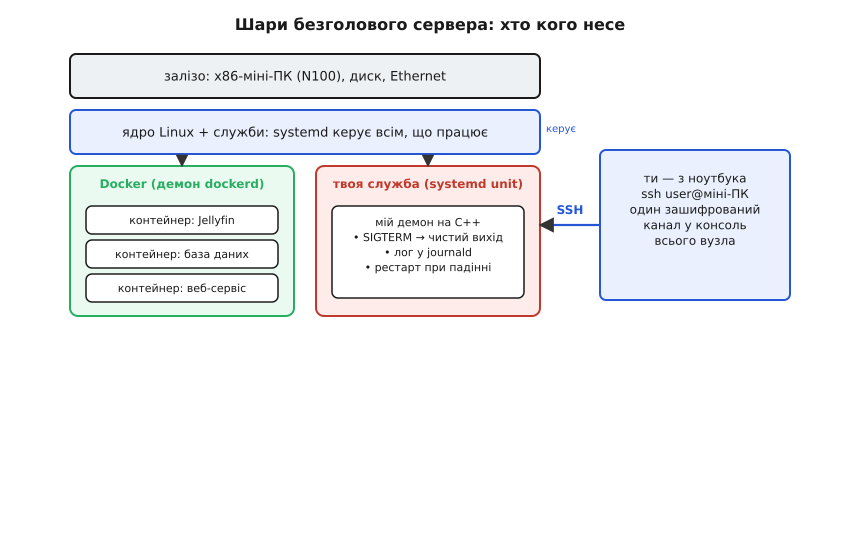

# ⚙️ Безголовий сервер на міні-ПК: SSH, Docker, systemd

Коробочка стоїть у кутку без монітора, без клавіатури, без миші — «безголова» (англ. *headless*). І саме так її й хочеться тримати: увімкнув живлення, засунув на полицю за роутер, забув. Але щоб забути, треба спершу навчитися **говорити з нею без екрана** й **лишати на ній програми, які самі себе доглядають** — стартують при вмиканні, підводяться після падіння, чесно вмирають, коли ти просиш зупинитися, і залишають слід у логах, коли щось пішло не так.

Ця стаття — практична збірка про те, як цей вузол оживити з коду на C/C++. Пройдемо весь шлях: зайти по SSH, підняти чужі сервіси в контейнерах, а тоді написати **власний живучий демон** на C++ і оформити його службою так, щоб система тримала його за руку. Наприкінці — граблі, на які наступає майже кожен, хто вперше піднімає домашній сервер: заблоковані порти, права доступу, тепловий тротлінг під навантаженням і резервні копії, яких нема саме тоді, коли вони потрібні.

Одна межа, яку варто провести одразу. Тут немає гребінки виводів, немає давачів на дротах, немає «прошивки» голого кремнію. Це повний x86-Linux, і весь код — **звичайні POSIX-програми**, ті самі, що працювали б на будь-якому сервері. Різниця лише в масштабі й ціні: чотири ощадливі ядра, які цілодобово їдять як лампочка. Тому й прийоми ми беремо серверні, а не мікроконтролерні.

## Задача: керувати вузлом, якого не бачиш

Сформулюймо чесно, що саме має вміти «безголовий сервер», перш ніж кидатися в команди.

**По-перше, доступ.** Без монітора єдиний спосіб щось зробити — під'єднатися по мережі й отримати **консоль**: те саме вікно з командним рядком, наче ти сидиш за клавіатурою машини, тільки за сотні кілометрів. Це робить SSH.

**По-друге, чужі сервіси.** Медіасервер, база даних, домашня автоматика, DNS-фільтр — усе це готові програми, які хочеться поставити **швидко, ізольовано й так, щоб вони не побилися між собою** за версії бібліотек. Це робить Docker.

**По-третє, свій код.** Рано чи пізно ти пишеш **власну маленьку програму** — збирач даних, вебгачок, сторож папки — і хочеш, щоб вона працювала завжди, а не «поки відкритий термінал». Це робить systemd.

Ці три шари складаються в стос: залізо тримає Linux, Linux через systemd керує всім, що на ньому працює, а ти заходиш до всього цього одним зашифрованим каналом по SSH.


*Знизу вгору: залізо → ядро Linux, яким диригує systemd → рівень служб, де поряд живуть чужі сервіси в Docker-контейнерах і твоя власна програма як systemd-unit. Праворуч — ти з ноутбука: один канал `ssh` відкриває консоль до всього стека. systemd керує обома стовпцями рівня служб — і контейнерним демоном, і твоєю службою.*

## SSH: консоль по проводу без дроту

**Ідея.** SSH (англ. *Secure Shell*, «захищена оболонка») — це протокол, що дає тобі командний рядок віддаленої машини через зашифрований канал. Ти друкуєш у себе — команди летять на сервер, їхній вивід повертається тобі. Наче поставили дуже довгий, дуже безпечний кабель від твоєї клавіатури до консолі коробочки.

На боці сервера працює **демон** `sshd` — фонова програма, що слухає мережу на **порту 22** й чекає на вхідні з'єднання. У більшості складанок Linux його або вже ввімкнено, або вмикають одним рухом:

```bash
sudo apt install openssh-server
sudo systemctl enable --now ssh      # запустити зараз і при кожному завантаженні
```

Тепер із ноутбука треба знати лише **IP-адресу** вузла в домашній мережі. Її видає роутер по DHCP; підглянути можна на самому вузлі командою `ip addr` (якщо тимчасово підключити монітор один раз) або в списку клієнтів роутера. Далі — заходимо:

```bash
ssh andrij@192.168.1.50
```

Перше з'єднання питає, чи довіряєш ти ключу сервера (він показує його відбиток — це захист від підміни машини посередником), і просить пароль. І ти вже в консолі коробочки: `htop`, `docker ps`, редагування файлів — усе так, ніби ти за нею сидиш.

> 🔧 **Навіщо це.** Порт 22 — це той самий поняттєвий порт, що й у мережевому програмуванні: [номер, який розрізняє служби на одній IP-адресі](book:communications/tcp-vs-udp). SSH не «магія віддаленого столу» — це звичайне TCP-з'єднання до конкретного порту, тільки вміст зашифровано. Розумієш це — розумієш, чому вузол може водночас віддавати консоль на 22, вебсторінку на 80 і медіа на 8096: різні порти, той самий кабель.

**Вхід без пароля — ключами.** Друкувати пароль щоразу муляє, а головне — пароль можна підібрати. Надійніший і зручніший шлях — **пара ключів**: секретний лишається в тебе на ноутбуку, відкритий кладеться на сервер. Хто має відкритий ключ, може *перевірити* підпис, але не може його *підробити* — тому відкритий не таємниця.

```bash
ssh-keygen -t ed25519                 # створити пару (раз на життя ноутбука)
ssh-copy-id andrij@192.168.1.50       # покласти відкритий ключ на сервер
```

Після цього `ssh andrij@192.168.1.50` заходить миттєво, без пароля. А коли ключі працюють, розумно **вимкнути вхід паролем узагалі** — у файлі `/etc/ssh/sshd_config` виставити `PasswordAuthentication no` й перезапустити `sshd`. Тоді жоден перебір паролів по мережі вже не має сенсу: у двері можна ввійти лише з твоїм ключем.

> 🔧 **Навіщо це.** Домашній сервер, до якого дістають ззовні, за годину після появи в мережі починають мацати боти — тисячі спроб `root`/`admin`/`123456` на порт 22. Поки вхід лише паролем, це реальна загроза. Ключі закривають її начисто: підібрати 256-бітний ключ Ed25519 перебором фізично неможливо. Це не параноя, а гігієна — та сама, що [контрольна сума в каналі зв'язку](book:communications/reliable-link): дешева перевірка, що відсікає цілий клас лиха.

## Docker: чужі сервіси, які не б'ються між собою

**Ідея.** Ти хочеш поставити Jellyfin (медіасервер), поряд базу PostgreSQL, поряд домашню автоматику. Кожна програма тягне свій ворох бібліотек своїх версій — і якщо ставити їх «просто в систему», вони рано чи пізно посваряться: одній треба `libssl` однієї версії, іншій — несумісної. Класична «пекельна каша залежностей».

**Контейнер** розрубує цей вузол. Це запакована в один образ програма **разом з усім своїм оточенням** — бібліотеками, файлами, налаштуваннями, — яка працює в ізольованому пуделку поверх спільного ядра Linux. Із середини контейнер бачить наче окрему маленьку систему; ззовні це звичайний процес, тільки відгороджений від решти. Дві програми в двох контейнерах не бачать бібліотек одна одної й не можуть посваритися — у кожної своя коробка.

> 🔧 **Навіщо це.** Ключова відмінність від віртуальної машини: контейнер **не тягне окрему операційну систему**, він ділить ядро з хостом. Тому на скромних чотирьох ядрах N100 десяток контейнерів почувається легко — накладні витрати мізерні, це майже просто набір ізольованих процесів, а не десяток повних Linux-ів. Саме тому Docker так пасує цьому класу заліза: він дає ізоляцію майже задарма за ресурсами.

Ставимо Docker і піднімаємо перший сервіс:

```bash
curl -fsSL https://get.docker.com | sudo sh          # офіційний скрипт установлення
sudo usermod -aG docker $USER                        # щоб не писати sudo щоразу (перезайти по SSH)

docker run -d \
  --name jellyfin \
  --restart unless-stopped \
  -p 8096:8096 \
  -v /srv/media:/media \
  jellyfin/jellyfin
```

Розберімо цей запуск по прапорцях — кожен несе сенс, і кожен пов'язаний з якоюсь пасткою нижче:

```
-d                    відв'язатися від термінала (працює у фоні)
--name jellyfin       людське ім'я замість випадкового хешу
--restart unless-stopped   підніматися після падіння й після перезавантаження
-p 8096:8096          пробити порт 8096 контейнера назовні, на той самий порт хоста
-v /srv/media:/media  вкласти теку хоста /srv/media всередину як /media
```

Найважливіший для «поставив і забув» — `--restart unless-stopped`. За домовчанням політика перезапуску — **`no`**: якщо контейнер упав чи машину перезавантажили, він так і лишиться лежати, доки ти вручну його не піднімеш. `unless-stopped` каже інакше: підіймай після будь-якого падіння **і** після перевантаження вузла — але не чіпай, якщо я зупинив контейнер сам, свідомо. Це саме те, що треба цілодобовому сервісу.

Далі, коли контейнерів стає більше, запускати їх довгими командами руками — мука. Тоді набір сервісів описують одним файлом `docker-compose.yml` і піднімають усе разом:

```yaml
services:
  jellyfin:
    image: jellyfin/jellyfin
    restart: unless-stopped
    ports:
      - "8096:8096"
    volumes:
      - /srv/media:/media

  db:
    image: postgres:16
    restart: unless-stopped
    environment:
      POSTGRES_PASSWORD: taemne
    volumes:
      - /srv/pgdata:/var/lib/postgresql/data
```

Команда `docker compose up -d` у теці з цим файлом підіймає обидва сервіси, а `docker compose down` — гасить. Уся конфігурація сервера стає одним текстовим файлом, який зручно тримати в системі контролю версій і відновити на новій машині за хвилину.

## systemd: як зробити службу зі своєї програми

Docker чудовий для чужих готових образів. Але щойно ти пишеш **власну** невелику програму на C++ — збирач показників, місток до якогось API, сторож, що стежить за папкою, — загортати її в контейнер часто зайве. Її природний дім — **systemd**, менеджер служб, який у Linux запускає й доглядає геть усе, що працює у фоні, від мережі до самого Docker.

**Ідея.** Ти пишеш маленький текстовий файл — **unit** — де описуєш: яку програму запустити, коли її стартувати, що робити, коли вона впаде. systemd читає цей опис і бере твою програму під опіку: стартує при завантаженні, стежить, чи вона жива, підіймає після падіння, збирає її вивід у журнал і чисто зупиняє на твою команду.

Ось мінімальний unit для програми `/usr/local/bin/mydaemon`. Файл кладемо в `/etc/systemd/system/mydaemon.service`:

```ini
[Unit]
Description=Мій збирач показників
After=network-online.target
Wants=network-online.target

[Service]
Type=notify
ExecStart=/usr/local/bin/mydaemon
Restart=on-failure
RestartSec=3
WatchdogSec=30
User=svc
Group=svc

[Install]
WantedBy=multi-user.target
```

Прочитаймо його рядок за рядком, бо кожен вирішує окрему реальну проблему:

```
After / Wants network-online.target   не стартуй, поки мережа не піднялась
Type=notify        програма сама скаже systemd «я готова» (нижче)
ExecStart          що саме запустити
Restart=on-failure піднімати знову, якщо впала аварійно (вихід ≠ 0)
RestartSec=3       але зачекати 3 с між спробами — не молотити впритул
WatchdogSec=30     якщо не подам ознак життя 30 с — вважай завислою й перезапусти
User / Group       працювати від скромного користувача, не від root
WantedBy=multi-user.target   стартувати при звичайному завантаженні
```

Далі — три команди, якими ти цим керуєш:

```bash
sudo systemctl daemon-reload              # перечитати описи після зміни файлу
sudo systemctl enable --now mydaemon      # увімкнути автозапуск і стартувати зараз
sudo systemctl status mydaemon            # подивитися, жива й що пише
```

`enable` прописує автозапуск при завантаженні; `--now` до того ж стартує негайно. Одна команда — і твоя програма стала повноправною системною службою, яка підводиться сама після кожного перезавантаження вузла.

> 🔧 **Навіщо це.** `Restart=on-failure` — це страховка від власних багів. Домашній сервер працює місяцями без нагляду; рано чи пізно твоя програма зловить рідкісну помилку й помре. Без цього рядка вона просто зникне, і ти дізнаєшся про це, коли перестануть надходити дані — можливо, за тиждень. З ним systemd тихо підійме її за три секунди, а слід аварії лишиться в журналі. Це різниця між «сервіс, що іноді сам зникає» і «сервіс, який доглядає сам себе».

## Живучий демон на C++: як писати те, що systemd поважає

Тепер найцікавіше — **сама програма**. Наївний демон виглядає так: `while(true) { роби_діло(); sleep(1); }`. Він працює рівно доти, доки все гладко. Але живучий сервіс мусить уміти три речі, яких у наївному циклі нема: **чисто вмирати** за сигналом, **звітувати systemd**, що він живий, і **писати в журнал** так, щоб потім можна було зрозуміти, що сталося.

Розберімо кожну, а тоді зберемо все в один робочий файл.

### Пастка №1 демонізації: під systemd не роздвоюйся

Класичні книжки вчать «демонізуватися» подвійним `fork()` — програма породжує копію себе, батько вмирає, дитина відв'язується від термінала й лишається у фоні. Це справді був єдиний спосіб стати демоном у старих системах.

**Під systemd так робити не треба — і навіть шкідливо.** systemd сам запускає твою програму у фоні, сам відв'язує її від термінала, сам відстежує її PID. Якщо ти ще й роздвоїшся всередині, systemd загубить, за яким саме процесом стежити: він бачив одну дитину, а справжня робота поїхала в іншу, онукову. Тому сучасний демон під systemd — це **звичайна програма, що працює на передньому плані** й нікуди не форкається. Саме на це вказує `Type=notify` (чи простіший `Type=simple`): «мій головний процес — це те, що ти запустив, стеж прямо за ним».

Бонус за це — величезний: увесь вивід твоєї програми в `stdout`/`stderr` systemd **автоматично ловить і кладе в журнал**. Тобі не треба ні відкривати лог-файл, ні думати про ротацію — просто друкуй, і `journalctl -u mydaemon` покаже все, розбите по рядках, з мітками часу.

> 🔧 **Навіщо це.** Це протилежність тому, чого можна очікувати: щоб зробити добру службу, треба написати **менше**, а не більше. Ніякого подвійного `fork`, ніякого ручного відв'язування від термінала, ніякого власного файлу логів. Викидаєш увесь цей старий обряд — і отримуєш програму, яку systemd бачить наскрізь і якою легко керувати. Пів сторінки коду демонізації з підручника 1990-х під systemd — це чистий баг.

### Пастка №2: лови SIGTERM, інакше тебе вб'ють брудно

Коли ти кажеш `systemctl stop mydaemon` (чи система вимикається, чи виходить оновлення), systemd не рубає програму одразу. Він робить чемно: спершу шле їй сигнал **SIGTERM** — «будь ласка, згорнися». І дає час. Лише якщо програма за `TimeoutStopSec` (за домовчанням цілих **90 секунд**) не вийшла сама, systemd б'є **SIGKILL** — сигнал, який не можна ні перехопити, ні відкласти, він убиває процес миттєво посеред будь-якої дії.

Різниця між цими двома дверима — величезна. Вихід за SIGTERM — це шанс **дописати недописаний файл, закрити з'єднання з базою, зберегти стан**. Вихід за SIGKILL — це смерть на півслові: наполовину записаний файл, покинуте з'єднання, можливо — пошкоджені дані. Наївна програма SIGTERM не ловить, тому за домовчанням просто миттєво вмирає від нього ще на першому кроці; а якщо вона в цей момент саме писала важливий файл — писатиме його наступного разу заново, добре якщо не з діри.

Живучий демон ставить **обробник SIGTERM**, який лише піднімає прапорець «час іти», а головний цикл цей прапорець перевіряє й виходить сам, у зручну мить — доробивши поточну ітерацію.


*Головна лінія: ПРАЦЮЄ → (SIGTERM від `systemctl stop`) → ЗУПИНЯЄТЬСЯ, де демон дописує, закриває й виходить із кодом 0 → ЗУПИНЕНО. Нижня гілка: аварія (баг, вихід ≠ 0) → systemd за `Restart=on-failure` чекає `RestartSec` і автоматично підіймає демон назад у ПРАЦЮЄ. Збоку — застереження: хто не встиг вийти за `TimeoutStopSec` (90 с), того systemd обриває брудним SIGKILL.*

### Пастка №3: подавай ознаки життя (watchdog)

Програма може не впасти, а **зависнути** — застрягти в мертвій петлі, у вічному чеканні на мережу, у взаємоблокуванні. Ззовні вона наче жива (процес є), а насправді давно не робить діла. Наївний демон у такому стані висітиме вічно, і ніхто цього не помітить.

Тут допомагає **сторожовий таймер** (англ. *watchdog*, «сторожовий пес»). У unit ми поставили `WatchdogSec=30`. Це угода: демон зобов'язується не рідше ніж раз на 30 секунд гукнути systemd «я живий» (викликом `sd_notify(0, "WATCHDOG=1")`). Поки гукає — усе гаразд. Замовк довше ніж на 30 секунд — systemd вважає його завислим і **перезапускає**, не чекаючи, доки хтось помітить. Кликати радять удвічі частіше за поріг — раз на 15 секунд при `WatchdogSec=30`, — щоб випадкова затримка не спрацювала хибно.

Той самий механізм `sd_notify` служить і для стартового рукостискання: після того як демон завершив ініціалізацію (відкрив файли, під'єднався до бази), він шле `sd_notify(0, "READY=1")`. Саме на цю звістку чекає `Type=notify`: доти systemd вважає службу «ще стартує», а після — «запущена». Це чесніше за `Type=simple`, який рахує службу готовою тієї ж миті, як запустив процес, — навіть якщо той іще п'ять секунд під'єднується до бази.

> 🔧 **Навіщо це.** Watchdog ловить найпідступніший різновид поломки — **тиху**. Падіння видно одразу: процес зник, `Restart` спрацював. А зависання не видно нізвідки: індикатори «зелені», процес у списку, тільки нічого не відбувається. На домашньому сервері, куди ти не заглядаєш тижнями, саме тихе зависання висить найдовше. Watchdog перетворює його на звичайне падіння, яке система полагодить сама.

### Збираємо все: робочий демон

Ось повний демон, який робить усі три речі разом. Він щосекунди виконує «діло» (тут — просто рахує такти й пише в журнал), чисто виходить за SIGTERM і годує watchdog. Це реальний код на C++, що збирається й працює як служба з unit-файлу вище.

```cpp
// mydaemon.cpp — живучий демон під systemd
// збірка:  g++ -O2 -o mydaemon mydaemon.cpp -lsystemd
#include <systemd/sd-daemon.h>   // sd_notify: READY=1, WATCHDOG=1
#include <csignal>
#include <cstdio>
#include <ctime>
#include <unistd.h>
#include <atomic>

// Прапорець «час завершуватися». volatile sig_atomic_t — єдиний тип,
// який стандарт дозволяє безпечно чіпати всередині обробника сигналу.
static volatile sig_atomic_t g_stop = 0;

// Обробник SIGTERM: НІЧОГО важкого тут не робимо — лише піднімаємо прапорець.
// Друкувати, малочити, звертатися до бази в обробнику НЕ можна: він може
// перервати програму будь-де, і складні виклики там небезпечні.
static void on_sigterm(int)
{
    g_stop = 1;
}

int main()
{
    // 1. Перехопити SIGTERM (систему просить зупинитися) і SIGINT (Ctrl-C).
    struct sigaction sa = {};
    sa.sa_handler = on_sigterm;
    sigaction(SIGTERM, &sa, nullptr);
    sigaction(SIGINT,  &sa, nullptr);

    // 2. --- ІНІЦІАЛІЗАЦІЯ ---
    // Тут реально: відкрити файли, під'єднатися до бази, підняти сокет.
    // Помилку старту повертаємо ненульовим кодом — systemd це побачить.
    fprintf(stdout, "старт: ініціалізація завершена\n");
    fflush(stdout);                     // під journald буфер варто скидати одразу

    // 3. Сказати systemd «я готовий» — цього чекає Type=notify.
    sd_notify(0, "READY=1\nSTATUS=збираю показники");

    // 4. --- ГОЛОВНИЙ ЦИКЛ ---
    unsigned long tick = 0;
    while (!g_stop)                     // виходимо ЛИШЕ коли попросили
    {
        // ... тут корисна робота: зчитати показник, записати, віддати ...
        fprintf(stdout, "такт %lu: діло зроблено\n", tick++);
        fflush(stdout);

        // Годуємо сторожа: «я живий». WatchdogSec=30 → кличемо частіше.
        sd_notify(0, "WATCHDOG=1");

        sleep(1);                       // темп роботи
    }

    // 5. --- ЧИСТИЙ ВИХІД (потрапляємо сюди за SIGTERM) ---
    // Тут реально: дописати файл, закрити базу, віддати сокет.
    sd_notify(0, "STOPPING=1");
    fprintf(stdout, "зупинка: дописав, закрив — виходжу чисто\n");
    fflush(stdout);

    return 0;                           // код 0 = чистий вихід, Restart не спрацює
}
```

Серце всієї живучості — три речі в цьому файлі, і кожну варто побачити окремо.

Перша — `while (!g_stop)`. Цикл виходить **не** тому, що його вбили, а тому, що він **сам** побачив прапорець і вирішив піти після поточної ітерації. Між SIGTERM і виходом він устигає доробити такт і дійти до чистого завершення — до рядка 5, де закриваються файли й база. Це та сама межа з малюнка: чистий вихід ліворуч, брудний SIGKILL — лише для тих, хто не вклався.

Друга — суворість обробника сигналу. У `on_sigterm` тільки одне присвоєння, і не випадково. Обробник може перервати `main` **у будь-якій точці** — хоч посеред `fprintf`, хоч усередині `malloc`. Якщо в обробнику викликати щось складне, що само користується тими самими нутрощами, буде тихе псування пам'яті або зависання. Тому золоте правило: **обробник лише піднімає прапорець (`sig_atomic_t`), уся справжня робота — у головному циклі**, у передбачуваному місці.

Третя — `sd_notify`. Це тонка бібліотечна функція, що надсилає systemd коротке повідомлення через локальний сокет: `READY=1` («стартував»), `WATCHDOG=1` («живий»), `STOPPING=1` («йду»). Жодної магії — просто рядок у сокет, який systemd слухає. Саме через неї програма й системний менеджер тримають зв'язок.

> 🔧 **Навіщо це.** Зверни увагу, чого тут **нема**: жодного `fork`, жодного відкриття лог-файлу, жодного `setsid` чи возні з термінальними дескрипторами. Уся ця складність старих демонів пішла до systemd. Лишилась гола суть: роби діло, слухай прохання зупинитися, кажи, що живий. Живучий демон 2020-х коротший за наївний з підручника — бо перекладає рутину на систему, а не тягне її сам.

Один практичний нюанс збірки. Функція `sd_notify` живе в бібліотеці `libsystemd` (пакет `libsystemd-dev`), тому лінкуємо `-lsystemd`. Якщо тягти залежність від systemd не хочеться (наприклад, той самий код має збиратися й там, де systemd немає), протокол `sd_notify` настільки простий — рядок у сокет із змінної оточення `$NOTIFY_SOCKET`, — що його реалізують у двадцять рядків без жодної бібліотеки. Але для міні-ПК під Linux простіше й чесніше взяти рідну `libsystemd`.

### Дивимось у журнал

Оскільки демон просто друкує в `stdout`, увесь його слід збирає **journald** — журнал systemd. Дивитися його — окрема маленька радість після файлів логів:

```bash
journalctl -u mydaemon -f          # стежити наживо (як tail -f)
journalctl -u mydaemon --since "1 hour ago"    # за останню годину
journalctl -u mydaemon -p err      # лише помилки
journalctl -u mydaemon -b          # від останнього завантаження
```

Кожен рядок уже має мітку часу, ім'я служби й PID — journald проставив їх сам. Тобі не довелось написати жодного рядка логувальної обв'язки: надрукував у `stdout` — воно в журналі, з фільтрами по часу, рівню й завантаженню.

> 🔧 **Навіщо це.** Це замикає коло всіх трьох пасток. SIGTERM дав чистий вихід — у журналі видно рядок «виходжу чисто». Демон упав — у журналі його передсмертний вивід і час. Завис — watchdog перезапустив, і в журналі є розрив і новий старт. Журнал — це чорна скринька вузла, до якого ти не заглядаєш місяцями: коли щось таки станеться, саме `journalctl` розкаже, що і коли, замість здогадок.

## Складність і пастки: на чому спотикаються всі

Код працює на столі — а на реальному вузлі під навантаженням вилазять речі, яких на столі не побачиш. Ось ті, що чекають майже на кожного.

### Порти: «Address already in use»

Твоя програма (або контейнер) хоче слухати мережу на якомусь порту — і раптом `bind()` повертає помилку **EADDRINUSE**, «адресу вже зайнято». Причин дві, і плутати їх дорого.

Перша, банальна: **порт справді зайнятий іншою програмою**. Два сервіси не можуть слухати той самий порт на тій самій адресі. Хто саме сидить на порту 8096, покаже:

```bash
sudo ss -tlnp | grep 8096          # хто слухає цей порт
```

Друга, підступніша: **порт «зайнятий» твоєю ж щойно вбитою програмою**. Коли TCP-з'єднання закривають, ядро на якийсь час (зазвичай хвилина-дві) лишає його в стані **TIME-WAIT** — щоб добрати запізнілі пакети старого з'єднання. Через це щойно ти зупинив сервер і одразу перезапустив, `bind()` на той самий порт може впасти: старе з'єднання ще «доживає». На вигляд програма «не хоче стартувати після рестарту», хоча порт насправді вільний.

Ліки — один прапорець сокета перед `bind()`:

```cpp
int yes = 1;
setsockopt(fd, SOL_SOCKET, SO_REUSEADDR, &yes, sizeof(yes));   // ДО bind()
// тепер bind() пройде, навіть якщо старий сокет ще в TIME-WAIT
```

`SO_REUSEADDR` дозволяє прив'язатися до адреси, що застрягла в TIME-WAIT. Ставити його треба **до** `bind()`, і саме тому кожен серверний код на цьому залізі — і твій, і всередині Docker — його виставляє. Без нього перезапуск сервісу перетворюється на лотерею «стартує / не стартує залежно від того, скільки минуло».

> 🔧 **Навіщо це.** Це прямий наслідок того, як влаштований [TCP і його стани з'єднання](book:communications/tcp-vs-udp). TIME-WAIT — не баг, а навмисний запобіжник від переплутаних пакетів. Але для сервера, який часто перезапускають, він муляє — і `SO_REUSEADDR` знімає рівно цей біль, не ламаючи запобіжника. Знаєш причину — не витрачаєш вечір на «чому воно не біндиться після рестарту».

### Права доступу: не працюй від root

Спокуса запустити все від **root** (усевладного користувача) велика — «щоб не морочитися з дозволами». Це погана звичка з двох боків. По-перше, будь-яка діра в програмі, що працює від root, віддає зловмиснику **весь вузол**, а не одну службу. По-друге, root легко нашкодить сам собі помилкою — зітре не той файл, залізе не туди.

Тому в unit-файлі стоять `User=svc` і `Group=svc`: служба працює від **скромного окремого користувача** без зайвих прав. Наслідок, на який усі спотикаються: цей користувач мусить **мати право читати й писати** саме ті файли й теки, з якими працює. Заводимо користувача й віддаємо йому його теку:

```bash
sudo useradd --system --no-create-home svc     # службовий користувач без домівки й без входу
sudo mkdir -p /var/lib/mydaemon
sudo chown svc:svc /var/lib/mydaemon            # тепер svc може писати сюди
```

Типова картина новачка: `Restart=on-failure` крутить службу по колу, у журналі — `Permission denied`, бо демон від `svc` ліз у теку, яку зробив `root` і нікому більше не дозволив. Ліки — не «запущу від root», а **віддати цьому користувачу його теку** через `chown`. systemd навіть уміє сам створювати робочі теки з потрібним власником через директиву `StateDirectory=mydaemon` в unit — це ще чистіший шлях.

> 🔧 **Навіщо це.** Принцип найменших прав — не абстрактна безпекова мантра, а практичний спокій. Домашній сервер дивиться в мережу; рано чи пізно хтось намацає діру в одному з сервісів. Якщо той сервіс працює від скромного `svc` і бачить лише свою теку — злам обмежиться нею. Якщо від root — прощавай усе. Кілька зайвих рядків `useradd`/`chown` тепер економлять катастрофу потім.

### Тротлінг під навантаженням: коли ядер бракує

Особливість саме цього заліза. Чотири ощадливі ядра N100 в **пасивному** (безвентиляторному) корпусі під тривалим важким навантаженням упираються в тепло й **скидають частоту** — тротлять (англ. *throttling*, «здавлювання»). На столі, ганяючи один сервіс, ти цього не побачиш. А коли Jellyfin перекодовує відео, база відповідає на запити й твій демон щось меле — усе разом, — коробочка гріється, частота падає, і все раптом починає підгальмовувати саме тоді, коли навантаження найбільше.

Побачити це просто:

```bash
watch -n1 "cat /sys/class/thermal/thermal_zone*/temp"   # температура (у тисячних °C)
htop                                                     # завантаження ядер і хто їх їсть
```

Практичних висновків три. Перший: не проєктуй так, щоб усі важкі задачі падали на пік одночасно — рознось у часі (нічний бекап о 3-й, а не разом із вечірнім переглядом кіно). Другий: пам'ятай межу заліза — [чотири ядра без Hyper-Threading і одноканальна пам'ять](book:programming/scheduler) тягнуть десяток **легких** сервісів чудово, але важку паралельну молотьбу — погано; це не привід лаяти код, а привід не вантажити слабку машину понад міру. Третій: якщо навантаження справді регулярно важке — бери модель з **активним** охолодженням, вона тримає частоту довше.

> 🔧 **Навіщо це.** Тротлінг — найпідступніша з «пасток продуктивності», бо він не помилка, а фізика: чип чесно захищає себе від перегріву. Програма, що літала в тесті, під реальним цілодобовим навантаженням може повзти — і винен не код, а тепловий бюджет коробочки. Знаєш це — міряєш температуру перш ніж оптимізувати, і не женеш N100 туди, де потрібен справжній сервер.

### Резервні копії: те, чого нема саме коли треба

Найгіркіша пастка стоїть останньою, бо про неї згадують після втрати. Диск міні-ПК — це один SSD у дешевій коробочці бюджетної марки. Він **колись помре** — усі диски вмирають, питання лише коли. І в той день усе, що на ньому було — фото родини на «домашній хмарі», база домашньої автоматики, конфігурація сервісів, — зникне разом із ним, якщо копії не було.

Резервна копія — це не «колись зроблю», а **окрема, автоматична, регулярна** дія, що складає важливі дані **на інший фізичний носій** (другий диск, мережеве сховище, віддалений сервер). Просту й надійну робить `rsync` — він копіює лише те, що змінилося, тому щоденний прогін швидкий:

```bash
#!/bin/bash
# /usr/local/bin/backup.sh — щоденна копія даних на другий диск
rsync -a --delete /srv/media   /mnt/backup/media
rsync -a --delete /srv/pgdata  /mnt/backup/pgdata
rsync -a          /etc/systemd/system/*.service /mnt/backup/units/
```

А щоб воно робилось **само**, без твоєї пам'яті, — той самий systemd має **таймери** (сучасну заміну cron). Пара файлів `backup.service` (що запустити) і `backup.timer` (коли), і копія робиться щоночі, а `journalctl -u backup` показує, чи вдалося:

```ini
# /etc/systemd/system/backup.timer
[Unit]
Description=Щоденна резервна копія

[Timer]
OnCalendar=*-*-* 03:30:00        # щодня о 03:30
Persistent=true                  # пропустили (вузол спав) — надолужити при вмиканні

[Install]
WantedBy=timers.target
```

І — головне, про що забувають усі: **перевір, що з копії можна відновитися**. Копія, яку ніхто ніколи не пробував розгорнути назад, — це віра, а не резерв. Раз на якийсь час візьми файл із бекапу й переконайся, що він цілий і читається. Бо найгірше відкриття — коли диск помер, ти дістаєш копію, а вона порожня чи побита, і ти про це дізнаєшся саме в найгіршу мить.

> 🔧 **Навіщо це.** Усе інше в цій статті — про те, щоб сервіс працював. Резервна копія — про те, що робити, коли він **не** спрацював, а залізо померло. Це єдина пастка, ціна якої — не вечір налагодження, а безповоротна втрата. Дешевий міні-ПК тим і дешевий, що на ньому один звичайний диск без надлишку; отже, надлишок — регулярну перевірену копію — мусиш зробити ти. Зроби її раніше, ніж вона знадобиться, бо після — вже пізно.

## Підсумок: вузол, що доглядає сам себе

Складімо весь шлях в одну картину. Ти заходиш на безмоніторну коробочку по **SSH** — одним зашифрованим каналом отримуєш її консоль, а ключі замість пароля роблять цей вхід і зручним, і захищеним. Чужі готові сервіси ти піднімаєш у **Docker** — ізольованими, з `--restart unless-stopped`, щоб самі підводились після падінь і перезавантажень. Свою власну програму оформлюєш службою **systemd** — і пишеш її живучою: чистий вихід за SIGTERM, ознаки життя для watchdog, вивід у journald, а `Restart=on-failure` підіймає її після аварій.

Пастки, що чекають, — усі передбачувані: TIME-WAIT і `SO_REUSEADDR` на портах; скромний користувач і `chown` замість роботи від root; тепловий тротлінг слабкого пасивного заліза під пікою; і резервна копія, яку треба зробити й **перевірити** до того, як помре єдиний диск. Жодна з них не потребує геніальності — лише знання, що вона існує.

І в цьому вся суть класу. x86-міні-ПК не швидкий і не могутній — його сила в тому, щоб **тихо й дешево робити своє роками без нагляду**. А код, який ми написали, — рівно про це: не про пікову продуктивність, а про **живучість без людини поруч**. Служба, що сама стартує, сама підводиться, сама звітує й сама відновлюється, — це і є справжній безголовий сервер. Ти ставиш його в куток і забуваєш — саме так, як і хотів.
