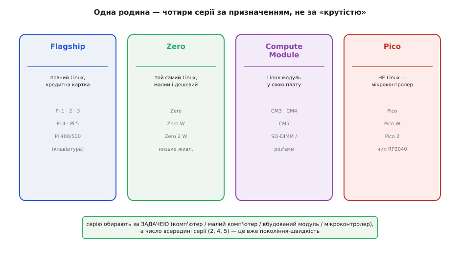
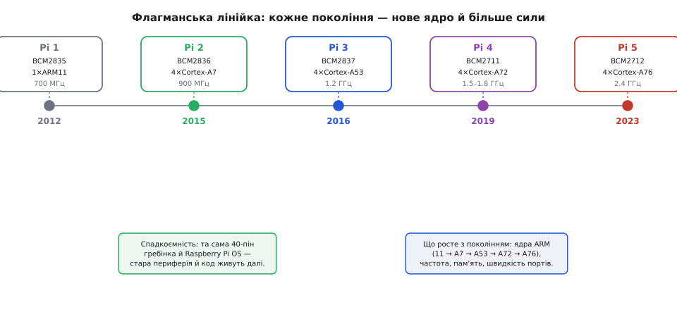

# Родина Raspberry Pi

<preknowlist>
- [Одноплатний комп'ютер (SBC)](topic:programming/single-board-computer) — повний комп'ютер на одній платі, що вантажить Linux; це головна порода в родині.
- [Мікроконтролер](topic:programming/microcontroller) — щоб бачити межу: одна гілка родини (Pico) — саме МК, а не Linux-комп'ютер.
- [Що таке процесор](topic:programming/what-is-processor) — ядра й тактова частота; звідси зрозуміло, що дає «швидше покоління».
</preknowlist>

Візьміть у руки будь-яку плату з написом **Raspberry Pi** — і ви впізнаєте родину з першого погляду: зелений (рідше чорний) текстоліт, гребінка штирків уздовж краю, малиновий логотип-ягода й ім'я на кшталт «Pi 4 Model B» чи «Pi Zero 2 W». За цим ім'ям ховається не одна плата, а ціле сімейство — від комп'ютера завбільшки з банківську картку до крихітного мікроконтролера за п'ять доларів. Усі вони вийшли з однієї британської майстерні, ділять спільну філософію, спільні роз'єми й спільну операційну систему, тому знати їх варто саме як **родину**, а не як розсип окремих виробів. Тоді назва будь-якої нової плати читається сама, і ви одразу розумієте, що це за звір і чи він вам підходить.

Розберімо, що всі ці плати об'єднує, як розшифрувати їхні імена, на які лінійки (серії) родина ділиться й за яким принципом — а глибокі подробиці конкретних плат лишимо самим цим платам, бо кожна заслуговує окремого опису.

> 🔧 **Навіщо це.** У крамниці й у чужому проєкті ви натрапляєте на десятки різних Raspberry Pi, і легко взяти не ту: замовили «Pi Zero» замість «Pi 4» — і раптом бракує портів та пам'яті; взяли «Pico» — а воно взагалі не вантажить Linux. Уміння читати ім'я плати й знати, до якої серії вона належить, економить і гроші, і зіпсований вечір. Це той компас, за яким орієнтуються в усій родині.

## Звідки ім'я «Raspberry Pi»

Ім'я здається примхою, але кожна половина в ньому має причину. **«Raspberry»** (англ. *raspberry* — малина) — це уклін традиції ранніх мікрокомп'ютерів, де фірми любили називатися фруктами: **Apple** (яблуко), британські **Apricot** (абрикос) і **Acorn** (жолудь — теж плід). Молода команда стала в цей самий ряд, обравши ягоду. **«Pi»** — натяк на мову **Python**: за первісним задумом плата мала бути машинкою, що передусім ганяє Python, тож «Pi» від «Python» лягло в назву (а заразом воно перегукується і з числом π, і з англійським *pie* — «пиріг», звідси й малиновий пиріг як образ).

За цим милим ім'ям стоїть цілком серйозний задум: зробити **дуже дешевий комп'ютер, щоб діти знову вчилися програмувати руками**, як колись училося покоління на шкільних машинах 1980-х. Хто це придумав, яка проблема з абітурієнтами Кембриджа підштовхнула до ідеї, чому знадобилося п'ять років і які саме люди зібрали першу плату до продажу 29 лютого 2012 року — уся ця історія народження зібрана в [окремій оповіді про появу Raspberry Pi](topic:boards/raspberry-pi-family/hist-birth-of-pi.md): від задуму Ебена Аптона до благодійного фонду й компанії, що згодом вийшла на біржу.

## Як читати ім'я плати

Імена в родині будуються за логікою, і, розкусивши її, ви розшифруєте майже будь-яку плату без довідника.

**Число — це покоління.** «1, 2, 3, 4, 5» — послідовні покоління флагманської лінійки; що більше число, то новіший і потужніший процесор. Pi 5 швидший за Pi 4, той — за Pi 3, і так углиб. Це не різні класи пристроїв, а щаблі однієї драбини.

**«Model A» і «Model B» — це навмисний уклін** давньому шкільному комп'ютеру **BBC Micro** початку 1980-х, який британська фірма Acorn випускала саме в дешевшій версії Model A і повнішій Model B. Raspberry Pi перейняв ці позначки прямо: у традиції родини **літера B означає «повна, з дротовою мережею» (Ethernet), а Model A — здешевлений варіант без Ethernet і з меншим набором портів**. Тобто «4» — це покоління, а «Model B» — повна конфігурація цього покоління.

**Літери-суфікси додають рис до тієї самої плати.** Найпоширеніші:

```
+   покращена ревізія (більше портів / краще живлення):  Pi 3 Model B+
W   є Wi-Fi (wireless):                                  Pi Zero W
H   гребінка вже припаяна (headers):                     Pi Zero WH, Pico H
```

Склавши все докупи, ім'я читається як речення. **«Raspberry Pi 3 Model B+»** — третє покоління, повна конфігурація з мережею, покращена ревізія. **«Pi Zero 2 W»** — лінійка Zero, друге її покоління, з Wi-Fi. **«Pico W»** — плата-мікроконтролер Pico з Wi-Fi. Один раз розібравши цю абетку, ви більше не плутаєтесь у вітрині.

> 🔧 **Навіщо це.** Ця розшифровка рятує від конкретних помилок замовлення. Побачили в специфікації проєкту «Pi Zero» без літери **W** — знайте, що там **немає Wi-Fi**, і бездротову версію треба замовляти окремо. «Model A» замість «Model B» — це **менше USB-портів і немає Ethernet**, що для сервера критично. А «Pico» серед списку Raspberry Pi — сигнал, що це взагалі **інший клас** (мікроконтролер, не Linux-комп'ютер), і код під нього пишеться геть інакше.

## Чотири серії: родина ділиться за призначенням

Головне, що варто засвоїти про родину: вона поділена **не за «крутістю», а за призначенням**. Є чотири серії, і кожна відповідає на свою задачу. Плутанина зазвичай саме звідси — люди міряють плати однією лінійкою «потужніше-слабше», тоді як насправді це різні інструменти.


*Серію обирають за задачею: повноцінний комп'ютер (Flagship), той самий Linux у мінімальному дешевому тілі (Zero), Linux-модуль під власну плату виробу (Compute Module) чи мікроконтролер без Linux (Pico). Число всередині серії — це вже покоління-швидкість, окрема вісь.*

**Flagship — «дорослі» комп'ютери.** Це та лінійка, яку більшість і має на увазі, кажучи «Raspberry Pi»: повноцінний Linux-комп'ютер розміром із кредитну картку, з повним набором портів (USB, Ethernet, HDMI), гребінкою GPIO і достатком пам'яті. Сюди належать Pi 2, 3, 4, 5 і їхні варіанти. У цю ж серію офіційно зараховують і **плати-клавіатури Pi 400 та Pi 500** — той самий флагманський комп'ютер, вбудований прямо в корпус клавіатури (знову уклін домашнім комп'ютерам 1980-х, що були суцільною клавіатурою з портами ззаду). Готові до розбору тут — [Raspberry Pi 4 Model B](topic:boards/rpi4) і [Raspberry Pi 5](topic:boards/rpi5).

**Zero — той самий Linux, тільки крихітний і дешевий.** Серія Zero дає повноцінну систему Linux у мінімальному тілі за мінімальні гроші й на мізерному живленні. Плата вужча за флагман у рази, портів на ній менше (часто micro-USB замість повнорозмірних), але це справжній комп'ютер, що вантажить ту саму систему. Zero беруть туди, де місце й струм на вагу золота: носима електроніка, крихітний вбудований вузол, легкий сервер на кілька задач. Модель Zero 2 W додала чотириядерний процесор, підтягнувши швидкість ближче до старших плат.

**Compute Module — Linux-модуль, який вставляють у свою плату.** Це найменш «побутова» серія. Compute Module (скорочено CM: CM4, CM5 тощо) — це весь обчислювальний вузол Raspberry Pi (процесор, пам'ять, накопичувач) на компактному модулі **без звичних роз'ємів**. Його не вмикаєш напряму — його **вставляють у власну плату-носій**, яку інженер розводить під конкретний виріб: касовий термінал, медичний прилад, промисловий контролер. Так серійний виробник дістає мозок Raspberry Pi, але сам вирішує, які роз'єми й форму дати готовому продукту. Ранні CM робили у формі, як плашка пам'яті **SO-DIMM** від ноутбука; пізніші — з двома щільними роз'ємами.

**Pico — тут родина переходить межу й стає мікроконтролером.** Ось де легше за все спіткнутися. Pico зовні теж «маленька плата Raspberry Pi», але це **не комп'ютер** — це [мікроконтролерна плата](topic:programming/microcontroller): вона **не вантажить Linux, не має диска-картки, працює одну прошивку**, яку заливають у вбудовану флеш-пам'ять. У її серці — чип **RP2040**, який Raspberry Pi **спроектувала сама** (перша власна мікросхема родини), а пізніше й наступник RP2350 у Pico 2. Pico — це відповідь на світ Arduino та ESP32, а не на світ настільних ПК. Вона коштує кілька доларів і живе там, де треба крутити мотор, читати давач і миттєво прокидатися, а не тримати операційну систему.

> 🔧 **Навіщо це.** Ця четвірка — головний фільтр вибору, і помилка серії болючіша за помилку покоління. Треба справжній маленький сервер із мережею й пам'яттю — це **Flagship** (Pi 4/5). Місце й живлення в обріз, а Linux усе ж потрібен — **Zero**. Робите свій серійний прилад і хочете мозок Pi всередині — **Compute Module**. Треба керувати залізом у реальному часі, з батарейним живленням і миттєвим стартом — **Pico**, і не чекайте від неї ані ОС, ані робочого столу. Сплутати Pico з флагманом — усе одно що взяти мотоцикл замість вантажівки, бо «в обох є колеса».

## Флагманська лінійка: як росли покоління

Усередині головної серії число моделі — це історія поступового зростання сили. Кожне покоління брало нове ядро процесора **ARM** і давало відчутний стрибок, зберігаючи при цьому сумісність зі старим — і саме ця подвійність (швидше, але сумісне) робить родину такою зручною для навчання й прототипів.


*Від Pi 1 (одне ядро ARM11, 700 МГц) до Pi 5 (чотири Cortex-A76 на 2.4 ГГц): з поколінням зростають ядра, частота, пам'ять і швидкість портів, тоді як 40-пінова гребінка та Raspberry Pi OS лишаються спільними — стара периферія й код переходять на нову плату.*

Коротко, що змінювали покоління й чому це важить на практиці:

**Pi 1 (2012)** — початок: одне ядро ARM11, система-на-кристалі BCM2835. Повільна за нинішніми мірками, але саме вона задала форму, гребінку й ідею.

**Pi 2 (2015)** — стрибок до **чотирьох ядер** (Cortex-A7): плата вперше стала по-справжньому багатозадачною.

**Pi 3 (2016)** — перше **64-бітне** ядро (Cortex-A53) і, головне для побуту, **вбудовані Wi-Fi та Bluetooth**: відпала потреба в зовнішньому USB-адаптері мережі, і плата стала самодостатньою «з коробки».

**Pi 4 (2019)** — перехід у «дорослу» лігу: ядра Cortex-A72, **справжній гігабітний Ethernet**, порти USB 3.0, до 8 ГБ пам'яті, живлення по USB-C і два виходи 4K. Саме тут SBC став придатним як легкий настільний ПК і домашній сервер.

**Pi 5 (2023)** — обчислення (BCM2712, Cortex-A76 на 2.4 ГГц) і порти рознесли на **два окремі чипи**, а назовні вивели роз'єм **PCIe** під швидкий SSD.

Помітна закономірність: **із поколінням росте лічильна сила, а форма й «руки» лишаються спільними**. Тому проєкт, зроблений на Pi 3, здебільшого переїжджає на Pi 5 без переробки — та сама гребінка, та сама система, ті самі корпуси-надставки.

## Що спільне в усієї родини

Попри розкид від мікроконтролера до сервера, кілька речей проходять наскрізь і роблять Raspberry Pi саме родиною, а не випадковим набором плат.

**Гребінка 40 GPIO на 3.3 вольта.** Майже всі сучасні Linux-плати родини несуть **однакову 40-штиркову гребінку** з тією самою розкладкою: живлення (3.3 В, 5 В, земля), шини I²C, SPI, UART і програмовані виводи. Логіка на ній — **3.3-вольтова**, і це залізне правило родини: п'ять вольтів на сигнальний вивід подавати не можна. Завдяки спільній розкладці «шапки»-надставки (HAT) і давачі переходять від моделі до моделі.

**Raspberry Pi OS і спільний софт.** Плати вантажать **спільну операційну систему** — Raspberry Pi OS, різновид Debian Linux, — тож навички, команди й програми переносяться між моделями майже без змін. Написане й налаштоване на одній платі здебільшого запрацює на іншій. Це велика прихована перевага родини: ви вчите **одну** систему, а не окрему до кожної плати.

**Спільна екосистема й тяглість.** Один величезний склад корпусів, кабелів, надставок, посібників і форумних відповідей обслуговує всю родину відразу. І виробник тримає **довгу доступність**: старі покоління не знімають із виробництва роками, тож виріб, зроблений сьогодні, можна буде зібрати й через кілька років — рідкісна річ в електроніці, що дуже цінна для серійних продуктів.

> 🔧 **Навіщо це.** Спільна гребінка й спільна система — це те, заради чого варто «зайти в родину» одного разу. Освоївши GPIO, I²C та Raspberry Pi OS на одній платі, ви фактично освоюєте **всю лінійку**: пересадка проєкту на іншу модель зводиться до вибору за розміром, ціною й швидкістю, а не до нового навчання з нуля. Саме ця сумісність, а не рекордні цифри, тримає Raspberry Pi попереду інших одноплатних комп'ютерів.

## Як обрати плату під задачу

Звівши все докупи, вибір усередині родини лягає у три послідовні питання.

**Перше — це взагалі комп'ютер чи мікроконтролер?** Треба операційна система, файли, мережа, багато процесів, важкі бібліотеки (зір, вебсервер, база) — беріть **Linux-плату** (Flagship, Zero чи Compute Module). Треба керувати залізом у реальному часі, миттєвий старт, батарейне живлення на тижні, одна проста робота — беріть **Pico** (мікроконтролер). Це найважливіша розвилка; помилка тут не лікується вибором іншої моделі.

**Друге — яка форма й ціна?** Якщо це Linux-плата: потрібен повний набір портів, пам'ять і продуктивність настільного рівня — **Flagship** (Pi 4/5). Місце й живлення в обріз, а задача легка — **Zero**. Робите власний серійний виріб і хочете мозок Pi всередині своєї плати — **Compute Module**.

**Третє — яке покоління?** Усередині флагманів: під сучасне навантаження, швидкий диск і майбутнє — **Pi 5**; під перевірений робочий кінь, море готових інструкцій і трохи дешевше — **Pi 4**. Старші покоління (Pi 3 і нижче) беруть під зовсім легкі задачі або коли вони вже є під рукою.

Практична порада насамкінець: під невідому наперед задачу для навчання розумний стандартний вибір — **флагман середнього-старшого покоління з 4–8 ГБ пам'яті**. Він тягне майже все, має найбільше готових посібників і не впреться в стелю на першому ж серйозному проєкті. А коли задача звузиться — уже під неї береться дешевша Zero, промисловий Compute Module чи мікроконтролерна Pico. Конкретику ж кожної плати — точні порти, живлення, пастки й приклади коду — дивіться в її власному описі: [Raspberry Pi 4 Model B](topic:boards/rpi4) та [Raspberry Pi 5](topic:boards/rpi5).
