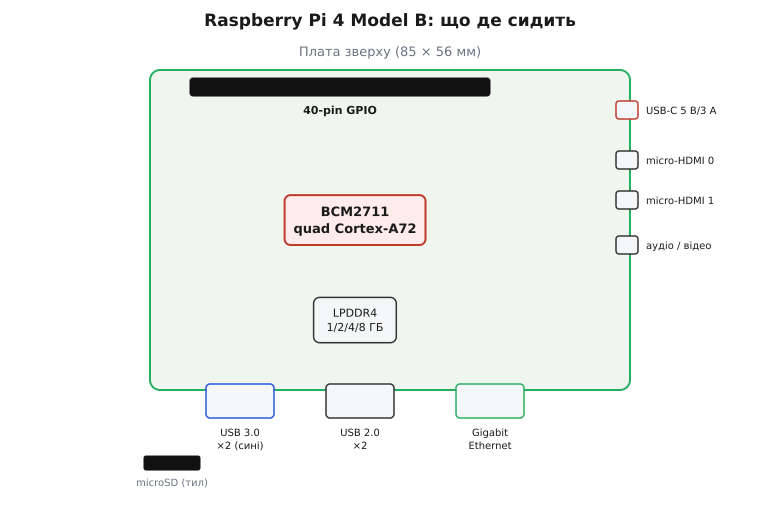
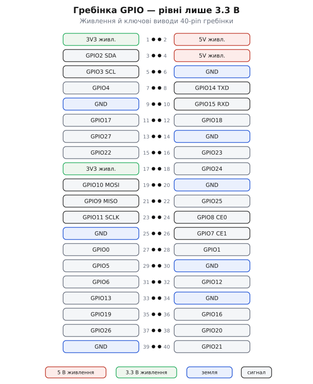

# Raspberry Pi 4 Model B

<preknowlist>
- [Одноплатний комп'ютер (SBC)](topic:programming/single-board-computer) — що це за клас пристроїв: повний комп'ютер на одній платі, що вантажить Linux і працює як маленький сервер.
- [Мікроконтролер](topic:programming/microcontroller) — щоб бачити різницю: RPi 4 — не МК, у нього ОС і диск, а не гола прошивка на голому кремнії.
- [GPIO — виводи загального призначення](topic:electronics/gpio) — що таке цифровий вивід, вхід/вихід; тут вони живуть на гребінці й терплять лише 3.3 В.
- [Рівні «0» і «1»](topic:electronics/logic-levels-as-ranges) — чому 3.3 В проти 5 В критично: подача 5 В на 3.3-вольтовий вивід псує кремній.
</preknowlist>

На долоні лежить зелена плата завбільшки з банківську картку — трохи довша, десь 85 на 56 міліметрів. По краю стирчать два спарені гнізда USB, металевий квадрат Ethernet, дві крихітні пащі micro-HDMI і роз'єм живлення USB-C. Посередині — чорний квадрат мікросхеми під літерами BCM2711, поряд — чіп пам'яті. Уздовж довгого краю — гребінка з сорока штирків. Це **Raspberry Pi 4 Model B**: не мікроконтролерна платка, а **повноцінний комп'ютер**, який вантажить Linux, тримає робочий стіл, віддає сайти в мережу й керує залізом через ті сорок виводів. За ціною від 35 доларів (за версію з гігабайтом пам'яті) ви отримуєте машину, що на початку 2010-х коштувала б як пристойний ноутбук.

Ця подвійна природа — «справжній комп'ютер, але з ніжками GPIO» — і робить її такою корисною, і водночас ховає пастки, на яких новачок обпікається: не той кабель живлення — і плата не стартує; той самий 5-вольтовий рефлекс, що спрацьовує на Arduino, — і згорає вивід; поставив у глухий корпус — і процесор тихо душить сам себе від перегріву. Розберімо цю конкретну плату так, щоб упізнати її серед родичів, зрозуміти, з чого вона зроблена, як її правильно нагодувати й під'єднати, і де саме зариті граблі.

### Що це таке і чим воно не є

Найважливіше рішення — не сплутати клас пристрою. Плата на [мікроконтролері](topic:programming/microcontroller) на кшталт ESP32 чи Arduino — це **гола прошивка на голому кремнії**: ви пишете один цикл `loop()`, компілюєте, заливаєте — і він крутиться, доки є живлення. Ніякої операційної системи, ніякого диска, лічені кілобайти пам'яті.

Raspberry Pi 4 — інша порода. Це **одноплатний комп'ютер** (англ. *single-board computer*, SBC): у нього чотириядерний процесор, від одного до восьми гігабайтів оперативної пам'яті, справжня операційна система (зазвичай Raspberry Pi OS — різновид Debian Linux) на microSD-картці як на диску, робочий стіл, браузер, термінал. Він завантажується як комп'ютер, а не «прокидається» як мікроконтролер: секунди на старт, файлова система, процеси, мережа.

> 🔧 **Навіщо це.** Клас пристрою диктує геть усе — від того, як ви пишете код, до того, як його вимикати. Мікроконтролеру байдуже, коли зникне живлення: він у будь-яку мить готовий померти й ожити. Raspberry Pi — ні: **висмикнути йому живлення на ходу — це як висмикнути шнур із настільного ПК посеред запису на диск**. Файлова система на картці може побитися, і система перестане вантажитись. Тому Pi треба **коректно вимикати** (`sudo shutdown -h now` або кнопкою в меню), а не просто знеструмлювати. Це перша звичка, яку ламає в собі той, хто прийшов з Arduino.

Назва теж не випадкова. **«Model B»** — це навмисний уклін у бік британського **BBC Micro** початку 1980-х, шкільного комп'ютера від Acorn, що мав свої Model A і Model B. У традиції Raspberry Pi літера **B означає «з Ethernet»**: повнорозмірна плата з мережевим гніздом і повним набором USB, на противагу дешевшій і меншій Model A без дротової мережі. Тобто «4» — це покоління, а «Model B» — повна, «доросла» конфігурація цього покоління.

### Мозок: SoC BCM2711

Серце плати — **система-на-кристалі** (англ. *system on chip*, SoC) **Broadcom BCM2711**. Слово «система» тут буквальне: в один чорний квадрат запаковано не лише процесор, а майже весь комп'ютер — чотири процесорні ядра, графічний процесор, контролери пам'яті, відео, USB та інша периферія. Розберімо, що там усередині, бо саме це визначає, на що плата здатна.

**Процесор** — чотири ядра **ARM Cortex-A72**, архітектура **ARMv8** (64-бітна). Це вже не той крихітний контролер із мікроконтролерів — це повноцінні ядра з конвеєром, кешами й позачерговим виконанням, рідні брати тих, що стоять у смартфонах і планшетах. Ранні плати (з 2019 року) працювали на **1.5 ГГц**; із оновленням кремнію (степінг C0) у середині 2021-го частоту підняли до **1.8 ГГц**, заразом покращивши тепловий режим.

> 🔧 **Навіщо це.** 64-бітна архітектура ARMv8 — не просто «більше цифри». Вона дає доступ до всієї пам'яті (32-бітна система вперлася б у стелю близько 4 ГБ, а плата має до 8), ширші регістри й сучасний набір інструкцій. Але за замовчуванням старіші версії Raspberry Pi OS довго ставилися **32-бітними** заради сумісності зі старими Pi. Щоб реально скористатися 8 гігабайтами й повною швидкістю, треба ставити **64-бітну систему** — і для машинного навчання чи важких обчислень це не дрібниця.

**Оперативна пам'ять** — тип **LPDDR4-3200** (низьковольтна швидка пам'ять, та сама родина, що в мобільних пристроях), у варіантах **1, 2, 4 і 8 ГБ**. Обсяг пам'яті — головна вісь вибору версії: для медіаплеєра чи простого контролера вистачить 2 ГБ, для робочого столу з браузером комфортні 4 ГБ, а 8 ГБ беруть під сервери, контейнери й важкі задачі. (Був іще анонсований варіант на 3 ГБ, але в роздріб він до пуття не пішов — на практиці вибирають між 1, 2, 4 і 8.)

**Графіка** — VideoCore VI, здатна крутити два дисплеї 4K одночасно. Апаратно вона вміє **декодувати H.265 (HEVC) у 4K на 60 кадрах** — тобто відтворення відео 4K лягає на спеціальний блок, а не гне процесор. Це робить Pi 4 популярним медіацентром.

### Що стирчить по краю: порти

Тепер обійдімо плату по периметру — саме розташування роз'ємів дає впізнати цю модель і зрозуміти, куди що втикати.

*Порти рознесені по двох суміжних краях: живлення USB-C, два micro-HDMI та аудіо — на короткому боці; чотири USB і Gigabit Ethernet — на довгому. Гребінка GPIO тягнеться вздовж верхнього довгого краю, а гніздо microSD ховається знизу з тильного боку. Так само розкладено роз'єми в кожному стандартному корпусі під Pi 4.*

**Живлення — USB-C.** Один роз'єм USB-C приймає **5 вольтів, мінімум 3 ампери**. Це нова риса саме [четвертого покоління](topic:boards/raspberry-pi-family) (старіші Pi живилися від micro-USB) — і водночас джерело найгучнішої вади ранніх плат, про яку окремо нижче.

**Два micro-HDMI.** Не повнорозмірні, а **micro** — дрібніші за звичні HDMI, тож знадобиться відповідний кабель або перехідник. Два роз'єми — щоб гнати картинку на **два монітори 4K** одразу. Кожен тягне до 4K на 60 Гц.

**Чотири USB.** Дві пари: **два USB 3.0** (сині всередині, швидкі — до 5 Гбіт/с) і **два USB 2.0**. Сюди йдуть клавіатура, миша, флешки, а головне — **зовнішні SSD**, з яких Pi 4 вміє й вантажитись.

**Gigabit Ethernet.** І це справжній гігабіт — важлива відмінність від Raspberry Pi 3, де мережеве гніздо ділило шину з USB і впиралося в стелю близько 300 Мбіт/с. У Pi 4 мережа має **власний канал** і видає повноцінну гігабітну швидкість. Для домашнього сервера чи мережевого сховища це вирішальна перевага.

**Бездротовий зв'язок.** На платі є Wi-Fi **802.11ac** у двох діапазонах (2.4 і 5 ГГц) і **Bluetooth 5.0** з енергоощадним BLE. Антена вбудована, окремого модуля не треба.

**Гребінка 40 GPIO, аудіо, роз'єми камери й дисплея.** Про гребінку — окремо нижче, бо саме через неї Pi спілкується з залізом. Є ще 4-контактний аудіовихід із композитним відео, а також вузькі шлейфові роз'єми MIPI під фірмову камеру (CSI) і дисплей (DSI).

### Гребінка GPIO: 40 виводів, і всі на 3.3 вольта

Уздовж довгого краю тягнеться **гребінка з 40 штирків** — це руки Pi, якими він торкається зовнішнього світу: блимає світлодіодами, читає давачі, крутить сервоприводи, говорить по шинах I²C та SPI. Розкладка стандартизована й спільна для всіх сучасних Pi, тож «шапки» розширення (HAT) підходять від моделі до моделі.

*Крайні піни дають готове живлення: 5 В (з входу USB-C), 3.3 В (від внутрішнього регулятора) і кілька земель. Решта — програмовані виводи GPIO; частина має ще й спеціальне призначення — I²C (SDA/SCL), SPI (MOSI/MISO/SCLK/CE), UART (TXD/RXD). Ключове: усі сигнальні лінії працюють на 3.3 В, п'яти вольтів на них подавати не можна.*

Що з цієї розкладки треба засвоїти твердо:

**Живлення просто з гребінки.** Піни дають готові **5 В** (беруться прямо зі входу живлення), **3.3 В** (від внутрішнього регулятора плати) і кілька **земель** (GND). Цим можна живити давачі й дрібну периферію — але обережно з межами струму: лінія 3.3 В на гребінці **слабенька** (сумарно кількадесят міліампер), і навісити на неї щось ненажерливе не вийде.

**Усі сигнали — 3.3 В, і це не обговорюється.** Ось головна відмінність від 5-вольтового світу Arduino. Кожен вивід GPIO працює на **3.3 вольта**: логічна одиниця — це 3.3 В, і рівно стільки вивід видає на виході й стільки ж очікує на вході.

> 🔧 **Навіщо це.** Виводи GPIO **не терплять 5 вольтів** — вони не п'ятивольтостійкі. Якщо ви заведете на вхід Pi сигнал від 5-вольтового давача чи модуля напряму, ви подаєте **5 В на 3.3-вольтовий вхід** — і псуєте вивід, а то й весь SoC, який коштує як уся плата. Той самий рефлекс, що безкарно проходить на Arduino Uno, тут — диверсія проти власної машини. Правило залізне: **між 5-вольтовим пристроєм і виводом Pi має стояти перетворювач рівнів** (level shifter) або дільник напруги. Виняток — лінії, де Pi сам господар і видає лише 3.3 В на 3.3-вольтову периферію; тоді все чисто.

Керувати цими виводами з коду можна кількома способами; типові виклики бібліотек, робочі приклади на C/C++ і пастки роботи з GPIO зібрані в [окремому практичному розборі](topic:boards/rpi4/api-gpio.md).

### Живлення: та сама вада USB-C

Ось місце, де Raspberry Pi 4 голосно спіткнувся на старті, і про це варто знати, бо вада реальна й задокументована самими розробниками.

Плата хоче **5 В і мінімум 3 А** — це чимало, тому дешевий зарядний блок від телефона на 1–2 ампери може її не витягти, особливо коли до USB підключені споживачі. Фірмовий блок живлення Raspberry Pi саме на 5.1 В / 3 А і розрахований.

Але справжня халепа була в іншому. На ранніх платах (**ревізії 1.1**, 2019 рік) сам роз'єм USB-C був розведений **неправильно**. У стандарті USB-C дві сигнальні лінії конфігурації, **CC1 і CC2**, мають кожна отримати **власний резистор 5.1 кОм** — саме так зарядка розуміє, скільки струму дати. На Pi 4 ці два піни **повісили на один спільний резистор**. Наслідок парадоксальний: **прості** зарядки й кабелі працювали, а от **розумні кабелі з електронною міткою** (англ. *e-marked* — ті, що в дорогих блоках і ноутбуках Apple/USB-PD) через таку розводку **приймали Pi за аудіоперехідник** і відмовлялися давати живлення взагалі. Тобто чим кращий і дорожчий у вас кабель — тим імовірніше, що Pi з ним не стартує.

> 🔧 **Навіщо це.** Розробники визнали помилку й виправили її в **ревізії плати 1.2** — там кожна лінія CC отримала свій резистор, і e-marked кабелі запрацювали. Практичний висновок для того, хто тримає в руках конкретну плату: якщо Pi 4 **не вмикається саме з дорогим USB-C кабелем**, а з дешевим — оживає, ви майже напевно тримаєте ранню ревізію 1.1. Лік простий — узяти **фірмовий блок живлення Pi** або будь-який простий (не e-marked) якісний 5 В / 3 А кабель. На ревізії 1.2 й пізніших проблеми немає.

Є й другий шлях живлення — **через гребінку GPIO** (піни 5 В і GND), теж 5 В / 3 А. Ним користуються, коли Pi вбудований у щось і живиться від власної шини; але тут ви **втрачаєте захист** (запобіжник і фільтр), що стоїть на вході USB-C, тож подавати треба вже чисті, стабільні 5 вольтів. Ще один варіант — **PoE** (живлення по мережевому кабелю), але для нього потрібна окрема шапка PoE HAT на гребінку.

### Тепло: чому Pi 4 душить сам себе

Потужніший процесор гріється дужче, і Pi 4 — перша модель, де перегрів став відчутною темою. Тут важливо зрозуміти механізм, а не просто «ліпити радіатор про всяк випадок».

BCM2711 має **вбудований захист від перегріву**. Поки кристал холодний, ядра йдуть на повній частоті. Коли температура доповзає до **80 °C**, система починає **поступово душити** (англ. *throttle*) процесорні ядра — знижувати частоту, щоб менше грітися. На **85 °C** пригальмовуються вже і ядра, і графіка. Це не поломка — це **навмисний запобіжник**: плата радше сповільниться, ніж згорить.

Звідси головний висновок про охолодження, який часто розуміють навпаки. **Радіатор не потрібен, щоб урятувати Pi від смерті** — від смерті його рятує вбудоване тротлення, і без радіатора він теж не згорить, просто пригальмує. Радіатор чи вентилятор потрібні для **іншого — щоб плата не втрачала швидкість**: під тривалим навантаженням гола плата впирається в 80 °C і починає душитись, а з охолодженням тримає повну частоту постійно.

> 🔧 **Навіщо це.** Практичне правило: якщо Pi 4 у вас під **постійним навантаженням** (сервер, компіляція, відео, машинне навчання) — ставте бодай пасивний радіатор, а краще малий вентилятор; інакше плата тихо працюватиме повільніше, ніж могла б, і ви цього навіть не помітите без вимірювання температури. Якщо ж Pi лише зрідка щось робить — можна взагалі без охолодження, тротлення його вбереже. Окрема пастка: **глухий корпус без вентиляції** перетворює навіть легке навантаження на постійне тротлення, бо теплу нікуди дітись. Зчитати температуру можна командою `vcgencmd measure_temp`, а факт тротлення — `vcgencmd get_throttled`.

### Завантаження: EEPROM замість «тільки з картки»

Ще одна риса, що з'явилася саме в четвертому поколінні й тихо змінила спосіб життя з платою.

Старіші Pi вміли вантажитись **лише з microSD** — увесь початковий код лежав файлом `bootcode.bin` на картці, і без картки плата була мертва. Pi 4 отримав **власний завантажувач у мікросхемі EEPROM** прямо на платі (окремо від картки-диска). Тепер картка більше не єдина умова старту: завантажувач в EEPROM читає з себе **порядок завантаження** (BOOT_ORDER) і може стартувати з microSD, **з USB-накопичувача** (флешки чи SSD) або по мережі.

> 🔧 **Навіщо це.** Це дає дві дуже практичні речі. Перша — **завантаження з USB-SSD**: microSD-картки повільні й зношуються від постійного перезапису, тож для сервера, що працює цілодобово, набагато краще вантажити систему з твердотільного диска через USB 3.0 — швидше й надійніше. Друга — **оновлюваний завантажувач**: прошивку EEPROM можна оновлювати (`rpi-eeprom-update`), і саме такі оновлення з часом покращили сумісність, енергоспоживання USB-контролера й самі режими завантаження. Зворотний бік — якщо завантажувач в EEPROM зіпсувати невдалим оновленням, плату доведеться **відновлювати** (є спеціальний образ-рятівник, що заливається з картки).

При роботі з USB-SSD варто пам'ятати про живлення: диск тягне струм із того самого 5 В / 3 А, тож кволий блок або поганий USB-перехідник до SSD — часта причина того, що система з диска стартує нестабільно або відвалюється під навантаженням.

### Де ця плата на своєму місці, а де ні

Зберімо докупи, для чого Raspberry Pi 4 — правильний вибір, а де його беруть даремно.

**Він блищить там, де треба справжній маленький комп'ютер.** Домашній сервер, мережеве сховище, медіацентр 4K, ретро-ігрова консоль, вузол «розумного дому», навчальна машина для програмування, легкий настільний ПК, хост для контейнерів, база для робототехніки, де на борту крутиться повноцінна Linux з камерою й зором. Скрізь, де потрібні **операційна система, багато пам'яті, мережа й екран**, — Pi 4 у своїй стихії.

**Він зайвий там, де вистачить мікроконтролера.** Якщо задача — просто зчитувати давач і вмикати реле за розкладом, блимати стрічкою або керувати мотором у реальному часі, то повний Linux — надмір: [мікроконтролер](topic:programming/microcontroller) зробить це надійніше, дешевше, з миттєвим стартом і без ризику побити файлову систему при знеструмленні. Pi не любить різких вимикань і не дає жорсткого реального часу — між зчитуваннями може втрутитися операційна система зі своїми справами.

> 🔧 **Навіщо це.** Здорове правило поділу: **комп'ютерна робота — на Pi, залізна робота реального часу — на мікроконтролері**, а часто їх ставлять у парі. Pi 4 тримає мозок, мережу й важкі обчислення (наприклад, розпізнавання образів), а поруч дешевий мікроконтролер стереже мотори й датчики в реальному часі; спілкуються вони по UART чи I²C. Так кожен робить те, у чому сильний, і слабкі місця Pi (реальний час, боязнь раптового знеструмлення) закриває напарник.

Raspberry Pi 4 Model B — це та точка, де одноплатний комп'ютер уперше став по-справжньому «дорослим»: справжня гігабітна мережа, USB 3.0, до 8 ГБ пам'яті, завантаження з SSD, два монітори 4K. Знаєте його три особливості — рівні строго 3.3 В на гребінці, вимогливе живлення з тією ранньою вадою USB-C, і тротлення від перегріву під навантаженням — і плата служитиме роками, не підкидаючи прикрих сюрпризів.
