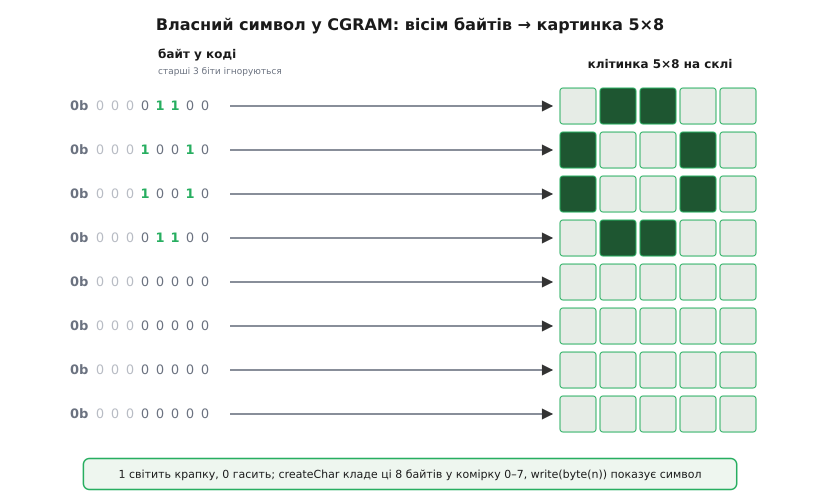
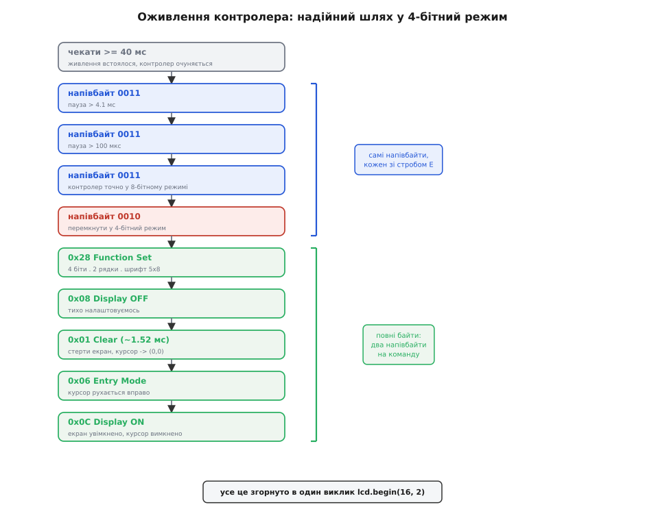

# 📋 Керуємо LCD 1602 із коду: від `lcd.print` до ручного строба E

<preknowlist>
- [GPIO-регістри](book:programming/gpio-registers) — як із коду підняти чи опустити одну ніжку мікроконтролера; на «сирому» рівні саме ними смикають лінії дисплея.
- [ASCII і UTF-8](book:programming/ascii-utf8) — літера в пам'яті це число-код; дисплей приймає саме коди символів, а не «букви».
- [Біти, байти, порядок](book:programming/bits-bytes-endianness) — що таке напівбайт (nibble), старші й молодші чотири біти байта, зсув `>>` і маска `& 0x0F`.
</preknowlist>

Символьний дисплей робить одну обіцянку: пишеш `lcd.print("Temp: 23.5 C")` — і напис з'являється у клітинках. За цим рядком ховається доволі суворий протокол: байт треба розрізати на два напівбайти, виставити на чотири лінії, смикнути строб у правильний момент, витримати паузу, поки контролер перетравить команду. Бібліотека `LiquidCrystal` бере всю цю механіку на себе, і 99% часу її досить.

Але «бере на себе» — це не «зникає». Коли екран показує кашу замість тексту, треба розуміти, що саме бібліотека робить під капотом, аби зрозуміти, де зламалося. Тому тут ми пройдемо обидва рівні. Спершу — як звичайно й пишуть: конструктор, `begin`, `print`, курсор, власні символи. Потім опустимося на дно й **власноруч** проженемо ту саму ініціалізацію голими ніжками, з ручним імпульсом E, — не щоб так писати щодня, а щоб побачити на власні очі, що ховає бібліотека. І наприкінці зведемо в таблицю пастки, на яких губиться найбільше годин; а зібраний із обох рівнів робочий прилад — [термометр із годинником без блимання](book:boards/lcd-1602/proj-thermometer.md) — винесено в окремий приклад.

---

## Ідея: бібліотека — це «різник байтів» і «таймер пауз»

Перш ніж писати код, варто чітко уявити, **що саме** робить `LiquidCrystal`, бо тоді кожен виклик стає прозорим.

Контролер [HD44780](book:boards/lcd-1602/hist-hd44780.md) розуміє два різновиди байтів: **команди** (очистити екран, посунути курсор, налаштувати режим) і **дані** (код символу, який лягає у видиму клітинку). Розрізняє їх ніжка RS: `RS = 0` — команда, `RS = 1` — дані. Сам байт передається чотирма лініями D4–D7 двома порціями: спершу старший напівбайт, потім молодший, кожен «клацається» у контролер спадом строба E.

Отже, уся робота бібліотеки зводиться до трьох дій, які вона робить за вас щоразу:

1. **Ставить RS** — вирішує, команда це чи символ.
2. **Ріже байт на два напівбайти** й по черзі виставляє їх на D4–D7, супроводжуючи кожен імпульсом E.
3. **Витримує паузу** рівно таку, скільки контролеру треба на цю операцію (довгу після очищення, коротку після символу).

> 🔧 **Навіщо це.** Тримаючи в голові цю трійку — RS, різання на напівбайти, пауза — ви миттєво локалізуєте будь-яку ваду. Каша з символів? Ламається крок 2: або лінії D4–D7 переплутані, або E смикають не в той момент. Дисплей «ковтає» команди? Не витримано крок 3 — пауза після довгої операції. Половина символу правильна, половина ні? Напівбайти йдуть у неправильному порядку. Ви не гадаєте — ви дивитеся, який із трьох кроків міг збитися.

---

## Рівень бібліотеки: конструктор і `begin`

Почнемо так, як пишуть у переважній більшості проєктів, — через `LiquidCrystal`. Дисплей підключено в 4-бітному режимі: RS і E на два вільні виводи, RW на землі (тільки пишемо), дані на D4–D7.

**Оголошення дисплея.** Початок скрізь однаковий: драйверу треба сказати, який вивід мікроконтролера несе яку лінію — RS, E і чотири лінії даних. Різниця лише в записі. В Arduino це позиційний конструктор із жорстким порядком: спершу RS і E, потім чотири лінії даних. В ESP-IDF і STM32 готової бібліотеки для HD44780 в комплекті немає, тож ту саму карту виводів ви складаєте самі — константами чи таблицею.

:::tabs
```arduino
#include <LiquidCrystal.h>

// LiquidCrystal(rs, e, d4, d5, d6, d7)
//   rs → пін 4 дисплея, e → пін 6, дані → піни 11–14 (D4–D7)
// Числа тут — це ВИВОДИ МІКРОКОНТРОЛЕРА, куди прийшли ці лінії.
LiquidCrystal lcd(8, 9, 4, 5, 6, 7);
//               │  │  └──┴──┴──┴─ D4 D5 D6 D7 підключені до виводів 4,5,6,7 МК
//               │  └───────────── E  → вивід 9 МК
//               └──────────────── RS → вивід 8 МК
```
```esp-idf
#include "driver/gpio.h"

// Ті самі шість ліній; вивід МК тут називається номером GPIO.
#define LCD_RS  GPIO_NUM_18       // RS → GPIO18
#define LCD_E   GPIO_NUM_19       // E  → GPIO19
#define LCD_D4  GPIO_NUM_21
#define LCD_D5  GPIO_NUM_22
#define LCD_D6  GPIO_NUM_23
#define LCD_D7  GPIO_NUM_25

// Готового «LiquidCrystal» в ESP-IDF немає — карту ліній даних тримаємо самі.
// Порядок у цьому масиві такий самий критичний, як порядок аргументів конструктора.
static const gpio_num_t LCD_DATA[4] = { LCD_D4, LCD_D5, LCD_D6, LCD_D7 };
```
```stm32
#include "stm32f1xx_hal.h"        // або заголовок своєї серії

// Вивід тут — пара «порт + пін»; у CubeMX усі шість позначені GPIO_Output.
#define LCD_RS_PORT  GPIOB
#define LCD_RS_PIN   GPIO_PIN_0   // RS
#define LCD_E_PORT   GPIOB
#define LCD_E_PIN    GPIO_PIN_1   // E

// Чотири лінії даних — таблицею, у порядку D4, D5, D6, D7.
static GPIO_TypeDef *const LCD_D_PORT[4] = { GPIOB, GPIOB, GPIOB, GPIOB };
static const uint16_t      LCD_D_PIN[4]  = { GPIO_PIN_4, GPIO_PIN_5,
                                             GPIO_PIN_6, GPIO_PIN_7 };
```
:::

Тут криється **перша класична пастка**: порядок аргументів. Це `(rs, e, d4, d5, d6, d7)`, а не навпаки і не `(e, rs, ...)`. Якщо переплутати RS з E або перевернути порядок ліній даних, дисплей або мовчатиме, або сипатиме кашею — а код при цьому виглядає бездоганно. Числа в дужках — це **виводи мікроконтролера**, до яких фізично прийшли дроти від відповідних ніжок дисплея; сплутати «номер ніжки дисплея» з «номером виводу МК» теж легко.

**Ініціалізація й геометрія.** Крок теж спільний для всіх платформ: сказати драйверу розмір сітки й прогнати послідовність оживлення контролера, яку ми нижче зробимо руками. В Arduino це один виклик `begin` у стартовій функції; там, де бібліотеки немає, у тому самому місці стоїть виклик власного `lcd_init()` — його ми складемо в другій половині статті.

:::tabs
```arduino
void setup() {
    lcd.begin(16, 2);      // 16 стовпців, 2 рядки
    lcd.print("Hello!");   // напис з клітинки (0,0)
}
```
```esp-idf
#include "esp_log.h"

void app_main(void) {
    lcd_init();                            // свій драйвер (складемо нижче)
    lcd_print("Hello!");                   // напис з клітинки (0,0)
    ESP_LOGI("lcd", "дисплей 16x2 готовий");
}
```
```stm32
int main(void) {
    HAL_Init();
    SystemClock_Config();
    MX_GPIO_Init();        // CubeMX: шість ніжок дисплея як GPIO_Output

    lcd_init();            // свій драйвер (складемо нижче)
    lcd_print("Hello!");   // напис з клітинки (0,0)

    while (1) { }
}
```
:::

`begin(16, 2)` — це не просто «запам'ятай, що екран 16×2». Усередині він: чекає, поки контролер після подачі живлення очуняється; кількома командами вводить його в 4-бітний режим; задає дві лінії й шрифт 5×8; вмикає дисплей; очищає екран. Усе, що на «сирому» рівні займе десяток рядків із паузами, тут згорнуто в один рядок. Саме тому з бібліотекою так зручно — і саме тому корисно один раз побачити, що вона згортає.

---

## Рівень бібліотеки: курсор, друк, очищення

Далі — щоденний набір. Він маленький, але кожен виклик має нюанс, про який мовчать приклади «hello world».

**Курсор і друк.** Дисплей тримає невидиму «каретку» — позицію, куди ляже наступний символ. `setCursor(стовпець, рядок)` ставить її, `print` друкує від неї й **посуває каретку далі**.

```cpp
lcd.setCursor(0, 0);        // стовпець 0, рядок 0 (нумерація з нуля!)
lcd.print("Temp:");        // друкує 5 символів, каретка тепер на стовпці 5
lcd.setCursor(0, 1);        // перейти на початок другого рядка
lcd.print(23.5);           // число теж друкується як текст: "23.50"
```

Два нюанси одразу. По-перше, **нумерація з нуля**: лівий верхній кут — це `(0, 0)`, а не `(1, 1)`; правий символ верхнього рядка — `(15, 0)`. По-друге, `print` для числа `float` виводить його **як текст**, за замовчуванням із двома знаками після коми (`23.50`). Скільки цифр показати — задають другим аргументом: `lcd.print(23.5, 1)` дасть `23.5`. Це прямо той механізм, яким ми зберемо `Temp: 23.5`.

**Очищення й «ковтання» символів.** Тут — друга за поширеністю пастка після контрасту.

```cpp
lcd.clear();               // стерти весь екран, курсор → (0,0)
lcd.print("New screen");
```

`clear()` (як і `home()`, що лише повертає курсор додому без стирання) — це **довга** команда: контролеру на неї треба близько **1.52 мс** — у сотні разів більше, ніж на звичайний символ (~37 мкс). Бібліотека всередині `clear()`/`home()` **вже витримує цю паузу за вас**, тож у типовому коді про неї можна не думати. Пам'ятати про неї треба з іншої причини: `clear()` **дорогий**. Якщо гнати його в кожній ітерації циклу, лише щоб оновити один рядок, екран помітно блиматиме, а програма даремно простоюватиме півтори мілісекунди щоразу.

> 🔧 **Навіщо це.** Не чистьте весь екран заради частини. Щоб оновити змінне число, ставте курсор на його місце й перезаписуйте **тільки ті клітинки** — доповнивши коротший новий текст пробілами, щоб затерти хвіст старого. `clear()` лишіть на зміну цілого «кадру» (нове меню, новий екран), а не на щосекундне оновлення часу. Це різниця між спокійним написом і мерехтливим.

**Курсор і блимання.** Контролер уміє показувати саму каретку — підкресленням чи блимальним прямокутником. Це керується парою команд, за якими стоять окремі біти в команді «увімкнути дисплей».

```cpp
lcd.cursor();       // показати підкреслення на позиції каретки
lcd.blink();        // показати блимальний квадрат на позиції каретки
lcd.noCursor();     // сховати підкреслення
lcd.noBlink();      // сховати блимання
```

Для приладу, що показує сталі написи, курсор зазвичай ховають (він виглядає як «недописаний рядок»). Він у пригоді, коли ви робите поле вводу — редагування імені, набір числа, — і хочете показати користувачу, куди зараз впаде натиснута цифра.

---

## Власні символи: малюємо градус у CGRAM

Тепер — найцікавіше з боку бібліотеки. Заводська таблиця символів латинська й не має ані `°`, ані значка батареї, ані стрілок, ані української кирилиці. Але контролер тримає маленький клапоть пам'яті — **CGRAM** (*Character Generator RAM*) — куди **ви самі** записуєте до **восьми** власних картинок 5×8 крапок. Записали — і код `0..7` тепер малює ваш значок.

Кожен символ — це вісім байтів, по одному на рядок картинки згори вниз. У кожному байті значущі лише **молодші п'ять біт** — п'ять крапок рядка зліва направо; `1` — крапка світиться, `0` — гасне. Старші три біти байта ігноруються (сітка ж завширшки 5).

Найзручніше малювати такий символ прямо в коді двійковими літералами — картинка видно очима:

```cpp
// Значок градуса «°»: кружечок у верхньому лівому куті клітинки
byte degree[8] = {
    0b01100,   //  ##
    0b10010,   // #  #
    0b10010,   // #  #
    0b01100,   //  ##
    0b00000,   //
    0b00000,   //
    0b00000,   //
    0b00000    //
};
```

Придивіться до літералів `0b01100` — це буквально малюнок: одиниці утворюють кільце у верхній частині клітинки. Кожен рядок — окремий байт, вісім рядків — уся картинка 5×8. Записати її в дисплей і показати:

:::tabs
```arduino
void setup() {
    lcd.begin(16, 2);
    lcd.createChar(0, degree);   // покласти картинку у комірку CGRAM №0

    lcd.setCursor(0, 0);
    lcd.print("Temp: 23.5");
    lcd.write(byte(0));          // вивести символ із комірки №0 → «°»
    lcd.print("C");
}
```
```esp-idf
// той самий масив, лише тип: static const uint8_t degree[8] = { … };
void app_main(void) {
    lcd_init();
    lcd_create_char(0, degree);  // покласти картинку у комірку CGRAM №0

    lcd_set_cursor(0, 0);
    lcd_print("Temp: 23.5");
    lcd_write_char(0);           // вивести символ із комірки №0 → «°»
    lcd_print("C");
}
```
```stm32
// той самий масив, лише тип: static const uint8_t degree[8] = { … };
int main(void) {
    HAL_Init(); SystemClock_Config(); MX_GPIO_Init();

    lcd_init();
    lcd_create_char(0, degree);  // покласти картинку у комірку CGRAM №0

    lcd_set_cursor(0, 0);
    lcd_print("Temp: 23.5");
    lcd_write_char(0);           // вивести символ із комірки №0 → «°»
    lcd_print("C");

    while (1) { }
}
```
:::

Тут два тонкі моменти, на яких спотикаються. Перший: `createChar(n, ...)` кладе картинку у **комірку n (0–7)**, а показують її потім через `lcd.write(byte(n))` — саме `write` із **кодом комірки**, а не `print("0")` (це надрукувало б цифру нуль). Обгортка `byte(0)` обов'язкова: без неї `write(0)` компілятор може витлумачити неоднозначно.

Другий, глибший: **CGRAM не пам'ятає нічого після вимкнення живлення**. Це оперативна пам'ять — знеструмили дисплей, ваші вісім символів зникли. Тому запис власних символів завжди роблять на старті програми — у `setup()` на Arduino, в `app_main()` на ESP-IDF, на початку `main()` до головного циклу на STM32 — або одразу після кожного скидання дисплея: при кожному ввімкненні картинки треба записати наново.

> 🔧 **Навіщо це.** Вісім комірок — це дуже мало, і вони швидко закінчуються. Плануйте їх наперед: градус, стрілки вгору-вниз для меню, значок батареї — і місця вже майже немає. Якщо потрібні кілька українських літер, яких немає в заводській таблиці (ґ, є, і, ї), кожна з'їдає одну з восьми комірок — на цілий алфавіт їх не вистачить, тому для довгих написів надійніше лишитися в латинці. І не забудьте: після кожного `power-on` символи треба записати заново — інакше на місці значка з'явиться сміття з чужої, невизначеної CGRAM.


*Власний символ у CGRAM: вісім байтів згори вниз, у кожному значущі лише молодші 5 біт. Одиниця світить крапку, нуль гасить; тут одиниці утворюють кільце градуса у верхній частині клітинки. Старші 3 біти байта ігноруються — сітка завширшки 5.*

---

## Під капотом: що таке один імпульс E

Дотепер усе робила бібліотека. Тепер спустимося на дно й **самі** сформуємо обмін — не для щоденного вжитку, а щоб побачити механіку, яку `LiquidCrystal` ховає. Почнемо з найдрібнішої цеглинки: одного імпульсу строба E.

Контролер не читає лінії постійно. Він **клацає** їхній стан собі всередину в один-єдиний момент — коли ніжка E падає з високого рівня в низький. Тобто послідовність жорстка: спочатку виставити RS і чотири біти даних, дати їм устоятися, і **аж потім** зробити на E короткий імпульс (підняти, трохи потримати, опустити). На спаді контролер зафіксує те, що стоїть на лініях.

Ось ця сама «цеглинка» голими ніжками, через прямі виклики [керування виводами](book:programming/gpio-registers):

:::tabs
```arduino
// Ніжки мікроконтролера, куди прийшли керувальні лінії дисплея
const int PIN_RS = 8;
const int PIN_E  = 9;
const int PIN_D4 = 4, PIN_D5 = 5, PIN_D6 = 6, PIN_D7 = 7;

// Виставити один напівбайт (молодші 4 біти value) на лінії D4–D7
void putNibble(uint8_t value) {
    digitalWrite(PIN_D4, (value >> 0) & 1);
    digitalWrite(PIN_D5, (value >> 1) & 1);
    digitalWrite(PIN_D6, (value >> 2) & 1);
    digitalWrite(PIN_D7, (value >> 3) & 1);
}

// Клацнути строб: підняти E, витримати, опустити — на спаді контролер читає лінії
void pulseE() {
    digitalWrite(PIN_E, HIGH);
    delayMicroseconds(1);      // тримаємо E високим ≥ 0.45 мкс (беремо із запасом)
    digitalWrite(PIN_E, LOW);
    delayMicroseconds(50);     // даємо контролеру перетравити (звичайна команда ~37 мкс)
}
```
```esp-idf
#include "driver/gpio.h"
#include "esp_rom_sys.h"       // esp_rom_delay_us() — активне очікування в мікросекундах
                               // (vTaskDelay сюди не годиться: його крок — цілий тик)

// Виставити один напівбайт (молодші 4 біти value) на лінії D4–D7
static void put_nibble(uint8_t value) {
    for (int i = 0; i < 4; i++)
        gpio_set_level(LCD_DATA[i], (value >> i) & 1);
}

// Клацнути строб: підняти E, витримати, опустити — на спаді контролер читає лінії
static void pulse_e(void) {
    gpio_set_level(LCD_E, 1);
    esp_rom_delay_us(1);       // тримаємо E високим ≥ 0.45 мкс (беремо із запасом)
    gpio_set_level(LCD_E, 0);
    esp_rom_delay_us(50);      // даємо контролеру перетравити (звичайна команда ~37 мкс)
}
```
```stm32
#include "stm32f1xx_hal.h"
// HAL_Delay() має крок 1 мс — для 1 і 50 мкс потрібен свій delay_us()
// на лічильнику DWT->CYCCNT або на вільному таймері.

// Виставити один напівбайт (молодші 4 біти value) на лінії D4–D7
static void put_nibble(uint8_t value) {
    for (int i = 0; i < 4; i++)
        HAL_GPIO_WritePin(LCD_D_PORT[i], LCD_D_PIN[i],
                          ((value >> i) & 1) ? GPIO_PIN_SET : GPIO_PIN_RESET);
}

// Клацнути строб: підняти E, витримати, опустити — на спаді контролер читає лінії
static void pulse_e(void) {
    HAL_GPIO_WritePin(LCD_E_PORT, LCD_E_PIN, GPIO_PIN_SET);
    delay_us(1);               // тримаємо E високим ≥ 0.45 мкс (беремо із запасом)
    HAL_GPIO_WritePin(LCD_E_PORT, LCD_E_PIN, GPIO_PIN_RESET);
    delay_us(50);              // даємо контролеру перетравити (звичайна команда ~37 мкс)
}
```
:::

Три числа тут не випадкові. Строб мусить бути високим щонайменше близько **0.45 мкс** (мінімальна ширина імпульсу E за специфікацією HD44780) — беремо 1 мкс із запасом. Пауза `50 мкс` після спаду — це час на виконання звичайної команди чи запис символу (у документації ~37 мкс); без неї наступний обмін наздожене попередній, ще не завершений. Порядок теж жорсткий: спершу `putNibble` (дані на лініях), тільки потім `pulseE`. Смикнеш строб раніше, ніж лінії набули значень, — контролер зафіксує сміття. Оце і є той самий момент, що псує більшість саморобних драйверів.

---

## Під капотом: цілий байт і вибір команда/дані

Один імпульс кидає в контролер лише напівбайт (4 біти). Цілий байт у 4-бітному режимі — це **два** імпульси: спершу старша половина, потім молодша. А ніжка RS каже, чим цей байт є — командою чи символом.

:::tabs
```arduino
// Надіслати повний байт: старший напівбайт, тоді молодший
//   isData = false → команда (RS=0);  isData = true → символ (RS=1)
void sendByte(uint8_t b, bool isData) {
    digitalWrite(PIN_RS, isData ? HIGH : LOW);

    putNibble(b >> 4);     // старші 4 біти
    pulseE();
    putNibble(b & 0x0F);   // молодші 4 біти
    pulseE();
}

// Зручні обгортки — рівно те, що всередині робить бібліотека
void lcdCommand(uint8_t c) { sendByte(c, false); }   // RS=0
void lcdData(uint8_t d)    { sendByte(d, true);  }   // RS=1
```
```esp-idf
// Надіслати повний байт: старший напівбайт, тоді молодший
//   is_data = false → команда (RS=0);  is_data = true → символ (RS=1)
static void send_byte(uint8_t b, bool is_data) {
    gpio_set_level(LCD_RS, is_data ? 1 : 0);

    put_nibble(b >> 4);    // старші 4 біти
    pulse_e();
    put_nibble(b & 0x0F);  // молодші 4 біти
    pulse_e();
}

// Зручні обгортки — саме їх викликає решта драйвера
static void lcd_command(uint8_t c) { send_byte(c, false); }   // RS=0
static void lcd_data(uint8_t d)    { send_byte(d, true);  }   // RS=1
```
```stm32
// Надіслати повний байт: старший напівбайт, тоді молодший
//   is_data = false → команда (RS=0);  is_data = true → символ (RS=1)
static void send_byte(uint8_t b, bool is_data) {
    HAL_GPIO_WritePin(LCD_RS_PORT, LCD_RS_PIN,
                      is_data ? GPIO_PIN_SET : GPIO_PIN_RESET);

    put_nibble(b >> 4);    // старші 4 біти
    pulse_e();
    put_nibble(b & 0x0F);  // молодші 4 біти
    pulse_e();
}

// Зручні обгортки — саме їх викликає решта драйвера
static void lcd_command(uint8_t c) { send_byte(c, false); }   // RS=0
static void lcd_data(uint8_t d)    { send_byte(d, true);  }   // RS=1
```
:::

Оце вже впритул те, що ховається за `lcd.command(...)` і `lcd.write(...)`. Виставили RS, розрізали байт `b` на `b >> 4` (старші) і `b & 0x0F` (молодші), кожну половину клацнули стробом. Порядок напівбайтів — **старший першим**; переплутаєш його — кожен байт «перевернеться» наполовину, і замість тексту піде безлад, у якому іноді впізнаються шматки правильних символів.

Тепер надрукувати літеру — це просто послати її [ASCII-код](book:programming/ascii-utf8) як дані:

```cpp
lcdData('A');    // 'A' — це число 65; контролер дістане картинку «A» з CGROM
lcdData('B');
```

А очистити екран — послати команду `0x01` і, оскільки вона **довга**, витримати паузу вже не на десятки мікросекунд, а на півтори з гаком мілісекунди:

:::tabs
```arduino
lcdCommand(0x01);    // Clear Display
delay(2);            // ~1.52 мс на виконання — інакше наступна команда загубиться
```
```esp-idf
lcd_command(0x01);        // Clear Display
esp_rom_delay_us(2000);   // ~1.52 мс; pdMS_TO_TICKS(2) тут дало б НУЛЬ тиків
                          // (типовий тик FreeRTOS в ESP-IDF — 10 мс)
```
```stm32
lcd_command(0x01);   // Clear Display
HAL_Delay(2);        // ~1.52 мс на виконання — інакше наступна команда загубиться
```
:::

Ось звідки береться правило «після clear/home потрібна пауза»: ці дві команди контролер виконує в сотні разів довше за решту, а `delayMicroseconds(50)` у `pulseE` на них **не розрахований**. Бібліотека вставляє довшу затримку сама; у ручному драйвері про неї треба пам'ятати власноруч.

---

## Під капотом: та сама «магічна» ініціалізація

Найзагадковіша частина будь-якого прикладу з 1602A — перші кілька команд, які виглядають як заклинання: щось на кшталт «послати 0x03 тричі, тоді 0x02». Тепер, знаючи механіку, розберемо, **навіщо** саме так, бо це не забобон, а акуратний вихід зі складної ситуації.

Проблема ось у чому. Після подачі живлення контролер може опинитися в одному з двох станів: у 8-бітному режимі (лінії D0–D7), або вже в 4-бітному, якщо був неповний скид. А ви говорите лише чотирма лініями D4–D7 і **не знаєте достеменно**, у якому він режимі. Треба надійно, з будь-якого стану, привести його в 4-бітний.

Розв'язок спирається на одну особливість. Команда «Function Set» (налаштувати інтерфейс) із бітом `DL = 1` означає «8-бітний режим». Її старший напівбайт — `0011` (тобто `0x3`). Якщо контролер зараз у 8-бітному режимі, він прочитає цей напівбайт як цілу команду (молодшої половини він не чекає). Якщо ж він у 4-бітному — він теж сприйме `0011` як старший напівбайт і чекатиме молодшого. Хитрість у тому, що надіслати `0011` **тричі поспіль** — це надійно переводить контролер у 8-бітний режим із будь-якого початкового стану: зайві напівбайти або трактуються як повні 8-бітні команди, або доповнюють одна одну, але результат гарантований — контролер тепер точно у 8-бітному режимі. І аж тоді, з відомого стану, одним напівбайтом `0010` (`0x2`, `DL = 0`) перемикаємо його в 4-бітний. Далі вже все йде повними байтами по два напівбайти.

Між цими кроками — паузи із запасом, бо на самому старті контролер ще не піднімає прапорець зайнятості, і покластися нема на що, крім часу з документації:

:::tabs
```arduino
void lcdInit() {
    // 0. Налаштувати ніжки на вихід
    pinMode(PIN_RS, OUTPUT); pinMode(PIN_E, OUTPUT);
    pinMode(PIN_D4, OUTPUT); pinMode(PIN_D5, OUTPUT);
    pinMode(PIN_D6, OUTPUT); pinMode(PIN_D7, OUTPUT);
    digitalWrite(PIN_E, LOW);

    delay(50);               // 1. Живлення встоялося: чекаємо ≥ 40 мс після подачі

    // 2. Тричі напівбайт 0011 — надійно завести у 8-бітний режим із будь-якого стану.
    //    Це ще НЕ повні байти: шлемо самі напівбайти, стробом кожен.
    digitalWrite(PIN_RS, LOW);
    putNibble(0x03); pulseE(); delay(5);      // перший раз: пауза > 4.1 мс
    putNibble(0x03); pulseE(); delayMicroseconds(150);  // другий: > 100 мкс
    putNibble(0x03); pulseE(); delayMicroseconds(150);  // третій

    // 3. Тепер напівбайт 0010 — перемкнути у 4-бітний режим.
    putNibble(0x02); pulseE(); delayMicroseconds(150);

    // 4. Звідси — вже ПОВНІ байти (sendByte ріже їх на два напівбайти).
    lcdCommand(0x28);        // Function Set: 4 біти, 2 рядки, шрифт 5×8
    lcdCommand(0x08);        // Display OFF
    lcdCommand(0x01); delay(2);   // Clear Display (довга — пауза ~1.52 мс)
    lcdCommand(0x06);        // Entry Mode: курсор рухається вправо, без зсуву екрана
    lcdCommand(0x0C);        // Display ON, курсор і блимання вимкнені
}
```
```esp-idf
#include "freertos/FreeRTOS.h"
#include "freertos/task.h"

void lcd_init(void) {
    // 0. Налаштувати ніжки на вихід — одним gpio_config на всі шість
    gpio_config_t io = {
        .pin_bit_mask = (1ULL << LCD_RS) | (1ULL << LCD_E) |
                        (1ULL << LCD_D4) | (1ULL << LCD_D5) |
                        (1ULL << LCD_D6) | (1ULL << LCD_D7),
        .mode         = GPIO_MODE_OUTPUT,
        .pull_up_en   = GPIO_PULLUP_DISABLE,
        .pull_down_en = GPIO_PULLDOWN_DISABLE,
        .intr_type    = GPIO_INTR_DISABLE,
    };
    ESP_ERROR_CHECK(gpio_config(&io));
    gpio_set_level(LCD_E, 0);

    vTaskDelay(pdMS_TO_TICKS(50));   // 1. чекаємо ≥ 40 мс після подачі живлення

    // 2. Тричі напівбайт 0011 — надійно завести у 8-бітний режим із будь-якого стану.
    //    Це ще НЕ повні байти: шлемо самі напівбайти, стробом кожен.
    gpio_set_level(LCD_RS, 0);
    put_nibble(0x03); pulse_e(); esp_rom_delay_us(5000);  // перший раз: > 4.1 мс
    put_nibble(0x03); pulse_e(); esp_rom_delay_us(150);   // другий: > 100 мкс
    put_nibble(0x03); pulse_e(); esp_rom_delay_us(150);   // третій

    // 3. Тепер напівбайт 0010 — перемкнути у 4-бітний режим.
    put_nibble(0x02); pulse_e(); esp_rom_delay_us(150);

    // 4. Звідси — вже ПОВНІ байти (send_byte ріже їх на два напівбайти).
    lcd_command(0x28);       // Function Set: 4 біти, 2 рядки, шрифт 5×8
    lcd_command(0x08);       // Display OFF
    lcd_command(0x01); esp_rom_delay_us(2000);  // Clear Display (довга, ~1.52 мс)
    lcd_command(0x06);       // Entry Mode: курсор вправо, без зсуву екрана
    lcd_command(0x0C);       // Display ON, курсор і блимання вимкнені
}
```
```stm32
void lcd_init(void) {
    // 0. Ніжки на вихід: у CubeMX усі шість позначені GPIO_Output —
    //    тут лишається завести E в нуль перед першим стробом.
    HAL_GPIO_WritePin(LCD_E_PORT, LCD_E_PIN, GPIO_PIN_RESET);

    HAL_Delay(50);           // 1. Живлення встоялося: чекаємо ≥ 40 мс після подачі

    // 2. Тричі напівбайт 0011 — надійно завести у 8-бітний режим із будь-якого стану.
    //    Це ще НЕ повні байти: шлемо самі напівбайти, стробом кожен.
    HAL_GPIO_WritePin(LCD_RS_PORT, LCD_RS_PIN, GPIO_PIN_RESET);
    put_nibble(0x03); pulse_e(); HAL_Delay(5);    // перший раз: пауза > 4.1 мс
    put_nibble(0x03); pulse_e(); delay_us(150);   // другий: > 100 мкс
    put_nibble(0x03); pulse_e(); delay_us(150);   // третій

    // 3. Тепер напівбайт 0010 — перемкнути у 4-бітний режим.
    put_nibble(0x02); pulse_e(); delay_us(150);

    // 4. Звідси — вже ПОВНІ байти (send_byte ріже їх на два напівбайти).
    lcd_command(0x28);       // Function Set: 4 біти, 2 рядки, шрифт 5×8
    lcd_command(0x08);       // Display OFF
    lcd_command(0x01); HAL_Delay(2);   // Clear Display (довга — пауза ~1.52 мс)
    lcd_command(0x06);       // Entry Mode: курсор вправо, без зсуву екрана
    lcd_command(0x0C);       // Display ON, курсор і блимання вимкнені
}
```
:::

Розшифруймо чотири команди наприкінці, бо кожен біт у них значить конкретну річ:

```
Команда  Біти        Що вмикає
────────────────────────────────────────────────────────────────
0x28   0010 1000   Function Set: DL=0 (4 біти), N=1 (2 рядки), F=0 (5×8)
0x08   0000 1000   Display: вимкнути екран, курсор, блимання (тихо налаштуємось)
0x01   0000 0001   Clear Display: стерти, курсор → (0,0)   ← ДОВГА, ~1.52 мс
0x06   0000 0110   Entry Mode: I/D=1 (курсор вправо), S=0 (екран не зсувати)
0x0C   0000 1100   Display: увімкнути екран (D=1), курсор і блимання вимкнені
```

Оце і є повний вміст того, що `lcd.begin(16, 2)` робить одним рядком. Тепер «магія 0x33/0x32», яку ви бачите в чужих драйверах, читається просто: `0x33` — це двічі поспіль напівбайт `0x3` (обидві половини байта однакові, тож у 4-бітному режимі це два `0011` за один `sendByte`), а `0x32` — старша половина `0x3`, молодша `0x2`, тобто перехід «останній 0011, тоді 0010». Різні бібліотеки записують ту саму послідовність трохи по-різному, але суть одна: тричі загнати `0011`, тоді `0010`.


*Шлях оживлення контролера: чекаємо ≥ 40 мс, тричі шлемо напівбайт 0011 (надійно у 8-бітний режим із будь-якого стану) з паузами 4.1 мс і 100 мкс, тоді 0010 (у 4-бітний), а далі вже повними байтами задаємо геометрію, гасимо й вмикаємо екран. Саме це згорнуто в `begin()`.*

---

## Складність і пастки

Зберемо в одному місці те, на чому реально губиться час із програмного боку 1602A. Кожен пункт — із причиною, а не просто «буває».

**Екран порожній або чорний — спершу контраст, не код.** Найперше, що варто виключити, перш ніж узагалі підозрювати програму: **напруга контрасту на ніжці VO**. Прокрутіть потенціометр через увесь діапазон. Дуже часто код бездоганний, а VO просто стоїть у крайньому положенні — і ви бачите чорні квадрати або порожнечу. Не витратьте півдня на пошук неіснуючої вади в коді там, де річ у крутилці.

**Каша з символів — порядок ніжок або строб.** Якщо контраст явно живий, а на екрані безлад, майже завжди винне одне з трьох: переплутані лінії D4–D7 (перевірте свою карту виводів — позиційний конструктор `LiquidCrystal(rs, e, d4, d5, d6, d7)` на Arduino, таблицю `LCD_DATA`/`LCD_D_PIN` на ESP-IDF чи STM32), або сплутані місцями RS і E, або (на ручному драйвері) імпульс E смикають раніше, ніж устоялися дані. Поверніться до трійки «RS → напівбайти → строб» і звірте кожен крок.

**Половина символу правильна — переплутані напівбайти.** Специфічний, але промовистий симптом: текст майже читається, та кожен знак ніби «зламаний». Це ознака, що старший і молодший напівбайти йдуть у неправильному порядку. У бібліотеці таке не трапляється, а от у саморобному `sendByte` — легко: перевірте, що першим іде `b >> 4`, а не `b & 0x0F`.

**Дисплей «ковтає» команди — нема паузи після довгих.** Якщо одразу після `clear()` чи `home()` наступний напис частково губиться, ви не дали контролеру півтори мілісекунди на виконання. `LiquidCrystal` цю паузу тримає сам; у ручному коді після `0x01` і `0x02` (clear і home) ставте паузу ≥ 2 мс власноруч — `delay(2)`, `HAL_Delay(2)`, `esp_rom_delay_us(2000)`; п'ятдесят мікросекунд зі звичайного строба на них не розраховані.

**Значок-сміття замість власного символу — забули записати CGRAM після скиду.** CGRAM не переживає вимкнення живлення. Якщо після перезапуску на місці вашого градуса чи стрілки з'являється випадкова крапкова каша — ви не викликали `createChar` наново. Записуйте власні символи на старті програми — `setup()`, `app_main()`, початок `main()`, залежно від платформи — і після кожного скидання дисплея, а не «один раз назавжди».

**Кирилиця не показується — її просто немає в CGROM.** Це не ваша помилка й не збій. Пошлете код української літери — заводська таблиця символів (CGROM) здебільшого не містить її картинки, і на екрані буде порожнеча або чужий знак. Виходів три: намалювати потрібні кілька літер у CGRAM (але їх лише вісім на всі власні символи), купити модуль із кириличною CGROM (навіть там повний український набір ґ/є/і/ї часто неповний), або — найнадійніше для приладу — писати латинкою чи транслітом. `lcd.print("Темп")` **сам** українською не заговорить; це межа зашитої пам'яті, а не проблема коду.

**Мерехтіння при оновленні — зайвий `clear()`.** Якщо число смикається щосекунди, ви, найпевніше, чистите весь екран, щоб оновити одне поле. Приберіть `clear()` з циклу оновлення, лишіть його лише на зміну цілого «кадру», а числа перезаписуйте точковим `setCursor` + `print`, доповнюючи пробілами хвіст. Різниця — між нервовим блиманням і спокійним написом.

**Прилад «підвисає» на секунду — блокувальний `delay`.** Якщо під час показу нічого іншого не працює (кнопки не реагують, давачі не опитуються), ви, скоріш за все, тримаєте `delay(1000)` у циклі. Дисплей від цього не виграє — він і так оновлюється миттєво, — а вся решта програми спить. Оновлюйте екран за годинником [`millis()`](book:programming/millis-micros), лишаючи цикл вільним.

Освоївши обидва рівні — зручні виклики `LiquidCrystal` згори й ручний строб E знизу, — ви керуєте цим дисплеєм із розплющеними очима: коли досить одного `lcd.print`, а коли треба зазирнути під капот і зрозуміти, який саме напівбайт пішов не туди.
