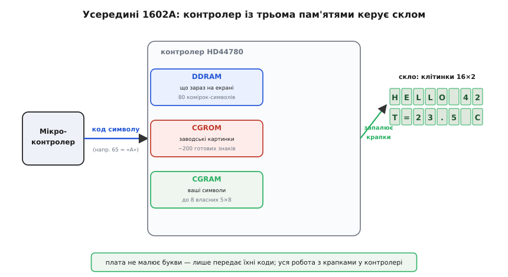
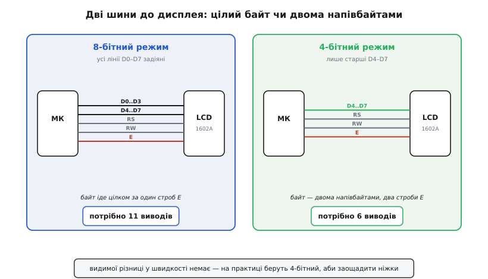
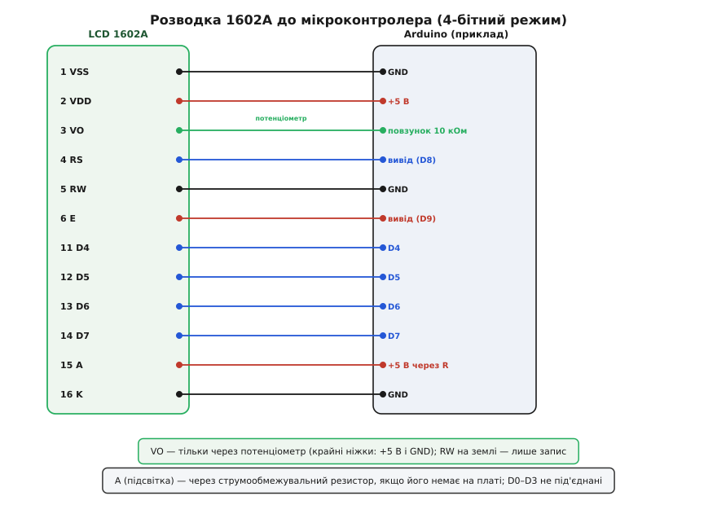

# Символьний дисплей LCD 1602A

<preknowlist>
- [GPIO-регістри](book:programming/gpio-registers) — як із коду підняти чи опустити ніжку мікроконтролера; тут ними «вручну» смикають шину дисплея.
- [Логічні рівні як діапазони](book:electronics/logic-levels-as-ranges) — що таке 5-вольтова й 3.3-вольтова логіка й чому їх не можна плутати наосліп.
- [Потенціометр](book:electronics/potentiometer) — дільник напруги з рухомим повзунком; ним задають напругу контрасту на цьому дисплеї.
- [ASCII і UTF-8](book:programming/ascii-utf8) — як літера стає числом-кодом; дисплей приймає саме коди символів і сам малює їхні картинки.
- [Резистор](book:electronics/resistor) — обмеження струму; крізь нього живлять підсвітку, щоб та не згоріла.
</preknowlist>

Це той самий зелено-чорний (або синьо-білий) прямокутник, що світиться у половині саморобних приладів: два рядки по шістнадцять клітинок, у кожній — літера, цифра чи знак. **LCD 1602A** — символьний рідкокристалічний дисплей (англ. *Liquid Crystal Display* — рідкокристалічний дисплей), і сама назва його описує: **16** символів у рядку, **2** рядки. Він не вміє малювати довільну картинку — лише виставляти готові знаки у фіксовану сітку клітинок. Але саме тому він такий зручний: щоб вивести «Temp: 23.5 C» чи «Battery 87%», не треба ні шрифтів, ні кадрового буфера, ні клопоту з пікселями. Пишеш текст — він з'являється. Термометри, годинники, лічильники, меню приладів, стан зарядки — усе, де треба показати кілька рядків тексту й ні на що більше не витрачатися, десятиліттями тримається саме на цьому дисплеї.

Підступність у тому, що за простотою «пишеш текст — він з'являється» стоїть чимала розводка: чотирнадцять або шістнадцять виводів, окрема напруга контрасту, підсвітка зі своїм струмом, і шина, якою до дисплея треба говорити командами в правильному порядку. Новачок бачить погашений або залитий чорними прямокутниками екран і не розуміє, живий він узагалі чи ні. Розберімо цей модуль так, щоб упізнати його серед інших, правильно підключити з першого разу й розуміти, що відбувається, коли він мовчить.

## Що це насправді таке

Плата 1602A — це **скло з рідкими кристалами плюс мозок, що ним керує**. Мозок — окрема мікросхема-контролер, майже завжди [HD44780 або точна його копія](book:boards/lcd-1602/hist-hd44780.md); саме вона зробила цей клас дисплеїв стандартом. Контролер тримає всередині власну пам'ять під текст, знає, як виглядає кожен символ, і сам вмикає-вимикає потрібні крапки на склі. Ваша плата не малює букви — вона лише **надсилає контролеру код символу**, а той сам знаходить його картинку й запалює.

> 🔧 **Навіщо це.** Оце й є головна вигода символьного дисплея: уся морока з пікселями схована в контролері. Мікроконтролеру не треба зберігати шрифт, рахувати, які крапки гасити, чи гнати потік даних на кожен кадр — він шле короткий код літери й забуває. Через це 1602A оживає навіть на найслабшому чипі з кількома вільними ніжками, тоді як графічний екран потребує і пам'яті під картинку, і швидкої шини.

Всередині контролера — три ключові шматки пам'яті, і розуміти їх варто, бо саме через них ви з ним говорите. Це узагальнена ідея контролера дисплея — [мікросхеми з власною пам'яттю-картинкою, якій шлють команди, а не сирі пікселі](book:electronics/display-controller); у HD44780 вона втілена в найпростішій, «текстовій» формі.

**DDRAM** (*Display Data RAM* — пам'ять даних дисплея) — це те, що зараз на екрані. Вісімдесят комірок, у кожній лежить код одного символу. Клітинка екрана прямо відповідає комірці DDRAM: поклав у комірку код літери «A» — у відповідній клітинці засвітилася «A». Комірок вісімдесят, а видимих клітинок лише тридцять дві (16×2), тож решта — за краєм екрана; це дає змогу «прокручувати» довгий рядок, зсуваючи вікно видимості.

**CGROM** (*Character Generator ROM* — постійна пам'ять генератора символів) — зашита на заводі таблиця картинок. Для кожного коду тут лежить його малюнок на сітці 5×8 крапок. Латинка, цифри, знаки пунктуації, трохи спецсимволів — усього близько двохсот готових знаків. Ось чому дисплей приймає саме [ASCII-коди](book:programming/ascii-utf8): пошлеш число 65 — контролер дістане з CGROM картинку літери «A» і покаже її. Кирилиці в базовій CGROM здебільшого немає — це окрема морока, до якої повернемось.

**CGRAM** (*Character Generator RAM* — оперативна пам'ять генератора символів) — маленький клаптик, куди **ви самі** можете записати до восьми власних символів 5×8. Намалювали картинку зі стовпчиків — і ось на дисплеї з'явився значок батареї, градуса, стрілки чи літери, якої немає в заводській таблиці. Це і є спосіб показати те, чого CGROM не знає.


*Мікроконтролер шле контролеру лише код символу. Контролер кладе код у DDRAM (що зараз на екрані), бере картинку знака з CGROM (заводська таблиця) або з CGRAM (ваші вісім власних символів) і сам запалює потрібні крапки на склі. Плата — не малює букви, а лише передає їхні коди.*

## Виводи: чотирнадцять ніжок і чому їх стільки

На торці плати — гребінка на **16 контактів** (у найпростіших без підсвітки — 14). Розкладка стандартна, однакова майже в усіх виробників, і саме її треба знати напам'ять, бо переплутати живлення з контрастом — класична перша помилка.

```
Пін  Назва   Призначення
──────────────────────────────────────────────────────────
 1   VSS     земля (GND)
 2   VDD     живлення +5 В
 3   VO      контраст — напруга від дільника (потенціометра)
 4   RS      вибір регістра: 0 = команда, 1 = дані (символ)
 5   RW      напрям: 0 = запис у дисплей, 1 = читання з нього
 6   E       строб (enable): дані «клацаються» на спаді E
 7   D0  ┐
 8   D1  │
 9   D2  │   шина даних, 8 біт
10   D3  │   (у 4-бітному режимі D0–D3 не використовують)
11   D4  │
12   D5  │
13   D6  │
14   D7  ┘   (у режимі читання D7 ще й прапорець зайнятості)
15   A       анод підсвітки (+, через резистор)
16   K       катод підсвітки (−, на землю)
```

Три ніжки — керувальні, і вони варті окремої уваги, бо на них тримається весь протокол.

**RS** (*Register Select* — вибір регістра) каже контролеру, **чим** є байт на шині. `RS = 0` — це команда (очистити екран, пересунути курсор, налаштувати режим). `RS = 1` — це код символу, який треба покласти в DDRAM і показати. Один і той самий байт на лініях даних означає різне залежно від RS: при `RS = 0` число 1 — команда «очистити дисплей», при `RS = 1` те саме число 1 — нічого не значущий символ.

**R/W** (*Read/Write* — читання/запис) задає напрям обміну. Майже завжди ви тільки пишете в дисплей, тож цю ніжку часто просто садять на землю (`RW = 0` назавжди). Читати з дисплея треба лише в одному випадку — щоб опитати прапорець зайнятості (про нього нижче); багато хто цього не робить і просто чекає паузами, тому й тримає R/W на землі.

**E** (*Enable* — дозвіл, строб) — це «зараз!». Контролер не дивиться на шину постійно; він **зчитує стан ліній у момент, коли E падає з високого рівня в низький**. Тобто ви виставляєте RS і дані, а тоді робите на E короткий імпульс — підняли й опустили; на спаді контролер клацає значення собі всередину. Без цього імпульсу дисплей не помічає нічого, що ви поставили на шину.

> 🔧 **Навіщо це.** Строб E — серце всього обміну, і саме тут найчастіше все ламається. Порядок жорсткий: спершу виставити RS і байт даних, дати їм устоятися, і **аж потім** смикнути E. Якщо смикнути E раніше, ніж лінії набули потрібних значень, контролер зчитає сміття. У коді між виставленням даних і імпульсом E ставлять крихітну паузу (десятки-сотні наносекунд, часто вистачає одного «холостого» такту), а сам імпульс E тримають хоча б ~0.5 мкс. Плутанина з цим — головна причина «пишу правильні байти, а на екрані каша».

## Контраст: чому екран буває цілком чорний або цілком порожній

Найчастіший переляк новачка — увімкнув живлення, а екран або **суцільно чорні прямокутники**, або **зовсім порожній**, хоча плата ціла. Річ майже завжди в ніжці **VO** (пін 3) — контрасті.

Рідкі кристали в клітинці показують крапку, лише коли на них потрапляє потрібна напруга зсуву. Ніжка VO задає **опорну напругу**, від якої контролер відлічує «увімкнено» й «вимкнено» для кожної крапки. Якщо на VO нуль (посаджений на землю) — контраст максимальний, і часто це виглядає як суцільно залиті чорним клітинки. Якщо на VO повні п'ять вольтів — контраст найменший, крапки бліднуть до невидимості. Правильна робоча напруга — десь **посередині, ближче до нуля**, і вона трохи різна для кожного примірника й залежить від температури.

Тому VO ніколи не садять жорстко, а заводять на **повзунок потенціометра**: крайні ніжки резистора — на +5 В і на землю, середню (повзунок) — на VO. Крутячи його, ви плавно ведете напругу від 0 до 5 В і ловите ту точку, де символи чіткі, а тло спокійне. Це і є [дільник напруги з рухомим відводом](book:electronics/potentiometer): резистивна доріжка між живленням і землею, а повзунок знімає з неї будь-яку проміжну напругу.

> 🔧 **Навіщо це.** Якщо новий дисплей показує чорні квадрати або порожнечу — **перше, що робиш, це крутиш потенціометр контрасту через увесь діапазон**, а не шукаєш помилку в коді. Дуже часто плата й прошивка справні, просто VO стоїть у крайньому положенні. Номінал потенціометра — зазвичай 10 кОм; підійде і підстроювальний, і звичайний. Без нього, посадивши VO навмання, легко «не побачити» цілком робочий дисплей і півдня шукати неіснуючу ваду.

## Підсвітка: окреме коло зі своїм струмом

Символи на 1602A самі не світяться — рідкі кристали лише перекривають або пропускають світло. Щоб щось було видно в темряві, ззаду стоїть **підсвітка** (*backlight*) — світлодіодне поле, і воно живиться **окремо** від логіки, через ніжки **A** (анод, +) і **K** (катод, −).

Підсвітка — це, по суті, світлодіод, а світлодіод не можна вмикати «в лоб» на п'ять вольтів: він потягне надто великий струм і згорить. Йому потрібне **обмеження струму** — резистор послідовно. На багатьох платах такий резистор уже стоїть на самій платі (тоді A можна вести прямо на +5 В), але **не на всіх**: трапляються модулі, де між A і живленням треба поставити свій резистор на 100–330 Ом. Подати п'ять вольтів на «голу» підсвітку без резистора — певний спосіб її спалити або відчутно вкоротити їй життя.

> 🔧 **Навіщо це.** Перш ніж вести A на +5 В, варто глянути, чи є на платі біля виводів A/K резистор (маленький прямокутничок, часто з підписом на кшталт «R8» чи «101»). Є — можна живити прямо; немає — став свій ~150 Ом послідовно. Це струмообмежувальний [резистор](book:electronics/resistor): він гасить різницю між напругою живлення й напругою світіння світлодіода, аби струм лишався в безпечних межах. Ще зручно завести A через цей резистор на вивід мікроконтролера, а не на постійні +5 В: тоді підсвіткою можна вмикати-вимикати чи навіть регулювати її яскравість, і екран не світить дарма, коли на нього ніхто не дивиться.

## Дві шини: 8 біт проти 4 біт

Байт до дисплея можна передавати двома способами, і вибір визначає, скільки ніжок мікроконтролера ви витратите.

**8-бітний режим** — усі вісім ліній даних D0–D7 задіяні, байт іде цілком за один імпульс E. Швидше, простіше в думці, але з'їдає **аж одинадцять** виводів (8 даних + RS + RW + E). На дрібному мікроконтролері таку розкіш дозволити важко.

**4-бітний режим** — задіяні лише старші чотири лінії, **D4–D7**; молодші D0–D3 просто не під'єднують. Байт передають **двома порціями по чотири біти** (напівбайтами, англ. *nibble*): спершу старший напівбайт, потім молодший, кожен зі своїм імпульсом E. Виходить удвічі більше стробів на байт, зате виводів треба лише **шість** (4 даних + RS + RW + E), а RW ще й часто на землі — тоді й зовсім п'ять. Швидкість людському оку байдужа: навіть напівбайтами дисплей оновлюється миттєво.

На практиці **майже завжди беруть 4-бітний режим** — економія ніжок того варта, а видимої різниці немає. Бібліотеки перемикають дисплей у цей режим у перших командах ініціалізації й далі самі ріжуть кожен байт на два напівбайти.


*Ліворуч — 8-бітний режим: байт іде цілком по D0–D7 за один строб E, але забирає 11 виводів мікроконтролера. Праворуч — 4-бітний: задіяні лише D4–D7, байт передають двома напівбайтами (старший, потім молодший) двома стробами; виводів треба лише 6. Видимої різниці у швидкості немає, тож на практиці беруть 4-бітний.*

## Підключення до мікроконтролера пін-у-пін

Зберімо все в одну розводку — типове підключення 1602A у 4-бітному режимі до п'ятивольтового мікроконтролера (Arduino Uno чи подібного). Саме її повторюють у переважній більшості проєктів.

```
LCD 1602A           Мікроконтролер (Arduino Uno, приклад)
────────────────────────────────────────────────────────
 1 VSS  ──────────  GND
 2 VDD  ──────────  +5 В
 3 VO   ──────────  повзунок потенціометра 10 кОм
                    (крайні ніжки → +5 В і GND)
 4 RS   ──────────  D8   (будь-який вивід)
 5 RW   ──────────  GND  (тільки пишемо)
 6 E    ──────────  D9
11 D4   ──────────  D4
12 D5   ──────────  D5
13 D6   ──────────  D6
14 D7   ──────────  D7
15 A    ──── R ───  +5 В  (резистор, якщо його немає на платі)
16 K    ──────────  GND
       D0–D3 — не під'єднані (4-бітний режим)
```


*Пін-у-пін для 4-бітного режиму. VSS/VDD — живлення 5 В; VO знімає напругу контрасту з повзунка потенціометра, крайні ніжки якого сидять на +5 В і землі. RS і E йдуть на два вільні виводи, RW — на землю (тільки запис). Дані — лише чотири лінії D4–D7. Підсвітка A/K — окреме коло через струмообмежувальний резистор. Молодші D0–D3 висять у повітрі.*

Кілька зауваг до цієї схеми. По-перше, **живлення логіки — п'ять вольтів**: класичний HD44780 розрахований саме на 5 В, і на 3.3 В він часто або не працює, або показує ледь помітно. Це створює окрему складність для сучасних 3.3-вольтових плат (ESP32, STM32, Pico) — до неї повернемось. По-друге, **RW на землі** економить вивід ціною того, що ви не зможете читати прапорець зайнятості й будете чекати паузами; для більшості завдань це прийнятно. По-третє, VO **обов'язково через потенціометр** — жорстко на землю чи на живлення садити його не варто, бо тоді контраст не підстроїш.

## Прапорець зайнятості: чому інколи треба чекати

Контролер HD44780 виконує команди не миттєво. Очищення екрана й повернення курсора «додому» тривають довго за мірками мікроконтролера — близько **1.5 мілісекунди**; звичайний запис символу — десятки мікросекунд. Якщо шпурляти в дисплей команди швидше, ніж він встигає, наступна загубиться.

Контролер сам повідомляє, що зайнятий: у режимі читання (`RW = 1`) на лінії **D7** він виставляє **прапорець зайнятості** (*busy flag*) — `1`, поки виконує попередню команду, і `0`, коли готовий. Правильний спосіб — перед кожною командою читати D7 і чекати, доки він не впаде.

Але це вимагає керувати ніжкою RW і перемикати лінії даних на вхід, що складніше. Тому дуже поширений простіший підхід: **RW на землю назавжди, а замість опитування прапорця — просто витримувати паузи** з запасом (наприклад, 2 мс після очищення екрана, ~50 мкс після звичайного символу). Це трохи марнує час, зате код простіший і ніжку RW не треба чіпати. Саме так робить більшість бібліотек за замовчуванням, і для дисплея, що оновлюється кілька разів на секунду, різниці ви не помітите.

> 🔧 **Навіщо це.** Якщо ваш екран періодично «ковтає» символи чи показує щось не те одразу після очищення — майже напевно ви не витримали паузу після довгої команди. Очищення й «повернення додому» потребують півтори-дві мілісекунди; звичайний символ — набагато менше, але й на нього треба дати контролеру видих. Опитувати прапорець зайнятості (RW = 1, читати D7) варто лише тоді, коли ви женете на дисплей багато тексту й хочете вичавити швидкість; для типового приладу паузи простіші й цілком достатні.

## Кирилиця: чого в дисплеї немає

Заводська CGROM більшості 1602A знає латинку, цифри, знаки — але **не українську кирилицю**. Пошлете код української літери — на екрані буде порожнеча або чужий знак. Це не поломка, а межа: у зашитій таблиці цих картинок просто немає.

Виходів кілька. Перший — купити модуль із **кириличною CGROM** (варіанти з російсько-подібним набором існують, часто з позначкою про кирилицю в описі), але навіть там повний український набір (ґ, є, і, ї) буває неповним. Другий, універсальний — **намалювати потрібні літери самому** в CGRAM. Пам'ятаймо: власних символів лише вісім, тож цілий алфавіт туди не влізе, але для коротких сталих написів (кілька специфічних літер, значок градуса, стрілки) цього досить. Третій, найчесніший для приладу — **писати латинкою або транслітом**: «Temp», «Batt», «OK» читаються всюди й не залежать від того, яка CGROM трапилась.

> 🔧 **Навіщо це.** Плануючи інтерфейс на 1602A, закладайтеся, що **кирилиці за замовчуванням немає**. Якщо потрібні кілька українських літер чи спецзнаків — зарезервуйте їх серед восьми комірок CGRAM ще на етапі задуму (їх дуже мало, і вони швидко закінчуються). Якщо тексту багато — простіше й надійніше лишитися в латинці. Не розраховуйте, що «дисплей сам покаже українською»: без вашого втручання він цього не вміє.

## Родичі: 1602, 2004, 0802 і I2C-версія

Модуль 1602A — представник цілої родини символьних дисплеїв на тому самому контролері HD44780, і всі вони керуються **однаково**, різняться лише геометрією сітки:

```
Назва   Клітинок       Застосування
──────────────────────────────────────────────
0802    8 × 2          зовсім маленькі написи
1602    16 × 2         найпоширеніший, «робоча конячка»
2004    20 × 4         більше тексту, меню на чотири рядки
1601    16 × 1         один довгий рядок
```

Код для них майже спільний — змінюється лише кількість рядків і стовпців у налаштуванні. Хто освоїв 1602A, той з ходу підключить і 2004.

Окрема, дуже практична варіація — **1602 з I2C-адаптером**. До плати ззаду припаюють крихітну платку-перехідник на мікросхемі-розширювачі виводів, і тоді весь дисплей керується **лише двома лініями** ([шиною I2C](book:communications/i2c-bus)) замість шести-одинадцяти. Це рятує, коли ніжок мікроконтролера обмаль. Сам дисплей той самий — змінюється тільки спосіб доставки байтів до нього; докладно цей перехідник і його адресація розібрані окремо в [I2C-адаптері для LCD 1602](book:boards/i2c-lcd-adapter).

## Як говорити з дисплея з коду

Уся практична робота — це кілька типових дій: ініціалізувати дисплей у потрібному режимі, поставити курсор, вивести рядок, за потреби намалювати власний символ у CGRAM. Ніхто не робить це «голими» стробами E щоразу — беруть готову бібліотеку (`LiquidCrystal` для Arduino, аналоги для інших платформ), яка ховає всю послідовність команд і різання байтів на напівбайти. Повне пояснення кожного виклику, ручне керування стробом E для розуміння, що під капотом, і типові пастки зібрано в [API-довіднику «Керуємо LCD 1602 із коду»](book:boards/lcd-1602/api-liquidcrystal.md); а зібраний із цих рівнів живий приклад — [термометр із годинником, що оновлюється без блимання](book:boards/lcd-1602/proj-thermometer.md).

Коротко ж послідовність оживлення дисплея завжди така: подати живлення й зачекати, поки контролер очуняється; кількома командами ввести його в 4-бітний режим і задати геометрію (два рядки, сітка 5×8); увімкнути дисплей і, за бажанням, курсор; очистити екран; поставити курсор на потрібну клітинку — і слати коди символів. Бібліотека робить перші кроки за вас у одному виклику ініціалізації, а далі ви лише пишете текст і рухаєте курсор.

## Граблі, на яких спотикаються всі

Зберімо в одному місці те, на чому губиться найбільше часу з 1602A. Майже кожна проблема — з цього короткого списку.

**Екран чорний або порожній — це контраст.** Найперша й найчастіша. Перш ніж підозрювати код чи розводку, **прокрутіть потенціометр VO через увесь діапазон**. Дуже часто плата й прошивка справні, просто напруга контрасту стоїть у крайньому положенні. Немає потенціометра під рукою — тимчасово киньте VO на землю через резистор кілька кілоом, аби хоч щось побачити.

**Каша з символів замість тексту — це строб E або порядок ніжок.** Якщо на екрані безлад, а контраст явно живий, то майже завжди або переплутані лінії даних D4–D7, або імпульс E смикають раніше, ніж устоялися дані, або дисплей не ввели в 4-бітний режим (а бібліотека шле напівбайти). Перевірте відповідність D4–D7 і що в коді обрано саме 4-бітний режим.

**Дисплей «ковтає» символи — це нестача пауз.** Команди очищення й «додому» тривають ~1.5 мс; якщо не чекати прапорця зайнятості й не витримати паузу, наступна команда губиться. Додайте затримку після довгих команд або опитуйте D7.

**Нічого не видно на 3.3-вольтовій платі — це живлення логіки.** Класичний HD44780 хоче п'ять вольтів на VDD; від 3.3 В він часто мовчить або ледь тліє. Живіть VDD від 5 В (якщо на платі вони є), а щоб 3.3-вольтові сигнали мікроконтролера дисплей певно розпізнав, іноді потрібне узгодження рівнів. Найпростіше на 3.3 В — брати **I2C-версію**, яку легше зробити сумісною.

**Підсвітка згоріла — це відсутній резистор.** Подали +5 В прямо на анод A модуля, де на платі немає струмообмежувального резистора, — світлодіодне поле тягне надмір і деградує. Перевіряйте наявність резистора біля A/K; немає — ставте свій ~150 Ом послідовно.

**Українських літер немає — це межа CGROM.** Заводська таблиця символів кирилиці здебільшого не містить. Або малюйте потрібні літери в CGRAM (їх лише вісім), або пишіть латинкою. «Саме собою» українською дисплей не заговорить.
