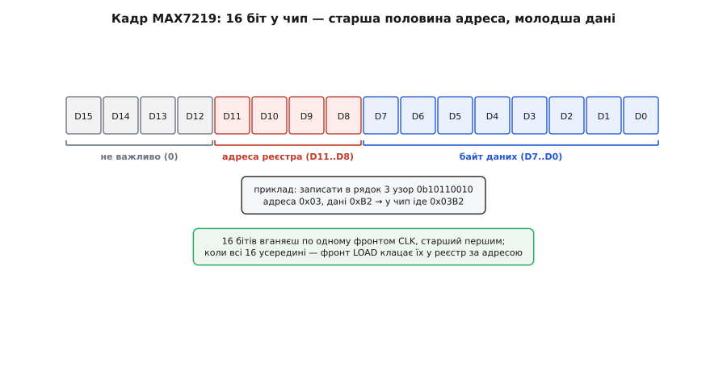

# 📋 Як засвітити 1588BS: буфер кадру, пряме мультиплексування, MAX7219

Матриця вже лежить на столі, прозвонена, з резисторами й транзисторами на своїх місцях. Лишається останнє — **написати код**, який змусить шістдесят чотири цятки скластися в картинку. І тут гола 1588BS ставить перед автором прошивки чесний вибір, якого не буває з готовими дисплеями: або **ти сам крутиш розгортку** такт за тактом у перериванні таймера, або **вішаєш на матрицю драйвер MAX7219** і надсилаєш йому готовий кадр трьома проводами. Ці два шляхи вимагають зовсім різного коду, і кожен навчає свого — тут зібрано обидва до робочої прошивки: розкладка виводів, протокол, карта реєстрів. А коли керування працює, на ньому вже будують застосунки — наприклад, [біжучий рядок](book:boards/led-matrix-8x8/proj-scroll-text.md).

Код усюди справжній — той, що компілюється й заливається, а не псевдокод: імена регістрів, типи, оголошення такі, як воно є в реальній прошивці. Сама ж задача від платформи не залежить: хоч би що стояло на платі, потрібні шістнадцять цифрових виходів, апаратний таймер із перериванням і три лінії послідовної шини. Тому кожен приклад подано трьома вкладками — Arduino (ATmega328P на 16 МГц) як найкоротший вхід, ESP-IDF і STM32 HAL як те саме на іншому залізі. Читай ту, що твоя: логіка в усіх трьох одна, різняться лише імена.

## Буфер кадру як єдина правда

Перш ніж ділити шляхи, домовмося про одну річ, спільну для обох: **буфер кадру** (англ. *framebuffer*). Це вісім байтів — по одному на рядок; кожен біт байта каже, горить чи ні відповідна цятка того рядка.

```cpp
uint8_t frame[8];   // frame[r] — узор рядка r; біт c = цятка (r, c)
```

Уся решта коду ділиться на дві незалежні половини, і це поділ, який рятує від плутанини. Одна половина **малює** — вона знає про літери, зсуви, візерунки й змінює лише вміст `frame[]`. Друга половина **показує** — вона нічого не знає про зміст, а тупо й дуже часто перекладає ті вісім байтів на залізо. Половина, що малює, працює повільно й рідко, коли є що змінити. Половина, що показує, працює швидко й безперервно, бо матриця гасне тієї ж миті, щойно її перестати оновлювати.

Ось приклад «малювання» — покласти в буфер усміхнене обличчя. Кожен рядок зручно писати двійковим літералом, бо тоді видно сам малюнок просто в коді:

```cpp
void drawSmiley() {
    frame[0] = 0b00111100;
    frame[1] = 0b01000010;
    frame[2] = 0b10100101;   // очі
    frame[3] = 0b10000001;
    frame[4] = 0b10100101;   // куточки рота
    frame[5] = 0b10011001;   // усмішка
    frame[6] = 0b01000010;
    frame[7] = 0b00111100;
}
```

Одиниці в літералі — це цятки, що мають горіти. Дивишся на код — і бачиш обличчя. Далі все питання в тому, **як** ці вісім байтів долетять до світлодіодів.

> 🔧 **Навіщо це.** Поділ на «малює» і «показує» — не педантизм, а рятівне коло. Змішаєш їх — і код розгортки почне залежати від того, що саме на екрані, а код малюнка муситиме знати про транзистори й такти. Тоді будь-яка зміна ламає обидва боки. Тримай буфер кадру як єдину точку зустрічі: усе, що хоче щось показати, лише пише у `frame[]`; усе, що виводить на залізо, лише читає `frame[]`. Ця межа однакова і для прямого керування, і для MAX7219 — тому кадр можна намалювати раз, а показати будь-яким із двох способів.

## Спосіб перший: пряме мультиплексування власноруч

Тут мікроконтролер керує всіма шістнадцятьма лініями сам. Вісім стовпцевих ліній через гасильні резистори йдуть на вісім його виводів; вісім рядкових — через транзисторні ключі на «плюс», і ще вісім виводів вибирають, який рядок живиться. Розгортка — цикл, який гасить поточний рядок, ставить на стовпці узор наступного й вмикає його; вісім разів — і кадр показано, після чого все з початку.

Найважливіше рішення тут — **де крутити цей цикл**. Спокуса написати його прямо в головному циклі програми (`loop()` в Arduino, тіло задачі в ESP-IDF, `while (1)` у `main()` на STM32) велика, але це пастка: щойно там з'явиться бодай коротка затримка (прочитати давач, відповісти по шині), розгортка спіткнеться, і матриця смикнеться або застигне на одному рядку. Тому правильне місце для розгортки — **переривання таймера**: залізний годинник чипа сам, незалежно від головного коду, викликає нашу функцію рівно з потрібною частотою. Головна програма тим часом вільна робити що завгодно.

Спиратимемось на [переривання](book:programming/interrupts) й [таймер-лічильник](book:programming/timer-counter): коротко — апаратний таймер усередині будь-якого мікроконтролера рахує такти й на переповненні смикає окрему функцію-обробник, поки основний код біжить своєю чергою (в ATmega328P це Timer2, в ESP32 — `esp_timer`, у STM32 — TIM). Саме туди й піде розгортка.

### Розкладка виводів і карта рядків

Спершу — конкретика підключення. Хоч би яка була платформа, матриці потрібні шістнадцять звичайних цифрових виходів: вісім на стовпці, вісім на рядкові ключі. Різниться тільки те, як вивід називають: в Arduino це наскрізні номери плати (`2…9` під стовпці, `10, 11, 12, 13, A0, A1, A2, A3` під ключі — аналогові виводи чудово працюють як звичайні цифрові виходи), в ESP-IDF — номер GPIO самого чипа, у STM32 — пара «порт + маска ніжки». Нумерація ніжок 1588BS не відповідає порядку рядків і стовпців — та ще й різниться між партіями, тож числа виводів у коді залежать від того, як прозвонено саме твій примірник. Щоб не зашивати цю розкладку в логіку розгортки, тримаємо дві таблиці — «логічний рядок → вивід» і «логічний стовпець → вивід», і узгоджуємо їх зі своїм паянням один раз:

:::tabs
```arduino
// Виводи, до яких фізично припаяно стовпці 0..7 (катоди через резистори).
const uint8_t COL_PIN[8] = { 2, 3, 4, 5, 6, 7, 8, 9 };

// Виводи, що керують транзисторними ключами рядків 0..7 (аноди до +5 В).
const uint8_t ROW_PIN[8] = { 10, 11, 12, 13, A0, A1, A2, A3 };
```
```esp-idf
#include "driver/gpio.h"

// Номери GPIO чипа, до яких припаяно стовпці 0..7 (катоди через резистори).
static const gpio_num_t COL_PIN[8] = {
    GPIO_NUM_4,  GPIO_NUM_5,  GPIO_NUM_12, GPIO_NUM_13,
    GPIO_NUM_14, GPIO_NUM_15, GPIO_NUM_16, GPIO_NUM_17,
};

// GPIO, що керують транзисторними ключами рядків 0..7 (аноди до +5 В).
// GPIO 6..11 зайняті флешем, 34..39 — тільки входи: під виходи не годяться.
static const gpio_num_t ROW_PIN[8] = {
    GPIO_NUM_18, GPIO_NUM_19, GPIO_NUM_21, GPIO_NUM_22,
    GPIO_NUM_23, GPIO_NUM_25, GPIO_NUM_26, GPIO_NUM_27,
};
```
```stm32
#include "stm32f1xx_hal.h"

// На STM32 вивід — це пара «порт + маска ніжки», тож тримаємо її структурою.
typedef struct { GPIO_TypeDef *port; uint16_t pin; } pin_t;

// Стовпці 0..7 (катоди через резистори).
static const pin_t COL_PIN[8] = {
    {GPIOA, GPIO_PIN_0}, {GPIOA, GPIO_PIN_1}, {GPIOA, GPIO_PIN_2}, {GPIOA, GPIO_PIN_3},
    {GPIOA, GPIO_PIN_4}, {GPIOA, GPIO_PIN_5}, {GPIOA, GPIO_PIN_6}, {GPIOA, GPIO_PIN_7},
};

// Рядкові ключі 0..7 (аноди до +5 В). PB2 обходимо — це BOOT1.
static const pin_t ROW_PIN[8] = {
    {GPIOB, GPIO_PIN_0}, {GPIOB, GPIO_PIN_1}, {GPIOB, GPIO_PIN_3}, {GPIOB, GPIO_PIN_4},
    {GPIOB, GPIO_PIN_5}, {GPIOB, GPIO_PIN_6}, {GPIOB, GPIO_PIN_7}, {GPIOB, GPIO_PIN_8},
};
```
:::

Ключова думка: **порядок у цих масивах ти підбираєш під свій примірник**, а не під чужий малюнок. Якщо після заливки картинка перевернута чи дзеркальна — не чіпаєш логіку розгортки, а лише переставляєш числа в цих двох рядках, доки орієнтація не збіжиться. Уся розпіновка зібрана у двох масивах — і це єдине місце, яке залежить від конкретної матриці.

Матриця 1588BS зі **спільним анодом**, тож рядок вмикають, подаючи «+», а стовпець запалюють, притягуючи до **нуля**. Це задає полярність в усьому коді нижче: активний рядок — це ключ, що подав «плюс»; активна цятка — це стовпець, виставлений у `LOW`.

### Ініціалізація

В ініціалізації — тому коді, що виконується один раз до запуску розгортки (`setup()` в Arduino, початок `app_main()` в ESP-IDF, ділянка після `HAL_Init()` у STM32), — оголошуємо всі шістнадцять виводів виходами й гасимо матрицю в безпечний стан: рядки вимкнено (жоден ключ не подає «плюс»), стовпці підтягнуто до «високого» (жодна цятка не має куди стекти струму). А тоді заводимо таймер.

:::tabs
```arduino
void setup() {
    for (uint8_t i = 0; i < 8; i++) {
        pinMode(COL_PIN[i], OUTPUT);
        pinMode(ROW_PIN[i], OUTPUT);
        digitalWrite(COL_PIN[i], HIGH);   // стовпець «високий» → цятка темна
        digitalWrite(ROW_PIN[i], LOW);    // ключ закритий → рядок не живиться
    }
    drawSmiley();        // покладемо в буфер щось видиме
    setupScanTimer();    // запускаємо розгортку в перериванні
}
```
```esp-idf
static const char *TAG = "matrix";

void app_main(void) {
    gpio_config_t io = {
        .pin_bit_mask = 0,
        .mode         = GPIO_MODE_OUTPUT,
        .pull_up_en   = GPIO_PULLUP_DISABLE,
        .pull_down_en = GPIO_PULLDOWN_DISABLE,
        .intr_type    = GPIO_INTR_DISABLE,
    };
    for (int i = 0; i < 8; i++)           // усі шістнадцять ніжок — в одну маску
        io.pin_bit_mask |= (1ULL << COL_PIN[i]) | (1ULL << ROW_PIN[i]);
    ESP_ERROR_CHECK(gpio_config(&io));

    for (int i = 0; i < 8; i++) {
        gpio_set_level(COL_PIN[i], 1);    // стовпець «високий» → цятка темна
        gpio_set_level(ROW_PIN[i], 0);    // ключ закритий → рядок не живиться
    }
    drawSmiley();                         // покладемо в буфер щось видиме
    ESP_LOGI(TAG, "матрицю погашено, запускаю розгортку");
    setupScanTimer();                     // запускаємо розгортку в перериванні
}
```
```stm32
int main(void) {
    HAL_Init();
    SystemClock_Config();
    __HAL_RCC_GPIOA_CLK_ENABLE();         // без такту на порт ніжки мертві
    __HAL_RCC_GPIOB_CLK_ENABLE();

    GPIO_InitTypeDef g = {0};
    g.Mode  = GPIO_MODE_OUTPUT_PP;
    g.Pull  = GPIO_NOPULL;
    g.Speed = GPIO_SPEED_FREQ_HIGH;
    for (int i = 0; i < 8; i++) {
        g.Pin = COL_PIN[i].pin;  HAL_GPIO_Init(COL_PIN[i].port, &g);
        g.Pin = ROW_PIN[i].pin;  HAL_GPIO_Init(ROW_PIN[i].port, &g);
        // стовпець «високий» → цятка темна; ключ закритий → рядок не живиться
        HAL_GPIO_WritePin(COL_PIN[i].port, COL_PIN[i].pin, GPIO_PIN_SET);
        HAL_GPIO_WritePin(ROW_PIN[i].port, ROW_PIN[i].pin, GPIO_PIN_RESET);
    }
    drawSmiley();        // покладемо в буфер щось видиме
    setupScanTimer();    // запускаємо розгортку в перериванні
    while (1) { }        // головний цикл вільний
}
```
:::

Порядок гасіння тут не випадковий. Спершу треба привести обидва боки в стан «нічого не горить», і аж тоді дозволяти переривання. Інакше перший же виклик обробника може застати виводи в непевному стані й блимнути сміттям.

### Серце: обробник розгортки

Ось найважливіша функція всього способу. Вона викликається таймером сотні разів на секунду й щоразу показує **рівно один наступний рядок**. Логіка кроку строга, і порядок дій у ньому — це і є те місце, де народжуються або не народжуються «привиди»:

:::tabs
```arduino
volatile uint8_t curRow = 0;   // який рядок показуємо цієї ітерації

void scanStep() {
    // 1. ПОГАСИТИ попередній рядок ПЕРШИМ ділом — інакше буде перекриття.
    digitalWrite(ROW_PIN[curRow], LOW);      // закрити ключ старого рядка

    // 2. Перейти до наступного рядка по колу.
    curRow = (curRow + 1) & 7;               // 0,1,…,7,0,1,… (& 7 = % 8)

    // 3. Виставити на стовпці узор саме цього рядка.
    uint8_t bits = frame[curRow];
    for (uint8_t c = 0; c < 8; c++) {
        // спільний анод: цятка горить, коли стовпець = LOW.
        bool lit = bits & (1 << c);
        digitalWrite(COL_PIN[c], lit ? LOW : HIGH);
    }

    // 4. І аж ТЕПЕР увімкнути новий рядок.
    digitalWrite(ROW_PIN[curRow], HIGH);     // відкрити ключ → рядок світить
}
```
```esp-idf
static volatile uint8_t curRow = 0;   // який рядок показуємо цієї ітерації

// IRAM_ATTR — щоб обробник не чекав на кеш флешу.
static void IRAM_ATTR scanStep(void) {
    // 1. ПОГАСИТИ попередній рядок ПЕРШИМ ділом — інакше буде перекриття.
    gpio_set_level(ROW_PIN[curRow], 0);      // закрити ключ старого рядка

    // 2. Перейти до наступного рядка по колу.
    curRow = (curRow + 1) & 7;               // 0,1,…,7,0,1,… (& 7 = % 8)

    // 3. Виставити на стовпці узор саме цього рядка.
    uint8_t bits = frame[curRow];
    for (int c = 0; c < 8; c++) {
        // спільний анод: цятка горить, коли стовпець у нулі.
        gpio_set_level(COL_PIN[c], (bits & (1 << c)) ? 0 : 1);
    }

    // 4. І аж ТЕПЕР увімкнути новий рядок.
    gpio_set_level(ROW_PIN[curRow], 1);      // відкрити ключ → рядок світить
}
```
```stm32
volatile uint8_t curRow = 0;   // який рядок показуємо цієї ітерації

void scanStep(void) {
    // 1. ПОГАСИТИ попередній рядок ПЕРШИМ ділом — інакше буде перекриття.
    HAL_GPIO_WritePin(ROW_PIN[curRow].port, ROW_PIN[curRow].pin, GPIO_PIN_RESET);

    // 2. Перейти до наступного рядка по колу.
    curRow = (curRow + 1) & 7;               // 0,1,…,7,0,1,… (& 7 = % 8)

    // 3. Виставити на стовпці узор саме цього рядка.
    uint8_t bits = frame[curRow];
    for (uint8_t c = 0; c < 8; c++) {
        // спільний анод: цятка горить, коли стовпець притягнуто до нуля.
        GPIO_PinState lit = (bits & (1 << c)) ? GPIO_PIN_RESET : GPIO_PIN_SET;
        HAL_GPIO_WritePin(COL_PIN[c].port, COL_PIN[c].pin, lit);
    }

    // 4. І аж ТЕПЕР увімкнути новий рядок.
    HAL_GPIO_WritePin(ROW_PIN[curRow].port, ROW_PIN[curRow].pin, GPIO_PIN_SET);
}
```
:::

Порядок кроків тут — не стильова примха, а фізика. **Спершу гасимо старий рядок, потім міняємо узор на стовпцях, і лише насамкінець вмикаємо новий.** Якщо переставити — скажімо, увімкнути новий рядок раніше, ніж виставлено його стовпці, — то якусь коротку мить новий рядок світитиме **чужим** узором (тим, що лишився від попереднього). Око зловить це як тьмяні зайві цятки — ті самі привиди. Тому «згасив → переклав → запалив» у цьому порядку, і жодного разу два рядки не ввімкнено водночас.

`& 7` замість `% 8` — дрібна, але приємна економія: для степенів двійки побітове «і» з маскою робить те саме, що остача, тільки без ділення, якого 8-бітні ядра на кшталт ATmega328P не мають апаратно й тому виконують повільно (Cortex-M у STM32 чи ESP32 ділити вміє, але й там маска дешевша). У циклі, що крутиться тисячі разів на секунду, це не зайве.

### Підключення таймера

Лишилось завести залізний годинник, щоб він викликав `scanStep()` з правильною частотою. Порахуймо, яка частота потрібна. Щоб кадр не мерехтів, усі вісім рядків мають оновлюватися хоча б разів сто на секунду — тобто повний оберт по рядках 100 разів, а окремих кроків (рядків) — 800 на секунду. Візьмемо із запасом **1000 переривань за секунду** (повний кадр 125 разів на секунду) — око не побачить і сліду мерехтіння.

Механіка скрізь та сама: лічильник цокає від системного годинника через передільник, а на заданому числі викликає переривання й обнуляється. Різняться імена — в ATmega328P це таймер 2 в режимі «скидання за збігом» (CTC), в ESP-IDF готовий `esp_timer` бере період прямо в мікросекундах, у STM32 те саме роблять поля `Prescaler` і `Period`. Арифметика прямо в коментарях:

:::tabs
```arduino
void setupScanTimer() {
    noInterrupts();               // на час налаштування вимкнути переривання
    TCCR2A = 0;
    TCCR2B = 0;
    TCNT2  = 0;
    // Частота 16 МГц; передільник 64 → лічильник цокає 16e6/64 = 250 000 Гц.
    // Для 1000 переривань/с рахуємо до 250 000 / 1000 = 250 тактів.
    OCR2A  = 249;                 // 0..249 — це рівно 250 кроків
    TCCR2A |= (1 << WGM21);       // режим CTC: скидати TCNT2 за збігом з OCR2A
    TCCR2B |= (1 << CS22);        // передільник 64
    TIMSK2 |= (1 << OCIE2A);      // дозволити переривання «збіг з OCR2A»
    interrupts();                 // знову ввімкнути переривання
}

// Це і є та функція, яку таймер смикає 1000 разів на секунду.
ISR(TIMER2_COMPA_vect) {
    scanStep();
}
```
```esp-idf
#include "esp_timer.h"

// Це і є та функція, яку таймер смикає 1000 разів на секунду.
static void scanTimerCb(void *arg) {
    scanStep();
}

static void setupScanTimer(void) {
    const esp_timer_create_args_t args = {
        .callback = &scanTimerCb,
        .arg      = NULL,
        .name     = "scan",
    };
    esp_timer_handle_t h;
    ESP_ERROR_CHECK(esp_timer_create(&args, &h));
    // Передільники рахувати не треба: період задають у мікросекундах.
    // 1000 мкс → рівно 1000 переривань за секунду.
    ESP_ERROR_CHECK(esp_timer_start_periodic(h, 1000));
}
```
```stm32
TIM_HandleTypeDef htim2;

void setupScanTimer(void) {
    __HAL_RCC_TIM2_CLK_ENABLE();
    htim2.Instance = TIM2;
    // Шина таймера 72 МГц; передільник 72 → лічильник цокає 1 000 000 Гц.
    // Для 1000 переривань/с рахуємо до 1 000 000 / 1000 = 1000 тактів.
    htim2.Init.Prescaler     = 72 - 1;
    htim2.Init.CounterMode   = TIM_COUNTERMODE_UP;
    htim2.Init.Period        = 1000 - 1;   // 0..999 — це рівно 1000 кроків
    htim2.Init.ClockDivision = TIM_CLOCKDIVISION_DIV1;
    HAL_TIM_Base_Init(&htim2);

    HAL_NVIC_SetPriority(TIM2_IRQn, 0, 0);
    HAL_NVIC_EnableIRQ(TIM2_IRQn);
    HAL_TIM_Base_Start_IT(&htim2);         // пустити таймер із перериванням
}

// Вектор віддає керування HAL, а HAL — у наш зворотний виклик нижче.
void TIM2_IRQHandler(void) { HAL_TIM_IRQHandler(&htim2); }

// Це і є та функція, яку таймер смикає 1000 разів на секунду.
void HAL_TIM_PeriodElapsedCallback(TIM_HandleTypeDef *htim) {
    if (htim->Instance == TIM2) scanStep();
}
```
:::

В усіх трьох вкладках це те саме — **обробник переривання** (англ. *interrupt service routine*): функція, яку ніхто не викликає з коду, а смикає саме залізо таймера, коли лічильник добіг до кінця. Різниться лише спосіб її оголосити: в AVR це макрос `ISR(TIMER2_COMPA_vect)` із зашитим у нього вектором, в ESP-IDF — звичайний зворотний виклик, зареєстрований при створенні таймера, у STM32 HAL — наперед оголошений `HAL_TIM_PeriodElapsedCallback()`. Усередині — лише `scanStep()`. Тепер головний цикл може бути хоч порожнім, хоч зайнятим — розгортка крутиться сама, у фоні, і кадр стоїть на місці.

:::tabs
```arduino
void loop() {
    // Тут головна програма вільна: читати кнопки, давачі, рахувати.
    // Розгортка живе окремо, у перериванні таймера. Щоб змінити картинку —
    // просто перепиши frame[]; наступні оберти покажуть уже нове.
}
```
```esp-idf
#include "freertos/FreeRTOS.h"
#include "freertos/task.h"

// Головного циклу як такого нема — його роль грає задача FreeRTOS.
// Створюють її з app_main(): xTaskCreate(appTask, "app", 4096, NULL, 5, NULL);
static void appTask(void *arg) {
    for (;;) {
        // Тут головна програма вільна: читати кнопки, давачі, рахувати.
        // Розгортка живе окремо, у перериванні таймера. Щоб змінити картинку —
        // просто перепиши frame[]; наступні оберти покажуть уже нове.
        vTaskDelay(pdMS_TO_TICKS(20));   // віддати процесор іншим задачам
    }
}
```
```stm32
// Кінець main(), після setupScanTimer().
while (1) {
    // Тут головна програма вільна: читати кнопки, давачі, рахувати.
    // Розгортка живе окремо, у перериванні TIM2. Щоб змінити картинку —
    // просто перепиши frame[]; наступні оберти покажуть уже нове.
}
```
:::

> 🔧 **Навіщо це.** Обробник переривання має бути **коротким**, як постріл. Усе, що в ньому довго тягнеться (виведення в консоль — `Serial.print`, `printf`, `ESP_LOGI`; блокувальні затримки на кшталт `delay()`/`HAL_Delay()`; важкі обчислення), краде час у наступного переривання — і розгортка починає плисти, а то й губить кроки. `scanStep()` робить рівно шістнадцять записів у виводи і жодного зайвого руху. І ще: змінні, які ділять обробник і головний код (`curRow`, `frame`), позначай `volatile`. Без цього компілятор, не бачачи, хто ще їх чіпає, може «оптимізувати» звертання — закешувати старе значення в регістрі — і головний код читатиме застарілі дані. `volatile` каже: «це може змінитися будь-коли ззовні, читай з пам'яті щоразу».

### Яскравість через шпаруватість

За такої розгортки кожен рядок світить лише восьму частину часу, тож матриця виходить тьмяніша за максимум. Але яскравістю можна **керувати з коду**, не чіпаючи заліза, — тим самим прийомом [широтно-імпульсної модуляції](book:programming/pwm-on-mcu), що й скрізь: вмикати рядок не на весь свій відрізок часу, а лише на його частку.

Ідея проста. Обробник тепер тікає **швидше** — скажімо, у чотири рази частіше, — і ділить час кожного рядка на чотири підкроки. На перших підкроках рядок горить, на решті — вже погашений. Скажеш «горіти 4 підкроки з 4» — повна яскравість; «1 з 4» — чверть. Ось як це вплітається в крок:

:::tabs
```arduino
volatile uint8_t brightness = 4;   // 1..4: скільки підкроків із 4 рядок світить
volatile uint8_t subTick   = 0;    // 0..3: поточний підкрок усередині рядка

void scanStepPWM() {
    subTick++;
    if (subTick < 4) {
        // Ще той самий рядок; гасимо його, якщо вичерпав свою частку яскравості.
        if (subTick == brightness)
            digitalWrite(ROW_PIN[curRow], LOW);
        return;
    }
    // subTick дійшов 4 → час нового рядка.
    subTick = 0;
    digitalWrite(ROW_PIN[curRow], LOW);      // згасити старий
    curRow = (curRow + 1) & 7;
    uint8_t bits = frame[curRow];
    for (uint8_t c = 0; c < 8; c++)
        digitalWrite(COL_PIN[c], (bits & (1 << c)) ? LOW : HIGH);
    if (brightness > 0)
        digitalWrite(ROW_PIN[curRow], HIGH); // запалити новий (якщо не нульова яскравість)
}
```
```esp-idf
static volatile uint8_t brightness = 4;  // 1..4: скільки підкроків із 4 рядок світить
static volatile uint8_t subTick    = 0;  // 0..3: поточний підкрок усередині рядка

static void IRAM_ATTR scanStepPWM(void) {
    subTick++;
    if (subTick < 4) {
        // Ще той самий рядок; гасимо його, якщо вичерпав свою частку яскравості.
        if (subTick == brightness)
            gpio_set_level(ROW_PIN[curRow], 0);
        return;
    }
    // subTick дійшов 4 → час нового рядка.
    subTick = 0;
    gpio_set_level(ROW_PIN[curRow], 0);      // згасити старий
    curRow = (curRow + 1) & 7;
    uint8_t bits = frame[curRow];
    for (int c = 0; c < 8; c++)
        gpio_set_level(COL_PIN[c], (bits & (1 << c)) ? 0 : 1);
    if (brightness > 0)
        gpio_set_level(ROW_PIN[curRow], 1);  // запалити новий (якщо не нульова яскравість)
}
```
```stm32
volatile uint8_t brightness = 4;   // 1..4: скільки підкроків із 4 рядок світить
volatile uint8_t subTick   = 0;    // 0..3: поточний підкрок усередині рядка

void scanStepPWM(void) {
    subTick++;
    if (subTick < 4) {
        // Ще той самий рядок; гасимо його, якщо вичерпав свою частку яскравості.
        if (subTick == brightness)
            HAL_GPIO_WritePin(ROW_PIN[curRow].port, ROW_PIN[curRow].pin, GPIO_PIN_RESET);
        return;
    }
    // subTick дійшов 4 → час нового рядка.
    subTick = 0;
    HAL_GPIO_WritePin(ROW_PIN[curRow].port, ROW_PIN[curRow].pin, GPIO_PIN_RESET);
    curRow = (curRow + 1) & 7;
    uint8_t bits = frame[curRow];
    for (uint8_t c = 0; c < 8; c++)
        HAL_GPIO_WritePin(COL_PIN[c].port, COL_PIN[c].pin,
                          (bits & (1 << c)) ? GPIO_PIN_RESET : GPIO_PIN_SET);
    if (brightness > 0)
        HAL_GPIO_WritePin(ROW_PIN[curRow].port, ROW_PIN[curRow].pin, GPIO_PIN_SET);
}
```
:::

Тепер запис `brightness = 1` робить екран у чверть яскравості, `brightness = 4` — на повну. Оскільки підкроків стало вчетверо більше, таймер треба завести на 4000 переривань за секунду замість 1000 — у розрахунку ділиш уже не на 1000, а на 4000 (в AVR `OCR2A = 62`, у STM32 `Period = 250 - 1`, в `esp_timer` — період 250 мкс). Це і є **програмне регулювання яскравості**: жодного зайвого дроту, лише перерозподіл часу.

## Спосіб другий: віддати всю мороку драйверу MAX7219

Пряме мультиплексування чесне й повчальне, але дороге: шістнадцять виводів, вісім транзисторів, вісім резисторів і безперервна робота таймера, яку не можна надовго відпустити. Мікросхема-драйвер **MAX7219** знімає все це. Вона тримає в собі власну пам'ять на всі 64 світлодіоди, **сама** жене розгортку рядок за рядком усередині кремнію, сама задає й стабілізує струм усіх діодів **одним** зовнішнім резистором. Мікроконтролеру лишається тільки надіслати новий кадр — і всього **трьома** проводами.

> ⚠️ Пам'ятай різницю полярності: MAX7219 розрахований на матрицю зі **спільним катодом**, а 1588BS — спільний анод. У готових MAX7219-модулях тому стоїть інша матриця (1088AS). Голу 1588BS у типовий модуль просто так не поставиш. Код нижче — універсальний для будь-якої MAX7219-збірки; на 1588BS він піде, якщо зібрати драйвер під спільний анод (окрема плата) чи використати драйвер під спільний анод. Але сам протокол і структура коду однакові — саме їх тут і розбираємо, бо MAX7219 — найпоширеніший спосіб керувати 8×8-матрицею взагалі.

### Протокол: 16 бітів у чип

MAX7219 слухає послідовний інтерфейс, дуже близький до [SPI](book:communications/spi-bus): три лінії — `DIN` (дані), `CLK` (такт), `LOAD/CS` (завантаження). Спілкування йде **кадрами по 16 бітів**. Старша половина кадру — **адреса реєстра** (який саме внутрішній реєстр ми пишемо), молодша — **байт даних** для нього.


*Один обмін із MAX7219 — це рівно 16 бітів. Значущі — реальна адреса реєстра в бітах D11..D8 і байт даних у D7..D0 (старші чотири біти адресного байта чип ігнорує). Біти вганяєш по одному фронтом CLK, старшим першим; коли всі шістнадцять усередині, фронт на LOAD клацає їх у вибраний реєстр за адресою. До того моменту чип показує старе — тому кадр оновлюється без блимання.*

Механіка передачі: піднімаєш `CLK` — чип зчитує один біт із `DIN`; так, старшим бітом уперед, вганяєш усі 16. Поки біти течуть, `LOAD` тримаєш низьким. Коли всі 16 усередині, смикаєш `LOAD` вгору — і чип разом клацає прийняте у реєстр за вказаною адресою. Максимальний такт — до **10 МГц**, тож обмін блискавичний.

Напишемо цю передачу вручну, побітово (так званий «bit-banging» — смикання ніжок без апаратного SPI). Це наочно показує, що всередині діється, і не залежить ні від того, до яких саме виводів припаяно драйвер, ні від платформи — потрібні лише три звичайні виходи. Коли на чипі є вільний апаратний SPI, ті самі шістнадцять бітів просто віддають йому (`SPI.transfer16()`, `HAL_SPI_Transmit()`, `spi_device_polling_transmit()`), а `LOAD` смикають руками до й після:

:::tabs
```arduino
const uint8_t PIN_DIN  = 11;   // дані в MAX7219
const uint8_t PIN_CLK  = 13;   // такт
const uint8_t PIN_LOAD = 10;   // завантаження (CS)

// Надіслати один 16-бітний кадр: адреса реєстра + байт даних.
void max7219send(uint8_t addr, uint8_t data) {
    uint16_t frame16 = ((uint16_t)addr << 8) | data;   // старший байт = адреса
    digitalWrite(PIN_LOAD, LOW);                        // почали кадр
    for (int8_t i = 15; i >= 0; i--) {                  // старшим бітом уперед
        digitalWrite(PIN_CLK, LOW);
        digitalWrite(PIN_DIN, (frame16 >> i) & 1);      // виставити біт
        digitalWrite(PIN_CLK, HIGH);                    // фронт CLK → чип зчитав біт
    }
    digitalWrite(PIN_LOAD, HIGH);                       // фронт LOAD → клацнути в реєстр
}
```
```esp-idf
#include "driver/gpio.h"

#define PIN_DIN   GPIO_NUM_23   // дані в MAX7219
#define PIN_CLK   GPIO_NUM_18   // такт
#define PIN_LOAD  GPIO_NUM_5    // завантаження (CS)

// Надіслати один 16-бітний кадр: адреса реєстра + байт даних.
static void max7219send(uint8_t addr, uint8_t data) {
    uint16_t frame16 = ((uint16_t)addr << 8) | data;   // старший байт = адреса
    gpio_set_level(PIN_LOAD, 0);                        // почали кадр
    for (int i = 15; i >= 0; i--) {                     // старшим бітом уперед
        gpio_set_level(PIN_CLK, 0);
        gpio_set_level(PIN_DIN, (frame16 >> i) & 1);    // виставити біт
        gpio_set_level(PIN_CLK, 1);                     // фронт CLK → чип зчитав біт
    }
    gpio_set_level(PIN_LOAD, 1);                        // фронт LOAD → клацнути в реєстр
}
```
```stm32
#include "stm32f1xx_hal.h"

#define DIN_PORT  GPIOA
#define DIN_PIN   GPIO_PIN_7    // дані в MAX7219
#define CLK_PORT  GPIOA
#define CLK_PIN   GPIO_PIN_5    // такт
#define LOAD_PORT GPIOA
#define LOAD_PIN  GPIO_PIN_4    // завантаження (CS)

// Надіслати один 16-бітний кадр: адреса реєстра + байт даних.
void max7219send(uint8_t addr, uint8_t data) {
    uint16_t frame16 = ((uint16_t)addr << 8) | data;   // старший байт = адреса
    HAL_GPIO_WritePin(LOAD_PORT, LOAD_PIN, GPIO_PIN_RESET);   // почали кадр
    for (int8_t i = 15; i >= 0; i--) {                        // старшим бітом уперед
        HAL_GPIO_WritePin(CLK_PORT, CLK_PIN, GPIO_PIN_RESET);
        HAL_GPIO_WritePin(DIN_PORT, DIN_PIN,
                          ((frame16 >> i) & 1) ? GPIO_PIN_SET : GPIO_PIN_RESET);
        HAL_GPIO_WritePin(CLK_PORT, CLK_PIN, GPIO_PIN_SET);   // фронт CLK → біт зчитано
    }
    HAL_GPIO_WritePin(LOAD_PORT, LOAD_PIN, GPIO_PIN_SET);     // фронт LOAD → у реєстр
}
```
:::

Уся суть роботи з MAX7219 — у цій одній функції. Далі все зводиться до того, **які пари (адреса, дані)** їй згодовувати.

### Карта реєстрів і ініціалізація

MAX7219 має чотирнадцять реєстрів, і сім із них важать. Ось карта адрес (шістнадцятковою) — вона стала й однакова для всіх примірників мікросхеми:

```
0x00  No-Op       — «пусто», для каскаду (див. нижче)
0x01  Digit 0     — рядок 0 (вісім бітів = вісім цяток рядка)
0x02  Digit 1     — рядок 1
 …
0x08  Digit 7     — рядок 7
0x09  Decode Mode — режим декодування цифр (нам НЕ треба → 0x00)
0x0A  Intensity   — яскравість, 0x00 (мін) … 0x0F (макс)
0x0B  Scan Limit  — скільки рядків розгортати (нам усі вісім → 0x07)
0x0C  Shutdown    — 0x00 сон / 0x01 робота
0x0F  Display Test — 0x01 засвітити ВСЕ (перевірка) / 0x00 норма
```

Тут ховається пастка, у яку впадають майже всі новачки: **після ввімкнення живлення MAX7219 сидить у сплячому режимі, з очищеними реєстрами й мінімальною яскравістю.** Не налаштуєш його — матриця просто мовчатиме, хоч кадри шли скільки завгодно. Тому ініціалізація обов'язкова, і кожен її рядок має свій сенс:

```cpp
void max7219init() {
    max7219send(0x0F, 0x00);   // display-test ВИМКНУТИ (не «всі горять»)
    max7219send(0x09, 0x00);   // decode-mode ВИМКНУТИ — ми шлемо сирі біти,
                               //   а не цифри для семисегментника
    max7219send(0x0B, 0x07);   // scan-limit = 7 → розгортати всі 8 рядків
    max7219send(0x0A, 0x08);   // intensity ≈ середина (0..15)
    max7219send(0x0C, 0x01);   // shutdown = 1 → ПРОКИНУТИСЯ, почати роботу
    // Погасити сміття, що лишилось у пам'яті чипа після старту:
    for (uint8_t r = 0; r < 8; r++)
        max7219send(r + 1, 0x00);   // рядки 0..7 → адреси 0x01..0x08, усі темні
}
```

Розберемо, чому саме так. **`decode-mode = 0`** — бо MAX7219 уміє автоматично малювати цифри 0–9 на семисегментному індикаторі, і якщо декодування ввімкнене, він тлумачитиме наші байти як коди цифр, а не як сиру картинку 8×8. Нам треба сирі біти — тож декодування геть. **`scan-limit = 7`** — це «розгортай усі вісім рядків»; поставиш менше — частина матриці згасне. **`shutdown = 1`** здається нелогічним («одиниця — а прокидається?»), але так у даташиті: нуль — сон, одиниця — робота. І насамкінець гасимо всі вісім рядків, бо в пам'яті чипа після ввімкнення лежить випадкове сміття, яке інакше блимне на старті.

> 🔧 **Навіщо це.** Найпоширеніший «MAX7219 не працює» — це саме забута ініціалізація або переплутаний `shutdown`. Чип чесно приймає кадри рядків, але доки він у сні (`0x0C, 0x00`), жодна цятка не спалахне. Другий за частотою збій — лишене ввімкненим декодування (`0x09` не скинуто в нуль): тоді замість картинки матриця показує огризки цифр, бо чип тлумачить твої біти по-своєму. Тримай ці п'ять рядків ініціалізації як обов'язковий ритуал — і драйвер оживе з першого разу.

### Показати кадр

Коли драйвер налаштовано, вивести кадр — це просто надіслати вісім рядків із буфера, кожен своєю адресою (рядок `r` живе в реєстрі з адресою `r + 1`):

```cpp
void max7219show() {
    for (uint8_t r = 0; r < 8; r++)
        max7219send(r + 1, frame[r]);   // рядок r → реєстр Digit(r): 0x01..0x08
}
```

І вся програма для MAX7219 стає короткою — уся розгортка тепер усередині кремнію, тож головний цикл більше не мусить нічого крутити без упину:

:::tabs
```arduino
void setup() {
    pinMode(PIN_DIN,  OUTPUT);
    pinMode(PIN_CLK,  OUTPUT);
    pinMode(PIN_LOAD, OUTPUT);
    max7219init();
    drawSmiley();
    max7219show();     // надіслали кадр — і він стоїть сам, чип його розгортає
}

void loop() {
    // Нічого крутити не треба: MAX7219 сам тримає й розгортає картинку.
    // Щоб змінити зображення — перепиши frame[] і виклич max7219show() ще раз.
}
```
```esp-idf
void app_main(void) {
    gpio_config_t io = {
        .pin_bit_mask = (1ULL << PIN_DIN) | (1ULL << PIN_CLK) | (1ULL << PIN_LOAD),
        .mode         = GPIO_MODE_OUTPUT,
        .pull_up_en   = GPIO_PULLUP_DISABLE,
        .pull_down_en = GPIO_PULLDOWN_DISABLE,
        .intr_type    = GPIO_INTR_DISABLE,
    };
    ESP_ERROR_CHECK(gpio_config(&io));
    max7219init();
    drawSmiley();
    max7219show();     // надіслали кадр — і він стоїть сам, чип його розгортає

    // Нічого крутити не треба: MAX7219 сам тримає й розгортає картинку.
    // Щоб змінити зображення — перепиши frame[] і виклич max7219show() ще раз.
    for (;;) vTaskDelay(pdMS_TO_TICKS(1000));
}
```
```stm32
int main(void) {
    HAL_Init();
    SystemClock_Config();
    __HAL_RCC_GPIOA_CLK_ENABLE();

    GPIO_InitTypeDef g = {0};
    g.Pin   = DIN_PIN | CLK_PIN | LOAD_PIN;
    g.Mode  = GPIO_MODE_OUTPUT_PP;
    g.Pull  = GPIO_NOPULL;
    g.Speed = GPIO_SPEED_FREQ_HIGH;
    HAL_GPIO_Init(GPIOA, &g);

    max7219init();
    drawSmiley();
    max7219show();     // надіслали кадр — і він стоїть сам, чип його розгортає

    while (1) {
        // Нічого крутити не треба: MAX7219 сам тримає й розгортає картинку.
        // Щоб змінити зображення — перепиши frame[] і виклич max7219show() ще раз.
    }
}
```
:::

Ось у чому головна різниця двох способів у коді. При прямому мультиплексуванні головний код не міг зупинитися ні на мить — розгортка трималася лише на нашому таймері. З MAX7219 картинку надіслали **один раз**, і вона стоїть сама, поки не захочеш її змінити. Мікроконтролер вільний хоч спати.

### Каскад: кілька модулів у ланцюг

Найгарніша риса MAX7219 — модулі **зчіплюються в ланцюг**. Вихід `DOUT` одного чипа йде на вхід `DIN` наступного, а лінії `CLK` і `LOAD` спільні для всіх. Біти, які ти вганяєш, «протікають» крізь перший чип у другий, крізь другий у третій — як вода трубами. Коли смикаєш `LOAD`, **усі** чипи разом клацають те, що в них на цю мить накопичилось. Так із чотирьох матриць складають рядок 32×8, не додаючи жодного виводу мікроконтролера.

Хитрість адресації тут — реєстр **No-Op (0x00)**. Щоб оновити рядок у якомусь одному чипі ланцюга, треба надіслати стільки 16-бітних кадрів, скільки чипів, і всі, крім потрібного, зробити «пустими» — з адресою `0x00`, яку чип ігнорує. Тоді реальний кадр «доїде» рівно до свого чипа, а решта пропустять No-Op повз себе:

:::tabs
```arduino
const uint8_t N = 4;              // скільки модулів у ланцюгу
uint8_t frames[N][8];             // окремий буфер на кожен модуль

// Надіслати один рядок r у ВСІ модулі за один прохід LOAD.
void chainSendRow(uint8_t r) {
    digitalWrite(PIN_LOAD, LOW);
    // Найдальший у ланцюгу чип має отримати свій кадр ПЕРШИМ —
    // бо наступні кадри проштовхнуть його далі по ланцюгу.
    for (int8_t dev = N - 1; dev >= 0; dev--) {
        uint16_t f = ((uint16_t)(r + 1) << 8) | frames[dev][r];
        for (int8_t i = 15; i >= 0; i--) {
            digitalWrite(PIN_CLK, LOW);
            digitalWrite(PIN_DIN, (f >> i) & 1);
            digitalWrite(PIN_CLK, HIGH);
        }
    }
    digitalWrite(PIN_LOAD, HIGH);   // усі чипи разом клацнули свій рядок
}

// Повний кадр усього ланцюга — це вісім таких проходів.
void chainShow() {
    for (uint8_t r = 0; r < 8; r++)
        chainSendRow(r);
}
```
```esp-idf
#define N 4                       // скільки модулів у ланцюгу
static uint8_t frames[N][8];      // окремий буфер на кожен модуль

// Надіслати один рядок r у ВСІ модулі за один прохід LOAD.
static void chainSendRow(uint8_t r) {
    gpio_set_level(PIN_LOAD, 0);
    // Найдальший у ланцюгу чип має отримати свій кадр ПЕРШИМ —
    // бо наступні кадри проштовхнуть його далі по ланцюгу.
    for (int dev = N - 1; dev >= 0; dev--) {
        uint16_t f = ((uint16_t)(r + 1) << 8) | frames[dev][r];
        for (int i = 15; i >= 0; i--) {
            gpio_set_level(PIN_CLK, 0);
            gpio_set_level(PIN_DIN, (f >> i) & 1);
            gpio_set_level(PIN_CLK, 1);
        }
    }
    gpio_set_level(PIN_LOAD, 1);    // усі чипи разом клацнули свій рядок
}

// Повний кадр усього ланцюга — це вісім таких проходів.
static void chainShow(void) {
    for (uint8_t r = 0; r < 8; r++)
        chainSendRow(r);
}
```
```stm32
#define N 4                       // скільки модулів у ланцюгу
uint8_t frames[N][8];             // окремий буфер на кожен модуль

// Надіслати один рядок r у ВСІ модулі за один прохід LOAD.
void chainSendRow(uint8_t r) {
    HAL_GPIO_WritePin(LOAD_PORT, LOAD_PIN, GPIO_PIN_RESET);
    // Найдальший у ланцюгу чип має отримати свій кадр ПЕРШИМ —
    // бо наступні кадри проштовхнуть його далі по ланцюгу.
    for (int8_t dev = N - 1; dev >= 0; dev--) {
        uint16_t f = ((uint16_t)(r + 1) << 8) | frames[dev][r];
        for (int8_t i = 15; i >= 0; i--) {
            HAL_GPIO_WritePin(CLK_PORT, CLK_PIN, GPIO_PIN_RESET);
            HAL_GPIO_WritePin(DIN_PORT, DIN_PIN,
                              ((f >> i) & 1) ? GPIO_PIN_SET : GPIO_PIN_RESET);
            HAL_GPIO_WritePin(CLK_PORT, CLK_PIN, GPIO_PIN_SET);
        }
    }
    HAL_GPIO_WritePin(LOAD_PORT, LOAD_PIN, GPIO_PIN_SET);  // усі чипи клацнули разом
}

// Повний кадр усього ланцюга — це вісім таких проходів.
void chainShow(void) {
    for (uint8_t r = 0; r < 8; r++)
        chainSendRow(r);
}
```
:::

Тонкість, на якій легко спіткнутися, — **порядок чипів**. Дані течуть крізь ланцюг, тож кадр для найдальшого чипа треба виштовхнути **першим**: він пройде крізь усі проміжні й осяде в кінці, поки наступні кадри штовхають його далі. Пошлеш у прямому порядку — картинка «розповзеться» по сусідніх модулях. Ініціалізацію (`max7219init`) теж роби для кожного чипа — найпростіше надіслати ті самі керівні кадри N разів поспіль тим самим прийомом.

## Пастки драйвера: де все ламається

Обидва способи керування ми довели до робочого коду. Тепер — чесний перелік того, на чому цей код спотикається найчастіше, і чому саме. Це не абстрактні страшилки: кожен пункт з'їв у когось вечір.

**Привиди — перекриття рядків.** Найтонша біда прямого мультиплексування. Якщо в `scanStep()` увімкнути новий рядок **раніше**, ніж виставлено його стовпці (або забути погасити старий рядок першим ділом), то якусь мить два рядки світять водночас або новий рядок світить чужим узором. Око ловить це як тьмяні зайві цятки. Лік один: строгий порядок «згасив старий → переклав стовпці → запалив новий», і жодного разу два ключі рядків не відкриті разом.

**Мерехтіння за повільної розгортки.** Якщо повний оберт по восьми рядках не вкладається приблизно в соту частку секунди, око починає ловити блимання — надто помітне краєм зору й на відео. Причина майже завжди в тому, що обробник переривання **задовгий**: хтось запхав у нього виведення в консоль, блокувальну затримку чи важке обчислення, і кроки розгортки розтяглися. Лік: тримати обробник коротким (тільки запис у виводи), а частоту таймера — з запасом (сотні обертів кадру за секунду).

**Забутий транзистор на рядку.** Коли в рядку горить кілька цяток, крізь спільну рядкову шину тече струм усіх них разом — легко за 80 мА, а це понад межу одного виводу будь-якого мікроконтролера (ATmega328P — близько 40 мА, ESP32 — так само близько 40 мА, STM32 — усього 20–25 мА). Спробуєш живити рядок прямо з виводу без [ключа](book:electronics/bjt-switch) — і одна-дві цятки світять, а повний рядок гасне, вивід гріється, чіп ризикує згоріти. У коді це виглядає як «частина картинки блякне, коли її забагато»; насправді причина в залізі. Рядки завжди вмикають через транзистор, а вивід лише керує ним.

**Забута ініціалізація MAX7219 або переплутаний shutdown.** Драйвер після ввімкнення спить із очищеними реєстрами. Не пошлеш йому п'ять керівних кадрів (`display-test off`, `decode off`, `scan-limit 7`, `intensity`, `shutdown = 1`) — матриця мовчить, хоч кадри рядків ідуть справно. А `shutdown` легко переплутати: нуль — сон, одиниця — робота, не навпаки. Лишиш ненароком увімкненим `decode-mode` — замість картинки побачиш огризки цифр, бо чип тлумачить твої біти як коди семисегментника.

**Неправильна розпіновка — дзеркальна чи перекручена картинка.** У прямому способі це проявляється як текст навиворіт, перевернуті літери чи «не ті» цятки. Причина не в логіці коду, а в тому, що масиви `COL_PIN[]`/`ROW_PIN[]` не збігаються з фізичним паянням саме твого примірника 1588BS (а розпіновка в цих матриць різниться між партіями). Лік не в коді розгортки, а в цих двох масивах: переставляй числа, доки орієнтація не збіжиться. Тому вся розпіновка й винесена у два масиви — щоб узгодити раз і не чіпати решту.

**Каскад «розповзається» по модулях.** У ланцюгу MAX7219 дані течуть крізь чипи, тож кадр найдальшого модуля треба виштовхувати **першим**. Пошлеш у прямому порядку — літери з'їдуть на сусідні модулі, і рядок «розповзеться». Порядок відправлення в `chainSendRow()` — від найдальшого чипа до найближчого — саме про це.

Наскрізна думка під усіма пастками одна. Пряме мультиплексування ставить тебе **впритул до фізики**: ти сам відповідаєш за кожен такт, кожен транзистор, кожен порядок дій — і платиш за помилку привидами й мерехтінням. MAX7219 ту саму фізику **ховає в кремній**: розгортку, струм, час він бере на себе, лишаючи тобі три проводи й п'ять рядків налаштування — але й вимагає точно виконати той ритуал ініціалізації. Обидва шляхи ведуть до тих самих шістдесяти чотирьох цяток; вибираєш між «зрозуміти й керувати всім самому» та «надіслати кадр і забути». А що саме показати на цих цятках — уже байдуже до способу керування: усе, що пише в буфер кадру, ляже на світлодіоди будь-яким із двох драйверів однаково.
