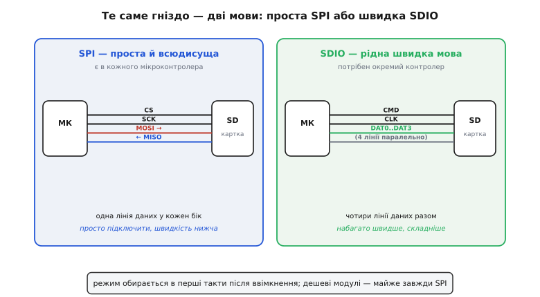
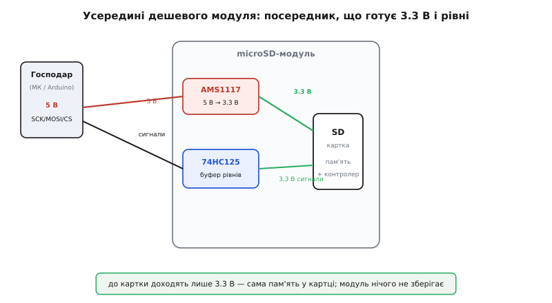

# microSD-модуль

На столі лежить квадратик завбільшки з ніготь — microSD-картка на кілька десятків гігабайтів. Поряд — крихітна платка з гніздом під неї, гребінкою з шести-семи виводів і парою дрібних мікросхем. Це і є **microSD-модуль**: перехідник, що дає мікроконтролеру записувати й читати звичайну картку пам'яті так, ніби в пристрої з'явився повноцінний диск. Логер температури, що пише журнал місяцями; реєстратор польоту дрона; веб-сервер на ESP32, який віддає браузеру сторінки з картинками; камера, що складає кадри у файли, — усе це тримається на такому модулі. Він коштує копійки, паяється за п'ять хвилин і дає пристрою те, чого не дасть внутрішня пам'ять мікроконтролера: **багато місця, знімного й читабельного на комп'ютері**.

Підступність у тому, що за цією простотою ховається чимало дрібниць, на яких новачок спотикається: картка не визначається, файли б'ються, запис гальмує посеред потоку, а ще «п'ятивольтовий» модуль тихо вкорочує життя мікроконтролеру. Розберімо клас цих модулів так, щоб упізнати свій, правильно підключити й не наступити на типові граблі.

### Що це таке і де воно живе

microSD-модуль — це **не пам'ять**. Пам'ять — у самій картці; на картці є власний контролер, який і робить усю чорну роботу зі спалахами кремнію. Модуль — лише **посередник між картковим гніздом і вашою платою**: він дає механічне гніздо (часто з пружинним притиском push-push), приводить рівні сигналів до того, що картка очікує, і годує її стабільними 3.3 вольтами. Усе. Жодного «розуму» в модулі немає — він пасивний, як подовжувач.

Це одразу пояснює, чому модулі різних виробників майже не різняться поведінкою, але відчутно різняться **тим, як вони готують живлення й рівні**. Саме ці дві дрібниці — джерело більшості проблем, тож на них ми і зосередимось.

Картка всередині — це повноцінний пристрій зберігання з власним інтерфейсом. Спілкуватися з нею можна двома мовами, і вибір мови визначає половину того, як ви писатимете прошивку.

### Дві мови картки: SPI і SDIO

Будь-яка SD-картка вміє розмовляти у двох режимах, і перемикається на один із них **у перші такти після ввімкнення**, залежно від того, як господар почне розмову.

Перший режим — **SDIO** (повна, «рідна» мова карток): чотири лінії даних паралельно, окрема лінія команд, висока частота. Так картку гонить телефон чи фотоапарат, вичавлюючи десятки й сотні мегабайтів за секунду. Але SDIO вимагає спеціального контролера в мікроконтролері (він є далеко не в кожного) і ліцензійно обтяжений, тож у саморобній електроніці його беруть рідше.

Другий режим — **SPI**: одна лінія туди, одна назад, одна тактова, одна вибору пристрою. Це проста й всюдисуща [послідовна шина](topic:communications/spi-bus), яку має геть кожен мікроконтролер, аж до найдешевшого. Платять за простоту швидкістю: даними керує **одна** лінія замість чотирьох, тож стелю пропускної здатності SPI має нижчу. Зате підключення тривіальне, а бібліотек — море.

> Картка спілкується через [SPI](topic:communications/spi-bus) — послідовну шину з чотирма лініями: MOSI (господар → картка), MISO (картка → господар), SCK (такт від господаря) і CS (вибір пристрою, активний низьким). Господар завжди задає такт; картка ніколи не говорить сама, лише у відповідь. Кілька різних пристроїв можуть ділити три спільні лінії, розрізняючись окремими CS.

Майже всі дешеві microSD-модулі розраховані саме на **SPI-режим** — і саме його ми розбираємо далі як основний. Якщо на вашій платі є SDIO-контролер і потрібна швидкість — гніздо те саме, але розпіновку й бібліотеку берете під SDIO, а не під SPI.


*Зліва — SPI: чотири лінії, одна для даних в кожен бік; просто, повільніше, є в кожного МК. Справа — SDIO: чотири лінії даних паралельно плюс окрема команда, набагато швидше, але потрібен спеціальний контролер. Те саме гніздо вміє обидва режими; який саме — вирішується в перші такти після ввімкнення.*

### Як влаштований типовий модуль

Розберімо найходовіший китайський модуль на шість виводів — той, що лежить у кожному наборі. Окрім гнізда, на ньому майже завжди дві мікросхеми, і вони варті уваги, бо саме від них залежить, виживе ваш мікроконтролер чи ні.

Перша — **лінійний стабілізатор на 3.3 В**, найчастіше AMS1117-3.3. Він бере 5 вольтів із входу `VCC` і робить із них 3.3 В для картки. Це важливо: **сама картка п'ять вольтів не терпить** — тільки 3.3 В. Стабілізатор стоїть саме тому, що модуль продають як «п'ятивольтовий», аби він працював з Arduino Uno.

Друга — **буфер-перетворювач рівнів**, зазвичай 74HC125 (чотири буфери з третім станом). Він мав би приводити логічні рівні господаря до 3.3-вольтових, які очікує картка. Мав би — але як саме він увімкнений, варіюється від партії до партії, і тут криється головна пастка дешевих модулів, до якої ми дійдемо.


*Сигнал господаря заходить на буфер 74HC125, що приводить рівні; живлення 5 В заходить на стабілізатор AMS1117, який робить 3.3 В для картки. До самої картки доходять лише 3.3-вольтові сигнали й 3.3-вольтове живлення. Модуль — пасивний посередник: уся пам'ять і весь «розум» — у самій картці.*

Окрема порода — **модулі «тільки 3.3 В»** без стабілізатора й часто без буфера (наприклад, плати від Adafruit чи SparkFun). Вони простіші й кращі для мікроконтролерів, що й так живляться від 3.3 В (ESP32, STM32, Pico): нема зайвого падіння напруги на стабілізаторі, нема двозначності з буфером. Але такий модуль **не можна** живити п'ятьма вольтами — згорить картка. Перше, що варто зробити з новим модулем, — глянути, який на ньому стабілізатор і чи є він узагалі; це одразу скаже, чим його можна годувати.

### Підключення: чотири сигнали, живлення і земля

Електрично все просто — шість дротів. Чотири сигнали SPI, живлення і земля.

```
Модуль        Мікроконтролер (приклад ESP32)
─────────────────────────────────────────────
VCC    ──────  5V  (модуль зі стабілізатором)
              або 3V3 (модуль «тільки 3.3 В»)
GND    ──────  GND
CS     ──────  GPIO5   (будь-який вільний вивід)
SCK    ──────  GPIO18  (SCK апаратного SPI)
MOSI   ──────  GPIO23  (MOSI)
MISO   ──────  GPIO19  (MISO)
```

Лінію `CS` (іноді підписану `SS`) можна повісити на будь-який вільний вивід — нею ви вмикаєте картку перед розмовою; решта три сигнали зазвичай ідуть на апаратний блок SPI мікроконтролера, бо так найшвидше. Якщо на шині, крім картки, висить ще щось (дисплей, давач), вони ділять `SCK`/`MOSI`/`MISO`, а розрізняються окремими `CS` у кожного.

> 🔧 **Навіщо це.** Лінію `CS` свідомо ведіть на вивід, що при старті мікроконтролера не «плаває» і не затягнутий зовнішнім підтягуванням у бік, який випадково ввімкне картку під час завантаження. Інакше картка може ловити сміття на шині ще до того, як ваш код її ініціалізує, і потім відмовлятися відповідати. Надійний прийом — поставити на `CS` зовнішнє підтягування до 3.3 В резистором ~10 кОм: поки вивід не налаштований, картка певно вимкнена.

Живлення заслуговує окремого слова. Картка під час запису **смикає струм ривками** — короткі сплески можуть сягати сотень міліампер, навіть якщо в спокої вона споживає одиниці. Якщо живлення кволе або до модуля йдуть тонкі довгі дроти, ці ривки просаджують напругу, і картка посеред запису просто відвалюється. Тому **3.3 В до модуля мають бути міцні**, а поряд із гніздом дуже бажаний керамічний конденсатор на 1–10 мкФ, що згладить сплески. Багато дешевих модулів мають лише крихітний конденсатор або не мають його взагалі — це перше, що варто допаяти, якщо картка капризує.

### Як до неї говорять: SPI-ініціалізація

Перш ніж картка почне читати й писати, її треба правильно «розбудити». Послідовність жорстко прописана стандартом, і бібліотеки (`SD.h`, FatFs, ELM-ChaN) роблять це за вас — але знати кроки корисно, бо саме тут ламається половина невдалих підключень.

Спершу картку треба нагодувати **тактами на холостому ходу**: не менш ніж 74 такти `SCK`, поки `CS` тримається високим, аби її внутрішня логіка очунялась після подачі живлення. Лише потім іде перша команда.

```
1. Подати живлення, зачекати ~1 мс на стабілізацію.
2. CS = високий, видати ≥74 такти SCK на холостому (картка прокидається).
3. CMD0  — скинути картку, увести в SPI-режим (CS низький під час команди).
4. CMD8  — спитати робочу напругу (нові картки SDHC/SDXC відповідають).
5. CMD55 + ACMD41 — повторювати, доки картка не звітує «готова».
6. (опційно) CMD59 — увімкнути перевірку CRC на командах.
7. Тепер можна читати/писати блоками по 512 байтів.
```

Ключова дрібниця — **частота такту**. Під час ініціалізації `SCK` має бути **повільним: 100–400 кГц**, бо на старті картка не гарантує роботу на повній швидкості. Бібліотеки спершу ведуть розмову на 400 кГц, а **піднімають частоту лише після того, як картка ініціалізувалася**. Якщо ваш код одразу б'є по картці швидким тактом — вона може й не озватись. Це класична причина «картка не визначається» на довгих чи зашумлених лініях: спробуйте знизити швидкість SPI у налаштуваннях бібліотеки, і часто все оживає.

Після ініціалізації картка читається й пишеться **блоками по 512 байтів** — це її природна одиниця обміну, успадкована ще від жорстких дисків. Файлова система згори вже ріже дані на ці блоки сама.

### Файлова система: чому саме FAT

Сама собою картка — це просто довга стрічка пронумерованих блоків по 512 байтів. Щоб у ній жили названі файли й теки, потрібна **файлова система** — домовленість, де записано, який файл де лежить і які блоки вільні. На SD-картках цією домовленістю майже завжди є **FAT** (*File Allocation Table*) у її різновидах.

> FAT — проста й стара файлова система: на початку картки лежить таблиця, де для кожної грудки-кластера записано, чи вона зайнята й який кластер файлу йде наступним, наче ланцюжок. Її розуміє геть усе — Windows, Linux, macOS, фотоапарати, — тому картку з FAT можна вийняти з пристрою й одразу прочитати на комп'ютері. Глибше — у [файлових системах на Flash](topic:programming/flash-filesystems).

Чому саме FAT, а не щось сучасніше? Бо **картку треба читати на комп'ютері**, а FAT розуміють усі без винятку системи. Це і є головна перевага microSD перед внутрішньою пам'яттю мікроконтролера: вийняв картку, вставив у ноутбук — і ось твій журнал чи знімки, без жодних драйверів.

Різновид FAT прив'язаний до **класу й обсягу** картки, і це не випадковість, а частина самих стандартів SD:

```
Клас       Обсяг          Файлова система за стандартом
──────────────────────────────────────────────────────
SDSC       до 2 ГБ        FAT12 / FAT16
SDHC       4 – 32 ГБ      FAT32
SDXC       понад 32 ГБ    exFAT
```

Звідси випливає дуже практичний наслідок, на якому горять логери. **FAT32 не вміє файлів, більших за 4 ГБ** — рівно один байт менше за 4 гігабайти, і все. Для пристрою, що безперервно пише журнал, це означає: рано чи пізно файл упреться в стелю, і запис обірветься з помилкою. Лік простий — **ріжте журнал на файли** (новий файл щодня чи щогодини, або за досягнення певного розміру), і стеля 4 ГБ вас ніколи не дістане.

З `exFAT` на картках понад 32 ГБ інша морока: багато легких вбудованих бібліотек FatFs за замовчуванням exFAT **не вмикають** (він складніший і подекуди обтяжений ліцензією). Найпростіший вихід — **переформатувати велику картку у FAT32** вручну на комп'ютері (Windows сама цього для >32 ГБ не пропонує, потрібна окрема утиліта чи `mkfs`), і тоді її без проблем читатиме навіть найскромніша бібліотека.

### Граблі, на яких спотикаються всі

Зберімо в одному місці те, на чому губиться найбільше часу. Майже всі проблеми з microSD-модулем — з цього короткого списку.

**Рівні 5 В убивають картку — повільно й непомітно.** Це найпідступніше. Дешевий модуль із буфером 74HC125 **часто не перетворює рівні по-справжньому**: буфер живиться від 5 В і виштовхує на лінії `SCK`/`MOSI`/`CS` повні п'ять вольтів — прямо на 3.3-вольтові входи картки. Картка деякий час це терпить і навіть працює, тому здається, що все гаразд. Але перевищення напруги на її входах **вкорочує їй життя**: вона може відмовити за тиждень-два «без причини».

> 🔧 **Навіщо це.** Якщо ваш мікроконтролер і так на 3.3 В (ESP32, STM32, Pico), **не покладайтесь на буфер дешевого модуля** — або беріть чесний модуль «тільки 3.3 В», або вмикайте дешевий так, щоб сигнали йшли вже 3.3-вольтові (живити його буфер від 3.3 В чи обійти буфер зовсім). Окрема небезпека — поширений міф, ніби «виводи ESP32 п'ятивольтостійкі»: офіційно це **не підтверджено**, і подача 5 В на них так само точить уже сам мікроконтролер. Найбезпечніше правило: між 3.3-вольтовим МК і карткою п'яти вольтів не повинно бути ніде.

**Картка не визначається.** Звичні причини, від найчастішої: погана земля чи кволе живлення (просідає на сплесках запису); занадто висока частота SPI на старті чи довгі дроти (знизьте швидкість); погана механіка гнізда (картка не дотиснута — push-push гнізда інколи не клацають як слід); забутий або «плаваючий» `CS`; картка просто несумісна (трапляються вибагливі екземпляри — спробуйте іншу).

**Запис гальмує або зупиняється посеред потоку.** Зсередини картки час від часу вмикається **збирання сміття й вирівнювання зносу**: контролер картки перетасовує блоки, і на ці десятки-сотні мілісекунд картка стає «зайнята», тримаючи лінію. Якщо ваш потік даних не має запасу — буфер переповнюється, кадри губляться. Лік: пишіть **великими шматками** (блок по 512 байтів і кратно йому, а не по байту), тримайте проміжний буфер у пам'яті, не відкривайте-закривайте файл на кожен запис, і не чекайте від дешевої картки рівномірної швидкості.

**Картка зношується.** Flash-пам'ять має скінченне число перезаписів кожної комірки. Контролер картки розмазує знос (*wear leveling*), але якщо ви **тисячу разів на секунду переписуєте той самий маленький файлик** чи без потреби смикаєте таблицю FAT, ресурс тане. Особливо боляче — раптова втрата живлення посеред запису: може побитися не лише файл, а й сама таблиця FAT, і тоді картка «порожніє» цілком. Для відповідальних логерів тримайте дешеву картку за **витратний матеріал**, а не за вічне сховище, і за можливості закривайте файл (скидайте буфери) частіше, ніж раз на годину.

**Картка вийнята на ходу.** Гарячого виймання SD без підготовки не любить: якщо смикнути картку під час запису, побитий файл — найменше зло. Якщо пристрій дозволяє виймати картку, давайте користувачеві спершу «розмонтувати» її (закрити всі файли), а не сподівайтесь на удачу.

### Варіації: який модуль брати

Зведемо те, чим модулі різняться на практиці, щоб вибір був свідомим.

**За живленням і рівнями** — головний поділ. Модуль **зі стабілізатором і буфером** (вхід 5 В) зручний для 5-вольтових плат типу Arduino Uno, але до 3.3-вольтового мікроконтролера часто несе ту саму пастку з рівнями. Модуль **«тільки 3.3 В»** (без стабілізатора, часто без буфера) — кращий і чистіший варіант для ESP32/STM32/Pico, але його **не можна** годувати п'ятьма вольтами.

**За форматом картки** — повнорозмірне гніздо SD проти microSD; на роботу це не впливає, лише на механіку й розмір плати.

**За інтерфейсом** — SPI (просто, всюди, повільніше) проти SDIO (швидко, потрібен контролер). Деякі модулі (як згаданий від Adafruit) виводять контакти **під обидва режими**: ті самі лінії можна під'єднати або як SPI, або як 4-бітний SDIO — обираєте за тим, що вміє ваша плата й чи потрібна швидкість.

**За дрібницями надійності** — наявність притискного push-push гнізда (зручніше виймати), детектор присутності картки (окремий вивід `CD`, що каже, чи вставлено картку), якість конденсаторів по живленню. На дешевих модулях `CD` часто відсутній або не розведений, а конденсатор — символічний; для серйозного застосування на це варто дивитись.

> 🔧 **Навіщо це.** Практичне правило вибору коротке. Плата на 3.3 В і не треба граничної швидкості — беріть **простий 3.3-вольтовий SPI-модуль** і не думайте про рівні. Потрібна швидкість (відео, швидкий лог) і є SDIO-контролер — беріть **модуль під SDIO**. Лишилися на 5-вольтовому Arduino — дешевий модуль зі стабілізатором підійде, тут рівні 5 В картці й справді приводяться як слід. А найдешевший модуль до 3.3-вольтового МК ставте лише тоді, коли впевнені, що його буфер не жене на картку повні п'ять вольтів, — інакше це повільна диверсія проти власної плати.
