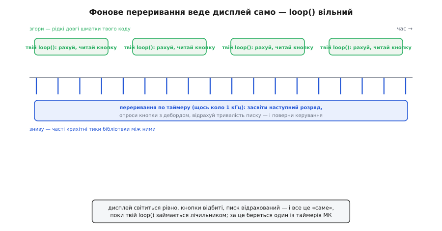
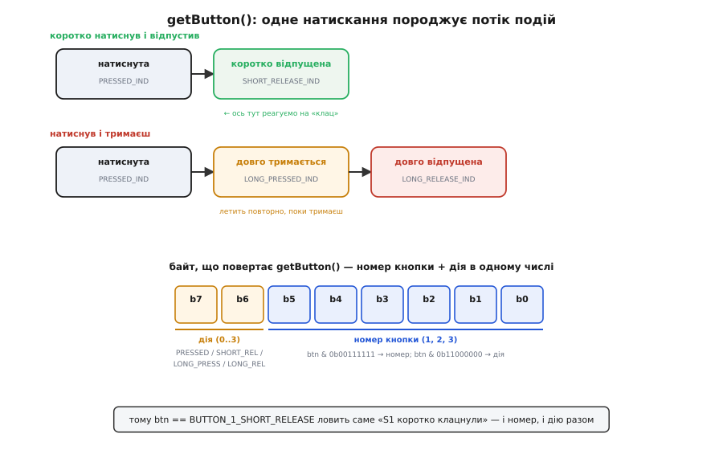

# 📋 Бібліотека MultiFuncShield: виклики, події та пастки

Керувати цим шилдом «в лоб» боляче: дисплей не приймає цифру у вивід — його треба безперервно перебирати по розрядах; кнопка деренчить контактом і дає десяток хибних спрацювань на одне натискання; зумер треба вчасно вимкнути, інакше він гуде. Бібліотека **MultiFuncShield** (автор — Kashif Baig, проєкт *Hackatronics* від Cohesive Computing) прибирає цей клубок цілком: вона забирає собі один апаратний таймер мікроконтролера і в його перериванні сама веде дисплей, сама відбиває кнопки, сама відраховує писк — а тобі лишаються кілька простих викликів.

Тут зібрано її інтерфейс: які виклики писати, *чому* вони саме такі, як влаштовані події кнопок та параметри зумера — і пастки, на яких спотикаються всі. Готовий приклад, що з цих викликів складає завершений прилад, — [лічильник на кнопках](topic:boards/multifunction-shield/proj-multifunction-shield-counter.md), де той самий інтерфейс показано в дії.

## Ідея: віддати рутину перериванню, лишити собі логіку

Уся зручність тримається на одному рішенні. Показ мультиплексованого дисплея, опитування кнопок і відлік звуку — це робота, яку **треба робити рівномірно й часто**, десь коло тисячі разів на секунду, інакше цифри мерехтять, а натискання губляться. Але робити її в головному циклі не можна: варто твоєму коду на мить задуматися (порахувати, почекати, почитати давач) — і дисплей смикнеться, бо перебір розрядів спіткнувся.

Вихід — [переривання по таймеру](topic:programming/interrupts). Мікроконтролер має вбудовані лічильники, які цокають від тактової частоти незалежно від того, що виконує основна програма. Коли лічильник добігає заданого числа, залізо **перериває** головний код, стрибає у крихітну функцію-обробник (англ. *ISR — interrupt service routine*), та повертається назад — і так тисячу разів на секунду, рівно й невблаганно. Бібліотека вішає на такий таймер свій обробник, і саме він засвічує наступний розряд, зчитує кнопки, зменшує лічильники писку.


*Згори — рідкі довгі шматки твого `loop()`: він рахує, читає кнопку, чекає. Знизу — часті крихітні тики бібліотечного переривання між ними: кожен засвічує один розряд дисплея, опитує кнопки з відбиванням, відраховує тривалість писку — і миттю повертає керування. Тому дисплей світиться рівно й кнопки не губляться, хоч головний цикл про них зовсім не дбає.*

> 🔧 **Навіщо це.** Це головна причина взяти бібліотеку, а не писати перебір руками. Розділивши «часту рутину» (переривання) і «рідку логіку» (`loop()`), ти дістаєш дисплей, що світиться сам, і кнопки, що читаються самі, — а свій код пишеш так, ніби число просто «є на дисплеї». Уся складність мультиплексування та відбивання зникає з очей, лишаючись справно працювати під сподом.

Наслідок цього рішення практичний і його треба знати заздалегідь: **бібліотека займає один із апаратних таймерів**, і цей таймер уже не твій. На класичному Arduino UNO (мікроконтролер ATmega328P) таймерів рівно три — Timer0, Timer1, Timer2, — і кожен, окрім лічби, обслуговує якусь стандартну функцію. Про те, який саме зайнятий і чим це загрожує, — наприкінці, у пастках; поки досить пам'ятати, що один таймер плата забирає собі.

## Встановлення й перший запуск

Бібліотека ставиться як звичайний Arduino-архів. У середовищі Arduino IDE це **Sketch → Include Library → Add .ZIP Library…**, і вказуєш завантажений `MultiFuncShield-Library.zip`; або через менеджер бібліотек, якщо твоя збірка його бачить. Після встановлення з'являється рядок підключення, з якого починається будь-який скетч під цей шилд:

```c
#include <MultiFuncShield.h>
```

Одного цього рядка достатньо: бібліотека сама знає виводи шилда (латч на D4, такт на D7, дані на D8, світлодіоди D13–D10, зумер D3, кнопки на A1–A3, потенціометр на A0) і сама налаштує їх. Тобі не треба ні задавати напрям виводів (в Arduino це `pinMode`), ні складати таблицю сегментів — усе вшито всередині під стандартну розводку плати.

Далі бібліотеку **вмикають** одним викликом — там, де середовище тримає початкове налаштування, ще до головного циклу. Сам шилд — звичайне залізо (зсувний регістр, кнопки на виводах, зумер), тож будь-який контролер веде його однаково: налаштувати виводи й запустити періодичний тик таймера. На Arduino це робить за тебе бібліотека; на іншому контролері той самий тик заводиш сам:

:::tabs
```arduino
void setup() {
  Serial.begin(9600);      // якщо потрібен монітор порту
  MFS.initialize();        // запустити фонове переривання й налаштувати виводи
}
```
```esp-idf
// ESP-IDF: виводи шилда — на вихід, а тик 1 кГц веде дисплей, кнопки й писк
#include "driver/gpio.h"
#include "esp_timer.h"

static void shield_tick(void *arg);   // один розряд, опитування кнопок, відлік писку

void app_main(void) {
    gpio_config_t io = {
        .pin_bit_mask = (1ULL << PIN_LATCH) | (1ULL << PIN_CLK) | (1ULL << PIN_DATA),
        .mode         = GPIO_MODE_OUTPUT,
    };
    ESP_ERROR_CHECK(gpio_config(&io));

    const esp_timer_create_args_t args = { .callback = shield_tick, .name = "mfs" };
    esp_timer_handle_t tim;
    ESP_ERROR_CHECK(esp_timer_create(&args, &tim));
    ESP_ERROR_CHECK(esp_timer_start_periodic(tim, 1000));   // кожні 1000 мкс = 1 кГц
    // з цієї миті дисплей ведеться сам — далі в коді лише логіка
}
```
```stm32
// STM32 HAL: та сама рутина — у перериванні апаратного таймера, зведеного на 1 кГц
extern TIM_HandleTypeDef htim6;

void shield_tick(void);               // один розряд, опитування кнопок, відлік писку

int main(void) {
  HAL_Init();
  SystemClock_Config();
  MX_GPIO_Init();                     // латч/такт/дані — виходи, кнопки — входи з підтяжкою
  MX_TIM6_Init();                     // прескалер і період дають 1 кГц
  HAL_TIM_Base_Start_IT(&htim6);      // з цієї миті дисплей ведеться сам

  while (1) { /* тут лише логіка */ }
}

void HAL_TIM_PeriodElapsedCallback(TIM_HandleTypeDef *htim) {
  if (htim->Instance == TIM6) shield_tick();
}
```
:::

`MFS` — це вже готовий об'єкт бібліотеки (він оголошений усередині, окремо створювати не треба). Виклик `MFS.initialize()` робить дві речі: налаштовує всі виводи шилда й **запускає той самий фоновий таймер**. З цієї миті дисплей уже живий — просто поки що порожній, — а кнопки вже опитуються. Уся решта коду лише каже бібліотеці, *що* показати й *що* робити з натисканнями.

> Історична дрібниця про сумісність: у старих версіях бібліотеки таймером керувала окрема бібліотека `TimerOne`, і `initialize()` приймала на неї вказівник — писали `MFS.initialize(&Timer1)`. Новіші версії носять роботу з таймером усередині себе, і виклик спростився до `MFS.initialize()` без аргументів. Якщо натрапиш на старий приклад із `&Timer1` — це саме та причина; під сучасну бібліотеку аргумент прибирають.

## Показати число: MFS.write()

Найприємніше після ручного перебору розрядів — що показ числа тепер **одна дія**. Хочеш побачити 1234 на дисплеї — пишеш:

```c
MFS.write(1234);
```

І все. Бібліотека сама розкладе число на розряди, підбере байти сегментів зі своєї таблиці, і фоновий таймер почне перебирати цифри. Ти не думаєш ні про мультиплексування, ні про те, що дисплей спільного аноду й байти «навиворіт», — це вже вшито. `write` перевантажений на кілька типів, і кожен корисний:

```c
MFS.write(-273);          // ціле; мінус теж покаже, якщо влазить
MFS.write("HI");          // короткий рядок із літер, які дисплей уміє
MFS.write(3.14, 2);       // дробове: другий аргумент — скільки знаків по комі
```

Рядковий варіант дає прості слова-підказки: `"On"`, `"OFF"`, `"End"`, `"donE"`, `"PLAY"` — семисегментний індикатор складе з паличок упізнавані літери (не всі — літери на кшталт `k`, `m`, `w` на сімох сегментах не збираються). Дробовий варіант сам засвітить десяткову кому у потрібному розряді: `MFS.write(3.14, 2)` покаже `3.14`, а `MFS.write(25.6, 1)` — `25.6`. Зверни увагу: десяткова кома — це той восьмий сегмент `dp`, і бібліотека сама вмикає його в правильній цифрі, чого руками довелося б стежити окремо.

Показане число **тримається саме**, поки ти не викличеш `write` знову. Це важливо для лічильника: щоб оновити дисплей, досить одного `MFS.write(counter)` після кожної зміни — не треба нічого крутити в циклі, фоновий таймер уже безперервно висвічує останнє задане.

> 🔧 **Навіщо це.** Порівняй із ручним кодом із базової статті: там показ однієї цифри — це «прибрати латч, заштовхати два байти, клацнути латчем», а показ числа — безперервний перебір усіх розрядів у `loop()`. Тут те саме — `MFS.write(число)`, і забув. Уся ця економія й є те, за що бібліотеку варто мати під рукою, коли принцип мультиплексування ти вже розумієш.

## Прочитати кнопки: getButton() і потік подій

Ось де бібліотека найрозумніша й де новачки найбільше плутаються. Наївно кнопку читають як «натиснута / не натиснута». Але механічна кнопка **деренчить** (англ. *bounce*): у мить натискання й відпускання контакт кілька мілісекунд стрибає між замкнутим і розімкнутим, і простий `digitalRead` наловить із одного натискання цілу чергу хибних. Тому бібліотека не віддає сирий стан виводу — вона віддає **події** вже відбитих кнопок.

Читаєш їх однією функцією:

```c
byte btn = MFS.getButton();
```

`getButton()` повертає **одну подію з внутрішньої черги** й прибирає її звідти; якщо подій нема — повертає 0. Кожна подія — це один байт, у якому спаковано *дві* речі: **яку** кнопку зачепили (1, 2 чи 3) і **що саме** з нею сталося. А сталося може одне з чотирьох, і в цьому вся тонкість.


*Коротко натиснув і відпустив — приходять дві події: «натиснута» (`PRESSED_IND`) і слідом «коротко відпущена» (`SHORT_RELEASE_IND`), і саме на другій зазвичай реагують на «клац». Натиснув і тримаєш — після «натиснута» летить «довго тримається» (`LONG_PRESSED_IND`), повторно, поки не відпустиш, а тоді «довго відпущена» (`LONG_RELEASE_IND`). Байт події: старші два біти — дія (0..3), молодші шість — номер кнопки; тому одна константа `BUTTON_1_SHORT_RELEASE` ловить і кнопку, і дію разом.*

Чотири дії позначені так (це чотири стани, у яких бібліотека може застати кнопку):

```
Константа-дія (старші біти байта)   Коли приходить
──────────────────────────────────────────────────────────────
BUTTON_PRESSED_IND       (0 << 6)   щойно кнопку притиснули
BUTTON_SHORT_RELEASE_IND (1 << 6)   відпустили після короткого натиску
BUTTON_LONG_PRESSED_IND  (2 << 6)   тримають довго (летить повторно)
BUTTON_LONG_RELEASE_IND  (3 << 6)   відпустили після довгого утримання
```

А щоб не морочитися з бітами вручну, бібліотека вже склеїла номер кнопки з дією в готові константи. Для першої кнопки:

```
BUTTON_1_PRESSED        BUTTON_1_SHORT_RELEASE
BUTTON_1_LONG_PRESSED   BUTTON_1_LONG_RELEASE
```

і так само `BUTTON_2_*`, `BUTTON_3_*`. Тому в коді ти зазвичай просто порівнюєш повернутий байт із потрібною константою. Схема ця всюди одна: відбивання живе в тику таймера, а головний цикл лише забирає з черги готову подію:

:::tabs
```arduino
byte btn = MFS.getButton();
if (btn == BUTTON_1_SHORT_RELEASE) {
  // S1 коротко клацнули — робимо дію
}
```
```esp-idf
// ESP-IDF: тик відбиває контакт і кладе готову подію в чергу FreeRTOS
static QueueHandle_t btn_q;          // btn_q = xQueueCreate(8, sizeof(uint8_t));

uint8_t ev;
if (xQueueReceive(btn_q, &ev, 0) == pdTRUE) {   // 0 тиків очікування — як getButton()
    if (ev == BTN_1_SHORT_RELEASE) {
        ESP_LOGI(TAG, "S1 коротко клацнули");   // ... робимо дію
    }
}
```
```stm32
// STM32 HAL: кнопку опитує той самий тик таймера, у головний цикл іде вже подія
void shield_tick(void) {                       // 1 кГц
  static uint8_t stable, cnt;
  uint8_t now = (HAL_GPIO_ReadPin(BTN1_GPIO_Port, BTN1_Pin) == GPIO_PIN_RESET);
  if (now == stable) cnt = 0;                  // без змін — лічильник спокою обнуляється
  else if (++cnt >= 20) {                      // 20 однакових тиків = 20 мс без деренчання
    stable = now; cnt = 0;
    btn_push(now ? BTN_1_PRESSED : BTN_1_SHORT_RELEASE);
  }
}

uint8_t ev = btn_pop();                        // 0, якщо черга порожня — як getButton()
if (ev == BTN_1_SHORT_RELEASE) { /* ... робимо дію */ }
```
:::

Чому реагувати найчастіше на `SHORT_RELEASE`, а не на `PRESSED`? Бо клацання, яке спрацьовує **на відпусканні**, дає людині шанс передумати: притиснув, побачив, забрав палець — нічого не сталося. Це звична поведінка кнопок скрізь. А `PRESSED` беруть, коли треба миттєвий відгук (наприклад, почати щось, поки тримають). `LONG_PRESSED` зручний для «швидкого перемотування»: тримаєш — і число біжить само; `LONG_RELEASE` — для дій «утримати три секунди, щоб скинути», щоб випадковим тиком не зачепити.

Спакованість у байт має ще один зручний бік — можна розібрати номер і дію окремо, коли обробник спільний для всіх трьох кнопок:

```c
byte number = btn & 0b00111111;   // молодші шість біт → 1, 2 або 3
byte action = btn & 0b11000000;   // старші два біт → яка з чотирьох дій
```

Але для лічильника простіше й читабельніше зіставляти з готовими `BUTTON_n_*`, тож саме так і напишемо повний скетч.

## Зумер: beep()

Звук на цьому шилді теж відданий фоновому перериванню, і це знову зручність. Наївно «пікнути» можна було б блокуючим тоном середовища (в Arduino це `tone(3, ...)`), але тоді твій код мусив би сам чекати й вимикати звук. Бібліотека натомість дає **неблокуючий** писк: ти кажеш «пікни отак», і фоновий таймер сам відрахує тривалість і вимкне зумер, поки твій код біжить далі.

Найпростіший короткий писк:

```c
MFS.beep();     // короткий тик десь на 20 мс — і замовк сам
```

Повна форма дозволяє описати цілий візерунок звуку — скільки пищати, скільки мовчати, скільки разів повторити:

```c
void beep(unsigned int onPeriod  = 20,   // скільки мілісекунд гудіти
          unsigned int offPeriod = 0,    // скільки мовчати між писками
          byte cycles            = 1,    // скільки писк-пауза в одному наборі
          unsigned int loopCycles = 1,   // скільки разів повторити весь набір
          unsigned int loopDelayPeriod = 0); // пауза між наборами
```

Наприклад, тривожний дубль-сигнал «пі-пі, пауза, пі-пі»:

```c
MFS.beep(50, 50, 2, 3, 20);
// гуди 50 мс, мовчи 50 мс — це один цикл; таких циклів 2 у наборі;
// набір повторити 3 рази; між наборами пауза 20 (одиниці — десятки мс)
```

Важливо, що всі ці числа лише **закладаються** у чергу, а сам писк веде переривання. Тож `MFS.beep(...)` повертається миттєво — твій головний цикл не завмирає на час звуку. Для лічильника цього більш ніж досить: на кожне натискання даємо один короткий `MFS.beep()`, і інтерфейс одразу відчувається живим.

> Зумер сидить на виводі D3 через транзистор, а D3 — це вивід із [широтно-імпульсним виходом](topic:programming/pwm-on-mcu). Бібліотека, щоправда, тут не грає тоном різної висоти — вона просто вмикає й вимикає зумер у своєму перериванні, відраховуючи мілісекунди; висота звуку виходить фіксована, від резонансу самої п'єзо-пластини. Якщо треба саме мелодія з різними нотами, це вже не через `beep()` бібліотеки, а окремо — і тут доводиться зважати, що потрібний для нот таймер може бути вже зайнятий (див. пастки).

## Світлодіоди

Чотири світлодіоди на D13–D10 бібліотека теж бере на себе, ховаючи їхню перевернуту логіку (світяться від `LOW`). Керуєш ними за номерами-масками:

```c
MFS.writeLeds(LED_1, ON);          // засвітити перший
MFS.writeLeds(LED_1 | LED_3, ON);  // перший і третій разом
MFS.writeLeds(LED_ALL, OFF);       // погасити всі
MFS.blinkLeds(LED_4, ON);          // четвертий блимає сам (фоново)
```

Константи `LED_1..LED_4` — це біти (1, 2, 4, 8), тож їх складають через `|`, щоб задати кілька за раз; `LED_ALL` — усі чотири. `ON`/`OFF` тут читаються природно, попри те, що «під сподом» увімкнення — це `LOW`: бібліотека інвертує сама. Це саме той клас помилок («написав HIGH — світлодіод погас»), який шилд і бібліотека прибирають. У лічильнику світлодіоди зручно лишити індикатором: скажімо, засвічувати `LED_1`, поки число від'ємне.

## Складність і пастки

Плата навчальна, але саме на ній зібралися підступності, кожна з яких здатна зіпсувати перший запуск. Ось вони — з симптомом і рятунком.

**Пастка перша: конфлікт D0/D1 із заливкою прошивки.** Роз'єм UART шилда виведений на D0/D1 — а це той самий апаратний послідовний порт, яким Arduino UNO спілкується з комп'ютером через USB під час завантаження скетча. Якщо в цей роз'єм увіткнуто модуль (Bluetooth HC-05, радіо тощо), він **говорить у ті самі дроти**, і заливка може зірватися: середовище пише щось на кшталт `avrdude: stk500_getsync(): not in sync`. Рятунок простий: **від'єднуй модуль із D0/D1 на час прошивання**, і встромляй назад після. З тієї ж причини не варто самому чіпати D0/D1 у своєму коді, поки потрібен монітор порту — `Serial` живе на них.

**Пастка друга, найпідступніша: тип дисплея — спільний анод проти спільного катоду.** Переважна більшість шилдів іде зі **спільним анодом**, і саме під нього наведена вшита таблиця сегментів: у ній сегмент світиться, коли на його лінію подано `0`. Байти цифр 0–9 у бібліотеці такі (масив `SEGMENT_MAP_DIGIT`), а вибір розряду — `SEGMENT_SELECT`:

```c
SEGMENT_MAP_DIGIT[] = { 0xC0, 0xF9, 0xA4, 0xB0, 0x99,
                        0x92, 0x82, 0xF8, 0x80, 0x90 };   // цифри 0..9
SEGMENT_SELECT[]    = { 0xF1, 0xF2, 0xF4, 0xF8 };         // вибір розряду 1..4
```

Але трапляються клони зі **спільним катодом** (наприклад, із дисплеєм HS420361K-A32): там сегмент світиться від `1`, а не від `0`. Симптом ні з чим не сплутати — на дисплеї висвічується **негатив** цифр: горить усе, що мало б бути темним, і навпаки. Рятунок: **інвертувати обидві таблиці**, бо активний рівень перевернувся. Інверсія байта — це побітове «не» (XOR з `0xFF`):

```
// зі спільного аноду → спільний катод: інвертувати кожен байт
0xFF ^ 0xC0 = 0x3F    // так «0» стає з-під катоду
```

На практиці правлять самі масиви `SEGMENT_MAP_DIGIT` і `SEGMENT_SELECT` у сирцях бібліотеки (пройтися по кожному елементу через `^ 0xFF`), або беруть форк бібліотеки з готовим перемикачем типу дисплея. Головне — **розпізнати причину**: якщо стандартний приклад показує нісенітницю-негатив, першим ділом підозрюй інший тип дисплея, а не свій код.

**Пастка третя: дебаунс — не викидай його наосліп.** Спокуса читати вивід кнопки самому, без відбивання (в Arduino це `analogRead(A1)`, бо A1–A3 — аналогові виводи), веде просто в деренчання: одне натискання дасть чергу спрацювань. Уся суть `getButton()` у тім, що бібліотека **вже відбила** контакт у своєму перериванні й видає чисті події. Тому в межах бібліотеки дебаунсу тобі писати не треба — але й **не змішуй** власне читання того самого виводу з `getButton()` на тій самій кнопці: бібліотека опитує ці виводи у фоні, і два читачі одного контакту дадуть плутанину. Користуйся або її подіями (майже завжди), або своїм читанням — але одним із двох.

**Пастка четверта: таймер зайнятий — це впирається у звук нотами й у чужі бібліотеки.** Плата забирає собі апаратний таймер під фонове переривання, і цей таймер уже не вільний. Наслідки конкретні. Стандартна функція `tone()` на UNO користується Timer2 — і якщо бібліотека шилда сидить на тому ж ресурсі, спроба грати мелодію через `tone()` або свариться, або збиває дисплей. Так само чужа бібліотека, що чекає «свій» таймер (керування сервоприводом, власний ШІМ на певних виводах, точні відліки), може зіткнутися з бібліотекою шилда за той самий лічильник. Рятунок — планувати заздалегідь: для звуку різної висоти або береш зумерний писк самої бібліотеки (фіксована висота, зате без конфлікту), або свідомо звільняєш під `tone()` потрібний таймер, відмовившись від фонового звуку шилда. А зовнішню периферію, якій потрібен точний таймер, чіпляєш так, щоб вона не претендувала на вже зайнятий бібліотекою.

**Дрібніша пастка: зайняті виводи.** Шилд забирає D3, D4, D7, D8, D10–D13, A0–A3. Вільними лишаються небагато — D2, D5, D6, D9, A4, A5, — і саме з них виходь, плануючи щось своє поверх. A4/A5 — це шина I²C, тож зовнішній давач чи годинник реального часу з I²C-інтерфейсом чіпляють туди, не сваритися з шилдом (пам'ятай лише, що A4 бібліотека тримає ще й під гніздо давача температури — якщо він розпаяний).

Готовий приклад, де ці виклики зібрані в завершений прилад разом із версією без бібліотеки, — [лічильник на кнопках](topic:boards/multifunction-shield/proj-multifunction-shield-counter.md).
