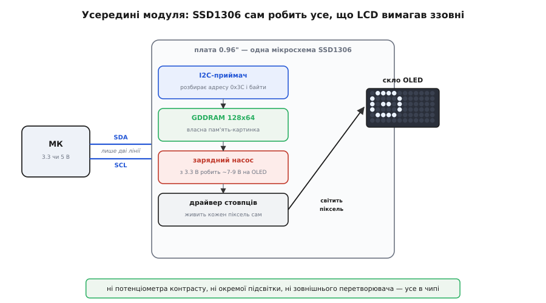
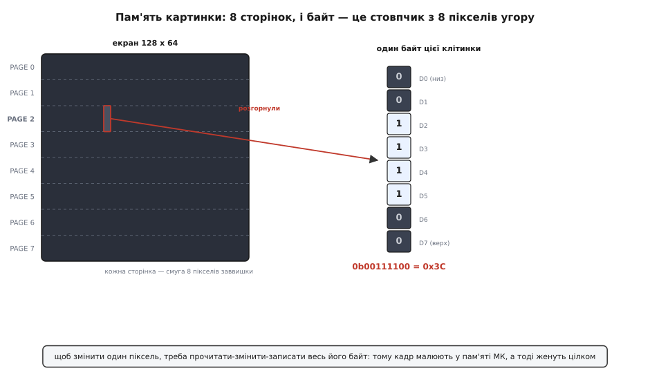
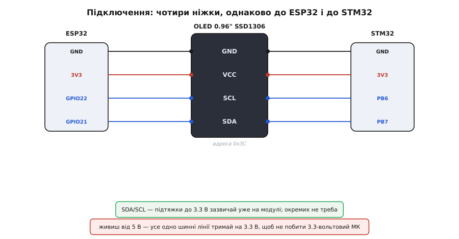

# OLED-дисплей 0.96″ SSD1306 (I2C, 128×64)

<preknowlist>
- [Шина I2C](book:communications/i2c-bus) — дві лінії SDA/SCL, ведучий і ведений, адреса пристрою: саме так МК шле дисплею байти двома дротами.
- [Адресація I2C](book:communications/i2c-addressing) — 7-бітна адреса пристрою; тут вона майже завжди 0x3C, і треба розуміти, звідки береться варіант 0x3D.
- [Логічні рівні як діапазони](book:electronics/logic-levels-as-ranges) — що таке 3.3-вольтова й 5-вольтова логіка й чому шину не можна живити наосліп.
- [Кадровий буфер](book:electronics/framebuffer) — картинка як масив байтів у пам'яті, який цілком женуть на екран: точнісінько так працює цей дисплей.
- [Зарядний насос](book:electronics/charge-pump) — як із кількох вольтів зробити більше самими конденсаторами; без нього OLED усередині не засвітився б.
</preknowlist>

Це той крихітний яскравий екранчик, який ви бачили в half саморобок і готових гаджетів: чорна скляна плитка з палець завбільшки, на якій світяться білі (або сині, або жовті) написи й значки, чіткі навіть збоку й у темряві. **Модуль 0.96″ на контролері SSD1306** — монохромний графічний OLED-дисплей роздільністю **128×64 пікселі**, який під'єднується до мікроконтролера **двома сигнальними дротами** по [шині I2C](book:communications/i2c-bus). На відміну від символьного LCD, він не прив'язаний до сітки клітинок із літерами: кожен із 8192 пікселів вмикається окремо, тож на ньому можна намалювати що завгодно — шрифт будь-якого розміру, іконки, смужки-індикатори, графік, рамку меню.

Саме через це він став типовим **графічним HUD** (англ. *Head-Up Display* — індикатор, що показує стан, не відриваючи від справи) для дрібних приладів: на ньому зручно вивести, у якому стані зараз скінченний автомат пристрою, показати покази давача великою цифрою, накреслити рядок меню з рухомим курсором. І все це — ціною двох ніжок мікроконтролера й майже без зовнішньої обв'язки, бо всю чорну роботу бере на себе одна мікросхема на самій платі. Розберімо цей модуль так, щоб упізнати його серед інших, підключити з першого разу — однаково до ESP32 чи STM32 — і розуміти, що діється, коли він не оживає.

## Чому OLED, а не той самий LCD

Щоб оцінити цей модуль, треба побачити, від чого він звільняє. Звичний символьний [LCD 1602](book:boards/lcd-1602) — рідкі кристали: вони самі не світяться, а лише перекривають або пропускають чуже світло. Через це в нього ззаду мусить бути **підсвітка** зі своїм струмом, а спереду — **напруга контрасту** з окремого потенціометра, яку ще й доводиться ловити викруткою. Плюс десяток ніжок паралельної шини. Три різні клопоти — і всі зовнішні.

**OLED** (англ. *Organic Light-Emitting Diode* — органічний світлодіод) працює навпаки: кожен піксель — це мікроскопічний світлодіод, що **світиться сам**, коли крізь нього пускають струм. Немає підсвітки, бо світиться сам піксель. Немає напруги контрасту, бо піксель або горить на повну, або згашений дочорна — звідси й глибокий чорний фон і чіткість під будь-яким кутом. Не світиться жоден піксель — екран не споживає майже нічого; тому напис із кількох цифр на OLED коштує менше струму, ніж підсвічений LCD, що світить усім тлом однаково.

> 🔧 **Навіщо це.** Для приладу на батарейці це вирішальна різниця. LCD світить підсвіткою весь час, поки ви хочете щось бачити, — байдуже, показує він рядок тексту чи порожнечу. OLED платить струмом лише за ті пікселі, що горять: темний екран із кількома світлими цифрами — це буквально кілька світлодіодів. Тому інтерфейс на OLED варто малювати «світле по чорному», а не навпаки: чорне тло безкоштовне, а кожен зайвий світлий піксель — це струм.

Плата за це є, і про неї чесно: органіка **вигоряє**. Пікселі, що світяться найдовше й найяскравіше, з роками тьмяніють — на дешевих модулях це помітно вже за тисячі годин статичної картинки (звідси й «привид» вигорілого напису). Для HUD, що більшість часу темний і лише інколи показує змінні цифри, це не проблема; для екрана, що цілодобово світить те саме, — уже так.

## Що це насправді таке: один чип робить усе

Уся плата 0.96″ — це **скло з OLED-матрицею плюс одна мікросхема-контролер**, майже завжди **SSD1306** від Solomon Systech. І саме ця мікросхема — причина, чому модуль такий невибагливий: вона поєднує в собі те, що на LCD було розкидано по зовнішніх деталях. Це узагальнена ідея [контролера дисплея](book:electronics/display-controller) — чипа з власною пам'яттю-картинкою, якому шлють дані, а не керують пікселями напряму, — доведена тут майже до межі самодостатності. Історію того, як цей конкретний контролер став світовим стандартом дешевих OLED, винесено окремо в [народження SSD1306](book:boards/oled-ssd1306/hist-ssd1306.md).

Усередині SSD1306 варто розрізняти три шматки, бо саме через них модуль працює двома дротами й без обв'язки.

**Приймач I2C.** Дисплей — це ведений (*slave*) на [шині I2C](book:communications/i2c-bus) з фіксованою адресою **0x3C**. Мікроконтролер шле йому байти двома лініями — SDA (дані) і SCL (такт), — а контролер сам розбирає, де адреса, де команда, а де піксельні дані. Жодних окремих ліній «команда/дані» чи стробів, як на паралельному LCD: усе згорнуто в потік по двох дротах.

**GDDRAM — власна пам'ять-картинка.** Усередині чипа є **128×64 біти** відеопам'яті (*Graphic Display Data RAM*), по біту на піксель. Це і є [кадровий буфер](book:electronics/framebuffer): що записано в цій пам'яті — те й горить на склі. Контролер сам, безперервно й без участі МК, вичитує цю пам'ять і підсвічує відповідні пікселі. Мікроконтролер лише **оновлює вміст пам'яті**, коли треба щось змінити, — а показ іде сам собою.

**Зарядний насос.** Ось найтонше місце. Органічний світлодіод, щоб засвітитися, потребує помітно більшої напруги, ніж 3.3 чи 5 В логіки, — десь **7–9 В**. Класичний OLED-драйвер вимагав би для цього окремого підвищувального перетворювача на платі. SSD1306 же має вбудований [зарядний насос](book:electronics/charge-pump) — схему, що самими конденсаторами «накачує» потрібну високу напругу з наявних кількох вольтів. Тому на платі 0.96″ немає ні котушки, ні зовнішнього перетворювача: чип робить високу напругу сам. Саме вбудований насос свого часу й зробив цей клас дисплеїв дешевим і крихітним.


*Мікроконтролер шле байти лише двома лініями (SDA/SCL). Усередині SSD1306: приймач I2C розбирає адресу 0x3C і дані; GDDRAM тримає картинку 128×64; зарядний насос піднімає 3.3 В до 7–9 В, потрібних органічному світлодіоду; драйвер стовпців сам живить кожен піксель. Зовні — ні потенціометра контрасту, ні окремої підсвітки, ні перетворювача.*

> 🔧 **Навіщо це.** Практичний наслідок: зарядний насос треба **явно ввімкнути командою** в ініціалізації (`0x8D, 0x14`), інакше дисплей відповідає по I2C, приймає всі дані, але **екран лишається чорним** — насос вимкнено, високої напруги немає, світитися нічому. Це класична пастка з голим SSD1306: код начебто правильний, зв'язок є, а екран мертвий. Готові бібліотеки вмикають насос за вас; але якщо пишете ініціалізацію руками — це той рядок, який забувають і півдня шукають.

## Пам'ять картинки: чому байт — це вертикальний стовпчик

Тут ховається єдина по-справжньому неочевидна річ у цьому дисплеї, і не зрозумівши її, легко наламати дров при малюванні напряму. Здавалося б, 128×64 пікселі — просто прямокутник; але **як вони розкладені по байтах** пам'яті, зовсім не «зліва направо, рядок за рядком».

GDDRAM поділена на **8 горизонтальних смуг** — їх звуть **сторінками** (*page*), PAGE0…PAGE7. Кожна сторінка — смуга заввишки рівно **8 пікселів** і завширшки на всі 128 стовпців. Один **байт** у пам'яті — це один стовпчик усередині сторінки: його вісім бітів лягають **вертикально**, знизу вгору. Молодший біт (D0) — верхній піксель стовпчика, старший (D7) — нижній (напрям залежить від налаштування, але суть та сама). Тобто записавши один байт, ви керуєте не вісьмома сусідніми пікселями в рядку, а **вісьмома пікселями в стовпчик**.


*Екран 128×64 у пам'яті — це 8 сторінок по 8 пікселів заввишки. Один байт відповідає стовпчику 8×1: біти лягають угору, кожен вмикає свій піксель. Тому «запалити один піксель» неможливо, не чіпаючи семи його сусідів по вертикалі — треба переписати весь байт.*

Наслідок із цього — головний, і саме він визначає, як із дисплеєм працюють у коді. Щоб змінити **один** піксель, треба взяти байт, у якому він живе, змінити в ньому потрібний біт і записати байт назад. А позаяк читати назад із дисплея по I2C незручно, роблять простіше й надійніше: **тримають повну копію картинки (1024 байти) у пам'яті мікроконтролера**, малюють усе там — точки, лінії, текст, — а тоді **виштовхують увесь буфер** на дисплей однією пачкою. Тисяча байтів на кадр — дрібниця; зате малювання стає звичайною роботою з масивом у пам'яті МК, а не морочливим «прочитати-змінити-записати» по шині.

> 🔧 **Навіщо це.** Ось чому будь-яка бібліотека для цього дисплея (Adafruit_SSD1306, U8g2) має буфер у RAM і окремий виклик на кшталт `display()` чи `sendBuffer()`. Ви малюєте у буфер — на екрані **нічого не змінюється**, доки не покличете цей виклик. Забули його — картинка «застигла», і новачок думає, що дисплей завис. Правило просте: намалював усе, що хотів у цьому кадрі, — один раз штовхнув буфер. Ті 1024 байти, до речі, — це чому дисплей не тягне на зовсім крихітних чипах із сотнями байтів RAM: повний кадровий буфер має куди поміститися.

## Ніжки й підключення: чотири дроти, однаково на ESP32 і STM32

На торці плати — гребінка всього на **чотири контакти**, і в цьому вся зручність. Порядок буває двох варіантів (стежте за підписами на самій платі!), але набір завжди той самий:

```
Пін   Назва   Призначення
──────────────────────────────────────────────
 1    GND     земля
 2    VCC     живлення (працює і від 3.3 В, і від 5 В)
 3    SCL     такт I2C
 4    SDA     дані I2C
```

Оскільки це просто пристрій на [шині I2C](book:communications/i2c-bus), підключення **не залежить від сімейства мікроконтролера** — воно однакове скрізь, де є I2C. Змінюються лише назви конкретних ніжок. На ESP32 апаратний I2C типово виводять на GPIO21 (SDA) і GPIO22 (SCL); на STM32 (родина F0/F1/F4) один із блоків I2C1 сидить на PB6 (SCL) і PB7 (SDA). У решті — та сама четвірка дротів.


*Чотири ніжки модуля (GND, VCC, SCL, SDA) під'єднуються до будь-якого МК з I2C однаково — змінюються лише імена виводів. Ліворуч ESP32 (GPIO21/22), праворуч STM32 (PB7/PB6). Підтяжки SDA/SCL до 3.3 В зазвичай уже стоять на модулі. Живлення терпить і 3.3, і 5 В, але шинні рівні тримають на 3.3 В.*

Кілька зауваг, що рятують час.

**Живлення терпить 3.3 і 5 В — а от шина ні.** VCC модуля зазвичай має власний стабілізатор або принаймні розрахований на 3.3–5 В, тож живити його можна від будь-якого з двох. Але **лінії SDA/SCL — це логіка, і їхній рівень задає той бік, що тягне шину вгору**. Якщо ви живите модуль від 5 В, а мікроконтролер у вас 3.3-вольтовий (ESP32, STM32, RP2040), підтяжки на модулі можуть підняти шину до 5 В і **побити входи МК**. Найбезпечніше на 3.3-вольтовій платі — живити модуль теж від **3.3 В**: тоді й шина сама собою 3.3-вольтова, узгодження не потрібне. Плутанина «живив від 5 В, а МК 3.3-вольтовий» — головна апаратна причина дивної поведінки або тихої смерті ніжки.

**Підтяжки вже є.** Шина I2C потребує двох резисторів-підтяжок (*pull-up*), що тримають лінії у високому стані. На переважній більшості 0.96″-модулів вони вже впаяні (типово 4.7–10 кОм). Тому окремі підтяжки додавати не треба; більше того, якщо на шині вже висить кілька таких модулів, їхні підтяжки складаються — і надто сильна сумарна підтяжка псує фронти. За багатьох пристроїв на одній шині це варто мати на увазі.

**Адреса — 0x3C, зрідка 0x3D.** Контролер відповідає на I2C-адресу **0x3C**; це та адреса, яку очікують усі бібліотеки за замовчуванням. Молодший біт адреси задає ніжка чипа SA0: на модулі її зазвичай посаджено так, що виходить 0x3C, але на деяких платах є **площадка-перемичка**, перепаявши яку, дістаєте **0x3D**. Це дає підвісити **два однакові дисплеї на одну шину** з різними адресами. Якщо дисплей мовчить, а проводка ціла — перше, що роблять, це запускають сканер I2C й дивляться, за якою адресою він озвався: буває 0x3C, буває 0x3D.

## Пастка 0.96″ проти 1.3″: SSD1306 чи SH1106

Це найкоштовніша плутанина в усій темі, і вона суто «каталожна» — про конкретні чипи. Дисплеї 0.96″ **майже завжди** побудовані на SSD1306. А от зовні майже такі самі модулі **1.3″** дуже часто стоять на іншому контролері — **SH1106**. Обидва монохромні 128×64, обидва по I2C, розводка та сама — і саме тому їх легко сплутати, замовляючи «побільше».

Різниця, що кусається, ось у чому. SH1106 усередині має пам'ять на **132** стовпці, а показує центральні **128**. Тому код, написаний під SSD1306 (який адресує рівно 128 стовпців від нуля), на SH1106 малює **зсунуту на 2 пікселі** картинку: перші два стовпці пам'яті — за краєм видимого вікна, і зображення «з'їжджає», ліворуч обрізане, праворуч із сміттям. Ще й SH1106 не підтримує «горизонтальний» режим адресації, на який спираються швидкі повноекранні оновлення SSD1306.

> 🔧 **Навіщо це.** Якщо взяли 1.3″-модуль, а картинка зсунута на пару пікселів або по краю сміття — майже напевно це SH1106, а не SSD1306, і бібліотека налаштована не на той чип. Виходів два: узяти конструктор саме під SH1106 (у бібліотеці U8g2 є обидва — там перехід між контролерами зводиться до вибору рядка ініціалізації), або в коді додати зсув на 2 стовпці й перейти на посторінкове оновлення. Не «однаковий екран, більший розмір» — це **інший контролер зі своєю адресацією**. Замовляючи 0.96″, ви майже гарантовано отримуєте SSD1306; замовляючи 1.3″ — уточнюйте чип.

## Кольори, які бувають — і яких не буває

Модуль монохромний: піксель або світиться своїм кольором, або згашений. Колір **фіксований склом**, його не можна змінити з коду. Трапляються три варіанти: суцільно білий, суцільно синій і «двоколірний» — верхня смуга ~16 пікселів жовта, решта синя (це не два керовані кольори, а просто по-різному пофарбовані ділянки однієї монохромної матриці; жовтою завжди буде саме верхня смуга, хочете ви того чи ні). Тому «жовтий заголовок, синє тіло» на такому склі виходить безкоштовно, а от «червоний напис» чи довільний колір пікселя — ніяк: це не той клас дисплея.

## Як говорити з дисплеєм із коду

Практична робота з модулем — це небагато типових дій: ініціалізувати контролер (зокрема **ввімкнути зарядний насос**), намалювати у буфер потрібне — текст, цифри, рамку меню, значок стану, — і **штовхнути буфер** на екран. Ніхто не робить це голими I2C-командами: беруть готову бібліотеку. Для середовища Arduino (а отже й для ESP32) типово це **Adafruit_SSD1306** поверх **Adafruit_GFX** або універсальна **U8g2**; на «голому» STM32 — та сама U8g2 чи драйвер поверх HAL. Усі вони ховають ініціалізацію, тримають кадровий буфер і дають звичні виклики: поставити курсор, вибрати шрифт, надрукувати рядок, накреслити лінію чи прямокутник.

Сам контракт спілкування з дисплеєм — адреса на шині (і каверза зсуву `0x78` на STM32), послідовність ініціалізації з увімкненням зарядного насоса, протокол «намалюй у буфер і виштовхни» — зібрано в [довіднику «SSD1306 у коді»](book:boards/oled-ssd1306/api-ssd1306.md), там-таки схема-діагност типових пасток (забутий `display()`, невимкнений насос, не та адреса). А повний живий приклад — [HUD зі станом автомата, показом давача великою цифрою й рухомим меню](book:boards/oled-ssd1306/proj-ssd1306-hud.md) — показує, що саме малювати в буфер щокадру.

Коротко ж послідовність оживлення завжди така: підняти I2C на потрібних ніжках; ініціалізувати дисплей за його адресою (бібліотека всередині ввімкне зарядний насос і задасть режим); очистити буфер; намалювати в буфер усе, що має бути в цьому кадрі; один раз викликати оновлення — і картинка з'явиться. Далі щокадру: очистив буфер, перемалював, штовхнув.

## Граблі, на яких спотикаються всі

Зберімо в одному місці те, на чому з цим дисплеєм гається найбільше часу.

**Дисплей відповідає, а екран чорний — це зарядний насос.** Найпідступніше. Зв'язок по I2C є, адреса правильна, дані приймаються — а нічого не світиться, бо не ввімкнено насос (`0x8D, 0x14`) і високої напруги на OLED немає. Користуйтеся бібліотечною ініціалізацією; пишете руками — не забувайте цей рядок.

**Намалював, а на екрані старе — це не штовхнутий буфер.** Малювання йде в RAM мікроконтролера; на склі нічого не змінюється, доки не покличете `display()` / `sendBuffer()`. Забутий виклик виглядає як «завис». Правило: перемалював кадр — штовхнув буфер.

**Мовчить зовсім — це адреса або живлення шини.** Запустіть сканер I2C: дисплей має озватися на 0x3C (зрідка 0x3D). Не озвався — перевірте, що VCC і GND на місці, а SDA/SCL не переплутані (порядок ніжок у різних модулів різний!) і не задерті до 5 В на 3.3-вольтовому МК.

**Картинка зсунута на два пікселі — це SH1106, а не SSD1306.** Майже завжди на модулях 1.3″. Візьміть конструктор під SH1106 або додайте зсув на 2 стовпці й посторінкове оновлення.

**«Привид» вигорілого напису — це органіка.** Пікселі, що світилися однаково довго й яскраво, тьмяніють. Для статичної цілодобової картинки бережіть матрицю: тримайте екран переважно темним, зрушуйте вміст, гасіть, коли ніхто не дивиться. Для рідкісного HUD це неактуально.

**Живлення від 5 В побило 3.3-вольтовий МК — це рівні шини.** VCC терпить 5 В, але тоді підтяжки задирають SDA/SCL теж до 5 В, а входи 3.3-вольтового чипа цього не люблять. На 3.3-вольтовій платі живіть модуль від 3.3 В — і шина сама буде на 3.3 В.
