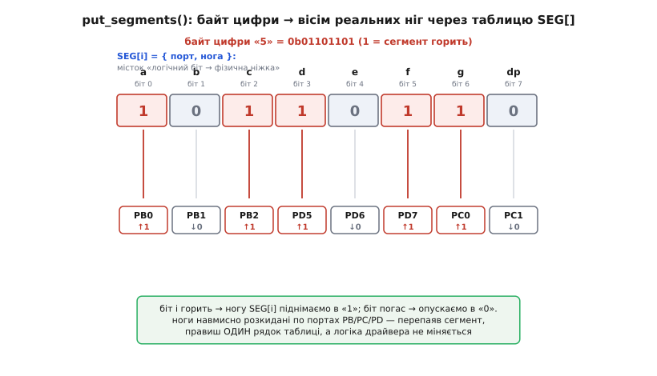
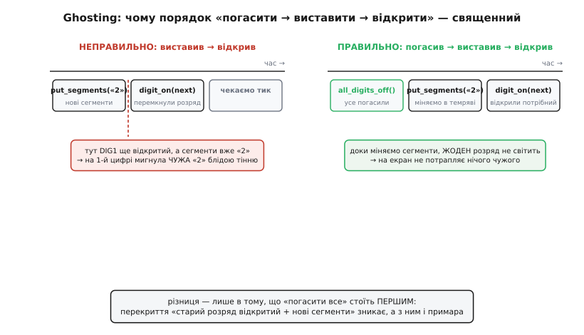

# ⚙️ Драйвер розгортки 5641AS: від таблиці сегментів до живого числа

<preknowlist>
- [Мультиплексна розгортка](topic:programming/pin-multiplexing) — один набір ліній обслуговує багато споживачів по черзі в часі; око зливає швидкі спалахи в цілу картинку.
- [BJT-ключ](topic:electronics/bjt-switch) — транзистор, що малим струмом бази пропускає крізь себе великий струм; так слабкий вивід МК замикає катод розряду на землю.
- [GPIO-регістри](topic:programming/gpio-registers) — як прошивка виставляє логічну одиницю чи нуль на конкретному виводі; тут ми пишемо в них вісім разів на кожен розряд.
- [Апаратне переривання таймера](topic:programming/interrupts) — лічильник усередині МК сам, без участі головного циклу, викликає функцію через рівні проміжки часу.
</preknowlist>

Теорію розгортки знаєш: індикатор світить по одному розряду за раз, а число складається з того, що МК швидко перебирає чотири цифри. Тепер завдання інше й цілком практичне — **написати прошивку, яка з цього фізичного фокуса робить рівне, немерехтливе чотиризначне число**, куди можна кинути будь-який `int` від 0 до 9999, поставити крапку в потрібному місці й не отримати ні примарних тіней, ні нерівної яскравості. Розберемо драйвер від найдрібнішого — байта одного символу — до повного циклу, який крутиться на таймері й нічого не просить від головного коду.

Ідея драйвера тримається на одному розділенні, яке ми проведемо через увесь код: **`put_segments()` каже, ЩО намалювати** (візерунок восьми сегментів), **`digit_on()` каже, ДЕ це намалювати** (який з чотирьох катодів відкрити). Раз ці дві дії незалежні, уся розгортка зводиться до короткого ритуалу «постав візерунок → відкрий розряд → зачекай тик → наступний розряд», який виконує переривання таймера. Решта — це акуратність у деталях, бо саме в деталях ховаються всі баги семисегментника.

## Крок 1: таблиця сегментів — байт на символ

Почнемо з того, як закодувати одну цифру. Кожен символ — це набір із восьми ввімкнених-вимкнених сегментів (`a b c d e f g` і крапка `dp`), тож природно тримати його в **одному байті**: вісім сегментів — вісім бітів. Лишається домовитися про порядок бітів, і ця домовленість — не дрібниця, а той стрижень, від якого залежить решта коду. Візьмемо найпоширеніший порядок: **біт 0 — сегмент `a`, далі `b c d e f g`, а біт 7 — крапка `dp`**.

```c
//  біт:   7    6   5   4   3   2   1   0
//  сегм:  dp   g   f   e   d   c   b   a
```

Тепер саме кодування. У 5641AS **спільний катод**: катод розряду притягнуто ключем до землі, тож окремий сегмент світиться, коли на його лінію подано **логічну одиницю** (плюс на анод, мінус уже на катоді). Виходить просте правило: **біт = 1 означає «сегмент горить»**. Щоб закодувати «0», треба засвітити зовнішнє кільце `a b c d e f` і погасити середню перекладину `g` та крапку — це бітова маска `0b00111111`. Для «7» досить `a b c` — `0b00000111`. Складемо всю таблицю цифр:

```c
#include <stdint.h>

// Спільний катод: 1 = сегмент горить. Порядок бітів: dp g f e d c b a.
static const uint8_t DIGIT[10] = {
    //  dp g f e d c b a
    0b00111111,  // 0 :  . _ f e d c b a   → зовнішнє кільце без g
    0b00000110,  // 1 :  . _ _ _ _ c b _   → лише праві дві риски
    0b01011011,  // 2 :  . g _ e d _ b a
    0b01001111,  // 3 :  . g _ _ d c b a
    0b01100110,  // 4 :  . g f _ _ c b _
    0b01101101,  // 5 :  . g f _ d c _ a
    0b01111101,  // 6 :  . g f e d c _ a
    0b00000111,  // 7 :  . _ _ _ _ c b a
    0b01111111,  // 8 :  . g f e d c b a   → усі сім
    0b01101111,  // 9 :  . g f _ d c b a
};
```

Коментар праворуч від кожного рядка — це не оздоба, а **найдешевша страховка від помилки**: читаючи біти зліва направо (`dp g f e d c b a`), одразу бачиш, які сегменти піднято, і можеш звірити маску з формою цифри в голові. Раз помилившись у таблиці, ти отримаєш скалічену цифру («b» замість «6»), і шукати причину доведеться довго — тому таблицю варто вивірити один раз дуже уважно.

Крапку в таблиці цифр **навмисно не чіпаємо** — біт 7 усюди нуль. Крапка живе окремо від цифри: вона може стояти чи не стояти при будь-якому розряді (роздільник годинника `12:34`, десяткова кома `3.14`), тож логічно домалювати її поверх готового байта цифри, а не вбивати в таблицю. Робиться це одним `АБО`:

```c
// Взяти візерунок цифри d (0..9) і, якщо треба, домалювати крапку.
static inline uint8_t glyph(uint8_t d, bool dot)
{
    uint8_t seg = DIGIT[d];        // байт цифри без крапки
    if (dot) seg |= (1u << 7);     // піднімаємо біт dp (біт 7)
    return seg;
}
```

`seg |= (1u << 7)` піднімає сьомий біт, не зачепивши решти, — крапка загоряється, а сама цифра лишається якою була. Ось чому крапку тримали окремим бітом: позиція коми — це властивість **місця у числі**, а не самого числа, і код це розділення поважає.

> 🔧 **Навіщо це.** Тримати крапку окремим бітом, а не окремими рядками таблиці (`0.`, `1.`, …, `9.`), — це різниця між таблицею на 10 байтів і таблицею на 20, а головне — між гнучким і негнучким кодом. Коли крапка окремо, ти вмикаєш її незалежно від того, яка там цифра, і легко зробиш блимання двокрапки годинника чи рухому десяткову кому. Заб'єш крапку в таблицю — і кожну «цифру з крапкою» доведеться заводити другим рядком, а рухати кому по числу стане мукою.

Якщо треба показувати не лише цифри, а й прості літери (`H`, `E`, `L`, `P`, `d`, `-`), таблицю просто доповнюють такими самими масками — семисегментник вміє грубий набір символів, і той самий `put_segments()` виведе їх без жодної зміни. Порожній розряд (нічого не світиться) — це маска `0x00`, а суцільний прочерк «-» — це самий сегмент `g`, тобто `0b01000000`.

## Крок 2: `put_segments()` — розкласти байт на реальні ніжки

Байт готовий, але його ще треба **фізично виставити на вісім виводів МК**. І тут з'являється незручна правда заліза: біти в нашому байті йдуть у зручному нам порядку `dp g f e d c b a`, а **фізичні ніжки мікроконтролера, до яких припаяні сегменти, майже ніколи не збігаються ні з цим порядком, ні між собою**. На макетці сегмент `a` міг потрапити на вивід `PB0`, `b` — на `PD5`, `c` — на `PA2`, розкидані по трьох різних портах. Саме `put_segments()` і є той місток, що переганяє «логічний біт номер N» у «підняти чи опустити конкретну ногу».

Найчесніший і найзрозуміліший спосіб — **таблиця відповідності**: масив, де для кожного з восьми сегментів записано, який це порт і яка нога. Тоді `put_segments()` просто пробігає вісім бітів і для кожного смикає свою ногу.


*Байт цифри «5» (0b01101101): кожен біт через таблицю SEG[i]={порт,нога} веде до своєї фізичної ніжки. Піднятий біт (a, c, d, f, g) виставляє ногу в «1», погашений — у «0»; ноги навмисно розкидані по портах PB/PC/PD, і перепаювання сегмента правиться одним рядком таблиці.*

Ось як це виглядає в стилі «реєстрового» доступу (порти `PORTx`, як у AVR; на іншому МК заміниш на його `gpio_set`/`gpio_clear`, суть та сама):

```c
// Опис одного сегмента: куди він фізично припаяний.
typedef struct {
    volatile uint8_t *port;   // регістр порту (напр. &PORTB)
    uint8_t           mask;   // маска ноги в цьому порту (напр. 1<<3)
} SegPin;

// Порядок ЗБІГАЄТЬСЯ з порядком бітів у байті: [0]=a ... [7]=dp.
// ↓↓↓  Ці адреси/ноги — приклад; підстав СВОЮ реальну розводку.  ↓↓↓
static const SegPin SEG[8] = {
    { &PORTB, 1u << 0 },   // a
    { &PORTB, 1u << 1 },   // b
    { &PORTB, 1u << 2 },   // c
    { &PORTD, 1u << 5 },   // d
    { &PORTD, 1u << 6 },   // e
    { &PORTD, 1u << 7 },   // f
    { &PORTC, 1u << 0 },   // g
    { &PORTC, 1u << 1 },   // dp
};

// Виставити байт seg (біт i → сегмент SEG[i]) на реальні ніжки.
static void put_segments(uint8_t seg)
{
    for (uint8_t i = 0; i < 8; i++) {
        if (seg & (1u << i))
            *SEG[i].port |=  SEG[i].mask;   // сегмент горить → нога у «1»
        else
            *SEG[i].port &= ~SEG[i].mask;   // сегмент згас  → нога у «0»
    }
}
```

Прочитаймо, що тут діється. `seg & (1u << i)` перевіряє **i-тий біт** нашого байта — «чи має світитися i-тий сегмент». Якщо так, `*SEG[i].port |= SEG[i].mask` піднімає відповідну ногу в одиницю (`|=` вмикає лише її біт, не чіпаючи сусідів на тому самому порту); якщо ні, `&= ~mask` опускає ногу в нуль. Вісім проходів — вісім сегментів виставлено. Уся принадність підходу в тому, що **перепаяв сегмент на іншу ногу — правиш один рядок таблиці `SEG[]`, і решта коду не міняється ані на символ**.

Цей цикл платить за зрозумілість швидкістю: вісім перевірок і вісім записів у порт на кожен розряд. Поки сегменти розкидані по різних портах, дешевше не вийде. Але якщо тобі пощастило (чи ти сам так розвів плату) посадити **всі вісім сегментів на один порт підряд** — скажімо, `a`…`dp` рівно на `PB0`…`PB7`, — то вся розкладка згортається в **один запис**:

```c
// Швидкий варіант: усі 8 сегментів на одному порту PB, біти збігаються 1-в-1.
static inline void put_segments_fast(uint8_t seg)
{
    PORTB = seg;    // один такт замість восьми ітерацій
}
```

Один такт замість циклу — різниця, невидима для однієї цифри, але помітна, коли розгортка крутиться сотні разів на секунду й з'їдає такти в кожному тику. Тому досвідчений розробник, проєктуючи плату під семисегментник, **навмисно садить сегменти на один порт підряд** — саме заради цього однорядкового `put_segments`. Це той випадок, коли трохи думки над розводкою економить купу тактів у прошивці.

> 🔧 **Навіщо це.** Таблиця `SEG[]` — не бюрократія, а те, що робить драйвер **переносним між платами**. Той самий код працює і там, де сегменти на одному порту, і там, де вони розкидані по трьох, — міняється лише масив, не логіка. Пиши розкладку через таблицю з першого дня, навіть якщо зараз усе на одному порту: щойно доведеться перепаяти чи перенести код на іншу плату, ти подякуєш собі, що не зашив номери ніжок просто в тіло функції.

## Крок 3: `digit_on()` і `all_digits_off()` — керуємо катодами

Візерунок ми виставляти вміємо. Тепер друга половина — **вибір розряду**. Пригадаймо схему: катод кожного розряду заведено на свій [транзисторний ключ](topic:electronics/bjt-switch), що замикає цей катод на землю. Відкрив ключ DIG1 — засвітився перший розряд (той візерунок, що зараз на сегментах); відкрив DIG2 — другий. У кожну мить **відкритим має бути рівно один ключ**.

Опишемо катодні ключі так само таблицею, як сегменти, — по ногі на розряд:

```c
// Ноги, що керують катодними ключами розрядів. [0]=DIG1 (ліва цифра) ... [3]=DIG4.
static const SegPin CAT[4] = {
    { &PORTC, 1u << 2 },   // DIG1
    { &PORTC, 1u << 3 },   // DIG2
    { &PORTD, 1u << 3 },   // DIG3
    { &PORTD, 1u << 4 },   // DIG4
};

// Погасити ВСІ розряди: закрити всі катодні ключі.
static void all_digits_off(void)
{
    for (uint8_t i = 0; i < 4; i++)
        *CAT[i].port &= ~CAT[i].mask;   // нога у «0» → ключ закритий → розряд темний
}

// Відкрити РІВНО ОДИН розряд d (0..3): його ключ увімкнути.
static void digit_on(uint8_t d)
{
    *CAT[d].port |= CAT[d].mask;        // нога у «1» → ключ відкритий → розряд світиться
}
```

Тут криється тонкість, яку легко пропустити: **чи «1» на ногі відкриває ключ, залежить від того, який транзистор стоїть у ключі**. У попередньому коді припущено найпростіший випадок — npn-транзистор (або n-канальний MOSFET), у якому нога МК йде на базу через резистор: подав «1» — база відкрилася, ключ провідний, катод притягнуто до землі. Це логіка «1 = розряд світиться». Але поширений і **інвертувальний** ключ (наприклад, pnp-транзистор у верхньому плечі для спільного анода, або npn з інвертором) — там усе дзеркально, і «0» відкриває розряд. Тому головне правило: **звірся, у який бік працює саме твій ключ**, і за потреби переверни рівні в `digit_on`/`all_digits_off`. Плутанина тут дає найзагадковіший симптом — «світиться геть не той розряд» або «світяться всі три, крім потрібного».

Чому катод обов'язково через ключ, а не прямо на ногу МК, — уже знаєш зі схеми: коли на розряді «8», крізь спільний катод тече сума струмів усіх восьми сегментів, а це десятки-сотні міліампер, яких одна нога прийняти в себе не може. Ключ бере цей струм на себе, лишаючи ногі МК лише керування базою. `digit_on()` смикає базу — весь струм цифри тече крізь транзистор у землю, повз мікроконтролер.

## Крок 4: `refresh_isr()` — серце розгортки на таймері

Тепер зберемо два вміння в один цикл. Розгортка — це рівний, як метроном, перебір розрядів, і найнадійніше доручити його **апаратному таймеру**: лічильник усередині МК сам відлічує проміжок і викликає нашу функцію-переривач, незалежно від того, чим зайнятий головний код. Це і рятує від видимого блимання: перемикання йде рівно навіть тоді, коли `main()` застряг у довгій операції.

Порахуймо частоту. Щоб око не бачило мерехтіння, увесь дисплей має оновлюватися **не рідше ~100 разів на секунду** (100 Гц — комфортний поріг, вище — краще). У нас чотири розряди, отже кожен окремий розряд треба «відвідати» 100 разів на секунду, а таймер має тикати вчетверо частіше — **400 разів на секунду**, тобто кожні **2.5 мс**:

```
частота кадру   = 100 Гц           (усе число оновлюється 100 раз/с — око спокійне)
розрядів        = 4
частота таймера = 100 · 4 = 400 Гц
період тику     = 1 / 400 = 2.5 мс  ← так часто спрацьовує refresh_isr()
```

Кожен тик робить рівно один крок розгортки: гасить попередній розряд, ставить візерунок наступного, вмикає наступний розряд. Ось воно, серце драйвера:

```c
volatile uint8_t frame[4] = { 0, 0, 0, 0 };  // що показати: frame[0]=ліва цифра ... frame[3]=права
volatile uint8_t dots      = 0;              // біти крапок: біт i → крапка при розряді i
static   uint8_t cur       = 0;              // який розряд зараз активний (0..3)

// Викликається таймером кожні 2.5 мс (→ 100 Гц на 4 розряди).
void refresh_isr(void)
{
    all_digits_off();                 // 1) ПОГАСИТИ все — доки міняємо сегменти
    uint8_t seg = frame[cur];         //    візерунок поточного розряду
    if (dots & (1u << cur))           //    чи є крапка при цьому розряді?
        seg |= (1u << 7);             //    домалювати крапку (біт dp)
    put_segments(seg);                // 2) виставити сегменти
    digit_on(cur);                    // 3) відкрити ключ саме цього розряду
    cur = (cur + 1) & 3;              //    наступний розряд по колу: 0→1→2→3→0
}
```

Три дії в суворому порядку — **погасити → виставити → відкрити** — це і є весь такт. `cur = (cur + 1) & 3` рухає активний розряд по колу: `& 3` (двійкове `...00011`) залишає лише два молодші біти, тож лічильник сам обертається `0→1→2→3→0`, без жодного `if`. У `frame[]` головний код кладе, що показати; переривання його лише читає й малює.

Порядок трьох дій — **не косметика, а захист від примар**, і зараз розберемо, чому саме такий.

> 🔧 **Навіщо це.** Масив `frame[]` позначено `volatile` навмисно. Його пише головний код (нове число), а читає переривання — тобто змінна живе «на двох ногах». Без `volatile` компілятор має право вирішити, що між викликами `frame[]` ніхто не міняє, закешувати старе значення в регістрі й показувати застигле число, хоч ти вже поклав туди нове. `volatile` каже: «читай щоразу з пам'яті, не мудруй» — і дисплей слухається нових даних.

## Крок 5: ghosting — і чому порядок «вимкнув → перемалював → увімкнув» священний

Це найкапризніший баг семисегментника, тож зупинимось на ньому докладно. **Ghosting** (англ. *ghosting* — примарне світіння) — це бліді тіні чужих сегментів на сусідніх цифрах: показуєш «1 2 3 4», а на кожній цифрі ледь-ледь просвічують риски від сусідів, і все число виглядає брудним, розмитим. Причина — **накладання в часі** переходу між розрядами.

Уявімо помилковий порядок: спершу виставили новий візерунок, **потім** перемкнули розряд. Що станеться в проміжку? Секунду тому був відкритий, скажімо, DIG1 і на сегментах стояв візерунок «1». Ми виставляємо на сегменти візерунок «2» — але ключ DIG1 **ще відкритий**, бо перемкнути розряд ми збиралися наступною дією. Виходить, частку мікросекунди на **першому** розряді світиться візерунок «2» — чужа цифра блідою тінню. Потім ми відкриваємо DIG2, і на другому розряді теж «2» — уже правильно. Але тінь на першому розряді око вже спіймало.

Ось чому перша дія в перериванні — **`all_digits_off()`**: поки жоден розряд не відкритий, можна безпечно міняти сегменти скільки завгодно — вони нікуди не світять, бо всі катодні ключі закриті. І лише **виставивши** новий візерунок, ми відкриваємо **потрібний** розряд. Тоді на екран нічого чужого не потрапляє. Звідси залізне правило розгортки:


*Ліворуч — виставили сегменти, поки старий розряд ще відкритий: у проміжку на першій цифрі мигає чужа «2» блідою тінню. Праворуч — «погасити все» стоїть першим, тож сегменти міняються в темряві й на екран не потрапляє нічого чужого. Уся різниця — лише в тому, що вимкнення розрядів переставлене на початок такту.*

Є ще підступніший різновид примар — **від ємності**. Довгі доріжки й самі сегменти мають дрібну паразитну ємність; коли розряд гасне, накопичений заряд стікає не миттєво, і сегмент кілька мікросекунд ще ледь жевріє. На повільній розгортці це непомітно, але на швидкій, з яскравими сегментами, дає слабку загальну «димку». Ліки, якщо помітно: додати **коротку паузу-темряву** (англ. *dead time* — мертвий час) між гасінням і засвіченням наступного — кілька мікросекунд, поки все справді згасне. Але це вже тонке налаштування; для більшості плат правильного порядку трьох дій цілком досить, і в дрібницях його дошліфовувати не варто.

## Крок 6: вивести довільне число й поставити крапку

Драйвер малює те, що лежить у `frame[]`. Лишилося дати головному коду зручний спосіб **покласти туди число** — розкласти `int` на чотири цифри й записати їх у правильні розряди. Це чиста арифметика остачі й ділення:

```c
// Показати ціле число 0..9999. Провідні нулі гасимо (крім самого 0).
void show_number(uint16_t value)
{
    if (value > 9999) value = 9999;      // за межі не лізем

    // Розкладаємо на розряди справа наліво: остача від 10 — молодша цифра.
    uint8_t d3 = value % 10;  value /= 10;   // крайня права (одиниці)
    uint8_t d2 = value % 10;  value /= 10;   // десятки
    uint8_t d1 = value % 10;  value /= 10;   // сотні
    uint8_t d0 = value % 10;                 // крайня ліва (тисячі)

    frame[0] = DIGIT[d0];
    frame[1] = DIGIT[d1];
    frame[2] = DIGIT[d2];
    frame[3] = DIGIT[d3];

    // Гасимо провідні нулі: «42» має світитися як «  42», а не «0042».
    if (d0 == 0) {
        frame[0] = 0x00;                       // тисячі — порожньо
        if (d1 == 0) {
            frame[1] = 0x00;                   // сотні — порожньо
            if (d2 == 0)
                frame[2] = 0x00;               // десятки — порожньо (лишиться сама одиниця)
        }
    }
}
```

Логіка розкладу проста: `value % 10` дає молодшу цифру (остачу від ділення на десять), `value /= 10` відкидає її — і так чотири рази, від одиниць до тисяч. Гасіння **провідних нулів** — це та дрібниця, що відрізняє акуратний прилад від грубого: без неї число 42 світилося б як «0042», що виглядає по-дитячому. Каскад `if`-ів гасить нулі зліва, поки не дійде до першої значущої цифри; сама одиниця (число 0) при цьому лишиться видимою, бо найглибший `if` не чіпає розряд одиниць.

Тепер **крапка**. Позицію коми тримаємо в бітовій масці `dots`: біт `i` піднято — при розряді `i` світиться крапка. Показати, скажімо, `3.14`:

```c
// Показати число з фіксованою десятковою комою після заданого розряду.
// Напр. 314 з крапкою після розряду 1 → на екрані «3.14».
void show_fixed(uint16_t value, uint8_t dot_pos)
{
    show_number(value);              // виклали цифри
    dots = (1u << dot_pos);          // крапка при потрібному розряді
}

// Приклад: показати 3.14
//   show_fixed(314, 1);            // цифри 0314 → гашений нуль → « 314», крапка після розряду 1 → «3.14»

// Двокрапка годинника 12:34 (якщо середні крапки з'єднані як роздільник):
//   show_number(1234);
//   dots = (1u << 1);              // крапка після другого розряду як розділювач
```

Крапка стає властивістю **місця**, а не числа: `show_number` кладе цифри, `dots` каже, де світити кому, а `refresh_isr` при малюванні кожного розряду перевіряє свій біт у `dots` і за потреби піднімає `dp`. Хочеш рухому кому (плаваюче число) — рахуй `dot_pos` із масштабу величини; хочеш блимку двокрапку годинника — перемикай біт `dots` раз на пів секунди. Уся ця гнучкість — прямий наслідок того, що ще на кроці 1 ми не забили крапку в таблицю цифр.

## Складаємо все докупи: робочий кістяк

Ось як частини стають живою прошивкою. Головний код лише кладе число у `frame[]` та інколи його міняє; уся розгортка крутиться сама на таймері:

```c
#include <stdint.h>
#include <stdbool.h>

/* --- таблиці й функції put_segments/digit_on/all_digits_off — з кроків 1..3 --- */

volatile uint8_t frame[4] = { 0, 0, 0, 0 };
volatile uint8_t dots      = 0;
static   uint8_t cur       = 0;

void refresh_isr(void)                 // ← причеплено до таймера на 400 Гц
{
    all_digits_off();
    uint8_t seg = frame[cur];
    if (dots & (1u << cur)) seg |= (1u << 7);
    put_segments(seg);
    digit_on(cur);
    cur = (cur + 1) & 3;
}

void show_number(uint16_t value);      // ← з кроку 6

int main(void)
{
    segments_init();      // всі 8 сегментних ніг і 4 катодні — на вихід (нижче)
    timer_init_400hz();   // налаштувати таймер: 400 переривань/с → refresh_isr()
    enable_interrupts();

    uint16_t counter = 0;
    for (;;) {
        show_number(counter);      // оновили те, ЩО показувати
        counter = (counter + 1) % 10000;
        delay_ms(200);             // головний код вільний; розгортка йде сама
        // Поки ми спимо в delay, таймер 80 разів викликав refresh_isr
        // і рівно тримав на екрані поточне число — без нашої участі.
    }
}
```

Ключова краса цієї будови: `main()` **нічого не знає про розгортку**. Він кинув число у `frame[]` і пішов у своїх справах (тут — лічильник, а насправді читав би давач, слухав кнопки, рахував час). Поки він у `delay_ms(200)`, таймер устигає викликати `refresh_isr` близько **80 разів** і весь цей час рівно тримає на індикаторі поточне число. Розгортка й головна логіка живуть паралельно й не заважають одна одній — саме те, заради чого розгортку винесли на апаратний таймер, а не крутили в головному циклі.

Лишилась ініціалізація виводів — усі вісім сегментних ніг і чотири катодні треба перевести на вихід. Через ті самі таблиці це коротко:

```c
// Перевести всі задіяні ноги на вихід і почати з темного екрана.
static void segments_init(void)
{
    for (uint8_t i = 0; i < 8; i++)                    // 8 сегментних ніг → вихід
        *seg_ddr(SEG[i].port) |= SEG[i].mask;
    for (uint8_t i = 0; i < 4; i++)                    // 4 катодні ноги → вихід
        *seg_ddr(CAT[i].port) |= CAT[i].mask;
    put_segments(0x00);      // усі сегменти згашені
    all_digits_off();        // усі розряди закриті — стартуємо з чорного екрана
}
```

(`seg_ddr()` тут — умовний перехід від регістра порту `PORTx` до його регістра напряму `DDRx`; на конкретному МК це або сусідня адреса, або окрема таблиця. Суть — **напрям кожної задіяної ноги виставити у «вихід»**, бо після скидання МК вони зазвичай входи.) Стартуємо з чорного екрана навмисно: перш ніж таймер зробить перший крок, хай нічого не світиться, щоб на долю секунди не спалахнула сміттєва комбінація.

## Яскравість: струмом і шпаруватістю

Драйвер працює — цифри стоять рівні й чисті. Тепер про те, як керувати їхньою **яскравістю**, бо в семисегментнику це має дві незалежні ручки, і плутати їх — типова помилка.

**Перша ручка — струм сегмента**, тобто номінал струмообмежувального резистора. Менший опір — більший струм крізь сегмент — яскравіше світло. Тут головне пам'ятати про **імпульсний режим**: кожен розряд світиться лише чверть часу (поки активний він, решта три темні), тож середня яскравість учетверо нижча, ніж якби цифра горіла постійно. Компенсують це тим, що під час свого короткого вікна сегмент женуть струмом **вищим за тривало допустимий**. Даташит 5641AS дає тривалий струм сегмента близько 20–30 мА, але для **імпульсного** режиму (мала шпаруватість, короткі спалахи) допускає помітно більший піковий струм — типово до ~100 мА на сегмент за шпаруватості 1/10 і коротких імпульсів (точне число залежить від партії — звіряйся зі своїм даташитом). Око бачить середнє, а короткий яскравий спалах виглядає яскравіше, ніж дало б те саме середнє рівним світлом.

```
Тривалий струм сегмента (постійне світіння)     ≈ 20 мА     ← стеля для «завжди ввімкнено»
Піковий струм у імпульсі (мала шпаруватість)    ≈ до 100 мА ← дозволено, бо спалах короткий
                                                              (точну межу бери з даташита партії)
Наша розгортка: шпаруватість кожного розряду = 1/4 (25%)
```

Небезпека тут така: якщо **розгортка раптом зупиниться** (код завис, таймер збився) на розряді, який женеться імпульсним струмом 60–80 мА, — цей струм із «пікового короткого» стане «постійним», і сегменти вигорять за секунди разом із ключем. Тому імпульсний струм і апаратний таймер розгортки — **пов'язані**: підняв струм заради яскравості — подбай, щоб розгортка не могла застрягти (watchdog, надійний таймер).

**Друга ручка — шпаруватість розгортки**, і вона дає яскравість **без зміни струму**, самим лише часом. Досі ми в кожному тику тримали розряд відкритим **весь** проміжок до наступного тику. А що, як відкривати його лише на **частину** цього вікна, а решту тримати темним? Середня яскравість упаде пропорційно — це і є регулювання **широтно-імпульсною модуляцією** ([ШІМ](topic:programming/pwm-on-mcu)) поверх розгортки. Проста реалізація — розбити кожне вікно розряду на кілька під-тиків і світити лише в частині з них:

```c
// Глобальна яскравість 0..8: скільки з 8 під-тиків розряд світиться.
volatile uint8_t brightness = 8;   // 8 = повна; 4 = половина; 1 = ледь-ледь
static   uint8_t subtick    = 0;

// Тепер таймер тикає у 8 разів частіше (8 під-тиків на розряд):
// 400 Гц × 8 = 3200 Гц, період ≈ 0.31 мс.
void refresh_isr_dim(void)
{
    if (subtick == 0) {                 // початок вікна розряду — перемалювати
        all_digits_off();
        uint8_t seg = frame[cur];
        if (dots & (1u << cur)) seg |= (1u << 7);
        put_segments(seg);
        digit_on(cur);                  // відкрили розряд
    }
    if (subtick == brightness)          // відсвітив свою частку вікна —
        all_digits_off();               // гасимо достроково (решту вікна темно)

    if (++subtick >= 8) {               // вікно скінчилось
        subtick = 0;
        cur = (cur + 1) & 3;           // наступний розряд
    }
}
```

Тепер `brightness` плавно керує яскравістю всього дисплея, **не чіпаючи резисторів**: при `brightness = 8` розряд світить усі 8 під-тиків (повна яскравість), при `brightness = 2` — лише 2 з 8 (чверть яскравості), решту вікна він примусово згашений. Це найзручніший спосіб робити нічне приглушення чи плавне згасання, і він не потребує жодної зміни заліза. Ціна — таймер має тикати у вісім разів частіше, тож на слабкому МК стеж, щоб переривання встигало відпрацювати між тиками.

> 🔧 **Навіщо це.** Дві ручки яскравості розв'язують різні задачі. **Струмом (резистором)** задають базову, «максимальну» яскравість дисплея — раз при проєктуванні, під освітлення, у якому прилад житиме. **Шпаруватістю (ШІМ)** керують яскравістю **на льоту** з коду — приглушити вночі, підняти на сонці, плавно згасити при вимкненні. Перше — залізо й назавжди; друге — м'яка, програмна ручка. Разом вони дають і яскравий екран удень, і не сліпучий уночі, тим самим приладом.

## Спільний анод: та сама розгортка, дзеркальні рівні

Усе досі було для спільного **катода** (5641AS = `...AS`). Його близнюк зі спільним **анодом** (`...BS`) — той самий корпус, але всередині все з'єднано навпаки: спільний вивід розряду — це тепер **анод** (плюс), а сегменти вмикаються **нулем**. Драйвер міняється лише у двох місцях, логіка розгортки — ані на йоту.

**Зміна перша — таблиця сегментів інвертується.** Раз тепер сегмент світиться від логічного **нуля** (анод розряду вже під плюсом, тож щоб пустити струм крізь сегмент, його лінію треба притягнути до землі), то «горить» — це біт 0, а «згас» — біт 1. Найпростіше не переписувати таблицю, а **інвертувати** готовий байт при виводі:

```c
// Спільний АНОД: сегмент світиться від НУЛЯ. Інвертуємо байт «катодної» таблиці.
static inline uint8_t glyph_anode(uint8_t d, bool dot)
{
    uint8_t seg = DIGIT[d];          // та сама таблиця, що для катода
    if (dot) seg |= (1u << 7);
    return (uint8_t)~seg;            // ← інверсія: тепер 0 = горить, 1 = згас
}
```

**Зміна друга — ключі розрядів переїжджають у верхнє плече.** Спільний анод треба замикати не на землю, а на **плюс живлення**, тож ключ — це pnp-транзистор (або p-канальний MOSFET) у верхньому плечі. Відповідно `digit_on()`/`all_digits_off()` можуть **перевернути рівні** (часто такий ключ відкривається нулем на базі). Тому:

```
                     Спільний КАТОД (5641AS/AS)   Спільний АНОД (…BS)
сегмент світиться      від «1» (плюс на анод)      від «0» (мінус крізь сегмент)
таблиця цифр           пряма (1 = горить)          інвертована (~seg)
спільний вивід розряду катод → на землю            анод → на плюс живлення
ключ розряду           npn/n-MOS, нижнє плече       pnp/p-MOS, верхнє плече
розгортка (цикл дій)    погасити→виставити→відкрити  ТАК САМО, без змін
```

Головна думка: **сам алгоритм розгортки — таблиця, три дії в перериванні, вибір розряду — байдужий до типу спільного виводу**. Міняється лише «полярність»: як кодуються біти й куди ведуть ключі. Тому один добре написаний драйвер легко перемикати між катодом і анодом парою `#define`, а не переписувати. І перше, що звіряють, узявши невідомий індикатор, — **літеру в назві** (`AS` проти `BS`): переплутаєш полярність — не засвітиться нічого або засвітиться маячня.

## Коли ніг мало: розгортка через 74HC595

Голий 5641AS з'їдає вісім ніг МК на сегменти плюс чотири на розряди — дванадцять виводів. На дрібному чипі це майже весь наявний GPIO. Класичний спосіб віддати сегменти на **три ноги замість восьми** — поставити між МК та індикатором **зсувний регістр** [74HC595](topic:electronics/shift-register): він приймає вісім бітів **послідовно** по одній лінії, а віддає їх **паралельно** на вісім виходів. Три керуючі лінії (дані, такт, засувка) — і ти маєш повний байт сегментів.

Історична дрібниця для точності: мікросхему 595 із цієї серії розробила компанія **Philips Semiconductors** (нині NXP) у межах логічного сімейства 74HC — швидкої КМОН-версії 7400-логіки, що її ще в 1960-х започаткувала Texas Instruments; сьогодні `SN74HC595` від TI — найпоширеніше друге джерело тієї самої деталі. Тобто «74HC595» — не один виробник, а стандарт, який роблять багато хто (усталений факт).

Керують ним трьома сигналами:

```
DS   (data)   — біт даних, який заходить у регістр
SHCP (clock)  — такт: по фронту заштовхує поточний біт DS углиб регістра
STCP (latch)  — засувка: по фронту виставляє накопичені 8 бітів на виходи разом
```

Ідея така: вісім разів кладемо біт на `DS` і смикаємо `SHCP` — байт заповзає в регістр по одному біту. Потім один раз смикаємо `STCP` — і всі вісім бітів **одночасно** з'являються на виходах, звідки йдуть на сегменти. Ось `put_segments()` через 595:

```c
// Ноги до 74HC595 (три штуки замість восьми сегментних):
static const SegPin PIN_DS   = { &PORTB, 1u << 0 };   // дані
static const SegPin PIN_SHCP = { &PORTB, 1u << 1 };   // такт зсуву
static const SegPin PIN_STCP = { &PORTB, 1u << 2 };   // засувка виходів

static inline void pin_hi(SegPin p) { *p.port |=  p.mask; }
static inline void pin_lo(SegPin p) { *p.port &= ~p.mask; }

// Виставити байт сегментів через зсувний регістр.
static void put_segments_595(uint8_t seg)
{
    // Заштовхуємо 8 бітів, старшим уперед (біт7=dp першим).
    for (int8_t i = 7; i >= 0; i--) {
        if (seg & (1u << i)) pin_hi(PIN_DS);   // біт на лінію даних
        else                 pin_lo(PIN_DS);
        pin_hi(PIN_SHCP);                      // фронт такту — біт заповз
        pin_lo(PIN_SHCP);
    }
    pin_hi(PIN_STCP);                          // засувка — усі 8 бітів на виходи разом
    pin_lo(PIN_STCP);
}
```

Решта драйвера — таблиця цифр, катодні ключі, `refresh_isr` — **лишається тією самою**: змінюється лише нутро `put_segments()`, а те, ЩО воно виставляє (той самий байт із таблиці), і весь ритуал розгортки не зачеплені. Тому перехід на 595 — це заміна однієї функції, а не переписування драйвера. Ба більше: **другий 595, підключений послідовно за першим** (вихід переповнення `Q7'` першого йде на `DS` другого), дає ще вісім ліній — на катоди розрядів, — і тоді весь індикатор висить на **трьох ногах МК** замість дванадцяти. Заплатиш за це тим, що виставлення байта тепер коштує не один запис у порт, а вісім тактів зсуву, — але на частоті розгортки в сотні герц цього запасу тактів зазвичай вдосталь.

> 🔧 **Навіщо це.** 595 віддає ноги МК ціною тактів. Поки розгортка йде на сотні герц, а МК не завантажений по вуха, ці зайві такти зсуву непомітні — і три ноги замість дванадцяти того варті. Але якщо женеш дуже яскравий дисплей із ШІМ-приглушенням (таймер тикає тисячі разів на секунду) на слабкому чипі, зважуй: вісім тактів зсуву × багато тиків можуть з'їсти помітну частку процесорного часу. Тоді або апаратний `SPI` замість ручного смикання ніжок (він жене байт у 595 залізом, майже без участі ядра), або вертайся до прямих ніг на швидкому порту.

## Типові пастки драйвера — коротко

Зберемо в одному місці те, на чому цей код найчастіше спотикається:

- **Переплутаний порядок бітів у таблиці.** Якщо `put_segments()` розкладає біти в одному порядку, а таблиця `DIGIT[]` закодована в іншому, цифри виходять скалічені — «6» замість «5», риски не на місці. Порядок бітів (`dp g f e d c b a`) і порядок у таблиці `SEG[]` **мусять збігатися**; звірити один раз дуже уважно.
- **Забув `volatile` на `frame[]`.** Компілятор закешує старе число, і дисплей застигне, хоч у код кладеться нове. Дані, що їх пише головний код, а читає переривання, — **завжди `volatile`**.
- **Ghosting від неправильного порядку дій.** Виставив сегменти до того, як погасив старий розряд, — на сусідній цифрі мигне чужа тінь. Тільки **погасити → виставити → відкрити**, у цьому порядку.
- **Не той бік ключа.** Якщо `digit_on()` відкриває розряд не тим рівнем, якого хоче саме твій транзистор, світитиметься не той розряд або жоден. Звірся, чи ключ відкривається «1» (нижнє плече, npn) чи «0» (верхнє плече, pnp).
- **Плутанина катод/анод.** Узяв інверсію таблиці для катодного індикатора (чи навпаки) — не засвітиться нічого. Літера в назві (`AS`/`BS`) — перше, що звіряють.
- **Розгортка з головного циклу.** Крутиш `refresh` у `main()` замість таймера — і будь-яка довга операція (читання давача, `delay`) дає видиме блимання. Вішай на **апаратний таймер**.
- **Імпульсний струм без страховки розгортки.** Підняв струм сегмента до пікового заради яскравості, а розгортка застрягла на одному розряді — пікове «на мить» стало постійним, і сегменти вигоріли. Високий струм ⇄ надійний таймер (плюс watchdog).
- **Занадто швидка розгортка.** Здається, «чим частіше, тим краще», але надто короткі спалахи крадуть яскравість (сегмент не встигає розгорітись) і навантажують МК зайвими перериваннями. 100–200 Гц на кадр — комфортний діапазон; вище — без потреби.

Драйвер вийшов невеликий — таблиця, дві функції розкладки, одне переривання, — але кожен його рядок стоїть на цілком фізичній причині: біти лягають на реальні ноги, порядок дій береже від примар, струм і шпаруватість крутять яскравість із двох боків. Розберешся, **чому** кожен шматок саме такий, — і чуже число на чужій платі оживиш за вечір, лише переписавши таблиці `SEG[]` і `CAT[]` під свою розводку.
