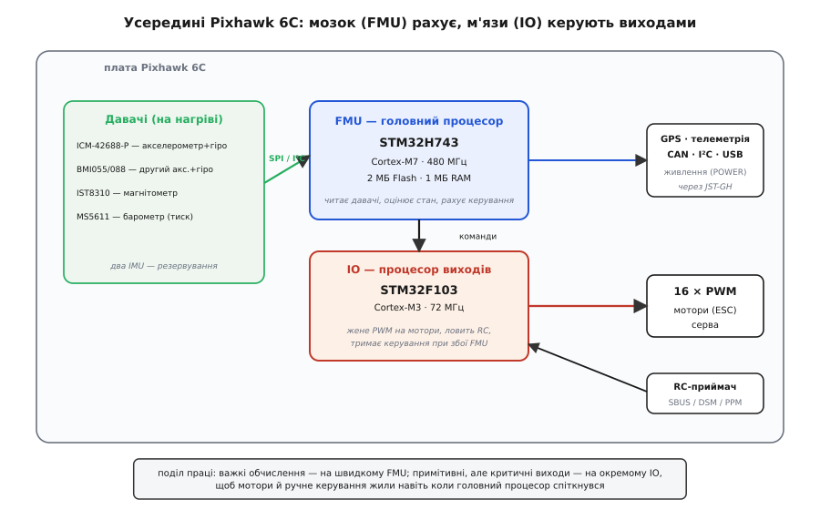
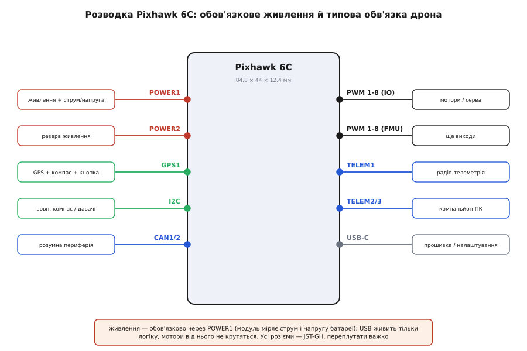

# Pixhawk 6C — польотний контролер

<preknowlist>
- [IMU-давач](book:electronics/imu) — акселерометр і гіроскоп в одному корпусі; звідки контролер знає, як його нахилило й куди він прискорюється.
- [Магнітометр](book:electronics/magnetometer) — електронний компас: напрямок на північ за магнітним полем Землі; дає курс, якого гіроскоп сам не втримає.
- [MEMS-давач тиску](book:electronics/mems-pressure-sensor) — барометр міряє атмосферний тиск, а з нього — висоту; чому падіння тиску означає підйом.
- [Асинхронна передача (UART)](book:communications/async-serial) — послідовна лінія на двох дротах; нею до контролера говорять GPS, радіо-телеметрія й компаньйон-комп'ютер.
- [PWM-протокол сервомашинки](book:electronics/pwm-servo-protocol) — керування шириною імпульсу 1–2 мс; так контролер задає газ регуляторам моторів і кут сервам.
- [Об'єднання давачів (sensor fusion)](book:communications/sensor-fusion) — як із шумних показів кількох давачів вивести один надійний стан; чому одного гіроскопа мало.
</preknowlist>

Візьміть у руки плату завбільшки з дві сірникові коробки — 85 міліметрів завдовжки, у литому алюмінієвому чи пластиковому корпусі, з рядами дрібних білих роз'ємів по торцях і портом USB-C збоку. Це **Pixhawk 6C** — автопілот, мозок дрона. Він не крутить моторів і не має пропелерів; його робота тонша й важливіша: сто разів на секунду він питає свої давачі «як я зараз стою й куди рухаюся», порівнює це з тим, куди хоче летіти, і роздає моторам поправки — цьому додати газу, тому вкоротити, — щоб апарат тримався в повітрі рівно й ішов туди, куди наказано. Приберіть цю плату — і квадрокоптер, у якого немає жодної природної стійкості, перекинеться й впаде за частку секунди.

Назва пішла не від хижого птаха у прямому сенсі, а з дослідницького коріння проєкту: студент ETH у Цюриху Лоренц Маєр 2008 року хотів навчити дрон літати **сам, орієнтуючись комп'ютерним зором** — бачити простір і оминати перешкоди. Команда, що зібралася навколо задачі, узяла ім'я «Pixhawk» (від *pixel* — піксель, елемент зображення, і *hawk* — яструб: «зіркий, як яструб»), а 2009-го виграла європейські змагання мікролітальних апаратів у категорії автономного польоту в приміщенні. З тієї роботи народилися відразу три речі, які досі рухають цілу галузь: протокол зв'язку MAVLink, наземна станція QGroundControl і автопілотне програмне забезпечення PX4. «Pixhawk» відтоді означає не одну плату, а **сімейство відкритих польотних контролерів** за спільним стандартом; 6C — одна з недорогих сучасних моделей, яку робить компанія Holybro.

> 🔧 **Навіщо це.** Розуміти, що Pixhawk — це **відкритий стандарт**, а не закритий продукт одного виробника, практично важливо: плату 6C від Holybro можна замінити на сумісну від іншого виробника, ті самі роз'єми підійдуть, а прошивка (PX4 чи ArduPilot) стане однаково. Ви вкладаєтеся не в чужу екосистему-пастку, а в спільний галузевий стандарт — це зменшує ризик, що проєкт «помре» разом із виробником.

## Що ця плата робить і чому дрону без неї не злетіти

Мультикоптер — апарат принципово **нестійкий**. Літак із крилом і хвостом сам вирівнюється в потоці; квадрокоптер — ні. Він тримається лише тим, що хтось безперервно й дуже швидко підправляє тягу кожного мотора: щойно апарат хитнувся, треба миттю додати обертів моторам з одного боку й прибрати з іншого, інакше нахил наростає сам собою й переходить у перекид. Людина фізично не встигає робити це вручну — потрібні сотні поправок за секунду. Саме цю роботу бере на себе польотний контролер.

Щоб підправляти, треба спершу **знати свій стан** — а це не одне число, а цілий букет: як апарат нахилений по двох осях, як швидко обертається навколо трьох, куди прискорюється, на якій висоті, в який бік дивиться носом, де він над землею. Жоден окремий давач усього цього не дасть, і кожен окремо бреше по-своєму: гіроскоп точний на коротких проміжках, але його свідчення поволі «спливають» (набігає дрейф); акселерометр ловить напрямок на центр Землі, але тремтить від вібрації моторів; магнітометр показує курс, та його збиває будь-яке залізо поряд. Тому контролер **зшиває всі давачі разом** алгоритмом [об'єднання давачів](book:communications/sensor-fusion) — бере від кожного те, у чому той сильний, і гасить те, у чому слабкий, отримуючи один узгоджений і надійний опис положення.

Мати оцінку стану — половина справи. Друга половина: порівняти її з бажаною (тримати горизонт; іти на цю точку; набрати таку висоту) і перетворити різницю на конкретні числа тяги для кожного мотора. Цим займається регулятор — ланцюг зі зворотним зв'язком, що зменшує похибку між «є» і «треба». Виходить кільце, яке крутиться безперервно: **виміряти стан → порівняти з ціллю → видати поправки на мотори → знову виміряти**. Pixhawk 6C — це залізо, спроєктоване прокручувати це кільце надійно, швидко й без збоїв, бо будь-яка затримка чи заминка тут — це падіння.

## Два процесори: чому мозок і м'язи розділені

Найважливіше в устрої 6C, що відрізняє серйозний автопілот від простенької плати стабілізації, — **усередині живуть два окремі процесори**, і поділ праці між ними продуманий заради безпеки.

Головний зветься **FMU** (*Flight Management Unit* — блок керування польотом). Це потужний мікроконтролер STM32H743 з ядром Arm Cortex-M7 на частоті до 480 МГц, з 2 мегабайтами флеш-пам'яті під прошивку й 1 мегабайтом оперативної. Уся важка робота — на ньому: опитати давачі, прогнати їхні дані крізь фільтр об'єднання, оцінити положення, порахувати регулятори, вести навігацію за GPS, спілкуватися з наземною станцією. FMU — це мозок, і він складний.

Другий — **IO** (*Input/Output* — вводу-виводу), маленький STM32F103 (Cortex-M3, 72 МГц). Його завдання примітивні, але критичні: **фізично формувати сигнали на мотори** й **приймати сигнал з пульта**. Він тупіший за FMU у сотні разів — і саме тому надійніший: чим простіша програма, тим менше в ній може зламатися.

Навіщо так морочитися? Уявіть, що прошивка на головному процесорі спіткнулася — зависла, наштовхнулась на помилку, перезавантажується. Якби той самий процесор і рахував, і сам смикав мотори, то в мить його збою апарат лишився б **без керування зовсім** — мотори завмерли б чи сказилися, і дрон упав. Розділення рятує: поки IO-процесор живий (а він простий і падає вкрай рідко), він **утримує керування** — може віддати мотори під пряме керування з пульта, щоб пілот дотягнув апарат руками, поки головний мозок оговтується. Це і є сенс окремого IO: **остання лінія оборони**, коли складний мозок дав збій. У дешевих польотних контролерах для перегонових дронів такого поділу немає — там усе на одному чипі, і надійність приноситься в жертву ціні та вазі.

*Давачі (два IMU, магнітометр, барометр) віддають дані на FMU (STM32H743) шинами SPI та I²C; FMU оцінює стан і рахує керування, а команди передає простому процесору IO (STM32F103), який фізично жене 16 каналів PWM на мотори й серва та приймає сигнал з RC-приймача. Розумна периферія — GPS, телеметрія, CAN, живлення — висить на FMU. Поділ праці навмисний: примітивний IO тримає мотори й ручне керування навіть тоді, коли складний FMU спіткнувся.*

## Давачі: чим плата відчуває себе

На платі напаяно повний набір інерційних давачів, і тут закладено ще один рівень надійності — **резервування через дублювання**. Замість одного акселерометра-гіроскопа стоять **два різні**, від різних виробників: ICM-42688-P (InvenSense) та BMI055 (Bosch; у новіших партіях, коли Bosch зняв BMI055 з виробництва, ставлять BMI088). Різні — навмисне: якщо один давач почне брехати чи відмовить, прошивка це помітить, порівнявши з другим, і перемкнеться на справний. Два однакові чипи мали б спільну ваду; два різні — навряд.

Магнітне поле Землі, щоб знати курс, читає магнітометр **IST8310**. Атмосферний тиск, а з нього висоту — барометр **MS5611**, один із класичних точних баро для авіації. Разом ці давачі дають контролеру повну картину: нахили й обертання (гіро+акс), напрямок на північ (магнітометр), висоту (барометр). GPS-приймач із супутниковими координатами — не на платі, а **зовнішній модуль**, який під'єднують окремо; на платі два порти саме під нього.

Одна тонкість, у якій 6C помітно серйозніша за дешеві плати: **давачі підігріваються**. На платі є резистори-нагрівачі, що тримають IMU біля сталої робочої температури. Це не примха: покази акселерометра й гіроскопа поповзли б від зміни температури (той самий дрейф нуля), а на морозі перед зльотом давач холодний, у польоті гріється — і оцінка кута «попливла» б разом із ним. Тримаючи давачі в теплі, плата прибирає цілий клас помилок ще до того, як вони псують політ.

> 🔧 **Навіщо це.** Резервування давачів — не маркетинг, а те, що реально рятує апарат. У польоті прошивка постійно звіряє два IMU між собою; якщо один почав видавати дурницю (відмова, удар, брак), його свідчення **відкидаються**, і керування триває на другому — замість того, щоб один збожеволілий давач кинув дрон у землю. Тому для чогось відповідальнішого за іграшку беруть плату саме з подвійним IMU, а не з одинарним.

## Що куди підключати: порти й обов'язкове живлення

Усі зовнішні з'єднання 6C зроблено за **Pixhawk Connector Standard** — спільним для всього сімейства стандартом роз'ємів. Це маленькі роз'єми JST-GH із кроком 1.25 мм, і кожен має «ключ»: перший контакт позначено білою крапкою на платі, а самі роз'єми різної ширини під різні порти — переплутати важко, вставити навпаки не вийде. Практична вигода стандарту величезна: GPS-модуль, радіомодем чи давач від будь-якого виробника, що тримається стандарту, підходять до плати **як є**, без перепайки.

*Ліворуч від плати — вхідні кола: два входи живлення POWER1/POWER2 (кожен через модуль, що міряє напругу й струм батареї), порт GPS1 із зовнішнім компасом і кнопкою запобіжника, шина I²C для зовнішніх давачів, дві шини CAN для «розумної» периферії. Праворуч — виходи й зв'язок: шістнадцять каналів PWM на мотори й серва, три послідовні порти TELEM під радіо-телеметрію й компаньйон-комп'ютер, USB-C для прошивки. USB живить лише логіку — мотори від нього не крутяться.*

**Живлення** заслуговує окремого й найпильнішого слова, бо тут новачки роблять найдорожчі помилки. Плату живлять не напряму від батареї, а через **модуль живлення** (power module), увімкнений у порт POWER1. Модуль робить дві речі: дає платі стабільні ~5 вольтів і водночас **міряє напругу та струм** батареї — саме звідси прошивка знає рівень заряду й скільки апарат споживає, щоб вчасно скомандувати повертатися. Робочий діапазон входу POWER — приблизно 4.9–5.5 В; є другий вхід POWER2 як резерв, і якщо подати живлення на обидва (плюс USB), плата отримує потрійне резервування джерела. Окрема рейка живить сервоприводи й терпить до 36 В, але **логіку самого автопілота нею не годують** — це виходи на навантаження, не вхід.

> 🔧 **Навіщо це.** Найпоширеніша й найнебезпечніша помилка початківця — думати, що коли плата ожила від USB, вона готова летіти. USB живить **тільки цифрову частину** (процесори, давачі, зв'язок); силова рейка моторів від нього **не живиться**, і сам USB не потягне пускові струми. Тому налаштовувати плату на столі від USB можна й треба, але для польоту живлення обов'язково йде через модуль від польотної батареї — інакше в найкращому разі апарат не злетить, а в гіршому просадка напруги перезавантажить автопілот у повітрі.

Виходи на мотори й серва — це **16 каналів PWM**: 8 формує IO-процесор, ще 8 — FMU. На кожен канал приходить [сигнал шириною імпульсу](book:electronics/pwm-servo-protocol) 1–2 мс, який регулятор мотора (ESC) читає як «скільки газу», а серворульова машинка — як «який кут». Сигнал з пульта плата приймає окремим входом RC, що розуміє поширені формати приймачів — SBUS, Spektrum DSM, PPM.

Для зв'язку є три послідовні порти TELEM (це звичайний [UART](book:communications/async-serial)): на них вішають радіомодем телеметрії (щоб бачити апарат на ноутбуці за кілометри) або компаньйон-комп'ютер (Raspberry Pi чи подібний — для комп'ютерного зору й розумної автономії). Дві шини **CAN** — під «розумну» периферію нового покоління ([DroneCAN](book:communications/dronecan)): GPS, регулятори моторів, давачі, що спілкуються цифровою шиною замість аналогових проводів. Шина **I²C** — під зовнішній компас і дрібні давачі. USB-C збоку — для першого заливання прошивки й налаштування з комп'ютера.

## Прошивка: залізо саме по собі не літає

Ключове, що варто засвоїти: **Pixhawk 6C — це порожнє залізо без прошивки**. Плата — тіло; поведінку дає програмне забезпечення автопілота, яке в неї заливають. І тут є вибір із двох великих відкритих систем.

**PX4** — прошивка, з якою 6C зазвичай приходить з коробки; вона народилася з того самого проєкту Pixhawk і тісно з ним пов'язана. **ArduPilot** — інша, старша й дуже зріла система з коренями в спільноті DIY Drones; на ту саму плату 6C можна залити її замість PX4. Обидві безкоштовні, відкриті, вміють керувати коптерами, літаками, роверами, човнами; вибір між ними — питання смаку, спільноти й конкретних функцій, а не сумісності з платою.

Обидві системи говорять із зовнішнім світом однією мовою — протоколом **MAVLink**: це домовленість, якими короткими пакетами автопілот обмінюється з наземною станцією й компаньйон-комп'ютером (телеметрія вниз, команди вгору). Саме тому наземна програма (QGroundControl, Mission Planner) і плата розуміють одна одну незалежно від того, PX4 там чи ArduPilot. Написати власну програму, що керує апаратом або читає його стан по MAVLink, — окрема практична тема. Як влаштований сам протокол — з чого складається пакет, як записана адреса, у якому порядку йдуть команди й на чому спотикаються, — зібрано в [протоколі MAVLink](book:boards/pixhawk-6c/api-mavlink-protocol.md); а робочу програму, що сама зброїть апарат, злітає й сідає, розібрано в [керуванні Pixhawk з коду](book:boards/pixhawk-6c/proj-mavlink-protocol.md).

> 🔧 **Навіщо це.** Оскільки залізо й прошивка розділені, а прошивки відкриті, ви **не залежите від виробника плати** у тому, як апарат літає. Знайшли ваду в поведінці — можна залізти в код прошивки, а не чекати ласки закритого постачальника. І та сама плата за один вечір перетворюється з коптера на ровер зміною прошивки й параметрів — залізо не міняється, міняється лише програма.

## Різновиди й чого стерегтися

Плата існує у двох корпусах: **алюмінієвому** (важчий, ~59 г, міцніший і краще відводить тепло) та **пластиковому** (легший, ~35 г). На електроніку це не впливає — лише на вагу й тепловідведення; для важкого апарата беруть алюміній, для легкого дрона дорога кожен грам — пластик. Габарити самої плати — приблизно 84.8 × 44 × 12.4 мм.

Поряд у сімействі є **Pixhawk 6C Mini** — та сама ідея (той самий головний STM32H743), але менша й з урізаною кількістю портів під компактні збірки. Не плутайте 6C зі старшими лініями (наприклад, серією 6X) — вони теж за стандартом Pixhawk, але потужніші, дорожчі й розраховані на модульні несучі плати; 6C — це саме **доступна» модель повного класу**, де заради ціни спрощено периферію, але збережено головне: швидкий процесор, подвійний IMU, окремий IO.

Про типові граблі варто сказати прямо, бо вони коштують апаратів:

**Живлення від USB — не політ.** Найчастіша помилка (описана вище): плата ожила від USB, здається готовою, але силова частина знеструмлена. Для польоту — тільки модуль живлення від батареї.

**Калібрування — не примха.** Свіжу плату треба відкалібрувати: рівень акселерометра (щоб вона знала, де горизонт), магнітометр (обертанням апарата в усіх напрямках — щоб відняти вплив власного заліза), а компас поставити **подалі від силових проводів і моторів**, бо струм у товстих дротах створює магнітне поле, що збиває курс. Пропустите — апарат «попливе» в польоті чи закрутиться на місці.

**Орієнтація має значення.** Плату треба ставити стрілкою (позначкою напрямку) чітко вперед за віссю апарата й задати цю орієнтацію в налаштуваннях; інакше контролер плутатиме, де ніс, і поправки підуть не в той бік.

**Вібрація вбиває оцінку стану.** Хоч давачі й підігріваються, від сильної вібрації моторів акселерометр тремтить так, що фільтр не встигає її гасити, і оцінка положення розсипається. Плату кріплять на **м'яких антивібраційних прокладках**, а не намертво до рами, і стежать за балансуванням пропелерів.

**Кнопка-запобіжник і зумер.** У комплекті GPS-модуля зазвичай іде кнопка безпеки (safety switch) і зумер: поки кнопку не натиснуто, плата **не дасть моторам крутитися** — це навмисний бар'єр проти випадкового запуску гвинтів біля рук. Не сприймайте її як «зайву деталь, що заважає», — це те, що береже пальці.

Підсумок простий. Pixhawk 6C — це недорогий, але **дорослий** автопілот: два процесори з розділенням праці заради надійності, подвійний набір інерційних давачів із підігрівом, стандартні роз'єми під усю екосистему дронів і вибір із двох зрілих відкритих прошивок. Він не найпотужніший у сімействі й не найлегший — його місце там, де треба **справжня надійність автопілота за розумні гроші**: навчальні дрони, аматорські й напівпрофесійні апарати, ровери й човни, де падіння через збій одного давача чи зависання одного процесора — надто дорога ціна, щоб економити на цьому кілька десятків доларів.
