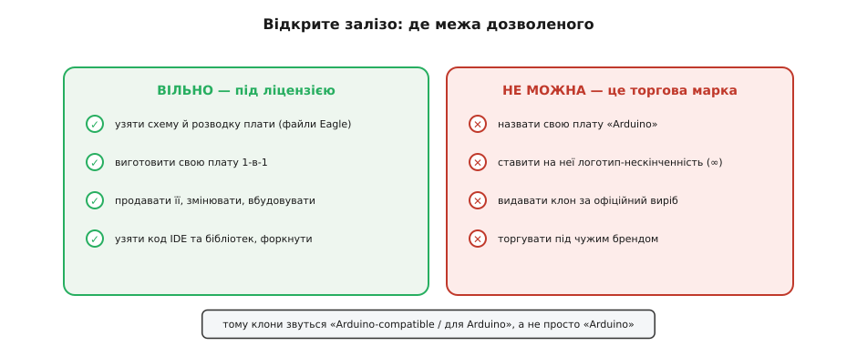
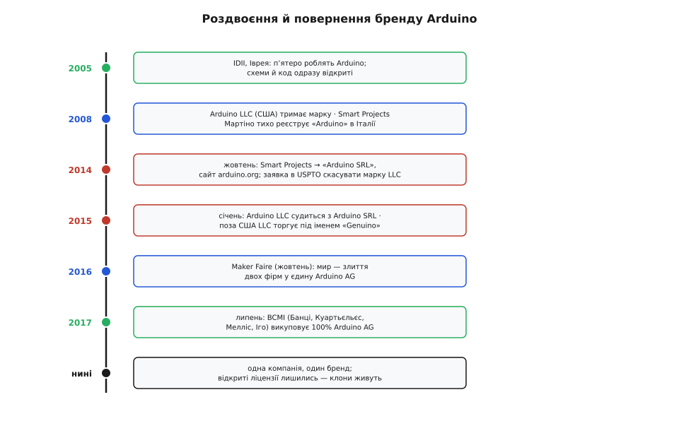

# 📜 Відкрите залізо — і чому «Arduino» мало не роздвоїлося

Є проста і трохи дивна річ, яку варто одразу назвати вголос: будь-хто на планеті може взяти офіційну плату Arduino, роздрукувати її схему, замовити такі самі друковані плати, напаяти ті самі чипи, продати результат — і не порушити жодного закону. Це не пірат­ство і не сіра зона. Це прямо дозволено самими авторами. Саме тому на ринку живуть тисячі «Arduino-сумісних» плат за долар-два, тоді як офіційна коштує в рази більше й усе одно продається.

І з тієї самої відкритості виросла плутанина, яка одного дня перетворилася на судовий позов «Arduino проти Arduino» — коли дві різні компанії з однаковою назвою тягнули бренд у різні боки. Щоб зрозуміти, чому дешева плата з АліЕкспресу законно зветься «для Arduino», але не сміє зватися просто «Arduino», треба розібрати дві окремі речі, які легко сплутати: **відкриту ліцензію на конструкцію** і **торгову марку на ім'я**. Це різні юридичні тварини, і вся історія Arduino — про те, що буває, коли перше роздають, а друге забувають надійно закріпити.

## Що взагалі означає «відкрите залізо»

Коли інженер малює плату, у нього на виході не сама плата, а креслення: принципова схема (які ноги чипа куди йдуть), розводка (де на текстоліті лежать доріжки), перелік деталей. Це файли — колись у програмі Eagle, тепер частіше в KiCad. Плата — лише матеріальне втілення цих файлів; хто має файли, той може наробити скільки завгодно однакових плат.

Звичайна логіка виробника: ці файли — таємниця, комерційна цінність, конкуренти нехай мучаться самі. Arduino від самого початку зробив навпаки — **виклав креслення на загал під відкритою ліцензією**. Апаратну частину — під ліцензією Creative Commons Attribution-ShareAlike (CC BY-SA): бери, копіюй, зміню­й, продавай; єдине — зберігай ту саму відкриту ліцензію на похідне й зазнач авторство оригіналу. Програмну частину — під ліцензіями вільного софту: середовище розробки (IDE) під GPL, бібліотеки для мікроконтролера — під м'якшою LGPL, яка дозволяє лінкувати їх навіть у закритий власний код.

> 🔧 **Навіщо це.** Різниця ліцензій на код не випадкова. GPL «заразна»: якщо вона в програмі, весь продукт мусить бути відкритий. Для середовища розробки це нормально — воно окремий інструмент. Але бібліотеки (`digitalWrite()`, `Serial`, `Wire`) вкомпоновуються у *твою* прошивку. Якби вони були під GPL, кожен скетч, який їх викликає, довелося б відкривати. LGPL спеціально це послаблює: бібліотеку можна лінкувати в закриту прошивку, не відкриваючи власний код. Тому фірма може продати комерційний прилад на Arduino-бібліотеках і не показувати нікому свою прошивку. Вибір LGPL тут свідомий, а не єдино можливий: вендорні SDK інших платформ знімають те саме питання дозвільною ліцензією — ESP-IDF і Zephyr ідуть під Apache 2.0, драйвери STM32 HAL і LL — під BSD-3-Clause, і там про «заразність» не йдеться взагалі. Arduino ж починав з вільного табору, тож мусив узяти саме послаблену GPL, щоб не змусити кожного користувача відкривати прошивку.

Практичний наслідок відкритого заліза видно на будь-якій дешевій платі. Клони UNO й Nano — це не «схожі» плати, а буквально та сама конструкція, часто піксель у піксель повторена розводка, з тими самими чипами ATmega328P. Виробник клону нічого не крав: він узяв опубліковані файли, які автори свідомо роздали. Різниця між офіційною платою і клоном — не в схемі (вона одна), а в дрібницях виготовлення (якість пайки, чи справжній USB-міст чи дешевша заміна CH340) і, головне, в імені на платі.

## Де межа: конструкцію можна, ім'я — ні

Ось лінія, яку відкрита ліцензія проводить чітко.

*Ліва половина — вільна під ліцензією; права — торгова марка, чужа власність.*

Ліворуч усе, що покриває CC BY-SA і вільні ліцензії коду: узяти схему й розводку, виготовити плату один-в-один, продавати її, змінювати під себе, форкнути середовище й бібліотеки. Це роздано.

Праворуч — те, чого відкрита ліцензія **не** віддавала й ніколи не мала на меті віддати: назву «Arduino» і фірмовий логотип (та сама стилізована нескінченність — знак ∞). Це **торгова марка** (англ. trademark) — окреме право, яке живе за іншими законами, ніж авторське право на креслення. Марка існує рівно для того, щоб покупець бачив ім'я на товарі й знав, від кого товар. Дозволити копіювати ще й ім'я — означало б дозволити видавати чужий виріб за свій; тоді марка втрачає сенс.

Тому клон законно зветься «Arduino-compatible» («сумісний з Arduino») або «плата для Arduino» — так виробник чесно каже: конструкція та сама, працює з тим самим середовищем, але фірма інша. А назвати клон просто «Arduino» чи ляпнути на нього логотип-нескінченність — уже порушення марки, хоча сама плата зроблена цілком законно. Одна плата, дві різні речі: **залізо вільне, ім'я — ні**.

> 🔧 **Навіщо це.** Ця межа рятує від двох протилежних дурниць. Без відкритого заліза не було б дешевих плат і мільйонів людей, що ввійшли в електроніку через п'ятидоларову підробку UNO. Без захисту марки будь-хто ліпив би «Arduino» на брак, репутація імені розчинилась би, і слово перестало б хоч щось гарантувати. Живий баланс: конструкцію роздали, щоб множилася; ім'я лишили, щоб означало.

## Звідки взялося саме слово «Arduino»

Перш ніж дійти до того, як за це слово судилися, варто знати, звідки воно.

Проєкт народився близько 2005 року в Італії, у містечку Іврея (Ivrea) на півночі країни, у школі, яка звалася **Interaction Design Institute Ivrea** (IDII) — інститут дизайну взаємодії. Там викладав італієць **Массімо Банці** (Massimo Banzi), і йому потрібен був простий, дешевий інструмент, щоб студенти-дизайнери (не інженери!) могли оживляти свої об'єкти — блимати світлодіодом, крутити моторчик, читати датчик — не занурюючись у складну електроніку.

Назву взяли не з латини й не з абревіатури. У тій же Іврезі був бар, куди Банці з колегами ходив — **«Bar di Re Arduino»**, тобто «Бар короля Ардуїна». Бар названо на честь історичної особи: **Ардуїн Іврейський** (італ. *Arduino d'Ivrea*), маркграф, якого 1002 року проголосили королем Італії; королем він пробув, з перервами, до 1014-го, коли його остаточно витіснив германський король Генріх II. Тобто слово «Arduino» — це чоловіче ім'я середньовічного італійського короля, що через назву бару перейшло на плату. *(Звірено: етимологія від «Bar di Re Arduino» й особа Ардуїна Іврейського підтверджені; це усталений факт, а не легенда.)*

Технічно ж Arduino не постав із порожнечі. Він виріс із двох попередніх проєктів тієї ж школи. Спершу був **Processing** — мова й середовище для художників, щоб легко програмувати графіку (його зробили Кейсі Ріс (Casey Reas) і Бен Фрай). Потім колумбієць **Ернандо Баррагáн** (Hernando Barragán) у своїй магістерській роботі в IDII близько 2003 року зробив **Wiring** — по суті «Processing для заліза»: те саме дружнє середовище й синтаксис, але для мікроконтролера, з керівниками роботи Массімо Банці й Кейсі Рісом. Arduino — це відгалуження (fork) від Wiring: та сама модель `setup()`/`loop()`, той самий C++-подібний діалект, але з прицілом на дешевше залізо й ширший загал. Тому, коли кажуть «мова Arduino», строго це не окрема мова — це C++ плюс набір бібліотек, коріння яких — у Wiring і Processing.

> 🔧 **Навіщо це.** Ця родовід пояснює, чому Arduino такий, який є. Його робили не для інженерів, а для дизайнерів і художників, яким електроніка була засобом, а не ціллю. Звідси одержимість простотою: дві функції `setup()` і `loop()`, `digitalWrite(13, HIGH)` замість роботи з регістрами, готові плати без паяльника. Підняти ногу у високий стан — на будь-якому мікроконтролері це врешті запис у регістр порту; різниця лише в тому, скільки шарів лежить між тобою й цим записом: у STM32 треба спершу ввімкнути тактування порту, налаштувати `MODER` і аж тоді писати в `BSRR`, в ESP-IDF — викликати `gpio_config()` і `gpio_set_level()`, а Arduino згорнув усе це в один рядок, заплативши контролем над деталями. І звідси ж відкритість — академічне середовище IDII мислило категоріями спільного знання, а не комерційної таємниці.

## Заснування двох речей одразу — і закладена міна

Тут починається зав'язка суперечки, і важливо назвати всіх учасників, бо потім однакові прізвища плутатимуться.

На початку 2008 року п'ятеро співзасновників оформили компанію **Arduino LLC**, зареєстровану в США. Її завдання було саме тримати права на бренд — торгові марки, пов'язані з іменем Arduino. П'ятеро — це:

- **Массімо Банці** (Massimo Banzi) — італієць, ідейний лідер;
- **Давід Куартьєльєс** (David Cuartielles) — іспанець;
- **Том Іго** (Tom Igoe) — американець;
- **Девід Мелліс** (David Mellis) — американець, який писав багато раннього софту;
- **Джанлука Мартіно** (Gianluca Martino) — італієць, який відповідав за виробництво.

Модель була така: Arduino LLC володіє іменем, а самі плати робить і продає **окрема** фірма Мартіно — **Smart Projects SRL** (SRL — італійський аналог ТОВ). За право робити фірмові плати Smart Projects платила Arduino LLC роялті — відрахування з кожної партії. Розумний, здавалося б, поділ праці: одні тримають бренд, інші крутять завод.

Але в цю конструкцію одразу вклали приховану міну. Наприкінці **2008 року** Джанлука Мартіно через свою Smart Projects **тихо зареєстрував торгову марку «Arduino» в самій Італії** — і не сказав про це решті співзасновників. За різними згадками, це лишалося таємницею близько двох років. Юридично вийшло роздвоєння: в США ім'я належало спільній Arduino LLC, а в Італії — особисто фірмі Мартіно. *(Звірено: заявку Smart Projects на італійську марку наприкінці 2008 року, поза відома інших засновників, наводить сам Банці; статус — тверде твердження зі свідчень сторони, документально дискусійне в деталях, але загальновизнане в хроніці.)*

> 🔧 **Навіщо це.** Ось де відкрите залізо показало свою вразливість, і урок ширший за саму Arduino. Автори щедро роздали конструкцію під CC BY-SA, але **найцінніше — ім'я — не закріпили однаково надійно по всьому світу** з першого дня. Реєстрація марки територіальна: марка в США не діє в Італії, і навпаки. Прогалину помітив той, хто був ближче до заводу, і зайняв її на себе. Коли роздаєш усе, крім імені, — саме ім'я треба тримати особливо міцно, бо на ньому тепер тримається все.

## «Arduino проти Arduino»: як спільна назва пішла в суд

Кілька років схема ще працювала, але під сподом визрівав конфлікт, і він був не лише про гроші — про різне бачення, чим Arduino має стати.

*Вертикальна вісь часу: спільний старт, роздвоєння в суді, злиття й викуп.*

З одного боку — Банці й решта трьох засновників хотіли **інтернаціоналізувати** бренд: вільно ліцензувати виробництво іншим фірмам по світу, рости вшир. З іншого — Мартіно (і згодом менеджер, що ввійшов у справу, **Федеріко Мусто** (Federico Musto)) тягли до іншого: тримати все виробництво в Італії, на своєму заводі, і вести компанію радше до біржі. Дві філософії однієї марки виявилися несумісними.

Прорвало 2014-го. **3 жовтня 2014 року** Smart Projects подала до патентного відомства США (USPTO) заяву **скасувати марку «Arduino», що належала Arduino LLC** — тобто спробувала юридично вибити ім'я з рук спільної компанії. Приблизно тоді ж, у листопаді 2014-го, Smart Projects **перейменувалася на «Arduino SRL»** і підняла сайт **arduino.org**, який зовні повторював оригінальний **arduino.cc**. Паралельно фірма **перестала платити роялті** спільній Arduino LLC за виготовлені плати. Виникла сюрреалістична ситуація: **дві компанії з майже однаковою назвою, два майже однакові сайти**, і кожна називає себе «справжньою Arduino». Покупець уже не міг сказати, де офіційна плата.

У відповідь **у січні 2015 року Arduino LLC подала позов проти Arduino SRL**. Почалася тяганина, яку спільнота охрестила «Arduino проти Arduino» — назва, від якої голова йде обертом, але юридично точна: обидві сторони мали право на ім'я на своїх територіях. *(Звірено: дата заяви до USPTO — 3 жовтня 2014; перейменування Smart Projects на Arduino SRL — листопад 2014; позов Arduino LLC — січень 2015. Статус — задокументовані факти з судових матеріалів і сучасних репортажів.)*

Щоб узагалі мати чим торгувати поза США, поки тривала суперечка, **у травні 2015 року Arduino LLC завела нову світову марку — «Genuino»**. Логіка проста: в Америці LLC лишалася «Arduino», а на решту світу продавала ті самі плати під іменем **Genuino** (гра на англ. *genuine* — «справжній»), щоб не зіштовхуватися з італійською маркою Мартіно. Тому колекціонери й досі трапляють на плати «Genuino UNO» — це не інша плата, а той самий виріб під тимчасовим іменем воєнного часу.

> 🔧 **Навіщо це.** «Genuino» — жива ілюстрація того, що марка територіальна, а конструкція — ні. Плата фізично та сама (відкрите залізо!), змінилося лише **ім'я**, і то лише там, де своє ім'я вже було зайняте. Це той самий поділ, з якого ми почали: залізо одне, а ім'я — юридична річ, що може мати різні значення в різних країнах.

## Мир: злиття в Arduino AG і викуп засновниками

Війна двох Arduino нікому не була вигідна — вона плутала покупців, дробила спільноту й палила гроші на юристів. Тому історія повернула до примирення у два кроки.

**Крок перший — злиття. 1 жовтня 2016 року**, на всесвітньому фестивалі **World Maker Faire** у Нью-Йорку, Массімо Банці (від Arduino LLC) і Федеріко Мусто (від Arduino SRL) вийшли й оголосили: дві компанії зливаються в одну. Нова єдина фірма дістала назву **Arduino AG** (AG — швейцарсько-німецька форма акціонерного товариства; компанію оформили у Швейцарії), і вона зібрала під собою всі марки Arduino по світу. Спільна назва знову стала спільною. Мусто на той момент став CEO об'єднаної компанії. *(Звірено: оголошення про злиття на World Maker Faire — 1 жовтня 2016; утворена Arduino AG, що тримає всі марки; статус — задокументований факт.)*

**Крок другий — викуп. У липні 2017 року** (оголошення від 28 липня) компанія **BCMI** викупила **100% Arduino AG** — усю фірму разом з усіма марками. За абревіатурою BCMI стоять чотири прізвища первісних співзасновників — **Банці (Banzi), Куартьєльєс (Cuartielles), Мелліс (Mellis), Іго (Igoe)**: ті самі четверо, що починали проєкт (без Мартіно, який до того часу відійшов). Массімо Банці став головою й технічним директором (chairman і CTO), а новим CEO призначили **Фабіо Віоланте** (Fabio Violante); Федеріко Мусто компанію залишив. Спільнота видихнула: ім'я знову опинилося в руках людей, що робили Arduino від початку і трималися відкритої моделі. *(Звірено: викуп BCMI 100% Arduino AG, оголошення 28 липня 2017; склад BCMI — Банці, Куартьєльєс, Мелліс, Іго; Банці — chairman/CTO, Віоланте — CEO, Мусто пішов. Статус — задокументований факт з офіційного блогу Arduino і галузевих джерел.)*

І тут ключове для нашої теми: **уся ця корпоративна буря не зачепила відкриті ліцензії**. Схеми плат лишилися під CC BY-SA, код IDE — під GPL, бібліотеки — під LGPL. Хто б не володів торговою маркою «Arduino», конструкцію вже роздали — і назад її не забереш. Тому екосистема клонів пережила і суд, і злиття, і викуп, ні на мить не спинившись: дешеві «Arduino-сумісні» плати як робили, так і роблять.

## Що з цього виносити

Ланцюжок причин і наслідків тут прямий. Автори **свідомо роздали конструкцію** під відкритими ліцензіями — і саме це породило масовість: мільйони людей увійшли в електроніку через дешеві клони, яких без відкритого заліза просто не існувало б. Та сама відкритість **лишила ім'я вразливим** там, де його не закріпили надійно, — і з прогалини виросло роздвоєння бренду, «Arduino проти Arduino», роки суду й тимчасове ім'я Genuino. Розв'язали це не скасуванням відкритості (її не чіпали), а **зведенням марки назад в одні руки** — злиттям у Arduino AG і викупом первісними засновниками.

Практичний висновок, який лишається з тобою щоразу, коли береш до рук плату: розрізняй дві речі під одним словом. **Конструкція** плати Arduino — вільна: клон робити законно, і дешева плата «для Arduino» — цілком чесний виріб. **Ім'я і логотип** Arduino — чужа торгова марка: право ставити їх має лише офіційна компанія. Плата, яка сумлінно зветься «Arduino-compatible», поважає обидві межі — бере вільно роздану конструкцію й не привласнює захищене ім'я. А історія про дві компанії з однаковою назвою — нагадування, що навіть найщедріша відкритість мусить лишити собі один твердий якір: ім'я, за яким люди впізнають, чиє це і чого варте.
