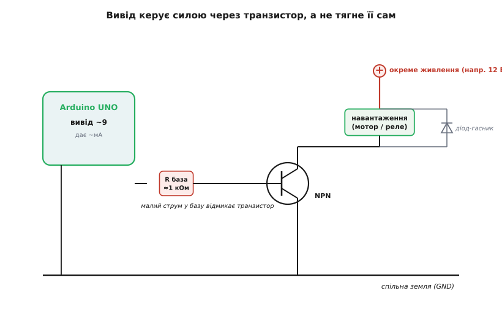

# ⚙️ API виводів Arduino UNO: керуємо світом із коду

<preknowlist>
- [ШІМ](topic:programming/pwm-on-mcu) — швидке ввімкнення-вимкнення, що в середньому дає «частинку» напруги; так регулюють яскравість і оберти.
- [АЦП](topic:electronics/adc) — як плавну напругу перетворюють на число; на UNO це 0…1023.
- [Плаваючий вхід і підтяжка](topic:electronics/floating-pullups) — чому не під'єднаний вхід ловить сміття й навіщо резистор-підтяжка.
- [Транзистор як вимикач](topic:electronics/bjt-switch) — як слабкий сигнал з виводу керує сильним струмом навантаження.
- [Логічні рівні як діапазони](topic:electronics/logic-levels-as-ranges) — що таке 5 В і 3.3 В логіка й чому їх не можна плутати наосліп.
</preknowlist>

Плата вже на столі, драйвер стоїть, у монітор порту летять перші байти. Лишається головне питання, заради якого UNO й купують: **як із рядка коду смикнути ніжку чипа так, щоб у реальному світі щось сталося** — засвітився світлодіод, крутнувся мотор, ожив давач. Ця стаття — практичний довідник саме з цього: повний набір функцій, якими скетч керує виводами ATmega328P, робочі скетчі під кожну задачу, і — головне — розуміння, **що насправді робить кожен виклик усередині** та де він тебе підставить.

Ключова думка, яку варто тримати в голові з самого початку: кожна знайома функція на кшталт `digitalWrite(13, HIGH)` — це **не магія, а тонка обгортка навколо запису в регістр чипа**. Бібліотека Arduino ховає від тебе десяток сторінок даташита ATmega328P, і робить це навмисне, щоб перший скетч писався за п'ять хвилин, а не за тиждень. Але щойно проєкт виростає — впираєшся в те, що обгортка коштує тактів, а іноді й заважає. Тому підемо так: спершу — як користуватися по-простому (бо так і треба в 95% випадків), а тоді — що там під капотом і коли це знання рятує.

## Задача перша: увімкнути й вимкнути — цифровий вивід

Найпростіше, що вміє вивід, — бути **виходом** і видавати одне з двох: 0 вольтів або 5 вольтів. Це і є «цифрове» керування: реле, світлодіод, логічний сигнал іншому чипу — усе, що має два стани.

Спершу виводу треба **оголосити напрям**. Вивід ATmega328P може бути або входом (слухає світ), або виходом (керує світом), і за замовчуванням після скидання **всі виводи — входи**. Тому в `setup()` пишемо `pinMode(pin, OUTPUT)`, і аж тоді `digitalWrite` має сенс.

```cpp
const uint8_t PIN_LED = 13;   // вбудований світлодіод сидить на виводі 13

void setup() {
    pinMode(PIN_LED, OUTPUT);   // вивід тепер керує світом
}

void loop() {
    digitalWrite(PIN_LED, HIGH);  // 5 В на виводі → світлодіод світить
    delay(500);                   // чекаємо 500 мс
    digitalWrite(PIN_LED, LOW);   // 0 В на виводі → гасне
    delay(500);
}
```

Це і є класичний «Blink» — найперший скетч у житті майже кожного. `HIGH` — це просто зручне ім'я для одиниці (5 В на виході), `LOW` — для нуля (0 В). `delay(500)` зупиняє програму на 500 мілісекунд, нічого більше в цей час не роблячи.

> 🔧 **Навіщо це.** `digitalWrite` на **вхід** (коли забув `pinMode(..., OUTPUT)`) не видає напругу, а лише вмикає-вимикає вбудовану підтяжку — і новачок годину дивиться, чому світлодіод не світить, хоча код «правильний». Правило: **кожному виводу-виходу — свій `pinMode(OUTPUT)` у `setup()`**. Забув — і замість твердих 5 В отримуєш кволу підтяжку, якої на світлодіод не вистачає.

### Що коштує `delay` — і чому його не люблять

`delay(500)` виглядає невинно, але робить дещо грубе: **чип на всі ці 500 мс завмирає намертво**. Він не читає кнопки, не опитує давачі, не відповідає по шині — просто крутить порожній цикл, рахуючи час. Для одного світлодіода байдуже. Але щойно в проєкті два діла одночасно (блимати світлодіодом **і** стежити за кнопкою), `delay` усе ламає: поки чекаємо — кнопку не чуємо.

Правильний спосіб робити кілька справ — не спати, а **дивитися на годинник**. Функція `millis()` повертає, скільки мілісекунд минуло від старту плати, і замість «поспати 500 мс» ми питаємо «а чи вже минуло 500 мс від минулого разу?»:

```cpp
const uint8_t PIN_LED = 13;
unsigned long lastToggle = 0;      // коли перемикали востаннє
const unsigned long PERIOD = 500;  // період блимання, мс
bool ledOn = false;

void setup() {
    pinMode(PIN_LED, OUTPUT);
}

void loop() {
    unsigned long now = millis();
    if (now - lastToggle >= PERIOD) {   // час перемкнути?
        lastToggle = now;
        ledOn = !ledOn;
        digitalWrite(PIN_LED, ledOn ? HIGH : LOW);
    }
    // тут loop() крутиться вільно — можна ще й кнопку читати, і давач опитувати
}
```

Різниця принципова: у першому варіанті між блиманнями чип **спав** і був глухий; у другому — `loop()` пролітає тисячі разів на секунду, лише зрідка перемикаючи світлодіод, а весь інший час вільний для інших справ. Це основний прийом, з якого починається будь-який неіграшковий скетч.

> 🔧 **Навіщо це.** Тип `unsigned long` для часу — не примха. `millis()` рахує мілісекунди й переповнюється (обнуляється) приблизно за **49 діб** безперервної роботи. Хитрість `now - lastToggle` з беззнаковою арифметикою пережене цей момент **правильно** — різниця лишиться коректною навіть у мить переповнення. Візьмеш `int` замість `unsigned long` — зламається вже за 32 секунди (бо `int` на UNO лише 16-бітний, стеля 32767).

## Задача друга: почути кнопку — цифровий вхід і його підтяжка

Тепер навпаки: вивід як **вхід**, що читає стан кнопки. Тут ховається пастка, на якій спотикаються всі, і зветься вона **плаваючий вхід**.

Наївна схема — один контакт кнопки на 5 В, другий на вивід — не працює надійно. Поки кнопку не натиснуто, вивід **ні до чого не під'єднаний**: він [«плаває»](topic:electronics/floating-pullups) і ловить наведення з повітря, читаючись то нулем, то одиницею випадково. Розв'язок — **підтяжка** (pull-up): резистор, що м'яко тримає вивід у певному стані, поки кнопка мовчить. І ATmega328P має такі резистори **вбудовано** — вмикаєш їх режимом `INPUT_PULLUP`, і жодного зовнішнього резистора не треба:

```cpp
const uint8_t PIN_BTN = 2;    // кнопка між виводом і землею
const uint8_t PIN_LED = 13;

void setup() {
    pinMode(PIN_BTN, INPUT_PULLUP);  // вхід + вбудована підтяжка до 5 В
    pinMode(PIN_LED, OUTPUT);
}

void loop() {
    // Підтяжка тримає «1»; кнопка замикає вивід на землю → натиснуто = LOW.
    bool pressed = (digitalRead(PIN_BTN) == LOW);
    digitalWrite(PIN_LED, pressed ? HIGH : LOW);
}
```

Схема така: кнопка стоїть між виводом і **землею**. У спокої підтяжка тягне вивід до 5 В — `digitalRead` дає `HIGH`. Натиск замикає вивід на землю — `digitalRead` дає `LOW`. Тому логіка **перевернута**: натиснуто — це `LOW`. Спершу це збиває з пантелику («тисну — а нуль?»), але це прямий і неминучий наслідок схеми з підтяжкою до плюса. Прийми його як норму: на UNO кнопки читають саме так, бо це найпростіша й найнадійніша схема — без зовнішніх деталей.

> 🔧 **Навіщо це.** Є ще режим `INPUT` (без підтяжки) — але тоді підтяжку **мусиш поставити сам**, зовнішнім резистором на 10 кОм до 5 В або до землі. Забудеш — отримаєш той самий плаваючий вхід і випадкові спрацювання. Тому для кнопок майже завжди беруть `INPUT_PULLUP`: одне слово в коді замість деталі на платі. Голий `INPUT` лишають для сигналів, у яких джерело **саме** тримає чіткий рівень (вихід іншого чипа, компаратора).

### Брязкіт контактів: чому один натиск чип бачить десятком

Скетч вище працює для «світить, поки тримаю». Але спробуй зробити «клац — перемкнути стан лампи», і воно почне поводитися шалено: один натиск то перемикає, то ні, то тричі поспіль. Причина фізична — **брязкіт контактів** (contact bounce).

Механічна кнопка не замикається чисто. Пружні металеві пластинки в мить контакту **кілька мілісекунд деренчать** — замикаються й розмикаються десятки разів, перш ніж заспокоїтись. Чип на 16 МГц устигає побачити кожне з цих тремтінь як окремий натиск. Ти натиснув один раз — програма нарахувала вісім.

Лікують це **усуненням брязкоту** (debounce): після того, як помітили зміну стану, трохи чекаємо й дивимося, чи стан устоявся. Найпростіший надійний спосіб — знову через `millis()`, ловлячи **фронт** (мить переходу) і ігноруючи зміни якийсь час після нього:

```cpp
const uint8_t PIN_BTN = 2;
const uint8_t PIN_LED = 13;

bool lampOn = false;              // стан лампи, що ми перемикаємо
bool lastReading = HIGH;          // попереднє сире читання (у спокої = HIGH)
unsigned long lastChange = 0;     // коли сире читання востаннє змінилось
const unsigned long DEBOUNCE = 25;  // «тиша», мс — довша за брязкіт

void setup() {
    pinMode(PIN_BTN, INPUT_PULLUP);
    pinMode(PIN_LED, OUTPUT);
}

void loop() {
    bool reading = digitalRead(PIN_BTN);

    if (reading != lastReading) {   // сире читання смикнулось — запускаємо відлік
        lastChange = millis();
        lastReading = reading;
    }

    // Стан устояв довше за DEBOUNCE і це фронт натиску (перехід у LOW)?
    static bool stable = HIGH;
    if (millis() - lastChange > DEBOUNCE && reading != stable) {
        stable = reading;
        if (stable == LOW) {              // саме натиск (не відпускання)
            lampOn = !lampOn;             // перемикаємо лампу
            digitalWrite(PIN_LED, lampOn ? HIGH : LOW);
        }
    }
}
```

Ідея проста: сире читання може деренчати скільки завгодно — щоразу, як воно смикається, ми **перезапускаємо таймер тиші**. Лише коли читання протрималося незмінним довше за `DEBOUNCE` (25 мс — з запасом довше за типовий брязкіт у кілька мс), ми віримо, що стан справжній. Ловимо перехід у `LOW` — це реальний натиск — і аж тоді перемикаємо лампу. Один фізичний клац дає рівно одне перемикання.

> 🔧 **Навіщо це.** 25 мс — не священне число: типовий брязкіт тактових кнопок 1–10 мс, тож будь-що в діапазоні 20–50 мс працює надійно й лишається непомітним для пальця. Візьмеш занадто мало (2–3 мс) — брязкіт подекуди проскочить; занадто багато (200 мс) — швидкі натиски почнуть губитися. Для дуже відповідальних входів той самий фільтр вішають на [апаратне переривання](topic:programming/interrupts), щоб не проґавити натиск між ітераціями `loop()`, — але для більшості задач опитування в циклі досить.

## Задача третя: виміряти плавну величину — аналоговий вхід

Кнопка знає лише «так/ні». Але фоторезистор, потенціометр, давач температури, повзунок — усі вони віддають **плавну напругу**, і її треба не просто відчути, а **виміряти числом**. Це вміють виводи `A0…A5` через вбудований [АЦП](topic:electronics/adc) — аналого-цифровий перетворювач.

`analogRead(pin)` бере напругу на виводі (від 0 до опорних 5 В) і повертає **число від 0 до 1023**. Чому саме 1023? Бо АЦП тут **десятибітний**: 10 біт дають 2¹⁰ = 1024 щаблі, від 0 до 1023. Нуль вольтів — це 0, п'ять вольтів — 1023, а все між ними — пропорційно.

```cpp
const uint8_t PIN_POT = A0;   // повзунок потенціометра на A0

void setup() {
    Serial.begin(9600);       // відкриваємо канал у монітор порту
}

void loop() {
    int raw = analogRead(PIN_POT);        // 0…1023
    float volts = raw * 5.0 / 1023.0;     // назад у вольти
    Serial.print("raw=");
    Serial.print(raw);
    Serial.print("  U=");
    Serial.print(volts, 2);               // 2 знаки після коми
    Serial.println(" V");
    delay(200);
}
```

Формула переведення в вольти варта того, щоб її розуміти, а не завчати:

```
крок АЦП  = 5 В / 1024 щаблів ≈ 0.00488 В ≈ 4.9 мВ на одиницю
напруга   = raw · 5.0 / 1023.0
```

Тобто кожна одиниця результату — це приблизно **5 мілівольтів**. Дрібніше UNO виміряти не може: це його роздільність. Ділимо на 1023 (а не 1024), бо максимальне число 1023 має відповідати повним 5 В.

> 🔧 **Навіщо це.** `analogRead` **повільніший** за `digitalRead` — одне вимірювання триває близько 100 мікросекунд, бо АЦП послідовно «зважує» напругу. Це майже завжди байдуже, але якщо в циклі опитувати вісім аналогових входів тисячі разів на секунду — набіжить помітна затримка. І ще: перше читання після перемикання на новий аналоговий вивід буває «брудним» (у АЦП лишається слід попередньої напруги) — у чутливих вимірах роблять два `analogRead` поспіль і беруть друге.

### Тонкість опорної напруги: що таке «5 В» для АЦП

За замовчуванням АЦП міряє **відносно живлення 5 В**. Звучить надійно, але живлення UNO від USB часто не рівно 5.0 В, а 4.7–4.9 — і всі виміри тихо «попливуть» на кілька відсотків. Для грубих задач байдуже; для точних є `analogReference()`, який дозволяє взяти опорою внутрішні стабільні **1.1 В** замість хиткого живлення:

```cpp
void setup() {
    analogReference(INTERNAL);   // опора = внутрішні 1.1 В (точніша, але вужчий діапазон)
    Serial.begin(9600);
}
```

Тоді 1023 відповідає вже 1.1 В, а не 5 В, — діапазон вужчий, зате стабільніший і дрібніший крок (≈1.1 мВ). Це беруть, коли міряють слабкі сигнали з давачів, які не доходять і до вольта. Плата за це — на такий вхід **не можна подавати понад 1.1 В**, інакше результат просто впреться в стелю 1023 і нічого не покаже.

## Задача четверта: плавно регулювати — ШІМ через `analogWrite`

Цифровий вихід дає лише 0 або 5 В — а що, як треба світлодіод **напівяскраво** або мотор на **половину обертів**? Справжньої «половини напруги» вивід видати не вміє. Але є хитрість: **швидко-швидко блимати** повними 5 В так, що навпіл часу вивід «увімкнено», навпіл «вимкнено» — і в середньому виходить ніби 2.5 В. Це [ШІМ](topic:programming/pwm-on-mcu) — широтно-імпульсна модуляція, і на UNO нею керує `analogWrite`.

`analogWrite(pin, value)` бере число **0…255** (тут 8 біт, не 10, як у `analogRead` — числа різні!) і задає **шпаруватість** (duty cycle): яку частку часу вивід тримає 5 В. 0 — завжди вимкнено, 255 — завжди ввімкнено, 127 — половину часу.

```cpp
const uint8_t PIN_LED = 9;    // світлодіод на ~9 (через резистор!)

void setup() {
    pinMode(PIN_LED, OUTPUT);
}

void loop() {
    // Плавно розгоряємось: 0 → 255
    for (int duty = 0; duty <= 255; duty++) {
        analogWrite(PIN_LED, duty);
        delay(5);
    }
    // ...і гаснемо назад
    for (int duty = 255; duty >= 0; duty--) {
        analogWrite(PIN_LED, duty);
        delay(5);
    }
}
```

Тут — головна пастка, підписана прямо на платі. **ШІМ уміють лише виводи, позначені тильдою `~`: це 3, 5, 6, 9, 10, 11** — рівно шість. Спробуєш `analogWrite` на вивід без `~` (скажімо, 7) — і замість плавності отримаєш звичайний цифровий вихід: `value` до 127 дасть `LOW`, від 128 — `HIGH`, і нічого посередині. Бо ці шість виводів прив'язані до апаратних **таймерів** чипа, які й генерують імпульси; решта виводів таймерів не має.

Частота цього блимання **не однакова** на всіх ШІМ-виводах, і це інколи важливо:

```
Виводи 5, 6         ≈ 980 Гц    (таймер 0)
Виводи 3, 9, 10, 11 ≈ 490 Гц    (таймери 2 і 1)
```

Для ока й для світлодіода різниця невидима — обидві частоти надто швидкі, щоб помітити миготіння. Але для мотора чи п'єзо-пищалки частота вже чутна, а для деяких давачів і драйверів — критична. Ці числа — не випадкові: вони випливають із того, як налаштовані таймери ATmega328P за замовчуванням.

> 🔧 **Навіщо це.** Виводи **5 і 6 сидять на таймері 0 — тому самому, що рахує `millis()` і `delay()`**. Тому міняти їхню ШІМ-частоту через регістри таймера **не можна безкарно**: зіб'ється весь відлік часу в скетчі. Якщо треба нестандартна частота ШІМ — бери виводи 9/10 (таймер 1) або 3/11 (таймер 2), а таймер 0 не чіпай. І пам'ятай різницю чисел: `analogWrite` — це **0…255**, `analogRead` повертає **0…1023**; переплутати їхні діапазони — типова помилка, коли значення з одного гониш прямо в інший без масштабування.

### Зшити вхід і вихід: яскравість від потенціометра

Складімо два вміння докупи — читаємо потенціометр і ним же керуємо яскравістю світлодіода. Тут спливає ще одна корисна функція — `map()`, що масштабує число з одного діапазону в інший:

```cpp
const uint8_t PIN_POT = A0;   // потенціометр
const uint8_t PIN_LED = 9;    // світлодіод на ~9

void setup() {
    pinMode(PIN_LED, OUTPUT);
}

void loop() {
    int raw = analogRead(PIN_POT);          // 0…1023 (10 біт)
    int duty = map(raw, 0, 1023, 0, 255);   // масштабуємо в 0…255 (8 біт)
    analogWrite(PIN_LED, duty);             // яскравість слідує за повзунком
}
```

`map(raw, 0, 1023, 0, 255)` бере число `raw` з діапазону вхідного АЦП (0…1023) і лінійно перекладає у діапазон ШІМ (0…255). Без нього довелося б ділити вручну (`raw / 4` дало б майже те саме), але `map` читається зрозуміліше й не помиляється на краях. Це найпростіший «регулятор»: крутиш ручку — плавно міняється яскравість.

## Задача п'ята: підглянути, що коїться всередині — `Serial` для налагодження

Плата не має екрана й не скаже, що думає, — доки ти не даси їй голос. Цей голос — **послідовний порт** (`Serial`): та сама лінія, якою заливається скетч, служить і зворотним каналом. Плата пише текст, а ти читаєш його в **моніторі порту** середовища. Це головний інструмент налагодження на UNO: `printf`-у тут немає, зате є `Serial.print`.

```cpp
void setup() {
    Serial.begin(9600);           // швидкість; така сама має стояти в моніторі
    Serial.println("Плата стартувала");
}

void loop() {
    int sensor = analogRead(A0);
    Serial.print("Сенсор: ");
    Serial.print(sensor);
    Serial.print(" (");
    Serial.print(sensor * 5.0 / 1023.0, 2);
    Serial.println(" В)");
    delay(500);
}
```

Різниця між `print` і `println` одна: `println` додає в кінці перехід рядка, `print` — ні. Тому кілька `print` поспіль складають один рядок, а `println` його завершує. Число `9600` — **швидкість у бодах** (біт за секунду); головне, щоб **така сама стояла в моніторі порту**, інакше замість тексту побачиш абракадабру. 9600 — повільно, але надійно; для рясного виводу беруть 115200.

> 🔧 **Навіщо це.** `Serial.print` **не безкоштовний**: поки байти течуть у порт, вони складаються в буфер, і якщо його забити виводом швидше, ніж лінія встигає віддавати, — `loop()` починає **притормаджувати**, чекаючи, поки буфер спорожніє. Тому не сипати `Serial.print` у кожній ітерації швидкого циклу без `delay` — це спотворює саму поведінку, яку налагоджуєш («працює з `print`, а без нього — ні» майже завжди означає, що `print` вносив затримку, за якою щось устигало). Виводь по ділу, а не суцільним потоком.

### Пастка SRAM: чому рядки їдять пам'ять і як їх урятувати макросом `F()`

Ось де ховається найпідступніша пастка UNO — і саме `Serial` найчастіше її й запускає. У ATmega328P лише **2 кілобайти SRAM** (оперативної пам'яті під змінні). А кожен рядок-літерал у лапках, як-от `"Сенсор: "`, за замовчуванням **займає місце і у Flash, і в SRAM одночасно** — бо копіюється в оперативну пам'ять при старті, щоб звідти його читати.

Порахуймо. Десяток `Serial.print` з написами по 15–20 символів — це вже 200–300 байт SRAM, з'їдених самими текстами, ще до жодної корисної змінної. А два кілобайти вичерпуються швидше, ніж здається: коли лишається менш як кількасот вільних байтів, стек і купа наповзають одне на одного, і плата починає **збоїти без видимої причини** — підвисати, перезавантажуватись, видавати сміття. Це найчастіша прихована причина «плата зійшла з розуму»: не помилка логіки, а **переповнення SRAM**.

Рятунок — макрос `F()`. Обгортаєш ним рядок — і той лишається **тільки у Flash**, а в SRAM не копіюється:

```cpp
void loop() {
    int sensor = analogRead(A0);
    Serial.print(F("Сенсор: "));           // рядок живе у Flash, SRAM вільна
    Serial.print(sensor);
    Serial.println(F(" одиниць АЦП"));      // і цей теж
    delay(500);
}
```

Різниця у витратах разюча: без `F()` рядок `"Сенсор: "` з'їдає 8 байт дефіцитної SRAM; з `F()` — **нуль байтів SRAM**, лише Flash (якого 32 КБ — значно більше). Правило просте: **кожен текстовий літерал, який лише виводиться (не змінюється), обгортай у `F()`**. Це одна з тих звичок, що відрізняють скетч, який «випадково падає раз на годину», від того, що працює місяцями.

Коли ж у Flash треба покласти не рядок, а **велику таблицю чисел** (шрифт для дисплея, крива калібрування, мелодія), для цього є `PROGMEM`:

```cpp
#include <avr/pgmspace.h>

// Таблиця з 256 значень гами — лежить у Flash, а не в SRAM
const uint8_t gamma[256] PROGMEM = {
    0, 0, 0, 0, 0, 1, 1, 1, /* ... ще 248 значень ... */ 255
};

void loop() {
    uint8_t raw = analogRead(A0) >> 2;         // 0…255
    uint8_t corrected = pgm_read_byte(&gamma[raw]);  // читаємо з Flash
    analogWrite(9, corrected);
}
```

Тонкість: до даних у `PROGMEM` **не можна звертатися напряму** (`gamma[raw]` дасть сміття) — їх дістають спеціальною функцією `pgm_read_byte`. Це трохи менш зручно, зате таблиця на 256 байт не забирає ані байта SRAM. Для UNO, де кожен байт оперативної пам'яті на рахунку, `PROGMEM` для великих сталих таблиць — не оптимізація, а необхідність.

> 🔧 **Навіщо це.** Середовище після компіляції пише два числа: скільки Flash і скільки **динамічної пам'яті** (SRAM) зайнято глобальними змінними. Друге число — те, за чим стежать. Якщо воно під 80–90% ще до старту — бережися: місця під локальні змінні й буфери майже не лишилось, і плата впаде на першому ж довгому рядку. `F()` і `PROGMEM` — головні інструменти повернути SRAM під контроль.

## Задача шоста: керувати силою — навантаження через транзистор

Тепер найважливіше правило потужності, порушення якого спалює найбільше виводів. **Вивід UNO — це сигнал керування, а не джерело сили.** Він надійно віддає лише близько **20 мА** (абсолютна стеля 40 мА, за нею вивід руйнується). Цього досить на один світлодіод через резистор чи слабкий логічний сигнал — але **мотор, реле, стрічка світлодіодів просять сотні міліампер**, і причепити їх прямо до виводу означає або нічого не отримати, або спалити ніжку чипа.

Розв'язок класичний: вивід не живить навантаження сам, а лише **командує ним через [транзистор](topic:electronics/bjt-switch)** — маленький ключ, що слабким сигналом з виводу вмикає й вимикає сильний струм від окремого живлення. Вивід дає крихітний струм у базу транзистора; транзистор пропускає крізь себе великий струм навантаження. Сила йде від блока живлення, а не з чипа.


*Вивід через резистор бази (≈1 кОм) дає малий струм у базу NPN-транзистора; транзистор відмикає й пропускає великий струм від окремого джерела через навантаження. Діод-«гасник» поперек котушки (мотор, реле) відводить викид напруги в мить вимкнення, щоб той не пробив транзистор. Земля виводу, живлення й транзистора — спільна.*

Ось скетч, що керує мотором через транзистор — сам код такий самий простий, як блимання світлодіодом, бо вся сила винесена в залізо:

```cpp
const uint8_t PIN_MOTOR = 9;   // база транзистора через резистор ~1 кОм; вивід ~9 → можна ШІМ

void setup() {
    pinMode(PIN_MOTOR, OUTPUT);
}

void loop() {
    analogWrite(PIN_MOTOR, 180);   // ~70% обертів (ШІМ керує швидкістю)
    delay(2000);
    analogWrite(PIN_MOTOR, 0);     // стоп
    delay(1000);
}
```

Зверни увагу: код нічого не знає про струм мотора — він лише смикає базу транзистора сигналом 0…255. Уся потужність тече повз чип, від окремого джерела через транзистор. Вивід дає міліампери в базу — транзистор пропускає ампери в мотор. Оскільки взяли ШІМ-вивід `~9`, тим самим `analogWrite` регулюємо ще й **швидкість**.

Три речі, без яких ця схема псує залізо:

- **Резистор у базу** (≈1 кОм для звичайного NPN на кшталт 2N2222/BC547). Без нього база тягне з виводу неконтрольований струм — за межею 20 мА, і вивід страждає. Резистор ставить струм бази в безпечні рамки.
- **Спільна земля.** Мінус зовнішнього живлення, емітер транзистора й земля UNO **мусять бути з'єднані**. Інакше транзистор не має спільної точки відліку з виводом і не керується. Забути спільну землю — класична причина «схема зібрана правильно, а не працює».
- **Діод-гасник** поперек індуктивного навантаження (мотор, реле, електромагніт). У мить вимкнення котушка викидає різкий сплеск напруги зворотної полярності — без діода він пробиває транзистор. Діод (катодом до плюса живлення) замикає цей викид на себе. Для чисто резистивного навантаження (лампа розжарення, нагрівач) діод не потрібен.

> 🔧 **Навіщо це.** Для навантажень у кілька ампер (потужні мотори, довгі стрічки) беруть не біполярний транзистор, а **польовий (MOSFET) логічного рівня** — той відкривається прямо 5 вольтами з виводу й майже не гріється, бо має мізерний опір у відкритому стані. Для моторів, яким треба крутитися **в обидва боки**, ставлять готовий драйвер (H-міст, скажімо L298N чи DRV8833) — усередині ті самі транзистори, зібрані так, щоб міняти напрям струму. Але принцип незмінний: **вивід командує, силу дає окреме джерело через ключ**.

### Обмеження струму й правило світлодіода

Навіть для найслабшого навантаження — світлодіода — правило те саме, просто ключ не потрібен: між виводом і світлодіодом **завжди ставлять резистор**, типово 220–330 Ом. Без нього світлодіод тягне струм, обмежений лише власним падінням напруги, — це десятки міліампер, за межею робочих 20, і страждають обидва: і світлодіод, і вивід. Резистор ставить струм у безпечні рамки:

```
струм крізь світлодіод = (5 В − падіння на світлодіоді) / опір резистора
приклад (червоний, падіння ≈2 В, резистор 330 Ом):
  (5 − 2) / 330 = 3 / 330 ≈ 0.009 А = 9 мА   — безпечно, добре видно
```

Дев'ять міліампер — надійно в межах 20, світлодіод яскравий, вивід цілий. Це не «про всяк випадок», а обов'язкова частина схеми: [світлодіод](topic:electronics/led) без резистора на 5-вольтовому виводі — це коротке замикання через p-n перехід, яке псує все коло.

## Задача сьома: не спалити модуль — межа 5 В ↔ 3.3 В

Остання пастка не про струм, а про **напругу логіки**, і вона тихіша за інші — псує повільно, а не миттєво. ATmega328P працює на [5-вольтовій логіці](topic:electronics/logic-levels-as-ranges): його виходи видають 5 В, а входи очікують 5 В. Але **більшість сучасних давачів, дисплеїв і радіомодулів — 3.3-вольтові**. Подати 5-вольтовий сигнал UNO на 3.3-вольтовий вхід такого модуля часто означає **повільно псувати той модуль**: вхід не розрахований на зайві півтора вольта.

Напрями несиметричні, і це важливо:

- **UNO (5 В) → модуль (3.3 В):** небезпечно. 5 В на 3.3-вольтовий вхід — за межею його допуску. Потрібне **зниження рівня**: найпростіше дільником напруги на двох резисторах, надійніше — готовим перетворювачем рівнів (level shifter). Іноді рятує навіть послідовний резистор на 1–2 кОм, але дільник чи перетворювач — правильніше.
- **Модуль (3.3 В) → UNO (5 В):** зазвичай безпечно. ATmega328P читає **3.3 В як одиницю** (поріг «високого» в нього близько 3 В), тож сигнал з 3.3-вольтового виходу UNO розуміє без перетворення. Не завжди з запасом, але переважно працює.

Найпростіший знижувач 5 В → 3.3 В — [дільник напруги](topic:electronics/voltage-divider) на двох резисторах:

```
дільник 5 В → 3.3 В:  R1 = 1 кОм (згори), R2 = 2 кОм (знизу)
U_вих = 5 · R2 / (R1 + R2) = 5 · 2 / (1 + 2) = 5 · 2/3 ≈ 3.3 В
```

Сигнал UNO 5 В проходить крізь такий дільник і приходить на модуль уже як 3.3 В — безпечно. Але дільник **годиться лише для повільних однонапрямних ліній** (скажімо, керуючий сигнал): на швидкій шині він «розмиває» фронти, а для двонапрямних (як I²C) потрібен саме перетворювач рівнів, а не голі резистори.

> 🔧 **Навіщо це.** Перш ніж з'єднати UNO з новим модулем, знайди в його описі **робочу напругу логіки**. Написано `3.3V logic` або `3V3` — не чіпляй його виходи UNO напряму без зниження. Написано `5V tolerant` (терпить 5 В) — можна прямо, виробник це передбачив. Це найчастіше джерело «купив модуль, підключив за схемою — а він за тиждень помер»: не брак, а тихо вбитий 5-вольтовим сигналом вхід.

## Що під капотом: як бібліотека ховає регістри AVR

Тепер — обіцяне за лаштунками, бо саме тут ховається половина відповідей на «чому воно так». Кожна знайома функція — це обгортка навколо **прямого запису в регістр** ATmega328P. Розберімо на `digitalWrite`, і решта стане зрозумілою.

У чипа кожен фізичний вивід прив'язаний до біта у трьох спеціальних байтах-регістрах порту. Виводи згруповані в **порти** (B, C, D), і кожен порт має трійку регістрів:

```
DDRx  — напрям кожного виводу порту (1 = вихід, 0 = вхід)   ← це робить pinMode
PORTx — стан виходу (1 = 5 В, 0 = 0 В); а для входу — підтяжка
PINx  — сюди чип кладе зчитаний стан входів                 ← це читає digitalRead
```

Вбудований світлодіод на виводі 13 — це, якщо назвати по-чиповому, **біт PB5** (п'ятий біт порту B). Тому «увімкнути світлодіод 13» голою мовою AVR — це:

```cpp
DDRB  |= (1 << PB5);   // вивід 13 (PB5) — на вихід    ← замінює pinMode(13, OUTPUT)
PORTB |= (1 << PB5);   // вивід 13 → 5 В (світить)     ← замінює digitalWrite(13, HIGH)
PORTB &= ~(1 << PB5);  // вивід 13 → 0 В (гасне)       ← замінює digitalWrite(13, LOW)
```

`(1 << PB5)` — це число, у якому піднято лише п'ятий біт; `|=` вмикає цей біт, `&= ~` — гасить, не чіпаючи сусідніх. Оце і є те, що `digitalWrite(13, HIGH)` робить усередині — але не одразу. Бібліотека спершу **на льоту з'ясовує**, до якого порту й біта прив'язаний вивід «13» (бере це з таблиці відповідності), перевіряє аргументи, гасить ШІМ, якщо він на цьому виводі був увімкнений, і **аж тоді** робить той самий запис у `PORTB`. Через це `digitalWrite(13, HIGH)` виконується **кілька десятків тактів**, тоді як `PORTB |= (1 << PB5)` — **один-два такти**.

Для блимання світлодіодом ця різниця невидима — обидва варіанти миттєві на людський погляд. Але коли треба «загатити» біти по виводу **мільйон разів на секунду** (програмно згенерувати сигнал, швидко перекласти байти на вісім ніжок, вичавити з UNO протокол, на який бракує апаратного блоку) — десятки зайвих тактів на кожен запис стають стіною. Тоді пишуть прямо в регістри й отримують у десятки разів вищу швидкість.

Отже, чому бібліотека взагалі так робить, якщо це повільніше? Заради **простоти й переносності**. `digitalWrite(13, HIGH)` читається без даташита і **однаково працює** на UNO, на Nano, на Mega — хоч на цих платах вивід 13 сидить на різних портах і бітах чипа. Бібліотека ховає всю цю різницю за єдиним номером виводу. Ти платиш тактами — а виграєш тим, що не тримаєш у голові карту портів кожного чипа й пишеш скетч за п'ять хвилин. Це свідомий обмін, і для 95% задач він правильний: беруть прямий доступ до регістрів лише там, де вперлися у швидкість.

> 🔧 **Навіщо це.** Тепер зрозуміло, звідки взялися всі попередні дивовижі. **Тільки шість виводів уміють `analogWrite`** — бо лише вони прив'язані до апаратних таймерів, що генерують імпульси; решта портів таймерів не має, і бібліотека фізично не може видати на них ШІМ. **`analogWrite` на виводах 5/6 небезпечно чіпати** — бо це таймер 0, той самий, що рахує `millis()`. **`analogRead` повільний** — бо АЦП послідовно зважує напругу за десяток мікросекунд. Усе, що на поверхні виглядало як примхи бібліотеки, — це прямі наслідки того, як улаштований кремній ATmega328P. Знаєш залізо під обгорткою — і жодна пастка вже не заскочить зненацька.

## Зведення: сім задач, сім правил

Якщо стиснути весь цей API до пам'ятки, з якою не спалиш плату й не згаєш вечір на примарний баг:

- **Вихід** — `pinMode(pin, OUTPUT)` у `setup()`, тоді `digitalWrite(pin, HIGH/LOW)`. Забув `pinMode` — замість 5 В матимеш кволу підтяжку.
- **Кнопка** — `pinMode(pin, INPUT_PULLUP)`; натиснуто = `LOW` (перевернуто); для «клац-перемкнути» додай усунення брязкоту через `millis()`.
- **Плавна напруга** — `analogRead(A0)` дає **0…1023** (10 біт); одна одиниця ≈ 5 мВ.
- **Плавне керування** — `analogWrite(pin, 0…255)` (8 біт!) лише на **виводах з `~`** (3, 5, 6, 9, 10, 11); частота 490 або 980 Гц.
- **Голос плати** — `Serial.begin(9600)` + `Serial.print`; **та сама швидкість у моніторі**; текстові літерали обгортай у `F()`.
- **Сила** — вивід дає лише **20 мА**: мотор/реле/стрічку — через транзистор від окремого живлення (резистор у базу, спільна земля, діод поперек котушки); світлодіод — через резистор 220–330 Ом.
- **Напруга логіки** — UNO 5-вольтова: 5 В на 3.3-вольтовий модуль **псує** його; знижуй дільником чи перетворювачем рівнів.

І одна наскрізна думка під усім цим: **кожен виклик — обгортка над записом у регістр ATmega328P**. Проста поведінка на поверхні тримається на цілком конкретному кремнії під нею, і всі «дивацтва» API — лише його чесні наслідки. Тримайся семи правил — і синя платка слухатиметься коду роками.
