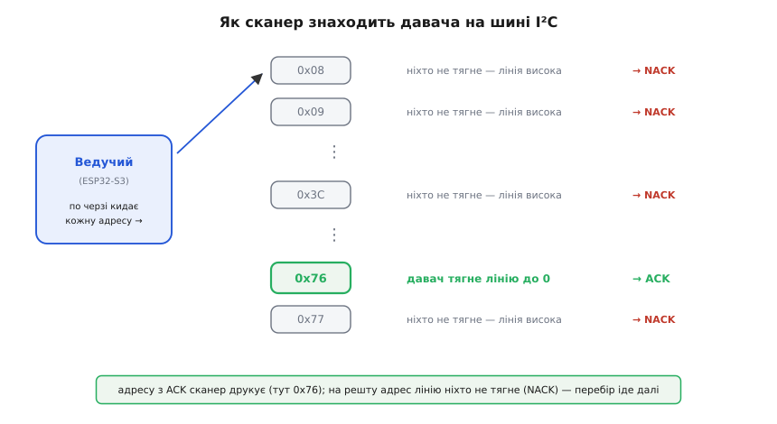

# ⚙️ ESP32-S3 SuperMini у коді: від першого прошивання до давача по I²C

Плату видно, виводи розкладені по поличках — тепер треба, щоб вона щось робила. Ця сторона задачі окрема від «що на платі»: тут не залізо, а прошивка. І саме тут крихітна плата ставить свої власні пастки, яких немає на звичайних Arduino: нативний USB, що іноді мовчить; шина I²C, яку треба вручну посадити на потрібні виводи; світлодіод, що слухає не рівень, а імпульси; аналоговий вхід, який пливе, щойно вмикається радіо.

Розберімо весь шлях по-справжньому: обрати плату в середовищі й залити перший образ, підняти шину I²C на `GPIO8`/`GPIO9` і знайти на ній давача, зчитати з нього реальні числа й показати їх у терміналі, блимнути вбудованим світлодіодом, зняти напругу з аналогового входу так, щоб Wi-Fi не зіпсував виміру. Весь код — справжній C/C++ під Arduino-ядро ESP32, який компілюється й працює, а не псевдокод «для ілюстрації».

## Задача: змусити плату говорити з комп'ютером

Почнімо з найменшої мети, бо на ній ламаються найчастіше: залити програму й побачити її вивід у терміналі. На класичній Arduino це тривіально — там окрема мікросхема-перехідник (CH340, FTDI) тримає послідовний порт незалежно від того, що робить головний чип. На ESP32-S3 такого перехідника **немає**: порт USB-CDC піднімає **сам чип** своїм апаратним блоком USB. Звідси й уся особливість — і зручність, і головна пастка новачка.

> 🔧 **Навіщо це.** Дев'ять із десяти скарг «код залився, а `Serial.print` мовчить» на S3 — це не мертва плата й не поганий кабель. Це вимкнений режим USB-CDC у налаштуваннях складання. Плата чесно виконує програму, просто нікуди не виводить, бо порт, у який пише `Serial`, не піднято. Знаючи це, ви не втратите вечір на «зламану плату».

### Ідея: обрати правильну плату й увімкнути USB-CDC

У середовищі (Arduino IDE чи PlatformIO) треба зробити рівно три речі правильно, і все запрацює.

Перше — **обрати саме S3**. У списку плат Arduino це «ESP32S3 Dev Module» (або конкретніша, як-от «ESP32-S3-DevKitC-1»). Не «ESP32 Dev Module» (це класичний ESP32), не «ESP32-C3». Різниця не косметична: у [сімействі ESP32](book:boards/esp32-family) моделі мають різні ядра й різну нумерацію виводів, тож образ, зібраний під не ту ціль, або не запуститься, або поводитиметься дивно.

Друге — **увімкнути USB-CDC on Boot**. У меню `Tools` є пункт «USB CDC On Boot»; постав його в **Enabled**. Саме він каже ядру підняти послідовний порт через нативний USB на старті. Без нього `Serial` пише в апаратний UART на якихось інших ногах, а не в USB-кабель — тому термінал і мовчить.

Третє — у самому скетчі писати саме `Serial` (не `Serial1`/`Serial2`), і швидкість у `Serial.begin()` збігати зі швидкістю термінала (типово 115200).

Ось найменша перевірка, що плата жива й говорить:

:::tabs
```cpp
void setup() {
  Serial.begin(115200);
  // S3 піднімає USB-CDC не миттєво; коротко дочекаємось порту,
  // але не вічно — щоб плата працювала й без відкритого термінала.
  unsigned long t0 = millis();
  while (!Serial && millis() - t0 < 2000) { /* чекаємо до 2 с */ }

  Serial.println();
  Serial.println("ESP32-S3 SuperMini живий.");
  Serial.printf("Чип: %s, ревізія %d, ядер: %d\n",
                ESP.getChipModel(), ESP.getChipRevision(), ESP.getChipCores());
  Serial.printf("Вільна купа: %u байт\n", ESP.getFreeHeap());
}

void loop() {
  Serial.printf("аптайм: %lu мс\n", millis());
  delay(1000);
}
```
```micropython
import machine
import gc
import time

# У MicroPython USB-CDC уже піднято до старту скрипта,
# а print() пише саме в нього — окремо чекати порту не треба.
print()
print("ESP32-S3 SuperMini живий.")
freq = machine.freq()  # тактова частота, Гц
print("Чип: ESP32-S3, частота: {} МГц".format(freq // 1_000_000))
print("Вільна купа: {} байт".format(gc.mem_free()))

while True:
    print("аптайм: {} мс".format(time.ticks_ms()))
    time.sleep_ms(1000)
```
:::

Рядок `while (!Serial ...)` — тонкість саме нативного USB. На платі з окремим перехідником `Serial` «готовий» одразу; тут порт з'являється лише коли операційна система підключилася до USB-пристрою, а це кількасот мілісекунд після старту. Якщо друкувати раніше — перші рядки підуть у нікуди. Але чекати `!Serial` **вічно** теж не можна: тоді плата, запущена від батарейки без комп'ютера, зависне назавжди на цьому рядку. Тому — з тайм-аутом.

### Складність і пастки прошивання

**Автоматичний вхід у режим прошивки зазвичай працює сам.** Інструмент заливання ([esptool](book:programming/flashing) під капотом) смикає керувальні лінії USB, і плата перемикається в завантажувач без рук. Але коли попередня прошивка зайняла USB під власні потреби, вимкнула USB-CDC або просто зависла в нескінченному циклі ще до ініціалізації USB — автоматика не спрацьовує, порт зникає, заливання падає з таймаутом. Тоді рятує **ручний вхід**, універсальний для всіх ESP32:

```
1. Затиснути й тримати BOOT   (кнопка тягне GPIO0 до землі).
2. Коротко натиснути RESET     (перезапуск чипа).
3. Відпустити BOOT.
   → чип на старті побачив GPIO0 = 0 → чекає образ по USB.
4. Залити. Після заливання натиснути RESET — старт нової програми.
```

Чому саме так, видно з механіки: `GPIO0` — стрепінг-вивід, чип **зчитує його рівень у мить скидання** й за ним вирішує, звідки завантажуватись. Низький рівень означає «чекай прошивку через USB». Кнопка BOOT просто притягує цей вивід до землі; RESET дає ту саму мить скидання, коли рівень читається. Тримаючи BOOT під час RESET, ви гарантовано заводите плату в завантажувач, хай там що робила стара прошивка.

**Друга пастка — той самий USB-CDC, але з іншого боку.** Буває, що після заливання термінал показує кашу з незрозумілих символів або зовсім тишу. Каша — це майже завжди неспівпадіння швидкості (термінал на 9600, а плата шле на 115200). Тиша — вимкнений USB-CDC on Boot або код, що пише в `Serial1`. І окремий дрібний біль нативного USB: якщо швидко закрити й відкрити термінал, порт іноді «залипає» й перестає віддавати — допомагає натиснути RESET на платі при відкритому терміналі.

## Задача: знайти давача на шині I²C

Тепер підключимо щось корисне. Найтиповіший вузол — дрібний давач по [шині I²C](book:communications/i2c-bus): дві лінії (дані SDA і такт SCL) плюс живлення й земля. Але перш ніж читати з давача осмислені числа, треба відповісти на просте питання, яке з'їдає більшість першого вечора: **а він узагалі відгукується, і за якою адресою?**

I²C влаштований так, що кожен пристрій на шині має свою 7-бітну адресу. Ведучий (наш ESP32) кидає в шину адресу й біт «читання/запис», а тоді слухає один такт: якщо пристрій із такою адресою є, він притягує лінію даних до нуля — це **підтвердження** (ACK). Якщо ніхто не відгукнувся, лінія лишається у високому — **відмова** (NACK). Ось і весь механізм, на якому будується **сканер шини**: перебрати всі можливі адреси від 0x08 до 0x77, на кожну спробувати почати передачу й подивитися, хто відповів ACK.


*Сканер перебирає адреси одну за одною. На «свою» адресу давач відповідає притягуванням лінії до нуля (ACK) — цю адресу сканер і друкує; на чужі адреси ніхто не тягне лінію, вона лишається високою (NACK), і сканер іде далі.*

### Ідея: підняти шину на потрібних виводах і перебрати адреси

Тут вилазить перша особливість ESP32 проти класичної Arduino. На Arduino Uno виводи I²C прибиті до конкретних ніг (A4/A5) і `Wire.begin()` без аргументів знає, куди йти. У ESP32 матриця вводу-виводу дозволяє повісити шину майже на будь-яку пару виводів — тому їх треба **назвати явно**. На SuperMini за домовленістю беруть пару `GPIO8`/`GPIO9`, бо так налаштована більшість прикладів:

:::tabs
```cpp
#include <Wire.h>

#define SDA_PIN 8
#define SCL_PIN 9

void setup() {
  Serial.begin(115200);
  while (!Serial && millis() < 2000) {}

  // Явно кажемо, які ноги — SDA і SCL, і на якій швидкості (100 кГц — стандарт).
  Wire.begin(SDA_PIN, SCL_PIN, 100000);
  Serial.println("Сканую шину I2C...");
}

void loop() {
  int found = 0;
  for (uint8_t addr = 0x08; addr <= 0x77; addr++) {
    Wire.beginTransmission(addr);         // готуємо звертання до adr
    uint8_t err = Wire.endTransmission(); // 0, якщо хтось відповів ACK
    if (err == 0) {
      Serial.printf("  знайдено пристрій за адресою 0x%02X\n", addr);
      found++;
    }
  }
  if (found == 0)
    Serial.println("  нікого. Перевір підтяжки, живлення й виводи.");
  Serial.println("---");
  delay(3000);
}
```
```micropython
from machine import Pin, I2C
import time

SDA_PIN = 8
SCL_PIN = 9

# Явно кажемо, які ноги — SDA і SCL, і на якій швидкості (100 кГц — стандарт).
i2c = I2C(0, sda=Pin(SDA_PIN), scl=Pin(SCL_PIN), freq=100000)
print("Сканую шину I2C...")

while True:
    # scan() сам перебирає адреси 0x08..0x77 і повертає ті, що відповіли ACK.
    devices = i2c.scan()
    if devices:
        for addr in devices:
            print("  знайдено пристрій за адресою 0x{:02X}".format(addr))
    else:
        print("  нікого. Перевір підтяжки, живлення й виводи.")
    print("---")
    time.sleep(3)
```
:::

Серце тут — пара `beginTransmission` / `endTransmission`. Перша лише **готує** звертання в пам'яті; друга реально виштовхує адресу в шину й повертає код: `0` означає, що на цю адресу хтось відповів ACK. Ми не шлемо жодного байта даних — сам факт ACK на адресу вже каже, що пристрій там сидить. Це найдешевша й найнадійніша перевірка «шина зібрана правильно».

> 🔧 **Навіщо це.** Сканер — перший інструмент, який запускаєш із будь-яким новим давачем, **перш ніж** підключати його бібліотеку. Якщо сканер бачить пристрій за адресою `0x76` — електрика ціла, підтяжки на місці, виводи ті. Якщо не бачить нікого — проблема в дротах чи живленні, і немає сенсу воювати з бібліотекою давача. Цей поділ економить години: ви точно знаєте, чи біда в залізі, чи в коді.

### Складність і пастки сканування

Три речі, на яких сканер «нікого не бачить», хоча давач начебто підключений:

**Забуті підтяжки.** Лінії SDA і SCL у стані спокою мусить хтось тримати у високому — це роблять підтяжкові резистори (~4.7 кОм) до 3.3 В. Без них лінія «висить» у невизначеному стані, ACK не читається, сканер мовчить. На готових модулях давачів (GY-BMP280 та подібних) підтяжки майже завжди вже впаяні — тому окремо їх не додають. Але якщо ви взяли голу мікросхему на макетці без модуля — підтяжок немає, і шина не працює.

**Не ті виводи.** Легко переплутати SDA зі SCL місцями або взяти чужу пару ніг зі старого посібника. Симптом однаковий — сканер мовчить. Тому виводи в коді (`GPIO8` = SDA, `GPIO9` = SCL) мають збігатися з дротами фізично.

**Живлення давача не з тієї рейки.** Логічні рівні ESP32 — 3.3-вольтові. Давач треба живити з виводу `3V3`, а не `5V`: якщо давач запитати п'ятьма вольтами, його лінії теж стануть 5-вольтовими, і високий рівень на SDA/SCL пошкодить вивід чипа. Це не лише про сканер — це про виживання плати взагалі.

## Задача: зчитати з давача реальні числа

Адресу знайдено — тепер витягнемо з давача осмислені виміри й покажемо їх у терміналі. Візьмемо для прикладу дуже поширений BMP280 — давач атмосферного тиску й температури фірми Bosch. Він добрий навчальний приклад, бо в ньому є все, на чому спотикаються: питання адреси, перевірка «чи це справді той чип», окрема бібліотека.

### Ідея: підключити бібліотеку, але спершу переконатися, що це той чип

Читати «сирі» регістри BMP280 руками можна, але немає сенсу — компенсація його показів вимагає купи калібрувальних коефіцієнтів і формул із даташита. Тому беруть готову бібліотеку (Adafruit BMP280). Але перед нею варто зробити один крок, який відсіює половину проблем: **прочитати регістр ідентифікації чипа**.

У BMP280 за регістром `0xD0` лежить незмінний **ідентифікатор чипа — значення `0x58`**. (Факт із даташита Bosch BMP280, ревізія документа 1.14; усталено.) Прочитавши цей байт вручну, ви за одну дію дізнаєтесь одразу три речі: давач відгукується, він за тією адресою, що ви думаєте, і це справді BMP280, а не схожий на нього BME280 (у того ідентифікатор `0x60` — і він додатково міряє вологість).

:::tabs
```cpp
#include <Wire.h>

#define SDA_PIN 8
#define SCL_PIN 9

// Типова адреса модуля GY-BMP280: SDO притягнутий до землі → 0x76.
// Якщо SDO на живленні (або в «рідному» виконанні Bosch) → 0x77.
#define BMP_ADDR 0x76
#define REG_ID   0xD0     // регістр ідентифікатора чипа
#define BMP280_ID 0x58    // очікуване значення для BMP280

// Прочитати один байт із регістра reg пристрою addr.
bool readReg(uint8_t addr, uint8_t reg, uint8_t &out) {
  Wire.beginTransmission(addr);
  Wire.write(reg);
  if (Wire.endTransmission(false) != 0)   // false: повторний старт, без стопу
    return false;                          // давач не відповів на адресу
  if (Wire.requestFrom(addr, (uint8_t)1) != 1)
    return false;                          // давач не віддав байт
  out = Wire.read();
  return true;
}

void setup() {
  Serial.begin(115200);
  while (!Serial && millis() < 2000) {}
  Wire.begin(SDA_PIN, SCL_PIN, 100000);

  uint8_t id = 0;
  if (!readReg(BMP_ADDR, REG_ID, id)) {
    Serial.printf("За адресою 0x%02X ніхто не відповідає. "
                  "Спробуй 0x77 і перевір дроти.\n", BMP_ADDR);
    return;
  }
  Serial.printf("Регістр 0x%02X = 0x%02X — ", REG_ID, id);
  if (id == BMP280_ID)      Serial.println("це BMP280, як і чекали.");
  else if (id == 0x60)      Serial.println("це BME280 (з вологістю), не BMP280!");
  else                      Serial.println("невідомий чип за цією адресою.");
}

void loop() {}
```
```micropython
from machine import Pin, I2C

SDA_PIN = 8
SCL_PIN = 9

# Типова адреса модуля GY-BMP280: SDO притягнутий до землі → 0x76.
# Якщо SDO на живленні (або в «рідному» виконанні Bosch) → 0x77.
BMP_ADDR = 0x76
REG_ID = 0xD0      # регістр ідентифікатора чипа
BMP280_ID = 0x58   # очікуване значення для BMP280

i2c = I2C(0, sda=Pin(SDA_PIN), scl=Pin(SCL_PIN), freq=100000)

# Прочитати один байт із регістра reg пристрою addr; None, якщо не відповів.
def read_reg(addr, reg):
    try:
        # readfrom_mem сам робить запис регістра + повторний старт + читання.
        data = i2c.readfrom_mem(addr, reg, 1)
    except OSError:
        return None       # давач не відповів на адресу
    return data[0]

chip_id = read_reg(BMP_ADDR, REG_ID)
if chip_id is None:
    print("За адресою 0x{:02X} ніхто не відповідає. "
          "Спробуй 0x77 і перевір дроти.".format(BMP_ADDR))
else:
    print("Регістр 0x{:02X} = 0x{:02X} — ".format(REG_ID, chip_id), end="")
    if chip_id == BMP280_ID:
        print("це BMP280, як і чекали.")
    elif chip_id == 0x60:
        print("це BME280 (з вологістю), не BMP280!")
    else:
        print("невідомий чип за цією адресою.")
```
:::

Тут `endTransmission(false)` — тонкість протоколу. Аргумент `false` означає «не відпускай шину, зроби **повторний старт**»: спершу ми пишемо номер регістра, який хочемо, а тоді, не відпускаючи шину, читаємо з нього. Якби ми відпустили шину (`true`) між записом адреси регістра й читанням, деякі давачі «забули» б, який регістр запитано. Це стандартний спосіб «прочитати регістр» по I²C.

Коли ідентифікатор підтверджено, підключаємо повноцінну бібліотеку й читаємо фізичні величини:

:::tabs
```cpp
#include <Wire.h>
#include <Adafruit_BMP280.h>

#define SDA_PIN 8
#define SCL_PIN 9
#define BMP_ADDR 0x76

Adafruit_BMP280 bmp;   // працює через глобальний Wire

void setup() {
  Serial.begin(115200);
  while (!Serial && millis() < 2000) {}
  Wire.begin(SDA_PIN, SCL_PIN, 100000);

  // begin сам прочитає ідентифікатор і поверне false, якщо чипа немає
  // або адреса не та — тому перевіряти результат обов'язково.
  if (!bmp.begin(BMP_ADDR)) {
    Serial.println("BMP280 не знайдено за 0x76. Пробую 0x77...");
    if (!bmp.begin(0x77)) {
      Serial.println("Не знайдено ні за 0x76, ні за 0x77. Перевір дроти.");
      while (true) delay(1000);   // далі йти нема сенсу
    }
  }

  // Розумні налаштування для метеозадачі: помірне усереднення, рідкі виміри.
  bmp.setSampling(Adafruit_BMP280::MODE_NORMAL,
                  Adafruit_BMP280::SAMPLING_X2,    // температура ×2
                  Adafruit_BMP280::SAMPLING_X16,   // тиск ×16 (точніше)
                  Adafruit_BMP280::FILTER_X16,
                  Adafruit_BMP280::STANDBY_MS_500);
  Serial.println("BMP280 готовий.");
}

void loop() {
  float tempC = bmp.readTemperature();     // °C
  float presPa = bmp.readPressure();       // Па
  float presHpa = presPa / 100.0f;         // гПа (мілібари) — звичніші одиниці

  Serial.printf("t = %.2f °C   p = %.1f гПа\n", tempC, presHpa);
  delay(1000);
}
```
```micropython
from machine import Pin, I2C
from bmp280 import BMP280   # micropython-bmp280
import time

SDA_PIN = 8
SCL_PIN = 9
BMP_ADDR = 0x76

i2c = I2C(0, sda=Pin(SDA_PIN), scl=Pin(SCL_PIN), freq=100000)

# Конструктор сам прочитає ідентифікатор і кине виняток, якщо чипа немає
# або адреса не та — тому перевіряти результат обов'язково.
try:
    bmp = BMP280(i2c, addr=BMP_ADDR)
except OSError:
    print("BMP280 не знайдено за 0x76. Пробую 0x77...")
    try:
        bmp = BMP280(i2c, addr=0x77)
    except OSError:
        print("Не знайдено ні за 0x76, ні за 0x77. Перевір дроти.")
        while True:
            time.sleep(1)   # далі йти нема сенсу

# Розумні налаштування для метеозадачі: помірне усереднення, рідкі виміри.
bmp.oversample(BMP280.OVERSAMPLE_16)   # тиск ×16 (точніше)
bmp.use_case(BMP280.BMP280_CASE_WEATHER)
print("BMP280 готовий.")

while True:
    temp_c = bmp.temperature        # °C
    pres_pa = bmp.pressure          # Па
    pres_hpa = pres_pa / 100.0      # гПа (мілібари) — звичніші одиниці

    print("t = {:.2f} °C   p = {:.1f} гПа".format(temp_c, pres_hpa))
    time.sleep(1)
```
:::

Числа виходять справжні: температура з точністю до сотих градуса, тиск у гектопаскалях (гПа) — тих самих одиницях, у яких дають атмосферний тиск у прогнозі погоди. Нормальний тиск на рівні моря — близько 1013 гПа; у горах і на верхніх поверхах він помітно нижчий, і саме на цій різниці BMP280 можна вживати як висотомір.

### Складність і пастки читання давача

**Не та адреса — головний крадій часу.** Це та сама пастка, що й зі сканером, але тут вона підступніша, бо бібліотека мовчки повертає `false` без пояснень. Модулі BMP280 бувають двох адрес: `0x76` (коли вивід SDO притягнутий до землі — так на більшості дешевих GY-модулів) і `0x77` (коли SDO на живленні, і це «рідне» типове значення Bosch). Якщо `begin(0x76)` не спрацював — це перше, що пробуєш поміняти. Саме тому в коді вище стоїть відкат на `0x77`.

**Плутанина BMP280 і BME280.** Вони майже однакові на вигляд і однакові по виводах, але BME280 додатково міряє вологість і має інший ідентифікатор (`0x60`). Бібліотека для BMP280 із BME280 працювати не буде (і навпаки). Перевірка ідентифікатора з попереднього кроку ловить цю плутанину миттєво.

**`begin()` без перевірки результату.** Найтиповіша помилка новачка — викликати `bmp.begin()` і одразу читати. Якщо давача немає, `read...` повертатимуть сміття або `NaN`, а програма не скаржиться. Тому результат `begin()` треба перевіряти **завжди** й не йти далі, якщо давача не знайдено.

## Задача: подати статус вбудованим світлодіодом

Поки давач читається, зручно показувати стан платою самою — зеленим при нормі, червоним при помилці. На SuperMini для цього є вбудований адресний світлодіод WS2812 на `GPIO48`. Але його не запалиш звичайним `digitalWrite`: він слухає не рівень напруги, а точну послідовність імпульсів.

### Ідея: один виклик замість власного бітбангу

WS2812 — це [адресний світлодіод](book:electronics/addressable-leds): усередині корпусу діода сидить крихітний контролер, що чекає на одному проводі потік бітів у власному часовому форматі (одиниця й нуль кодуються імпульсами різної довжини, з точністю до наносекунд). Формувати ці імпульси руками важко й крихко. На щастя, Arduino-ядро ESP32 має готову функцію, яка робить це апаратно через блок RMT:

:::tabs
```cpp
#define RGB_PIN 48   // вбудований WS2812 на SuperMini

void setup() {
  neopixelWrite(RGB_PIN, 0, 0, 0);   // згасити на старті
}

void loop() {
  neopixelWrite(RGB_PIN, 30, 0, 0);  // червоний
  delay(400);
  neopixelWrite(RGB_PIN, 0, 30, 0);  // зелений
  delay(400);
  neopixelWrite(RGB_PIN, 0, 0, 30);  // синій
  delay(400);
}
```
```micropython
from machine import Pin
from neopixel import NeoPixel
import time

RGB_PIN = 48   # вбудований WS2812 на SuperMini

np = NeoPixel(Pin(RGB_PIN), 1)   # один діод у ланцюжку

np[0] = (0, 0, 0)                # згасити на старті
np.write()

while True:
    np[0] = (30, 0, 0)           # червоний
    np.write()
    time.sleep_ms(400)
    np[0] = (0, 30, 0)           # зелений
    np.write()
    time.sleep_ms(400)
    np[0] = (0, 0, 30)           # синій
    np.write()
    time.sleep_ms(400)
```
:::

Підпис функції — `neopixelWrite(pin, R, G, B)`, де кожна складова кольору — байт `0..255`. Один виклик формує весь пакет імпульсів і засвічує діод. Числа беруть **малі** (30–40, не 255) з двох причин: діод дуже яскравий і на повній силі різить очі, а ще на повній яскравості він відчутно гріється й тягне більше струму — зайве навантаження на регулятор.

Практична обгортка для статусу читається як проза:

:::tabs
```cpp
#define RGB_PIN 48

void statusOk()    { neopixelWrite(RGB_PIN, 0, 30, 0); }  // зелений — усе добре
void statusBusy()  { neopixelWrite(RGB_PIN, 30, 20, 0); } // бурштин — працюю
void statusError() { neopixelWrite(RGB_PIN, 40, 0, 0); }  // червоний — помилка
void statusOff()   { neopixelWrite(RGB_PIN, 0, 0, 0); }   // згас
```
```micropython
from machine import Pin
from neopixel import NeoPixel

RGB_PIN = 48
np = NeoPixel(Pin(RGB_PIN), 1)

def _show(r, g, b):
    np[0] = (r, g, b)
    np.write()

def status_ok():    _show(0, 30, 0)    # зелений — усе добре
def status_busy():  _show(30, 20, 0)   # бурштин — працюю
def status_error(): _show(40, 0, 0)    # червоний — помилка
def status_off():   _show(0, 0, 0)     # згас
```
:::

### Складність і пастки світлодіода

**Плутанина порядку кольорів.** Формально аргументи — червоний, зелений, синій. Але фізично багато WS2812 очікують потік у порядку **G-R-B**, і на деяких платах/ревізіях ядра «червоний» на вигляд виходить зеленим і навпаки. Тому не дивуйтесь, якщо перший запуск дасть не той колір — просто переставте перші два числа місцями й запам'ятайте, як поводиться саме ваша плата. (Це відома невідповідність між документацією й реальним порядком байтів; статус — усталена практична поправка.)

**`GPIO48` не вільний.** Цей вивід зайнятий світлодіодом. Якщо повісити на нього ще й власний сигнал — буде конфлікт: або діод блиматиме сміттям, або ваш сигнал спотвориться. Світлодіод і його нога — «в комплекті», окремо ногу не забирайте.

**Крихкість при активному радіо.** Блок RMT, що формує імпульси, і Wi-Fi іноді б'ються за час процесора; у рідкісних випадках виклик `neopixelWrite` під час напруженого мережевого обміну може дати збій або короткий візуальний глюк. Для статусного діода це неважливо (моргнув не тим кольором — не біда), але покладатися на нього як на точний індикатор під час шторму пакетів не варто.

## Задача: зняти напругу аналоговим входом, не зіпсувавши її радіо

Останній типовий вузол — виміряти напругу: з дільника, потенціометра, аналогового давача. Тут ховається пастка, яку без знання неможливо вгадати, і вона коштує вечора: **вибір блоку АЦП при активному Wi-Fi**.

### Ідея: тільки ADC1, і не забути про 13-бітну роздільність

У ESP32-S3 два блоки [аналого-цифрового перетворювача (ADC)](book:electronics/adc) — ADC1 і ADC2. Здавалося б, байдуже, який брати. Але щойно вмикається Wi-Fi, радіодрайвер **забирає ADC2 собі**: живлення перерозподіляється всередині чипа на користь радіо, і будь-який вимір на ADC2 стає сміттям. (Усталено; описано в документації Espressif для ESP32-S3.) Тому правило залізне: **під час роботи мережі міряй лише виводами ADC1.**

На ESP32-S3 ADC1 сидить на `GPIO1`–`GPIO10` (канали ADC1_CH0..CH9), а ADC2 — на `GPIO11`–`GPIO20`. Отже, для аналогового виміру під Wi-Fi беремо вивід із діапазону `GPIO1`–`GPIO10` — і будемо спокійні. Це не порада «краще так», а вимога: інакше цифри попливуть саме тоді, коли ввімкнете зв'язок.

> 🔧 **Навіщо це.** Симптом цієї пастки — найпідступніший з усіх: аналоговий вивід «начебто працює» при перших пробах (Wi-Fi ще не піднято), ви радієте — а щойно програма виходить у мережу, виміри стають випадковими. Легко звинуватити давач, дільник, паяння — усе, крім справжньої причини. Правило «під радіо — лише ADC1» знімає цей клас багів наперед.

Друга тонкість, суто ESP32-S3: **типова роздільність АЦП у ядрі — 13 біт**, тобто `analogRead` повертає число `0..8191`, а не звичні `0..4095`, як на класичному ESP32 і Arduino. Якщо перерахувати сире значення в напругу за старою константою 4095 — отримаєте вдвічі занижений результат. Найнадійніше взагалі не рахувати вручну, а взяти `analogReadMilliVolts()`: ця функція повертає напругу одразу в мілівольтах, користуючись **калібрувальними даними, зашитими у чип на заводі** (eFuse). Це найточніший шлях без ручної арифметики.

:::tabs
```cpp
#include <WiFi.h>

// ADC1 на S3 — це GPIO1..GPIO10; беремо один із них.
#define ADC_PIN 3     // GPIO3 = ADC1_CH2 — придатний під активне радіо

void setup() {
  Serial.begin(115200);
  while (!Serial && millis() < 2000) {}

  // Розширюємо діапазон входу до повних ~3.3 В (найбільше згасання сигналу).
  analogSetAttenuation(ADC_11db);

  // Вмикаємо Wi-Fi, щоб показати: на ADC1 виміри лишаються чистими.
  WiFi.mode(WIFI_STA);
  WiFi.begin("SSID", "PASSWORD");   // підстав свою мережу
  Serial.println("Wi-Fi піднято; читаю ADC1...");
}

void loop() {
  int raw = analogRead(ADC_PIN);              // 0..8191 (13 біт на S3!)
  uint32_t mv = analogReadMilliVolts(ADC_PIN); // одразу мілівольти, з калібруванням

  Serial.printf("сире = %4d   напруга = %u мВ (%.3f В)\n",
                raw, mv, mv / 1000.0f);
  delay(500);
}
```
```micropython
from machine import Pin, ADC
import network
import time

# ADC1 на S3 — це GPIO1..GPIO10; беремо один із них.
ADC_PIN = 3     # GPIO3 = ADC1_CH2 — придатний під активне радіо

adc = ADC(Pin(ADC_PIN))
# Розширюємо діапазон входу до повних ~3.3 В (найбільше згасання сигналу).
adc.atten(ADC.ATTN_11DB)

# Вмикаємо Wi-Fi, щоб показати: на ADC1 виміри лишаються чистими.
wlan = network.WLAN(network.STA_IF)
wlan.active(True)
wlan.connect("SSID", "PASSWORD")   # підстав свою мережу
print("Wi-Fi піднято; читаю ADC1...")

while True:
    raw = adc.read()                # 0..8191 (13 біт на S3!)
    mv = adc.read_uv() // 1000       # мікровольти → мілівольти, з калібруванням

    print("сире = {:4d}   напруга = {} мВ ({:.3f} В)".format(
        raw, mv, mv / 1000.0))
    time.sleep_ms(500)
```
:::

Тут `analogSetAttenuation(ADC_11db)` розширює вхідний діапазон АЦП майже до повних 3.3 В (без згасання перетворювач бачить лише вужчу смугу близько вольта й «упирається в стелю» на вищих напругах). А `analogReadMilliVolts` уже враховує і згасання, і заводське калібрування — тому дає мілівольти, яким можна вірити, без множення на опорну напругу руками.

### Складність і пастки аналогового виміру

**ADC2 під Wi-Fi — головна.** Повторюся, бо це та сама помилка, що з'їдає найбільше часу: вивід із `GPIO11`–`GPIO20` під активним радіо дає сміття. Тримайтеся `GPIO1`–`GPIO10`.

**13-бітна роздільність зненацька.** Код, перенесений із класичного ESP32, що ділив сире значення на 4095, на S3 занизить напругу вдвічі. Або явно виставте `analogReadResolution(12)`, або — краще — користуйтеся `analogReadMilliVolts` і не рахуйте вручну взагалі.

**Верхня межа входу — 3.3 В, і ні вольтом більше.** Вивід АЦП не терпить напруги вище живлення чипа. Хочете виміряти більше (скажімо, напругу батареї 4.2 В) — поставте перед входом **дільник** із двох резисторів, щоб на ногу приходило не більш як 3.3 В, і домножте результат назад у коді. Подати на аналоговий вхід 5 В — пошкодити чип.

**Нелінійність по краях.** АЦП ESP32 помітно «бреше» біля самого нуля й біля стелі — там залежність відходить від прямої. Для точних вимірів тримайте робочу точку в середині діапазону (приблизно 0.2–3.0 В), а не тулітеся до країв.

## Що зібралося докупи

Пройшовши весь шлях, ми маємо повний практичний ланцюжок роботи з цією платою в коді: залити образ через нативний USB (обравши S3 і ввімкнувши USB-CDC), підняти шину I²C явним `Wire.begin(SDA, SCL, freq)` на `GPIO8`/`GPIO9`, знайти давача сканером за ACK, підтвердити чип за ідентифікатором `0x58`, зчитати з BMP280 реальні температуру й тиск, показати стан вбудованим WS2812 на `GPIO48` через `neopixelWrite`, і безпечно зняти напругу з ADC1 (`GPIO1`–`GPIO10`), не давши Wi-Fi зіпсувати вимір.

Кожен вузол ніс свою пастку, і всі вони не випадкові, а прямо ростуть із того, чим ця плата особлива: нативний USB (мовчазний `Serial`), гнучка матриця виводів (шину треба назвати руками), стрепінг-виводи (ручний вхід у прошивку), адресний світлодіод (імпульси замість рівня), і поділ ADC на два блоки, з яких один займає радіо. Тримаючи ці причини в голові, ви пишете під SuperMini впевнено — і не витрачаєте вечори на баги, яких можна не мати.
