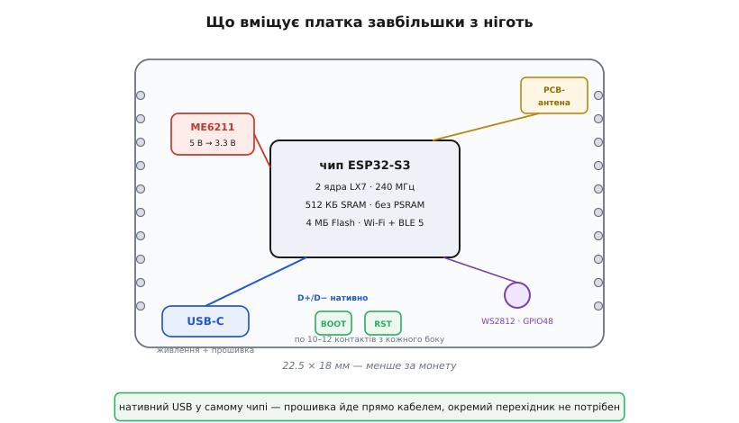
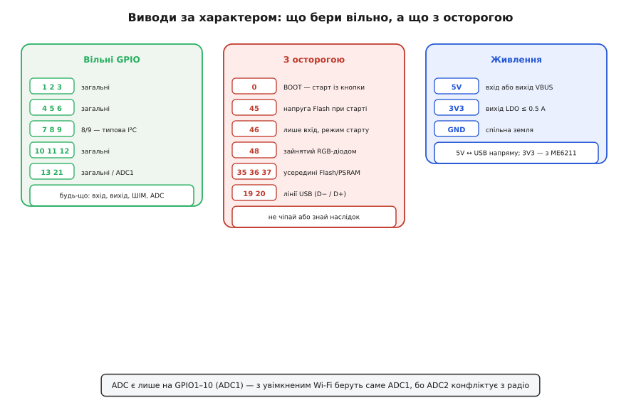
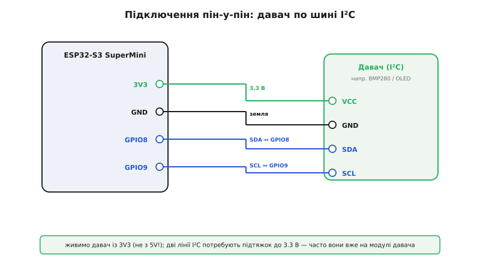

# ESP32-S3 SuperMini

<preknowlist>
- [Архітектура ESP32](topic:programming/esp32-architecture) — два ядра LX7, пам'ять на кристалі, зовнішня Flash, вбудоване радіо; що взагалі вміє цей чип.
- [Регістри GPIO](topic:programming/gpio-registers) — як вивід стає входом чи виходом і чому «безпечний» вивід — не забаганка.
- [Прошивання ESP32](topic:programming/flashing) — як образ потрапляє у Flash, звідки береться режим завантаження й роль виводу BOOT.
- [Нативний USB ESP32-S3](topic:programming/esp32-usb) — чому чипу не потрібен окремий USB-перехідник і що таке USB-CDC.
- [LDO — лінійний регулятор](topic:electronics/ldo) — як із 5 В роблять стабільні 3.3 В і чому в нього є межа струму.
- [Шина I²C](topic:communications/i2c-bus) — дві лінії, підтяжки, адреси; типовий спосіб причепити давач.
</preknowlist>

На долоні лежить прямокутник, коротший за ніготь великого пальця — вісімнадцять на двадцять два міліметри. З обох боків — гребінки контактів, знизу — гніздо USB-C, зверху край плати біжить зубчаста мідна доріжка. Це **ESP32-S3 SuperMini**: повноцінний комп'ютер із двома процесорними ядрами, радіо Wi-Fi і Bluetooth, чотирма мегабайтами пам'яті програм — усе на площі, меншій за поштову марку. Коштує він як чашка кави, а робить те, на що десять років тому потрібна була ціла плата з окремим модулем зв'язку.

Ця крихітність — і головна принада, і головна пастка. Принада: плата ховається де завгодно — у корпусі давача, у ручці приладу, всередині іграшки; живиться від будь-якого USB-заряджалки; прошивається одним кабелем без жодних перехідників. Пастка: виводів мало, частина з них зайнята внутрішніми справами чипа, а необережне поводження з двома-трьома з них зробить так, що плата взагалі не завантажиться. Розберімо цю плату так, щоб упізнати її серед десятка схожих, зрозуміти, що на ній є, як її під'єднати й де саме новачок набиває синці.

## Хто вона в родині ESP32

Напис «S3» — не марка, а поcoління й архітектура. У [сімействі ESP32](topic:boards/esp32-family) є кілька гілок, і плутати їх дорого: код і виводи не збігаються.

Серце SuperMini — чип **ESP32-S3**: два ядра Xtensa LX7 на частоті до 240 МГц. Два ядра тут не для краси — одне зазвичай тримає радіостек (Wi-Fi/Bluetooth крутиться безперервно й не любить, коли його переривають), а друге лишається вашій програмі. Від старших плат на класичному ESP32 (теж двоядерному) S3 відрізняється насамперед **нативним USB** просто в кремнії й апаратними блоками для нейромереж; від молодших **C3/C6** (одне ядро RISC-V) — саме другим ядром і більшою обчислювальною силою.

> 🔧 **Навіщо це.** Плутанина «S3 проти C3» — найчастіша помилка при купівлі. Вони однакові на вигляд і майже однаковою ціною, але C3 має **одне** ядро й іншу нумерацію виводів. Бібліотека, зібрана під S3, не запуститься на C3, а розводка з чужого посібника поламає вам логіку. Перше, що робиш із новою платою, — дивишся на напис коло чипа: `S3`, а не `C3` чи `C6`.

Конкретна модель кремнію на дешевих SuperMini — зазвичай варіант ESP32-S3 з **4 МБ Flash і без PSRAM** (додаткової оперативної пам'яті). Це важлива дрібниця: якщо ваш проєкт хоче велику картинку в пам'яті чи об'ємний буфер — на голому SuperMini її нема, лише 512 КБ вбудованої SRAM. Є дорожчі S3-плати з PSRAM, але це вже не «SuperMini» у типовому виконанні.

## Що на платі


*Уся плата — це чип у металевому екрані, антена, дрібний регулятор напруги й гніздо USB-C; сигнали USB ідуть у чип напряму, без перехідника. Червоно-зелено-синій світлодіод сидить на GPIO48, дві кнопки задають режим завантаження.*

Пройдімося по тому, що видно.

**Чип у металевій коробочці.** Це не окрема мікросхема, а екранований модуль: усередині — кристал ESP32-S3, кварцовий резонатор і мікросхема Flash-пам'яті на 4 МБ. Метал екранує радіо від завад і навпаки. Уся [обчислювальна начинка](topic:programming/esp32-architecture) — там: два ядра, контролери периферії, радіоблоки.

**Зубчаста доріжка на краю — це антена.** Ніякої окремої деталі: сама форма мідної доріжки на платі працює як **PCB-антена** для 2.4 ГГц. Звідси практичне правило: цей край плати не можна затуляти металом чи класти на землю — інакше Wi-Fi «осліпне». Хочете дальнього зв'язку — беріть версію з роз'ємом під зовнішню антену; на голому SuperMini антена вбудована й невелика.

**Гніздо USB-C.** Через нього плата і живиться, і прошивається. Головна зручність S3: USB підтримується **самим чипом**, тож [окремий перехідник USB-UART](topic:programming/esp32-usb) тут не потрібен — кабель іде прямо в кристал. Комп'ютер бачить плату як послідовний порт (USB-CDC), а за потреби — і як налагоджувач JTAG.

**Дрібна мікросхема живлення — ME6211.** Це [лінійний регулятор (LDO)](topic:electronics/ldo): бере 5 В із USB і робить із них 3.3 В, якими живиться чип. У нього є стеля струму — близько **500 мА** — і йому потрібно, щоб на вході було хоч на кількасот мілівольт більше за вихід. Це пряме обмеження на те, скільки ви можете взяти з виводу `3V3`.

**Кольоровий світлодіод.** На платі є **адресний RGB-світлодіод WS2812**, підвішений на `GPIO48`. Це один діод, керований одним проводом за протоколом точних імпульсів — та сама технологія, що й у стрічках [адресних світлодіодів](topic:electronics/addressable-leds). Ним зручно блимати статусом, але його вивід не вільний: `GPIO48` зайнятий саме цим діодом.

**Дві кнопки — BOOT і RESET.** `RESET` (іноді `EN`) перезапускає чип. `BOOT` — це кнопка на `GPIO0`; її стан у момент скидання каже чипу, звідки завантажуватись: із Flash чи з USB для прошивки.

## Виводи: що бери вільно, а що з осторогою

ESP32-S3 має багато ліній вводу-виводу, але на маленьку плату вивели не всі, а частина виведених **зайнята внутрішніми справами**. Наосліп хапати «будь-який вивід із номером» тут не можна — деякі при старті вирішують долю завантаження, інші фізично зашиті всередину чипа. Поділімо їх на три породи.


*Зелена колонка — виводи, які можна брати під будь-що. Червона — ті, що при старті чи всередині чипа мають власну роль: чіпати їх можна лише свідомо. Синя — живлення: 5V пов'язаний із USB напряму, 3V3 — вихід регулятора з обмеженням по струму.*

**Вільні виводи** — робоча конячка плати. Це `GPIO1`–`GPIO13` і `GPIO21` (точний набір залежить від партії — звіряйтесь із написами на платі). Будь-який із них — це [цифровий вивід](topic:programming/gpio-registers): вхід із підтяжкою чи без, вихід, канал ШІМ. Пару `GPIO8`/`GPIO9` за замовчуванням беруть під [шину I²C](topic:communications/i2c-bus) (SDA/SCL), бо так налаштована більшість прикладів.

**Виводи з осторогою** — ті, у кого є друга робота:
- **`GPIO0`** — це кнопка BOOT. Тримати на ньому щось, що притягує його до землі при старті, — значить випадково загнати плату в режим прошивки замість запуску програми.
- **`GPIO45` і `GPIO46`** — стрепінг-виводи: чип **зчитує їх рівень у момент скидання**, щоб вирішити напругу Flash і режим завантаження. Повісите на них зовнішній сигнал із «неправильним» рівнем при старті — плата не завантажиться. `GPIO46` до того ж **лише вхід**.
- **`GPIO48`** зайнятий RGB-світлодіодом.
- **`GPIO35`, `GPIO36`, `GPIO37`** на модулях із додатковою пам'яттю йдуть на внутрішню шину Flash/PSRAM — назовні їх не чіпають.
- **`GPIO19` і `GPIO20`** — це лінії даних USB (D− і D+). Поки ви прошиваєтесь і спілкуєтесь через USB-кабель, вони зайняті; віддати їх під власні сигнали можна, лише відмовившись від USB-зв'язку.

> 🔧 **Навіщо це.** Дев'ять із десяти історій «плата перестала прошиватись» — це якраз зайнятий стрепінг-вивід або підтяжка на `GPIO0`. Перш ніж вішати давач на конкретну ногу, спитай себе: ця нога вільна чи в неї є друга робота при старті? Свій давач вішай на зелену групу — і не буде дивних відмов завантаження.

**Виводи живлення** — три позначки:
- **`5V`** — це напряму **VBUS** із гнізда USB. Працює у два боки: коли плата на USB, тут є 5 В (можна живити зовнішній модуль); а можна, навпаки, **подати сюди 5 В** з іншого джерела й так живити плату без USB.
- **`3V3`** — **вихід** регулятора ME6211, ті самі стабілізовані 3.3 В. Звідси живлять давачі й модулі, але сумарно не більш як кілька сотень міліампер — стеля LDO.
- **`GND`** — спільна земля; без спільної землі між платою й будь-яким зовнішнім модулем нічого не працюватиме.

### Аналогові виводи — тонкість із радіо

Коли треба виміряти напругу (з дільника, потенціометра, аналогового давача), потрібен [аналого-цифровий перетворювач (ADC)](topic:electronics/adc). У ESP32-S3 їх два блоки — ADC1 і ADC2 — але з увімкненим Wi-Fi **придатний лише ADC1**: радіо забирає ADC2 собі, і виміри на ньому стають сміттям. На SuperMini це означає: для аналогових вимірів під час роботи мережі бери виводи, підключені до **ADC1** (це `GPIO1`–`GPIO10`). Дрібниця, на якій легко втратити вечір: аналоговий вивід «начебто працює», а щойно вмикається Wi-Fi — цифри пливуть.

## Живлення: три способи і одна пастка

Плату можна годувати трьома шляхами, і плутати їх небезпечно.

Найпростіший — **USB-C**: 5 В заходять на VBUS, ME6211 робить 3.3 В, усе живе. Так плата живиться під час розробки.

Другий — **подати 5 В на вивід `5V`** від зовнішнього джерела (акумулятор із перетворювачем, блок живлення). Оскільки цей вивід — прямий VBUS, він рівноцінний USB-живленню; тільки не роби так **одночасно** з підключеним USB від іншого джерела, щоб два джерела 5 В не боролися.

Третій — **подати вже готові 3.3 В прямо на вивід `3V3`**, обійшовши регулятор. Так живлять від літієвого акумулятора через власний регулятор чи від іншої 3.3-вольтової плати. Тут головне не подати сюди 5 В: `3V3` — це не вхід для п'яти вольтів, а рейка після регулятора, і 5 В на ній спалять чип.

> 🔧 **Навіщо це.** Пастка, що коштує спалених плат: вивід `5V` терпить п'ять вольтів, вивід `3V3` — ні. Переплутати їх легко, бо стоять поруч. Правило просте: **5 В — тільки на `5V`; на `3V3` — рівно 3.3 В або нічого.** І пам'ятай про стелю ME6211 у ~500 мА: якщо чіпляєш ненажерливий модуль (радіопередавач, стрічку світлодіодів, мотор), живи його **окремо**, а не з виводу `3V3` плати, інакше просядь напруги перезавантажить чип посеред роботи.

Окрема тонкість — **сплеск струму при передачі**. Wi-Fi у момент відправлення пакета смикає струм ривками в сотні міліампер. Якщо живлення кволе або дроти тонкі й довгі, ці ривки просаджують напругу, спрацьовує захист від просідання (brown-out), і плата йде на перезавантаження саме тоді, коли пробує вийти в мережу. Ліки — міцне живлення й керамічний конденсатор на кількасот мікрофарад поряд із платою, який згладжує ривки.

## Як прошивати

Тут S3 показує свою головну зручність. Оскільки [USB підтримує сам чип](topic:programming/esp32-usb), для [заливання прошивки](topic:programming/flashing) достатньо кабелю USB-C — жодних окремих перехідників, драйверів CH340 чи FTDI. Під'єднав, обрав у середовищі плату «ESP32-S3», порт — і залив.

Здебільшого чип входить у режим прошивки **сам**: інструмент заливання смикає керувальні лінії USB, і плата перемикається без рук. Але коли програма зависла, зайняла USB під себе або вимкнула USB-CDC у налаштуваннях — автоматика не спрацьовує, і тоді рятує **ручний вхід у режим завантаження**:

```
1. Затиснути й тримати кнопку BOOT (це GPIO0 на землю).
2. Коротко натиснути й відпустити RESET (перезапуск чипа).
3. Відпустити BOOT.
   → чип побачив GPIO0 = низький у момент старту → чекає прошивку через USB.
4. Залити образ; після заливання ще раз натиснути RESET — плата стартує з новою програмою.
```

Ця послідовність «тримаю BOOT, тицяю RESET, відпускаю BOOT» — універсальний прийом для всіх ESP32, і саме вона витягує плату, коли та «більше не прошивається». Причина майже завжди в тім, що попередня прошивка сама зайняла USB чи повісила стрепінг-вивід.

## Перша програма: блимнути RGB-світлодіодом

Найшвидший спосіб переконатися, що плата жива, — змусити її вбудований RGB-діод змінити колір. Він на `GPIO48` і слухає протокол WS2812 (точні імпульси), тож звичайним `digitalWrite` його не запалиш — потрібен один виклик із бібліотеки адресних діодів, яка вже є в ядрі ESP32 для Arduino:

:::tabs
```cpp
#define RGB_PIN 48   // вбудований WS2812 на SuperMini

void setup() {
  // зелений на повну; аргументи — GPIO, R, G, B (0..255)
  neopixelWrite(RGB_PIN, 0, 40, 0);   // не 255 — діод яскравий, 40 досить
}

void loop() {
  neopixelWrite(RGB_PIN, 40, 0, 0);   // червоний
  delay(500);
  neopixelWrite(RGB_PIN, 0, 0, 40);   // синій
  delay(500);
}
```
```micropython
from machine import Pin
from neopixel import NeoPixel
from time import sleep_ms

RGB_PIN = 48                          # вбудований WS2812 на SuperMini
np = NeoPixel(Pin(RGB_PIN), 1)        # один діод на цьому виводі

# зелений на повну; порядок — R, G, B (0..255)
np[0] = (0, 40, 0)                    # не 255 — діод яскравий, 40 досить
np.write()

while True:
    np[0] = (40, 0, 0)               # червоний
    np.write()
    sleep_ms(500)
    np[0] = (0, 0, 40)               # синій
    np.write()
    sleep_ms(500)
```
:::

Якщо діод блимає червоним і синім — плата працює, USB бачиться, прошивка зайшла. Це найкоротший тест «плата не мертва».

## Підключення давача по I²C

Найтиповіше практичне завдання — причепити до плати давач чи дисплей. Більшість дрібних давачів (тиску, температури, невеликі OLED-екрани) говорять по [шині I²C](topic:communications/i2c-bus): дві лінії даних плюс живлення й земля.


*Чотири дроти: живлення давача беремо з 3V3 (не з 5V!), земля спільна, а дві лінії I²C ідуть на пару GPIO8/GPIO9. Підтяжки двох ліній до 3.3 В зазвичай уже стоять на платі давача.*

Електрично все — чотири дроти:

```
SuperMini            Давач I²C (напр. BMP280 / OLED)
──────────────────────────────────────────────────
3V3    ───────────   VCC   (живлення давача — 3.3 В!)
GND    ───────────   GND   (спільна земля)
GPIO8  ───────────   SDA   (лінія даних)
GPIO9  ───────────   SCL   (лінія такту)
```

Ключова осторога — **живлення давача бери з `3V3`, а не з `5V`**: логічні рівні ESP32 — 3.3-вольтові, і давач має жити в тому самому світі напруг, інакше 5-вольтові рівні на лінії пошкодять вивід чипа. Дві лінії I²C потребують підтяжок до 3.3 В (резистори ~4.7 кОм); на готових модулях давачів вони майже завжди вже впаяні, тож окремо додавати їх зазвичай не треба.

Повний робочий приклад із бібліотекою — як увімкнути шину на цих виводах, знайти адресу давача, зчитати з нього дані й обійти типові пастки (не та адреса, не ті виводи, забуті підтяжки) — винесено в [окремий розбір коду](topic:boards/esp32-s3-supermini/api-supermini.md): там налаштування виводів через `Wire.begin`, сканер шини та готовий скетч читання давача.

## Куди її ставлять

Розмір і нативний USB роблять SuperMini природним вибором там, де мало місця, а треба зв'язок і трохи розуму. Мініатюрний давач у мережі — температура, вологість, рух — що шле дані по Wi-Fi. Пульт чи брелок на Bluetooth. Веб-сторінка просто з плати: S3 сам піднімає невеликий сервер, і телефон відкриває панель керування. Логер, що складає виміри у Flash. Скрізь, де класична плата на ATmega була б завелика й безрадіозв'язкова, а повнорозмірна плата ESP32 не влазить у корпус, SuperMini сідає ідеально.

Межі теж чіткі. Немає PSRAM — не для великих буферів зображень чи звуку. Вбудована антена невелика — не для дальнього зв'язку крізь стіни. Виводів небагато — під складний проєкт із десятками сигналів беруть повнорозмірну плату. І одне ядро завжди зайняте радіо: якщо Wi-Fi активний, ваша програма живе на другому ядрі й ділить час із мережевими справами.

## На що зважати, коли берете її до рук

Зведімо пастки, на яких новачок спотикається саме з цією платою:

- **Не переплутати з C3/C6.** Дивіться на напис `S3` коло чипа: у C-серії одне ядро й інша розводка, ваш код і схема не підійдуть.
- **`5V` і `3V3` — різні світи.** П'ять вольтів — тільки на `5V`; на `3V3` — рівно 3.3 В або нічого.
- **Стрепінг-виводи `GPIO0/45/46` — не для довільних сигналів.** Зайняли їх зовнішнім рівнем при старті — плата не завантажиться.
- **`GPIO48` зайнятий світлодіодом**, `GPIO19/20` — лінії USB; це не «вільні» ноги.
- **Для аналогу під Wi-Fi — лише ADC1** (`GPIO1`–`GPIO10`), інакше виміри попливуть.
- **Не затуляйте край з антеною** металом і не кладіть плату антеною на землю — зв'язок обірветься.
- **Живлення має бути міцне**: при передачі Wi-Fi струм смикає ривками; кволе живлення дає перезавантаження від просідання напруги.
- **«Не прошивається» лікується руками**: тримай BOOT, тицьни RESET, відпусти BOOT — і плата чекає прошивку.

Тримаючи ці вісім пунктів у голові, ви оминете майже всі граблі цієї плати — і отримаєте крихітний, дешевий і напрочуд здатний вузол зв'язку, який ховається де завгодно.
