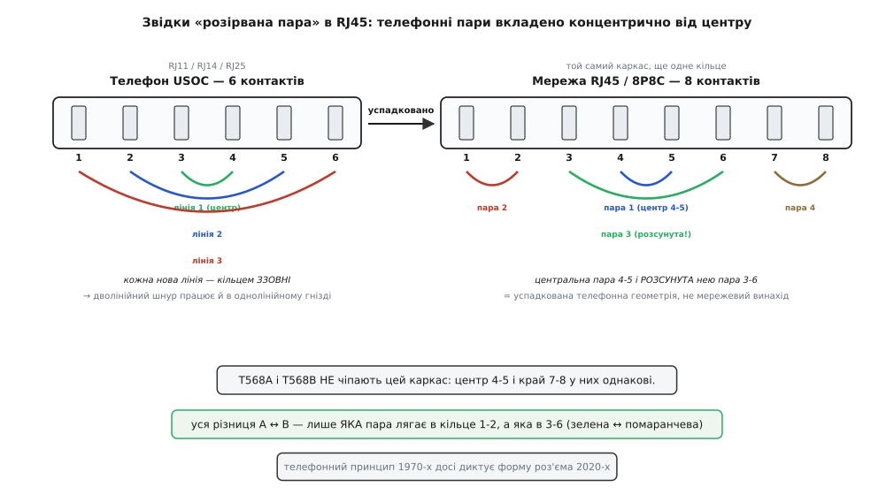

# 📜 Історія двох розводок: як телефон 1970-х досі диктує кольори в роз'ємі

Є питання, від якого в новачка спалахує підозра, що інженери щось наплутали. Стандарт розкладки восьми жил по восьми контактах RJ45 — чому їх **два**? T568A і T568B відрізняються лиш тим, що зелену й помаранчеву пари переставлено місцями. Електрично вони тотожні: кабель, розетка, комутатор працюють однаково, аби на обох кінцях лежав той самий варіант. Жоден із двох не швидший, не тихіший, не надійніший. То навіщо тримати два стандарти на те саме, ще й плутати ними монтажників по всьому світі?

Коротка відповідь: **бо один із них старший за самі комп'ютерні мережі**. T568B — це не рішення мережевих інженерів. Це закам'янілий слід телефонної проводки 1970-х, яку в 1990-х не наважилися викинути, бо нею вже були обплетені мільйони будівель. А T568A — спроба зробити «як правильно», що спізнилася на десять років і програла інерції. Ця стаття — про те, як так вийшло: хто, коли, у якій суперечці, і чому дві несумісні на вигляд розкладки насправді розповідають ту саму історію з різних кінців.

## Спершу — телефон, а не мережа

Щоб зрозуміти дві розводки, треба почати не з Ethernet, а з того, чого вже майже ніхто не пам'ятає: з розетки на стіні, у яку в 1970-х вставляли стаціонарний телефон.

До кінця 1960-х телефонна система США належала одній компанії — **AT&T** (American Telephone & Telegraph), а її дослідницьким серцем була **Bell Labs** (Bell Telephone Laboratories). І діяло залізне правило: жодного стороннього обладнання в мережу. Телефон вам давала компанія, дротом ви не володіли, розетку ставив монтажник AT&T — усе було їхнє від апарата до станції.

Це правило почало тріщати від двох судових та регуляторних ударів. Перший — справа **Hush-A-Phone v. United States** (1956): виробник простої пластикової насадки на мікрофон (щоб сусіди не чули розмови) відсудив право чіпляти її до телефона, і суд визнав, що абонент може користуватися своїм апаратом у спосіб, який мережі не шкодить. Другий, уже принциповий, — рішення **Carterfone** Федеральної комісії зв'язку США (FCC) 1968 року: воно дозволило під'єднувати до телефонної мережі стороннє обладнання загалом. *(Обидві справи — усталені факти історії зв'язку.)*

Ось тут і народжується наш герой. Якщо тепер будь-хто може принести свій телефон і встромити його в мережу, потрібен **стандартний, безпечний, документований роз'єм**, до якого це «будь-хто» під'єднається, не спаливши станцію. FCC запустила програму реєстрації абонентського обладнання (пізніше кодифіковану 1980 року в 47-й частині Зводу федеральних правил, Part 68). А Bell Labs розробила систему кодів для цих інтерфейсів — **USOC** (Universal Service Order Code, англ. «універсальний код замовлення послуги»). Самі роз'єми в ній назвали **registered jack** (англ. «зареєстроване гніздо») — «зареєстроване» саме тому, що інтерфейс проходив реєстрацію в FCC. Звідси абревіатура **RJ**, яку ми досі щодня вимовляємо в «RJ45». Перші такі роз'єми Bell Labs зробила приблизно до 1973 року. *(Усталено: registered jack і USOC — розробка Bell System під регуляторну програму FCC.)*

> 🔧 **Навіщо це.** Кожен раз, кажучи «RJ45», ви вимовляєте телефонну абревіатуру 1970-х. «Registered jack» — це не про мережі й не про Ethernet, це про реєстрацію телефонного обладнання у федерального регулятора США півстоліття тому. Мережевий світ просто позичив назву — разом із розкладкою, як ми зараз побачимо.

## Головний трюк телефонної розкладки: пари ростуть із центру

Тепер найважливіше — і найкрасивіше. Щоб зрозуміти, звідки взялася дивна розкладка пар у RJ45, треба побачити один винахідливий хід, який телефоністи придумали для своїх модульних роз'ємів.

Телефонна лінія — це два дроти, **tip** і **ring** (англ. «вістря» і «кільце» — історичні назви від штекера комутаторної панелі: вістря й кільце на металевому джеку). Одна лінія — одна пара. Але в одну розетку хотіли заводити й дві, і три лінії (домашній номер плюс факс плюс окрема лінія). Як розкласти кілька пар по контактах модульного роз'єма так, щоб **одно-, дво- й трилінійний варіанти лишалися сумісні між собою**?

Рішення USOC — елегантне: **пари вкладено концентрично, від центру назовні**. Перша лінія сідає на два центральні контакти. Кожна наступна лінія охоплює попередні ще одним кільцем ззовні. У шестиконтактному телефонному роз'ємі (тому, що ми звемо RJ11/RJ14/RJ25) це дає: лінія 1 на пінах 3-4, лінія 2 на пінах 2-5, лінія 3 на пінах 1-6.

```
позиція:    1     2     3     4     5     6
лінія 1                   [T1]  [R1]              ← центр
лінія 2             [T2]              [R2]        ← кільце навколо
лінія 3       [T3]                          [R3]  ← ще зовнішнє кільце
```

Що це дає? **Зворотну сумісність вкладенням.** Встромите дволінійний шнур у одноконтактне гніздо — центральна пара (перша лінія) все одно потрапить куди треба, бо вона в центрі й нікуди не зсунулась. Зовнішні пари просто лишаться незадіяними. Одна розкладка обслуговує всі випадки, від однієї лінії до трьох, без переучування монтажника.

Тепер перенесімо цей самий принцип у **восьмиконтактний** роз'єм — той, що стане RJ45/8P8C. Центральна пара — на пінах **4-5**. Наступне кільце — піни **3-6**. Ще зовнішні — **2 і 7**, потім **1 і 8**. І ось звідси, прямо, без жодних змін, приходить у мережевий кабель та сама «розірвана пара», через яку новачки ламають голову: **пара на пінах 3 і 6, розсунута парою на пінах 4-5**. Це не мережевий винахід і не помилка. Це закон концентричного вкладення телефонних пар, перенесений у восьмиконтактний роз'єм як є.


*Ліворуч — телефонний принцип USOC: перша лінія на центральних пінах, кожна наступна охоплює її ще одним кільцем ззовні (звідси зворотна сумісність вкладенням). Праворуч — той самий каркас у RJ45: центральна пара 4-5 і розсунута нею пара 3-6 — це успадкована телефонна геометрія, а не мережевий винахід. T568A і T568B міняють лише, ЯКІ кольори лягають у кільце 1-2 ↔ 3-6.*

> 🔧 **Навіщо це.** Ось відповідь на найчастіше «чому пара 3 стрибає через 4-5?». Не тому, що так вигідно для сигналу — насправді для гігабіта байдуже, аби пара лишалась парою по всій довжині кабелю. А тому, що восьмиконтактний роз'єм успадкував телефонну звичку класти першу лінію в центр і нарощувати решту кільцями. Мережа просто прийняла готовий каркас від телефона й не стала його ламати.

Тут же ховається і той інший «звір» на ім'я **RJ45S**, з яким плутають наш роз'єм. Він теж восьмипозиційний, але телефонний: із ключем-виступом збоку, і в ньому дротом заведено лише центральну пару (піни 4-5 під одну лінію), а на пінах 7-8 сидить «програмувальний» резистор, що задавав опір лінії. До кручений пари й даних той історичний RJ45S стосунку не має — спільна в них тільки цифра «45» у назві, і саме через неї виникла плутанина, що подарувала мережевому 8P8C помилкове ім'я «RJ45».

## AT&T креслить «258A» — і не знає, що креслить майбутнє мереж

1980-ті. Комп'ютери в офісах перестають бути дивиною, з'являються локальні мережі, і виникає нова, дуже практична проблема: **як прокласти дроти по будівлі раз — так, щоб той самий кабель ніс і телефон, і дані, і що завгодно наступне**, не перетягуючи стіни під кожну нову технологію.

Першими системно за це взялися ті самі Bell Labs. У 1983 році вони будують перший **структурований кабельний устрій** (англ. *structured cabling*) — єдину модульну схему проводки будівлі — і звуть його **PDS** (Premises Distribution System, англ. «система розподілу по приміщенню»). Пізніше, 1989 року, AT&T дає йому торгову марку **SYSTIMAX**. Це був перший на ринку цілісний підхід «проклав універсальний кабель — під'єднуй що хочеш», і саме на ньому виросла вся подальша галузь структурованих мереж. *(Усталено: PDS 1983, бренд SYSTIMAX з 1989; перша комерційна система структурованої проводки.)*

У складі цього устрою AT&T мала свою специфікацію розкладки восьми жил по контактах — під внутрішнім номером **258A**. І, що природно, вона побудувала її на телефонному каркасі, який щойно розібрали: центральна пара, кільця назовні. У термінах кольорів це вилилось у знайоме: помаранчеву пару на піни 1-2, зелену — на розсунуті 3-6, синю в центр 4-5, коричневу назовні 7-8. Помаранчеву AT&T призначила першою лінією, зелену — другою.

І ось критичний історичний факт: до початку 1990-х **саме розкладку 258A вже було прокладено в переважній більшості будівель** із кручений парою — бо SYSTIMAX від AT&T був фактичним лідером ринку. Коли світ дозрів до єдиного галузевого стандарту, він застав землю вже засіяною однією конкретною схемою. Хто б не писав стандарт, він мусив рахуватися з мільйонами вже прокладених метрів «по-ейтіентішному». *(Усталено за примітками стандарту TIA: у 1990-х найпоширенішою розкладкою UTP був саме AT&T 258A / Systimax.)*

## 1991: пишуть стандарт — і мусять узаконити те, що вже в стінах

За єдиний стандарт узялися дві американські галузеві організації разом — **EIA** (Electronic Industries Alliance, «Альянс електронної промисловості») та **TIA** (Telecommunications Industry Association, «Асоціація телекомунікаційної промисловості»). Технічну роботу вів комітет **TR-42**, зі своїми підкомітетами, за участі багатьох виробників, інтеграторів і замовників. Перша редакція вийшла 1991 року під назвою **EIA/TIA-568**; далі йшли перегляди: **568-A** (1995), **568-B** (2002), **568-C** (2009), **-D** (2015), **-E** (2020). *(Усталено: перша редакція 1991, ланцюг переглядів за документами TIA.)*

І тут — головна розвилка, суперечка, з якої й народилися два стандарти.

Укладачі хотіли зробити **правильно**. А «правильно» означало: нова розкладка має бути **зворотно сумісна з телефоном** — щоб той самий восьмиконтактний роз'єм можна було встромити в стару USOC-розетку, і телефонні лінії потрапили б куди слід. USOC-логіка тримала першу пару в центрі (піни 4-5), а другу лінію — на кільці 3-6; отже, «телефонною другою парою» на пінах 3-6 мала лягти саме та пара, що йде другою в USOC. Але у 258A на цьому місці стояла інша пара, ніж давала чиста USOC-сумісність. Простими словами: щоб роз'єм ідеально ліг і в одно-, і в двопарну телефонну розетку, зелену й помаранчеву пари треба було поміняти місцями відносно того, як їх поклала AT&T.

Так з'явився **T568A** — розкладка, яку укладачі позначили як **бажану** (англ. *preferred*): зелена пара на пінах 1-2, помаранчева на 3-6. Саме вона дає найкращу сумісність із телефонними USOC-схемами на одну й дві пари. Це був варіант «як мало би бути з нуля».

Але викинути 258A стандарт не міг — це знецінило б проводку в мільйонах будівель. Тому ту саму, уже прокладену по світі схему AT&T узаконили **другою, дозволеною** розкладкою — під назвою **T568B**: помаранчева пара на 1-2, зелена на 3-6. Не тому, що вона краща — а тому, що вона **вже всюди лежала**.

Ось ця розвилка в кольорах, поряд:

```
пін:      1        2       3        4      5       6       7        8
T568A:  б-зел    зел    б-помар   син   б-син   помар   б-коричн  коричн
T568B:  б-помар  помар  б-зел     син   б-син   зел     б-коричн  коричн
        └── помінялися лише ці ──┘             └┘
             зелена ↔ помаранчева
```

Синя пара (центр, 4-5) і коричнева (край, 7-8) стоять однаково в обох. Уся різниця між A і B — це переставлені місцями зелена й помаранчева пари. Більше нічого.

> 🔧 **Навіщо це.** Ось у чому суть двох стандартів у одному реченні: **T568A — це «як правильно почати з нуля» (сумісність із телефоном), T568B — це «як уже прокладено в реальності» (спадщина AT&T 258A).** Обидва внесли в один документ не через технічну потребу, а через зіткнення ідеалу з інерцією. Різниця лише в тому, помаранчева чи зелена пара лягає першою.

## Чому переміг «неправильний» — і чому це вже байдуже

Логіка підказувала б: стандарт назвав T568A бажаним, США навіть вимагали його у федеральних контрактах (заради тієї ж сумісності з голосовими системами) — отже, він і мав перемогти. Сталося навпаки. У Північній Америці й у більшості готового «патч-корду» по світі вкоренився саме **T568B**. *(Статус федерального припису на T568A — часто повторюване галузеве твердження; сама перевага T568A в тексті стандарту — усталений факт за документами TIA.)*

Причина суто людська, не технічна. Монтажники вже роками клали 258A. Заводи вже штампували патч-корди за 258A. Ціла індустрія вивчила один порядок кольорів руками — і переучуватися на «бажаний» варіант заради нульового виграшу в якості ніхто не поспішав. Інерція готового заліза й натренованих пальців виявилася сильнішою за припис на папері. Один майстер чесно зізнався в галузевому блозі, що обрав B просто тому, що «полінувався запам'ятовувати A». За цією буденною фразою — уся правда про те, чому перемагає не краще, а вже звичне.

Регіональні відтінки лишились. У житловому будівництві та там, де важила сумісність зі старим телефоном і факсом, TIA й далі радила T568A. У комерційних мережах панував B. Різні країни й підрядники ставали на різні боки за традицією — і саме тому монтажник, приїхавши на об'єкт, першим ділом дивиться, за яким стандартом розшито те, що вже є, а не нав'язує свій.

А тепер — розрада, яка знімає всю драму. **Електрично T568A і T568B тотожні.** Це не «майже однакові» й не «на практиці різниці не помітно» — це буквально та сама фізика. Пари всередині кабелю скручено однаково; помінялося лише, яка **скручена пара** сидить на пінах 1-2, а яка на 3-6. Кабель не знає й не може знати, помаранчеву чи зелену пару ви назвали «парою 2»: він бачить чотири однакові кручені пари, кожна несе диференційний сигнал, кожна однаково давить завади. Приймач теж байдужий — йому важить лише, щоб **та сама пара** з того самого боку прийшла на ті самі його входи.

Ось де ховається єдина реальна вимога, заради якої вся ця історія має практичне значення:

```
обидва кінці за T568A      → працює
обидва кінці за T568B      → працює (так само)
один кінець A, другий B    → це вже ПЕРЕХРЕСНИЙ кабель (crossover):
                             передавальна пара одного йде в приймальну іншого
```

Тобто змішати стандарти на двох кінцях одного кабелю — не «помилка кольорів», а свідома дія: ви дістаєте перехресний кабель. Колись ним з'єднували два однорідні пристрої (комп'ютер із комп'ютером); сьогодні майже все залізо саме перемикає пари схемою Auto-MDIX, і потреба в перехрещенні майже зникла. Тому реальне правило звузилось до одного: **у межах одного роз'єма — один стандарт від першої жили до останньої; на обох кінцях кабелю — той самий**. Який саме з двох — питання не техніки, а того, що вже прийнято на вашому об'єкті.

## Що з цієї історії лишається в руках

Дивна двоїстість T568A/T568B — не примха комітету й не недогляд. Це **скам'янілий компроміс** між двома епохами. У ньому зашито:

- телефонну спадщину 1970-х — саму назву «RJ», концентричну розкладку пар від центру й розсунуту пару на пінах 3-6;
- ринкову реальність 1980-х — розкладку 258A від AT&T/SYSTIMAX, уже прокладену в мільйонах будівель;
- ідеал укладачів 1991-го — «бажаний» T568A заради сумісності з тим самим телефоном;
- і людську інерцію 1990-х — перемогу вже звичного B над правильним A.

Найглибший висновок тут навіть не про кабелі. Технічні стандарти рідко описують «як найкраще». Значно частіше вони узаконюють **те, що вже склалося**, і домовляються, як із цим далі жити, не ламаючи вже зробленого. Дві розводки RJ45 — чистий приклад: жодна не краща, обидві живі, і те, яку ви застосуєте, каже більше про історію вашої будівлі, ніж про фізику вашого сигналу. Аби на обох кінцях лежала одна — мідь із правильною скруткою слухняно понесе свій гігабіт незалежно від того, яку саме пару ви колись назвали другою.
