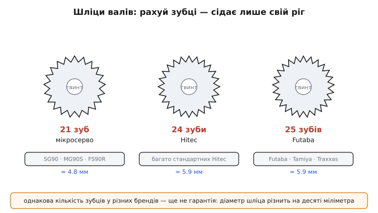
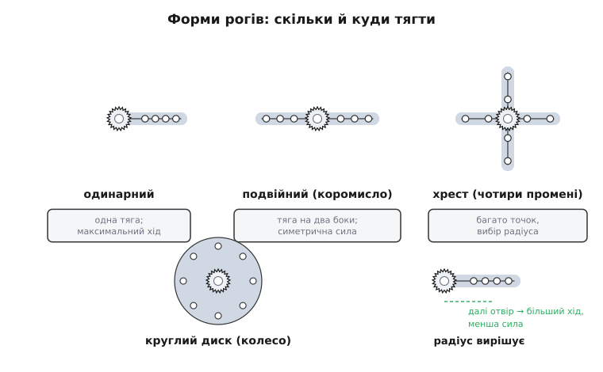

# Серво-роги (запасні)

<preknowlist>
- [Сервопривід SG90](topic:actuators/sg90-servo) — що таке хобі-серво, його вихідний вал і як воно тримає кут; ріг — це саме те, що надівається на цей вал.
- [Крутний момент](topic:physics/torque) — сила на плечі (момент = сила · плече); без цього не зрозуміти, чому далекий отвір на розі дає більший хід, але слабший тиск.
</preknowlist>

Розкрутіть пакетик, що приходить із будь-яким сервоприводом, — і серед гвинтиків знайдете кілька білих (або чорних) пластмасових деталей чудернацької форми: хрестик, пряму паличку з дірочками, зірочку, круглий диск. Це **серво-роги** (англ. *servo horn* — «ріг серва», за схожістю одинарного важеля з рогом). Дрібничка на вигляд копійчана, але саме через неї серво передає свій рух на все інше: кермо моделі, заслінку, ногу робота, поворотну камеру. Вал серва сам собою нічого не штовхає — він лише крутиться; щоб перетворити цей поворот на тягу чи натиск, на вал і надівають ріг, а вже до отворів рога чіпляють тягу.

Роги ламаються й губляться частіше за все інше в моделі: тонкий пластмасовий важіль першим приймає удар при аварії, а крихітний гвинтик, що тримає ріг на валу, має здатність відкручуватися й зникати в траві. Тому запасні роги купують упаковками. Ця стаття — про те, як упізнати потрібний ріг, чому їх стільки різних форм, як він тримається на валу, і головне — чому ріг від одного серва часто **не налазить** на вал іншого, хоч обидва однакові на око.

### Чому вал не гладенький, а зубчастий

Візьміть ріг і зазирніть у центральний отвір — усередині ви побачите **вінець дрібних зубців**. Той самий вінець, тільки зовні, є на вихідному валу серва. Це **шліци** (від слова, спорідненого з англ. *splinter* — «скалка», «тріска»; походження терміна давнє й достеменно не встановлене, а в машинному сенсі — «виступи на валу, що входять у пази маточини» — його фіксують ще з XIX століття). Зубці валу входять у западини рога, і навпаки — так вони чіпляються один за одного всіма зубцями по колу.

Чому не зробити вал просто круглим і не затиснути ріг гвинтом, як шків на осі? Бо серво **штовхає ривками під навантаженням**. Уявіть модельне кермо: набігає струмінь повітря, тисне на кермо, кермо через тягу тисне на ріг, ріг силкується провернутися на валу назад. Якби вал був гладенький, ріг рано чи пізно **прослизнув** би — і кермо «попливло» б, серво крутиться, а кермо стоїть не там, де має. Тертя гладенької посадки на це не розраховане.

Шліци розв'язують саме цю проблему. Момент, що серво передає на ріг, розкладається не на силу тертя однієї гладенької поверхні, а на **опір десятків зубців**, кожен зі своєю малою площинкою. Провернутися ріг зможе тільки, зрізавши зубці, — а на це треба зусилля, якого в хобі-серва просто немає. Тому шліцьова посадка **не проковзує**: кут, який серво виставило, ріг тримає намертво.

> 🔧 **Навіщо це.** Шліци — це те, що робить серво придатним для точного позиціювання. У квадрокоптері з рухомим підвісом або в роботі-маніпуляторі, де важливо не «десь коло того», а **саме той кут**, гладенька посадка з часом набрала б люфту й дрейфу. Зубчастий вал тримає ріг у строго дискретному положенні — з точністю до **одного зуба**, і не гуляє під вібрацією.

Але за це доводиться платити тим, що заводить у глухий кут половину початківців: посадка з точністю до зуба означає, що **число зубців і крок мають збігатися ідеально**. Ось звідки береться зоопарк несумісних рогів.

### Скільки зубців: стандарти, яких насправді немає

Здавалося б, зубчастий вал легко зробити універсальним — домовитися про одне число зубців і жити спокійно. Але історично кожен великий виробник серв застовпив **своє** число, і склалося кілька несумісних «сімей». Найпоширеніші стандартні (не мікро) серва тримаються трьох чисел:

```
Зубців   Хто вживає                          Діаметр шліца (приблизно)
─────────────────────────────────────────────────────────────────────
  23     Sanwa, Airtronics, KO, JR           ≈ 5.9 мм
  24     Hitec                               ≈ 5.9 мм
  25     Futaba, Tamiya, Traxxas, HPI, Savöx  ≈ 5.9 мм
```

Числа 23, 24, 25 — близькі, і на око ріг «на 24» майже не відрізниш від «на 25». Але спробуйте надіти — і він або не налізе взагалі, або сяде з люфтом і за перше ж навантаження зірве зубці. Один зайвий чи бракуючий зуб робить деталі несумісними.

Мікросерва — окрема сім'я. Дешеві SG90, а з ними MG90, MG90S, FS90R та рідня — майже всі мають **21 зуб** на валу діаметром десь **4.8 мм** (у різних партій буває від 4.6 до 4.9 мм — про це нижче). Тому роги від великого серва до SG90 не підходять і навпаки; для мікросерв беруть роги «21T».


*Кожна сім'я серв тримається свого числа зубців: мікро — 21, Hitec — 24, Futaba й сумісні — 25. Ріг сідає лише на «свій» вал: один зайвий чи бракуючий зуб робить посадку неможливою або аварійно вільною.*

Позначку зустрінете як «**T**» після числа: **25T**, **24T**, **21T** — це просто *teeth*, «зубці». Купуючи запасні роги, шукайте саме цю мітку, а не «підходить до серва» на картинці.

І тут криється підступ, який плутає навіть досвідчених: **однакове число зубців — ще не гарантія**. Стандарт на число прижився, а от на точну **геометрію зуба** — не зовсім. Два серва «25T» від різних виробників можуть мати шліци трохи різного діаметра: скажімо, одні ходять із діаметром коло 5.7 мм, інші коло 6.0 мм. Різниця в десяті частки міліметра — і ріг «25T» від одного бренду на валу іншого або бовтається, або заходить так туго, що ламається при знятті. Тому надійне правило звучить не «купи 25T», а «**приміряй саме до свого серва**»: полічи зубці на валу й, якщо є сумнів, зміряй його товщину штангенциркулем.

> 🔧 **Навіщо це.** Коли моделіст замовляє «алюмінієві роги 25T» онлайн, найчастіша причина «не підійшло» — не помилка в числі, а саме цей розкид геометрії між виробниками. Практичний висновок: тримайте про запас роги **тієї самої марки**, що й серво, або купуйте ремкомплект прямо від виробника серва. Найдешевша страховка від зіпсованого польоту — знати, скільки зубців у вашого серва, ще до того, як щось зламається.

### Форми рогів: скільки й куди тягти

Тепер про те, чому рогів у пакетику **кілька різних**. Форма визначає, скільки тяг можна причепити й на якому плечі — а плече керує співвідношенням «хід проти сили».

**Одинарний** — проста паличка з рядком отворів. Одна тяга, зате важіль довгий, тож дає **найбільший хід** кінця тяги на той самий поворот серва. Це найтиповіший ріг для керма чи однієї заслінки.

**Подвійний (коромисло)** — паличка на два боки від центру. Дає змогу тягти симетрично в обидва боки, наприклад розводити дві половинки механізму синхронно; сила прикладена врівноважено відносно валу.

**Хрест (чотири промені)** — чотири важелі під прямим кутом. Дає багато точок кріплення й вибір, до якого отвору чіпляти тягу, — тобто зручний вибір плеча. Часто саме хрестовину кладуть «за замовчуванням», бо вона універсальна.

**Круглий диск (колесо)** — суцільний кружок з отворами по колу. Використовують, коли треба тягти нитками (як у вітрильних лебідках) або коли важлива рівномірність по колу; ще ним зручно робити впор, що не чіпляється за сусідні деталі гострими кінцями.


*Форма рога вирішує, скільки тяг і на якому плечі. Що далі від центру взято отвір, то довше плече: кінець тяги проходить більший шлях (більший хід), але тисне слабше — момент серва розподіляється на довший важіль.*

Ключ до всіх форм — **радіус отвору**, тобто відстань від центра валу до точки, де чіпляється тяга. Тут працює простий важіль. Серво віддає сталий крутний момент; момент — це сила на плечі ([момент = сила · плече](topic:physics/torque)). Візьмете далекий отвір — плече довше, тож на той самий кут повороту серва кінець тяги пройде **більший шлях** (більший хід), але сила, з якою він тисне, буде **менша**. Візьмете ближній — навпаки: хід малий, зате тисне сильно.

**Порахуймо на конкретному прикладі, наскільки різнить вибір отвору.** Хай серво повертається на 60°, а на розі є отвори на радіусах 8 мм і 20 мм. Хід кінця тяги — це довжина дуги, яку описує отвір:

```
дуга = радіус · кут_у_радіанах
кут = 60° = 60 · π / 180 = 1.047 рад

ближній отвір (8 мм):   8 · 1.047  = 8.4 мм ходу
далекий отвір (20 мм):  20 · 1.047 = 20.9 мм ходу
```

Той самий поворот серва дає або 8.4 мм, або майже 21 мм руху тяги — залежно лише від того, у який отвір ви її встромили. А сила — обернено: якщо серво тримає момент 1.5 кг·см (це 1.5 кілограм-сили на плечі 1 см), то на кінці тяги виходить:

```
сила = момент / плече
момент = 1.5 кг·см

ближній (0.8 см):  1.5 / 0.8 = 1.88 кгс
далекий (2.0 см):  1.5 / 2.0 = 0.75 кгс
```

Ближній отвір тисне вдвічі з гаком сильніше за далекий. Звідси практичне правило: **треба більше руху — бери далекий отвір; треба більше сили — ближній**. Ця сама арифметика однаково працює й для мікро-SG90, і для великого сервопривода — змінюються тільки числа.

### Як ріг тримається на валу

Зубці ловлять ріг **від прокручування**, але не заважають йому **зіскочити вздовж** осі — тому ріг ще й **прикручують гвинтом** у торець валу. У центрі вихідного валу серва є різьбовий отвір; крізь ступицю рога проходить гвинт і вкручується туди, притискаючи ріг до валу.

Розмір гвинта залежить від класу серва:

```
Клас серва         Гвинт кріплення рога (типово)
──────────────────────────────────────────────────
мікро (SG90 тощо)  M2 · 6 мм, часто саморіз
стандартні         M2.5 або M3 · 6…8 мм
```

Мікросерва часто йдуть із **самонарізним** гвинтом (англ. *self-tapping* — «самонарізний»): він має гострий кінчик і сам прорізає різь у пластмасі валу, бо готової різьби там немає. Це зручно, але має межу — **не перетягуйте**: пластмасова різь зривається легко, і тоді гвинт більше не тримає. Затягувати треба до «щільно», а не «з усієї сили».

Отвори, куди чіпляється тяга, теж мають свій розмір. У пластмасових рогах вони під тонкі тяги (часто близько 1–2 мм) — саме тому в комплект серва інколи кладуть кілька рогів із дірочками різного діаметра. Якщо тяга бовтається в отворі, з'являється люфт: серво стоїть, а тяга гуляє — точність знову втрачена.

> 🔧 **Навіщо це.** Дві найчастіші причини, чому «серво працює, а механізм смикає»: перше — недотягнутий центральний гвинт (ріг помалу сповзає з валу), друге — розбовтаний отвір під тягу. Обидва не видно оком і обидва вбивають точність. Перш ніж грішити на електроніку чи прошивку, перевірте механіку рога — вона винна частіше.

### Пластик чи метал

Роги в комплекті майже завжди **пластмасові** (нейлон або схожий полімер). Вони легкі, дешеві, а головне — **навмисне слабкі**: при аварії краще, щоб зламався копійчаний ріг, ніж дорогі шестерні всередині серва. Пластмасовий ріг тут працює як «плавкий запобіжник» механіки: приймає удар і руйнується першим, рятуючи привід.

**Алюмінієві** роги купують окремо, коли навантаження великі й пластмаса гнеться або ламається надто легко — у важких моделях, силових приводах, роботах. Метал не гнеться під моментом, тримає точніше. Але має зворотний бік: при жорсткому ударі метал **не поступиться** й передасть увесь удар далі — на шестерні серва, які тепер зламаються замість дешевого рога. Тож алюмінієвий ріг — це вибір «сила й точність за ціною ризику для приводу», а не безумовне покращення.

Ще одна тонкість металевого рога: він твердіший за вал. Якщо надіти сталевий чи алюмінієвий ріг не на точно той самий шліц, він при затягуванні **зімне зубці пластмасового валу** — і серво зіпсовано. Тому до металевих рогів приміряються ще прискіпливіше, ніж до пластмасових.

### Що тримати про запас

Практична порада наприкінці — що саме класти в коробку з запчастинами. Тримайте роги **під свої серва**: для парку з мікро-SG90 — пакет рогів «21T»; для стандартних серв — під їхнє число зубців (25T для Futaba-сумісних, 24T для Hitec тощо), і бажано тієї самої марки, щоб не наскочити на розкид геометрії. Окремо не завадить жменя дрібних **гвинтів кріплення** (M2, M2.5) — вони губляться першими. І пам'ятайте головне правило цієї дрібнички: **порахуйте зубці, перш ніж купувати** — усе інше в розі другорядне проти того, налазить він на ваш вал чи ні.
