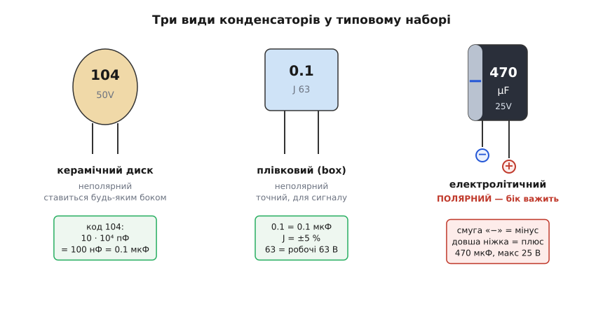
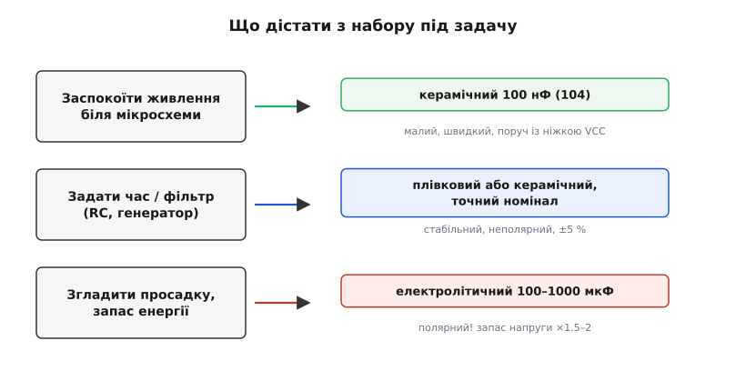

# Набір конденсаторів

<preknowlist>
- [Конденсатор](book:electronics/capacitor) — дві пластини з ізолятором між ними; запасає заряд і **опирається різкій зміні напруги** на собі. Без цієї картинки решта не має сенсу.
- [Ємність](book:electronics/capacitance) — скільки заряду вміщує деталь на кожен вольт; одиниця — фарад (Ф), а на практиці мікро-, нано- й пікофаради. Це число і є головна цифра на корпусі.
- [Маркування конденсаторів](book:electronics/capacitor-marking) — як прочитати «104», «0.1», «J», «25V»: трицифровий код, літера-допуск, робоча напруга. Без цього набір — купа незрозумілих цифр.
- [Діелектрики конденсаторів](book:electronics/capacitor-dielectrics) — чому кераміка, плівка й електроліт поводяться по-різному (стабільність, полярність, розмір). Пояснює, чому в наборі кілька несхожих типів, а не один.
- [Закон Ома](book:electronics/ohms-law) — напруга = струм · опір; знадобиться, щойно конденсатор працює в парі з резистором.
</preknowlist>

У пакетику з наборами для електроніки майже завжди трапляється невелика коробочка з відсіками, а в кожному відсіку — жменька дрібних деталей на двох ніжках: якісь схожі на руду сочевицю, якісь на синенькі коробочки, а кілька — на маленькі чорні бляшанки з написом збоку. Це **набір конденсаторів** (англ. *capacitor assortment kit*) — заздалегідь підібрана колекція найуживаніших номіналів, розкладена так, щоб під час макетування не бігати щоразу в магазин по одну деталь. Сам собою набір нічого не «робить»: це не прилад і не модуль, а **запас будівельних цеглинок**. Уся цінність — у тому, що потрібний номінал уже лежить під рукою, і в тому, щоб знати, яку саме цеглинку діставати й якою стороною ставити.

Новачок відкриває таку коробку і бачить хаос: цифри `104`, `223`, `0.1`, `470`, літери `J` і `K`, приписки `50V`, `25V`. Здається, ніби це різні світи. Насправді світів усього три — за тим, з чого зроблено ізолятор усередині, — і щойно ви навчитеся впізнавати ці три, увесь набір стає впорядкованим. Розберімо коробку так, щоб з першого погляду відрізняти типи, читати номінал прямо з корпусу, брати правильну деталь під задачу й не спалити полярний конденсатор, увімкнувши його задом наперед.

### Що це і навіщо тримати саме набором

Конденсатор потрібен у схемі раз у раз: заспокоїти живлення біля мікросхеми, задати сталу часу разом із резистором, згладити просадку напруги, пропустити змінний сигнал і затримати постійний. Але потрібне значення щоразу інше — то 100 пікофарад, то 100 мікрофарад, а це в мільйон разів більше. Купувати їх поштучно під кожну схему безглуздо: одна деталь коштує копійки, а чекати на посилку — дні. Тому виробники складають **набір ходових номіналів**: у типовій коробці 15–30 різних значень, по 10–20 штук кожного, разом кількасот деталей. Покриття підібране так, щоб перекрити 90 % побутових потреб — від дрібних керамічних для розв'язки до кількох електролітичних банок для згладжування.

> 🔧 **Навіщо це.** Макетування — це підбір. Ви ставите RC-фільтр, він зрізає не ту частоту, ви пробуєте сусідній номінал, тоді ще один. З набором цей цикл — секунди: витяг з відсіку, встромив, поміряв. Без набору кожна ітерація — це замовлення й пауза на кілька днів, і жодне жваве налагодження неможливе. Тому набір — не про економію грошей (деталі й так копійчані), а про **швидкість перебору**: він тримає простір рішень фізично розкладеним перед вами.

Коробка зазвичай має відсіки з паперовою наклейкою під кожним: там надруковано номінал, щоб не розшифровувати код щоразу. Це зручно, поки деталі лежать на місцях; варто раз перемішати відсіки — і доведеться читати самі корпуси. Тому вміння читати маркування важливіше за наклейку.

### Три світи в одній коробці

Усередині будь-якого конденсатора — дві провідні обкладки й **діелектрик** (гр. *diá* — крізь, + англ. *electric*) між ними: ізолятор, що не пропускає постійний струм, але дозволяє накопичити на обкладках заряд. Матеріал цього ізолятора визначає геть усе — розмір деталі, стабільність, чи має вона полярність. У наборі співіснують три родини, і їх варто навчитися розрізняти на око.


*Керамічний диск і плівкова коробочка — неполярні, ставляться будь-яким боком; електролітичний циліндр — полярний: світла смуга позначає «мінус», а довша ніжка — «плюс». Під кожним — розшифровка того, що написано на корпусі.*

**Керамічні** — це маленькі краплі кольору вохри чи гірчиці на двох ніжках, завбільшки з сочевицю, часто з трицифровим кодом на кшталт `104`. Діелектрик у них — тонка керамічна пластинка, тому вони **неполярні** (ставляться будь-яким боком) і дуже дешеві. Їхня стихія — малі значення: від одиниць пікофарад до одиниць мікрофарад. Це найчисленніша частина набору, бо саме такі стоять біля кожної цифрової мікросхеми. Слово «конденсатор» узагалі походить від латинського *condensare* — згущувати, ущільнювати: рання назва підкреслювала, що прилад «згущує» електричний заряд у малому об'ємі.

> 🔧 **Навіщо це.** Керамічний `104` (тобто 100 нанофарад, він же 0.1 мікрофарада) — найуживаніша деталь у всій цифровій електроніці. Її ставлять упритул до виводів живлення кожної мікросхеми як **розв'язувальний** (англ. *decoupling*) конденсатор: коли мікросхема миттєво смикає струм, локальний запас заряду не дає напрузі живлення просісти. Тому в наборі їх кладуть найбільше — ви витрачатимете саме `104` пачками. Чому цей номінал і чому впритул до ніжки — окрема тема [розв'язки живлення](book:electronics/decoupling).

**Плівкові** — це прямокутні коробочки, частіше синьо-блакитні чи жовтуваті («краплі» з плоскими боками), з написом типу `0.1` чи `1J`. Діелектрик — тонка полімерна плівка, скручена в рулон. Вони теж **неполярні**, але точніші й стабільніші за кераміку: їхня ємність майже не «пливе» від температури й прикладеної напруги. Тому їх беруть туди, де номінал має триматися чесно — у частотозадавальні ланцюжки, аудіо, точні фільтри. У наборі їх зазвичай менше, ніж кераміки, і в діапазоні від сотень пікофарад до одиниць мікрофарад.

**Електролітичні** — це маленькі чорні (чи сині) бляшані циліндри з двома ніжками знизу й **вертикальною світлою смугою** на боці. Усередині — згорнута алюмінієва фольга, а діелектриком служить надтонка оксидна плівка, вирощена на ній електрохімічно. Саме ця хитрість дає їм величезну ємність у малому об'ємі — сотні й тисячі мікрофарад, — але за неї доводиться платити двома речами. По-перше, **полярністю**: оксид тримається, лише поки «плюс» на правильній обкладці; переплутаєш — плівка руйнується, конденсатор гріється й може вибухнути. По-друге, точність у них абияка (допуск легко ±20 % і гірше), тож на точні задачі вони не годяться. Їхня роль у наборі — **згладжування й запас енергії**: кілька банок на 100, 470, 1000 мікрофарад, щоб гасити просадки живлення.

> 🔧 **Навіщо це.** Полярність електролітичного конденсатора — найдорожча пастка початківця. Світла смуга на корпусі позначає **мінусову** ніжку; на новій деталі та сама ніжка ще й **коротша**. Правило просте: **смуга — до мінуса, довга ніжка — до плюса**. Увімкнути навпаки — означає прикласти напругу «на злам» оксиду: деталь спершу тихо гріється, тече струм витоку, а за секунди-хвилини корпус здувається й з нього виходить електроліт, іноді з бавовною. Тому перше, на що дивишся, беручи циліндр із набору, — де смуга.

Ці три родини — не примха: діелектрик диктує компроміс між розміром, стабільністю й ціною, і жоден матеріал не виграє за всіма трьома. Чому кераміка дешева, але «пливе», плівка чесна, але громіздка, а електроліт місткий, але полярний і неточний, — виводиться з властивостей самих матеріалів у темі про [діелектрики](book:electronics/capacitor-dielectrics).

### Як прочитати, що написано на корпусі

Головна цифра на конденсаторі — його **ємність**, і записана вона одним із двох способів, залежно від того, влазить чи ні повне число на маленький корпус.

На великих деталях (плівка, електроліт) ємність часто пишуть **прямо**: `0.1` означає 0.1 мікрофарада, `470µF` — 470 мікрофарад. Тут і думати нема над чим — читаєш як є, одиниця вказана або мається на увазі (мікрофарад).

На дрібній кераміці повне число не влазить, тому вживають **трицифровий код**, точнісінько як кольорові кільця на резисторі, тільки цифрами. Правило: **перші дві цифри — значення, третя — скільки нулів дописати, і все це в пікофарадах**. Розберімо найчастіший код:

```
код 104:
  10        ← перші дві цифри
  · 10⁴     ← третя цифра = кількість нулів (тут 4)
  = 100000 пФ
  = 100 нФ
  = 0.1 мкФ
```

Отже `104` — це 100 нанофарад. Ще кілька, які лежать у кожному наборі:

```
код   значення (пФ)     звичніше
────  ───────────────   ──────────────
101   10 · 10¹ = 100    100 пФ
102   10 · 10² = 1000   1 нФ
103   10 · 10³          10 нФ
104   10 · 10⁴          100 нФ = 0.1 мкФ
223   22 · 10³          22 нФ
474   47 · 10⁴          470 нФ = 0.47 мкФ
```

Поряд із числом часто стоїть **літера-допуск** — наскільки реальна ємність може відхилятися від номіналу. Найчастіші: `J` = ±5 %, `K` = ±10 %, `M` = ±20 %. Для розв'язки живлення допуск байдужий (там аби «досить багато»), а для частотного фільтра — важить, тож туди беруть `J`.

Третя річ на корпусі — **робоча напруга** (`50V`, `25V`, `63`): максимум, який деталь витримує довго. Це не «скільки на ній буде», а **стеля**, яку не можна перевищувати. Повний розбір усіх кодів, літер і рідших позначень — у темі [маркування конденсаторів](book:electronics/capacitor-marking); маленький розкодовувач, що з коду на корпусі одразу дає ємність і не дає сплутати пФ/нФ/мкФ, винесено окремо — [код у число за пів секунди](book:components/capacitor-kit/proj-decode-code.md).

### Робоча напруга: чому беруть із запасом

Робоча напруга — це не дрібний рядок, а **межа безпеки**. Діелектрик витримує лише певну напруженість поля; перевищиш — він пробивається, і конденсатор або замикає накоротко, або вигорає. Тому перше правило вибору: **робоча напруга деталі має бути помітно вищою за ту, що реально буде в схемі**.

«Помітно» — це не про запас на 5 %. Практичне правило для електролітів: **бери з запасом у півтора-два рази**.

**Умова: у схемі 12 вольт живлення, треба згладжувальний конденсатор.**
```
робоча напруга в точці:   12 В
множник запасу:           ×1.5 … ×2
потрібна стеля деталі:    18 … 24 В
з наявних у наборі:       25 В  ✓   (16 В — ні, замало)
```
Тобто на 12-вольтову шину ставимо банку на 25 вольт, а не на 16. Запас потрібен, бо реальна напруга стрибає (кидки, перехідні процеси), а ще електроліт із роками **втрачає** свою стелю. Для неполярної кераміки правило м'якше, але думка та сама: `50V`-керамік на 3.3-вольтовій платі — це нормально й навіть добре, зайвий запас тут майже безплатний.

> 🔧 **Навіщо це.** Найпідступніше в перевищенні напруги — що воно не завжди вбиває одразу. Деталь на межі може працювати тижнями, а тоді тихо деградувати: росте струм витоку, гріється, ємність падає. Пристрій починає «дуріти» без явної причини — а причина в тому, що конденсатор поставили без запасу. Тому робочу напругу закладають із головою на старті: копійчана різниця між `16V` і `25V` не варта полювання на плаваючий баг.

### Що діставати з набору під конкретну задачу

Коли розумієш три типи, вибір деталі зводиться до короткого питання «навіщо вона тут».


*Три ходові задачі й відповідь на кожну: розв'язка живлення — керамічний 100 нФ упритул до мікросхеми; час або фільтр — точний неполярний потрібного номіналу; згладжування просадки — електролітичний на сотні мікрофарад із запасом напруги. Полярність важить лише для третього.*

**Заспокоїти живлення біля мікросхеми** — беремо **керамічний `104`** (100 нФ) і ставимо його якнайближче до виводів живлення. Точність тут не потрібна, потрібна швидкість і близькість. Це найчастіша операція взагалі.

**Задати час чи відрізати частоту** — RC-ланцюжок, генератор, фільтр — беремо **неполярний** конденсатор потрібного номіналу, краще плівковий або якісний керамічний, бажано з допуском `J`. Тут важить, щоб значення трималося, бо від нього прямо залежить частота зрізу чи період. Як конденсатор у парі з резистором задає час, розписано в темі про [сталу часу RC](book:electronics/rc-time-constant).

**Згладити просадку живлення, тримати запас енергії** — беремо **електролітичний** на сотні мікрофарад (100, 470, 1000) з належним запасом напруги. Тут велика ємність важливіша за точність. І тільки тут треба стежити за полярністю: смуга — до мінуса.

Часто одну задачу закривають **двома конденсаторами в парі**: велика електролітична банка гасить повільні, глибокі просадки, а маленька керамічна поруч — швидкі, дрібні кидки, з якими повільний електроліт не встигає. Це не надмірність, а поділ праці за швидкістю. Чому мала й велика ємності доповнюють одна одну (і чому їх іноді просто складають у більше значення) — у темі про [конденсатори послідовно й паралельно](book:electronics/capacitors-series-parallel).

### Чого стерегтися

Кілька пасток трапляються так часто, що варто тримати їх у голові, беручи деталь із набору.

**Полярність електроліту.** Повторю, бо це найдорожче: смуга на корпусі — **мінус**, довша ніжка (на новій деталі) — **плюс**. Керамічні й плівкові неполярні, з ними цієї турботи немає. Але щойно в руці чорний циліндр зі смугою — спершу дивишся, де плюс, тоді паяєш.

**Плутанина одиниць.** `104` — це 0.1 мікрофарада, а не 104 чогось; `470` на електроліті — це 470 мікрофарад, а не нанофарад. Різниця між нано- й мікрофарадою — тисяча разів, і сплутати їх означає промахнутися по ємності в тисячу разів. Коли не певні — перерахуйте код у пікофаради за правилом «дві цифри плюс нулі» й тоді переведіть в зручну одиницю.

**Робоча напруга впритул.** Не ставте `16V`-деталь на 12-вольтову шину «бо влізло». Запас у півтора-два рази — не забаганка, а страховка від стрибків і старіння.

**Керамічний конденсатор «худне» під напругою.** Дешева високоємна кераміка (класу з літерами на кшталт Y5V, Z5U) має неприємну рису: під робочою постійною напругою її реальна ємність падає — часом удвічі-втричі проти написаного. Для розв'язки це терпимо (аби «досить»), для точного фільтра — ні. Це поведінка самого діелектрика, і докладніше вона розібрана серед [паразитних властивостей конденсатора](book:electronics/capacitor-parasitics).

**Ноги різної довжини — не брак.** У свіжого електроліту одна ніжка навмисне довша: це виробник так позначає плюс. Не підрізайте їх «щоб рівно» до того, як визначили полярність, — інакше втратите єдину зручну підказку й доведеться шукати смугу.

Набір конденсаторів — річ проста до банальності, але саме на ньому новачок уперше по-справжньому стикається з тим, що «конденсатор» — це не одна деталь, а сімейство несхожих компромісів, і що вибрати правильний член сімейства під задачу важливіше, ніж знати про них усе. Навчитеся впізнавати три типи, читати код і поважати полярність та робочу напругу — і коробка з хаотичних цифр перетвориться на впорядкований склад, з якого ви за секунду дістаєте саме те, що треба.
