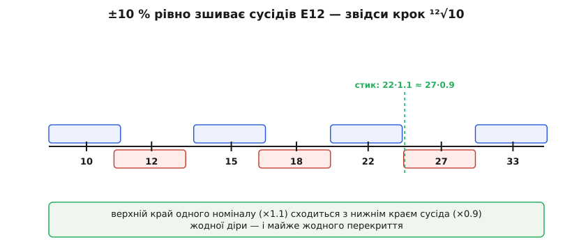
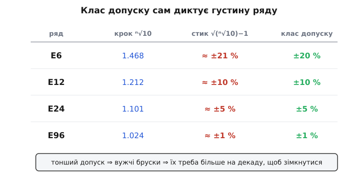

# 🧮 Чому саме ⁿ√10: вивід E-ряду з допуску

У наборі лежать номінали 10, 12, 15, 18, 22, 27, 33 — і поруч, у сусідній декаді, 100, 120, 150. Числа виглядають довільними, аж поки не поставити правильне питання. Не «які числа гарні», а **скільки різних номіналів має існувати, щоб будь-який потрібний опір був покритий, і жоден резистор не був зайвим**. Щойно так сформулюєш — уся система E-ряду випадає з одного рівняння, а множник ¹²√10 ≈ 1.2115 виявляється не вибором, а **вимушеним наслідком** двох чисел: скільки значень на декаду й з яким допуском їх виробляють. Розберімо цей вивід від першопричини — так, щоб було видно, що інакше й бути не могло.

### Означення: що таке ряд переважних значень

**Ряд переважних значень** (англ. *preferred numbers*, *E-series*) — це скінченний набір чисел у межах однієї декади (від 1 до 10), який повторюють у кожному порядку величини, домноживши на 10, 100, 1000… Замість того щоб випускати резистори «всіх можливих» опорів, виробники домовились випускати лише ці кілька значень на декаду. E12 — дванадцять значень; E24 — двадцять чотири; E6 — шість; E96 — дев'яносто шість. Літера «E» — від *exponential* (показниковий), бо, як зараз побачимо, числа ряду ростуть **показниково**, а не рівномірно.

Формально ряд заданий геометричною прогресією. Якщо на декаду припадає *n* значень, то сусідні відрізняються сталим множником *r*, а сам множник підібраний так, щоб рівно *n* кроків замикали декаду:

```
rⁿ = 10        ⇒        r = ⁿ√10 = 10^(1/n)
```

Для E12: r = ¹²√10 = 10^(1/12) ≈ 1.2115. Для E24: r = ²⁴√10 ≈ 1.1007. Для E6: r = ⁶√10 ≈ 1.4678. Числа ряду — це r⁰, r¹, r², …, rⁿ⁻¹ (домножені на 10ᵏ у потрібній декаді), округлені до двох (для E6/E12/E24) чи трьох (для E48/E96/E192) значущих цифр.

Але це лише *опис* ряду. Він не пояснює головного: **чому крок має бути геометричним, а не арифметичним, і чому саме такий, а не інший**. Відповідь ховається в тому, що резистор — деталь неточна.

### Інтуїція: важить відсоток, а не різниця

Почнімо з фізичного факту, який усе визначає. Заводський резистор **не влучає в номінал точно** — його справжній опір гуляє навколо написаного значення. І гуляє він не на сталу кількість омів, а на сталий **відсоток**. Резистор «100 Ω ±10 %» — це насправді будь-яке значення від 90 до 110 Ω. Резистор «1000 Ω ±10 %» — від 900 до 1100 Ω. Абсолютний розкид другого (±100 Ω) у десять разів більший за розкид першого (±10 Ω), але **відносний** — той самий, ±10 %.

Чому саме відсоток? Бо опір задає геометрія й матеріал резистивного шару: R = ρ·L/A (питомий опір на довжину, поділити на площу перерізу). Похибки нанесення шару — товщина, ширина доріжки, склад пасти — усі мультиплікативні: шар вийшов на 3 % тонший — опір на 3 % більший, незалежно від того, «великий» це резистор чи «малий». Тому природна міра відхилення тут — не «на скільки омів», а «у скільки разів».

> 🔧 **Навіщо це.** Уся конструкція E-ряду виростає саме з цього: коли похибка вимірюється у відсотках, то й **відстані між номіналами треба міряти у відсотках** — тобто множенням, а не відніманням. Крок «×1.21» однаково доречний і біля 10 Ω, і біля 10 МΩ, бо всюди означає ту саму 21-відсоткову прогалину. Арифметичний крок «+2 Ω» був би безглуздий: біля 10 Ω це п'ята частина, біля 10 000 Ω — непомітна крихта. Ось чому вісь номіналів — **логарифмічна**: на ній рівні відсоткові кроки стають рівними відрізками.

Тепер друга половина інтуїції — навіщо взагалі проміжні номінали. Уяви, що ти маєш лише 100 Ω і 1000 Ω, а схемі потрібно 300 Ω. Найближчий наявний — 100 Ω, помилка в три рази. Погано. Додаси проміжні — помилка впаде. Але **скільки** проміжних досить? Тут і вмикається допуск: якщо резистор усе одно неточний на ±10 %, то немає сенсу розрізняти 300 і 310 Ω — вони нерозрізненні в межах власної похибки. Проміжні номінали треба ставити рівно так густо, **щоб поле допуску одного дотягувалося до поля допуску сусіда** — не рідше (будуть діри, куди не влучає жоден номінал) і не густіше (сусіди перекриватимуться, номінали дублюватимуть один одного даремно).

Саме ця умова — «поля допуску змикаються без дір і без зайвого перекриття» — і визначає крок однозначно.

### Формальний апарат: вивід кроку з допуску

Зробімо це точно. Нехай допуск резистора — ±*t* (для ±10 % це t = 0.10). Візьмімо два сусідні номінали: менший *a* і більший *a·r*. Кожен покриває інтервал реальних опорів:

```
номінал a:    [ a(1−t) ,  a(1+t) ]
номінал a·r:  [ a·r(1−t) ,  a·r(1+t) ]
```

Верхній край меншого — це a(1+t). Нижній край більшого — a·r(1−t). Щоб між ними не було діри (кожен опір накритий бодай одним номіналом) і не було перекриття (жоден опір не накритий двічі), ці два краї мають **зійтися в одній точці**:

```
a(1+t) = a·r(1−t)

скорочуємо a:

(1+t) = r(1−t)

звідси множник:

r = (1+t) / (1−t)
```

Ось воно — місток між допуском і кроком. Підставмо ±10 %:

```
r = (1 + 0.10) / (1 − 0.10) = 1.10 / 0.90 ≈ 1.222
```

А тепер згадаймо, що для E12 ми незалежно вивели r = ¹²√10 ≈ 1.2115. Два числа — 1.222 і 1.2115 — практично збігаються! Тобто дванадцять значень на декаду й допуск ±10 % — **це та сама вимога, сказана двічі**. Одне число тягне за собою друге.

Є й друга, ще охайніша форма тієї ж умови. Замість «край до краю» можна вимагати, щоб бруски змикалися рівно на **геометричному середньому** двох номіналів √(a·a·r) = a·√r — природній точці стику на логарифмічній осі. Тоді верхній край меншого має дотягтися саме туди: a(1+t) = a·√r, звідки

```
t = √r − 1 = √(ⁿ√10) − 1
```

Для E12: t = √1.2115 − 1 ≈ 0.1007, тобто **±10.1 %**. Обидва виведення дають ту саму відповідь із точністю до частки відсотка; різниця лише в тому, чи вважати допуск симетричним у різниці, чи в відношенні. Головне не в другому знаку, а в тому, що **допуск і густина ряду — це одне й те саме число з двох боків**.


*Кожен номінал E12 покриває інтервал ±10 % (брусок). На логарифмічній осі бруски однакової ширини й стоять через рівний крок ¹²√10. Верхній край одного (×1.1) сходиться з нижнім краєм сусіда (×0.9): жодної діри, майже жодного перекриття. Зелений пунктир — точка стику 22 і 27 на їхньому геометричному середньому.*

### Клас допуску сам диктує густину ряду

Формула t = √(ⁿ√10) − 1 (або еквівалентна r = (1+t)/(1−t)) — це не просто збіг для E12. Вона **пояснює весь набір рядів разом**. Підставмо різні *n* і подивімось, який допуск робить бруски змикними:

```
ряд   крок ⁿ√10   стик √(ⁿ√10)−1   клас допуску
E6      1.468        ≈ ±21 %           ±20 %
E12     1.212        ≈ ±10 %           ±10 %
E24     1.101        ≈ ±5 %            ±5 %
E96     1.024        ≈ ±1 %            ±1 %
```

Збіг ідеальний — і він не випадковий. Кожен ряд **скроєний під свій клас точності**. Що тонший допуск, то вужчі бруски, то більше їх треба, щоб укрити декаду без дір, — тому й значень на декаду більше. Це причинно-наслідковий ланцюг, а не таблиця, яку хтось придумав: спершу технологія дає певну точність (±20 %, ±10 %, ±5 %, ±1 %), а вже вона однозначно визначає, скільки номіналів має сенс випускати.


*Той самий закон у чотирьох рядах. Крок ⁿ√10 задає ширину бруска допуску; допуск, за якого бруски змикаються (√(ⁿ√10)−1), майже точно збігається зі стандартним класом точності ряду. Тому дешеві ±20 % резистори роблять за E6, а точні ±1 % — за E96: тонший допуск вимагає щільнішого ряду.*

> 🔧 **Навіщо це.** Звідси практичне чуття, яке рятує при виборі. Якщо береш резистори ±5 %, шукати їх треба в ряду E24 — і безглуздо мріяти про номінал, якого в E24 немає (скажімо, «точно 250 Ω»): при ±5 % він однаково нерозрізненний із сусідами 240 і 270. А якщо схемі справді потрібні тонкі проміжні значення — це автоматично означає перехід на ±1 % і ряд E96, бо лише там бруски досить вузькі, щоб їх було багато. Не можна мати «багато номіналів, але грубий допуск» — математика це забороняє: густий ряд без тонкого допуску давав би суцільне перекриття, де половина номіналів дублює одне одного.

### Чому E-ряд не збігається з точною прогресією: аномалії E24

Тут ховається пастка, на якій легко зловити себе, якщо повірити формулі надто буквально. Обчислімо E12 «в лоб» за r = ¹²√10 і округлімо до двох значущих цифр:

```
k:      0     1     2     3     4     5     6     7     8     9    10    11
rᵏ:   1.00  1.21  1.47  1.78  2.15  2.61  3.16  3.83  4.64  5.62  6.81  8.25
2 цифри:1.0   1.2   1.5   1.8   2.2   2.6   3.2   3.8   4.6   5.6   6.8   8.2
```

А офіційний E12 — це:

```
1.0  1.2  1.5  1.8  2.2  2.7  3.3  3.9  4.7  5.6  6.8  8.2
```

Порівняй середину. Формула дає 2.6, 3.2, 3.8, 4.6 — а в стандарті стоять 2.7, 3.3, 3.9, 4.7. Розбіжність в останній цифрі! Ряд **не є** точним геометричним округленням. Ці «неправильні» значення — не помилка, а свідоме рішення, і причина повчальна.

Річ у тім, що ряди старшої точності — E48, E96, E192 — округлюють до **трьох** значущих цифр, і їх хотіли зробити так, щоб грубші ряди були рівно їхніми **підмножинами**: кожне значення E12 мало б знайтися в E24, а те — усередині E48/E96. Але округлення до двох цифр і округлення до трьох цифр дають дещо різні числа. Щоб зшити їх у злагоджену матрьошку, вісім значень E24 «підкрутили» вручну від того, що дала б чиста формула:

```
позиція:        формула → стандарт
                  2.6   →   2.7
                  2.9   →   3.0
                  3.2   →   3.3
                  3.5   →   3.6
                  3.8   →   3.9
                  4.2   →   4.3
                  4.6   →   4.7
                  8.3   →   8.2
```

*(Усталений факт, підтверджений специфікацією IEC 60063: саме ці вісім значень E24 — 2.7, 3.0, 3.3, 3.6, 3.9, 4.3, 4.7, 8.2 — відхиляються від того, що дало б округлення чистого ряду, і через це вони відсутні в E48/E96/E192. Частина виробників пізніше почала додавати ці «сирітські» значення у свої лінійки точних резисторів, щоб перекрити прогалину.)*

Практичний наслідок один, але важливий: **не обчислюй номінали за формулою — бери їх із таблиці ряду**. Формула ¹²√10 пояснює, *чому* крок такий, і дає числа з точністю ±1 % — цього досить, щоб зрозуміти логіку, але не досить, щоб відтворити стандарт до останньої цифри. Коли треба справжнє значення — дивись у стандарт, а не в калькулятор.

### Ренарові ряди: прабатько всієї ідеї

Ідея заміняти безліч довільних величин кількома, розставленими геометрично, старша за електроніку на півстоліття — і народилася вона зовсім не для резисторів. Її автор — французький військовий інженер **полковник Шарль Ренар** (фр. *Charles Renard*, 1849–1905), і займався він повітряними кулями.

Історія така. У 1877 році Ренарові доручили впорядкувати прив'язні аеростати французької армії, і він виявив логістичний жах: для розтяжок і тросів використовували **425 різних розмірів** канату. Тримати на складі й постачати 425 позицій — марнотратство. Ренар узяв за міру не діаметр, а вагу відрізка каната сталої довжини (як проксі для головного — міцності на розрив) і побудував геометричну прогресію, що тим самим діапазоном обходилася **17 розмірами** замість 425. Свою систему він виклав в інструкції для повітроплавних частин; чинну назву «ряди Ренара» вона дістала вже у 1920-х. Пізніше ISO ухвалила саме цей принцип за основу метричних переважних чисел, а на честь Ренара позначила ряди літерою **R**: R5, R10, R20, R40 — з кроками ⁵√10 ≈ 1.58, ¹⁰√10 ≈ 1.26, ²⁰√10 ≈ 1.12, ⁴⁰√10 ≈ 1.06.

```
Ренар (загальні величини)     E-ряд (резистори/конденсатори)
R5:  крок ⁵√10  ≈ 1.58        E6:  крок ⁶√10  ≈ 1.47
R10: крок ¹⁰√10 ≈ 1.26        E12: крок ¹²√10 ≈ 1.21
R20: крок ²⁰√10 ≈ 1.12        E24: крок ²⁴√10 ≈ 1.10
R40: крок ⁴⁰√10 ≈ 1.06        E96: крок ⁹⁶√10 ≈ 1.02
```

Різниця між гілками — суто у виборі *n* (Ренар ділив декаду на 5/10/20/40, електронний E-ряд — на 3/6/12/24/48/96/192) і в округленні, підігнаному під допуск компонентів. Але корінь ідеї — «покрий діапазон геометричною прогресією, крок якої задано ⁿ√10» — спільний, і він Ренарів. E-ряд кодифікували значно пізніше: перше видання стандарту **IEC 63** (згодом перейменованого на IEC 60063) вийшло 1 січня 1952 року й закріпило E3, E6, E12, E24 під відповідні класи допуску. *(Усталений факт: IEC 63:1952, перше видання, 1952-01-01; сам принцип переважних чисел — Ренарів, кінця XIX ст.)*

> 🔧 **Навіщо це.** Той самий геометричний скелет ти зустрінеш усюди поза резисторами: стандартні ємності конденсаторів ідуть тим самим E-рядом; типорозміри кріплення, потужності двигунів, кроки об'єктивів фотоапаратів (діафрагми f/1.4, f/2, f/2.8 — це прогресія з кроком √2) — усі стоять на переважних числах. Побачивши «дивну» послідовність, що множиться на сталий ірраціональний множник, ти тепер упізнаєш почерк: хтось розставив величини так, щоб небагатьма позиціями рівномірно (у логарифмі) вкрити широкий діапазон.

### Worked-приклад: округлення розрахунку до переважного значення

Тепер — заради чого весь цей апарат потрібен на практиці. Розрахунок майже ніколи не дає число з ряду; треба округлити до найближчого наявного номіналу. Округлювати слід **не в лінійці, а в логарифмі** — бо, як ми з'ясували, важить відсоткова, а не абсолютна відстань. Правильний критерій: найближчий той номінал, у якого менший **множник відхилення** (у скільки разів промахнешся), а не менша різниця в омах.

**Умова: гасильний резистор дав розрахунковий опір 3.14 кΩ; який номінал E12 поставити**

Кандидати з E12 — сусіди 2.7 кΩ і 3.3 кΩ. Наївно здається, що 3.3 «очевидно ближче». Перевірмо строго, через відношення:

```
розрахунок:  R = 3.14 кΩ
сусіди E12:  2.7 кΩ  і  3.3 кΩ

відхилення вниз (до 2.7):   3.14 / 2.7 = 1.163   →  промах ×1.163  (+16.3 %)
відхилення вгору (до 3.3):  3.3 / 3.14 = 1.051   →  промах ×1.051  (+5.1 %)

3.3 кΩ ближче (×1.05 проти ×1.16)  →  беремо 3.3 кΩ
```

Перевіримо, що це рішення взагалі прийнятне. Резистор 3.3 кΩ ±5 % — це діапазон 3.135…3.465 кΩ. Наш розрахунковий 3.14 кΩ падає рівно в цей діапазон (ледь-ледь вище нижнього краю). Тобто **реальний резистор із номіналом 3.3 кΩ цілком може мати опір, ближчий до 3.14, ніж до самого 3.3** — власний допуск деталі більший за нашу похибку округлення. Гнатися за точнішим значенням тут безглуздо.

**Умова: а якщо число впало точно між сусідами**

Небезпечний випадок — розрахунок дав, скажімо, 3.0 кΩ, а в ряду E12 значення 3.0 немає (воно є лише в E24). Сусіди E12 — ті самі 2.7 і 3.3:

```
розрахунок:  R = 3.0 кΩ
2.7 кΩ:   3.0 / 2.7 = 1.111   →  −10 %
3.3 кΩ:   3.3 / 3.0 = 1.100   →  +10 %

обидва промахуються майже на ±10 % — число сидить у «сідловині» між номіналами
```

Обидва варіанти дають ~10 % похибки — гірше нікуди в межах E12. Це **сигнал**, а не проблема округлення. Якщо схемі байдуже (гасильний резистор, підтяжка) — став будь-який, 10 % нічого не змінять. Але якщо 10 % справді забагато (опір задає коефіцієнт підсилення чи поріг), рішень два: або перейти на E24, де існує рівно 3.0 кΩ, або — правильніше — **перепроєктувати схему так, щоб вона не залежала від номіналу, якого немає**. Скажімо, замінити абсолютний опір на *відношення* двох резисторів, бо відношення можна скласти з наявних номіналів точно, а розкид у відношенні ще й скорочується. Як саме допуски поводяться у відношенні й чому пара резисторів буває точніша за поодинокий — розібрано у [вставці про складання допусків дільника](book:electronics/voltage-divider/math-tolerance.md).

**Загальне правило округлення**

```
1. Візьми два сусідні номінали ряду: нижній a, верхній b (a < R < b).
2. Порахуй два множники промаху:  R/a  (вниз)  і  b/R  (вгору).
3. Менший множник — ближчий номінал. (Це те саме, що |ln(R/a)| проти |ln(b/R)|.)
4. Перевір, що обраний номінал зі своїм допуском накриває R.
5. Якщо обидва промахи близькі до половини кроку (√r ≈ 1.10 для E12) —
   число в «сідловині»: або густіший ряд, або переробити схему.
```

Крок 3 — суть усього. Округлення «на око за різницею в омах» дає правильну відповідь лише випадково; єдиний коректний спосіб — порівнювати **відношення**, бо номінали розставлені геометрично, і сама «близькість» тут вимірюється множенням.

### Де це працює в наборі

Повернімося до коробочки. Тепер її вміст читається як наслідок одного рівняння. Числа 10, 12, 15, 18, 22, 27, 33, 39, 47, 56, 68, 82 — це не примха, а геометрична прогресія з кроком ¹²√10, підігнана під допуск ±10 %/±5 % так, щоб поля розкиду сусідів змикалися без дір. Кількість номіналів на декаду (12 у дешевому наборі, 24 у багатшому) — не свобода виробника, а жорсткий наслідок класу точності: тонший допуск фізично вимагає густішого ряду, і навпаки. Вісім «неправильних» значень E24 — плата за те, щоб ряди вкладалися один в одного матрьошкою. А сам принцип — покрити широкий діапазон небагатьма геометрично розставленими величинами — Ренар придумав для канатів аеростатів за сімдесят років до першого резисторного стандарту.

Практичний висновок для того, хто тримає набір у руках, короткий. Коли розрахунок видає некругле число, не шукай його — округли до найближчого номіналу ряду **за відношенням**, і майже завжди похибка потоне у власному допуску резистора. А коли число вперто сідає в «сідловину» між сусідами — це не привід шукати екзотику, а натяк, що схема надто чіпляється за точність, якої в дешевих резисторах немає, і краще її переробити. Уся ця арифметика працює на те, щоб коробка з кількома десятками номіналів закривала практично будь-яку потребу — саме стільки різних значень, скільки має сенс за наявної точності, ні номіналом більше, ні меншим.
