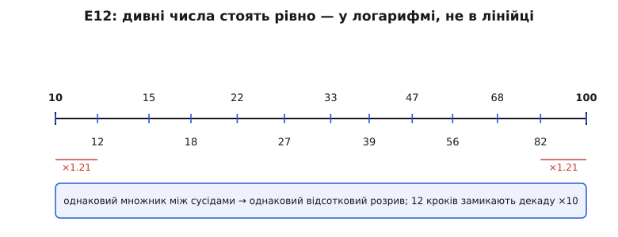
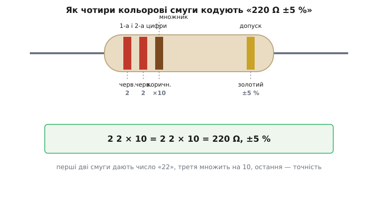

# Набір резисторів

<preknowlist>
- [Резистор](topic:electronics/resistor) — деталь, що чинить сталий опір струму; без розуміння, що вона робить, набір безглуздий.
- [Закон Ома](topic:electronics/ohms-law) — напруга = струм · опір; ним обирають номінал під потрібний струм.
- [Джоулеве тепло](topic:physics/joule-heating) — струм гріє опір потужністю P = I²·R; звідси береться потужнісний ліміт резистора.
- [Маркування резисторів](topic:electronics/resistor-marking) — як кольорові смуги кодують номінал; тут — лише практичний бік, повна таблиця там.
- [LED](topic:electronics/led) — світлодіод, що потребує гасильного резистора; найчастіший привід дістати набір.
</preknowlist>

Відкриваєш коробочку — і в ній сотні однакових на вигляд крихітних циліндриків, кожен з двома дротяними вусиками й кількома кольоровими поясочками на бежевому тільці. Це **набір резисторів** (від лат. *resistere* — чинити опір): не один компонент, а впорядкована колекція десятків різних номіналів опору, розкладених по гніздах чи стрічках, щоб під будь-яку схему знайшовся потрібний. Такий набір лежить у шухляді кожного, хто бодай раз паяв чи збирав щось на макетній платі, бо резистор — найчастіша деталь у всій електроніці, а вгадати заздалегідь, який саме опір знадобиться завтра, неможливо. Тож купують не по одному, а одразу «асортимент».

На перший погляд це просто торбинка дрібнички. Але сам набір — цікавий предмет: у ньому зашита ціла інженерна культура. Чому в комплекті рівно ці, дивні на позір числа — 220, 330, 470, а не круглі 200, 300, 500? Чому смуг чотири, а не напис цифрами? Скільки штук кожного номіналу класти й у чому різниця між копійчаним асортиментом і «серйозним»? Розберімо конкретний предмет — типовий стартовий набір виводних резисторів — так, щоб упізнати його, зрозуміти, що всередині й за яким принципом, і навчитися діставати з нього потрібне, не спаливши ні деталь, ні те, що до неї під'єднано.

### Що це насправді: колекція, впорядкована за номіналом

Резистор сам по собі робить лише одне — **чинить наперед заданий, сталий опір струму**. Уся його «особистість» — це одне число, номінал опору в омах (Ω), плюс два другорядні паспорти: скільки потужності він витримає, не згорівши, і наскільки точно справжній опір збігається з написаним. Схема ж вимагає не «резистора взагалі», а резистора конкретного номіналу: тут треба 220 Ω, щоб обмежити струм світлодіода, там 10 кΩ на підтяжку, деінде 1 МΩ у ланцюжку таймера. Один номінал іншим не заміниш без наслідків.

Звідси й сама ідея набору. Купувати резистори поштучно під кожну схему — марудно: щоразу чекати доставки заради двох деталей. Тому виробники складають **асортимент** — коробку, де кожен номінал уже є, зазвичай десятками штук. Розкладка буває двох стилів. У дешевих наборах резистори сидять у пронумерованих гніздах пластикового органайзера або нанизані на паперові стрічки з підписами. У «стрічкових» (англ. *taped*) наборах кожен номінал — окремий відрізок паперової чи поліетиленової стрічки, де деталі стоять рядком через рівний крок; така стрічка зручна тим, що з неї резистори зручно відщипувати й що вона сумісна з машинним подаванням, але для ручного паяння це радше данина заводському пакуванню.

> 🔧 **Навіщо це.** Набір економить не гроші, а **час і неперервність роботи**. Схема майже завжди хоче номінал, якого «саме зараз немає», а зупиняти складання на тиждень заради однієї деталі — найгірше, що може статися з робочим запалом. Повний асортимент під рукою означає, що між ідеєю «а поставлю сюди 4.7 кΩ» і паяльником — тридцять секунд, а не тиждень. Саме тому набір резисторів — перше, що купують у стартовий інвентар, поряд із макетною платою й дротами.

### Дивні числа: чому 220, а не 200

Візьмеш будь-який набір — і в переліку номіналів впадають в око «неround» числа: 10, 12, 15, 18, 22, 27, 33, 39, 47, 56, 68, 82, а тоді знову 100, 120, 150… Новачок дивується: чому не рівні 10, 20, 30, 40? Здається, ніби числа накидали навмання. Насправді за ними стоїть одна з найелегантніших домовленостей в усій техніці — **ряд переважних значень E12** (від англ. *E-series*, «E» — від *exponential*, показниковий).

Ключ — у тому, що резистор **не буває точним**. Заводський опір гуляє навколо номіналу на кілька відсотків: у дешевого — на ±5 %, у дуже дешевого — на ±10 %. Тепер уяви, що резистор з номіналом 100 Ω і допуском ±10 % насправді може бути будь-де від 90 до 110 Ω. А сусідній номінал — 120 Ω з тим самим допуском — покриває 108…132 Ω. Їхні діапазони майже стикаються: 110 і 108 практично торкаються. Виходить, що між 100 і 120 немає сенсу робити ще якийсь проміжний номінал — його весь діапазон і так уже накрито розкидом двох сусідів. **Номінали розставлені саме так, щоб їхні поля допуску вкривали числову вісь без дір і без зайвого перекриття.**

А раз важить не абсолютна відстань, а відсоткова, то й кроки між номіналами мають бути однаковими **не в лінійці, а в множенні**: кожен наступний номінал більший за попередній у сталу кількість разів. Для E12 цей множник — дванадцятий корінь із десяти:

```
крок = ¹²√10 ≈ 1.2115

10 × 1.2115 ≈ 12
12 × 1.2115 ≈ 15
15 × 1.2115 ≈ 18
...
82 × 1.2115 ≈ 100   (декада замкнулася на ×10)
```

Дванадцять кроків по ×1.21 замикають рівно один порядок величини — множення на 10. Тому ряд і зветься E12: дванадцять значень на декаду. Округлені до двох значущих цифр, вони й дають ту саму «дивну» дюжину. Такий самий принцип породжує сусідні ряди: E6 (шість значень, для допуску ±20 %), E24 (двадцять чотири, для ±5 % — саме він у більшості наборів), E96 (дев'яносто шість, для точних ±1 %).


*Дванадцять номіналів однієї декади на логарифмічній осі. Відстань між сусідами всюди однакова — це той самий множник ×1.21; у звичайній лінійці числа тому здаються нерівномірними (справа густіше), а насправді розкид кожного точно змикається з сусідом. Дванадцять кроків замикають декаду ×10.*

Ця система — не чиясь примха, а міжнародний стандарт. Ряди переважних значень уперше кодифікували наприкінці 1940-х: перші пропозиції ухвалили в Парижі 1950 року, а 1952-го їх видали як стандарт **IEC 63** (згодом перейменований на IEC 60063), де й закріпили ряди E3, E6, E12, E24 під різні класи допуску. *(Усталений факт: перше видання IEC 63 датоване 1 січня 1952 р.; сам принцип переважних чисел старший — його ще на початку XX ст. запропонував французький інженер Шарль Ренар для стандартизації діаметрів канатів, і ряди Ренара стали прабатьком усіх подібних шкал.)* Докладний вивід самого ряду, чому саме корінь із десяти й як допуск зшиває номінали без дір, — у [математичному розборі E-ряду](topic:components/resistor-kit/math-e-series.md).

> 🔧 **Навіщо це.** Знати E12 корисно щодня. Коли розрахунок дає «потрібно 3.14 кΩ», не варто й шукати такий резистор — його не існує в природі. Дивишся на найближче переважне значення (3.3 кΩ) і майже завжди ставиш його: похибка в кілька відсотків усе одно тоне в допуску самого резистора. А якщо число розрахунку раптом випало точно між двома сусідами ряду — це сигнал, що схема надто вимоглива до точності й, можливо, її варто перепроєктувати, щоб не залежати від номіналу, якого немає. Розкид номіналів і як він накопичується в схемі — окрема тема [допуску й розкиду резисторів](topic:electronics/resistor-tolerance).

### Кольорові пояси: чому не написати цифрами

Друге, що впадає в око, — резистори не підписані числом, а розмальовані пасочками. Причина суто практична й історична. У 1920-х, коли радіо ставало масовим, резистори вже поменшали настільки, що надрукувати на бежевому циліндрику діаметром у пару міліметрів читабельні цифри — та ще й так, щоб напис не стерся й не сховався за тим боком, яким деталь ляже на плату, — було технічно важко й дорого. Тому **Асоціація виробників радіо** (англ. *Radio Manufacturers Association*, RMA) у США запровадила кольорове кодування: кольори видно з будь-якого боку, вони не залежать від орієнтації й дешеві в нанесенні. *(Усталено: код народився в RMA у 1920-х; перші радіо з кольоровими резисторами будували близько 1930 р.; згодом, зі зміною назви організації — RTMA, RETMA, EIA, — той самий код стандартизували в IEC 62:1952 і EIA RS-279. Систему майже не міняли близько століття.)*

Логіка коду проста, коли її раз побачиш. Кожен колір — це цифра від 0 до 9, у порядку, який легко запам'ятати як «темніше — менше»: чорний = 0, коричневий = 1, червоний = 2, оранжевий = 3, жовтий = 4, зелений = 5, синій = 6, фіолетовий = 7, сірий = 8, білий = 9. На типовому резисторі чотири смуги: перші дві — це значущі цифри номіналу, третя — множник (на скільки нулів помножити, тобто десятий степінь), четверта, трохи відсунута, — допуск (золотий = ±5 %, срібний = ±10 %).


*Тіло резистора з чотирма смугами на прикладі «220 Ω ±5 %». Перші дві смуги (червона, червона) дають цифри «2» і «2», третя (коричнева) множить на 10, остання відсунута смуга (золота) задає допуск ±5 %. Читають від того краю, де смуги ближче збиті докупи, до відсунутої смуги допуску.*

Читання виглядає так. Скажімо, смуги: **червона, червона, коричнева, золота**:

```
черв. черв. коричн.  золот.
  2     2    × 10    ±5 %

цифри:      2, 2      → число 22
множник:    × 10      → 22 × 10 = 220
допуск:     золотий   → ±5 %

Отже: 220 Ω, ±5 %  (діапазон 209…231 Ω)
```

Головна практична пастка — **напрямок читання**. Резистор симетричний, і легко почати з не того кінця, отримавши безглузде число. Орієнтир: смуга допуску (золота чи срібна) стоїть трохи окремо від решти й завжди остання; читають від протилежного, «збитого» краю. Якщо золотої чи срібної смуги немає з жодного боку (буває на точних резисторах з п'ятьма-шістьма смугами), напрямок визначають інакше, і тут надійніше не вгадувати за кольорами, а просто **виміряти опір мультиметром**. Повну таблицю кольорів, п'ятисмугову й шестисмугову схеми та як не сплутати оранжевий із червоним при поганому світлі варто тримати під рукою — це докладно розписано в темі [маркування резисторів](topic:electronics/resistor-marking). У дуже дрібних SMD-резисторів (без ніжок, для машинного монтажу) кольорів немає взагалі — там номінал друкують коротким цифровим кодом, і це вже інша система, [маркування SMD](topic:electronics/smd-marking).

> 🔧 **Навіщо це.** Уміння прочитати резистор з коробки за секунду — базова навичка, без якої складання перетворюється на муку. Але чесна порада досвіду: кольори брешуть при поганому світлі (синій легко сплутати з фіолетовим, оранжевий із червоним, а на старих деталях лак жовтить усе), тож коли ціна помилки висока — не покладайся на очі, **продзвони номінал мультиметром**. Кольори — щоб швидко відсортувати; мультиметр — щоб переконатися перед паянням.

### Два числа, які легко проґавити: потужність і допуск

Номінал опору — головна, та не єдина характеристика резистора в наборі. Є ще два паспорти, які новачок часто ігнорує, аж поки деталь не почорніє.

**Потужність розсіювання** (англ. *power rating*) — скільки тепла резистор здатен віддати, не згорівши. Струм, протікаючи крізь опір, гріє його: виділювана потужність дорівнює P = I²·R (або, що те саме, U²/R). Це [джоулеве тепло](topic:physics/joule-heating), і воно цілком реальне — резистор буквально нагрівається. Якщо виділювана потужність перевищить те, що деталь може розсіяти, вона перегріється: спершу зміниться опір, потім обвуглиться лак, далі вона трісне або згорить. Типові виводні резистори в наборах — на **0.25 Вт** (чверть вата), рідше 0.125 Вт або 0.5 Вт. Для більшості аматорських схем — світлодіоди, підтяжки, дільники на малих струмах — чверті вата з добрим запасом досить. Але щойно струми стають помітними (десятки-сотні міліампер на скільки-небудь омах), потужність треба рахувати заздалегідь.

**Умова: гасильний резистор для світлодіода**

Класична задача, заради якої й дістають набір найчастіше. Живлення 5 В, світлодіод хоче ≈ 10 мА і «з'їдає» на собі ≈ 2 В. Резистор гасить решту напруги:

```
напруга на резисторі:  U = 5 − 2 = 3 В
потрібний опір:        R = U / I = 3 В / 0.01 А = 300 Ω
                       → з ряду беремо 330 Ω (найближче переважне значення)

тепер потужність на резисторі:
P = U² / R = 3² / 330 = 9 / 330 ≈ 0.027 Вт
```

Виходить ≈ 27 мВт — крихітна частка від тих 0.25 Вт, які тримає звичайний резистор. Запас майже десятикратний, тому чвертьватного резистора тут аж надто досить. Але варто напрузі підскочити чи опору впасти — і число росте як квадрат. Розрахунок гасильного опору під світлодіод і чому саме він, а не «просто ввімкнути», — тема [драйвера LED](topic:electronics/led-driver).

**Умова: коли чверті вата вже мало**

Тепер той самий гасильний резистор, але живлення 24 В (типове для промислової автоматики), а через нього тече 50 мА:

```
U = 24 − 2 = 22 В
R = 22 / 0.05 = 440 Ω → беремо 470 Ω
P = U² / R = 22² / 470 = 484 / 470 ≈ 1.03 Вт
```

Понад ват! Поставиш сюди звичайний чвертьватний резистор із набору — він розжариться й згорить за секунди. Треба резистор щонайменше на 2 Вт (з дворазовим запасом), а такого в дрібному наборі зазвичай немає — це вже окрема, крупніша деталь. Ба більше, навіть «дволатний» резистор не можна вантажити на повні 2 Вт у гарячому корпусі: допустиму потужність доводиться **знижувати з ростом температури**, і цей ефект — окрема дисципліна, [derating](topic:electronics/power-derating).

**Допуск** (англ. *tolerance*) — уже згадана точність, наскільки справжній опір може відхилятися від номіналу. У наборах майже завжди резистори ±5 % (золота смуга) або ±1 % (для точніших, часто металоплівкових). Для переважної більшості схем ±5 % — надмір із запасом: гасильному резистору світлодіода байдуже, 330 у нього чи 340 Ω. Точність починає важити лише там, де опір задає щось вимірне: коефіцієнт підсилення, поріг спрацювання, частоту. Тоді беруть ±1 % і ряд E24 чи E96. Чому розкид узагалі є, звідки він береться й як складається, коли резисторів кілька, — тема [допуску й розкиду](topic:electronics/resistor-tolerance).

### Що кладуть у набір і як вибрати свій

Тепер, знаючи логіку, легко «прочитати» вміст будь-якого набору й обрати правильний під себе. Три речі варто перевірити.

**Виводні чи SMD.** Виводні (англ. *through-hole*, з дротяними ніжками) — це те, що встромляють у макетну плату й паяють крізь отвори; саме вони в аматорських наборах, бо їх легко брати руками й перевтикати. SMD (англ. *surface-mount*, безногі прямокутнички) — для монтажу на поверхню плати під мікроскопом чи трафаретом; їхні набори — це стрічки крихітних деталей під конкретний типорозмір (0805, 0603…) і потрібні тим, хто вже розводить власні друковані плати. Для навчання й макетів беруть **виводні на 0.25 Вт**.

**Скільки різних номіналів.** Це головна цифра набору. Дешевий асортимент — це один-два ряди E12 у зручному діапазоні, зазвичай від 10 Ω до 1 МΩ: десь 20–30 різних номіналів. Цього вистачає на майже все аматорське. Багатший набір дає повний E24 (24 значення на декаду) або ширший діапазон (до 10 МΩ), тобто 40–70 і більше номіналів. Гнатися за максимумом номіналів немає сенсу: 90 % схем обходяться кількома «робочими конями» — 220 Ω, 330 Ω, 1 кΩ, 4.7 кΩ, 10 кΩ, — і саме їх варто мати з запасом.

**Скільки штук кожного.** Типово по 10–50 штук на номінал. Тут корисно знати нерівність: ходові номінали (ті самі 220 Ω, 1 кΩ, 10 кΩ) витрачаються швидко, а екзотику на кшталт 3.9 МΩ можна за все життя не торкнути. Добрий набір або вже враховує це (більше ходових), або дешевий настільки, що не шкода докупити ходові окремою пачкою по сто штук.

> 🔧 **Навіщо це.** Практичне правило вибору: **бери широкий за номіналами набір «на все», але окремо тримай велику пачку кількох ходових значень**. Набір закриває «а раптом знадобиться 68 кΩ», а пачка сотні 10-кілоомних — щоденну реальність, де підтяжки й дільники з'їдають резистори десятками. Так не опинишся в ситуації, коли в наборі є все, крім того єдиного номіналу, що потрібен просто зараз, — бо саме його вже витратив.

### Як зберігати, щоб не перетворилося на хаос

Остання, але напрочуд важлива для набору річ — **порядок**. Розсипаний по столу набір резисторів миттєво стає безнадійним: усі циліндрики однакові, кольори читаються повільно, і пошук потрібного номіналу серед сотні схожих з'їдає більше часу, ніж усе складання. Тому набір і продають упорядкованим — у пронумерованих гніздах або на підписаних стрічках, — і головне правило володіння ним: **не порушувати цей порядок**. Дістав резистор — одразу знай, з якого гнізда, і туди ж повертай зайве. Хто раз висипав увесь асортимент у спільну банку, той потім місяцями сортує його назад за кольорами.

Практичний мінімум: тримати набір у комірковому органайзері чи в книжці з підписаними кишенями, підписувати кожну секцію номіналом (а не лише кольорами — при кепському світлі це рятує), і не змішувати резистори різної потужності в одному відсіку. Резистори не бояться ні часу, ні вологи в розумних межах — вони практично вічні, — тож єдиний ворог набору не старіння, а власне безлад.

На цьому предмет і вичерпується: набір резисторів — це не «складна деталь», а розумно впорядкований запас найпростішого й найчастішого компонента, побудований на двох домовленостях (переважні числа E-ряду та кольоровий код), знання яких перетворює коробку однакових циліндриків на швидкий інструмент. Упізнав, що всередині, вмієш прочитати номінал, порахував потужність — і набір служитиме роками, поки не скінчаться ходові 10 кΩ.
