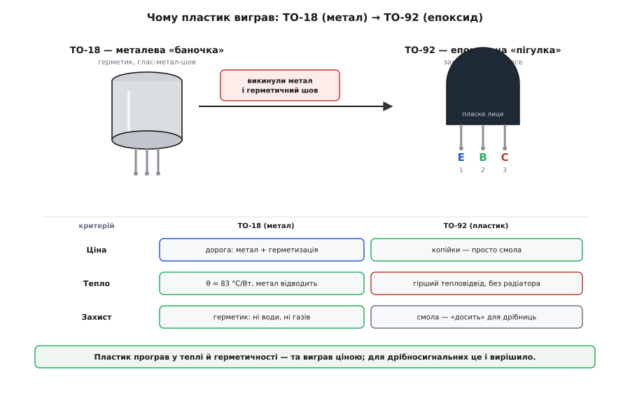

# 📜 Як «пігулка» перемогла «баночку»: історія корпусу TO-92

Візьми будь-який транзистор зі стартового набору й придивися до нього збоку. Пласке чорне лице, кругла спинка, три ніжки в ряд — форма настільки буденна, що її просто не помічаєш, як не помічаєш форму цвяха. А тим часом ця форма — не випадковість і не «як вийшло». Вона має ім'я, `TO-92`, дату народження в 1960-х і цілком конкретну причину бути саме такою: **вона дешева**. Настільки дешева, що заради цієї дешевизни інженери свідомо погодилися на гірше — гірший захист кристала, гірший відвід тепла — і не прогадали.

Щоб зрозуміти цю форму, треба відмотати на те, що було **до** неї. Бо TO-92 — це не перший спосіб запакувати транзистор, а відповідь-переможець на цілком практичне питання: як зробити, щоб один транзистор коштував копійки, а не долар. І відповідь ця стала можливою тільки тому, що трохи раніше зовсім інша людина розв'язала зовсім іншу задачу — навчилася захищати кристал не металом, а тонкою плівкою скла просто на його поверхні. Розберімо цей ланцюжок від самого початку: що таке взагалі «корпус» транзистора, звідки взялися дві букви й число в назві, чому спершу транзистори ховали в метал, що зробило метал непотрібним для дрібниці — і як вийшло, що жменя однакових чорних «пігулок» у твоєму пакетику є прямим нащадком металевих «баночок», яких ти, найпевніше, ніколи в руках і не тримав.

## Навіщо транзистору взагалі «корпус»

Почнімо з речі, яку легко проґавити: сам працюючий транзистор — це **не** та чорна пігулка, яку ти тримаєш. Пігулка — то лише **упаковка**. Усередині неї сидить крихітна пластинка кремнію завбільшки з макове зерня чи й менша — оцей шматочок і є справжній транзистор, з усіма своїми p-n-переходами. Усе інше — чорний пластик, три металеві ніжки — існує тільки заради того, щоб цю крихту можна було взяти в руки, впаяти в плату й не зламати.

Чому кристал не можна лишити голим? Три причини, і всі три невблаганні. По-перше, він **мікроскопічний і крихкий**: голий кристал розміром з піщинку неможливо ні втримати пальцями, ні надійно припаяти — його роздавиш або згубиш. Корпус дає за що взятися й три зручні ніжки в стандартному кроці. По-друге, робота транзистора відбувається на **поверхні** кремнієвого кристала, у тоненькому шарі, де сходяться переходи, — і ця поверхня страшенно чутлива до бруду. Волога з повітря, сіль із пальців, пилинка — усе це осідає на переходи й псує їх: транзистор починає «текти», втрачає підсилення, з часом гине. Корпус **герметизує** кристал від зовнішнього світу. По-третє, транзистор під час роботи **гріється** (струм крізь нього виділяє тепло), і це тепло треба кудись відвести, інакше кристал перегріється й згорить. Корпус — це ще й **тепловий міст** від гарячого кристала назовні.

Ось у цих трьох вимогах — тримати, захищати, охолоджувати — і схована вся драма історії корпусів. Бо задовольнити їх можна по-різному, дорого й дешево, і різні епохи обирали різний баланс. Метал захищає й охолоджує чудово, але дорогий. Пластик дешевий, але захищає гірше й тепло відводить погано. Уся історія TO-92 — це історія того, як для **дрібного** транзистора інженери зважили цей баланс і рішуче обрали дешевизну.

> 🔧 **Навіщо це.** Розуміння, що корпус — окрема від кристала річ зі своїми задачами, одразу пояснює дві практичні загадки набору. Перша: чому той самий кристал `2N2222` буває і в металевому, і в пластиковому корпусі з різними іменами (`2N2222` проти `PN2222`) — це **однаковий транзистор у двох різних упаковках**, і відрізняються вони не «серцем», а саме оболонкою: скільки тепла відведуть і скільки коштують. Друга: чому в даташиті на транзистор окремо пишуть «розсіювана потужність» і «тепловий опір корпусу» — це характеристики **упаковки**, а не самого переходу, і саме вони кажуть, скільки струму «пігулка» витримає, перш ніж кристал усередині перегріється.

## Дві букви й число: що насправді означає «TO-92»

Назва `TO-92` виглядає як шифр, а насправді читається просто. `TO` — це `Transistor Outline`, «обрис транзистора»; `92` — порядковий **номер стилю корпусу** в галузевому реєстрі таких обрисів. Тобто вся назва дослівно — «обрис транзистора, стиль корпусу номер 92». Важливо вловити, що це позначення описує **не транзистор, а форму коробки**: `TO-92` нічого не каже про те, NPN всередині чи PNP, кремній чи щось інше, слабкий прилад чи потужний. Це як «конверт формату С5» — сам формат не каже, що за лист усередині, лише які в конверта габарити. Тому в одному й тому самому корпусі `TO-92` живуть тисячі геть різних транзисторів; спільне в них — тільки обрис.

Хто ж завів цей реєстр обрисів і присвоїв нашій «пігулці» число 92? Організація з абревіатурою **JEDEC**, і в її історії ховається гарна дрібниця. Заснували її ще **1944 року** — тоді, коли до кремнієвих транзисторів було далеко, а королем електроніки була **вакуумна лампа**. Тому й називалася вона спершу інакше: **Joint Electron Tube Engineering Council** — «Об'єднана рада з проєктування електронних **ламп**» (англ. *tube* — лампа). Її задача була суто практична: щоб лампа з номером, скажімо, `6L6` від одного виробника фізично збігалася з `6L6` від іншого — той самий цоколь, ті самі виводи, — інакше ремонт радіоприймачів перетворився б на пекло. Реєстр стандартних форм і номерів наводив тут лад.

Коли на зміну лампам прийшли транзистори, рада не зникла, а **перекваліфікувалася**. **1958 року** її перейменували, замінивши одне слово: `Tube` (лампа) на `Device` (прилад) — вийшло **Joint Electron Device Engineering Council**, і саме ця назва стоїть за буквами JEDEC донині. Абревіатура вціліла, а зміст під нею тихо переїхав від ламп до напівпровідників. Оцей самий орган і веде список «обрисів транзисторів» — `TO-…`, — де під номером 5 значиться одна металева банка, під 18 — інша, менша, а під 92 — наша пластикова «пігулка».

*(Історична точність: перейменування 1944-го на 1958-й — задокументований факт, зафіксований у власній історії організації; це не легенда й не переказ. У сучасному, дуже прискіпливому вигляді реєстру той самий обрис проходить ще й під технічним номером `TO-226` та європейським позначенням `SOT54` — але в побуті, даташитах і на розсипах деталей його всі звуть просто `TO-92`, і ми теж будемо.)*

> 🔧 **Навіщо це.** За нудною абревіатурою ховається цілком корисне знання: `TO-92` — це **стандарт форми**, а не марка й не виробник. Тому «пігулку» `TO-92` від будь-якого заводу світу можна впаяти в ту саму плату — габарити, крок ніжок (2.54 мм — рівно клітинка макетної плати) гарантовано збігаються, бо всі виробники тримаються одного реєстрового обрису. Це та сама причина, чому лампи колись були взаємозамінні: галузь домовилася про форму. А ще звідси випливає та сама пастка, на якій горять новачки: стандарт фіксує **форму**, але **не порядок виводів** усередині неї — і саме тому дві однакові з лиця `TO-92` можуть мати колектор з емітером місцями (див. розводку конкретного номера в даташиті).

## Спершу був метал: епоха «баночок»

Перші транзистори жили в металі. Найпоширеніший обрис тієї доби — металева «баночка»: круглий сталевий ковпачок (обриси `TO-5`, а для дрібніших приладів — менший `TO-18`), крізь дно якого назовні виходять три ніжки, а самі ніжки впаяні в дно крізь **скляні** ізолятори. Уяви маленький бляшаний барильце діаметром десь п'ять міліметрів, з трьома дротиками знизу — оце й є `TO-18`, у якому, наприклад, народився славетний `2N2222` (його зареєстрували 1962 року саме в металі).

Чому метал? Бо він блискуче виконував два з трьох завдань корпусу. **Захист**: ковпачок приварювали до основи так, що всередині лишалося герметично закрите повітря (чи інертний газ), а ніжки проходили крізь дно через **спай скла з металом** (англ. *glass-to-metal seal*) — з'єднання, крізь яке не просочується ні волога, ні гази. Кристал сидів у справжньому сейфі: жодна пилинка, жодна крапля з повітря не діставалася до чутливих переходів **десятиліттями**. **Охолодження**: метал чудово проводить тепло, тож нагрітому кристалу було куди його віддати — сталевий ковпачок сам працював маленьким радіатором. Для `TO-18` тепловий опір «кристал-корпус» — близько **83 °C на кожен ват** розсіюваної потужності; менше число означало б іще кращий відвід, але й так метал випереджав те, що дасть згодом пластик.

Була в металу лише одна вада — зате вирішальна. Він **дорогий**. Точніше, дорогим був не так сам метал, як **робота**: викроїти ковпачок, вварити три скляні ізолятори, герметично приварити кришку, перевірити герметичність кожного приладу — усе це купа точних операцій над крихітною деталлю. Для транзистора, що йшов у військову рацію чи в бортову електроніку літака, така ціна була виправдана: там герметичність і надійність вартують будь-яких грошей, і метал там доречний досі. Але для транзистора, який мав піти **мільйонами** в дешеве радіо, іграшку, кишеньковий калькулятор, — метал був розкішшю, яку годі виправдати. Ринок волав про транзистор, що коштує **копійки**. А копійчаним метал не буває.

```
Метал (TO-18, TO-5)          проти          що з ним не так
──────────────────────────────────────────────────────────────
захист   герметик, спай скла з металом  ←  дорого герметизувати
тепло    метал = маленький радіатор     ←  добре, але й це коштує
ціна     купа точних операцій на штуку  ←  ОСЬ ВОНА, вада
```

Отже, картина перед 1960-ми була така: усі вміють робити чудові, надійні, довговічні металеві транзистори — і всі впираються в те, що вони задорогі для масової дрібниці. Потрібен був спосіб **викинути метал і герметизацію** — але не вбити при цьому транзистор, який без захисту поверхні швидко здихав. І тут у гру вступає людина, що про корпуси взагалі не думала.

## Тиха революція, яка зробила пластик можливим

Щоб залити транзистор дешевою пластмасою замість дорогого герметичного металу, треба спершу зняти саму причину, з якої метал був потрібен. А потрібен він був заради **захисту голої поверхні кристала**: переходи на поверхні кремнію такі вразливі, що без герметичного сейфа брудняться й гинуть. Розв'яжи цю вразливість — і герметичний метал стане не обов'язковим. Саме це й сталося, причому заради зовсім іншої мети.

**1959 року** інженер фірми Fairchild Semiconductor **Жан Ерні** (фр. *Jean Hoerni*; за походженням **швейцарець**, родом із Женеви) винайшов те, що назвали **планарним процесом** (англ. *planar process*, від *planar* — «площинний»: усі переходи виходять на одну плоску поверхню кристала). Ерні розв'язував проблему надійності тодішніх транзисторів, а не думав про здешевлення корпусів — але саме його винахід корпуси й здешевив, побічно.

Суть ось у чому. Кремній на повітрі сам собою вкривається тоненькою плівкою **діоксиду кремнію** (SiO₂) — по суті, найтоншим шаром **скла**. Доти цю плівку вважали за перешкоду й на завершальному кроці стравлювали, оголюючи переходи, — після чого їх і доводилося ховати в герметичний метал. Ерні зробив протилежне й на позір безрозсудне: він **лишив скляну плівку на місці**, назавжди накривши нею переходи прямо на кристалі. Плівка виявилася не перешкодою, а захистом — вона **запечатує** переходи там, де вони найвразливіші, просто на поверхні кремнію. Кристал став носити власний захисний панцир, вирощений на ньому самому.

Наслідок для нашої історії — прямий і величезний. Якщо переходи вже **запечатані склом на самому кристалі**, то герметичний металевий сейф навколо них стає **не потрібен**. Кристал уже й так захищений — не металом, а власною оксидною плівкою. Тепер його можна не ховати в дорогу баночку, а просто **залити дешевою пластмасою**: пластмаса тримає ніжки й боронить від грубих ударів, а тонку роботу захисту переходів уже зробила плівка SiO₂. Двері до копійчаного пластикового корпусу відчинив саме Ерні — хоч і не збирався цього робити.

*(Історична точність: авторство планарного процесу за Жаном Ерні й дату близько 1959-го підтверджують і Національна зала слави винахідників США, і Музей історії комп'ютерів — це **задокументований факт**, а не приписування. Ерні — швейцарець за походженням; це той випадок, де національність джерел не спотворюють. Роль оксидної пасивації як умови для дешевої пластикової герметизації — усталене інженерне розуміння, а не окрема гучна «першість».)*

> 🔧 **Навіщо це.** Тут ховається урок, ширший за корпуси: **велике здешевлення часто приходить не з нового корпусу, а з нової фізики під ним**. Пластиковий `TO-92` не був би можливий сам собою — його уможливила тиха зміна в тому, як захищають кристал. Практично це пояснює, чому дешевий пластиковий транзистор із набору сьогодні цілком надійний, хоч у ньому нема ніякого герметичного сейфа: справжній захист переходів — не в чорній пластмасі, яку ти бачиш, а в невидимій плівці скла на самому кремнії під нею. Пластик лише тримає й ізолює; береже кристал оксид.

## 1960-ті: народження «пігулки» TO-92

Тепер усі складові зійшлися. Планарний процес дав кристал, що **сам себе захищає** оксидною плівкою, — отже, дорогий герметичний метал для дрібного транзистора став зайвим. Лишалося вигадати **дешеву форму** замість баночки. Нею й став `TO-92`, що з'явився в **1960-х** як пряма, свідома, здешевлена заміна металевим `TO-5` і `TO-18`.

Ідея корпусу — сама простота. Кристал з тонкими золотими чи алюмінієвими дротиками-виводами кладуть на рамку з трьох ніжок (її звуть *lead frame* — «рамка виводів»), а тоді все це **заливають епоксидною смолою** в невеличкій формі — тій самій пластмасі, що застигає в тверду чорну краплю. Застигла смола робить одразу три речі: тримає кристал, з'єднує його з трьома ніжками, що стирчать назовні, і затуляє його від грубого світу. Жодного ковпачка, жодного скляного спаю, жодної перевірки герметичності — просто **залив і застигло**. Форму зробили з пласким боком (щоб було куди ставити маркування й щоб орієнтувати виводи) і круглою спинкою — звідси й упізнаваний силует «пігулки».

Виграш у ціні виявився разючим. Пластиковий корпус **прибрав найдорожче**: сам метал ковпачка й усю копітку герметизацію зі скляними спаями та перевіркою кожної штуки. Замість десятка точних операцій — по суті одне лиття. Ціна одного транзистора впала **в рази** (для рівнозначних приладів металевий варіант виходив у десятки разів дорожчим за пластиковий у дрібних партіях). Оце падіння ціни й вирішило долю: для **дрібносигнальних** транзисторів — тих самих слабеньких «підсилити-перемкнути», що йшли в масову побутову техніку мільярдами, — пластиковий `TO-92` став очевидним вибором, і вони туди й переселилися майже всі.

За дешевизну, звісно, довелося заплатити — і чесно назвати, чим саме. Пластик **гірше відводить тепло**, ніж метал: у нього нема металевого ковпачка-радіатора, тож `TO-92` без сторонньої допомоги розсіює лише десь до **0.6 вата** (типова паспортна межа — близько 625 мВт), далі кристал усередині перегрівається. Метал у цьому був відчутно кращий. І захист пластиком — це «досить добре», а не «сейф»: епоксидна крапля береже від вологи й бруду цілком пристойно (справжню тонку роботу все одно робить оксидна плівка на кристалі), але по-справжньому герметичного захисту, як у металу зі скляним спаєм, вона не дає — тому в найсуворіші застосунки (космос, оборона, де треба десятиліття абсолютної герметичності) метал лишився донині.


*Перехід 1960-х: у металевій «баночці» TO-18 кристал сидить у герметичному сейфі зі скляним спаєм — надійно, та дорого; у пластиковій «пігулці» TO-92 його просто залито епоксидом. Пластик відводить тепло гірше й не дає справжньої герметичності — але коштує копійки, і саме ціна вирішила справу для дрібносигнальних транзисторів.*

Отак і вийшов той компроміс, який ти тримаєш у руках: `TO-92` — **свідомо гірший** за метал у захисті й тепловідводі, зате **набагато дешевший**, і для слабенького транзистора з набору цей обмін цілком вартий свічок.

> 🔧 **Навіщо це.** Оцей компроміс — не історична дрібниця, а пряма інструкція, коли `TO-92` доречний, а коли ні. Слабкий сигнал, дрібний струм, кімнатна техніка — пластикова «пігулка» ідеальна, бо тут її дешевизна безкоштовна: тепла виділяється мало, герметичність не критична. Але щойно транзистор має тягнути **ампери годинами** й розсіювати понад пів вата — межа пластику дається взнаки: кристал перегрівається, бо тепловідвід кволий. Саме тому потужні транзистори живуть не в `TO-92`, а в корпусах із металевою підошвою під радіатор (як `TO-220`) — там знову платять за метал, бо тепер тепло вирішує. Історія переходу метал→пластик, по суті, і є мапа цього вибору: дешевизна виграє там, де тепла мало; метал повертається там, де тепла багато.

## 1966-й: Motorola заселяє «пігулку»

Форма корпусу — це лише можливість; заповнити її реальними транзисторами мали конкретні заводи. І тут головна дійова особа — американська **Motorola**. Уже **1966 року** вона випускала в корпусі `TO-92` свій дрібносигнальний NPN-транзистор `2N3904` — ту саму «робочу конячку», що донині лежить чи не в кожному стартовому наборі. Того ж таки 1966-го поряд з ним став його дзеркальний двійник, PNP-транзистор `2N3906`; обидва задокументовані в довіднику Motorola за 1966 рік і від початку задумані як **комплементарна пара** — щоб будувати симетричні схеми, де потрібні однакові NPN і PNP.

Це не був поодинокий крок однієї фірми — це був **початок великого переселення**. Слідом за Motorola свої дрібносигнальні транзистори в дешевий пластик перевели й інші виробники (зокрема та сама Fairchild, звідки вийшов планарний процес), і за кілька років `TO-92` став **стандартною домівкою** для мало не всіх слабких транзисторів масового вжитку. Старі металеві номери діставали пластикових тезок: металевий `2N2222` у `TO-18` отримав пластикового брата в `TO-92` під іменем `PN2222` (той самий кристал, той самий характер — лише корпус дешевший і межа струму трохи нижча, бо тепловідвід кволіший).

Чому саме `2N3904` став обличчям цієї доби — зрозуміло з його ролі. Дешевий, універсальний, «на всі руки» дрібносигнальний ключ і підсилювач, він потрапив у безліч схем і підручників і зробився таким собі **еталоном** «звичайного транзистора». А що жив він від початку в `TO-92`, то й сам корпус зрісся в уяві з образом «типового транзистора»: скажи «транзистор» — і більшість уявить саме чорну пігулку на трьох ніжках. Мільярди вироблених `2N3904` та його рідні у `TO-92` і закріпили цю форму як **типову**.

*(Історична точність: рік 1966 і корпус `TO-92` для `2N3904`/`2N3906` виробництва Motorola підтверджені кількома незалежними джерелами й перегукуються з появою цих номерів у довіднику Motorola Semiconductor за 1966 рік — статус **задокументований факт**. Що першу комерційну появу `TO-92` пов'язують саме з цими приладами Motorola — теж усталена в галузі згадка; сам корпус як обрис з'явився в реєстрі трохи раніше в 1960-х, а `2N3904` — його ранній масовий «мешканець».)*

> 🔧 **Навіщо це.** Цей епізод пояснює дрібну плутанину, на яку натикаєшся в наборі: чому `2N2222` буває «якийсь не такий». У наборі майже завжди лежить **пластиковий** `PN2222` (або `P2N2222`) у `TO-92`, тимчасом як «канонічний» `2N2222` з підручника — це **металевий** `TO-18` прилад 1962 року. Це не помилка й не підробка, а рівно той самий кристал, переселений у копійчаний пластиковий корпус під час великого переселення 1960-х; на макеті поводиться однаково, лише витримає трохи менший струм, бо пластик гірше відводить тепло. Знаючи цю історію, не дивуєшся розбіжності імен і паспортних меж: це просто дві епохи корпусування одного транзистора.

## Що з цієї історії винести

Чорна «пігулка» на трьох ніжках, яку ти дістаєш із пакетика, — це `TO-92`, тобто «обрис транзистора, стиль корпусу №92» з реєстру, який веде JEDEC (та сама рада, що народилася 1944-го для вакуумних **ламп** і 1958-го перекваліфікувалася на напівпровідникові **прилади**, змінивши в назві одне слово). Позначення описує **форму**, а не сам транзистор: у цій формі живуть тисячі різних приладів.

З'явилася ця форма в **1960-х** як свідома **дешева заміна** металевим «баночкам» (`TO-5`, `TO-18`), у яких транзистори жили доти. Метал захищав кристал герметично й добре відводив тепло — але був **дорогий** через складну герметизацію зі скляними спаями. Уможливив перехід на копійчаний пластик винахід, зроблений заради іншого: **планарний процес** Жана Ерні (Fairchild, близько 1959-го, за походженням швейцарець) накрив вразливі переходи захисною плівкою скла (SiO₂) просто на кристалі — і герметичний метал для дрібного транзистора став зайвим. Тепер кристал можна було просто **залити епоксидом**: тримати й ізолювати, а береже його власна оксидна плівка.

Заповнила нову форму реальними приладами **Motorola**: уже **1966 року** її `2N3904` (і парний `2N3906`) вийшли в `TO-92`, ставши обличчям цілого переселення дрібносигнальних транзисторів у дешевий пластик. Ціною цієї дешевизни був **гірший тепловідвід** (до ~0.6 Вт без радіатора) і не по-справжньому герметичний захист — тому для потужного й для найсуворіших застосунків метал лишився. Але для слабенької «підсилити-перемкнути» дрібниці обмін «трохи гірше, зате копійки» виявився безпрограшним — і тому вся жменя однакових чорних пігулок у твоєму наборі є прямими нащадками металевих «баночок», яких перемогла не якість, а **ціна**.
