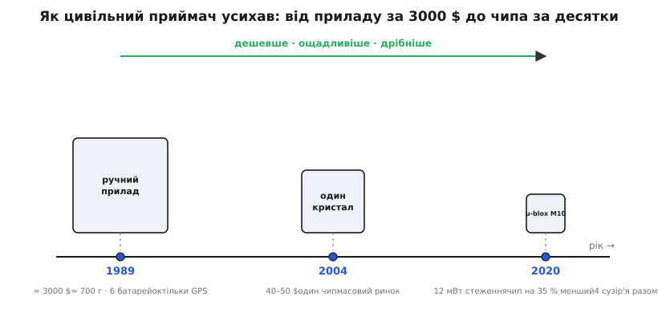

# 📜 Як приймач усох до чипа: коротка історія супутникового навігатора

Дивна річ: сама можливість дізнатися своє місце з точністю до метра, ловлячи відлуння атомних годинників за двадцять тисяч кілометрів над головою, старша за більшість людей, що нею користуються щодня. Але ще дивніше інше. Тридцять років тому, щоб отримати те саме, що зараз робить платівка розміром із поштову марку за кілька доларів, треба було нести в руках прилад завбільшки з цеглину, платити за нього як за пристойний уживаний автомобіль і міняти в ньому півдюжини батарейок. Уся ця історія — про одне-єдине число, що падало й падало: скільки коштує, скільки важить і скільки їсть коробочка, яка каже, де ви. Розберемося, як воно так усохло — і чому саме таке усихання й зробило можливими модулі на кшталт того, що лежить у вас на столі.

Одразу проведімо межу, без якої в цій історії плутаються всі. Є **сузір'я супутників** — залізо на орбіті, яке хтось запустив, утримує й оплачує. І є **приймач** — коробочка на землі, яка ті супутники слухає. Це дві геть різні речі з різними власниками й різними долями. Сузір'я GPS збудували американські військові; воно й досі військове. А приймач — товар, який робить хто завгодно й продає кому завгодно, і саме приймач за ці тридцять років пройшов шлях від цеглини до порошинки. Сузір'я майже не змінилося; змінилося те, чим його слухають.

## Небо було військове

Почнімо з неба, бо приймачу нема чого ловити без нього. Систему, яку ми звемо GPS (повна назва — *Navstar GPS*), замовило Міністерство оборони США, щоб їхні кораблі, літаки й ракети знали своє місце будь-де на планеті будь-якої погоди. Перший робочий супутник цієї системи, Navstar 1, пішов на орбіту 22 лютого 1978 року — це усталена, добре задокументована дата. Далі десятиліттями нарощували сузір'я, і повної робочої готовності — коли над кожною точкою Землі цілодобово видно достатньо супутників для надійного рішення — GPS досягла у 1995 році, з повним угрупованням у 24 супутники.

Тут ховається деталь, без якої не зрозуміти, чому цивільні приймачі довго були неточними. Військові свідомо **загрублювали** сигнал для всіх, окрім себе. Механізм звався «вибіркова доступність» (англ. *Selective Availability*): у відкриту, цивільну частину сигналу навмисно підмішували похибку, щоб чужа ракета не могла навестися по американському ж GPS. Через це до певного часу цивільний приймач, хоч який добрий, показував місце з розкидом близько ста метрів — годиться доплисти до потрібної бухти, але не більше.

Усе змінилося вночі проти 2 травня 2000 року. За розпорядженням уряду США вибіркову доступність вимкнули — назавжди й для всіх. Цивільна точність тієї самої ночі стрибнула приблизно зі ста метрів до двох десятків. Це водорозділ усієї побутової навігації: рівно з цього моменту масовий GPS став по-справжньому корисним — тим, що доводить вас не до кварталу, а до конкретного повороту. Дешеві приймачі, автонавігатори, згодом смартфони виросли вже на цьому, розгрубленому небі. Залізо на орбіті лишилося військовим; але сигнал відкрили — і на землі почалося.

> 🔧 **Навіщо ця межа.** Плутанина «GPS проти GNSS» майже завжди росте з того, що люди зливають сузір'я й приймач в одне. Ваш модуль — це приймач, комерційний і всеїдний: йому байдуже, чиї супутники ловити, і він бере американську GPS, російську GLONASS, китайську BeiDou, європейську Galileo, японську QZSS — усе, що видно, у спільне рішення. «GPS» правильно лишити за одним американським сузір'ям, а те, що робить коробочка на столі, звати ширшим словом GNSS. Як приймач розв'язує положення з кількох сузань відразу — [окремо про супутникову навігацію](topic:communications/gnss).

## Цеглина за три тисячі доларів

Тепер спустімося з орбіти на землю й візьмімо в руки перший приймач, який звичайна людина могла купити. 1989 рік, фірма Magellan випускає **NAV 1000** — перший серійний ручний GPS-приймач для широкого покупця. Погляньмо на нього тверезо, у цифрах, бо саме від них ми відлічуватимемо все усихання далі.

Коштував він близько трьох тисяч доларів за штуку — і це доларів 1989 року, тобто на нинішні гроші десь удвічі-втричі більше. Важив близько півтора фунта — сім сотень грамів, як пляшка води. Живився від шести пальчикових батарейок. І — найголовніше для розуміння тодішньої межі — ловив **лише GPS** (інших цивільних сузань іще просто не було), бачив небагато супутників за раз і на перше рішення міг думати хвилини. За перший рік таких продали близько п'ятисот штук; купували переважно моряки, бо в морі немає доріг і знаків, і навіть грубе місце коштує будь-яких грошей.

Спитаймо чесно: **чому** ця коробочка була така велика й дорога? Не через жадібність і не через відсталість. Ловити сигнал GPS фізично важко. Він приходить із орбіти таким слабким, що тоне під власним тепловим шумом електроніки; його треба виловити, підсилити, розкласти, виміряти затримки з наносекундною точністю й розв'язати з них геометричну задачу. У 1989-му на це йшла ціла жменя окремих мікросхем — радіочастина, обчислювач, пам'ять, — кожна на своїй платі, кожна їсть струм і займає місце. Розмір і ціна NAV 1000 — це прямий відбиток того, скільки заліза тоді треба було, щоб зробити роботу, яку сьогодні тягне один кристал.

## Усе на один кристал

Тепер — головний важіль усієї історії, той самий, що змусив число падати. Він не в небі й не в антені, а в тому самому законі, що здешевив геть усю електроніку: те, що вчора вимагало десятка окремих мікросхем, завтра вміщується в одну, а післязавтра — у ріжок однієї. Складна начинка приймача рік за роком «в'їжджала» в кремній: спершу кілька чипів замість плати, потім один чип замість кількох.

Знакова віха на цьому шляху — родина **SiRFstarIII** фірми SiRF Technology, представлена у 2004 році: практично весь приймач — радіо, кореляція, обчислення — на одному кристалі, ще й помітно чутливіший за попередників, тож він ловив супутники навіть там, де старіші мовчали. І от що зробила ця однокристальність із ціною. Ще на межі тисячоліть GPS-модуль коштував двісті-триста доларів; хвиля здешевлення від таких однокристальних рішень збила цю ціну приблизно до сорока-п'ятдесяти доларів за модуль уже на середину 2000-х. Саме тоді GPS полився в масовий товар — в автонавігатори, у перші телефони з навігацією, у логери для туристів.


*Одне число падало три десятиліття поспіль: скільки коштує, важить і їсть коробочка, що каже, де ви. Від приладу за три тисячі доларів — до чипа за десятки, а далі до платформи, яку рахують уже не в доларах ваги, а в міліватах споживання.*

Тут варто зупинитися на різниці двох слів, які легко сплутати, — **чип** і **модуль**. Чип — це голий кристал: серце, але саме по собі воно ще не працює, бо потребує обв'язки, антени, живлення, вивірених доріжок. Модуль — це коли хтось узяв чип, оточив його всім потрібним, вивірив і вивів назовні кілька зрозумілих контактів. NAV 1000 був цілим приладом із екраном; SiRFstarIII був чипом, який ще треба було комусь «одягнути»; а те, що лежить у вас, — модуль, готовий вузол між ними. І щоб зрозуміти, звідки взявся саме такий модуль, треба тепер прийти до фірми, чиє серце в ньому б'ється.

## Швейцарці з Тальвіля

1997 рік, Швейцарія, Вища технічна школа Цюриха (нім. *ETH Zürich*). Троє її випускників-дослідників — **Даніель Амман** (нім. Daniel Ammann), **Жан-П'єр Вісс** (нім. Jean-Pierre Wyss) і **Андреас Тіль** (нім. Andreas Thiel) — у межах післядипломної роботи роблять, як вони самі це називали, найменший на той час у світі GPS-модуль. За кілька місяців вони разом зі своїм професором і наставником-інвестором засновують фірму й дають їй ім'я **u-blox**. Сидить вона в містечку Тальвіль (нім. Thalwil) на березі Цюрихського озера — там і донині.

Показово, з чого u-blox почала заробляти. Її перший серійний GNSS-модуль пішов у 1998 році не в іграшку й не в моряцький прилад, а у швейцарську систему платних доріг для вантажівок (нім. скорочення LSVA): кожна фура возила приймач, що чесно рахував пройдений кілометраж для збору мита. Нудно? Навпаки — саме такі невидимі, буденні застосування й тягнуть техніку вперед: їм потрібні дешевизна, надійність і мализна, а не гучність. А вже у 2000 році u-blox дала GPS-модуль для, за її ж словами, першого у світі мобільного телефона з супутниковою навігацією. Швейцарці рано зрозуміли, куди все котиться: приймач буде не приладом, а деталькою всередині чужих речей — і взялися робити саме деталь.

Важлива для нашої історії риса u-blox: із певного моменту вона перестала купувати чужі чипи й почала розробляти власні кремнієві платформи — покоління за поколінням, під номерами. Кожне нове покоління тиснуло на ті самі два важелі: більше сузань слухати за раз — і менше струму на це витрачати. Дійшовши до восьмого покоління, ці платформи вже впевнено вели кілька сузань одночасно. А далі настала черга покоління, чиє серце й опинилося у вашому модулі.

## M10: коли важить уже не ціна, а міліват

5 листопада 2020 року u-blox представила платформу **M10** — те саме покоління, що стоїть під керамічною антеною BE-182 (конкретна модель кристала — UBX-M10050). І тут варто уважно подивитися, куди на цьому етапі перемістилася сама боротьба. Ціну попередні тридцять років уже збили: приймач давно копійчаний. Розмір теж — це давно кристал. Лишилося останнє число, яке ще заважало пхати навігацію геть усюди, — **скільки вона їсть струму**.

Бо подумаймо, де тепер живе GNSS. Не в приладі з розеткою, а в тому, що мусить тижнями жити від малесенького акумулятора: у нашийнику для собаки, у трекері для валізи, у годиннику на руці, у дроні, де кожен грам ваги батареї — це відібрана хвилина польоту. Для всього цього головним ворогом стає не ціна чипа, а його апетит: приймач, який швидко висмоктує батарею, у нашийник не поставиш.

Саме сюди й цілила M10, і цифри з прес-релізу u-blox тут промовисті. У режимі безперервного стеження платформа бере близько **12 мВт** — приблизно **вп'ятеро менше**, ніж попереднє покоління u-blox тієї самої, метрової точності. Сам кристал при цьому вийшов ще й на **35 % меншим** за попередника, а слухати він уміє **до чотирьох сузань** водночас. Порахуймо, що таке це «вп'ятеро», найпростішою рукою:

**Умова:** те саме стеження раніше коштувало б близько 60 мВт; M10 бере 12 мВт. Наскільки довше протягне та сама батарея?

```
було        ≈ 60 мВт
стало       ≈ 12 мВт
виграш      = 60 / 12
            = 5 разів
```

П'ятикратний виграш — це не про «трохи ощадливіше». Це різниця між трекером, який тримається день, і тим, що тримається тиждень; між дроном, у якого GPS помітно гризе баланс живлення, і тим, у якого приймач на цьому тлі майже непомітний. Здешевлення відкрило GNSS дорогу в масовий товар ще у 2000-х; а от це падіння апетиту відкрило йому дорогу в те, що весь час на батареї, — у носиме й летюче. Без цього кроку модуль, який можна безоглядно почепити на дрон чи в кишеньковий трекер і не рахувати кожен його міліампер, просто не мав би сенсу.

І ось коло замикається саме на тій платівці, що у вас у руках. BE-182 — це, по суті, останній щабель усієї цієї тридцятирічної драбини: серце від M10 (дешеве, дрібне й ощадливе — рівно те, за що билися три покоління інженерів), одягнене китайською фірмою Beitian у готовий модуль із власною антеною й чотирма дротами назовні. Те, що колись важило сім сотень грамів, коштувало як автомобіль і бачило самі лише американські супутники, тепер важить одиниці грамів, коштує кілька доларів, їсть міліамперами й слухає півсвіту сузань. Історія супутникового навігатора — це, зрештою, історія одного числа, яке впало так низько, що коробочку, яка знає ваше місце, стало не жаль пришити до собачого нашийника.

## Що з усього цього варте пам'яті

Проза історії розсипається на три тверді факти, які легко втримати в голові — і які варто відрізняти за їхньою доказовістю.

Перше, **усталене й задокументоване**: GPS — військова система США (Navstar 1 на орбіті з 22 лютого 1978 року), а цивільну точність відкрили вимкненням «вибіркової доступності» вночі проти 2 травня 2000 року, коли розкид стрибнув зі ста метрів до двох десятків. Це стосується **сузір'я**, і воно спільне для всіх приймачів світу.

Друге, теж **добре задокументоване**: приймач усихав окремо від неба й завдяки кремнію — від приладу Magellan NAV 1000 за три тисячі доларів (1989) через однокристальні рішення на кшталт SiRFstarIII (2004), що збили ціну модуля до десятків доларів, до сучасних платформ. Тут число падало три десятиліття поспіль.

Третє, **прямо з прес-релізу виробника** (тобто факт достовірний, але поданий самою фірмою — з поправкою на рекламний тон): платформу u-blox M10 представлено 5 листопада 2020 року, її коник — близько 12 мВт у стеженні, приблизно вп'ятеро ощадливіше за попереднє покоління тієї самої точності, кристал на 35 % менший, до чотирьох сузань разом. Саме цей крок — не по ціні, а по споживанню — і зробив можливими крихітні GNSS-модулі для всього, що живе на батареї.

Тримайте ці три речі нарізно — і ніколи не сплутаєте, що в модулі від американських військових, що від швейцарських інженерів, а що від закону, за яким дешевшає кремній.
