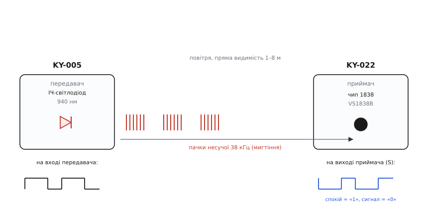
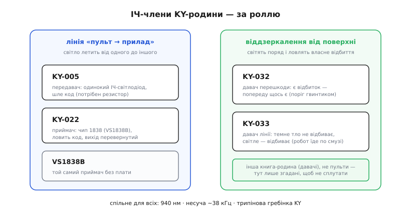

# Родина KY-xxx (Keyes «37 в одному»)

<preknowlist>
- [KY-серія (Keyes 37-в-1)](topic:sensors/ky-series) — спільна порода синіх модулів: трипінова гребінка з живленням посередині, всеїдне 3.3–5 В, «номер важливіший за виробника». Тут — лише ІЧ-члени цієї родини, тож загальні звички роботи з платою беруться звідти.
- [Модуляція несучої 38 кГц](topic:communications/carrier-ir-modulation) — чому пульт не світить рівно, а мигтить на 38 кГц, і як це відрізняє його від сонця й ламп; без цього не зрозуміти, що спільного в усіх ІЧ-модулів серії.
- [Рівні «0» і «1»](topic:electronics/logic-levels-as-ranges) — що вхід читає як HIGH і LOW і чому 5-вольтовий рівень на 3.3-вольтовому вході — біда; рівень на виході ІЧ-приймача дорівнює напрузі його живлення.
- [Закон Ома](topic:electronics/ohms-law) — U = I · R; звідси рахують послідовний резистор для ІЧ-світлодіода передавача.
</preknowlist>

У коробці «37 датчиків для Arduino» кілька платок мають справу не зі звичайним світлом, теплом чи звуком, а з **інфрачервоним (лат. *infra* — «нижче», нижче за червоний край видимого) променем** — тим самим невидимим світлом, яким пульт розмовляє з телевізором. Це не один модуль, а маленька родина всередині родини: передавач, приймач, і пара давачів, що світять самі собі під ноги. Усі вони — члени [KY-серії](topic:sensors/ky-series) й діляться її спільною породою (трипінова гребінка, всеїдне живлення, номер важливіший за виробника), але між собою їх ріднить ще одне, глибше: усі вони працюють на **одній фізиці невидимого світла на 38 кілогерц**, і саме ця фізика диктує, як їх під'єднувати й де вони кусаються.

Розберімо цю ІЧ-підродину так, щоб з першого погляду знати, який номер що робить, чому пульти йдуть парою, які три-чотири застороги спільні для всіх них, — і де межа між «пультами» й тими давачами, що теж світять в інфрачервоному, але зовсім для іншого. Загальну історію бренду й спільний формат гребінки тут не переказуємо — вони живуть в [огляді всієї KY-серії](topic:sensors/ky-series); нам вистачить того, що ці платки — рідня, і зосередимось на тому, що робить їх саме **ІЧ-рідней**.

## Одне світло, дві половини: чому пульти йдуть парою

Почнімо з головного, бо звідси випливає вся будова цієї підродини. Інфрачервоний зв'язок пультом — це **однобічна лінія в один кінець**: один прилад **світить** закодованим променем, другий цей промінь **ловить** і перетворює назад у логіку. Тому в коробці ІЧ-модулів завжди щонайменше двоє, і вони — дзеркальні половини одного каналу.

**Передавач — [KY-005](topic:connect/ky-005-ir-tx)** — це фактично один інфрачервоний світлодіод на платі з трьома контактами. Його завдання просте до аскетизму: спалахувати невидимим світлом рівно тоді, коли мікроконтролер смикне ногою. Він не міряє нічого — він *випромінює*. Продають його також під ім'ям **HW-489**.

**Приймач — [KY-022](topic:connect/ky-022-ir-rx)** — робить точно зворотне: у нього спереду чорна крапля-фотоприймач, яка ловить чуже ІЧ-мигтіння, чистить його від фону й віддає на вихід охайний цифровий сигнал. Він теж нічого не *робить* у світ — він *слухає*. Друге його ім'я — **HW-490**.

Разом вони складають повний ІЧ-канал: KY-005 говорить, KY-022 слухає. І найкорисніше, що з цієї пари випливає, — **режим «запиши й повтори»**: наводиш рідний пульт від телевізора на KY-022, той ловить код кожної кнопки, ти запам'ятовуєш ці числа, а потім віддаєш їх назад через KY-005 — і твоя плата стає точною копією пульта. Одна половина підслуховує, друга відтворює.



*Повний ІЧ-канал підродини. Ліворуч KY-005 мигтить світлодіодом 940 нм пачками несучої 38 кГц; крізь повітря (пряма видимість, метри) вони летять до KY-022 праворуч, де чип 1838 знімає несучу. Унизу — два сигнали в часі: на вході передавача проста обвідна «є код / нема», на виході приймача — та сама обвідна, але **перевернута**: у спокої «1», кожна ІЧ-пачка притискає вихід у «0».*

> 🔧 **Навіщо це.** Коли задача звучить «керувати з пульта» або «зробити свій пульт», ти одразу знаєш, скільки модулів брати й для чого кожен. Треба *приймати* команди (увімкнути стрічку світла, перемкнути режим робота з дивана) — бери KY-022. Треба *слати* команди (плата вдає пульт, керує телевізором чи кондиціонером) — бери KY-005. Треба і те, й те (клонувати чужий пульт) — бери обидва: одним підслуховуєш коди, другим їх відтворюєш. Плутанина «який із них який» коштує години, а різниця проста: у передавача світлодіод, у приймача — чорна крапля.

## Голий приймач: та сама крапля без плати

Є ще третій член, який варто знати, бо він — серце KY-022, витягнуте назовні. Це [VS1838B](topic:connect/vs1838b-ir-rx) (він же **TL1838**, **HX1838** або просто **1838**) — сам чип-приймач, чорна намистина на трьох коротеньких ніжках, **без плати, без гребінки, без світлодіода-індикатора**. Усередині нього вже все: фотодіод, підсилювач, смуговий фільтр на 38 кГц і демодулятор. KY-022 — це і є цей чип, посаджений на зручну платку з підписаними контактами й видимим індикатором.

Навіщо знати про голу краплю, якщо є зручний KY-022? Бо часто вона доречніша. Коли місця обмаль, коли платка з гребінкою завелика, коли ти паяєш власний пристрій, а не макетуєш, — голий VS1838B дешевший, менший і не тягне зайвого струму на світлодіод-індикатор. А поводиться він точно так само, з тими самими пастками: вихід перевернутий, живлення посередині немає (у нього своя цоколівка з трьох ніжок), несуча — ті самі 38 кГц. Уся глибока фізика приймача — чому саме 38 кГц, як усередині влаштовані підсилювач зі змінним підсиленням і фільтр — розібрана в [статті про сам чип VS1838B](topic:connect/vs1838b-ir-rx); тут важливо лиш, що KY-022 і гола крапля — це один приймач у двох одежах, і вибір між ними — це вибір «зручно на макетці» проти «компактно у виробі».

## Що ріднить усіх: невидиме світло на 38 кілогерц

Тепер — спільна фізика, без якої жоден із цих модулів не має сенсу. Вона однакова для передавача й приймача, і саме її треба тримати в голові, щоб розуміти, чому вони кусаються там, де кусаються.

**Світло невидиме — 940 нанометрів.** ІЧ-світлодіод передавача світить на довжині хвилі близько 940 нм — це ближній інфрачервоний, якого око не бачить узагалі. Звідси перша практична дивина: **на око неможливо сказати, чи модуль працює**. Наведи камеру телефона — і побачиш, як купол світлодіода блимає блідо-фіолетовим (матриці камер, на відміну від ока, чутливі до ближнього ІЧ). Це найшвидший спосіб відрізнити мертвий передавач від живого.

**Світло не рівне — воно мигтить на 38 кГц.** Ось головна хитрість усього ІЧ-пульта, і вона спільна для передавача й приймача. Коли KY-005 передає «одиницю», він **не світить рівно** — він вмикається й гасне близько 38 000 разів на секунду. Око (і навіть камера) цього мигтіння не ловить, але приймач KY-022 налаштований реагувати **тільки** на світло, що блимає біля 38 кГц. Навіщо така складність? Бо інфрачервоного світла навколо повно: його ллють сонце, лампи, тепле тіло. Якби приймач ловив будь-яке ІЧ, він би без упину спрацьовував від фону. А так — рівне тло від сонця для нього «сталий рівень», який фільтр викидає; лишається тільки пачка на 38 кГц від пульта. Це амплітудна модуляція несучої: корисний код «їде» на швидкому мигтінні, як радіостанція на своїй хвилі. Чому саме несуча відсіює фон і чому саме така частота — [модуляція несучої 38 кГц](topic:communications/carrier-ir-modulation).

**Код — це довжини пачок і пауз.** Самі біти повідомлення — «яку кнопку натиснуто» — кодуються довжиною спалахів несучої та тиші між ними. Найпоширеніший спосіб у побутовій техніці — **протокол NEC** (за японською компанією NEC, звідки він пішов; статус — усталений де-факто стандарт пультів). Але ти цих тонкощів рахувати руками не мусиш: і на боці передавача, і на боці приймача цим займається готова бібліотека. Звідки взявся цей стандарт 38 кГц і чому пульти всього світу зійшлися на схожих протоколах — окрема історія: [як народився ІЧ-пульт](topic:connect/ky-ir-modules/hist-ir-remote.md).

Ось чому ці два числа — **940 нм і 38 кГц** — треба знати про всю підродину відразу: 940 нм пояснює, чому око нічого не бачить (і чому перевіряють камерою), а 38 кГц — чому приймач взагалі здатен виловити кволий пульт серед яскравого дня.

## Дві застороги, спільні для ІЧ-пари

За впізнаваною зовнішністю ховаються рівно дві пастки, на яких спотикаються майже всі, — і обидві специфічні саме для ІЧ-модулів, тож в огляді загальної серії їх немає.

**Перша — вихід приймача перевернутий.** Це найголовніше, і воно ловить кожного новачка. У спокої, коли ІЧ-пачки немає, на виводі S приймача — **високий рівень («1»)**. Щойно приймач ловить пачку від пульта — він притискає вихід **до землі («0»)**. Тобто активний стан — це **нуль**, а спокій — одиниця:

```
нема сигналу (спокій):   S = «1» (HIGH)   ← вихід відпущений, підтяжка тримає вгорі
є 38-кГц пачка:          S = «0» (LOW)    ← приймач притиснув лінію до землі
```

Наївний рядок «якщо на піні HIGH — прийшов сигнал» дасть тобі рівно протилежне: він «бачитиме сигнал» увесь час, поки пульт мовчить, і замовкатиме на натиск. Правило одне: у ручній логіці **активним вважай LOW**. На щастя, коли працюєш через бібліотеку, ця перевернутість схована всередині — думати про неї не доводиться.

**Друга — передавачу обов'язковий послідовний резистор.** На платі KY-005 є посадкове місце під резистор, але на заводі воно **порожнє** — площадки не заповнені. Тобто «з коробки» сигнальний пін з'єднаний зі світлодіодом майже навпростець. Подаси напругу без резистора — струм обмежить лише малий опір самого світлодіода, і він або згорить, або перевантажить вивід мікроконтролера. Резистор задає безпечний струм; рахують його простим [законом Ома](topic:electronics/ohms-law):

**Умова: живлення 5 В, падіння на ІЧ-світлодіоді ≈ 1.1 В, бажаний струм ≈ 18 мА.**

```
U_резистора = U_живлення − U_світлодіода = 5 − 1.1 = 3.9 В
R = U_резистора / I = 3.9 / 0.018 ≈ 217 Ω   →  беремо 220 Ω

для 3.3-вольтової плати «зверху» менше:
U_резистора = 3.3 − 1.1 = 2.2 В
R = 2.2 / 0.018 ≈ 122 Ω   →  беремо 120 Ω
```

Тобто **220 Ω при 5 В, 120 Ω при 3.3 В** — і байдуже, впаяти його в порожнє місце на платі чи поставити зовні в розрив сигналу: у послідовному колі струм усюди однаковий. Приймач же, на відміну від передавача, зовнішнього резистора не просить: його підтяжка виходу вже вбудована в чип.

І ще одна спільна дрібниця, яку успадкували від усієї серії, але яка на ІЧ-парі гостріша: **порядок двох крайніх штирів S і − не стандартизований** між виробниками. Живлення завжди посередині (без напису), а от де сигнал і де земля по краях — на клоні буває навпаки. Тому «як на чужому фото» тут не працює: бери **свою** плату й дивись на друковані літери **S** і **−**.

## Родичі, що світять собі під ноги: не пульти

Тепер важлива межа, бо в коробці є ще ІЧ-модулі, які легко сплутати з пультами, а вони — зовсім про інше. KY-005 і KY-022 роблять **лінію між двома приладами**: світло летить від одного до іншого. А є пара давачів, де світло **вертається до себе** — модуль сам світить інфрачервоним уперед і сам ловить власне відбиття від поверхні.

**KY-032 — давач перешкоди.** На ньому поряд стоять ІЧ-світлодіод і ІЧ-приймач, обидва дивляться вперед. Світлодіод світить, приймач ловить відбите: є перед носом перешкода — світло відбивається назад, приймач бачить його й каже «щось є»; порожньо попереду — світлу нема від чого відбитися, вихід мовчить. Поріг чутливості крутять гвинтиком. Це не зв'язок, а **вимірювання відстані навпомацки світлом**.

**KY-033 — давач лінії** (його ще звуть «hunt» — стежковий). Та сама ідея відбиття, але наведена вниз, на підлогу: світла поверхня добре відбиває ІЧ, темна — поглинає. Робот із таким давачем «бачить» під собою чорну смугу на білому тлі й їде вздовж неї. Це основа найпростіших роботів-візків, що катаються по намальованій трасі.



*ІЧ-члени серії за тим, куди летить світло. Ліворуч — **пульти**: KY-005 шле код, KY-022 його ловить, VS1838B — той самий приймач без плати; світло йде від одного приладу до іншого. Праворуч — **віддзеркалення**: KY-032 і KY-033 світять уперед і ловлять власне відбиття (перешкода / лінія на підлозі). Спільне для всіх — 940 нм, несуча ~38 кГц і трипінова гребінка KY.*

Чому їх варто розрізняти чітко? Бо **фізика спільна, а задача протилежна**, і плутанина веде до глухого кута. Спробуєш «прийняти пульт» на KY-032 — нічого не вийде, бо він налаштований на відбиття зблизька, а не на далекий кодований промінь. Ці давачі відбиття — окрема тема ([ІЧ-давачі перешкод FC-51 / KY-032](topic:sensors/ir-obstacle)) й живуть у книзі давачів, не тут; згадуємо їх лише щоб ти не витрачав час, силкуючись зробити з давача лінії пульт. У цій статті-огляді «пультами» звемо саме пару KY-005 / KY-022, і саме на ній зосереджені застороги вище.

## Як обрати: короткий путівник

Коли перед тобою відкрита коробка, а треба щось «на інфрачервоному», питання зводиться до того, **куди має летіти світло і що ти хочеш зробити**:

- **Слати команди приладам** (плата вдає пульт: керує телевізором, кондиціонером, іншим ІЧ-пристроєм) → **KY-005**. Не забудь послідовний резистор.
- **Приймати команди від пульта** (керувати своїм пристроєм із дивана рідним пультом) → **KY-022** на макетці, або гола [VS1838B](topic:connect/vs1838b-ir-rx) у компактному виробі.
- **Клонувати чужий пульт** (записати коди й відтворювати) → **обидва**: KY-022 підслуховує, KY-005 відтворює.
- **Відчути перешкоду чи їхати по лінії** → це вже не пульти, а давачі відбиття [KY-032 / KY-033](topic:sensors/ir-obstacle) — інша полиця, хоч і те саме невидиме світло.

І три поправки, спільні для всієї ІЧ-пари, які варто тримати в голові при будь-якому виборі. Живлення модуля бери **під логіку своєї плати** (5-вольтовій — 5 В, 3.3-вольтовій — 3.3 В), бо рівень на виході приймача дорівнює його живленню, і 5 В уб'ють 3.3-вольтовий вхід [ESP32](topic:boards/esp32-family). Дальність голого передавача — **метри, а не десятки метрів**: рівно на кімнату; хочеш більше — став транзисторний ключ і живи світлодіод окремо. І завжди читай **друковані літери** на конкретній платі, бо порядок крайніх штирів у серії гуляє.

## Що з цього винести

ІЧ-члени KY-серії — це **маленька родина всередині родини**, яку ріднить не лише спільний формат синіх платок, а одна фізика невидимого світла: **940 нм** (тому око не бачить, а перевіряють камерою) і **несуча ~38 кГц** (тому приймач ловить кволий пульт серед яскравого дня). Серце підродини — **пара-дзеркало**: передавач [KY-005](topic:connect/ky-005-ir-tx) світить кодом, приймач [KY-022](topic:connect/ky-022-ir-rx) (він же гола крапля [VS1838B](topic:connect/vs1838b-ir-rx)) цей код ловить, і разом вони дають режим «запиши й повтори». Дві застороги, яких немає в загальному огляді серії, специфічні саме для ІЧ: **вихід приймача перевернутий** (спокій «1», сигнал «0») і **передавачу обов'язковий послідовний резистор** (220 Ω при 5 В, 120 Ω при 3.3 В — на платі його немає). А поряд у коробці лежать ІЧ-давачі відбиття KY-032 і KY-033 — те саме світло, зовсім інша задача: вони не роблять лінію між приладами, а ловлять власне відбиття, тож із пультами їх не плутай. Знаєш ці кілька речей — і будь-яка ІЧ-платка з набору перестає бути загадкою: ти наперед бачиш, світить вона чи слухає, куди летить її промінь і де саме тебе підстерігає пастка.
