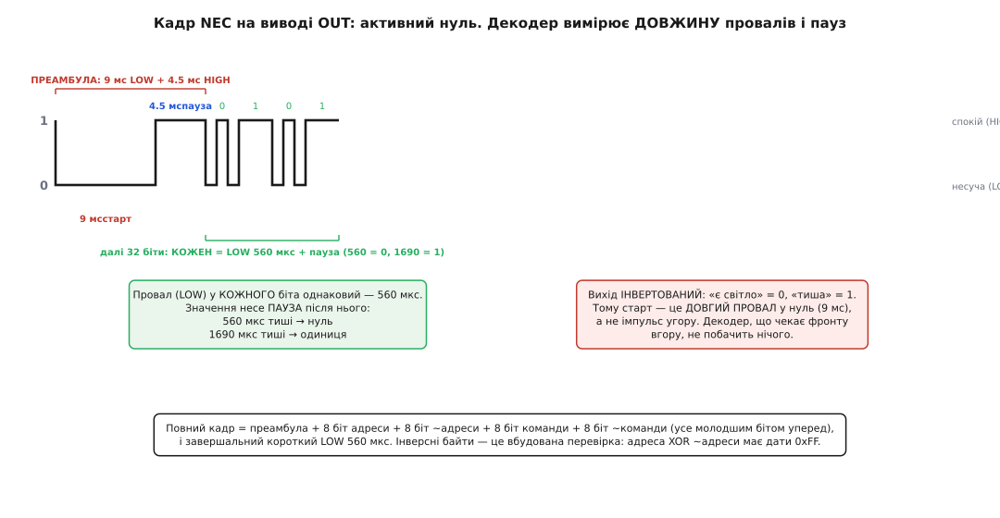
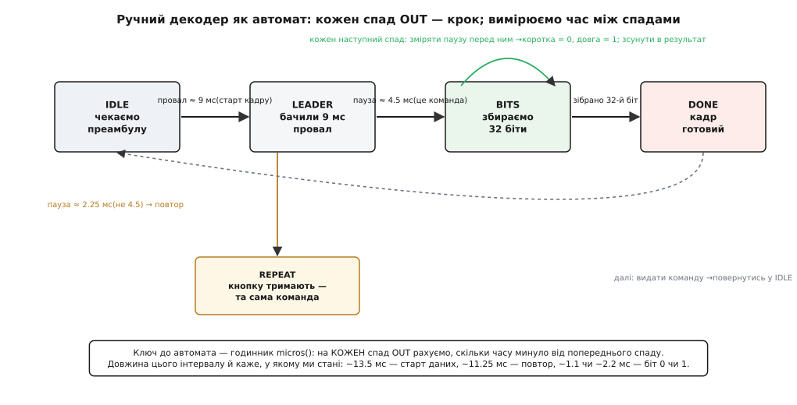

# ⚙️ Прочитати OUT і розшифрувати кнопку: NEC бібліотекою і «руками»

<preknowlist>
- [Логіка active-low](book:electronics/active-low) — вихід приймача перевернутий: спокій — це одиниця, а «є сигнал» смикає лінію в нуль. Уся розшифровка стоїть на цьому.
- [Апаратні переривання по фронту](book:programming/interrupts) — щоб зловити початок кадру, не крутячи процесор у порожньому циклі, ми вішаємо реакцію на спад OUT.
- [ISR — обробник переривання](book:programming/isr) — код, що спрацьовує на кожен спад, має бути коротким: зняти час і вийти, а розбір лишити на потім.
- [millis / micros — час у мікроконтролері](book:programming/millis-micros) — увесь ручний декодер тримається на одному: скільки МІКРОсекунд минуло між двома спадами.
</preknowlist>

Приймач уже зробив половину роботи: замість мигтіння світла на ніжці OUT лежить охайний прямокутний сигнал — провал у нуль там, де в повітрі була пачка несучої, і одиниця там, де тиша. Лишилося друге: перетворити цей візерунок провалів на дві числа — **адресу** (кому призначена команда) і **команду** (яку кнопку натиснуто). Це вже не електроніка, а чистий розбір таймінгів, і робити його можна двома дуже різними шляхами.

Перший — узяти готову бібліотеку, яка знає всі поширені протоколи в обличчя, і за п'ять рядків отримати `address` та `command`. Другий — написати декодер самому, вимірюючи довжину кожного провалу мікросекундоміром. Перший шлях потрібен, щоб проєкт запрацював сьогодні; другий — щоб зрозуміти, що насправді діється на дроті, і мати змогу полагодити, коли бібліотека раптом каже `UNKNOWN`. Пройдемо обидва, і другий — повільно, бо саме в ньому вся суть.

## Ідея: команда — це візерунок довжин, а не рівнів

Спершу вкладімо в голову те, на чому все тримається, бо без цього код виглядатиме магією. Пульт кодує біти **не рівнем сигналу**, а **довжиною пауз** між короткими спалахами. Це зветься пульс-дистанційне кодування (англ. *pulse-distance encoding*): кожен біт — це однаковий короткий спалах плюс пауза, і саме **пауза** несе значення. Коротка пауза — нуль, довга — одиниця. Спалах щоразу той самий; він лише розставляє «розділові знаки» між паузами.

Найпоширеніший протокол цього роду — **NEC**, названий за японською фірмою NEC, що ввела його ще для своєї побутової електроніки (доказовий статус: усталено — це стандарт де-факто, під ним працює величезна частка ІЧ-пультів; єдиного «офіційного» опублікованого аркуша немає, але незалежні реконструкції збігаються до мікросекунди). Його розклад такий:

```
Преамбула (старт кадру):
  9.0 мс   — довгий спалах несучої  (на OUT: провал у 0)
  4.5 мс   — пауза                  (на OUT: 1)

Далі 32 біти, кожен:
  0.5625 мс (560 мкс) — короткий спалах  (на OUT: 0)
  потім ПАУЗА:
     560 мкс  → біт = 0
     1690 мкс → біт = 1

Завершення:
  560 мкс — короткий спалах  (на OUT: 0)
```

Тридцять два біти — це не просто дані, а чотири байти в строгому порядку: **адреса**, **інверсія адреси**, **команда**, **інверсія команди**. Кожен байт іде молодшим бітом уперед (LSB first). Інверсні байти — це вбудована перевірка: якщо адреса дорівнює `0x04`, то наступний байт мусить бути `0xFB` (усі біти перевернуто), бо `0x04 XOR 0xFB = 0xFF`. Не збіглося — кадр спіймано з перешкодою, викидай.


*Як кадр виглядає на самому OUT. Спалахи (провали в нуль) однакові; значення біта несе довжина ПАУЗИ після нього — 560 мкс дає нуль, 1690 мкс дає одиницю. Старт — довгий провал 9 мс, а не імпульс угору: вихід інвертований. Інверсні байти дають перевірку XOR = 0xFF.*

> 🔧 **Навіщо саме довжина, а не рівень.** Кодувати рівнем («високо = 1, низько = 0») було б простіше писати, але вбивчо ненадійно для світла: яскравість пульта плаває з відстанню й кутом, приймач має АРП, що сам підкручує підсилення, — тривалий «високий рівень» поплив би. А от **час** не бреше: пауза 1690 мкс лишається 1690 мкс і за 30 см, і за 8 м. Тому всі поважні ІЧ-протоколи міряють час, а не амплітуду, — і саме тому наш декодер буде передусім годинником.

Другий бік цієї монети — **інверсія виходу**, і її треба тримати в голові щосекунди. У повітрі «є світло» — це подія; на OUT та сама подія — це **нуль**. Тому старт кадру на нозі виглядає як довгий провал у нуль на 9 мс, а не як сплеск угору. Код, який чекає наростання (`RISING`), проґавить початок і мовчатиме. Детально, чому так поводиться цей вихід: [логіка active-low](book:electronics/active-low).

## Шлях перший: бібліотека IRremote — п'ять рядків до `command`

Практично 99% проєктів беруть готове, і правильно роблять: писати декодер NEC руками щоразу — те саме, що точити власний цвях перед тим, як забити. Фактичний стандарт на Arduino/ESP32 — бібліотека **IRremote** (автор першої версії 2009 року — Кен Шеріфф (Ken Shirriff); доказовий статус: усталено, це найпоширеніша ІЧ-бібліотека екосистеми). Вона сама впізнає NEC, Sony, RC5 і десятки інших, розбирає біти, звіряє інверсні байти й кладе вам готові `address` і `command`.

Найкоротший робочий приймач такий:

```cpp
#include <IRremote.hpp>          // у версії 4.x підключати саме .hpp, і лише в ОДНОМУ файлі

const uint8_t PIN_IR = 2;        // OUT приймача заведено на цифровий вивід 2

void setup() {
    Serial.begin(115200);
    IrReceiver.begin(PIN_IR, ENABLE_LED_FEEDBACK);   // почати приймання; ENABLE_LED_FEEDBACK — блимати вбудованим LED на прийом
    Serial.println(F("Наводь пульт і тисни кнопки..."));
}

void loop() {
    if (IrReceiver.decode()) {                        // прийшов повний кадр?
        // головне — три поля результату:
        Serial.print(F("Протокол: "));
        Serial.print(getProtocolString(IrReceiver.decodedIRData.protocol));   // NEC / SONY / RC5 / UNKNOWN
        Serial.print(F("  адреса=0x"));
        Serial.print(IrReceiver.decodedIRData.address, HEX);
        Serial.print(F("  команда=0x"));
        Serial.println(IrReceiver.decodedIRData.command, HEX);

        IrReceiver.resume();                          // ОБОВ'ЯЗКОВО: звільнити буфер під наступний кадр
    }
}
```

Розберемо, що тут насправді відбувається, бо кожен рядок ховає роботу.

`IrReceiver` — це готовий глобальний об'єкт, свій заводити не треба, лише покликати `begin(pin, ...)`. Усередині він вішає на цей вивід апаратне переривання й таймер, які ловлять фронти сигналу й пишуть їхні тривалості у внутрішній буфер. Ваш `loop()` при цьому не блокується — приймання йде «у фоні», а `decode()` лише перевіряє, чи назбирався в буфері цілий кадр.

`IrReceiver.decode()` повертає `true`, коли кадр зібрано й розібрано. Після цього дані лежать у структурі `decodedIRData`, і вам потрібні рівно три її поля: `protocol` (який протокол упізнано), `address` і `command`. Оце і є те, заради чого все затівалося: натиснули «гучність+» — отримали, скажімо, `адреса=0x04 команда=0x09`.

`IrReceiver.resume()` — рядок, який забувають найчастіше, і тоді «читається лише перша кнопка». Поки ви не покликали `resume()`, буфер зайнятий попереднім кадром і новий не приймається. Це навмисне: доки ви розбираєтеся з тим, що прийшло, бібліотека не затирає його наступним.

> 🔧 **Навіщо тут `.hpp`, а не `.h`.** У четвертій версії IRremote заголовок з реалізацією зветься `IRremote.hpp` і підключати його можна рівно в одному файлі проєкту — інакше лінкувальник поскаржиться на подвійне визначення. Старі приклади з мережі під версію 2.x (`#include <IRremote.h>`, `irrecv.decode(&results)`, `results.value`) у 4.x **не збираються**. Правило одне: увесь приклад — з однієї версії, найкраще з `README` актуальної гілки. Зворотний бік цієї ж бібліотеки — передавання (свій пульт на KY-005) і зняття чужих кодів — розібрано окремо: [API IRremote для передавача](book:connect/ky-005-ir-tx/api-irremote-nec.md).

### Повтор при утриманні: не панікуй від нулів

Затисніть кнопку — і у serial поллється потік, де адреса й команда раптом стають `0x0`. Це не збій: так влаштований сам NEC. Повний кадр пульт шле **один раз**, а поки кнопку тримають, випускає короткі **коди-повтори** — службові посилки «те саме, ще тримаю», без адреси й команди всередині. Бібліотека віддає такий повтор як окремий `decode()` з піднятим прапорцем, і його треба впізнавати, а не приймати за нову кнопку:

```cpp
if (IrReceiver.decode()) {
    if (IrReceiver.decodedIRData.flags & IRDATA_FLAGS_IS_REPEAT) {
        // кнопку ТРИМАЮТЬ — команда та сама, що останнього повного кадру
        handleHeld(lastCommand);           // напр. плавно міняти гучність далі
    } else {
        lastCommand = IrReceiver.decodedIRData.command;   // новий повний кадр — запам'ятати команду
        handlePress(lastCommand);
    }
    IrReceiver.resume();
}
```

Логіка проста: повний кадр приносить нову команду й ви її запам'ятовуєте; повтор говорить лише «попередня триває», тож ви застосовуєте **збережену** команду. Без цієї гілки утримання «гучність+» або нічого не робитиме (бо в повторі команда нульова), або смикатиметься.

Цього шляху вистачає для переважної більшості задач. Але він мовчить про те, ЩО діється на дроті, — а це знання окупається щоразу, коли пульт «майже працює». Тому зберемо декодер самі.

## Шлях другий: ручний декодер за таймінгами

Мета — та сама адреса й команда, але без жодної бібліотеки: лише цифровий вивід, переривання й мікросекундомір. Вигода не в економії (бібліотека краща в бою), а в розумінні: зібравши це раз, ви назавжди перестаєте боятися ІЧ і вмієте лагодити будь-який чужий протокол.

### Ідея декодера: годинник, що спрацьовує на кожен спад

Ключова думка, яка все спрощує: **нам не треба стежити за сигналом безперервно**. Уся інформація в NEC — це моменти, коли починається спалах, тобто моменти **спаду** OUT у нуль. Між спадами може бути коротка пауза (560 мкс) або довга (1690 мкс) — і саме ця відстань між сусідніми спадами каже, який був біт.

Отже, вішаємо переривання на **спад** (`FALLING`) OUT. На кожен спад робимо одну-єдину дешеву річ: знімаємо поточний час мікросекундоміром і рахуємо, скільки минуло від попереднього спаду. Ця різниця — і є все, що нам потрібно. Обробник виходить за мікросекунди, процесор увесь інший час вільний.

> 🔧 **Навіщо переривання, а не опитування в циклі.** Можна крутити `digitalRead(PIN)` у `loop()` і ловити зміни — але спалах триває 560 мкс, і щоб надійно зловити кожен, цикл мусив би оббігати ногу десятки тисяч разів на секунду, нічого більше не встигаючи. Переривання ж будить процесор рівно в потрібну мить — на спаді — і повертає керування одразу. Це той самий принцип, що й скрізь у мікроконтролерах: не питай безперервно, дай залізу смикнути тебе, коли є подія. Про сам механізм: [апаратні переривання по фронту](book:programming/interrupts).

Обробник має бути **коротким** — це залізне правило ISR. Усередині переривання не можна ні `Serial.print`, ні довгих обчислень: поки ви там сидите, наступні спади губляться. Тож ISR робить мінімум — зчитує час, кладе інтервал у чергу й миттю виходить; увесь розбір (склеювання бітів у байти, перевірка XOR) — уже в `loop()`, на дозвіллі. Чому ISR мусить бути коротким: [обробник переривання](book:programming/isr).


*Декодер як скінченний автомат. На кожен спад OUT рахуємо час від попереднього спаду; його довжина каже, у якому ми стані. ~13.5 мс — щойно була преамбула, пішли дані; ~11.25 мс — код-повтор (кнопку тримають); ~1.1 чи ~2.2 мс — черговий біт нуль чи одиниця. Зібрали 32 біти — кадр готовий.*

### Як довжина інтервалу задає стан

Тут криється елегантність, яку варто побачити ясно. Ми міряємо час **від спаду до спаду**, і кожне характерне значення однозначно каже, що щойно сталося:

```
Інтервал між сусідніми спадами → що це було:
  ≈ 13.5 мс  (9.0 провал + 4.5 пауза)   → закінчилася ПРЕАМБУЛА, далі йдуть дані
  ≈ 11.25 мс (9.0 провал + 2.25 пауза)  → це КОД-ПОВТОР (кнопку тримають)
  ≈ 1.125 мс (0.56 спалах + 0.56 пауза) → черговий біт = 0
  ≈ 2.25 мс  (0.56 спалах + 1.69 пауза) → черговий біт = 1
```

Помітьте красу: спалах на початку кожного біта однаковий (560 мкс), тож у повний інтервал «спад→спад» він додає фіксовану добавку, а різницю робить лише пауза. Тому «короткий інтервал» (~1.1 мс) — це нуль, «довгий» (~2.2 мс) — одиниця, і розрізнити їх можна одним порогом посередині, скажімо 1.2 мс.

І ще: преамбула (~13.5 мс) і повтор (~11.25 мс) настільки довші за будь-який біт, що плутанини бути не може. Вимірявши ~13.5 мс, ми точно знаємо: почався новий кадр даних. Це і є перехід автомата зі стану «чекаю» в стан «збираю біти».

### Код: ISR ловить час, `loop()` збирає біти

Зберемо це в робочий скетч. ISR лише кладе інтервал у кільцеву чергу; уся логіка автомата — в `loop()`. Такий поділ («перерваний код — мінімальний, важке — у головному циклі») сам по собі важливіший за конкретний протокол.

Той самий декодер має сенс і на восьмибітному Arduino (AVR, C/C++ — рідна мова заліза), і на ESP32/Pico, де багато хто пише мікропітоном; логіка тотожна, тож ось обидва варіанти:

:::tabs
```cpp
// --- Ручний декодер NEC на Arduino / AVR ---
// OUT приймача → вивід 2 (на Uno/Nano вивід 2 і 3 уміють зовнішні переривання)
const uint8_t PIN_IR = 2;

volatile uint32_t gaps[70];        // кільце тривалостей між спадами (кадр = 1 преамбула + 32 біти ≈ 33 спади)
volatile uint8_t  head = 0, tail = 0;
volatile uint32_t lastFall = 0;

// ISR: коротко! зняти час, покласти інтервал у кільце, вийти
void onFall() {
    uint32_t now = micros();
    uint32_t gap = now - lastFall;
    lastFall = now;
    uint8_t nextHead = (head + 1) % 70;
    if (nextHead != tail) {        // не переповнити кільце
        gaps[head] = gap;
        head = nextHead;
    }
}

// стани автомата
enum { IDLE, DATA } state = IDLE;
uint32_t bits = 0;                 // сюди складаємо 32 біти (молодшим уперед)
uint8_t  nbits = 0;
uint32_t lastValue = 0;            // останній повний кадр (для повтору)

void setup() {
    Serial.begin(115200);
    pinMode(PIN_IR, INPUT);
    attachInterrupt(digitalPinToInterrupt(PIN_IR), onFall, FALLING);
    Serial.println(F("Ручний NEC-декодер готовий."));
}

void loop() {
    // забрати з кільця всі нові інтервали (poll-and-drain)
    while (tail != head) {
        uint32_t gap = gaps[tail];
        tail = (tail + 1) % 70;
        handleGap(gap);
    }
}

// одна порція логіки автомата на один інтервал між спадами
void handleGap(uint32_t gap) {
    // допуск ±30% — дешеві пульти сильно «пливуть» за таймінгом
    if (within(gap, 13500)) {          // преамбула повного кадру
        state = DATA; bits = 0; nbits = 0;
        return;
    }
    if (within(gap, 11250)) {          // код-повтор: кнопку тримають
        Serial.print(F("ПОВТОР (тримають): addr=0x"));
        Serial.print((lastValue) & 0xFF, HEX);
        Serial.print(F(" cmd=0x"));
        Serial.println((lastValue >> 16) & 0xFF, HEX);
        state = IDLE;
        return;
    }
    if (state == DATA) {
        uint8_t bit = (gap > 1200) ? 1 : 0;    // поріг посередині між ~1.1 і ~2.2 мс
        bits |= ((uint32_t)bit << nbits);       // молодший біт уперед
        nbits++;
        if (nbits == 32) {
            decodeFrame(bits);
            state = IDLE;
        }
    }
}

bool within(uint32_t v, uint32_t target) {
    return v > (uint32_t)(target * 0.7) && v < (uint32_t)(target * 1.3);
}

void decodeFrame(uint32_t raw) {
    uint8_t addr  =  raw        & 0xFF;
    uint8_t addrN = (raw >> 8)  & 0xFF;
    uint8_t cmd   = (raw >> 16) & 0xFF;
    uint8_t cmdN  = (raw >> 24) & 0xFF;

    // перевірка інверсних байтів (для звичайного NEC)
    bool ok = ((uint8_t)(addr ^ addrN) == 0xFF) && ((uint8_t)(cmd ^ cmdN) == 0xFF);
    lastValue = raw;

    Serial.print(F("addr=0x")); Serial.print(addr, HEX);
    Serial.print(F(" cmd=0x"));  Serial.print(cmd, HEX);
    Serial.println(ok ? F("  [XOR ok]") : F("  [XOR BAD або extended-NEC]"));
}
```
```python
# --- Ручний декодер NEC на MicroPython (ESP32 / Pico) ---
# OUT приймача → GPIO 4 (будь-який вивід з підтримкою переривань)
from machine import Pin
import time

PIN_IR = 4
gaps = []                       # проста черга інтервалів між спадами
last_fall = time.ticks_us()

def on_fall(pin):               # ISR: коротко! зняти час, покласти інтервал, вийти
    global last_fall
    now = time.ticks_us()
    gaps.append(time.ticks_diff(now, last_fall))   # ticks_diff коректно рахує навіть на переповненні лічильника
    last_fall = now

ir = Pin(PIN_IR, Pin.IN)
ir.irq(trigger=Pin.IRQ_FALLING, handler=on_fall)

state = "IDLE"
bits = 0
nbits = 0
last_value = 0

def within(v, target):          # допуск ±30% під тремтіння дешевих пультів
    return target * 0.7 < v < target * 1.3

def handle_gap(gap):
    global state, bits, nbits, last_value
    if within(gap, 13500):                  # преамбула повного кадру
        state, bits, nbits = "DATA", 0, 0
        return
    if within(gap, 11250):                  # код-повтор: кнопку тримають
        addr = last_value & 0xFF
        cmd  = (last_value >> 16) & 0xFF
        print("ПОВТОР (тримають): addr=0x%02X cmd=0x%02X" % (addr, cmd))
        state = "IDLE"
        return
    if state == "DATA":
        bit = 1 if gap > 1200 else 0        # поріг між ~1.1 і ~2.2 мс
        bits |= (bit << nbits)              # молодший біт уперед
        nbits += 1
        if nbits == 32:
            decode_frame(bits)
            state = "IDLE"

def decode_frame(raw):
    global last_value
    addr  =  raw        & 0xFF
    addr_n = (raw >> 8)  & 0xFF
    cmd   = (raw >> 16) & 0xFF
    cmd_n  = (raw >> 24) & 0xFF
    ok = ((addr ^ addr_n) == 0xFF) and ((cmd ^ cmd_n) == 0xFF)
    last_value = raw
    tag = "[XOR ok]" if ok else "[XOR BAD або extended-NEC]"
    print("addr=0x%02X cmd=0x%02X  %s" % (addr, cmd, tag))

while True:                                 # головний цикл: забрати з черги все накопичене
    while gaps:
        handle_gap(gaps.pop(0))
```
:::

Розберемо, чому декодер саме такий, а не інакший.

**Чому кільцева черга, а не розбір прямо в ISR.** Спадів у кадрі під сотню, летять вони щільно (пауза між ними — сотні мікросекунд), а `Serial.print` коштує сотні мікросекунд сам по собі. Спробуй розібрати кадр прямо в перериванні — і ти пропустиш наступні спади, бо застряг у друку. Тому ISR лише кидає число в чергу й миттю виходить, а неквапливий `loop()` цю чергу вичерпує. Це універсальний прийом: **перерваний код — короткий, важке — у головному циклі**.

**Чому `micros()`, а не `millis()`.** Біти різняться паузою 560 проти 1690 мкс — це частки МІЛІсекунди. Мірячи мілісекундами, ви б узагалі не розрізнили нуль від одиниці. Тому годинник — мікросекундний. Тонкість `micros()`: він переповнюється (обнуляється) приблизно кожні 70 хвилин, але різниця `now - lastFall` завдяки беззнаковій арифметиці рахується правильно навіть через момент переповнення — тому ми віднімаємо, а не порівнюємо абсолютні значення. У мікропітоні для цього є спеціальна `ticks_diff`, яка робить те саме коректно. Про мікросекундний годинник: [millis / micros](book:programming/millis-micros).

**Чому поріг 1200 мкс.** Нуль дає інтервал спад→спад ~1125 мкс, одиниця ~2250 мкс. Один поріг рівно посередині надійно ділить їх навпіл: усе коротше — нуль, усе довше — одиниця. Точність тут не критична саме тому, що дві величини далеко рознесені — між ними понад мілісекунда простору.

**Чому допуск ±30%.** Ось де прихована найбільша практична мудрість, і про неї — окремо нижче: дешевий пульт видає не рівно 560 і 1690, а «десь коло того», і жорстке порівняння `gap == 1125` не спрацює **ніколи**. Тому ми не порівнюємо на рівність, а перевіряємо попадання у вікно навколо очікуваного значення.

### Що показує зібраний кадр

Проженіть це — і на кожне натискання в serial з'явиться щось на кшталт `addr=0x4 cmd=0x9 [XOR ok]`. Мітка `[XOR ok]` означає, що інверсні байти збіглися: кадр цілий. Якщо ж бачите `[XOR BAD або extended-NEC]` на всіх кнопках підряд, а команди при цьому виглядають осмислено й стабільно — швидше за все, пульт використовує **розширений NEC (extended NEC)**, де адреса займає всі 16 біт (два байти адреси замість «адреса + її інверсія»), пожертвувавши перевіркою заради 65 тисяч адрес замість 256 (доказовий статус: усталено). Тоді XOR адреси навмисне не сходиться — і це нормально; просто не звіряйте адресний байт, а команду беріть як є.

## Складність і пастки

Тепер — карта місць, де гине найбільше часу, від найчастішого до тонкого. Кожна пастка тут — не абстракція, а те, що реально трапляється на столі.

**Інвертований вхід — пастка №1.** Дев'ять із десяти «нічого не приймається» — це переривання, повішене на `RISING` замість `FALLING`, або ручне очікування імпульсу вгору. Ще раз, бо це коштує людям годин: у спокої OUT — **одиниця**, спалах тягне його **вниз**. Початок кадру — довгий провал у нуль, а не сплеск. Вішайте реакцію на спад. Якщо приймач начебто німий, а пульт точно робочий (перевірте камерою телефону — ІЧ-діод пульта під час натискання блідо світиться в кадрі), перше, що дивіться, — фронт переривання.

**Тремтіння таймінгів дешевих пультів.** Фабричний пульт тримає 562.5 мкс годинником кварцу; безіменний пульт із набору за долар тактується дешевим RC-генератором, і його «560» гуляє на десятки відсотків, ще й пливе з температурою й сіданням батарейки. Тому будь-яке порівняння на точну рівність приречене. Практичне правило, підтверджене досвідом: беріть вікно **±25–30%** навколо номіналу (саме тому в коді `within()` перевіряє діапазон, а не рівність). Заміряти реальні числа вашого пульта легко — той самий ручний декодер: додайте на час налагодження друк сирого `gap` у `loop()` і подивіться, які тривалості приходять насправді. Часто виявляється, що «560» у конкретного пульта — це стабільні 610 чи 540, і вікно їх спокійно ловить.

**Повтори при утриманні — не дублікати кнопки.** Уже казали про бібліотечний шлях; у ручному декодері це той самий ~11.25 мс інтервал (9 мс провал + 2.25 мс пауза), який приходить замість преамбули даних. Не обробите його окремо — або отримаєте потік «порожніх» кадрів, або, ще гірше, приймете утримання за серію швидких натискань. У NEC повтори йдуть рівно кожні 110 мс, поки тримають кнопку, — за цим ритмом їх теж можна впізнавати. Є й різновид, де пульт на утримання шле не короткий повтор, а щоразу повний кадр (іноді його звуть NEC2); якщо ваш «повтор» приходить як повноцінні 13.5 мс + 32 біти — ви натрапили саме на такий, і тоді утримання виглядає як однакові повні кадри поспіль.

**Кілька протоколів на тій самій несучій.** Ось найпідступніше непорозуміння. VS1838B ловить **несучу 38 кГц** і віддає її обвідну — але обвідна може бути закодована по-різному, і NEC тут лише один з мешканців:

```
Протокол   Несуча    Кодування біта                    Приймач 38 кГц бачить?
NEC        ~38 кГц   пульс-дистанційне (пауза = біт)    ТАК, ідеально
Samsung    ~38 кГц   як NEC, але преамбула інша          ТАК
Sony SIRC  ~40 кГц   пульс-ШИРИННЕ (довжина спалаху=біт) частково/погано (мимо смуги)
Philips    ~36 кГц   Манчестер (фронт усередині біта)    частково/погано (мимо смуги)
RC5/RC6
```

Дві різні речі плутаються тут в одну. Перша: **несуча**. Приймач на 38 кГц — це вузьке «вухо», глухе до всього, крім мигтіння коло 38 кГц. Sony на 40 кГц і Philips на 36 кГц лягають повз смугу фільтра, і той самий VS1838B чує їх слабко або зовсім не чує — тому їх коректніше приймати відповідним приймачем (40 чи 36 кГц). Друга річ, навіть коли сигнал усе ж пройшов: **кодування біта різне**. NEC міряє паузу; Sony (SIRC) — навпаки, ширину самого спалаху (пульс-ШИРИННЕ кодування); Philips RC5 узагалі кодує біт положенням фронту всередині рівного вікна (Манчестер, англ. *Manchester encoding*). Ваш NEC-декодер, наведений на Sony-пульт, видаватиме сміття не тому, що зламаний, а тому, що читає паузи там, де значення сидить у ширині спалахів.

Звідси практичний висновок, що економить години: **ручний декодер пишіть під ОДИН відомий протокол** (майже завжди NEC — він найпоширеніший і лягає на 38 кГц ідеально). Якщо ж вам треба їсти пульти різних систем, не множте ручні декодери — беріть IRremote, яка вміє впізнавати всі три родини сама. А коли конкретний пульт уперто мовчить — спершу спитайте не «де баг у коді», а «а якою він мовою й на якій несучій говорить»: дуже часто відповідь у тому, що це Sony на 40 кГц, а не NEC.

**Дрібне, але злить: `resume()` і затримки в ISR.** У бібліотечному шляху забутий `IrReceiver.resume()` дає «читається лише перша кнопка». У ручному — будь-який `Serial.print` чи довге обчислення всередині ISR губить наступні спади й ламає кадр посеред прийому. Обидва — прояви одного правила: приймання ІЧ живе на щільному потоці коротких подій, і будь-яка забарка на шляху цього потоку його рве. Тримайте гарячий шлях (ISR, обробку одного кадру) коротким, а все повільне — друк, реакцію на команду — робіть після того, як кадр уже зібрано.

Підсумок карти простий. Переконайтеся, що ловите **спад**, а не наростання (пастка №1). Дайте таймінгам **широке вікно**, бо дешеві пульти пливуть. **Повтор** обробляйте окремо від нового натискання. І пам'ятайте, що на 38 кГц живе не лише NEC: якщо цифри — сміття, підозрюйте чужий протокол чи чужу несучу раніше, ніж власний код. У цьому порядку майже будь-яке «мій приймач не працює» розсипається за кілька хвилин.
