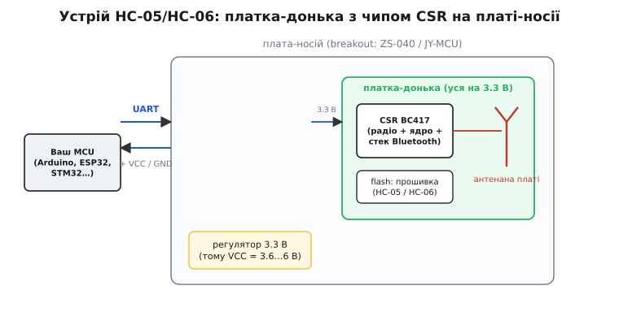
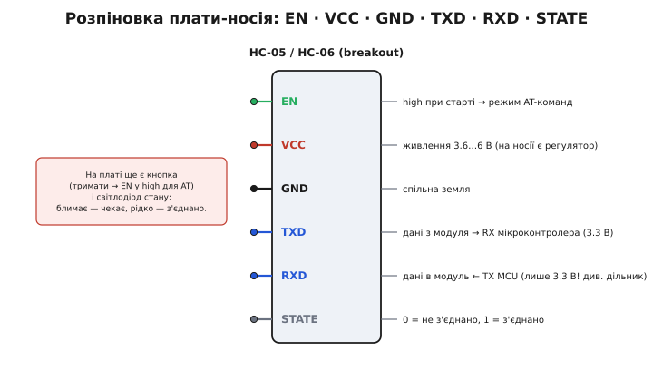
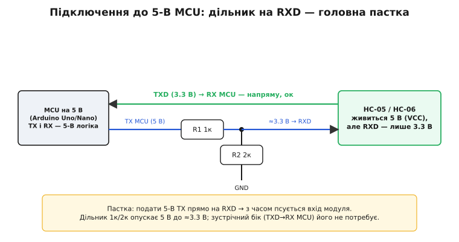

# Bluetooth-модуль HC-05/HC-06

<preknowlist>
- [Кадр UART](topic:communications/uart-frame) — як послідовний порт шле байти лініями TX/RX, що таке швидкість (baud); модуль спілкується з МК саме так.
- [Bluetooth SPP](topic:communications/bluetooth-spp) — профіль «послідовний порт по радіо»: він робить бездротовий канал невідмінним від дротяного UART, і саме його дає цей модуль.
- [Дільник напруги](topic:electronics/voltage-divider) — два резистори ділять напругу в заданому відношенні; ним опускають 5-В сигнал до 3.3 В на вході модуля.
</preknowlist>

Уявіть, що ви взяли дротик між двома послідовними портами — той самий UART, яким мікроконтролер балакає з комп'ютером, — і перерізали його посередині. Дві половинки роз'їхалися на десяток метрів, а замість мідної жили між ними лишилося повітря. HC-05 — це рівно та половинка: маленька синя платка, що вдає з себе продовження дроту. Мікроконтролер шле в неї байти звичайним UART і навіть не здогадується, що далі вони летять по радіо на телефон чи на другу таку саму платку. З іншого боку ефіру напарник викидає ті самі байти у свій UART. Ви не пишете жодного рядка радіокоду, не торкаєтесь стеку Bluetooth, не думаєте про пакети й адреси — для вашої програми це просто послідовний порт, який раптом став бездротовим.

Ось звідки береться його дивовижна популярність у саморобках: щоб керувати роботом чи знімати дані з датчика по телефону, не треба вчити Bluetooth. Треба вміти слати байти в UART — а це ви вже вмієте. Уся радіоскладність захована всередині, за трьома-чотирма ніжками.

> Профіль, який робить це можливим, зветься SPP (англ. *Serial Port Profile*) — «профіль послідовного порту». Це домовленість поверх Bluetooth: два пристрої відкривають між собою прозорий двобічний потік байтів, поводячись рівно як пара з'єднаних UART. Що саме відбувається в ефірі під цією простотою — [Bluetooth SPP](topic:communications/bluetooth-spp).

## Що це насправді за річ

Синя платка, яку ви тримаєте, — це не одна деталь, а **дві плати одна на одній**. Зверху — крихітна екранована **платка-донька**: на ній сидить радіочип, кварц, доріжкова антена-змійка й флеш із прошивкою. Уся ця донька — самодостатній Bluetooth-модуль, і вона працює **виключно на 3.3 В**. Знизу — ширша **плата-носій** (її ще звуть breakout), яка робить доньку зручною для людини: виводить сигнали на нормальні штирьки з кроком 2.54 мм, ставить світлодіод стану, кнопку й — найважливіше — **регулятор на 3.3 В**, щоб плату можна було годувати звичними 5 вольтами.


*Модуль — це дві плати. Донька (чип + флеш + антена) уся на 3.3 В і сама є Bluetooth-модулем. Носій додає регулятор 3.3 В (тому VCC можна 3.6–6 В), світлодіод, кнопку й зручні штирьки. Мікроконтролер обмінюється з нею звичайним UART — жодного радіокоду.*

Серце доньки — чип **CSR BC417**. Літери CSR — це Cambridge Silicon Radio, британська фірма з Кембриджа, яку 2015 року купила Qualcomm; BC417 належить до її родини BlueCore і реалізує **Bluetooth 2.0 + EDR** (англ. *Enhanced Data Rate*). У цьому чипі вже вбудований і радіоприймач, і процесорне ядро, і повний стек Bluetooth — тому донька й не потребує від вас нічого, крім байтів.

Тут важливо зрозуміти головне, бо на цьому будується вся дальша поведінка: **HC-05 і HC-06 — це фізично та сама плата**. Той самий чип, той самий носій, часто той самий продавець. Уся різниця — у **прошивці** всередині флешу. Прошивка HC-05 багатша: модуль уміє бути і веденим (slave), і ведучим (master) — тобто може не лише чекати, доки до нього під'єднаються, а й сам знаходити інший пристрій і під'єднуватися до нього. Прошивка HC-06 бідніша й **завжди тільки ведена**: вона вміє лише чекати вхідного з'єднання. Через це двома HC-06 не з'єднаєш нічого — обидва сидять і чекають, а ініціювати нема кому.

> 🔧 **Навіщо розрізняти.** Перше питання перед покупкою — «HC-05 чи HC-06?» — це не про ціну (вона майже однакова), а про сценарій. Якщо модуль просто відповідає на дзвінок телефону (телефон — ведучий, модуль — ведений), вистачить дешевшого й простішого HC-06. Але щойно ви захочете, щоб **два ваші пристрої** самі знаходили одне одного без телефона посередині, — потрібен HC-05 хоча б на боці ведучого. Взяти пару HC-06 для такого — типова помилка новачка: плати куплено, а з'єднання не буде ніколи.

## Виводи: чотири робочі, два керівні

На платі-носії виходить зазвичай шість штирьків. Чотири з них — це те, без чого модуль не працює взагалі, а два — керування й діагностика.


*Шість виводів носія. Чотири робочі — VCC, GND, TXD, RXD — це живлення й пара ліній UART. EN керує входом у режим AT-команд; STATE показує, чи є з'єднання. TXD віддає 3.3 В (мікроконтролер читає як одиницю), а от RXD не терпить 5 В — це головна пастка підключення.*

Розкладемо по призначенню:

```
Робочі (без них ніяк)
  VCC    живлення 3.6…6 В — на носії стоїть регулятор 3.3 В
  GND    спільна земля з мікроконтролером
  TXD    дані З модуля → на RX мікроконтролера (рівень 3.3 В)
  RXD    дані В модуль  ← з TX мікроконтролера (ТІЛЬКИ 3.3 В!)

Керування й діагностика
  EN/KEY  високий рівень на старті → модуль стартує в режимі AT-команд
  STATE   0 = немає з'єднання, 1 = з'єднання встановлено
```

Дві тонкощі варті окремого слова, бо саме на них спотикаються.

**RXD і 5 вольтів.** Хоч плату й дозволено живити п'ятьма вольтами по VCC (за це відповідає регулятор носія), сам **вхід RXD лишається 3.3-вольтовим** — регулятор живить чип, але сигнальні лінії він не зсуває. Тому подавати на RXD напряму 5-вольтовий TX із класичного Arduino Uno не можна: з часом ви тихо зіпсуєте вхід чипа. Це найпоширеніша помилка, і нижче ми її розберемо докладно. Зустрічна лінія — TXD модуля — віддає 3.3 В, і 5-вольтовий мікроконтролер спокійно читає це як логічну одиницю, тож у той бік нічого зсувати не треба.

**EN (він же KEY).** Ця ніжка — перемикач між двома життями модуля. У звичайному житті (EN не чіпають або тримають низько) модуль — прозорий міст: усе, що влетіло в RXD, вилітає по радіо. Але якщо **на старті** підняти EN у високий рівень, модуль прокидається зовсім іншим — він нікуди не з'єднується, а слухає команди налаштування, так звані **AT-команди**. На платі часто є кнопка, яка і є цим EN: затиснув перед подачею живлення — увійшов у режим налаштування. Саме через нього модулю задають ім'я, PIN-код, швидкість і роль.

## Живлення й дві швидкості

Живиться модуль скромно: у спокої й на прийомі це одиниці-десятки міліампер, і навіть на передачі Bluetooth 2.0 не рве таких піків, як потужні радіомодулі дальнього зв'язку. Тому окремого «рятувального» конденсатора тут зазвичай не потребують так гостро, як для передавачів на кілометри, — але поставити 10–100 мкФ поряд із VCC ніколи не завадить, надто якщо живлення йде довгими дротами від макетки.

А от що справді збиває з пантелику — це **дві різні швидкості UART** в одного модуля, і плутанина між ними псує чи не половину перших спроб.

Перша швидкість — **робоча** (для передавання ваших даних). За замовчуванням це зазвичай **9600 бод**. Саме на ній модуль, уже з'єднаний, ганяє байти туди-сюди. Її можна змінити.

Друга швидкість — **командна** (для розмови AT-командами, коли EN піднято). І ось у HC-05 вона окрема й **фіксована — 38400 бод**, незалежно від того, яку робочу швидкість ви виставили. Тобто якщо ви ввійшли в режим налаштування й шлете `AT`, а модуль мовчить — найпевніше термінал стоїть на 9600 замість 38400. У HC-06 усе трохи інакше: він командний режим не відділяє окремою швидкістю — AT-команди приймаються на тій самій робочій швидкості, і сам «командний режим» у нього — це просто стан, доки немає з'єднання.

```
HC-05                          HC-06
─────────────────────────      ─────────────────────────
робоча (дані):   9600 (тип.)   робоча (дані):  9600 (тип.)
командна (AT):   38400 (фікс.) командна (AT):  = робочій, доки не з'єднано
роль: master або slave         роль: тільки slave
```

> 🔧 **Навіщо це.** «Модуль не відповідає на AT» — скарга номер один, і причина майже завжди та сама: не та швидкість у терміналі. Для HC-05 намертво запам'ятайте 38400 у режимі команд. Друге за частотою — забутий формат кінця рядка: HC-05 хоче, щоб команда завершувалась `\r\n` (у моніторі Arduino це пункт «Both NL & CR»), а HC-06 — навпаки, без жодного переносу. Виставите ці дві дрібниці правильно — і модуль заговорить одразу.

## Як його з'єднати з мікроконтролером

Мінімальна схема — чотири дроти: живлення, земля й перехрещена пара UART. «Перехрещена» — бо TX одного йде на RX іншого: те, що модуль **віддає** (TXD), треба завести на те, що мікроконтролер **приймає** (RX), і навпаки. Забути перехрестити — друга за популярністю помилка після швидкості.

Якщо ваш мікроконтролер сам на 3.3 В (ESP32, STM32, більшість сучасних плат), усе з'єднується напряму:

```
HC-05/06        MCU на 3.3 В (напр. ESP32)
  VCC   ───────  3.3 В або 5 В (регулятор носія стерпить обидва)
  GND   ───────  GND
  TXD   ───────  RX  (напр. GPIO16)
  RXD   ───────  TX  (напр. GPIO17)   ← прямо, бо TX уже 3.3 В
```

А якщо мікроконтролер 5-вольтовий (Arduino Uno, Nano на ATmega) — з'являється та сама пастка з RXD, і схему треба доповнити **дільником напруги** на цій одній лінії:


*Єдина відмінність для 5-В плати — дільник на RXD. Лінія TXD→RX іде напряму (3.3 В читається як одиниця). Лінію TX→RXD пропускають через два резистори (типово 1 кОм у розрив і 2 кОм на землю): вони опускають 5 В приблизно до 3.3 В і бережуть вхід модуля.*

```
HC-05/06        Arduino Uno/Nano (5 В)
  VCC   ───────  5 В
  GND   ───────  GND
  TXD   ───────  RX (D0 / прогр. порт)     ← прямо, ок
  RXD   ──┐
          │  R1 = 1 кОм у розрив,
          │  R2 = 2 кОм із цього ж вузла на GND
  TX ─────┘  (вузол між R1 і R2 → на RXD, там ≈3.3 В)
```

Чому саме два резистори й чому 1 кОм із 2 кОм — це класична робота дільника напруги: він віддає на вихід ту частку вхідної напруги, яку становить нижнє плече від суми. Тут 2/(1+2) від 5 В ≈ 3.3 В — рівно те, що треба входу модуля. Точні номінали не критичні, важливе відношення приблизно 1:2; докладніше про сам розрахунок і його межі — [дільник напруги](topic:electronics/voltage-divider).

Ще одна дрібниця, що заощадить години: більшість плат **не любить, коли AT-команди й з'єднання діляться апаратним UART мікроконтролера**, зайнятим під USB-монітор. Тому на Arduino Uno модуль зазвичай чіпляють не до D0/D1, а до двох інших ніжок через програмний послідовний порт (`SoftwareSerial`) — тоді USB лишається вільним для спостереження, а модуль говорить окремою парою. Як це виглядає в коді й як загнати модуль у режим AT прямо зі скетчу — у [довіднику інтерфейсу модуля з боку коду](topic:connect/bluetooth-hc05/api-hc05-uart.md).

## Спарювання, ім'я і PIN

Перш ніж байти полетять, два пристрої мають **спаруватися** (англ. *pair*) — упізнати одне одного й домовитися про ключ. З боку телефона це знайомо: у списку Bluetooth з'являється пристрій з ім'ям на кшталт `HC-05`, ви тиснете «під'єднати» й уводите PIN. За замовчуванням PIN майже завжди **`1234`** (інколи `0000`) — це не таємниця, а фабрична заглушка, і її варто змінювати для будь-чого серйознішого за гру.

Ім'я, PIN і роль — усе це живе в налаштуваннях модуля й міняється AT-командами в режимі EN-high. Кілька найужиткованіших (для HC-05, із `\r\n`):

```
AT              → OK            перевірка зв'язку
AT+NAME=Robot   → OK            назвати модуль "Robot"
AT+PSWD=4726    → OK            новий PIN (замість 1234)
AT+UART=9600,0,0 → OK           робоча швидкість/стоп-біти/парність
AT+ROLE=1       → OK            зробити ведучим (0 = ведений)   [лише HC-05]
```

Після зміни налаштувань модуль зазвичай треба перезапустити (зняти й подати живлення) — і він оживає вже з новим ім'ям та швидкістю. Далі жодних команд: у звичайному режимі це просто прозорий міст.

Тонкість про **STATE**: ця ніжка — ваш єдиний надійний спосіб дізнатися з коду, чи є взагалі з'єднання, не вгадуючи це з тиші в порту. Поки з'єднання немає, STATE тримає нуль; щойно напарник під'єднався — одиницю. Заведіть її на вільний вхід мікроконтролера — і програма зможе, наприклад, зупиняти робота, коли зв'язок із пультом обірвався. Як зібрати з цього повний прилад — читання команд, телеметрію назад і аварійний стоп по STATE в одному скетчі — показано на [прикладі машинки на керуванні з телефона](topic:connect/bluetooth-hc05/proj-hc05-car.md). Світлодіод на платі показує те саме людині: часте блимання — модуль вільний і чекає; рідке подвійне моргання (у HC-05) — з'єднання встановлено.

## Межі, за які модуль не переступить

Корисно тверезо знати, чого від нього **не** чекати, щоб не витрачати час дарма.

Це **Bluetooth Classic 2.0**, а не сучасний **Bluetooth Low Energy** (BLE). Практичний наслідок: із **сучасним iPhone цей модуль напряму не подружиться** — Apple вимагає або спеціальної сертифікації, або BLE. З Android і з комп'ютером — без проблем; для iPhone беруть BLE-модулі на кшталт HM-10. Плутанина «купив HC-05, а телефон його не бачить» на iPhone саме звідси.

Дальність — **типово до 10 метрів** у межах прямої видимості (клас 2 за потужністю), крізь стіни менше. Це не радіомодуль дальнього зв'язку; для кілометрів існують інші сімейства. Швидкість реального потоку по SPP — скромні десятки кілобіт за секунду; для команд, телеметрії й тексту вистачає з головою, для потокового звуку чи відео — ні.

І поведінка — **точка-точка**: у робочому режимі модуль тримає рівно **одне** з'єднання за раз. Це не мережа й не хаб; один пульт — один пристрій.

Народилася вся ця дешева серія на реальному попиті початку 2010-х — коли мільйони саморобників захотіли керувати чимось із телефона, а справжні Bluetooth-модулі коштували дорого й вимагали знань. Хто й навіщо зробив «HC»-лінійку такою поширеною — [коротка історія серії HC](topic:connect/bluetooth-hc05/hist-hc-series.md).

## Короткий чек-лист першого запуску

Звівши все докупи, ось де найчастіше застрягає перший старт і чому:

```
Симптом                             Найімовірніша причина
──────────────────────────────────────────────────────────────────
Не відповідає на AT                 не та швидкість (HC-05 → 38400!);
                                    не той кінець рядка (\r\n чи без нього)
Модуль є в списку, але даних нема    переплутані TX/RX (не перехрестили)
Працює, тоді вхід «оглух»            5-В TX подали на RXD без дільника
Телефон-iPhone не бачить модуль      це BT Classic, не BLE — беріть HM-10
Два модулі не з'єднуються            обидва HC-06 (обидва ведені) — треба HC-05
Забув PIN / не пускає                фабричний 1234 або 0000
```

Майже все тут — не про радіо, а про чотири банальні речі: правильна швидкість у потрібному режимі, перехрещені TX/RX, дільник на RXD для 5-вольтових плат і розуміння, що це Classic-міст точка-точка, а не BLE й не мережа. Полагодьте їх — і платка робить рівно те, заради чого її купують: тихо перетворює ваш дротяний UART на бездротовий, а телефон — на пульт.
