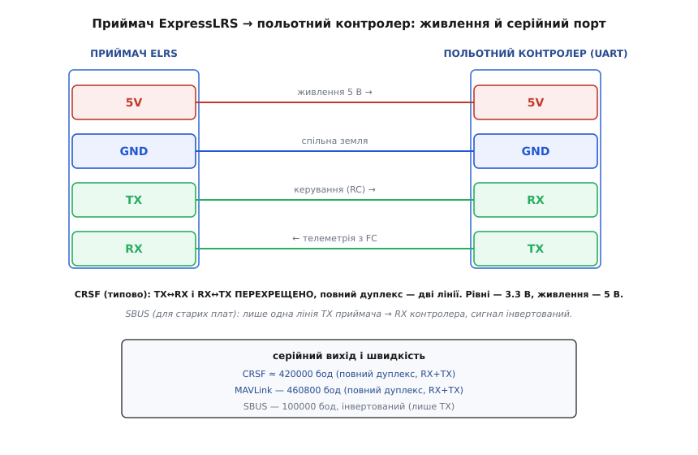

# Повітряний блок ExpressLRS/mLRS (телеметрія + керування)

<preknowlist>
- [Політний контролер](topic:programming/flight-controller) — плата, що керує апаратом і віддає свій стан по UART; саме до неї чіпляється цей блок.
- [Протокол CRSF](topic:communications/crsf-protocol) — «рідна» мова цих систем: один серійний потік, у якому вгору йдуть канали керування, а вниз — телеметрія.
- [Пакет MAVLink](topic:communications/mavlink-packet) — формат кадру телеметрії дронів; блок уміє возити його прозоро й окремо його «розуміти».
- [RC-сигнал: PWM, PPM і S.BUS](topic:communications/rc-signal-protocol) — класичні способи віддати керування на контролер; SBUS блок теж уміє видавати для старих плат.
- [Кадр UART](topic:communications/uart-frame) — послідовний порт TX/RX і швидкість у бодах, якою блок говорить із контролером; тут важливий перехрест TX↔RX.
- [ISM-діапазони](topic:communications/ism-bands) — неліцензовані смуги 2.4 ГГц і 900 МГц, у яких блок працює, і чому регіон і смуга важливі.
</preknowlist>

Це крихітна платівка з антеною — часто менша за монету, — яку ставлять на дрон, щоб він робив **дві речі одразу по одному радіоканалу**: слухав команди з пульта й розповідав про себе на землю. Ви ворушите стіками — за мілісекунди апарат реагує; водночас на екрані пульта біжать напруга батареї, висота, кількість супутників, сила сигналу. Класичний хобі-борт носив би для цього **два окремі радіо**: приймач керування й окремий модуль телеметрії, кожен зі своєю антеною. Повітряний блок ExpressLRS чи mLRS суміщає обидві задачі в **одному приймачі на одній лінії** — і саме в цьому вся його суть.

Головну ідею варто вхопити відразу, бо з неї випливає геть усе інше. Радіолінія фізично **двобічна**: якщо ви й так шлете команди вгору, то канал назад уже існує — гріх його не використати. Раніше системи керування возили лише керування (пульт → апарат), а телеметрію лишали окремому радіо. Тоді додали зворотний потік — і той самий приймач почав **і приймати команди вгору, і віддавати телеметрію вниз**. Тому «повітряний блок» (англ. *air unit*) — це не «модуль телеметрії», а **приймач керування з телеметрією на додачу**, і телеметрія тут їде «безкоштовно» тим самим каналом, який усе одно потрібен для польоту.

> 🔧 **Навіщо ця ясність.** Щойно розумієш, що це один приймач на одну лінію, зникає купа зайвих запитань. Не треба другої антени на борту, другого радіо, другого узгодження частот. Не працює телеметрія на пульті — питання не до «модуля телеметрії» (його нема окремо), а до того, чи правильно налаштований серійний порт контролера й чи ввімкнено на пульті потрібний режим. Одна лінія — одна точка налаштування.

## Що це за пристрій і з чим його не плутати

Під «повітряним блоком телеметрії з керуванням» на ринку живуть дві близькі, але **несумісні між собою** відкриті системи, і ще одна стара річ, яку теж інколи так звуть.

Перша й найпоширеніша — **ExpressLRS** (скорочують *ELRS*). Це відкрита система керування на радіочипах Semtech: маленький приймач на борту, модуль-передавач у пульті. Її придумали заради двох речей — **мінімальної затримки** керування й **великої дальності**, — і вона стала фактичним стандартом у FPV. Приймач ELRS завбільшки з ніготь, з двома-чотирма контактами під контролер і виводом антени; на борту він віддає керування й тягне телеметрію вниз. Спільну історію, архітектуру пакета й те, чим 2.4 ГГц відрізняється від 900 МГц, тримає [оглядова стаття про ExpressLRS](topic:communications/elrs-architecture) — тут ми не переказуємо її, а дивимось на **конкретний блок як залізо**: що в нього на платі, як його під'єднати, що він видає й де він ламається.

Друга система — **mLRS** (від *MAVLink LRS*, «MAVLink long-range system»). Її створив розробник під ніком olliw42 як відкриту альтернативу, заточену під **MAVLink і прозорий двобічний серійний канал**: не лише керування, а й повноцінна телеметрія великих апаратів (літаки, вертольоти на ArduPilot/PX4), де важить не так частота оновлення керма, як **чесний потік даних** туди-сюди. mLRS свідомо жертвує наднизькою затримкою заради ширшого й надійнішого серійного каналу — типово близько 50 Гц по керуванню й кілька кілобайтів на секунду телеметрії. Важлива практична деталь: **ELRS і mLRS між собою не «розмовляють»** — це різні протоколи в ефірі, тож пара мусить бути з однієї системи (передавач ELRS до приймача ELRS, mLRS до mLRS).

Третє, що історично звуть «телеметрійним модулем», — це [SiK-радіо](topic:connect/fpv-telemetry-air) (стара добра пара 3DR/Holybro на 433/915 МГц). Воно возить **лише телеметрію** прозорою трубою й **не передає керування** — керма летять окремим приймачем. Тому SiK і повітряний блок ELRS/mLRS вирішують різні задачі: SiK — «дай телеметрію на ноутбук поряд із будь-яким пультом»; ELRS/mLRS — «одна лінія і на керування, і на телеметрію». Плутати їх дорого: купите не те й отримаєте або керування без телеметрії, або навпаки.

> 🔧 **Навіщо розрізняти.** Перше рішення перед покупкою — «яка система в мене на пульті?». Пульт уже з модулем ELRS — беріть приймач ELRS, і телеметрія піде тим самим каналом без окремого радіо. Літаєте великим апаратом на ArduPilot і хочете надійний MAVLink-канал на десятки кілометрів — дивіться на mLRS. Потрібна лише телеметрія на ноутбук поряд зі старим пультом — беріть пару SiK. Три різні відповіді; сплутаєте — купите залізо, яке не бачить вашого пульта.

## Родина, а не поодинокий пристрій

Приймачів ELRS — десятки моделей від різних виробників (RadioMaster, BetaFPV, HappyModel, Matek), і всі вони — **варіанти однієї архітектури**: той самий радіочип Semtech, та сама відкрита прошивка, той самий протокол. mLRS — так само сімейство: та сама прошивка на різному залізі. Тому спільне — історію появи, будову радіопакета, стрибки частот, режими швидкості, чим 2.4 ГГц різниться від 900 МГц — описує [оглядова стаття про архітектуру ExpressLRS](topic:communications/elrs-architecture); повторювати це під кожну плату не має сенсу.

Тут — лише **специфіка блоку як апаратної одиниці на борту**: з чого він фізично складається, скількома контактами й як під'єднується до польотного контролера, який серійний протокол видає й на якій швидкості, як його прив'язати до пульта, чим годувати й чого стерегтися в полі. Це те, що відрізняє «розуміти систему» від «зуміти підняти конкретну плату».

## Що всередині повітряного блоку

Блок зручно уявляти як дві половини під одним корпусом: одна **розуміє радіо**, друга — **послідовний порт і контролер**, і між ними одна межа.

У центрі радіочастини — **чип-трансивер Semtech**. Для 2.4 ГГц це **SX1280**, для діапазону 900 МГц — **SX127x** (напр. SX1276/SX1278); новіші плати трапляються на SX1262 чи навіть дводіапазонному LR1121. Саме цей чип перетворює біти на радіохвилю й назад, і саме він визначає, у якій смузі працює блок. Поряд — **керуючий мікроконтролер**: у більшості ELRS-приймачів це крихітний **ESP8285** (родич ESP32; він же дає Wi-Fi для налаштування через браузер), у частині плат і в багатьох mLRS-блоках — **STM32**. Він тримає всю логіку: розкладає ефір, збирає радіопакети, спілкується з контролером по UART, зберігає налаштування.

Далі — **підсилювачі**: на передачу сигнал підіймає підсилювач потужності (PA), на прийом кволий сигнал витягає з шуму малошумний підсилювач (LNA). **Кварц** задає опорну частоту. І, як майже завжди в такому залізі, на платі є **внутрішній стабілізатор живлення**: блок годують п'ятьма вольтами, а радіочип і MCU працюють на 3.3 В — перетворення 5 В → 3.3 В плата робить сама.


*Уся система — пульт із наземним модулем, ефір і борт. Ключове посередині: одна лінія несе одразу два потоки — керування (стіки) вгору й телеметрію вниз, у повному дуплексі зі співвідношенням часу 1:2 на користь керування. На борту той самий маленький приймач віддає все політному контролеру по одному UART; окреме радіо телеметрії не потрібне.*

Одна деталь усередині варта уваги наперед, бо рятує нерви: **внутрішній стабілізатор** означає, що вам **не треба** думати про живлення радіочастини — подали чисті 5 В, і плата сама зробить свої 3.3 В. А от **логічні рівні серійного порту — 3.3 В**, і це вже ваша турбота: сигнальні лінії не можна годувати п'ятьма вольтами (нижче — детальніше).

## Роз'єм і як під'єднати до польотного контролера

Назовні блок виводить дуже мало контактів — зазвичай **чотири**: живлення, земля й дві лінії серійного порту. У малих ELRS-приймачів це просто чотири паяльні пади з підписами `5V` (або `VCC`), `GND`, `RX`, `TX`; у більших приймачів (напр. RadioMaster ER-серії) буває окремий серійний роз'єм із підписаними `RX`/`TX`, а ще частина PWM-виводів, які можна перепризначити на серійний вихід. Суть та сама: **дві лінії живлення й дві лінії даних**.


*Розводка пін-у-пін. Живлення (5 В) і земля йдуть прямо. Серійні лінії перехрещено: вихід приймача TX (керування) іде на вхід контролера RX, а вихід контролера TX (телеметрія) — на вхід приймача RX. Рівні ліній — 3.3 В, живлення — 5 В. Унизу — три способи серійного виходу з їхніми швидкостями.*

Розкладемо контакти за призначенням:

```
Пад       Сигнал   Куди й навіщо
──────────────────────────────────────────────────────────
 5V/VCC   +5V      живлення блоку — рівно 5 В (внутр. стабілізатор
                   сам зробить 3.3 В для радіочипа й MCU)
 GND      GND      спільна земля з контролером
 TX       дані     керування З приймача → на вхід RX контролера
 RX       дані     телеметрія В приймач ← з виходу TX контролера
```

Тут два місця, де народжується більшість «нічого не працює», і обидва — на стику з контролером, не в самому блоці.

Перше — **перехрест TX/RX**. Послідовний порт улаштований так, що «передача» одного боку мусить прийти на «прийом» іншого. З погляду блоку: пад `TX` **віддає** контролеру керма (канали, які прийшли з пульта), тож іде на `RX` контролера; пад `RX` **приймає** від контролера телеметрію (напругу, координати, стан), тож іде на `TX` контролера. Якщо з'єднати TX з TX і RX з RX (як спокушає однаковість підписів), обидва боки говоритимуть, але жоден не слухатиме — суцільна тиша без жодної помилки. Тому: **TX приймача → RX контролера, RX приймача → TX контролера**.

Друге — **логічні рівні 3.3 В**. Серійні лінії блоку працюють на 3.3 В, і майже всі сучасні польотні контролери (Pixhawk і сумісні, польотки Betaflight) — теж 3.3-вольтові, тож з'єднуються **напряму, без перетворювачів рівнів**. Проблема виникає лише якщо чіпляти блок до 5-вольтового мікроконтролера (класичні Arduino на ATmega): його вихід TX (5 В) завеликий для входу RX блоку. Живлення при цьому — **завжди 5 В**, це окрема від логіки річ: 5 В у пад живлення, 3.3 В на сигнальних лініях.

> 🔧 **Навіщо ця пильність.** Дев'ять із десяти «приймач мертвий» — це або переплутані TX/RX, або серійний порт контролера не переведено в потрібний режим. Сам приймач справний майже завжди. Перед тим як гріти паяльник удруге, перевірте перехрест і налаштування порту в конфігураторі — це заощадить годину.

## Головне: що блок видає на контролер

Ось тут — суть, що відрізняє повітряний блок ELRS/mLRS від простого радіо-подовжувача. Блок не просто «возить байти» — він говорить із контролером **конкретним протоколом**, і від вибору протоколу залежить, побачите ви телеметрію на пульті чи ні. У ELRS-приймача є кілька режимів серійного виходу, і плутанина між ними — часта причина «керування є, а телеметрії нема».

**CRSF** (англ. *Crossfire*, за системою TBS Crossfire, звідки протокол родом) — режим за замовчуванням і найкращий. Це **єдиний двобічний серійний потік**: в одному кадрі вгору йдуть канали керування, а тим самим портом назад — телеметрія. CRSF вимагає **справжнього повного дуплексу** — обидві лінії, `RX` і `TX`, — і працює на швидкості **близько 420000 бод** (ELRS вживає рівно 420000; «канонічний» CRSF у TBS — 416666). Саме CRSF дає повний цикл: керма вгору, стан вниз, усе по одній парі дротів. Деталі кадру — у [статті про протокол CRSF](topic:communications/crsf-protocol).

**MAVLink** — окремий режим для великих апаратів на ArduPilot/PX4. Тут блок возить [кадри MAVLink](topic:communications/mavlink-packet) на швидкості **460800 бод**, теж у повному дуплексі (`RX`+`TX`). Різниця з CRSF тонка, але важлива: у режимі MAVLink те, що прилетіло з борту, приймач **перекодовує назад у CRSF**, щоб пульт (EdgeTX) міг показати телеметрію на екрані, — а «сирий» MAVLink водночас доходить до наземної станції (Mission Planner). Тобто на борту — MAVLink між контролером і блоком, а на пульті — звична CRSF-телеметрія; блок наводить міст між двома світами.

**SBUS** — режим для **старих плат і стабілізаторів**, які не розуміють CRSF. Це **односпрямований** вихід: лише керування вниз до контролера, **без телеметрії**, по одній лінії `TX`, сигнал **інвертований**, швидкість 100000 бод. Його додали заради сумісності зі спадком (звідси й пункт про SBUS у [статті про RC-сигнали](topic:communications/rc-signal-protocol)); якщо є вибір — беруть CRSF, бо SBUS відрізає зворотний потік.

Коротко про різницю, бо саме тут гублять телеметрію:

```
Режим     Лінії        Швидкість   Телеметрія назад?
──────────────────────────────────────────────────────────
CRSF      RX + TX      ~420000     ТАК (повний дуплекс)
MAVLink   RX + TX       460800     ТАК (+ перекодування в CRSF для пульта)
SBUS      лише TX       100000     НІ (тільки керування, інвертований)
```

> 🔧 **Навіщо це знати.** Якщо ви під'єднали лише одну лінію (`TX` приймача) — у вас фізично буде максимум SBUS, тобто **керування без телеметрії**, хоч би що ви обрали в меню. Для CRSF/MAVLink треба **обидві** лінії. І навпаки: обрали SBUS, а чекаєте телеметрію на пульті — її не буде за визначенням. Правило: хочеш телеметрію — CRSF (чи MAVLink на великому апараті) і **дві** лінії; сумісність зі старим стабілізатором — SBUS і одна лінія.

## Одна лінія на два боки: дуплекс, співвідношення й вибір смуги

Тепер про те, як одна радіолінія тягне два потоки, — бо звідси випливають і сильні, і слабкі сторони.

На відміну від напівдуплексного SiK (одна антена, говорить або слухає по черзі), сучасні системи керування працюють у **повному дуплексі за розкладом**: розклад ефіру виділяє час і на керування, і на телеметрію, тож обидва потоки течуть практично водночас. Але час не ділиться порівну: керування має пріоритет, бо запізніла команда небезпечніша за запізнілу телеметрію. У ELRS-режимі MAVLink співвідношення фіксоване **1:2** — на кожні два «слоти» керування один іде телеметрії. Наслідок, що часто дивує: **керма летять частіше й надійніше, ніж телеметрія**. Керування ви ніколи не «відчуєте» повільним; а от великий потік телеметрії (усі повідомлення MAVLink на високій частоті) може не вміститися — його треба свідомо проріджувати на боці контролера.

Далі — **вибір смуги**, і це не дрібниця, а рішення з наслідками:

```
Смуга        Чип       Плюси                       Мінуси
──────────────────────────────────────────────────────────────────────
2.4 ГГц      SX1280    дуже висока частота пакетів  менша дальність крізь
                       (до 1000 Гц), тонша антена   перешкоди, коротша хвиля
900 МГц      SX127x    краще пробиває перешкоди,    нижча гранична частота
                       більша дальність             (до ~200 Гц), більша антена
```

І тут — **важливе застереження саме про MAVLink**: на **однодіапазонному 900 МГц** MAVLink працює **помітно повільніше**, ніж на 2.4 ГГц чи дводіапазонному залізі. Причина проста: MAVLink — потік «важкий», а однодіапазонні 900 МГц дають нижчу пропускну здатність. Тому офіційна порада ELRS — **не вмикати MAVLink на однодіапазонному 900 МГц**; якщо потрібен MAVLink на дальність, беруть 2.4 ГГц або дводіапазонний варіант. Для звичайного CRSF-керування 900 МГц чудовий; спотикається саме важкий MAVLink.

І, як завжди в радіо, **смуга — це апаратна, а не програмна відмінність**: приймач 2.4 ГГц і приймач 900 МГц — різні плати з різними чипами й антенами, перемкнути одне на інше налаштуванням не можна. Купують строго під свою смугу й під те, що підтримує ваш регіон.

## Прив'язка: як пара стає своєю

Щоб приймач слухав саме ваш пульт, а не сусідський, пару треба **прив'язати** (англ. *bind*). Це аналог «мережевого ключа» в SiK, але зроблено надійніше: пара ділить спільну **фразу прив'язки** (binding phrase) — ви задаєте однакове слово в прошивці передавача й приймача, з нього обчислюється спільний ідентифікатор, і відтоді вони впізнають одне одного в ефірі. Два дрони на одному полі з різними фразами не заважають одне одному; приймач із чужою фразою вашого пульта просто не бачить.

На практиці фразу задають раз при прошивці, і прив'язка «просто працює» — на відміну від старих систем, де треба було ловити момент кнопкою. Якщо приймач із чужих рук не в'яжеться — річ майже завжди в неспівпадінні фрази або в тому, що передавач і приймач з **різних систем** (ELRS проти mLRS) чи різних **смуг** (2.4 проти 900).

## mLRS: коли важить чесний MAVLink на дальність

Варто окремо сказати про специфіку mLRS, бо його беруть під іншу задачу. Якщо ELRS оптимізований під наднизьку затримку керма для перегонів, то mLRS — під **прозорий двобічний серійний канал** для великих апаратів: щоб MAVLink (а також MSP чи будь-який серійний потік) ішов туди-сюди чесно й надійно на десятки кілометрів.

Кілька рис, що відрізняють mLRS-блок на практиці. По-перше, він тримає **повноцінний прозорий серійний міст** — не лише «канали + телеметрія», а справжню трубу, у якій MAVLink тече в обидва боки. По-друге, у ньому є **MavlinkX** — власне стиснення й захист MAVLink від втрат, що піднімає корисну пропускну здатність на слабкому каналі. По-третє, він працює на ширшому наборі заліза: фірмові плати MatekSys mR-серії, **перепрошиті приймачі ELRS**, старі FrSky R9, модулі на SeeedStudio Wio-E5 чи EByte E77 — тобто ту саму прошивку заливають на різні плати. Ціна за все це — нижча частота оновлення керування (типово ~50 Гц замість сотень у ELRS): для літака чи гелікоптера цього досить, для перегонового квадрокоптера — ні.

І ще раз про сумісність, бо це головна пастка вибору: **mLRS-передавач працює лише з mLRS-приймачем**, ELRS — лише з ELRS. Навіть якщо фізично це той самий чип SX1280, прошивки говорять різними протоколами. Тому пару завжди беруть з однієї системи.

## Живлення, антена й типові граблі

Три речі найчастіше визначають, чи буде зв'язок надійним, і кожна варта уваги — так само, як у будь-якого радіо на борту.

**Живлення.** Приймач у спокої й на прийомі споживає скромно, але **в момент передачі** підсилювач потужності рве короткий жадібний пік струму. Пік короткий, та якщо живлення «тонке» (кволе джерело, довгі тонкі дротики), напруга на блоці на цю мить просідає — і він може скинутися чи зависнути саме на передачі. Збоку це виглядає загадково: керування то є, то смикається. Тому блок годують від **надійних 5 В**, а не від найслабшого виводу на платі.

**Антена — до першого ввімкнення, завжди.** Правило, що звучить забобоном, а має чисту фізику: **ніколи не вмикайте блок без приєднаної антени**. Підсилювачу потужності нікуди віддати енергію на передачі — вона відбивається назад у вихідний каскад, і чип можна тихо деградувати чи спалити за кілька передач. У малих ELRS-приймачів антена часто впаяна коротким «хвостиком» — не відламуйте його й не вкорочуйте. Правильна антена на **свою** смугу (антена від 2.4 ГГц не працює на 900 — вона фізично іншого розміру) і піднята над корпусом дає більший виграш у дальності, ніж будь-яке накручування потужності. Про те, як розмір і форма антени перетворюються на дальність, — [підсилення антени](topic:communications/antenna-gain).

**Дальність тримає слабший бік.** Задерши потужність на борту, ви покращите лише канал **вниз**; канал угору впирається в потужність наземного модуля. Нарощувати варто обидва боки разом. І пам'ятайте про **закон**: у неліцензованих смугах діють місцеві обмеження на потужність і зайнятість ефіру — вибір смуги під свою країну на вас.

Звівши все докупи, ось де найчастіше ламається перший запуск повітряного блоку й чому:

```
Симптом                             Найімовірніша причина
─────────────────────────────────────────────────────────────────────
Керування є, телеметрії на пульті нема   під'єднано лише TX (SBUS-режим);
                                         треба CRSF і ОБИДВІ лінії RX+TX
Контролер не бачить приймача взагалі      переплутані TX/RX (не перехрещено),
                                         або порт FC не в режимі CRSF/SBUS
Пара не в'яжеться                         різна binding-фраза; різні системи
                                         (ELRS vs mLRS) або різні смуги
MAVLink на 900 МГц ледь повзе             однодіапазонний 900 МГц — не для MAVLink;
                                         потрібне 2.4 ГГц чи дводіапазон
Керування смикається на передачі          просіле живлення на піку струму (тонке 5 В)
Дальність набагато менша за гадану        антена не на свою смугу / погано стоїть
Чип із часом слабшає чи гине              вмикали живлення без антени
```

Майже все тут — не про поломку радіо, а про кілька банальних стиків: обидві серійні лінії й правильний режим порту, перехрещені TX/RX, однакова система й фраза прив'язки, смуга під задачу, чесні 5 В і антена на місці. Полагодите їх — і повітряний блок стає рівно тим, чим обіцяв: однією маленькою платівкою, що водночас веде апарат і тримає його на зв'язку із землею.

## Як підняти блок у коді й конфігурації

Уся ця теорія стає практикою через **налаштування**, і його роблять не паяльником, а через кілька інтерфейсів: меню на пульті (Lua-скрипт ELRS), веб-сторінку приймача (той самий ESP8285 піднімає Wi-Fi точку доступу), а на боці польотного контролера — конфігуратор (Betaflight/INAV) або параметри ArduPilot/PX4, де вмикають потрібний UART у режим CRSF чи MAVLink. Хто хоче керувати цим із програми — читати телеметрію, слати керування, налаштовувати CRSF-параметрами по каналу — може робити це кодом. Повний робочий приклад — від налаштування серійного порту контролера до розбору CRSF-кадру з каналами й телеметрією, зі звичними пастками (перехрест, швидкість, режим порту) — винесено в [окрему вставку про API](topic:connect/elrs-air-unit/api-elrs-config.md).
