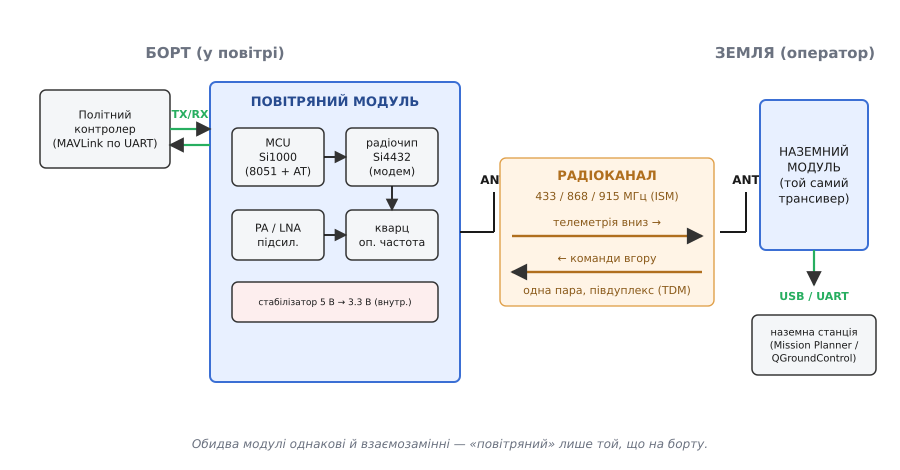
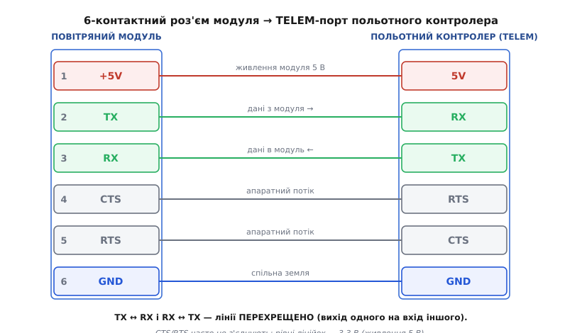

# FPV-телеметрія — повітряний модуль

<preknowlist>
- [Політний контролер](book:programming/flight-controller) — плата, що керує апаратом і віддає свій стан по UART; саме до неї чіпляється цей модуль.
- [Пакет MAVLink](book:communications/mavlink-packet) — формат кадру телеметрії, який модуль возить прозоро (не розбираючи).
- [Асинхронний UART](book:communications/uart-frame) — послідовний порт TX/RX, яким модуль спілкується з контролером; тут треба знати про швидкість у бодах і перехрест TX↔RX.
- [ISM-діапазони](book:communications/ism-bands) — неліцензовані смуги 433/868/915 МГц, у яких модуль працює, і чому регіон важливий.
</preknowlist>

Це маленька плата з антеною, яку прикручують до дрона чи літачка, щоб він **розповідав про себе на землю** й **слухав команди звідти** — і все це по одному тонкому дротику до польотного контролера. Апарат летить за кілометр, а на екрані ноутбука в реального часу біжать висота, курс, напруга батареї, координати; ви клікаєте «лети сюди» — і за секунду він розвертається. Між ноутбуком і бортом немає ніякого Wi-Fi чи мобільної мережі; є рівно два однакові радіомодулі — один на борту (**повітряний**), другий біля вас (наземний), — і вони тримають між собою невидиму послідовну лінію.

Головна ідея, яку варто вхопити відразу: **цей модуль сам по собі нічого не знає про політ**. Він не розуміє, що таке висота чи місія. Для нього борт — це просто джерело байтів, які треба чесно донести на інший кінець, а з іншого кінця — забрати байти й віддати назад. Він робить вигляд, ніби між двома послідовними портами — за кілометр один від одного — простягли фізичний дріт. Цю ілюзію так і називають — **прозорий послідовний міст** (англ. *transparent serial link*): що зайшло в UART тут, те вийшло з UART там, у тому ж порядку й тими ж байтами. Уся розумна робота (що це за дані, що з ними робити) лишається польотному контролеру й наземній станції; модуль — лише труба.

> 🔧 **Навіщо ця ясність.** Коли розумієш, що модуль — це просто радіо-подовжувач UART, зникає половина «магічних» проблем. Не працює телеметрія — питання не до модуля, а до того, чи правильно виставлена **швидкість порту** з обох боків, чи не переплутані **TX і RX**, чи однаковий у пари **мережевий ключ**. Модуль справний майже завжди; ламається — стик між ним і контролером.

## Що це за пристрій і з чим його плутають

Під «FPV-телеметрією» на ринку розуміють кілька різних речей, і плутанина тут дорого коштує, бо вони несумісні між собою.

Класика жанру, з якої почалася вся хобі-телеметрія дронів, — це **SiK-радіо** (за назвою відкритої прошивки SiK). Дві однакові платівки завбільшки зі сірникову коробку, кожна з мікро-USB, роз'ємом під антену й шестиконтактним гніздом під контролер. Одну ставлять на борт, другу тримають на землі; на землю вона під'єднується по USB до ноутбука. Продають їх парою й найчастіше під двома цифрами на корпусі — **433 МГц** (Європа, де дозволено) або **915 МГц** (Північна Америка). Найвідоміші втілення — колишні **3DR Radio** та нинішні [Holybro SiK Telemetry Radio](book:connect/fpv-telemetry-ground) V3; про народження цієї лінійки — [окрема історія](book:connect/fpv-telemetry-air/hist-sik-birth.md). Саме такий модуль ми тут і розбираємо: це «еталонний» повітряний модуль телеметрії, і решту зручно міряти від нього.

> SiK — це відкрита прошивка (англ. *firmware*) для дешевих радіомодулів на чипі Silicon Labs Si1000; її створили в спільноті ArduPilot і відточили саме під возіння MAVLink. Модуль без цієї прошивки — просто радіо; із нею — готовий телеметричний міст із AT-командами, стрибками частоти й поділом ефіру в часі. [Як народилося SiK-радіо](book:connect/fpv-telemetry-air/hist-sik-birth.md).

Другий, новіший різновид — це **повітряний блок систем керування**, як-от [ExpressLRS чи mLRS](book:connect/elrs-air-unit). Спершу ці системи робили лише одне — везли **команди від пульта до апарата** (керування газом, кермом). Але оскільки радіолінія й так двобічна, у них додали зворотний потік — і тепер той самий маленький приймач на борту тягне **і команди вгору, і телеметрію вниз** по одній лінії, віддаючи все це польотному контролеру через один UART. Такий «повітряний блок» (англ. *air unit*) — це, по суті, телеметрійний модуль і приймач керування в одному, на сучасних чипах Semtech (SX1276, SX1280). Він потужніший і компактніший за SiK, але його треба **зв'язувати з конкретним пультом** і налаштовувати інакше.

Третє, що інколи теж звуть «телеметрією», — це відео-передавачі (VTX) для картинки з камери. Це геть інша річ: вони возять аналогове чи цифрове відео, а не дані про стан, і до нашого модуля відношення не мають. Тут ми говоримо саме про **дані телеметрії й команди**, не про відео.

> 🔧 **Навіщо розрізняти.** Перше рішення перед покупкою — «окреме SiK-радіо чи повітряний блок системи керування?». Якщо апаратом уже керує сучасна цифрова система (ELRS-пульт) — телеметрію найпростіше пустити тим самим каналом, без другого радіо на борту й без другої антени. Якщо ж керування окреме (наприклад, класичний пульт із іншим приймачем) або телеметрія потрібна на звичайний ноутбук із Mission Planner — беруть пару SiK. Сплутаєте — купите два модулі, які не бачать одне одного, бо це різні системи з різними протоколами.

## Що всередині повітряного модуля

Модуль зручно уявляти як коробку з чітким поділом праці: половина її розуміє **послідовний порт і команди**, половина — **радіо**, і між ними одна межа.

У центрі — **керуючий мікроконтролер**. У класичного SiK-радіо це Silicon Labs **Si1000** — процесор на старому доброму ядрі 8051 з радіочастиною поряд. Саме він тримає всю логіку: приймає ваші байти з UART, складає їх у радіопакети, стежить за розкладом ефіру, розбирає AT-команди конфігурації й зберігає налаштування. Поруч (в Si1000 — на тому ж кристалі, у ширшому класі модулів HM-TRP — окремим чипом **Si4432**) сидить **радіомодем**: він перетворює біти на радіохвилю й назад, підсилює сигнал на передачу підсилювачем потужності (PA) і витягує кволий сигнал із шуму малошумним підсилювачем (LNA) на прийом. **Кварц** задає опорну частоту, від точності якої залежить, чи зійдуться два модулі в ефірі. Далі — ланцюг узгодження й вивід антени.


*Уся система — це два однакові модулі й ефір між ними. Борт: політний контролер віддає модулю MAVLink по UART (TX/RX), модуль сам формує радіопакети й через антену шле їх на землю, а звідти приймає команди. Наземний модуль — той самий трансивер — віддає все по USB наземній станції. «Повітряний» — просто той, що опинився на борту.*

Одна деталь усередині рятує безліч нервів, і про неї варто знати: **власний стабілізатор живлення**. Плату годують п'ятьма вольтами (їх зазвичай і дає TELEM-порт контролера), а сам радіочип працює на 3.3 В — тож на платі стоїть внутрішній перетворювач 5 В → 3.3 В. Це означає, що вам **не треба** думати про рівні живлення радіочастини: подали чисті 5 В — модуль сам зробить із них те, що йому треба. А от **логічні рівні послідовного порту — 3.3 В**, і це вже ваша турбота (нижче).

## Роз'єм і як під'єднати до польотного контролера

Назовні повітряний модуль виводить дуже мало контактів, і всі вони — на одному шестиконтактному гнізді. Це стандартний телеметрійний роз'єм (історично DF13, у сучасних платах — JST-GH), і порядок контактів у нього такий самий, як у TELEM-порту польотного контролера, — навмисно, щоб з'єднати їх шлейфом «один в один» майже без думки. Майже — бо дві лінії треба **перехрестити**, і саме на цьому спотикаються.


*Розводка пін-у-пін. Живлення (+5V) і земля (GND) йдуть прямо. Лінії даних перехрещено: вихід модуля TX іде на вхід контролера RX, а вихід контролера TX — на вхід модуля RX. CTS/RTS (апаратний контроль потоку) найчастіше лишають непід'єднаними. Рівні ліній — 3.3 В.*

Розкладемо контакти за призначенням:

```
Контакт   Сигнал   Куди й навіщо
──────────────────────────────────────────────────────────
  1        +5V      живлення модуля — рівно 5 В (внутр. стабілізатор
                    сам зробить 3.3 В для радіочипа)
  2        TX       дані З модуля  → на вхід RX контролера
  3        RX       дані В модуль  ← з виходу TX контролера
  4        CTS      апаратний контроль потоку (часто не потрібен)
  5        RTS      апаратний контроль потоку (часто не потрібен)
  6        GND      спільна земля з контролером
```

Тут два місця, де народжується більшість «нічого не працює».

Перше — **перехрест TX/RX**. Послідовний порт влаштований так, що «передача» одного боку мусить прийти на «прийом» іншого. Якщо з'єднати TX з TX і RX з RX (як підказує однаковість підписів), обидва боки говоритимуть, але жоден не слухатиме — суцільна тиша без жодної помилки. Тому: **TX модуля → RX контролера, RX модуля → TX контролера**. У фірмових шлейфах під конкретний контролер цей перехрест уже зроблено всередині кабелю; якщо паяєте самі — стежте за ним пильно.

Друге — **логічні рівні 3.3 В**. Лінії даних модуля працюють на 3.3 В, тож питання завжди одне: на скільки вольтів працює порт того, до кого ви його чіпляєте. Майже всі сучасні польотні контролери (Pixhawk і сумісні) — теж 3.3-вольтові, як і решта сучасних мікроконтролерів із 3.3-вольтовим введенням-виведенням (STM32, ESP32, RP2040), — вони з'єднуються з модулем **напряму, без жодних перетворювачів**. Проблема виникає лише з 5-вольтовою логікою (класичні плати на AVR ATmega — Arduino Uno чи Nano — і подібне старе залізо): тоді вихід TX такого контролера (5 В) завеликий для входу RX модуля, і між ними треба знизити рівень дільником чи перетворювачем рівнів. Живлення при цьому — завжди 5 В, це окрема від логіки річ.

**CTS/RTS** — це лінії апаратного контролю потоку («стій, я не встигаю» / «можна лити далі»). Для телеметрії на невисоких швидкостях їх майже завжди лишають непід'єднаними, і все чудово працює. Вони стають у пригоді лише на високих швидкостях порту, коли контролер може не встигати забирати дані, — але для типового MAVLink 57600 бод це не проблема.

## Одна пара, півдуплекс і чому обидва модулі однакові

Тепер найцікавіше в тому, як ці два модулі ділять ефір, — бо звідси випливають і сильні, і слабкі сторони всієї системи.

У модуля **одна антена й один радіочип**, а не окремі на передачу й прийом. Значить, у кожну мить він може або говорити, або слухати, але не одночасно — це **півдуплекс** (лат. *duplex* — «подвійний»; тут «пів», бо канал один на двох по черзі). Щоб два модулі не заглушали один одного, прошивка ділить час на дрібні проміжки за жорстким розкладом і чергує: зараз твоя черга передавати, тепер моя. Цей поділ ефіру в часі називають **TDM** (англ. *time-division multiplexing* — ущільнення з поділом за часом). Розклад узгоджено так, що телеметрія тече вниз (борт → земля) більшу частину часу, а команди — коли треба — протискаються вгору у виділені вікна.

Звідси прямий наслідок, який часто дивує: **вгору канал вужчий, ніж вниз**. Телеметрії багато й вона ллється майже безперервно; команд мало й вони короткі. Тому телеметрію ви бачите плавно, а завантажити на борт велику місію (сотні точок) буває помітно повільніше — вона протискається вгору маленькими порціями між потоком телеметрії.

І звідси ж відповідь на питання, чому модулі **взаємозамінні**. Оскільки залізо в них однакове й кожен уміє і передавати, і приймати, немає жодної фізичної різниці між «повітряним» і «наземним». «Повітряний» — просто той, який цього разу опинився на борту; поміняйте їх місцями — нічого не зміниться. Пару робить парою не роль, а **спільний мережевий ключ** (нижче), а не апаратна різниця.

> 🔧 **Навіщо це.** Взаємозамінність — це зручність у полі. Загубили чи спалили бортовий модуль — ставите на борт наземний, а замість нього під ноутбук купуєте будь-який сумісний, аби збігалися частота й ключ. Не треба шукати «саме повітряну» версію: її не існує. А розуміння півдуплексу рятує від хибних очікувань — не чекайте, що велика місія залетить угору так само швидко, як телеметрія сиплеться вниз.

## Мережевий ключ, швидкості й AT-команди

Щоб два модулі почули один одного, у них мусить збігтися кілька налаштувань — і тут ховається головна причина «купив пару, а вони мовчать».

Найважливіше — **мережевий ключ** (англ. *NetID*, network ID). Це число, спільне для пари. Модулі з різним NetID **не бачать одне одного взагалі** — і не тому, що «не домовилися», а тому, що NetID злегка зсуває робочу частоту й порядок стрибків: різний ключ — фізично різні частоти. Це зроблено навмисно, щоб дві пари поруч (два дрони на одному полі) не заважали одна одній. Тож правило номер один: **однаковий NetID на обох модулях пари**.

Далі — дві різні швидкості, які легко сплутати:

```
SERIAL_SPEED  швидкість дротяного порту між модулем і контролером
              (типово 57 → 57600 бод). Мусить збігатися з тим,
              що виставлено в польотному контролері.

AIR_SPEED     швидкість самого радіо в ефірі (типово 64 кбіт/с).
              Мусить збігатися на ОБОХ модулях пари.
              Нижча air-швидкість = більша дальність, менше даних.
```

Плутанина тут дорога: SERIAL_SPEED — це про дріт (модуль ↔ контролер), AIR_SPEED — про ефір (модуль ↔ модуль). Якщо контролер шле на 115200, а модуль слухає порт на 57600 — вони не порозуміються, хоч радіо працює ідеально. Якщо ж два модулі мають різну AIR_SPEED — мовчить уже радіо. Ловіть різницю: **serial має збігатися з контролером; air — між модулями**.

Налаштовують усе це **AT-командами** — короткими текстовими рядками, які модуль розуміє, коли ввести його в режим команд. Механізм навмисне простий: спочатку «мовчанка» на лінії, потім три плюси, потім знову мовчанка — і модуль перемикається з «труби» на «пульт»:

```
(1 с тиші) +++ (1 с тиші)    → OK      увійти в режим команд
ATI                          → версія прошивки
ATI5                         → показати всі параметри (NetID, швидкості…)
ATS3=25                      → задати параметр 3 (NetID) = 25
AT&W                         → зберегти в пам'ять (EEPROM)
ATZ                          → перезавантажити модуль з новими параметрами
```

Найзручніше в цьому механізмі — префікс **RT** замість **AT**: він адресує ту саму команду **віддаленому** модулю через радіоканал. Тобто, під'єднавши до ноутбука наземний модуль, ви можете налаштувати бортовий, не знімаючи його з апарата, — команди `RTI`, `RTS…`, `RT&W` полетять на борт по радіо. На практиці всім цим займається графічна вкладка в Mission Planner чи QGroundControl, і ви крутите повзунки, а не набираєте команди руками, — але під капотом там саме ці рядки. Робочий приклад — від входу в режим команд до читання й запису параметрів (і як не окиритися) — у [окремій вставці про API](book:connect/fpv-telemetry-air/api-sik-config.md).

## MAVLink-обгортка: навіщо модулю знати про кадри

Є одна опція, яка виглядає як дрібниця, а насправді помітно міняє якість зв'язку, — і в ній видно всю філософію модуля.

Модуль возить байти прозоро. Але якщо ввімкнути йому параметр **MAVLINK-обрамлення**, він починає **підглядати за межами MAVLink-кадрів** у потоці — не розбираючи вміст, лише впізнаючи, де кадр починається й де кінчається. Навіщо? Щоб не різати повідомлення посередині. Радіо пакує дані в свої радіопакети; якщо межа радіопакета впаде на середину MAVLink-кадру, а наступний шматок загубиться в ефірі, — зіпсується весь кадр. Коли модуль знає, де межі кадрів, він намагається **вкладати цілий кадр у передачу** й не рвати його навпіл. Наслідок — менше зіпсованих повідомлень на дальній межі зв'язку.

Це чудова ілюстрація межі відповідальності: модуль **усе одно не розуміє** MAVLink — що таке HEARTBEAT чи ATTITUDE, йому байдуже. Він лише навчився бачити **обгортку** кадру ([пакет MAVLink](book:communications/mavlink-packet) має чіткий стартовий байт і поле довжини), щоб акуратніше нарізати ефір. Уся семантика лишається на польотному контролері й наземній станції; модуль просто став трохи розумнішим листоношею.

> 🔧 **Навіщо це.** Увімкнена MAVLink-опція — безкоштовне покращення надійності телеметрії, якщо ви возите саме MAVLink (а на дронах це майже завжди так). Але якщо ви жене через модуль **не** MAVLink (свій формат, GPS-NMEA, будь-що інше) — цю опцію треба **вимкнути**, інакше модуль шукатиме межі кадрів, яких немає, і псуватиме потік. Правило просте: возите MAVLink — вмикайте; возите щось своє — вимикайте.

## Живлення, дальність і антена — чого стерегтися

Три речі найчастіше визначають, чи буде зв'язок надійним у полі, і кожна варта окремої уваги.

**Живлення.** Радіо в спокої й на прийомі споживає скромно — десятки міліампер. Але **в момент передачі** підсилювач потужності рве короткий жадібний пік струму: на повній потужності +20 дБм (це 100 мВт у ефір) модуль тягне близько **100 мА**, тоді як на прийомі — лише ≈ 25 мА. Пік короткий, але якщо живлення «тонке» (кволий стабілізатор на платі, довгі дротики), напруга на модулі на цю мить просідає — і він може скинутися чи зависнути саме на передачі. Збоку це виглядає загадково: телеметрія то є, то раптом зникає. Тому повітряний модуль годують від **надійного джерела 5 В**, а не від найслабшого виводу на платі; фірмові плати з живленням від TELEM-порту зазвичай це враховують.

**Потужність передачі.** Задається в децибел-міліватах (дБм). Класичний SiK на 100 мВт видає до +20 дБм; є потужніші версії — 500 мВт (+27 дБм) і 1 Вт (+30 дБм) — для більшої дальності. Груба відповідність потужності:

```
дБм   мВт
──────────
 14    25
 17    50
 20   100   (типовий SiK-модуль)
 27   500
 30  1000
```

Тут ховається двобічна пастка. Вища потужність — це не завжди краще: по-перше, **закон** обмежує, скільки можна випромінювати в неліцензованому діапазоні у вашому регіоні; по-друге, задерши потужність передачі на борту, ви покращуєте лише канал **вниз** — а канал угору впирається в потужність наземного модуля. Дальність зв'язку тримає **слабший з двох напрямків**, тож нарощувати варто обидва боки разом, а не лише борт.

**Антена — найбільший важіль.** Дальність визначає не стільки ват потужності, скільки антена та її розміщення. Правильна антена на **свій** діапазон (антена від 915-модуля погано працює на 433 — вона фізично іншого розміру), піднята над корпусом апарата, з відкритим небом, дає більший виграш, ніж зайвий ват. І звідси правило, що звучить забобоном, а має чисту фізику: **ніколи не вмикайте модуль без приєднаної антени**. Підсилювачу потужності нікуди віддати енергію на передачі, вона відбивається назад у вихідний каскад — і чип можна тихо деградувати чи спалити за кілька передач. Антена стоїть **до** першого ввімкнення живлення, завжди.

І окремо про **регіон і закон**: модуль купують строго під свій діапазон (433 чи 915), бо це не програмний перемикач — інша антена, інший ланцюг узгодження. А в ефірі діють місцеві правила: у Європі 868 МГц обмежений часткою зайнятості ефіру (duty cycle), у США — максимальним часом безперервної передачі. Прошивка SiK уміє це враховувати (є параметри duty cycle й «слухай, перш ніж говорити»), але відповідальність за вибір діапазону під свою країну — на вас.

## Типові граблі — короткий чек-лист

Звівши все докупи, ось де найчастіше ламається перший запуск повітряного модуля й чому:

```
Симптом                          Найімовірніша причина
─────────────────────────────────────────────────────────────────
Модулі поряд, а зв'язку нема      різний NetID; різна AIR_SPEED на парі
Зв'язок є, телеметрія — сміття    різна SERIAL_SPEED між модулем і контролером
Обидва «світяться», але тиша      переплутані TX/RX (не перехрещено)
Телеметрія зникає на передачі     просіле живлення на піку струму (тонке 5 В)
Дальність набагато менша за гадану антена не на свій діапазон / погано стоїть
Псуються саме MAVLink-повідомлення MAVLINK-опцію вимкнено (варто ввімкнути)
Свій не-MAVLink потік ламається   навпаки, MAVLINK-опцію ввімкнено (вимкнути)
Чип із часом слабшає чи гине      вмикали живлення без антени
```

Майже все тут — не про радіо і не про поломку, а про кілька банальних стиків: однакові NetID і air-швидкість на парі, однакова serial-швидкість із контролером, перехрещені TX/RX, чесні 5 В і антена на свій діапазон. Полагодите їх — і повітряний модуль стає рівно тим, чим обіцяв: тихою платівкою, що тримає ваш апарат на зв'язку з землею за горизонтом видимості.

## Варіації, які трапляються

Насамкінець — короткий орієнтир, щоб упізнати, що саме потрапило вам у руки під назвою «телеметрія».

**За поколінням і системою.** Класичне **SiK-радіо** (Si1000, окрема пара 433/915) — найпоширеніше, найпростіше, працює з будь-якою наземною станцією й будь-яким контролером через UART. Сучасні **повітряні блоки систем керування** ([ExpressLRS, mLRS](book:connect/elrs-air-unit)) на чипах Semtech SX127x/SX1280 суміщають телеметрію з керуванням в одному приймачі на борту, дають більшу дальність і чутливість, але вимагають прив'язки до пульта. Якщо потрібна проста телеметрія на ноутбук — SiK; якщо апаратом уже керує ELRS-пульт — телеметрію логічно пустити тим самим блоком.

**За потужністю.** Той самий формат випускають на 100 мВт (типовий, +20 дБм), 500 мВт і 1 Вт. Потужніші — для більшої дальності, але з оглядкою на закон і на те, що дальність тримає слабший бік лінії.

**За діапазоном.** 433 МГц (Європа й багато де у світі, де дозволено) і 915 МГц (Північна Америка); подекуди 868 МГц. Беруть **строго під свій регіон** — це апаратна, а не програмна відмінність.

**За роз'ємом і форматом.** Історичний DF13 на старих платах, сучасний JST-GH на нових; вивід антени — SMA або RP-SMA. Наземний бік — з мікро-USB чи USB-C під ноутбук. Спільне в усіх одне: усередині — керуючий MCU з радіомодемом, зовні — шість контактів під UART і живлення й антена. Розберетеся з парою на одному наборі — решта відрізнятиметься лише дрібницями підключення.
