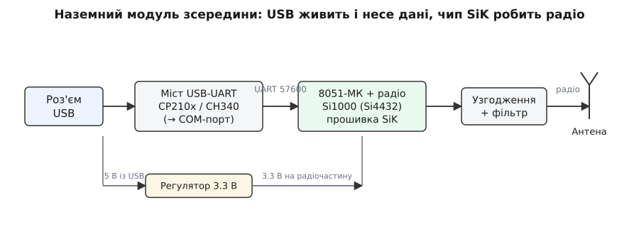
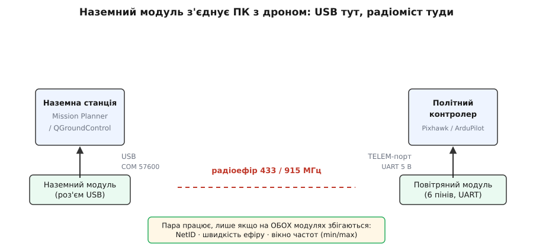

# FPV-телеметрія — наземний модуль

<preknowlist>
- [UART — послідовний порт](topic:connect/bluetooth-hc05) — дві лінії TX/RX, спільна швидкість (baud); модуль віддає й приймає байти саме так.
- [LoRa-модуль](topic:connect/lora-module) — що таке готовий радіомодуль, антена, живлення, чому пік струму на передачі просаджує напругу.
- [FPV-телеметрія — повітряний модуль](topic:connect/fpv-telemetry-air) — його пара на борту дрона; наземний без нього марний, і всі радіопараметри мусять збігтися.
</preknowlist>

Це половина радіомоста, яка лежить у вас на столі. Друга половина сидить на дроні за кілометри звідси, а ця — маленька коробочка з антеною й USB-роз'ємом — стоїть біля ноутбука й перетворює його на наземну станцію. Устромили в USB — у системі з'явився новий COM-порт; відкрили Mission Planner на швидкості 57600 — і на екрані поповзли висота, координати, напруга батареї, кути нахилу. Ви не написали жодного рядка радіокоду. Наземний модуль сам зловив пакети з ефіру, перевірив їх на помилки й віддав операційній системі звичайним потоком байтів через послідовний порт, ніби до комп'ютера підключили простий кабель.

Уся хитрість у тому, що це **прозорий міст** (англ. *transparent bridge*): що один модуль проковтнув у свій UART — те другий виплюнув зі свого, байт у байт. Наземному модулю байдуже, що ви шлете — телеметрію ArduPilot, команди керування чи власний текст; він просто тягне дані туди й назад. Тому вся ваша робота — не програмувати радіо, а правильно з'єднати два кінці, нагодувати їх живленням і сказати обом одні й ті самі три числа, за якими вони знайдуть одне одного в ефірі.

> 🔧 **Навіщо це.** Наземний модуль — це найдешевший спосіб бачити, що робить літальний апарат, поки він у повітрі. Дротом до дрона не дотягнешся, Wi-Fi добиває на десятки метрів і глухне за деревом, а цей радіоміст на 433 чи 915 МГц тримає зв'язок на кілометри з відкритого поля. Через нього ви в реальному часі читаєте телеметрію, міняєте параметри автопілота, вантажите маршрут місії — усе те, заради чого й ставлять телеметрію на безпілотник.

## Чим наземний модуль відрізняється від повітряного

Найголовніше, що варто зрозуміти одразу: **наземний і повітряний модулі — це майже той самий пристрій**. Усередині обох — однакова плата, однаковий радіочип, однакова прошивка. Різниця між ними майже вся в одному: **як вони під'єднуються до свого «господаря»**.

Повітряний модуль сидить на дроні й спілкується з політним контролером напряму — короткими дротами по логічному UART. У нього назовні виходить гребінка з кількох пінів (живлення, земля, TX, RX), яку встромляють у телеметрійний порт автопілота. Комп'ютера там нема, USB не потрібен.

Наземний модуль живе біля людини й мусить під'єднатися до ноутбука чи ПК — а комп'ютер не має «сирого» UART, до нього все чіпляється через USB. Тому наземний модуль несе на собі ще одну деталь, якої нема на повітряному: **міст USB-UART** — маленьку мікросхему, що вдає із себе послідовний порт для операційної системи. Устромили в USB — драйвер підняв віртуальний COM-порт, і програма-станція говорить із модулем так, ніби це старий добрий послідовний порт на задній панелі.

> Пара телеметрії продається набором «повітря + земля», і модулі **взаємозамінні як пара, але не за роллю**: будь-який може стати наземним, а будь-який — повітряним, бо плата спільна. Проте на практиці «наземним» називають той, у якого розведено USB-роз'єм, а «повітряним» — той, у якого виведено гребінку UART під автопілот. Народження цієї відкритої платформи (проєкт SiK, компанія 3DR) — окрема історія: [звідки взявся SiK-радіомодем](topic:connect/fpv-telemetry-ground/hist-sik-radio.md).

Отже, коли ви тримаєте наземний модуль, ви впізнаєте його за трьома ознаками: **USB-роз'єм** (частіше micro-USB), **антена** на боці (часто на гнучкому виводі з роз'ємом SMA/RP-SMA) і **світлодіоди**, що моргають станом зв'язку. Гребінки під автопілот у нього зазвичай нема — саме USB робить його «наземним».

## Що всередині наземного модуля

Уявімо модуль як коротку естафету від USB-роз'єму до антени. Дані проходять через чотири руки й на кожній міняють форму.


*Естафета сигналу в наземному модулі. USB-роз'єм несе і дані, і живлення. Міст USB-UART перетворює USB на послідовний потік і показує системі COM-порт. Мікроконтролер (ядро 8051) з прошивкою SiK збирає пакет, а вбудований радіоблок формує сигнал і через ланцюг узгодження віддає його на антену. Живлення 5 В із USB регулятор знижує до 3.3 В для радіочастини.*

Розберемо по руках, бо кожна пояснює одну властивість модуля.

**Міст USB-UART** — та сама деталь, якої нема на повітряному модулі. Це окрема мікросхема (типово CP2102 фірми Silicon Labs, інколи CH340 чи FTDI), що з одного боку — повноцінний USB-пристрій, а з іншого — звичайний UART. Коли ви встромляєте модуль, операційна система бачить USB-пристрій, вантажить драйвер віртуального COM-порту (англ. *virtual COM port*, VCP) і показує вам новий послідовний порт. Далі програма пише в цей порт байти — міст переносить їх на UART мікроконтролера. Саме тому наземний модуль «просто працює» як кабель: уся магія перетворення USB↔UART захована в цій мікросхемі.

> Драйвер віртуального COM-порту — це шматок системного коду, який робить так, що USB-пристрій виглядає для програм як класичний послідовний порт (COM3, COM7 на Windows; `/dev/ttyUSB0`, `/dev/ttyACM0` на Linux; `/dev/tty.usbserial-*` на macOS). Свіжі Windows часто ставлять його самі; для старіших чи для CH340 інколи треба поставити драйвер вручну. Без нього модуль видно в диспетчері пристроїв з окликом, а порт не з'являється.

**Мікроконтролер із прошивкою SiK.** Серце модуля — 8-бітний мікроконтролер на ядрі 8051 (класичні модулі — на кристалі Silicon Labs Si1000, у якому радіочастина інтегрована; радіоблок — рівня Si4432). У ньому крутиться відкрита прошивка **SiK** — це вона робить усю роботу, якої ви не бачите: нарізає ваш потік байтів на пакети, додає завадостійке кодування, стежить за ефіром, чергує передачу й прийом (бо один радіоблок не може водночас і слухати, і говорити), і збирає прийняте назад у рівний потік для UART. Що важливо — прошивка **однакова** в обох модулях пари; вона не знає й не хоче знати, хто «наземний», а хто «повітряний».

**Радіоблок і ланцюг узгодження.** Далі йде та сама радіокухня, що й у будь-якому радіомодулі: підсилювач потужності на передачу, малошумний підсилювач на прийом, кварц як опора частоти й ланцюг узгодження з фільтром перед антеною. Наземному модулю тут нема нічого унікального — це звичайне радіо на діапазон 433 або 915 МГц.

**Живлення від USB.** І остання рука — живлення. Наземний модуль не потребує окремого блока: усі 5 В він бере з USB-порту, а вбудований регулятор знижує їх до 3.3 В, якими живиться радіочастина. Це зручно (одним кабелем і дані, і струм), але має пастку, до якої повернемося: слабкий USB-порт може не витягнути пік струму на передачі.

## Як під'єднати й побачити дані

Наземний бік моста ставиться до смішного просто — у цьому весь сенс USB-роз'єму. Але щоб зрозуміти, чому інколи «нічого не з'являється», корисно бачити обидва кінці разом.


*Повний ланцюг телеметрії. Ліворуч — наземна станція: модуль устромлено в USB, він видно як COM-порт на 57600. Праворуч — борт: повітряний модуль під'єднано до телеметрійного порту автопілота логічним UART на 5 В. Між ними — радіоефір. Пакети підуть, тільки якщо на обох модулях збігаються три речі: мережевий ідентифікатор (NetID), швидкість ефіру й вікно частот. Не збіглися — тиша без жодної помилки.*

**Наземний бік — три кроки.**

```
1. Причепіть антену до модуля     (ЗАВЖДИ до подачі живлення!)
2. Устроміть модуль у USB          → у системі з'явиться COM-порт
3. У станції оберіть цей порт,
   швидкість 57600, натисніть Connect
```

Швидкість порту тут — **57600 бод** за замовчуванням майже в усіх готових наборів (це швидкість між комп'ютером і модулем по USB-UART, не швидкість в ефірі — їх не плутати). Якщо станція не з'єднується, перше, що перевіряють, — чи той обрано COM-порт і чи та швидкість.

**Другий бік мусить існувати й збігатися.** Наземний модуль сам по собі мертвий: він шле пакети в ефір, але якщо на дроні немає ввімкненого повітряного модуля з **тими самими** радіопараметрами, ви побачите порожній екран без жодного повідомлення про помилку. Три параметри мусять збігтися до єдиного:

```
NetID (мережевий ID)     — щоб два модулі вважали одне одного «своїми»
Швидкість ефіру (air rate) — однакова нарізка часу й символів
Вікно частот (MIN/MAX_FREQ) — обидва «стрибають» по одному діапазону
```

Це головна причина «купив пару, з'єднав — тиша». З коробки набір зазвичай уже спарований однаково, тож працює одразу. Але щойно ви покрутили налаштування на одному модулі й забули повторити на другому — міст розривається без попередження. Тому конфігурувати радіопару треба **симетрично**: що змінили тут, повторіть там.

> 🔧 **Навіщо це.** Радіоміст не має «пінг» чи «помилка з'єднання» — він або несе байти, або мовчить. Тому весь пошук несправностей зводиться до питання «а обидва кінці однакові?». Дев'ять із десяти «телеметрія не працює» — це або не той COM-порт/швидкість на землі, або розбіжність NetID/швидкості ефіру/частот між модулями. Тримайте набір спарованим — і міст стає невидимим, яким і має бути.

## Живлення й пастка «модуль зникає на передачі»

USB-живлення зручне, доки в гру не вступає радіо. У спокої й на прийомі радіоблок споживає одиниці-десятки міліампер — будь-який USB-порт це тягне. Але **в мить передачі** підсилювач потужності рве з живлення короткий жадібний пік: на повній потужності (до +20 дБм, це 100 мВт) струм підстрибує до сотні з гаком міліампер. Пік короткий, та якщо живлення «тонке» — довгий чи дешевий USB-подовжувач, кволий порт на ноутбуці, USB-хаб без свого живлення — напруга на модулі на цю мить просідає нижче робочої. Модуль скидається, зв'язок рветься. Збоку це виглядає загадково: телеметрія то йде, то пропадає, і саме коли модуль намагається щось передати (наприклад, коли ви шлете команду на борт).

Лік той самий, що й для будь-якого радіомодуля: **годувати наземний модуль від хорошого USB-порту** — прямого на материнській платі, а не через довгий подовжувач чи ненадійний хаб. Якщо доводиться нести модуль далі від ПК (винести антену вище й від перешкод), беруть **короткий якісний USB-кабель** або активний подовжувач, а не метри дешевого дроту. У самому модулі конденсатор на живленні вже стоїть, тож зовні додавати зазвичай нічого не треба — досить не морити його поганим USB.

Чому просідання живлення на піку передачі так підступно збиває радіо, детальніше розібрано на прикладі спорідненого модуля: [чому радіомодуль «зникає» на передачі](topic:connect/lora-module) — там та сама фізика піку струму, тільки живлення йде не з USB, а з плати.

## Налаштування: AT-команди й вкладка в станції

Щоб змінити радіопараметри наземного модуля, є два шляхи, і обидва варто знати.

**Простий шлях — графічна вкладка станції.** Mission Planner (і QGroundControl) мають окрему сторінку налаштувань SiK-радіо: під'єднали модуль, натиснули «Load Settings» — і бачите поля NetID, потужність, швидкість ефіру, частоти. Найзручніше, що станція вміє читати й писати **обидва модулі одразу** — локальний (наземний, у вашому USB) і віддалений (повітряний, через ефір). Це рятує від головного болю симетрії: ви міняєте параметр в одному вікні, а станція сама записує його в обидва кінці, тримаючи пару спарованою.

**Точний шлях — AT-команди.** Під графікою ховається текстовий протокол. Модуль після ввімкнення працює у **прозорому режимі** — усе, що в нього надходить по UART, він шле в ефір. Щоб він почав слухати команди, а не передавати їх, треба ввести його в **командний режим** особливою послідовністю: надіслати `+++` і **нічого не слати секунду до й секунду після**. Ця тиша навколо `+++` — навмисна, щоб три плюси серед звичайних даних випадково не перемкнули модуль. Після цього модуль відповідає на команди:

```
+++            увійти в командний режим (тиша 1 с до і після)
ATI            показати версію прошивки
ATI5           показати ВСІ параметри (S-регістри) з поточними значеннями
ATSn?          прочитати параметр номер n
ATSn=X         записати параметр n значенням X
AT&W           зберегти параметри в пам'ять (EEPROM)
ATZ            перезавантажити модуль (щоб зміни діяли)
AT&F           скинути все до заводських значень
ATO            вийти з командного режиму назад у прозорий
```

Параметри — це нумеровані «S-регістри», кожен зі своїм змістом. Ось найважливіші:

```
S1  SERIAL_SPEED  швидкість UART з комп'ютером (у «однобайтовій» формі: 57 = 57600)
S2  AIR_SPEED     швидкість в ефірі (кбіт/с) — головна ручка «дальність ↔ швидкість»
S3  NETID         мережевий ID — МУСИТЬ бути однаковий на обох модулях
S4  TXPOWER       потужність передачі в дБм (типово до 20)
S5  ECC           завадостійке кодування (1 = увімк.)
S6  MAVLINK       обробка кадрів MAVLink (розумніше ділить ефір під телеметрію)
S8  MIN_FREQ      нижня межа вікна частот (кГц)
S9  MAX_FREQ      верхня межа вікна частот (кГц)
S11 DUTY_CYCLE    обмеження частки часу в ефірі (під місцевий закон)
S15 MAX_WINDOW    максимальне вікно передачі (впливає на затримку)
```

Ключове правило випливає прямо з цих імен: **S2 (швидкість ефіру), S3 (NetID) і S8/S9 (частоти) мусять збігатися на обох модулях**, інакше пара не зійдеться. А от S1 (швидкість UART) — це параметр «локальний»: він про зв'язок модуля з його господарем (наземного — з ПК, повітряного — з автопілотом), і в наземного та повітряного він цілком може бути різним.

Щоб змінити віддалений (повітряний) модуль через ефір, не знімаючи його з дрона, є двійники цих команд із префіксом `RT` замість `AT` (напр. `RTI5` — показати параметри дальнього модуля). Вони працюють, лише поки лінія жива; ними ж і користується графічна вкладка, коли пише «в обидва кінці».

Типовий порядок зміни завжди один: увійти в командний режим → записати потрібні `ATSn=X` → `AT&W` зберегти → `ATZ` перезавантажити. Забудете `AT&W` — після перезавантаження параметр відкотиться до старого. Повний довідник цього інтерфейсу — відкриття порту, вхід у командний режим, уся таблиця AT-команд і S-регістрів та формат кадру телеметрії — зібрано окремо: [інтерфейс наземного модуля в коді](topic:connect/fpv-telemetry-ground/api-serial-mavlink.md). А як на ньому побудувати власну наземну станцію — зчитати потік із COM-порту й розібрати кадри MAVLink на позицію й напругу батареї — показано покроково: [власна наземна станція в коді](topic:connect/fpv-telemetry-ground/proj-read-telemetry.md).

## Дальність, частота й закон

«Кілометри» тут — правда з тією ж зірочкою, що й у будь-якого радіо. Наземний модуль дає ту саму дальність, що й пара загалом, і важелів у нього три.

**Частота — під регіон, не перемикач.** Модулі роблять під конкретний діапазон без ліцензії (ISM): **433 МГц** (типово Європа) і **915 МГц** (типово Північна Америка); трапляється й 868 МГц. Це не програмний перемикач — під частоту заточені ланцюг узгодження й антена, тож версію «433» не перетворити на «915» командою. Беріть строго під свою країну: 915 МГц у багатьох країнах Європи використовувати без дозволу не можна, і навпаки.

**Швидкість ефіру — компроміс.** Нижча швидкість ефіру (S2) — довші, «жирніші» символи, чутливіший прийом, більша дальність, але менша пропускна здатність. Вища — навпаки. Для звичайної телеметрії потоку небагато, тож заради дальності сміливо беруть нижчу швидкість ефіру. Практичне правило те саме, що й для інших радіомодулів: **бери найнижчу швидкість ефіру, яка ще стабільно тримає потрібний потік** — вона дає запас дальності задарма.

**Антена й розміщення — найбільший важіль.** Найдешевший спосіб добити далі — не крутити потужність, а **підняти наземну антену вище й від перешкод**, з відкритим небом у бік апарата. У відкритому полі з прямою видимістю пара бере кілька кілометрів, а типовий обіцяний мінімум «з коробки» — близько кількох сотень метрів; у місті ті самі кілометри стискаються до сотень метрів об стіни й залізобетон. Часто наземну антену навмисне виносять на щоглу чи ставлять напрямлену (patch) антену — це дає більший виграш, ніж зайвий ват.

І залізне правило радіо, що звучить забобоном, але має чисту фізику: **ніколи не вмикайте модуль без приєднаної антени**. Підсилювачу потужності нема куди віддати енергію, вона відбивається в вихідний каскад — і радіоблок можна тихо деградувати чи спалити за кілька передач. Антена — **до** живлення, завжди.

**Закон ефіру.** Діапазони без ліцензії обмежені правилами: у Європі на 433/868 МГц діє обмеження частки часу в ефірі (duty cycle) — пристрій має право займати канал лише малу частку часу; тому в прошивці є параметр S11 (DUTY_CYCLE). У США натомість обмежують спосіб зайняття каналу. Це не примха модуля, а закон — і серйозний проєкт налаштовує потужність і duty cycle під місцеві норми.

## Світлодіоди й швидка діагностика

Наземний модуль розповідає про себе двома світлодіодами — читати їх варто вміти, бо це найшвидша діагностика без комп'ютера. Типово:

```
Зелений блимає повільно   шукає пару (лінії ще нема)
Зелений горить рівно       пара знайдена, зв'язок є
Червоний блимає            йде передавання даних
```

Тобто рівний зелений — це «модулі знайшли одне одного»; якщо він і на землі, і на борту рівний, радіоміст стоїть, і далі проблема (якщо є) уже не в радіо, а в COM-порту чи станції. Повільно моргає зелений з обох боків — пара не сходиться: перевіряйте збіг NetID, швидкості ефіру й частот.

Звівши все докупи, ось де найчастіше спотикається перший запуск наземного модуля й чому:

```
Симптом                          Найімовірніша причина
──────────────────────────────────────────────────────────────────
COM-порт не з'явився              нема драйвера VCP (особливо CH340);
                                 поганий USB-кабель/порт
Порт є, станція не з'єднується    не той порт або не 57600 у станції
Зелений блимає, зв'язку нема      різні NetID / швидкість ефіру / частоти
                                 на двох модулях; або борт не ввімкнено
Зв'язок є, але рветься на командах просіле живлення на піку передачі
                                 (кволий USB / довгий подовжувач)
Дальність куди менша за обіцяну   погана або низько поставлена антена;
                                 висока швидкість ефіру замість низької
Модуль з часом «слабшає»          вмикали без антени
```

Майже все тут — не про радіо й не про код, а про кілька банальних речей: поставити драйвер і вибрати правильний порт зі швидкістю, увімкнути й однаково спарувати обидва модулі, дати чисте USB-живлення й підняти антену. Полагодьте їх — і наземний модуль стає рівно тим, чим обіцяв: тихою коробочкою, крізь яку ноутбук бачить дрон за горизонтом.

## Варіації, які трапляються

Насамкінець — короткий орієнтир, щоб упізнати, що саме потрапило вам у руки.

**За частотою.** Ті самі модулі випускають у версіях 433 / 868 / 915 МГц. Беріть під свій регіон — це апаратна відмінність, не перемикач.

**За потужністю й дальністю.** Крім звичайних модулів (до 100 мВт) є **посилені** версії з зовнішнім підсилювачем потужності (до сотень міліватів чи вата) і кращими антенами — для великих дальностей. Наземний бік такого набору тягне вже помітний струм на передачі, і його часто живлять не від USB-порту, а від окремого входу; це вже не «встромив у ноутбук і забув».

**За роз'ємом і антеною.** Наземний модуль майже завжди має USB (micro-USB чи USB-C у свіжіших), а антену — на роз'ємі SMA або RP-SMA, тож її легко замінити на кращу чи винести кабелем. Це відрізняє його від повітряного, у якого антена часто впаяна або на дрібному роз'ємі, а замість USB — гребінка UART.

**За прошивкою й брендом.** Плати різних виробників (Holybro, mRo, RFDesign та безліч сумісних) — це варіації однієї відкритої архітектури SiK; параметри й команди в них ті самі. Тому, розібравшись із конфігурацією на одному наборі, ви впораєтеся з будь-яким. Є й потужніші рідні для дальнього зв'язку (напр. лінійка RFD900) — вони мають більше можливостей, але ідея наземного боку та сама: USB у ПК, радіо в ефір.

Спільне в усіх одне: наземний модуль — це повітряний модуль плюс міст USB-UART, тиха коробочка, що робить із послідовного порту вашого комп'ютера вікно в те, що коїться на борту за кілометри звідси.
