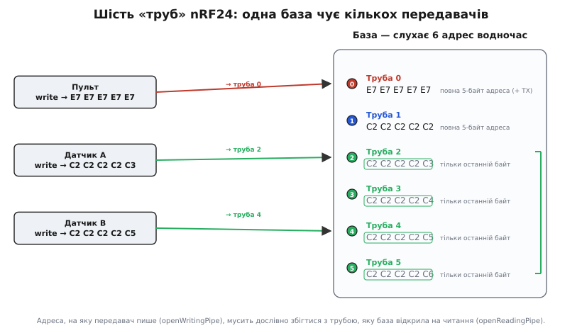

# ⚙️ Дві плати говорять: повний код передавача й приймача на RF24

Модуль лежить на столі, живлення чисте, конденсатор на місці, гребінець розведено правильно. Лишилося найцікавіше — **змусити дві плати обмінятися байтами**. І тут виявляється приємна річ: писати код для nRF24 набагато простіше, ніж його підключати. Уся хитра радіомашинерія схована в чипі; ваша частина зводиться до кількох рядків «ось адреса, ось канал, відправ це туди». Але між «кілька рядків» і «воно нарешті полетіло» лежить рівно п'ять понять, у які впирається кожен новачок: труба, адреса, канал, потужність і швидкість. Розберемо їх не абстрактно, а прямо на робочому коді — спершу мінімальний передавач і приймач, що заводяться з першого разу, потім шість «труб» бази, а тоді — чесний перелік того, чому «код правильний, а тиша».

Робота з чипом по суті однакова на будь-якому мікроконтролері: шина SPI, десяток регістрів і одна ніжка CE, якою ви кажете «передавай» або «слухай». Різниця лише в тому, чи хтось уже написав це за вас. В Arduino ховає бібліотека **RF24** (автор Джей Коупстейк і спільнота на GitHub `nRF24/RF24` — найпоширеніша й найкраще підтримувана обгортка для цього чипа під Arduino-ядрами й Linux); в ESP-IDF і STM32 HAL готової бібліотеки в комплекті нема, тож ті самі регістри пишуть напряму через SPI-драйвер платформи — коду виходить більше, але дій рівно стільки ж. Код усюди — справжній C/C++, що компілюється й заливається; не псевдокод. Мова тут одна не випадково: nRF24 — це регістри, біти статусу й точні таймінги SPI, тобто рівно та залізна територія, де C/C++ лягає природно, а обгортки іншими мовами лише повторюють ті самі виклики. Тож кожен приклад далі йде трьома вкладками — Arduino (найкоротший вхід), ESP-IDF і STM32 HAL, — а наприкінці розберемо, що саме змінюється при переносі.

## Мінімальна пара: передавач і приймач

Почнемо з найменшого, що вже працює: одна плата раз на секунду шле рядок, друга його ловить і друкує. Якщо ця пара ожила — весь ланцюг від коду до ефіру справний, і далі можна нарощувати.

**Ідея.** Обидві сторони налаштовуються майже однаково — той самий канал, та сама швидкість, та сама адреса. Різниця лише в ролі: передавач кладе адресу **як адресу передачі** й **переходить у режим передачі**, а приймач вішає ту саму адресу **на трубу прийому** й **вмикає прийом**. У самому чипі ця «роль» — один біт `PRIM_RX` у регістрі `CONFIG` плюс рівень на ніжці CE; в RF24 ті самі чотири дії звуть `openWritingPipe`/`stopListening` і `openReadingPipe`/`startListening`. Далі передавач кладе байти в буфер передачі (`write()`), а приймач у циклі питає, чи щось прийшло (`available()`), і забирає пакет (`read()`).

### Передавач

:::tabs
```arduino
#include <SPI.h>
#include <RF24.h>

// Два вільні цифрові виводи: (CE, CSN). SCK/MOSI/MISO бере апаратний SPI сам.
RF24 radio(9, 8);                       // CE=9, CSN=8 (типово для AVR/Uno)

// Адреса «труби» — 5 байтів. Пишемо байтовим масивом, а не рядком:
// так видно, що це саме п'ять байтів, і немає плутанини з нуль-термінатором.
const uint8_t addr[5] = { 0xE7, 0xE7, 0xE7, 0xE7, 0xE7 };

void setup() {
  Serial.begin(115200);

  if (!radio.begin()) {                 // піднімає SPI й перевіряє звʼязок із чипом
    Serial.println(F("nRF24 не відповідає — перевір живлення й розводку SPI"));
    while (true) {}                      // далі йти немає сенсу
  }

  radio.setPALevel(RF24_PA_LOW);        // потужність: LOW на столі, HIGH/MAX на дальність
  radio.setDataRate(RF24_250KBPS);      // 250 кбіт/с — найдальше й найнадійніше
  radio.setChannel(76);                 // канал 0..125; МУСИТЬ збігатися з приймачем
  radio.openWritingPipe(addr);          // куди пишемо
  radio.stopListening();                // режим передавача
}

void loop() {
  static uint32_t counter = 0;
  char msg[32];
  snprintf(msg, sizeof(msg), "hello %lu", counter++);

  bool ok = radio.write(msg, strlen(msg) + 1);   // + 1, щоб полетів і завершальний \0

  if (ok) Serial.print(F("ACK  "));               // приймач підтвердив прийом
  else    Serial.print(F("нема ACK  "));          // 15 спроб вичерпано
  Serial.println(msg);

  delay(1000);
}
```
```esp-idf
#include "driver/spi_master.h"
#include "driver/gpio.h"
#include "freertos/FreeRTOS.h"
#include "freertos/task.h"
#include "esp_rom_sys.h"                 // esp_rom_delay_us()
#include "esp_log.h"
#include <string.h>

#define PIN_SCK 18
#define PIN_MOSI 23
#define PIN_MISO 19
#define PIN_CSN  5                       // CSN веде сам SPI-драйвер
#define PIN_CE   4                       // CE — звичайний вихід, ним керуєте ви

static const char *TAG = "nrf24";
static spi_device_handle_t nrf;
static const uint8_t addr[5] = { 0xE7, 0xE7, 0xE7, 0xE7, 0xE7 };

// Одна SPI-транзакція. Перший байт відповіді чипа — ЗАВЖДИ регістр STATUS.
static uint8_t nrf_xfer(const uint8_t *tx, uint8_t *rx, size_t n) {
  uint8_t tmp[33];
  if (!rx) rx = tmp;
  spi_transaction_t t = { .length = n * 8, .tx_buffer = tx, .rx_buffer = rx };
  ESP_ERROR_CHECK(spi_device_polling_transmit(nrf, &t));
  return rx[0];
}
static void nrf_wr(uint8_t reg, const uint8_t *v, size_t n) {
  uint8_t tx[6] = { 0x20 | reg };        // 0x20 = W_REGISTER
  memcpy(tx + 1, v, n);
  nrf_xfer(tx, NULL, n + 1);
}
static void nrf_wr1(uint8_t reg, uint8_t v) { nrf_wr(reg, &v, 1); }

static void nrf_bus_init(void) {         // = SPI.begin() + перевірка звʼязку
  spi_bus_config_t bus = { .sclk_io_num = PIN_SCK, .mosi_io_num = PIN_MOSI,
                           .miso_io_num = PIN_MISO, .quadwp_io_num = -1, .quadhd_io_num = -1 };
  ESP_ERROR_CHECK(spi_bus_initialize(SPI2_HOST, &bus, SPI_DMA_DISABLED));
  spi_device_interface_config_t dev = { .mode = 0, .clock_speed_hz = 8 * 1000 * 1000,
                                        .spics_io_num = PIN_CSN, .queue_size = 1 };
  ESP_ERROR_CHECK(spi_bus_add_device(SPI2_HOST, &dev, &nrf));
  gpio_set_direction(PIN_CE, GPIO_MODE_OUTPUT);
  gpio_set_level(PIN_CE, 0);
  vTaskDelay(pdMS_TO_TICKS(100));        // чипові треба ~100 мс після подачі живлення

  nrf_wr1(0x05, 76);                     // RF_CH — канал 76 (аналог setChannel)
  uint8_t back[2], q[2] = { 0x05, 0xFF };
  nrf_xfer(q, back, 2);                  // читаємо той самий регістр назад
  if (back[1] != 76) ESP_LOGE(TAG, "nRF24 не відповідає — живлення й розводка SPI");
}

static void nrf_tx_init(void) {
  nrf_wr1(0x06, 0x22);      // RF_SETUP: 250 кбіт/с + PA_LOW (= setDataRate + setPALevel)
  nrf_wr1(0x04, 0x5F);      // SETUP_RETR: 1500 мкс × 15 спроб авто-ACK
  nrf_wr(0x10, addr, 5);    // TX_ADDR    — куди пишемо      (= openWritingPipe)
  nrf_wr(0x0A, addr, 5);    // RX_ADDR_P0 — сюди прийде ACK  (труба 0 зайнята чипом)
  nrf_wr1(0x00, 0x0E);      // CONFIG: CRC 2 байти, PWR_UP, PRIM_RX=0 → передавач
  vTaskDelay(pdMS_TO_TICKS(5));         // 1.5 мс на вихід із power-down
}

// = radio.write(): віддати пакет і дочекатися вироку авто-ACK.
static bool nrf_send(const void *p, size_t n) {
  uint8_t tx[33] = { 0xA0 };            // 0xA0 = W_TX_PAYLOAD
  memcpy(tx + 1, p, n);
  nrf_xfer(tx, NULL, n + 1);
  gpio_set_level(PIN_CE, 1);            // імпульс CE — «відправляй»
  esp_rom_delay_us(15);
  gpio_set_level(PIN_CE, 0);

  uint8_t nop = 0xFF, st;
  do { st = nrf_xfer(&nop, NULL, 1); } while (!(st & 0x30));  // TX_DS або MAX_RT
  nrf_wr1(0x07, st & 0x30);             // скинути прапорці (записом ОДИНИЦЬ)
  return st & 0x20;                     // TX_DS → приймач підтвердив прийом
}

void app_main(void) {
  nrf_bus_init();
  nrf_tx_init();
  for (uint32_t counter = 0;; counter++) {
    char msg[32];
    int n = snprintf(msg, sizeof msg, "hello %u", (unsigned)counter);
    bool ok = nrf_send(msg, n + 1);     // + 1, щоб полетів і завершальний \0
    ESP_LOGI(TAG, "%s  %s", ok ? "ACK" : "нема ACK", msg);
    vTaskDelay(pdMS_TO_TICKS(1000));
  }
}
```
```stm32
#include "main.h"                        // CubeMX: SPI1 = PA5/PA6/PA7, PA4 і PB0 — виходи
#include <stdbool.h>
#include <string.h>
#include <stdio.h>

extern SPI_HandleTypeDef hspi1;

#define CSN(v) HAL_GPIO_WritePin(GPIOA, GPIO_PIN_4, (v) ? GPIO_PIN_SET : GPIO_PIN_RESET)
#define CE(v)  HAL_GPIO_WritePin(GPIOB, GPIO_PIN_0, (v) ? GPIO_PIN_SET : GPIO_PIN_RESET)

static const uint8_t addr[5] = { 0xE7, 0xE7, 0xE7, 0xE7, 0xE7 };

// Перший байт відповіді чипа — завжди STATUS, хоч би яку команду ви послали.
static uint8_t nrf_xfer(const uint8_t *tx, uint8_t *rx, uint16_t n) {
  uint8_t tmp[33];
  if (!rx) rx = tmp;
  CSN(0);
  HAL_SPI_TransmitReceive(&hspi1, (uint8_t *)tx, rx, n, HAL_MAX_DELAY);
  CSN(1);
  return rx[0];
}
static void nrf_wr(uint8_t reg, const uint8_t *v, uint16_t n) {
  uint8_t tx[6] = { 0x20 | reg };        // 0x20 = W_REGISTER
  memcpy(tx + 1, v, n);
  nrf_xfer(tx, NULL, n + 1);
}
static void nrf_wr1(uint8_t reg, uint8_t v) { nrf_wr(reg, &v, 1); }

static bool nrf_bus_init(void) {         // = radio.begin(): підняти шину й перевірити чип
  CE(0);
  CSN(1);
  HAL_Delay(100);                        // чипові треба ~100 мс після подачі живлення
  nrf_wr1(0x05, 76);                     // RF_CH — канал 76
  uint8_t back[2], q[2] = { 0x05, 0xFF };
  nrf_xfer(q, back, 2);                  // прочитати той самий регістр назад
  return back[1] == 76;                  // не збіглося — чип не піднявся по SPI
}

static void nrf_tx_init(void) {
  nrf_wr1(0x06, 0x22);      // RF_SETUP: 250 кбіт/с + PA_LOW
  nrf_wr1(0x04, 0x5F);      // SETUP_RETR: 1500 мкс × 15 спроб авто-ACK
  nrf_wr(0x10, addr, 5);    // TX_ADDR    — куди пишемо
  nrf_wr(0x0A, addr, 5);    // RX_ADDR_P0 — на цю трубу чип чекає ACK
  nrf_wr1(0x00, 0x0E);      // CONFIG: CRC 2 байти, PWR_UP, PRIM_RX = 0
  HAL_Delay(5);
}

static bool nrf_send(const void *p, uint16_t n) {
  uint8_t tx[33] = { 0xA0 }, nop = 0xFF, st;   // 0xA0 = W_TX_PAYLOAD
  memcpy(tx + 1, p, n);
  nrf_xfer(tx, NULL, n + 1);
  CE(1);
  for (volatile int i = 0; i < 300; i++) {}    // імпульс >10 мкс (точніше — таймером)
  CE(0);
  do { st = nrf_xfer(&nop, NULL, 1); } while (!(st & 0x30));  // TX_DS або MAX_RT
  nrf_wr1(0x07, st & 0x30);                    // скинути прапорці
  return st & 0x20;                            // TX_DS → приймач підтвердив
}

int main(void) {
  HAL_Init(); SystemClock_Config(); MX_GPIO_Init(); MX_SPI1_Init();
  if (!nrf_bus_init()) { printf("nRF24 не відповідає\n"); while (1) {} }
  nrf_tx_init();
  for (uint32_t counter = 0;; counter++) {
    char msg[32];
    int n = snprintf(msg, sizeof msg, "hello %lu", (unsigned long)counter);
    bool ok = nrf_send(msg, n + 1);            // + 1 — завершальний \0
    printf("%s  %s\n", ok ? "ACK" : "нема ACK", msg);   // UART або ITM
    HAL_Delay(1000);
  }
}
```
:::

Зверніть увагу на дві дрібниці, що вирішують багато. По-перше, `radio.begin()` **повертає `bool`** — і це найдешевша діагностика на світі. `true` означає, що чип відгукнувся по SPI; `false` — що ні (майже завжди це живлення або переплутана розводка). Перевіряти цей результат треба завжди: інакше програма побіжить далі й «мовчатиме» без жодного натяку, у чому річ. По-друге, `write()` теж **повертає `bool`**, але зовсім про інше: не «чи відправив», а **«чи підтвердив приймач»**. Чип сам шле пакет, сам чекає авто-ACK і, якщо не дочекався, повторює до 15 разів; лише коли всі спроби вичерпано, `write()` повертає `false`. Тому `false` тут — це не «код зламався», а «на тому кінці ніхто не почув»: далеко, не той канал, не та адреса або просіло живлення. Обидві відповіді бере не бібліотека, а сам чип, тож у регістровому варіанті вони на місці: «відгукнувся по SPI» перевіряють читанням записаного регістра назад, а вирок передачі несуть біти `TX_DS` (підтвердив) і `MAX_RT` (спроби вичерпано) у `STATUS`.

### Приймач

:::tabs
```arduino
#include <SPI.h>
#include <RF24.h>

RF24 radio(9, 8);                       // CE=9, CSN=8 — ті самі виводи

// ТА САМА адреса, що й у передавача. Один байт розбіжності = вічна тиша.
const uint8_t addr[5] = { 0xE7, 0xE7, 0xE7, 0xE7, 0xE7 };

void setup() {
  Serial.begin(115200);

  if (!radio.begin()) {
    Serial.println(F("nRF24 не відповідає"));
    while (true) {}
  }

  radio.setPALevel(RF24_PA_LOW);        // ті самі налаштування ефіру, що й у передавача
  radio.setDataRate(RF24_250KBPS);
  radio.setChannel(76);
  radio.openReadingPipe(1, addr);       // слухаємо цю адресу на трубі №1
  radio.startListening();               // режим приймача
}

void loop() {
  if (radio.available()) {              // у буфері чипа є пакет?
    char msg[32] = {0};
    radio.read(msg, sizeof(msg));       // забрати його (розмір буфера >= розміру пакета)
    Serial.print(F("прийшло: "));
    Serial.println(msg);
  }
}
```
```esp-idf
// Шина й помічники nrf_xfer()/nrf_wr()/nrf_wr1() — ті самі, що в передавачі.
static const uint8_t addr[5] = { 0xE7, 0xE7, 0xE7, 0xE7, 0xE7 };  // ТА САМА адреса

static void nrf_rx_init(void) {
  nrf_wr1(0x06, 0x22);        // RF_SETUP: ті самі 250 кбіт/с + PA_LOW
  nrf_wr1(0x05, 76);          // RF_CH: той самий канал 76
  nrf_wr(0x0B, addr, 5);      // RX_ADDR_P1 — слухаємо цю адресу на трубі №1
  nrf_wr1(0x02, 0x02);        // EN_RXADDR: увімкнена лише труба 1
  nrf_wr1(0x12, 32);          // RX_PW_P1: скільки байтів у пакеті труби 1
  nrf_wr1(0x00, 0x0F);        // CONFIG: те саме, але PRIM_RX = 1 → приймач
  vTaskDelay(pdMS_TO_TICKS(5));
  gpio_set_level(PIN_CE, 1);  // піднятий CE і є «слухати» (= startListening)
}

void app_main(void) {
  nrf_bus_init();
  nrf_rx_init();
  while (1) {
    uint8_t nop = 0xFF;
    if (nrf_xfer(&nop, NULL, 1) & 0x40) {          // STATUS.RX_DR — у буфері є пакет
      uint8_t tx[33] = { 0x61 }, rx[33] = {0};     // 0x61 = R_RX_PAYLOAD
      nrf_xfer(tx, rx, 33);                        // rx[0] — це STATUS, дані з rx[1]
      nrf_wr1(0x07, 0x40);                         // зняти прапорець RX_DR
      ESP_LOGI(TAG, "прийшло: %s", (char *)&rx[1]);
    }
    vTaskDelay(pdMS_TO_TICKS(2));
  }
}
```
```stm32
/* Шина й помічники nrf_xfer()/nrf_wr()/nrf_wr1() — ті самі, що в передавачі. */
static const uint8_t addr[5] = { 0xE7, 0xE7, 0xE7, 0xE7, 0xE7 };  // ТА САМА адреса

static void nrf_rx_init(void) {
  nrf_wr1(0x06, 0x22);        // RF_SETUP: ті самі 250 кбіт/с + PA_LOW
  nrf_wr1(0x05, 76);          // RF_CH: той самий канал 76
  nrf_wr(0x0B, addr, 5);      // RX_ADDR_P1 — слухаємо цю адресу на трубі №1
  nrf_wr1(0x02, 0x02);        // EN_RXADDR: увімкнена лише труба 1
  nrf_wr1(0x12, 32);          // RX_PW_P1: довжина пакета труби 1
  nrf_wr1(0x00, 0x0F);        // CONFIG: те саме, але PRIM_RX = 1 → приймач
  HAL_Delay(5);
  CE(1);                      // піднятий CE і є «слухати»
}

int main(void) {
  HAL_Init(); SystemClock_Config(); MX_GPIO_Init(); MX_SPI1_Init();
  if (!nrf_bus_init()) { printf("nRF24 не відповідає\n"); while (1) {} }
  nrf_rx_init();
  while (1) {
    uint8_t nop = 0xFF;
    if (nrf_xfer(&nop, NULL, 1) & 0x40) {          // STATUS.RX_DR — пакет у буфері
      uint8_t tx[33] = { 0x61 }, rx[33] = {0};     // 0x61 = R_RX_PAYLOAD
      nrf_xfer(tx, rx, 33);                        // rx[0] — STATUS, дані з rx[1]
      nrf_wr1(0x07, 0x40);                         // зняти прапорець RX_DR
      printf("прийшло: %s\n", (char *)&rx[1]);
    }
    HAL_Delay(2);
  }
}
```
:::

Уся симетрія тут — на долоні. Ефір (канал, швидкість) налаштовано **однаково** з обох боків, бо це спільне середовище; воно мусить збігатися, інакше сторони фізично не на одній хвилі. Адреса теж **однакова**, лише вжита по-різному: передавач нею `openWritingPipe`, приймач — `openReadingPipe`. І тільки остання дія різнить ролі: `stopListening()` робить із чипа передавача, `startListening()` — приймача. Один і той самий модуль будь-якої миті може бути тим чи тим — це трансивер, і зміна ролі коштує одного виклику.

> 🔧 **Навіщо це.** Перевіряти результат `begin()` — звичка, що економить години. Дев'ять із десяти «нічого не працює» на nRF24 — це не радіо й не логіка, а чип, який навіть не піднявся по SPI: кволе живлення, переплутані MISO/MOSI, не той CSN. `if (!radio.begin())` ловить це в першу ж секунду й каже прямо, замість того щоб лишити вас гадати, чому приймач мовчить. А розрізняти `false` від `begin()` (чип мертвий) і `false` від `write()` (пакет не підтверджено) — значить одразу знати, у якому з двох світів шукати проблему: у залізі підключення чи в налаштуваннях ефіру.

## Шість «труб»: як одна база чує багатьох

Тепер — те, заради чого nRF24 такий зручний у зіркових топологіях (багато датчиків → одна база). Приймач може слухати **не одну адресу, а шість одночасно** — кожну на своїй «трубі» (англ. *pipe* — саме так їх зве даташит і бібліотека). Труба — це логічний канал усередині того самого радіоканалу: чип тримає шість адрес і, прийнявши пакет, сам каже, на яку з них він прилетів. Так один модуль-база розбирає, від кого прийшли дані, не перемикаючи нічого в ефірі.

Але труби влаштовані хитро, і саме тут ховається пастка адресації. **Труби 0 і 1 тримають повну 5-байтову адресу — кожну свою.** А от **труби 2, 3, 4, 5 зберігають лише один, останній байт**, а старші чотири байти **позичають у труби 1**. Це не примха бібліотеки — так зроблено в самому кремнії, щоб заощадити регістри. Наслідок практичний і жорсткий: адреси труб 2–5 мусять відрізнятися від труби 1 **тільки останнім байтом**, а всі старші чотири в них спільні.


*Одна база слухає шість адрес водночас. Труби 0 і 1 несуть повну 5-байтову адресу. Труби 2–5 тримають лише свій останній байт, а старші чотири (у рамці) — спільні, позичені в труби 1. Передавач пише на конкретну адресу; чип бази сам визначає, на яку трубу прилетів пакет.*

Ось приймач, що слухає одразу трьох різних передавачів на трьох трубах:

:::tabs
```arduino
#include <SPI.h>
#include <RF24.h>

RF24 radio(9, 8);

// Труба 1 — повна адреса. Труби 2 і 4 різняться від неї ЛИШЕ останнім байтом.
const uint8_t addr1[5] = { 0xC2, 0xC2, 0xC2, 0xC2, 0xC2 };  // повна
const uint8_t addr2[5] = { 0xC2, 0xC2, 0xC2, 0xC2, 0xC3 };  // тільки .C3 «свій»
const uint8_t addr4[5] = { 0xC2, 0xC2, 0xC2, 0xC2, 0xC5 };  // тільки .C5 «свій»

void setup() {
  Serial.begin(115200);
  if (!radio.begin()) { Serial.println(F("nRF24 нема")); while (true) {} }

  radio.setPALevel(RF24_PA_LOW);
  radio.setDataRate(RF24_250KBPS);
  radio.setChannel(76);

  radio.openReadingPipe(1, addr1);      // спершу труба 1 — вона задає старші 4 байти
  radio.openReadingPipe(2, addr2);      // труба 2: успадкує C2 C2 C2 C2, свій байт .C3
  radio.openReadingPipe(4, addr4);      // труба 4: успадкує ті ж 4 байти, свій байт .C5
  radio.startListening();
}

void loop() {
  uint8_t pipe;                         // сюди чип покладе номер труби, що спрацювала
  if (radio.available(&pipe)) {         // варіант available із номером труби
    char msg[32] = {0};
    radio.read(msg, sizeof(msg));
    Serial.print(F("труба "));
    Serial.print(pipe);                 // від кого саме прийшло
    Serial.print(F(": "));
    Serial.println(msg);
  }
}
```
```esp-idf
// Шина й помічники — з попередніх прикладів. Тут у регістрах видно те саме
// правило: труба 1 має РЕГІСТР НА П'ЯТЬ байтів, труби 2–5 — на ОДИН.
static const uint8_t addr1[5] = { 0xC2, 0xC2, 0xC2, 0xC2, 0xC2 };  // повна
static const uint8_t last2 = 0xC3;      // труба 2: лише свій останній байт
static const uint8_t last4 = 0xC5;      // труба 4: лише свій останній байт

static void nrf_rx3_init(void) {
  nrf_wr1(0x06, 0x22);                  // RF_SETUP: 250 кбіт/с + PA_LOW
  nrf_wr1(0x05, 76);                    // RF_CH: канал 76
  nrf_wr(0x0B, addr1, 5);               // RX_ADDR_P1 — задає спільні старші 4 байти
  nrf_wr(0x0C, &last2, 1);              // RX_ADDR_P2 — регістр ОДНОБАЙТОВИЙ
  nrf_wr(0x0E, &last4, 1);              // RX_ADDR_P4 — теж один байт
  nrf_wr1(0x02, 0x02 | 0x04 | 0x10);    // EN_RXADDR: труби 1, 2 і 4
  nrf_wr1(0x12, 32); nrf_wr1(0x13, 32); nrf_wr1(0x15, 32);  // RX_PW_P1/P2/P4
  nrf_wr1(0x00, 0x0F);                  // CONFIG: PRIM_RX = 1 → приймач
  vTaskDelay(pdMS_TO_TICKS(5));
  gpio_set_level(PIN_CE, 1);
}

void app_main(void) {
  nrf_bus_init();
  nrf_rx3_init();
  while (1) {
    uint8_t nop = 0xFF, st = nrf_xfer(&nop, NULL, 1);
    if (st & 0x40) {                              // RX_DR — щось прийшло
      uint8_t pipe = (st >> 1) & 0x07;            // номер труби живе в самому STATUS
      uint8_t tx[33] = { 0x61 }, rx[33] = {0};
      nrf_xfer(tx, rx, 33);
      nrf_wr1(0x07, 0x40);
      ESP_LOGI(TAG, "труба %u: %s", pipe, (char *)&rx[1]);
    }
    vTaskDelay(pdMS_TO_TICKS(2));
  }
}
```
```stm32
/* Шина й помічники — з попередніх прикладів. Правило труб тут видно прямо
   в ширині регістрів: у труби 1 їх п'ять байтів, у труб 2–5 — по одному. */
static const uint8_t addr1[5] = { 0xC2, 0xC2, 0xC2, 0xC2, 0xC2 };  // повна
static const uint8_t last2 = 0xC3;      // труба 2: лише свій останній байт
static const uint8_t last4 = 0xC5;      // труба 4: лише свій останній байт

static void nrf_rx3_init(void) {
  nrf_wr1(0x06, 0x22);                  // RF_SETUP: 250 кбіт/с + PA_LOW
  nrf_wr1(0x05, 76);                    // RF_CH: канал 76
  nrf_wr(0x0B, addr1, 5);               // RX_ADDR_P1 — задає спільні старші 4 байти
  nrf_wr(0x0C, &last2, 1);              // RX_ADDR_P2 — однобайтовий регістр
  nrf_wr(0x0E, &last4, 1);              // RX_ADDR_P4 — теж один байт
  nrf_wr1(0x02, 0x02 | 0x04 | 0x10);    // EN_RXADDR: труби 1, 2 і 4
  nrf_wr1(0x12, 32); nrf_wr1(0x13, 32); nrf_wr1(0x15, 32);  // RX_PW_P1/P2/P4
  nrf_wr1(0x00, 0x0F);                  // CONFIG: PRIM_RX = 1 → приймач
  HAL_Delay(5);
  CE(1);
}

int main(void) {
  HAL_Init(); SystemClock_Config(); MX_GPIO_Init(); MX_SPI1_Init();
  if (!nrf_bus_init()) { printf("nRF24 не відповідає\n"); while (1) {} }
  nrf_rx3_init();
  while (1) {
    uint8_t nop = 0xFF, st = nrf_xfer(&nop, NULL, 1);
    if (st & 0x40) {                              // RX_DR — щось прийшло
      uint8_t pipe = (st >> 1) & 0x07;            // номер труби — біти 3:1 у STATUS
      uint8_t tx[33] = { 0x61 }, rx[33] = {0};
      nrf_xfer(tx, rx, 33);
      nrf_wr1(0x07, 0x40);
      printf("труба %u: %s\n", pipe, (char *)&rx[1]);
    }
    HAL_Delay(2);
  }
}
```
:::

Тонкість, яку легко проґавити: **трубу 1 треба відкрити першою** серед труб 2–5, бо саме вона задає ті спільні старші чотири байти, які решта успадкують. Відкриєте трубу 3 раніше за трубу 1 — і вона підхопить не ту основу. І ще: номер труби, на яку прилетів пакет, чип сам кладе в біти 3:1 регістра `STATUS` — в RF24 його дістає варіант `available(&pipe)`, — і це і є той механізм, яким база розрізняє відправників. Кожен із трьох передавачів у цьому прикладі — це попередній мінімальний передавач, у якому лише своя адреса: `{0xC2,0xC2,0xC2,0xC2,0xC3}` в одного, `...0xC5` в іншого, а третій пише на повну `addr1`.

> 🔧 **Навіщо це.** Правило «труби 2–5 різняться лише останнім байтом» — джерело підступної помилки, коли частина датчиків працює, а частина «мовчить без причини». Дасте трубі 3 адресу `{0xAA, 0xBB, 0x11, 0x22, 0x33}`, тоді як труба 1 у вас `{0xC2, 0xC2, 0xC2, 0xC2, 0xC2}`, — і чип фізично не зможе її слухати так, як ви задумали, бо старші байти труби 3 узяті з труби 1, а не з вашого масиву. Тримайте всі адреси однієї бази з **однаковими старшими чотирма байтами**, а різницю кладіть лише в останній, — і шість труб працюватимуть саме так, як на схемі.

## Труба 0 — особлива: чому вона зникає в передачі

Є одна пастка, вбудована в саме залізо, і про неї варто знати, перш ніж ви почнете вести двобічний обмін. **Труба 0 — не така, як решта.** Річ у тім, що коли чип передає й чекає авто-ACK у відповідь, він слухає це підтвердження **саме на трубі 0**. Тому щойно ви кличете `openWritingPipe(addr)`, бібліотека мусить прописати адресу передачі в трубу 0 — і **затирає** те, що ви туди поклали як адресу прийому. А `startListening()` цю адресу прийому назад відновлює.

На практиці це означає просту річ: **не покладайтеся на трубу 0 для прийому, якщо на цьому ж модулі ви ще й передаєте**. Для звичайної схеми «датчики → база» це не проблема: датчики лише пишуть, база лише слухає, ролі не змішуються. Але коли той самий модуль по черзі то шле, то приймає (двобічний діалог), кладіть адреси прийому на труби 1–5, а трубу 0 лишіть чипу під його авто-ACK. Інакше отримаєте загадкове «приймаю все, крім того, що на трубі 0, і саме після того, як щось передав».

## Канал, потужність і швидкість: три ручки ефіру

Три ручки, які виставляють раз при старті, вирішують, чи долетить пакет і як далеко: в RF24 це три виклики в `setup()`, у регістрах — `RF_CH` і два поля `RF_SETUP`. Розберемо кожну ручку окремо, бо в кожної своя логіка й свій діапазон.

**Канал — `setChannel(n)`, n від 0 до 125.** Це частота: чип працює на `2400 + n` мегагерцах, крок 1 МГц. Тобто канал 76 — це 2476 МГц. Головна вимога банальна: **однаковий номер на обох кінцях**. Друге міркування — подалі від людних Wi-Fi. Діапазон 2.4 ГГц заповнений Wi-Fi, Bluetooth і мікрохвильовками; типовий домашній Wi-Fi сидить у нижній і середній частині діапазону, тож канали nRF24 **за сотню** (100–125) часто вільніші. Стандартне значення бібліотеки — 76; воно непогане, але якщо поруч гуде роутер, поекспериментуйте з вищими.

**Потужність — `setPALevel(рівень)`.** Чотири щаблі, від найтихішого до найгучнішого:

```
RF24_PA_MIN    ≈ −18 дБм   найтихіше; для тесту на столі, впритул
RF24_PA_LOW    ≈ −12 дБм   кімната; менший апетит до струму
RF24_PA_HIGH   ≈  −6 дБм   через стіни
RF24_PA_MAX    ≈   0 дБм    максимум; на дальність, найбільший пік струму
```

Логіка вибору проста. **На столі й під час налагодження беріть `RF24_PA_LOW` або навіть `RF24_PA_MIN`** — і не тому, що «економніше», а тому, що два передавачі на повній потужності за півметра один від одного можуть **глушити** себе перевантаженням входу, і зв'язок парадоксально гіршає. А `RF24_PA_MAX` вмикайте свідомо, коли треба бити далеко, — і пам'ятайте, що саме на максимумі пік струму найбільший, тобто конденсатор на живленні (а для PA+LNA — товстий) стає обов'язковим, інакше плата зависатиме на кожній передачі.

**Швидкість — `setDataRate(швидкість)`.** Три значення: `RF24_250KBPS`, `RF24_1MBPS`, `RF24_2MBPS`. Тут працює залізне правило радіо: **повільніше — значить далі й надійніше.** На 250 кбіт/с приймач чутливіший, сигнал пробивається крізь більший шум, дальність максимальна. Для команд і показів датчиків — а це крихти байтів — правильний вибір майже завжди **`RF24_250KBPS`**: даних однаково мало, а дальність і стійкість до перешкод — найкращі. І, звісно, швидкість теж **мусить збігатися на обох кінцях**: це частина «мови» ефіру, як і канал.

> 🔧 **Навіщо це.** Три ручки — канал, потужність, швидкість — це «мова», якою домовляються дві плати. Канал і швидкість **мусять збігатися дослівно**: розійшлися хоч в одному — і сторони не почують одна одну, без жодної помилки, просто тиша. Потужність збігатися не мусить (кожен кричить, як хоче), але має відповідати задачі: `MAX` на столі шкодить, `LOW` у полі не доб'є. Ці три рядки — перше, що варто звірити, коли «код правильний, а зв'язку нема».

## Той самий код на ESP32, STM32 і AVR

Порядок дій — підняти SPI, переконатися, що чип відгукується, задати канал/швидкість/потужність, покласти адресу, увімкнути роль — **не міняється ані на йоту** на жодному мікроконтролері: це послідовність команд самому чипу, а не властивість середовища. Усередині Arduino-ядер (AVR, ESP32, STM32duino) це навіть буквально той самий текст: бібліотека RF24 ховає різницю, і правити доводиться один рядок. В ESP-IDF чи STM32 HAL міняється не логіка, а те, чиїм драйвером ви смикаєте шину. Змінюється в обох випадках рівно одне: **до яких виводів іде апаратний SPI і які два виводи ви взяли під CE й CSN**. Чотири лінії SPI (SCK, MOSI, MISO) прив'язані до заліза й у кожної плати свої; CE і CSN — це будь-які два вільні цифрові виводи, які ви називаєте самі: у конструкторі `RF24 radio(CE, CSN)`, у полях конфігурації SPI-пристрою або в CubeMX.

Ось та сама пара «плата → nRF24» для трьох найпоширеніших сімейств:

```
                 SCK    MOSI   MISO   типові CE / CSN   конструктор
──────────────────────────────────────────────────────────────────────
AVR (Uno/Nano)   D13    D11    D12    D9  / D8          RF24 radio(9, 8)
ESP32 (VSPI)     G18    G23    G19    G4  / G5          RF24 radio(4, 5)
STM32 (SPI1)     PA5    PA7    PA6    PB0 / PA4         RF24 radio(PB0, PA4)
```

В Arduino-ядрі різниця в коді — буквально один рядок, конструктор; поза ним ті самі виводи називають у конфігурації шини:

:::tabs
```arduino
// AVR — Arduino Uno / Nano (SPI на D13/D11/D12 фіксований залізом)
RF24 radio(9, 8);        // CE=D9, CSN=D8

// ESP32 під Arduino-ядром — стандартна шина VSPI (SCK=18, MOSI=23, MISO=19)
RF24 radio(4, 5);        // CE=G4, CSN=G5

// STM32 під STM32duino (напр. «Blue Pill» F103) — SPI1 (SCK=PA5, MOSI=PA7, MISO=PA6)
RF24 radio(PB0, PA4);    // CE=PB0, CSN=PA4
```
```esp-idf
// Ті самі три речі — шина, CSN, CE — але названі в конфігурації драйвера.
spi_bus_config_t bus = {                 // SPI2_HOST (він же VSPI)
  .sclk_io_num = 18, .mosi_io_num = 23, .miso_io_num = 19,
  .quadwp_io_num = -1, .quadhd_io_num = -1,
};
spi_device_interface_config_t dev = {
  .mode = 0, .clock_speed_hz = 8 * 1000 * 1000,
  .spics_io_num = 5,                     // CSN — драйвер смикає його сам
  .queue_size = 1,
};
gpio_set_direction(GPIO_NUM_4, GPIO_MODE_OUTPUT);   // CE — звичайний вихід, він ваш
```
```stm32
/* Виводи називають не в коді, а в CubeMX: SPI1 → PA5 (SCK), PA7 (MOSI),
   PA6 (MISO); PA4 і PB0 → GPIO_Output. Код бачить їх уже готовими. */
extern SPI_HandleTypeDef hspi1;          // шину підняв згенерований MX_SPI1_Init()

#define CSN(v) HAL_GPIO_WritePin(GPIOA, GPIO_PIN_4, (v) ? GPIO_PIN_SET : GPIO_PIN_RESET)
#define CE(v)  HAL_GPIO_WritePin(GPIOB, GPIO_PIN_0, (v) ? GPIO_PIN_SET : GPIO_PIN_RESET)
```
:::

Решта коду — ідентична. Один нюанс лишається спільним для всіх і вартий нагадування: **живлення — тільки чисті 3.3 В** (5 В убиває чип), а сигнальні входи модуль терпить і 5-вольтові, тож 5-вольтовий AVR можна вішати на шину напряму, аби на VCC пішло 3.3 В. У ESP32 і STM32 логіка й так 3.3 В, тож там питання не виникає; з ними натомість актуальніше інше — годувати модуль (надто PA+LNA) від нормального стабілізатора, а не від слабенького виводу 3V3 самої плати.

> 🔧 **Навіщо це.** Портуючи чужий приклад на свою плату, не переписуйте логіку — вона однакова. В Arduino-ядрі змініть **лише конструктор** `RF24 radio(CE, CSN)` під свої два виводи, в ESP-IDF чи HAL — лише поля конфігурації шини й макроси CE/CSN; і переконайтеся, що лінії SPI йдуть на **апаратну** шину саме вашого чипа (у ESP32 це VSPI за замовчуванням, у STM32 — SPI1). Найчастіша помилка переносу — почепити SCK/MOSI/MISO на випадкові GPIO замість апаратних: код мовчки не запрацює, бо `SPI.begin()` (чи `spi_bus_initialize()`, чи `MX_SPI1_Init()`) підніме зовсім інші ніжки.

## Складність і пастки: чому «код правильний, а тиша»

Ми довели пару до робочого стану й розібрали адресацію. Тепер — чесний перелік того, на чому цей код спотикається найчастіше. Особливість nRF24 у тому, що **майже всі його збої — німі**: немає винятків, немає повідомлень про помилку, просто нічого не відбувається. Тому діагностика тут — це знати, куди дивитися.

**Різний канал або адреса на кінцях — тиша без єдиної помилки.** Це причина номер один усіх «нічого не працює, а начебто все правильно». Якщо передавач на каналі 76, а приймач на 100 — вони **ніколи** не почують одне одного. Те саме з адресою: один байт розбіжності між `openWritingPipe` передавача й `openReadingPipe` приймача — і вічна тиша. Причому жодного `false`, жодного натяку: `write()` навіть поверне `false` (бо ACK не прийшов), але це виглядатиме як «просто далеко». Лік: звірте канал, швидкість і всі п'ять байтів адреси **посимвольно** на обох кінцях. Найпростіший спосіб не помилитися — тримати адресу однією константою в спільному заголовку, який включають обидві прошивки.

**Переплутані CE і CSN — чип не відгукується взагалі.** Ці дві ніжки роблять зовсім різне (CSN керує шиною SPI, CE вмикає радіо), але в конструкторі `RF24 radio(CE, CSN)` їх легко переставити місцями. Наслідок різкий: `begin()` поверне `false`, чип «мертвий». Так само мовчатиме чип, якщо переплутати MISO з MOSI або взяти не той CSN. Лік: спершу переконайтеся, що `begin()` повертає `true` — доки він `false`, про радіо годі й думати, проблема суто в п'яти проводах SPI + CE.

**`begin()` повертає `false` — чип не піднявся по SPI.** Найчастіша причина — **живлення**: кволий вивід 3V3, довгі дротики, брак конденсатора. Друга — розводка: не той CSN, переплутані MISO/MOSI, поганий контакт у гребінці 2×4 (він у два ряди, легко промахнутися дротиком). Третя, рідша — 5 В на VCC, які вже спалили чип (тоді не допоможе нічого). Порядок перевірки: чисті 3.3 В на VCC → конденсатор на живленні → звірити кожен із чотирьох проводів SPI й CSN → аж потім думати про ефір.

**Просіле живлення на піку передачі — працює, тоді скидається саме на `write()`.** Класика, розібрана детально в самій статті про модуль: у момент передачі підсилювач рве короткий пік струму (у голої плати ~12 мА, у PA+LNA — до ~115 мА), і на тонкому живленні напруга просідає нижче робочої. Симптом характерний: перші кілька передач ідуть, тоді модуль «зникає», а часто й сам мікроконтролер перезавантажується — і все це прив'язане саме до моменту `write()`. Лік не в коді: конденсатор прямо на VCC/GND модуля (10 мкФ голій платі, 100–220 мкФ для PA+LNA) і чисте окреме 3.3 В.

**Розмір буфера в `read()` менший за пакет — обрізані або «застряглі» дані.** `read(buf, len)` забирає з буфера чипа `len` байтів. Якщо ваш `len` менший за фактичний пакет, решта лишається в буфері й плутає наступне читання. Правило просте: **буфер приймача не менший за найбільший пакет передавача**, а `len` — рівно `sizeof(buf)`. І пам'ятайте про завершальний `\0`, якщо шлете рядок: передавач має відправити `strlen(msg) + 1` байт, інакше на тому кінці рядок буде без термінатора.

**Труба 2–5 з «неправильними» старшими байтами — частина відправників мовчить.** Розібрано вище: труби 2–5 успадковують старші чотири байти від труби 1 і різняться лише останнім. Дасте їм адресу з іншими старшими байтами — і вони не слухатимуть те, що ви думаєте. Плюс труба 1 має бути відкрита **першою**. Лік: усі адреси однієї бази — зі спільними старшими чотирма байтами, різниця лише в останньому.

**Труба 0 «пропадає» після передачі на двобічному модулі.** Якщо той самий модуль і шле, і приймає, `openWritingPipe` затирає адресу прийому труби 0 (чип слухає на ній свій авто-ACK). Симптом: приймаєте все, крім того, що на трубі 0, і саме після передачі. Лік: під прийом на двобічному вузлі беріть труби 1–5, а трубу 0 лишіть чипу.

**Передача PA+LNA без прикрученої антени — чип поволі гине.** Не пастка коду, але вбиває залізо тихо: підсилювачу потужності нікуди подіти енергію, вона відбивається у вихідний каскад, і чип деградує за кілька передач. Антену прикручують **до** першого `write()`. Це стосується передусім PA+LNA з її роз'ємом SMA.

Наскрізна думка під усіма пастками одна. Код для nRF24 короткий і майже завжди правильний — бо вся складність у чипі. Тому коли «не працює», причина рідко в логіці; вона в одному з двох світів. Перший світ — **залізо підключення**: живлення, конденсатор, п'ять проводів SPI + CE, прикручена антена. Його діагностує один рядок — `if (!radio.begin())`: доки чип не піднявся, решта марна. Другий світ — **збіг «мови» ефіру**: канал, швидкість і всі п'ять байтів адреси мусять бути дослівно однакові на кінцях, а труби 2–5 — ділити старші байти з трубою 1. Розділіть подумки ці два світи, перевіряйте їх у цьому порядку — і копійчаний модуль перетворюється рівно на те, чим обіцяв бути: тихий місток, що носить ваші байти через кімнату або через поле.
