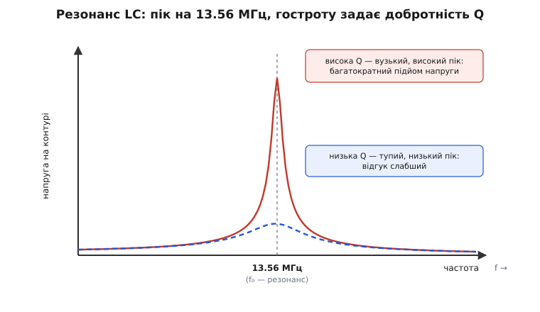
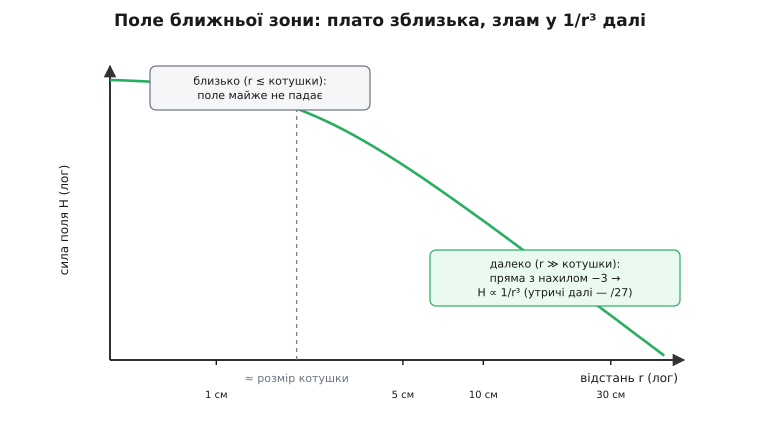
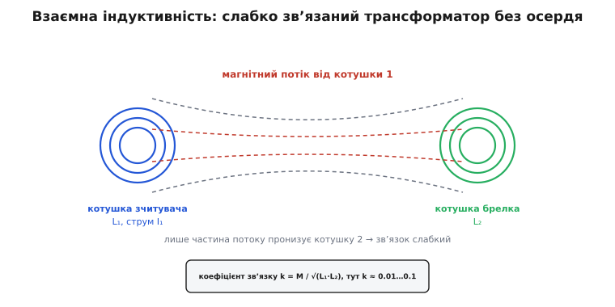

# 🧮 Фізика зв'язку: резонанс і поле мітки

Брелок без батарейки, який оживає за сантиметри від читача й віддає номер, змінюючи чуже поле, — це не магія, а чотири прості формули, зчеплені в один ланцюг. Індуктивність котушки задає, як сильно вона опирається змінному струмові. Разом із конденсатором вона дає резонанс — частоту, на якій контур відгукується найгучніше, і саме її підганяють під 13.56 МГц. Добротність контуру каже, у скільки разів на резонансі підскочить напруга — і чи вистачить її розбудити чип. Спадання поля ближньої зони як 1/r³ пояснює, чому «безконтактний» тут означає буквально «майже впритул». А коефіцієнт зв'язку двох котушок показує, чому це слабенький трансформатор, у якому губиться майже весь потік.

Розберемо кожну ланку від першопричини — не як формулу, яку треба запам'ятати, а як відповідь на конкретне «чому». Наприкінці ці чотири ланки складуться в одну картину, з якої стає видно всі практичні межі брелка: чому дальність сантиметрова, чому метал убиває зв'язок, чому мітку тюнингують саме конденсатором і звідки взялася дивна цифра 847.5 кГц.

## Індуктивність: чому котушка опирається змінному струмові

Почнімо з самого поняття, бо на ньому все стоїть. **Індуктивність** (від лат. *inductio* — «наведення») — це міра того, наскільки котушка чинить опір **зміні** струму крізь себе. Не струмові взагалі, а саме його зміні; постійному струмові ідеальна котушка не опирається зовсім.

Щоб відчути, чому так, простежмо ланцюг причин. Струм у витку створює навколо себе магнітне поле — це факт природи, з якого починається вся електротехніка. Що більший струм, то сильніше поле; якщо витків багато, їхні поля складаються, і поле в N разів сильніше. Тепер уявіть, що струм міняється. Тоді міняється й поле, а змінне магнітне поле, пронизуючи ті самі витки, за законом електромагнітної індукції наводить у них напругу. І — ключове — ця наведена напруга спрямована так, щоб **протидіяти зміні**, яка її породила (правило Ленца). Збільшуєте струм — котушка наводить напругу проти нього; зменшуєте — вона наводить напругу, щоб його підтримати. Котушка, по суті, чинить опір будь-якій спробі різко змінити струм крізь неї, як маховик чинить опір зміні обертів.

Кількісно цей зв'язок записують так:

```
U = L · (dI/dt)

U     — напруга на котушці, вольти (В)
L     — індуктивність, генрі (Гн)
dI/dt — швидкість зміни струму, ампери за секунду (А/с)
```

Читається просто: напруга на котушці пропорційна тому, **як швидко** міняється струм, а коефіцієнт пропорційності — це і є індуктивність L. Одиниця — **генрі** (на честь Джозефа Генрі, американського фізика, який відкрив самоіндукцію 1832 року, майже одночасно з Фарадеєм у Британії; це усталений історичний факт). Один генрі — це коли зміна струму на 1 ампер за секунду наводить 1 вольт. Для антен брелка генрі — величезна одиниця: реальні котушки мають одиниці **мікрогенрі** (мкГн, 10⁻⁶ Гн).

> 🔧 **Навіщо це.** Індуктивність антени брелка — не абстракція, а перше число, від якого танцює весь розрахунок. Саме воно разом з ємністю задає, на яку частоту налаштований контур. Помилилися з кількістю витків — зсунули індуктивність — і мітка резонує не на 13.56 МГц, а мимо, і читається погано або не читається взагалі. Тому виробник антен рахує L з геометрії рамки ще до того, як припаяти чип.

Від чого залежить сама L? Від геометрії котушки: кількості витків, площі рамки й того, як щільно витки намотані. Для практичних плоских рамок, які й малюють на брелках і картках, індуктивність росте **приблизно як квадрат кількості витків**: удвічі більше витків — приблизно вчетверо більша індуктивність. Причина знову в складанні полів: кожен виток і сам створює потік, і ловить потік усіх сусідніх, тож внесок росте швидше, ніж лінійно. Точні формули для прямокутної рамки громіздкі (їх беруть з довідників або рахують інженерними калькуляторами), але сам масштаб — «одиниці мікрогенрі, ростуть як N²» — треба тримати в голові, бо він одразу підказує, у який бік крутити, коли мітка не потрапляє в резонанс.

## Резонанс LC: частота, на якій контур відгукується найгучніше

Тепер додаймо до котушки конденсатор — і станеться найголовніше. Разом вони утворюють **коливальний контур** (англ. *LC circuit*, *tank circuit* — «резервуарний контур»), а в нього є одна виділена частота, на якій він поводиться зовсім інакше, ніж на всіх інших. Ця частота — **резонансна**, і саме її підганяють під 13.56 МГц.

Щоб зрозуміти, звідки вона береться, погляньмо на котушку й конденсатор як на двох антагоністів. Конденсатор запасає енергію в **електричному полі** між обкладками: заряджається, набирає напругу. Котушка запасає енергію в **магнітному полі**: розганяє струм. З'єднайте заряджений конденсатор із котушкою — і почнеться перекачування. Конденсатор розряджається крізь котушку, його енергія переливається в магнітне поле котушки; коли конденсатор спорожнів, увесь запас — у котушці, і струм максимальний. Але котушка не дає струмові спинитися різко (та сама індуктивність!), тож він тече далі й **перезаряджає конденсатор у зворотний бік**. Тоді все повторюється навпаки. Енергія гойдається туди-сюди між електричним полем конденсатора й магнітним полем котушки — точно як у маятнику вона переливається між висотою (потенційна) і швидкістю (кінетична).

І як у маятника є своя, власна частота гойдання, що залежить лише від його довжини, так і в контуру є **власна частота** цього перекачування, що залежить лише від L і C. Її дає **формула Томсона**:

```
f₀ = 1 / (2π · √(L·C))

f₀ — резонансна частота, герци (Гц)
L  — індуктивність котушки, генрі (Гн)
C  — ємність конденсатора, фаради (Ф)
π  — 3.14159…
```

Названа вона на честь Вільяма Томсона (лорда Кельвіна), британського фізика, який вивів її 1853 року, аналізуючи розряд лейденської банки крізь котушку — тобто рівно цей самий процес перекачування (усталений факт, підтверджений історією електротехніки). Формула коротка, але з неї видно все потрібне. Чим більші L або C, тим **нижча** частота — важчий «маятник» гойдається повільніше. Квадратний корінь означає, що вплив м'який: щоб подвоїти частоту, треба вчетверо зменшити добуток L·C.

**Налаштування на 13.56 МГц — це підбір C.** Ось у чому практична сила формули. Індуктивність L задана геометрією антени й міняти її незручно — це перемотувати котушку. А ось ємність C підібрати легко: поставив потрібний конденсатор — і контур сів на місце. Тому антену проєктують так: рахують L з геометрії, а тоді з формули Томсона знаходять, яка C дасть рівно 13.56 МГц. У найдешевших мітках цей конденсатор **вбудовано прямо в чип** — тому зовні лишається сама гола котушка на два виводи, а резонанс уже «зашитий» усередині.

> 🔧 **Навіщо це.** Резонанс — це причина, з якої брелок узагалі оживає. Поза резонансом наведена в котушці напруга мізерна, чипу не вистачить живлення. На резонансі контур відгукується в багато разів сильніше — і тільки тому енергії стає досить, щоб розбудити мітку за кілька сантиметрів. Уся дальність брелка тримається на тому, що його контур точно попав у частоту читача.

**Розрахунок-приклад: яку ємність поставити.**

Нехай антена брелка має індуктивність L = 3.0 мкГн, і треба посадити контур на f₀ = 13.56 МГц. З формули Томсона виражаємо C:

```
f₀ = 1 / (2π·√(L·C))   ⟹   C = 1 / ((2π·f₀)² · L)

крок 1 — кутова частота:
   2π·f₀ = 2 · 3.14159 · 13.56·10⁶ = 8.522·10⁷ рад/с

крок 2 — квадрат:
   (2π·f₀)² = (8.522·10⁷)² = 7.262·10¹⁵

крок 3 — ділимо на L:
   (2π·f₀)² · L = 7.262·10¹⁵ · 3.0·10⁻⁶ = 2.179·10¹⁰

крок 4 — обертаємо:
   C = 1 / 2.179·10¹⁰ = 4.59·10⁻¹¹ Ф = 45.9 пФ
```

Отже, до котушки 3 мкГн треба конденсатор близько **46 пФ** (пікофарад, 10⁻¹² Ф) — і контур сяде рівно на 13.56 МГц. Це цілком реальне число: типові тюнинг-конденсатори мітки — саме десятки пікофарад. Перевіримо зворотно: 3 мкГн і 46 пФ дають f₀ = 13.55 МГц — з точністю до заокруглення саме те, що треба. Якби антена мала більшу індуктивність, скажімо 4.7 мкГн, ємність вийшла б менша — близько 29 пФ; L і C завжди грають один проти одного, тримаючи добуток L·C сталим.

## Добротність Q: у скільки разів підскакує напруга

Резонанс пояснює, **на якій** частоті контур відгукується найсильніше. Але лишається кількісне питання: **наскільки** сильно? Відповідь дає **добротність** (англ. *quality factor*, звідси й позначення Q) — і саме вона вирішує, вистачить напруги розбудити чип чи ні.

Інтуїція така сама, як із розгойдуванням гойдалки. Ви штовхаєте гойдалку легенько, але точно в такт її власному ритму — і крихітні поштовхи, накопичуючись, розгойдують її до великої амплітуди. Що менше тертя (менше втрат за період), то вищої амплітуди ви досягнете тими самими поштовхами. Контур поводиться так само: на резонансі маленька збудна напруга, вкладена «в такт», накопичується у велику напругу на елементах контуру. У скільки разів велику — це і є Q. Формально:

```
Q = ω₀·L / R          (для послідовного контуру)

ω₀ = 2π·f₀  — кутова резонансна частота, рад/с
L           — індуктивність, Гн
R           — сумарний активний опір втрат контуру, Ом
```

Опір R тут — це всі втрати разом: опір самого дроту котушки, втрати в чипі-навантаженні, втрати на випромінювання. Що менші втрати, то вища Q, то гостріший і вищий пік. І головне для нас: **на резонансі напруга на котушці (і на конденсаторі) у Q разів більша за збудну**.

```
U_котушки ≈ Q · U_збудна
```

Ось де захована вся хитрість живлення. Наведена в антені напруга сама по собі може бути частки вольта — цього мало. Але контур із добротністю, скажімо, Q = 50 підніме її в п'ятдесят разів, і на конденсаторі вже кілька вольт — досить, щоб випрямляч зарядив накопичувальний конденсатор і чип ожив. **Резонанс дає частоту, добротність дає підсилення.** Без Q брелок би не працював навіть точно на 13.56 МГц.


*Резонансна крива контуру. По горизонталі — частота, по вертикалі — напруга на контурі. Гострий високий пік (висока Q) означає багатократний підйом напруги точно на f₀ — саме він живить чип. Тупий низький пік (низька Q) відгукується слабше й ловить ширшу смугу частот.*

Але в Q є **дві сторони медалі**, і в цьому вся інженерна тонкість брелка. Висока Q дає високу напругу — це добре для живлення. Проте висока Q означає ще й **вузьку смугу**: контур відгукується лише на частоти дуже близько до f₀, а трохи вбік — уже майже глухий. А мітці треба не тільки живитися на 13.56 МГц, а й **приймати дані**, які накладені на несучу як бічні смуги, зсунуті від неї на сотні кілогерц. Якщо смуга контуру вужча за ширину сигналу, бічні смуги «зрізаються», і дані спотворюються. Тому Q мітки не роблять як завгодно високою: беруть компроміс — досить високу, щоб вистачило живлення, але досить широку, щоб пройшли дані. Смуга контуру пов'язана з добротністю просто:

```
Δf ≈ f₀ / Q

Δf — ширина смуги (на рівні −3 дБ), Гц
```

При f₀ = 13.56 МГц і Q = 30 смуга виходить Δf ≈ 13.56·10⁶ / 30 ≈ 452 кГц — саме такого порядку, щоб пропустити бічні смуги навантажувальної модуляції (про них далі). Оце і є причина, чому реальні мітки мають Q десь у діапазоні від кількох десятків, а не сотні: сотня дала б чудове живлення й задушила б дані.

**Розрахунок-приклад: підйом напруги.**

Візьмімо ту саму котушку L = 3.0 мкГн на резонансі 13.56 МГц. Нехай сумарний опір втрат R = 5 Ом. Порахуймо добротність і підйом напруги:

```
крок 1 — реактивний опір котушки на резонансі:
   ω₀·L = 2π·f₀·L = 8.522·10⁷ · 3.0·10⁻⁶ = 255.6 Ом

крок 2 — добротність:
   Q = ω₀·L / R = 255.6 / 5 = 51.1

крок 3 — якщо наведена напруга U_збудна = 0.1 В,
   то на контурі:
   U_котушки ≈ Q · U_збудна = 51.1 · 0.1 = 5.1 В

крок 4 — ширина смуги контуру:
   Δf = f₀ / Q = 13.56·10⁶ / 51.1 ≈ 265 кГц
```

Тобто скромні 0.1 вольта, наведені полем, контур перетворює на 5 вольт на конденсаторі — з надлишком, щоб оживити чип. І одразу видно ціну: смуга всього 265 кГц — на межі того, щоб пропустити дані. Зменшили б R удвічі (кращий дріт) — Q підскочила б до сотні, напруга до 10 В, зате смуга впала б до 130 кГц і почала б зрізати сигнал. Оцей баланс «напруга проти смуги» інженер мітки тримає в руках, крутячи саме опір втрат і зв'язок з чипом.

> Резонанс, добротність і поведінка контуру під навантаженням — це загальна тема електроніки, не лише RFID. Її основи, з тими самими формулами й інтуїцією маятника, розібрано окремо: [Резонанс коливального контуру](topic:electronics/lc-resonance).

## Спадання поля ближньої зони: чому дальність сантиметрова

Тепер — до найважливішого практичного наслідку, який визначає весь характер брелка: **чому дальність — сантиметри, а не метри**. Відповідь у тому, як швидко слабшає магнітне поле, коли віддаляєшся від котушки читача. І тут криється тонкість, повз яку часто проходять: спадання не просто «швидке», воно різко міняє свій закон, коли ви відходите далі за розмір самої котушки.

Розгляньмо поле на осі кругового витка — це рівно та вісь, уздовж якої ви підносите брелок до читача. Точна формула для сили поля H на відстані r від центра витка радіуса a така:

```
H(r) = (N·I·a²) / (2·(a² + r²)^(3/2))

H — сила магнітного поля, ампери на метр (А/м)
N — кількість витків котушки читача
I — струм у котушці, ампери (А)
a — радіус котушки читача, метри (м)
r — відстань уздовж осі від центра котушки, метри (м)
```

Формула на вигляд неприємна, але вся суть — у знаменнику, у виразі (a² + r²)^(3/2). Погляньмо, що з ним діється у **двох крайніх випадках**, — і одразу все проясниться.

**Зблизька, коли r набагато менше за a** (брелок майже впритул до читача, ближче за розмір котушки). Тоді r² мізерне проти a², і знаменник майже не залежить від r — він приблизно (a²)^(3/2) = a³. Поле майже не міняється: H ≈ N·I / (2a), сталина. Це **плато**: поки ви ворушите брелок у зоні, меншій за котушку, сила поля майже не падає. Ось чому впритул мітка читається впевнено й майже байдуже до точної відстані.

**Здалеку, коли r набагато більше за a** (брелок далі, ніж розмір котушки). Тоді вже a² мізерне проти r², і знаменник ≈ (r²)^(3/2) = r³. Формула вироджується в разюче просте:

```
H(r) ≈ (N·I·a²) / (2·r³)     (для r ≫ a)
```

Тобто поле спадає **як 1/r³** — обернено пропорційно **кубу** відстані. Це і є знаменитий закон ближньої зони магнітного диполя. І він нещадний. Утричі далі — поле слабше не втричі, а в 3³ = **27 разів**. Уп'ятеро далі — у 125 разів. Це падіння куди крутіше, ніж у радіохвиль далекої зони, які спадають лише як 1/r (за силою). Магнітне поле котушки просто не встигає «долетіти» далеко: воно замикається саме на собі поблизу котушки, а не відривається й летить хвилею.


*Спадання поля на осі котушки в подвійному логарифмічному масштабі. Зблизька (r менше за розмір котушки) — плато: поле майже не падає. За розміром котушки — злам, і далі поле йде прямою з нахилом −3, тобто H ∝ 1/r³: утричі далі означає у 27 разів слабше. Через це «безконтактний» брелок працює лише за сантиметри.*

Ось звідки сантиметрова дальність, без жодної містики. Мітці треба певна мінімальна сила поля, щоб її контур навів досить напруги (стандарт ISO/IEC 14443 задає для картки розміру ID-1 робочий діапазон від H_min = 1.5 А/м до H_max = 7.5 А/м — це підтверджене значення зі специфікації). Поблизу котушки поля вдосталь. Але щойно відстань переростає розмір котушки, поле провалюється як куб — і дуже швидко падає нижче порога. Котушка читача радіусом кілька сантиметрів створює робоче поле лише на кілька сантиметрів навколо себе; далі — стрімке провалля. Збільшити дальність можна тільки збільшивши котушку (більше a — далі відсувається злам) або піднявши струм I, але куб у знаменнику завжди переможе: удвічі далі коштує у 8 разів більше поля.

**Розрахунок-приклад: як провалюється поле.**

Нехай котушка читача радіусом a = 2 см = 0.02 м, один виток (N = 1), струм I = 0.5 А. Порахуймо поле на кількох відстанях:

```
формула: H = N·I·a² / (2·(a² + r²)^(3/2)),  a² = 4·10⁻⁴ м²

r = 1 см (0.01 м):
   a²+r² = 4·10⁻⁴ + 1·10⁻⁴ = 5·10⁻⁴
   (5·10⁻⁴)^1.5 = 1.118·10⁻⁵
   H = 0.5·4·10⁻⁴ / (2·1.118·10⁻⁵) = 8.9 А/м   ← вище порога, читається

r = 2 см (= радіусу котушки):
   a²+r² = 8·10⁻⁴,  (·)^1.5 = 2.263·10⁻⁵
   H = 2·10⁻⁴ / (4.526·10⁻⁵) = 4.4 А/м         ← ще в межах

r = 5 см:
   a²+r² = 2.9·10⁻³,  (·)^1.5 = 1.562·10⁻⁴
   H = 2·10⁻⁴ / (3.124·10⁻⁴) = 0.64 А/м        ← нижче порога, вже не тягне

r = 10 см:
   a²+r² = 1.04·10⁻²,  (·)^1.5 = 1.061·10⁻³
   H = 2·10⁻⁴ / (2.121·10⁻³) = 0.094 А/м       ← у ~7 разів слабше, ніж на 5 см
```

Числа промовисті. Від 5 см до 10 см — рівно вдвічі далі — поле впало з 0.64 до 0.094 А/м, тобто приблизно в **7 разів** (близько до 2³ = 8, різниця бо ми ще не зовсім у чистій зоні 1/r³). Поріг живлення десь тут і проходить, тому ця мітка на цій котушці впевнено читається до кількох сантиметрів і глухне далі. Хочете вдвічі більшу дальність — готуйте на порядок сильніше поле; куб у знаменнику диктує ціну.

> 🔧 **Навіщо це.** Із закону 1/r³ прямо випливають усі «дивацтва» брелка на практиці. Дальність принципово сантиметрова — це не недоробка, а фізика ближнього поля. Металева поверхня під міткою вбиває зв'язок, бо в суцільному металі змінне поле наводить вихрові струми, а ті створюють зустрічне поле, яке гасить основне саме там, де мітці треба живитися. І орієнтація важить: сила поля рахується від потоку **крізь площину** котушки, тож коли мітка стоїть ребром до поля, потоку крізь неї майже нема — зв'язок провалюється. Усе це — прямі наслідки того, що працює магнітне поле ближньої зони, а не радіохвиля.

## Взаємна індуктивність і коефіцієнт зв'язку: слабкий трансформатор

Ми говорили про поле котушки читача так, ніби брелок на нього не впливає. Насправді ж дві котушки — читача й мітки — пов'язані в єдину систему, і саме характер цього зв'язку пояснює і живлення, і те, як мітка відповідає. Формальна назва цього зв'язку — **взаємна індуктивність**.

Ідея пряма. Змінний струм у котушці читача (L₁) створює змінний магнітний потік. Частина цього потоку пронизує котушку мітки (L₂) і за законом індукції наводить у ній напругу — це і є живлення. Наскільки сильно потік однієї котушки «зачіпає» іншу, міряють **взаємною індуктивністю** M:

```
U₂ = M · (dI₁/dt)

U₂ — напруга, наведена в котушці мітки, В
M  — взаємна індуктивність, генрі (Гн)
dI₁/dt — швидкість зміни струму в котушці читача, А/с
```

Формула-близнючка тієї, з якої ми починали (U = L·dI/dt), тільки тепер напруга наводиться **в сусідній** котушці, а коефіцієнт — взаємна індуктивність M замість власної L. По суті, читач і мітка — це **трансформатор**: первинна обмотка (читач) наводить напругу у вторинній (мітка) через спільне магнітне поле. Тільки трансформатор дуже незвичний — **без залізного осердя** і з обмотками, що просто висять у повітрі на сантиметрах одна від одної.

Наскільки це «добрий» трансформатор, каже безрозмірне число — **коефіцієнт зв'язку** k:

```
k = M / √(L₁·L₂)

k  — коефіцієнт зв'язку, від 0 до 1 (безрозмірний)
M  — взаємна індуктивність, Гн
L₁, L₂ — власні індуктивності котушок, Гн
```

Зміст k — це **частка потоку однієї котушки, що доходить до другої**. Якби весь потік читача пронизував мітку, було б k = 1 (ідеальний трансформатор, як на спільному осерді). Якби жоден силовий лінія не зачіпала мітку — k = 0. У силового трансформатора з залізним осердям k близький до одиниці: осердя збирає майже весь потік і веде його у вторинну обмотку. А ось у пари читач–мітка осердя немає, котушки далеко, і потік читача розходиться на всі боки, лише крихітною часткою потрапляючи в мітку. Тому тут **k дуже мале** — типово від сотих до десятих часток (приблизно 0.01…0.1). Це і є **слабко зв'язаний трансформатор**: майже весь потік губиться повз мітку, і лише крапля йде на живлення.


*Дві котушки як трансформатор без осердя. Потік котушки читача (L₁) розходиться широко, і лише частина силових ліній пронизує котушку брелка (L₂). Частка спільного потоку — це коефіцієнт зв'язку k = M/√(L₁·L₂); без осердя і на відстані він малий, тому зв'язок слабкий.*

І тут — найкрасивіше: **той самий слабкий зв'язок працює в обидва боки**. Мітка не лише бере енергію з поля читача — вона й сама впливає назад на котушку читача, бо взаємна індуктивність симетрична (M однакова в обидва боки). Коли чип мітки то під'єднує, то від'єднує додаткове навантаження до своєї котушки, він міняє струм у ній, а через взаємну індуктивність це **віддзеркалюється в котушці читача**: у неї трохи стрибає струм. Читач це відчуває на власній обмотці — і саме так «чує» відповідь мітки. Це і є **навантажувальна модуляція**: мітка не випромінює нічого свого, вона лише ледь помітно смикає спільне поле, а читач читає це на своїй котушці, як віддалене відлуння власного сигналу.

Величину цього відлуння теж можна оцінити. Відбитий у котушку читача опір від навантаженої мітки пропорційний **квадрату** взаємної індуктивності — грубо, ефект іде як k². А оскільки k і само мале (соті-десяті частки), його квадрат — крихітний. Тому сигнал відповіді від мітки — це мікроскопічна зміна на тлі потужного власного поля читача: однопроцентні, а то й частки процента коливання. Витягнути такий слабкий сигнал з-під власного гучного поля — окреме інженерне мистецтво, і саме заради нього придумано трюк із піднесеною частотою, до якого ми переходимо.

## Піднесена частота 847.5 кГц: чому саме 13.56/16

Лишилася остання цифра, і вона спершу здається довільною: мітка модулює свою відповідь не на самій частоті 13.56 МГц, а на **піднесеній частоті** (англ. *subcarrier* — «підносійна») рівно **847.5 кГц**. Звідки таке дивне число? Воно не випадкове ні на йоту — це рівно **одна шістнадцята** несучої:

```
f_підн = f_несуча / 16 = 13.56 МГц / 16 = 0.8475 МГц = 847.5 кГц
```

Перевірка проста: 13.56 / 16 = 0.8475, тобто 847.5 кГц точно (це закріплено в стандарті ISO/IEC 14443, де відповідь мітки типу A йде BPSK-модуляцією саме на піднесеній 847.5 кГц зі швидкістю даних 106 кбіт/с — підтверджений факт зі специфікації). Тепер розберімо два «чому»: чому взагалі піднесена частота, і чому саме ділення на 16.

**Чому не модулювати прямо на 13.56 МГц?** Бо тоді слабенький сигнал мітки потонув би точно там, де реве власне поле читача. Уявіть, що вам треба розчути шепіт рівно на тій частоті, на якій поруч гримить гучномовець, — марна справа. Але якщо шепотіти на помітно іншій ноті, гучномовець можна відфільтрувати, а шепіт лишити. Піднесена частота робить саме це: мітка накладає свою відповідь на допоміжне коливання 847.5 кГц, і в спектрі це створює **бічні смуги** — два супутники обабіч несучої, зсунуті від неї рівно на 847.5 кГц (на 12.71 МГц і 14.41 МГц). Читач відкидає потужну несучу в центрі й слухає лише ці бічні смуги, де сидить корисний сигнал. Смикання поля на власній частоті було б невіддільним від самого поля; смикання, зсунуте на 847.5 кГц, легко відокремити фільтром.

**Чому саме ділення на 16, а не якесь кругле число?** Тут інженерна ощадливість. У мітки немає власного кварцу чи генератора — узагалі нічого свого, крім енергії, вкраденої з поля. Але в неї **вже є** одне точне коливання — сама несуча 13.56 МГц, яку вона ловить з поля читача. Найпростіший спосіб отримати з неї стабільну піднесену — просто **поділити частоту** ланцюжком тригерів. Кожен тригер ділить частоту навпіл; чотири тригери поспіль ділять на 2⁴ = 16. Це кілька транзисторів, копійчана логіка, і — головне — піднесена виходить **жорстко прив'язаною** до несучої, без жодного окремого генератора. Ділення на степінь двійки — найдешевше, що взагалі можна зробити в цифровій логіці. Тому 16, а не 15 чи 20: степінь двійки дається дільником-лічильником задарма.

```
несуча 13.56 МГц  →  [÷2] → [÷2] → [÷2] → [÷2]  →  847.5 кГц
                     чотири тригери, ділення на 2⁴ = 16
                     жодного власного генератора — усе з поля читача
```

Заодно 847.5 кГц — вдалий вибір і за смугою. Пригадаймо: контур мітки має скінченну ширину смуги Δf ≈ f₀/Q, порядку кількох сотень кілогерц. Бічні смуги, зсунуті на 847.5 кГц, мусять пройти крізь цю смугу, щоб читач їх узагалі побачив. Частота 847.5 кГц лягає так, щоб і бути надійно відділеною від несучої (не тонути в ній), і не відлетіти надто далеко за край смуги контуру. Це компроміс: досить далеко, щоб фільтрувати, досить близько, щоб контур пропустив. Оце поєднання — «дешево поділити на 16» плюс «зручно лягає в смугу» — і зафіксувало 847.5 кГц у стандарті.

> 🔧 **Навіщо це.** Ця цифра пов'язує всю фізику докупи. Піднесена 847.5 кГц існує, бо зв'язок слабкий (k мале, відповідь мітки крихітна) — і сигнал доводиться відсувати від несучої, щоб узагалі витягти. Вона дорівнює 13.56/16, бо мітка без власного генератора може лише поділити несучу дешевим ланцюжком тригерів. А працює це все, бо контур мітки має досить широку смугу, щоб пропустити бічні смуги, — і ось чому Q не роблять надто високою. Резонанс, добротність, слабкий зв'язок і піднесена частота — не чотири окремі факти, а одна зчеплена машина.

## Як чотири ланки складаються в одну картину

Тепер видно весь ланцюг, від початку й до кінця, і кожна ланка тримає наступну.

**Індуктивність** антени, задана її геометрією, — це відправна точка: одиниці мікрогенрі, що ростуть як квадрат кількості витків. Вона визначає, скільки котушка запасе в магнітному полі й наскільки опиратиметься зміні струму.

**Резонанс** народжується, коли до цієї індуктивності додають ємність: формула Томсона f₀ = 1/(2π√(LC)) дає частоту, на якій контур відгукується найгучніше. Її підганяють під 13.56 МГц підбором конденсатора — найдешевшої з двох величин. Поза резонансом наведеної напруги мало; на резонансі контур оживає.

**Добротність** Q каже, у скільки разів на резонансі підскочить напруга — і саме цей підйом (у десятки разів) перетворює частки вольта, наведені полем, на кілька вольт, достатніх розбудити чип. Але Q не роблять надто високою, бо вузька смуга задушила б дані.

**Спадання поля** як 1/r³ у ближній зоні пояснює, чому все це працює лише за сантиметри: за розміром котушки поле провалюється як куб відстані, дуже швидко падаючи нижче порога живлення. Звідси й сантиметрова дальність, і ворожість металу, і роль орієнтації.

**Взаємна індуктивність** пов'язує читача й мітку в слабенький трансформатор без осердя з малим коефіцієнтом зв'язку k. Через цей самий зв'язок мітка й живиться, і відповідає — навантажувальною модуляцією, ледь смикаючи спільне поле.

**Піднесена частота** 847.5 кГц = 13.56/16 витягує цю крихітну відповідь з-під гучної несучої, відсуваючи її вбік у бічні смуги, — і дається задарма діленням несучої на 16 дешевим ланцюжком тригерів.

Оце і є вся фізика брелка на 13.56 МГц: котушка з конденсатором, посаджені в резонанс, з добротністю, що піднімає напругу, у слабкому магнітному зв'язку, який швидко провалюється з відстанню, а відповідь відсунута на шістнадцяту частку несучої. Жодної батарейки, жодного передавача — самі поля, індуктивності й одна степінь двійки. Тримаючи цей ланцюг у голові, ви поясните будь-яку поведінку будь-якої пасивної мітки цього діапазону — від того, чому вона читається лише впритул, до того, звідки в даташиті взялися саме ці мікрогенрі й пікофаради.
