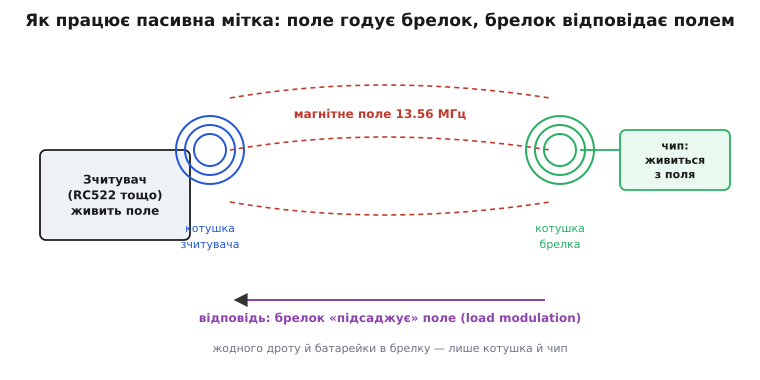
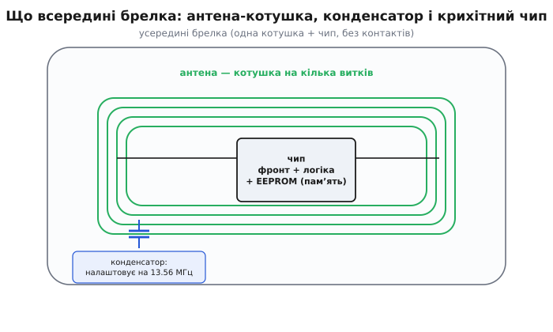
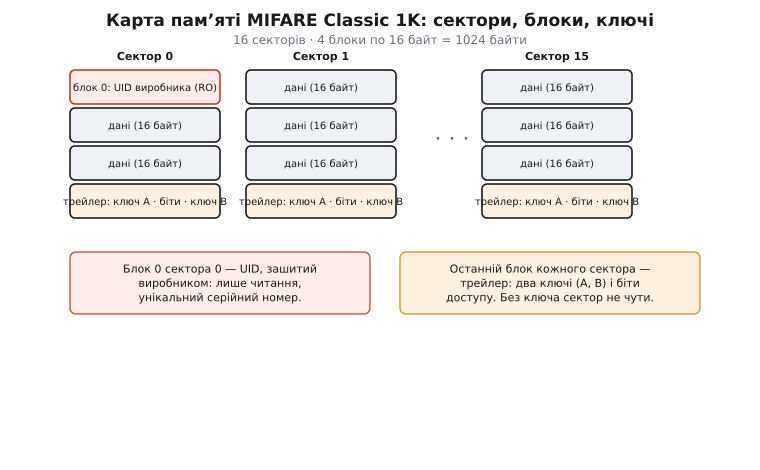

# RFID-брелок (13.56 МГц)

<preknowlist>
- [Магнітне поле](book:physics/magnetic-field) — рухомий заряд (струм) породжує навколо себе магнітне поле; змінний струм — змінне поле.
- [Електромагнітна індукція](book:physics/electromagnetic-induction) — змінне магнітне поле крізь виток наводить у ньому напругу; на цьому тримається все живлення брелка.
- [Резонанс коливального контуру](book:electronics/lc-resonance) — котушка з конденсатором мають частоту, на якій відгукуються найсильніше; брелок налаштовують саме так.
- [Біти й байти](book:programming/bits-bytes-endianness) — байт, шістнадцятковий запис; памʼять брелка й UID читаються в байтах і hex.
</preknowlist>

Це та сама пластикова крапля на ключах, якою ви прикладаєтеся до дверей гуртожитку, до турнікета чи до кавомашини. Усередині — ні батарейки, ні контактів, ні кнопки: лише плаский виток дроту по колу й крихітний чип завбільшки з макове зерня, залитий у пластик. Брелок нічого не робить сам по собі; він мертвий, доки не потрапить у поле зчитувача. Але щойно ви піднесли його на сантиметри до котушки читача — той самим своїм полем **вливає** в брелок енергію, будить чип, і за частки секунди брелок віддає назад свій унікальний номер. Уся хитрість — у тому, як передати живлення й дані без жодного дроту, самим лише магнітним полем, і як у чипі без власного струму взагалі зберігається памʼять.

Розберемо саме цю річ: що вона таке, чому працює без батарейки, який усередині чип і памʼять, чим відрізняється брелок за 20 центів від брелка, який неможливо скопіювати, і як його читати та писати з коду.

> 🔧 **Навіщо це знати.** Брелок — не «чорна скринька-пропуск», а конкретний чип із конкретною памʼяттю і конкретним захистом (або без нього). Від того, який саме чип у вашому брелку — дешевий MIFARE Classic чи щось серйозніше, — залежить, чи скопіює ваш пропуск будь-хто за долар китайським «магічним» брелком, чи ні. Не розуміючи, що всередині, ви не побудуєте ні надійного контролю доступу, ні захищеної системи лояльності.

## Що це за річ і що з нею плутають

«RFID-брелок на 13.56 МГц» — це **пасивна мітка** (англ. *tag* — «бирка, ярлик»; *transponder* — від *transmitter* + *responder*, «передавач-відповідач»), тобто радіочастотний ідентифікатор, який не має власного живлення й відповідає лише тоді, коли його опромінює зчитувач. Форма — байдужа: та сама начинка буває краплею-брелком, тонкою карткою-перепусткою, наліпкою, вкладкою в браслет або навіть скляною капсулою під шкіру. Нас цікавить не корпус, а те, що в ньому: **котушка-антена й чип**.

Тут одразу троє джерел плутанини, і кожне варте того, щоб розвести його з самого початку.

**Перше — частота.** «RFID» — це не одна технологія, а ціле сімейство на різних частотах, і вони між собою **несумісні**. Низькочастотні мітки (LF, 125–134 кГц — старі брелки EM4100, чипи тварин) працюють на зовсім інакшому принципі й на іншому «залізі». Наш герой — **високочастотна** мітка (HF, рівно **13.56 МГц**): саме на цій частоті стоїть майже вся сучасна безконтактна ідентифікація ближньої дії. Ще вище — ультрависокочастотні мітки (UHF, 860–960 МГц) для складської логістики, що б'ють на метри, але вже зовсім іншою фізикою. Брелок на 125 кГц і брелок на 13.56 МГц зовні однакові, а зчитувач одного **не побачить** іншого взагалі.

**Друге — «а це RFID чи NFC?».** NFC (англ. *Near-Field Communication* — «звʼязок ближнього поля») — це **не окрема технологія проти RFID, а підмножина того самого 13.56 МГц**, узгоджена так, щоб пристрої могли не лише читати мітки, а й розмовляти один з одним. Ваш телефон з NFC — це, по суті, зчитувач 13.56 МГц у кишені; він читає ті самі мітки, що й окремий читач. Тож правильна відповідь на «RFID чи NFC» — «і те, і те»: більшість брелків на 13.56 МГц — це водночас і RFID-мітки, і NFC-теги, залежно від того, хто до них звертається.

**Третє — «який чип?».** Ось де ховається головне. Під однаковими на вигляд брелками на 13.56 МГц лежать **зовсім різні чипи** з різною памʼяттю й різним захистом. Найпоширеніший — родина **MIFARE** від NXP: дешевий **MIFARE Classic** (той самий, що в мільярдах перепусток і транспортних квитків), простенький **MIFARE Ultralight** (разові квитки), захищений **MIFARE DESFire**; окремо — **NTAG** (NFC-наліпки для смартфонів). Усі — на 13.56 МГц, усі за стандартом ISO/IEC 14443 Type A, але з абсолютно різними властивостями. Купуючи «RFID-брелок», ви насправді купуєте **конкретний чип** — і саме він вирішує все.

> Зчитувач, до якого прикладають брелок, — окрема плата зі своїм чипом, антеною й шиною до мікроконтролера. Найпоширеніший аматорський — модуль на чипі MFRC522: він жене поле, живить мітку, веде з нею діалог за ISO 14443A і кладе вам готовий UID та вміст блоків. Пристрій, розводку й код читача — у статті [RFID-RC522 — зчитувач 13.56 МГц](book:connect/rfid-rc522).

## Чому брелок працює без батарейки

Це найкрасивіша частина, і варто зрозуміти її від першопричини, бо на ній тримається геть усе інше.

Уявіть дві котушки дроту поруч. Пустіть через першу **змінний струм** — навколо неї виникне **змінне магнітне поле**. Якщо друга котушка опиниться в цьому полі, змінне поле, пронизуючи її витки, **наведе в ній напругу** — це закон електромагнітної індукції, той самий, що крутить усі трансформатори світу. Дротів між котушками немає, а струм у другій — з'являється. Саме це відбувається між зчитувачем і брелком: **дві котушки, що працюють як трансформатор без осердя**, тільки слабко зв'язаний (котушки ж не намотані на одне залізо, а просто висять у повітрі на сантиметрах одна від одної).


*Пасивна мітка як слабко зв'язаний трансформатор. Зчитувач жене змінне поле на 13.56 МГц; котушка брелка ловить його, наведена напруга живить чип. Відповідає брелок не власним передавачем, а тим, що змінює своє навантаження на поле — читач це «відчуває» на своїй котушці.*

Отже, зчитувач безперервно жене в ефір потужне змінне магнітне поле на 13.56 МГц зі своєї котушки. Брелок підносять у це поле — його котушка ловить наведену напругу. Далі крихітний **випрямляч** усередині чипа перетворює цю змінну напругу на постійну, накопичує її на маленькому конденсаторі — і ось у чипа з'явилося живлення. Жодної батарейки: **брелок живиться прямо з поля читача**, буквально краде енергію з магнітного поля, поки перебуває в ньому. Забрали брелок з поля — за мить конденсатор розрядився, чип згас, памʼять «заснула». Тому такі мітки й звуть **пасивними**: власного джерела в них немає взагалі.

Тут ключ — **резонанс**. Наведена напруга була б мізерною, якби котушка брелка просто висіла в полі. Тому котушку **навмисно налаштовують** у резонанс рівно на 13.56 МГц: до неї підбирають конденсатор так, щоб коливальний контур «котушка + конденсатор» мав власну частоту точно цю. На резонансі відгук контуру різко зростає — напруга на ньому підскакує в багато разів, і енергії стає достатньо, щоб оживити чип навіть за кілька сантиметрів. Це та сама причина, чому гойдалку розгойдують поштовхами в такт: у резонанс вкладена крихітна енергія накопичується в велику амплітуду.

> Скільки саме витків, яка ємність конденсатора й чому виходить якраз кілька сантиметрів дальності — це виведення через індуктивність котушки, формулу резонансу та закон спадання магнітного поля. Математику зв'язку котушок і резонансного налаштування розібрано окремо: [Фізика зв'язку: резонанс і поле мітки](book:connect/rfid-tag/math-coupling.md).

А **як брелок відповідає**? Ось друга хитрість, і вона неочевидна. Власного передавача, щоб «крикнути» номер назад, у брелка немає — енергії ледь вистачає на сам чип. Тому брелок відповідає **не випромінюванням, а поглинанням**: він то під'єднує, то від'єднує додаткове навантаження до своєї котушки в такт своїм даним. Коли брелок «підсаджує» своє навантаження, він трохи сильніше просаджує спільне поле — а зчитувач, який це поле й тримає, **відчуває цю мікроскопічну зміну на власній котушці** (у неї трохи стрибає струм). Це називають **навантажувальною модуляцією** (англ. *load modulation*). Брелок не говорить — він **ледь помітно смикає поле читача**, а читач читає власне поле, як азбуку Морзе. Щоб ці смикання було легше вирізнити, брелок робить їх не на самій частоті 13.56 МГц, а на допоміжній піднесеній частоті **847.5 кГц** — рівно одна шістнадцята від несучої (13.56 / 16 = 0.8475 МГц).

> 🔧 **Навіщо це знати.** З цього принципу прямо випливають усі практичні межі брелка. Дальність — **сантиметри, не метри**: магнітне поле ближньої зони спадає катастрофічно швидко (∝ 1/r³ — утричі далі означає у 27 разів слабше), тому «безконтактний» тут означає буквально «майже впритул». Металева поверхня під брелком **вбиває** зв'язок: у суцільному металі поле наводить вихрові струми, які глушать поле мітки, — тому брелок за металевим корпусом телефона або на сталевих дверях може не читатися. І орієнтація має значення: якщо площина котушки брелка стоїть **ребром** до котушки читача, крізь неї проходить менше поля — зв'язок слабшає. Усе це не примхи, а прямий наслідок того, що працює тут магнітне поле, а не радіохвиля.

## Що всередині брелка

Начинка вражає простотою: по суті, це **лише антена-котушка й один чип**, з'єднані двома точками. Жодної плати з деталями, жодної обв'язки — усе інтегроване.


*Начинка брелка. Антена — виток дроту (кілька витків) по всьому периметру: що більша площа, то більше зловленого поля. Конденсатор налаштовує контур у резонанс на 13.56 МГц. Чип містить усе: випрямляч живлення, радіочастотний фронт, логіку протоколу й енергонезалежну памʼять.*

**Антена — це витки по периметру.** Що більша площа рамки й що більше витків, то більше магнітного потоку вона ловить і то більша наведена напруга — тому антену роблять на весь корпус брелка чи картки. У найдешевших мітках конденсатор резонансу вбудований прямо в чип, і зовні лишається сама гола котушка на два виводи; у точніших — окремий конденсатор поруч.

**Чип — це вся електроніка в одній піщинці.** Він розміром із частку міліметра й містить чотири речі одразу: **випрямляч** (робить постійне живлення з наведеної змінної напруги), **радіочастотний фронт** (ловить команди зі змін поля й формує відповідь навантажувальною модуляцією), **цифрову логіку** (розуміє протокол ISO 14443, перевіряє ключі, рахує контрольні суми) і **енергонезалежну памʼять** — EEPROM, де лежать UID і дані. Слово «енергонезалежна» тут критичне: памʼять **тримає запис і без живлення**, роками, бо брелок живе спалахами по частці секунди. Записали новий баланс на транспортну картку — і він лишається, хоча за мить чип згас.

Ось чому брелок такий дешевий і невмирущий: **немає батарейки, яка сяде; немає контактів, які окисляться; немає рухомих частин**. Пластик можна прати, гнути, носити роками — доки ціла котушка й ціла крапля чипа, брелок працює. Єдине, що його вбиває, — фізичний злам котушки або пробій чипа сильним полем.

## Памʼять і чому один брелок клонується, а інший — ні

Отут брелки, однакові зовні, розходяться найдужче. Уся різниця — у **чипі та його памʼяті**, і саме вона вирішує, захищений ваш пропуск чи ні. Розберемо на найпоширенішому — **MIFARE Classic 1K**, бо це той самий чип, що в переважній більшості дешевих перепусток і брелків.

**Історія тут коротка, але повчальна.** MIFARE розробила не якась велика корпорація, а австрійська фірма **Mikron** у містечку Ґраткорн (Gratkorn) поблизу Ґраца; чип MIFARE Classic з памʼяттю 1 КБ вона випустила **1994 року**. За рік, **1995-го**, Mikron купила Philips, а вже з Philips 2006 року виокремилася **NXP Semiconductors** — нинішній власник марки. Тобто «MIFARE» — це **австрійський винахід**, комерціалізований голландським Philips; жодного стосунку до пізніших спроб приписати цю технологію іншим країнам він не має. Це усталений факт, підтверджений документацією NXP.

> Найцікавіше в MIFARE — не як він народився, а як його **зламали**: власний шифр CRYPTO1, на якому трималися мільярди перепусток, у 2007–2008 роках розкрили дослідники, зіскоблюючи чип шар за шаром під мікроскопом. Хто, як саме, і чому це назавжди змінило контроль доступу — окрема історія: [Як зламали MIFARE Classic](book:connect/rfid-tag/hist-mifare-crypto1.md).

**Як улаштована памʼять MIFARE Classic 1K.** Тисяча з чимось байтів (рівно 1024) поділені на **16 секторів**, кожен сектор — на **4 блоки** по **16 байтів**. Проста арифметика: 16 × 4 × 16 = 1024 байти. Але не всі вони ваші для запису.


*Карта памʼяті MIFARE Classic 1K. Найперший блок (блок 0 сектора 0) зашитий на заводі — це UID, лише читання. Останній блок кожного сектора — трейлер: два секретні ключі (A і B) та біти доступу; без правильного ключа сектор не віддає й не приймає даних. Решта блоків — під ваші дані.*

Два блоки в цій карті особливі.

**Блок 0 сектора 0 — це UID** (англ. *Unique Identifier* — «унікальний ідентифікатор»), зашитий виробником незмінно, **лише для читання**. Це той серійний номер, який брелок віддає найпершим, ще до всякої автентифікації. У MIFARE Classic він зазвичай **4 байти** (є й версії на 7 байтів). Найпростіші системи доступу тільки його й перевіряють: «чи є цей UID у білому списку?» — і все.

**Останній блок кожного сектора — це трейлер** (англ. *sector trailer* — «кінцевик сектора»). У ньому лежать **два секретні ключі — A і B** (по 6 байтів) та **біти доступу**, що визначають, який ключ що дозволяє. Логіка захисту проста й міцна: **щоб прочитати чи записати блоки сектора, треба спершу довести знання ключа цього сектора**. Не знаєш ключа — сектор для тебе німий. Кожен сектор має власну пару ключів, тож можна одні дані відкрити всім, а інші замкнути.

Ось тепер видно, **чому один брелок клонується, а інший — ні** — і це найважливіший практичний висновок усієї теми.

**Якщо ваша система перевіряє тільки UID** — вона беззахисна. UID не секрет: його віддає кожен брелок відкрито, без жодного ключа, будь-якому зчитувачу. І в продажу є **«магічні» брелки** (китайські gen1a/gen2), у яких блок 0, усупереч правилам, **перезаписуваний** — на них можна записати чужий UID. Прочитав UID вашого пропуску дешевим читачем за пів секунди, записав на магічний брелок — і клон готовий. Тому контроль доступу «за одним лише UID» ламається будь-ким за долар.

**Якщо система читає дані із захищеного ключем сектора** — планка вже вища, але й тут MIFARE Classic зрадливий: його шифр CRYPTO1 давно зламано, і ключі з картки дістають за хвилини спеціальним обладнанням (Proxmark, Flipper Zero). Тому **для чогось справді важливого (гроші, серйозний доступ) MIFARE Classic не годиться взагалі** — беруть чипи з нормальною криптографією (MIFARE DESFire на AES, або сучасніші рішення).

> 🔧 **Навіщо це знати.** Це та практична різниця, через яку варто взагалі розуміти памʼять брелка. Робите систему на MIFARE Classic — знайте, що вона легко клонується, і не покладайтеся на неї там, де ціна злому висока. Потрібна лояльність-картка чи облік — Classic згодиться (підробка не варта заходу). Потрібен захищений доступ чи гаманець — беріть DESFire або тримайте перевірку на боці сервера, а не в брелку. Вибір чипа тут — не деталь, а рішення про безпеку всієї системи.

## Різновиди чипів — короткий орієнтир

Щоб упізнати, що саме потрапило вам у руки, ось найпоширеніші чипи на 13.56 МГц. Усі — ISO 14443 Type A, усі читаються тим самим зчитувачем, але по-різному влаштовані.

```
Чип                Памʼять    Захист              Типове застосування
──────────────────────────────────────────────────────────────────────────
MIFARE Classic 1K  1024 Б     CRYPTO1 (зламаний)  перепустки, брелки, квитки
MIFARE Classic 4K  4096 Б     CRYPTO1 (зламаний)  те саме, більше даних
MIFARE Ultralight  64 Б       без шифру, лок-біти разові квитки, метро
MIFARE DESFire     2–8 КБ     AES / 3DES          банк-доступ, транспорт, оплата
NTAG213/215/216    144/504/888 Б  без шифру, підпис NFC-наліпки для смартфонів
```

Кілька орієнтирів, як не помилитися з вибором.

**MIFARE Classic 1K/4K** — робоча конячка дешевих систем: багато памʼяті, копійчана ціна, море бібліотек. Але захист **зламаний** — тільки для некритичного (облік, лояльність, доступ низької цінності).

**MIFARE Ultralight** — навмисно спрощений і **без шифру**: 64 байти, замість ключів — одноразові біти, які можна лише «пропалити» в одному напрямку. Тому він для **разових** речей — квиток на метро, що дійсний одну поїздку: підробити можна, але сенсу нема.

**MIFARE DESFire** — це вже серйозно: нормальна криптографія (AES), файлова структура памʼяті, взаємна автентифікація. Саме його беруть, коли на кону гроші або справжня безпека, — сучасні транспортні системи й контроль доступу стоять на ньому.

**NTAG213/215/216** — це рід не для доступу, а для **смартфонів**: NFC-наліпки, які телефон читає й пише «з коробки» (записати туди URL, візитку, команду розумного дому). Різняться лише обсягом памʼяті (144, 504, 888 байтів). Це **NFC Forum Type 2** — той стандарт, що його розуміє будь-який телефон з NFC.

> 🔧 **Навіщо це знати.** Перше питання перед закупівлею брелків — **не «скільки коштує», а «який чип і навіщо»**. Візьмете Classic для банківського доступу — вас клонують. Візьмете дорогий DESFire для гуртка робототехніки, де треба лише розрізняти членів, — переплатите вдесятеро дарма. Візьмете NTAG для контролю доступу — а він не має ключів, і будь-який телефон його перепише. Чип під задачу — усе інше похідне.

## Як прочитати й записати брелок з коду

Сам брелок пасивний — «розмовляти» з ним можна лише через **зчитувач** (найчастіше аматорський модуль на чипі MFRC522), під'єднаний до мікроконтролера по шині SPI. Ваш код звертається не до брелка напряму, а до читача: «дай UID найближчої мітки», «прочитай блок 4 ключем таким-то». Читач сам жене поле, будить мітку, веде протокол ISO 14443A і повертає вам байти.

Найпростіше, що робить будь-яка система доступу, — **зчитати UID** брелка, коли його піднесли, і звірити з дозволеним списком. Це не вимагає жодних ключів: UID віддається відкрито.

Порядок дій однаковий на будь-якому мікроконтролері: підняти шину SPI, скинути читач і ввімкнути його антену, а далі в циклі питати «чи є мітка в полі». Різниця лише в тому, **хто пише в регістри MFRC522**. В Arduino це бере на себе готова бібліотека, і код зводиться до кількох викликів; в ESP-IDF і STM32 HAL такої бібліотеки в комплекті немає — там ті самі регістри чипа адресують самі, поверх звичайного двобайтового SPI-обміну (адресний байт `(reg<<1)&0x7E`, старший біт — читання чи запис). Протокол при цьому той самий ISO 14443A: команда `REQA`, потім антиколізія, потім UID.

:::tabs
```arduino
#include <SPI.h>
#include <MFRC522.h>            // бібліотека miguelbalboa/rfid

#define RST_PIN  9
#define SS_PIN   10

MFRC522 reader(SS_PIN, RST_PIN);

void setup() {
  Serial.begin(9600);
  SPI.begin();
  reader.PCD_Init();            // ініціалізувати читач по SPI
}

void loop() {
  // чи є нова мітка в полі?
  if (!reader.PICC_IsNewCardPresent()) return;
  // чи прочитався її серійний номер (UID)?
  if (!reader.PICC_ReadCardSerial()) return;

  // UID лежить у reader.uid.uidByte[], довжина — reader.uid.size (4 або 7)
  Serial.print("UID:");
  for (byte i = 0; i < reader.uid.size; i++) {
    Serial.print(reader.uid.uidByte[i] < 0x10 ? " 0" : " ");
    Serial.print(reader.uid.uidByte[i], HEX);   // друкуємо hex-байти
  }
  Serial.println();

  reader.PICC_HaltA();         // відпустити мітку, щоб не читати її по колу
}
```
```esp-idf
#include "driver/spi_master.h"
#include "esp_log.h"
#include "esp_rom_sys.h"
#include "freertos/FreeRTOS.h"
#include "freertos/task.h"

static const char *TAG = "rfid";
static spi_device_handle_t rc;      // читач — звичайний SPI-пристрій

// адресний байт MFRC522: (reg<<1)&0x7E; старший біт 1 — читання, 0 — запис
static void wr(uint8_t reg, uint8_t v) {
    uint8_t tx[2] = { (uint8_t)((reg << 1) & 0x7E), v };
    spi_transaction_t t = { .length = 16, .tx_buffer = tx };
    spi_device_polling_transmit(rc, &t);
}
static uint8_t rd(uint8_t reg) {
    uint8_t tx[2] = { (uint8_t)(0x80 | ((reg << 1) & 0x7E)), 0 }, rx[2] = { 0 };
    spi_transaction_t t = { .length = 16, .tx_buffer = tx, .rx_buffer = rx };
    spi_device_polling_transmit(rc, &t);
    return rx[1];
}

// один обмін із міткою: байти у FIFO → команда Transceive → відповідь із FIFO
static int transceive(const uint8_t *tx, int n, uint8_t lastbits, uint8_t *rx, int max) {
    wr(0x01, 0x00); wr(0x04, 0x7F); wr(0x0A, 0x80);  // Idle, скинути IRQ, чистити FIFO
    for (int i = 0; i < n; i++) wr(0x09, tx[i]);     // FIFODataReg
    wr(0x01, 0x0C);                                  // CommandReg = Transceive
    wr(0x0D, 0x80 | lastbits);                       // BitFramingReg: StartSend
    for (int i = 0; i < 40 && !(rd(0x04) & 0x30); i++) esp_rom_delay_us(500);
    wr(0x0D, 0x00);
    int len = rd(0x0A);                              // скільки байтів прийшло у FIFO
    if (len > max) len = max;
    for (int i = 0; i < len; i++) rx[i] = rd(0x09);
    return len;
}

static void pcd_init(void) {                         // те, що робить PCD_Init()
    wr(0x01, 0x0F); vTaskDelay(pdMS_TO_TICKS(50));   // SoftReset
    wr(0x2A, 0x8D); wr(0x2B, 0x3E); wr(0x2D, 30); wr(0x2C, 0);  // таймер ~25 мс
    wr(0x15, 0x40);                                  // TxASKReg: 100 % ASK
    wr(0x11, 0x3D);                                  // ModeReg: преднастройка CRC
    wr(0x14, rd(0x14) | 0x03);                       // TxControlReg: увімкнути антену
}

void app_main(void) {
    spi_bus_config_t bus = { .mosi_io_num = 23, .miso_io_num = 19, .sclk_io_num = 18,
                             .quadwp_io_num = -1, .quadhd_io_num = -1 };
    spi_bus_initialize(SPI2_HOST, &bus, SPI_DMA_CH_AUTO);
    spi_device_interface_config_t dev = { .clock_speed_hz = 4 * 1000 * 1000,
                                          .mode = 0, .spics_io_num = 5, .queue_size = 1 };
    spi_bus_add_device(SPI2_HOST, &dev, &rc);
    pcd_init();

    while (1) {
        uint8_t reqa = 0x26, atqa[2], uid[5];
        if (transceive(&reqa, 1, 7, atqa, 2) == 2) {        // REQA — кадр завдовжки 7 біт
            uint8_t anti[2] = { 0x93, 0x20 };               // антиколізія, каскад 1
            if (transceive(anti, 2, 0, uid, 5) == 5)        // 4 байти UID + байт BCC
                ESP_LOGI(TAG, "UID: %02X %02X %02X %02X", uid[0], uid[1], uid[2], uid[3]);
        }
        vTaskDelay(pdMS_TO_TICKS(200));
    }
}
```
```stm32
#include "main.h"
#include <stdio.h>

extern SPI_HandleTypeDef  hspi1;     // SPI1 на читач; вибір кристала смикаємо самі
extern UART_HandleTypeDef huart2;

#define CS_LOW()   HAL_GPIO_WritePin(CS_GPIO_Port, CS_Pin, GPIO_PIN_RESET)
#define CS_HIGH()  HAL_GPIO_WritePin(CS_GPIO_Port, CS_Pin, GPIO_PIN_SET)

// адресний байт MFRC522: (reg<<1)&0x7E; старший біт 1 — читання, 0 — запис
static void wr(uint8_t reg, uint8_t v) {
    uint8_t tx[2] = { (uint8_t)((reg << 1) & 0x7E), v };
    CS_LOW();  HAL_SPI_Transmit(&hspi1, tx, 2, HAL_MAX_DELAY);  CS_HIGH();
}
static uint8_t rd(uint8_t reg) {
    uint8_t tx[2] = { (uint8_t)(0x80 | ((reg << 1) & 0x7E)), 0 }, rx[2] = { 0 };
    CS_LOW();  HAL_SPI_TransmitReceive(&hspi1, tx, rx, 2, HAL_MAX_DELAY);  CS_HIGH();
    return rx[1];
}

// один обмін із міткою: байти у FIFO → команда Transceive → відповідь із FIFO
static int transceive(const uint8_t *tx, int n, uint8_t lastbits, uint8_t *rx, int max) {
    wr(0x01, 0x00); wr(0x04, 0x7F); wr(0x0A, 0x80);  // Idle, скинути IRQ, чистити FIFO
    for (int i = 0; i < n; i++) wr(0x09, tx[i]);     // FIFODataReg
    wr(0x01, 0x0C);                                  // CommandReg = Transceive
    wr(0x0D, 0x80 | lastbits);                       // BitFramingReg: StartSend
    for (int i = 0; i < 20 && !(rd(0x04) & 0x30); i++) HAL_Delay(1);
    wr(0x0D, 0x00);
    int len = rd(0x0A);                              // скільки байтів прийшло у FIFO
    if (len > max) len = max;
    for (int i = 0; i < len; i++) rx[i] = rd(0x09);
    return len;
}

static void pcd_init(void) {                         // те, що робить PCD_Init()
    wr(0x01, 0x0F); HAL_Delay(50);                   // SoftReset
    wr(0x2A, 0x8D); wr(0x2B, 0x3E); wr(0x2D, 30); wr(0x2C, 0);  // таймер ~25 мс
    wr(0x15, 0x40);                                  // TxASKReg: 100 % ASK
    wr(0x11, 0x3D);                                  // ModeReg: преднастройка CRC
    wr(0x14, rd(0x14) | 0x03);                       // TxControlReg: увімкнути антену
}

int main(void) {
    HAL_Init();  SystemClock_Config();
    MX_GPIO_Init();  MX_SPI1_Init();  MX_USART2_UART_Init();
    pcd_init();

    while (1) {
        uint8_t reqa = 0x26, atqa[2], uid[5], line[40];
        if (transceive(&reqa, 1, 7, atqa, 2) == 2) {        // REQA — кадр завдовжки 7 біт
            uint8_t anti[2] = { 0x93, 0x20 };               // антиколізія, каскад 1
            if (transceive(anti, 2, 0, uid, 5) == 5) {      // 4 байти UID + байт BCC
                int k = snprintf((char *)line, sizeof line, "UID: %02X %02X %02X %02X\r\n",
                                 uid[0], uid[1], uid[2], uid[3]);
                HAL_UART_Transmit(&huart2, line, k, HAL_MAX_DELAY);
            }
        }
        HAL_Delay(200);
    }
}
```
:::

Це весь код «безключового» доступу: піднесли брелок — у порт вивалився його UID у шістнадцятковому вигляді (наприклад `UID: A4 3F 2C 91`). Далі ви просто порівнюєте його з масивом дозволених. **Але пам'ятайте**: така перевірка ламається магічним брелком за долар — UID не секрет.

Щоб дістатися **захищених даних** усередині сектора, спершу треба **автентифікуватися ключем** цього сектора — інакше читач отримає відмову, а не байти:

:::tabs
```arduino
// прочитати блок 4 (перший блок даних сектора 1), ключ A за замовчуванням
MFRC522::MIFARE_Key key;
for (byte i = 0; i < 6; i++) key.keyByte[i] = 0xFF;   // заводський ключ FF·6

byte block = 4;
byte buffer[18];                 // 16 байтів даних + 2 байти контрольної суми
byte size = sizeof(buffer);

// КРОК 1: довести знання ключа A саме для цього сектора
auto st = reader.PCD_Authenticate(
    MFRC522::PICC_CMD_MF_AUTH_KEY_A, block, &key, &(reader.uid));
if (st != MFRC522::STATUS_OK) {
  Serial.println("Ключ не підійшов — сектор замкнений");
  return;                        // без ключа далі ходу немає
}

// КРОК 2: тепер сектор відкритий — читаємо блок
st = reader.MIFARE_Read(block, buffer, &size);
if (st == MFRC522::STATUS_OK) {
  for (byte i = 0; i < 16; i++) Serial.print(buffer[i], HEX);
  Serial.println();
}
reader.PCD_StopCrypto1();        // ЗАВЖДИ закрити шифрування після роботи
```
```esp-idf
#include <string.h>

static uint8_t key[6] = { 0xFF, 0xFF, 0xFF, 0xFF, 0xFF, 0xFF };  // заводський ключ FF·6
static const uint8_t block = 4;   // перший блок даних сектора 1

// CRC_A рахує сам чип: команда CalcCRC, результат у CRCResultReg
static void crc_a(const uint8_t *d, int n, uint8_t *out) {
    wr(0x01, 0x00); wr(0x05, 0x04); wr(0x0A, 0x80);  // Idle, скинути CRCIRq, чистити FIFO
    for (int i = 0; i < n; i++) wr(0x09, d[i]);
    wr(0x01, 0x03);                                  // CommandReg = CalcCRC
    while (!(rd(0x05) & 0x04)) { }                   // DivIrqReg.CRCIRq
    out[0] = rd(0x22); out[1] = rd(0x21);            // молодший байт, тоді старший
}

// КРОК 1: довести знання ключа A саме для цього сектора
static bool authenticate(const uint8_t *uid) {
    uint8_t f[12] = { 0x60, block };                 // 0x60 — автентифікація ключем A
    memcpy(f + 2, key, 6);
    memcpy(f + 8, uid, 4);                           // 4 байти UID цієї мітки
    wr(0x01, 0x00); wr(0x04, 0x7F); wr(0x0A, 0x80);
    for (int i = 0; i < 12; i++) wr(0x09, f[i]);
    wr(0x01, 0x0E);                                  // CommandReg = MFAuthent
    for (int i = 0; i < 40 && !(rd(0x04) & 0x10); i++) esp_rom_delay_us(500);
    return rd(0x08) & 0x08;                          // Status2Reg.MFCrypto1On — ключ підійшов
}

void read_block(const uint8_t *uid) {
    if (!authenticate(uid)) {
        ESP_LOGW(TAG, "Ключ не підійшов — сектор замкнений");
        return;                                      // без ключа далі ходу немає
    }
    // КРОК 2: сектор відкритий — читаємо блок (кадр 0x30, номер, CRC_A)
    uint8_t cmd[4] = { 0x30, block }, buf[18];       // 16 байтів даних + 2 контрольної суми
    crc_a(cmd, 2, cmd + 2);
    if (transceive(cmd, 4, 0, buf, 18) >= 16)
        ESP_LOG_BUFFER_HEX(TAG, buf, 16);

    wr(0x08, rd(0x08) & ~0x08);   // ЗАВЖДИ зняти MFCrypto1On після роботи
}
```
```stm32
#include <string.h>

static uint8_t key[6] = { 0xFF, 0xFF, 0xFF, 0xFF, 0xFF, 0xFF };  // заводський ключ FF·6
static const uint8_t block = 4;   // перший блок даних сектора 1

// CRC_A рахує сам чип: команда CalcCRC, результат у CRCResultReg
static void crc_a(const uint8_t *d, int n, uint8_t *out) {
    wr(0x01, 0x00); wr(0x05, 0x04); wr(0x0A, 0x80);  // Idle, скинути CRCIRq, чистити FIFO
    for (int i = 0; i < n; i++) wr(0x09, d[i]);
    wr(0x01, 0x03);                                  // CommandReg = CalcCRC
    while (!(rd(0x05) & 0x04)) { }                   // DivIrqReg.CRCIRq
    out[0] = rd(0x22); out[1] = rd(0x21);            // молодший байт, тоді старший
}

// КРОК 1: довести знання ключа A саме для цього сектора
static int authenticate(const uint8_t *uid) {
    uint8_t f[12] = { 0x60, block };                 // 0x60 — автентифікація ключем A
    memcpy(f + 2, key, 6);
    memcpy(f + 8, uid, 4);                           // 4 байти UID цієї мітки
    wr(0x01, 0x00); wr(0x04, 0x7F); wr(0x0A, 0x80);
    for (int i = 0; i < 12; i++) wr(0x09, f[i]);
    wr(0x01, 0x0E);                                  // CommandReg = MFAuthent
    for (int i = 0; i < 20 && !(rd(0x04) & 0x10); i++) HAL_Delay(1);
    return rd(0x08) & 0x08;                          // Status2Reg.MFCrypto1On — ключ підійшов
}

void read_block(const uint8_t *uid) {
    char line[64];  int k = 0;
    if (!authenticate(uid)) {
        k = snprintf(line, sizeof line, "Ключ не підійшов — сектор замкнений\r\n");
        HAL_UART_Transmit(&huart2, (uint8_t *)line, k, HAL_MAX_DELAY);
        return;                                      // без ключа далі ходу немає
    }
    // КРОК 2: сектор відкритий — читаємо блок (кадр 0x30, номер, CRC_A)
    uint8_t cmd[4] = { 0x30, block }, buf[18];       // 16 байтів даних + 2 контрольної суми
    crc_a(cmd, 2, cmd + 2);
    if (transceive(cmd, 4, 0, buf, 18) >= 16) {
        for (int i = 0; i < 16; i++)
            k += snprintf(line + k, sizeof line - k, "%02X ", buf[i]);
        k += snprintf(line + k, sizeof line - k, "\r\n");
        HAL_UART_Transmit(&huart2, (uint8_t *)line, k, HAL_MAX_DELAY);
    }
    wr(0x08, rd(0x08) & ~0x08);   // ЗАВЖДИ зняти MFCrypto1On після роботи
}
```
:::

Тут видно всю логіку захисту MIFARE в дії: **спершу ключ, тоді дані**. Новий брелок з заводу має на всіх секторах ключ `FF FF FF FF FF FF` — тому перший приклад майже завжди спрацює на «цілинній» мітці; у реальній системі ключі змінюють на свої. Дрібна, але злюща пастка: після роботи із захищеним сектором читач **обов'язково** треба вивести зі стану шифрування — якщо цього не зробити, він у ньому й лишиться та **наступну мітку не прочитає**, а ви годину шукатимете «плаваючий» баг. У самому чипі це один біт `MFCrypto1On` у регістрі `Status2Reg`: Arduino-бібліотека знімає його викликом `PCD_StopCrypto1()`, а там, де бібліотеки немає, той біт гасять руками.

> Повний робочий проєкт — читання UID, автентифікація, читання й **запис** блоків, дамп усієї картки, поводження з різними чипами й типові граблі бібліотеки — зібрано окремо: [Читаємо й пишемо брелок: код із читачем](book:connect/rfid-tag/api-read-write.md). Розводку читача пін-у-пін і його власні пастки — у статті про [сам зчитувач RC522](book:connect/rfid-rc522).

## Практичні межі й типові граблі

Звівши фізику й начинку докупи, ось де брелок найчастіше поводиться «дивно» — і чому.

```
Симптом                              Найімовірніша причина
──────────────────────────────────────────────────────────────────────
Брелок читається лише впритул        мала антена мітки; поле спадає ∝ 1/r³
Не читається на металі / у чохлі     метал наводить вихрові струми, глушить поле
Читається то так, то ні              брелок ребром до котушки; на межі дальності
UID є, а даних немає                 сектор замкнений — потрібен правильний ключ
Пропуск легко скопіювали             система звіряла лише UID (він не секрет)
Класичний чип «зламали»              CRYPTO1 давно скомпрометований — не для грошей
Брелок «помер» після сильного поля   пробили чип надто потужним джерелом
```

Більшість «загадок» тут — не про магію, а про два корені: **фізику ближнього поля** (сантиметри дальності, ворожість металу, роль орієнтації) і **модель захисту чипа** (UID відкритий, дані за ключем, Classic зламаний). Тримаючи в голові ці два корені, ви завжди пояснте поведінку будь-якого брелка на 13.56 МГц.

Спільне в усіх цих брелках одне: усередині — котушка й чип, живиться він з поля читача, віддає номер навантажувальною модуляцією, а вся практична різниця між «пропуском за копійку» і «захищеним ключем» ховається не в корпусі, а в тому, який саме чип залито в пластик і як ви з ним поводитеся в коді.
