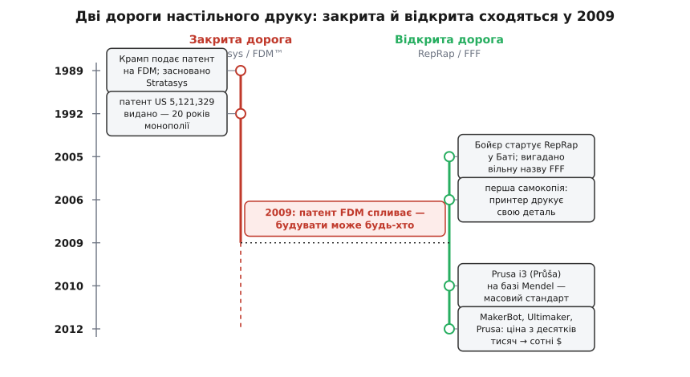

# 📜 Як настільний друк вирвався на волю: жаба, патент і саморозмножувальна машина

Сьогодні 3D-принтер коштує як недорогий телефон, стоїть у школах і на кухнях, і креслення до нього лежать в інтернеті безкоштовно. А ще п'ятнадцять років тому та сама технологія була замкнена в металевих шафах за десятки тисяч доларів, і законно робити такі машини мала право одна-єдина компанія у світі. Між цими двома станами — не поступове здешевлення, як з телевізорами, а різкий стрибок, майже вибух, що стався за кілька років близько 2009-го. Ця історія варта переказу, бо в ній видно рідкісну річ: як один рядок у патентному реєстрі, що втратив чинність, і купка ентузіастів із паяльниками переписали цілу галузь. І ще тому, що навколо неї наросло чимало плутанини — хто ж «винайшов 3D-друк», що таке FDM проти FFF, і чому одну технологію звуть двома різними іменами.

Розплутаймо це чесно, від початку.

## Жаба, зроблена клейовим пістолетом

Почалося все не в лабораторії, а вдома, з батька, що хотів зробити доньці іграшку.

Наприкінці 1980-х американський інженер **Скотт Крамп** (S. Scott Crump, повне ім'я — Steven Scott Crump) працював у власній невеликій фірмі й, як багато інженерів, потерпав від того, скільки часу забирає **виготовлення прототипів**: щоб потримати в руках нову деталь, доводилося тижнями чекати на фрезерування чи лиття. За переказом, який сам Крамп розповідає й досі і який давно став легендою галузі, ідея прийшла до нього, коли він заряджав звичайний **клейовий пістолет** сумішшю поліетилену з парафіном (свічним воском) і намагався зліпити доньці іграшкову **жабу** — викладаючи розплав шар за шаром, від руки (статус: переказ самого винахідника, підтверджений у кількох інтерв'ю; технічну суть — пошарове наплавлення розплаву — маємо задокументовану в патенті, і жаба справді фігурує в тексті початкового патенту).

Ось у цьому кустарному жесті вже сидить **вся ідея FFF**: узяти термопласт, що плавиться й твердне, видавлювати його тонкою цівкою й **накладати шар на шар**, аж поки з нічого не виросте об'ємна форма. Різниця між тією жабою й сучасним принтером — лише в тому, що руку з пістолетом замінили точні мотори, а «на око» — цифровим кресленням. Але серце те саме.

Крамп зрозумів головне: цей процес можна **автоматизувати** — водити сопло машиною по заданій траєкторії, а не рукою. Він назвав спосіб **Fused Deposition Modeling** (FDM — дослівно «моделювання наплавленням», від *fused* — сплавлений, *deposition* — накладання, *modeling* — виготовлення моделей) і **30 жовтня 1989 року подав патент** на «апарат і метод створення тривимірних об'єктів» (усталений факт: заявка US 07/429,012, що стала патентом US 5,121,329). Того ж 1989 року вони з дружиною **Лізою Крамп** (Lisa Crump) — співавторкою патенту й співзасновницею — заснували компанію **Stratasys** (усталений факт). Патент видали **9 червня 1992 року** (усталений факт: дата видачі US 5,121,329).

> 🔧 **Навіщо це.** Зверніть увагу на **дві різні дати** — це не буквоїдство, а ключ до всієї подальшої історії. Патент **подають** одного дня, а **видають** значно пізніше (тут — майже три роки по тому). Строк дії ж рахується **від дня подання**: 20 років від 30 жовтня 1989-го. Тому монополія мала впасти наприкінці 2009-го — не 2012-го, коли патент «виповнилося» 20 років від видачі. Плутанина «подано/видано» — типове джерело хибних дат у переказах цієї історії; тут ми тримаємося первинного документа.

Треба одразу відділити Крампа від ще однієї постаті, щоб не приписати йому зайвого. **3D-друк як такий** він не винайшов першим: ще **1986 року** американець **Чарльз Галл** (Charles «Chuck» Hull) запатентував **стереолітографію** (SLA) — вирощування деталі з рідкої смоли, яку шар за шаром твердить лазер, — і заснував компанію 3D Systems (усталений факт). Саме Галла частіше називають «батьком 3D-друку» в широкому сенсі. Але SLA — інша технологія (смола й світло, а не розплавлена нитка), дорога й вибаглива. Внесок Крампа вужчий і точніший: він винайшов **саме FDM** — друк **розплавленою термопластиковою ниткою**, ту технологію, що згодом стане настільною. Тож коректне формулювання таке: Галл започаткував адитивне вирощування взагалі (SLA, 1986); Крамп — конкретно друк ниткою (FDM, патент подано 1989). Обидва — американці; жодних імперських чи «а насправді це вигадали деінде» наративів тут немає, документи однозначні.

## Марка, а не просто назва: чому «FDM» не можна вимовляти

Тепер — тонкість, з якої й народилася вся плутанина з іменами.

Stratasys зробила розумний, з погляду бізнесу, крок: назву **FDM** (і повне «Fused Deposition Modeling») вона **зареєструвала як торгову марку** (усталений факт). А торгова марка — це не назва технології у вільному вжитку, як «двигун внутрішнього згоряння». Це **власність компанії на слово** в певному контексті: законно вживати «FDM» для позначення таких машин може лише Stratasys та її ліцензіати. Стороння фірма не має права написати на своєму принтері «FDM» — так само, як не може назвати свій напій «Coca-Cola».

Ось де корінь непорозуміння, яке живе й досі:

```
Що саме належить Stratasys — а що ні:

  Технологія     — друк розплавленою ниткою шар за шаром.
                   НЕ належить нікому як «спосіб» (ідею не патентують,
                   патентують конкретний апарат/метод).

  Патент         — US 5,121,329, конкретна реалізація апарата.
                   Належав Stratasys, але СКІНЧИВСЯ (2009).

  Торгова марка  — слово «FDM».
                   Належить Stratasys ДОСІ, безстроково (поки поновлюють).
```

Ці три речі — **ідея, патент і марка** — плутають постійно, а вони живуть за різними правилами. Ідею (пошарове наплавлення) не можна привласнити взагалі. Патент (конкретний апарат) можна, але на 20 років, і він **минає**. Марку (слово) можна тримати вічно. Тому й вийшла дивна ситуація: коли патент упав, будувати такі принтери стало вільно **всім**, а от **називати** їх «FDM» — усе одно ні, бо слово досі чуже.

> 🔧 **Навіщо це.** Саме через це на побутовому принтері ви бачите три інші літери — **FFF**, — і тепер зрозуміло, чому. Не тому, що це «трохи інша технологія» (вона та сама), а тому, що вільним фірмам просто **не можна вимовляти чуже слово** «FDM». Їм була потрібна **своя**, юридично незалежна назва для того самого. І вона з'явилася — але не в корпорації, а в русі, який тим часом визрівав по інший бік цієї історії.

## Едріан Бойєр і зухвала думка: машина, що копіює себе

Поки Stratasys десять із гаком років продавала дорогі закриті машини, в англійському місті **Бат** зріла ідея, що звучала майже як наукова фантастика.

**2005 року** **Едріан Бойєр** (Adrian Bowyer) — старший викладач машинобудування в **Університеті Бата** (University of Bath, Англія) — запустив відкритий проєкт із метою, від якої в багатьох округлялися очі: зробити 3D-принтер, здатний **надрукувати більшість власних деталей** (усталений факт: рік заснування 2005, посада й місце — Університет Бата). Не «дешевший принтер». Не «зручніший принтер». А **принтер, що частково відтворює сам себе**.

Логіка була така, майже біологічна. Якщо машина може надрукувати пластикові частини **іншої такої машини**, то досить зібрати один принтер — і далі вони почнуть **розмножуватися**: кожен друкує деталі для наступного, того збирають, він друкує для ще одного, і так далі. Ціна пластикових частин падає до вартості пластику, а креслення й прошивку Бойєр вирішив **викласти вільно**, щоб будь-хто у світі міг долучитися. Звідси й назва — **RepRap**, скорочення від *replicating rapid prototyper*, «саморозмножувальний швидкий прототипувальник» (усталений факт: розшифрування назви). Не «Rep-Rap» як щось випадкове — а буквально «реплікувальний прототипер».

> 🔧 **Навіщо це.** Ідея самокопіювання — не дивацтво заради дивацтва, а **економічний двигун** усього подальшого вибуху. Звичайний товар дешевшає поступово: завод оптимізує виробництво, ціна повзе вниз на відсотки за рік. А **саморозмножувальна** штука дешевшає **лавиноподібно**: кожен новий принтер — це ще одна «фабрика» принтерів, тож їхня кількість росте не додаванням, а множенням. Плюс відкриті креслення означають, що **тисячі людей** одночасно вдосконалюють ту саму машину задарма. Саме поєднання «копіює себе» + «креслення вільні» перетворило купку ентузіастів на силу, яка за кілька років зробила те, чого закрита корпорація не робила двадцять.

І тут — важлива для нашої історії деталь. Спільноті RepRap була потрібна назва для технології, якою вони друкували (тієї самої, що в Stratasys), але слово «FDM» їм вживати **не можна** — марка чужа. Тож вони **вигадали власну, юридично вільну назву**: **Fused Filament Fabrication**, скорочено **FFF** — «виготовлення сплавленою ниткою» (усталений факт: термін уведено спільнотою RepRap саме як незалежну від торгової марки заміну для FDM). Обидві абревіатури тепер означають **рівно одне й те саме**: розплавити термопластикову нитку, видавити з сопла, наростити шарами. Різниця лише в **праві на слово**: «FDM» — марка Stratasys, «FFF» — вільна назва для всіх інших.

Ось звідки в описах побутових принтерів взялося FFF, а в документах Stratasys — FDM. Дві назви, одна технологія, і причина роздвоєння — не інженерна, а суто **юридична**.

## Перша самокопія: коли машина надрукувала свою деталь

Ідея — це одне, а працююча залізяка — інше. І RepRap довів ідею до заліза на очах у всіх, бо весь проєкт від початку був відкритий: Бойєр вів блог, ділився кресленнями, помилками, успіхами.

Улітку 2005-го на розробку в Університеті Бата дали **£20 000** гранту від британської **Ради з інженерних і фізичних наук** (EPSRC) — тобто робота велася цілком легально, у стінах університету, на державні гроші (усталений факт). А **13 вересня 2006 року** стався момент, заради якого все й затівалося: прототип **RepRap 0.2** надрукував **деталь, ідентичну своїй власній** — і цю надруковану частину **вставили замість** заводської, знявши її з машини, зробленої комерційним 3D-принтером (усталений факт: дата й суть події). Машина вперше «відтворила» шматок себе.

Далі пішли покоління з іменами, що самі промовляють задум творців:

- **RepRap 1.0 «Darwin»** (Дарвін) — **2008 рік**: перша повноцінна машина, названа на честь Чарльза Дарвіна, бо йшлося про «еволюцію» й «розмноження» друкарів. У травні 2008-го Darwin відтворив **усі свої друковані частини** (близько половини всіх деталей загалом — решта, як-от гвинти, ремені й мотори, лишалися покупними) (усталений факт).
- **«Mendel»** (Мендель, на честь Ґреґора Менделя, батька генетики — знову натяк на спадковість і розмноження) — перша деталь надрукована **2 жовтня 2009 року**, друге покоління, простіше й доступніше (усталений факт).

Один надрукований оригінал в англійському університеті **розмножився** через блог і форуми в тисячі машин по всьому світу. Це вже працювало саме так, як Бойєр і задумав — по-дарвінівськи.


*Двадцять років технологія жила закритою дорогою: патент Крампа й марка Stratasys тримали її дорогою й монопольною. Паралельно з 2005-го росла відкрита дорога RepRap із вільними кресленнями та власною назвою FFF. Дороги зійшлися у вузлі 2009 року: щойно патент FDM спав, стримана пружина розпрямилася — і за лічені роки принтер із десятків тисяч доларів подешевшав до сотень.*

## 2009: пружина розпрямляється

Тепер зведімо дві дороги — закриту й відкриту — в одну точку, бо саме в ній усе й вибухнуло.

Наприкінці 2009 року **строк патенту US 5,121,329 сплив** — 20 років від подання 30 жовтня 1989-го (усталений факт). Відтоді **будь-хто у світі** отримав законне право будувати принтери за тим самим принципом, без ліцензії й відрахувань Stratasys. І тут спрацював уже **заряджений** механізм: рух RepRap за попередні чотири роки встиг створити повністю відкриту, документовану конструкцію настільного принтера — електроніку, прошивку, креслення, спільноту. Пружина була стиснута й готова; патент, що впав, лише **відпустив собачку**.

Що сталося далі, найкраще видно на цінах — саме тут абстрактне «патент минув» перетворюється на відчутну для кожного різницю:

```
Настільний друк, порядок цін:

  до 2009:  промислова машина Stratasys        десятки тисяч $
            (напр. Stratasys uPrint Personal    ≈ 14 900 $)

  2009:     MakerBot Cupcake CNC                ≈ 750 $
            (той самий рік, менша й простіша,    у ~20 разів дешевше)

  далі:     RepRap-похідні принтери             сотні $
            (складання зі здешевлених частин)
```

Розберімо гравців, що ринули у щойно відчинені двері — усі троє виросли **просто з RepRap**, а не з нізвідки:

- **MakerBot** — заснована **2009 року** трьома американцями (серед них Брі Петтіс, Bre Pettis), одразу випустила **MakerBot Cupcake CNC** — по суті, зібраний і спрощений RepRap у фанерному корпусі, перший масовий **дешевий** настільний принтер, близько **750 доларів** проти майже 15 тисяч за найдешевшу тодішню машину Stratasys (усталений факт: рік, назва, порядок ціни). Це той самий 2009-й — двері ще й не встигли грюкнути.
- **Ultimaker** — заснована **2011 року** в Нідерландах трьома голландськими інженерами (Мартейн Елсерман, Ерік де Брейн, Сірт Вейнія — Martijn Elserman, Erik de Bruijn, Siert Wijnia), теж на фундаменті RepRap (усталений факт: рік, країна, засновники).
- **Prusa** — чех **Йозеф Пруша** (Josef Průša, нар. 1990 у Гавлічкув-Броді, тодішня Чехословаччина) **2010 року** створив конструкцію **Prusa i3** — спрощений і покращений нащадок менделівського RepRap, який став **найпоширенішим настільним принтером** свого часу й основою для незліченних клонів; 2012-го він заснував у Празі компанію Prusa Research (усталений факт: національність, роки, походження i3 від Mendel). Зверніть увагу на точність: Пруша — **чех**, а не «росіянин» чи абстрактний «східноєвропеєць», і назва принтера — його прізвище.

За кілька років після 2009-го принтер, що коштував **понад десять тисяч доларів**, подешевшав до **сотень** (усталений факт: порядок здешевлення). Технологія, двадцять років замкнена в промислових шафах, за лічені роки опинилася на столах у школярів.

> 🔧 **Навіщо це.** Тут — головний урок цієї історії, і він ширший за 3D-друк. Здешевлення вдесятеро за кілька років дала **не** якась нова інженерна винахідка — сама технологія лишилася по суті Крамповою з 1989-го. Її дали **дві юридично-соціальні події, що збіглися**: (1) впав патент — щез правовий бар'єр; (2) вже існував зрілий **відкритий** рух, готовий цим скористатися, з вільними кресленнями й тисячами добровольців. Одне без одного не спрацювало б: якби патент упав, а відкритої RepRap-конструкції не було б — двері відчинилися б у порожнечу, і хтось мусив би роками винаходити настільний принтер з нуля. А якби RepRap існував, але патент ще діяв — рух душили б позовами. Саме **збіг** зрілої відкритості з падінням монополії й дав вибух. Це показує, як відкриті стандарти й вчасно застарілі патенти рухають цілі галузі — часто дужче за самі винаходи.

## Що з цього винести й де тут легенда

Проберімося крізь усе й відділимо тверде від хиткого — бо навколо цієї історії наросло чимало напівправд.

**Що встановлено твердо** (документи, дати, патенти): Крамп подав патент на FDM 30 жовтня 1989-го, того ж року заснував Stratasys, патент видано 9 червня 1992-го й він сплив наприкінці 2009-го; «FDM» — торгова марка Stratasys; Бойєр запустив RepRap 2005-го в Університеті Бата з ідеєю самокопіювання; спільнота RepRap увела вільну назву FFF; перша самокопія — 13 вересня 2006-го; після 2009-го MakerBot (2009), Ultimaker (2011) і Prusa (i3 — 2010) обвалили ціни з десятків тисяч до сотень доларів.

**Що має статус переказу** (правдоподібне, від першої особи, але не «документ»): історія про **жабу з клейового пістолета** й суміш поліетилену з парафіном. Її розповідає сам Крамп, вона узгоджується з суттю патенту (пошарове наплавлення розплаву, і жаба справді згадана в патенті), тож це радше **достовірний спогад винахідника**, ніж вигадка, — але подавати її варто саме як його розповідь, а не як протокольний факт.

**Чого варто пильнувати** — трьох поширених спрощень:
- *«3D-друк винайшов Крамп»* — ні: адитивне вирощування як таке започаткував Чарльз Галл стереолітографією (1986); Крамп винайшов **конкретно** друк ниткою (FDM). Різні технології, різні люди, обидва американці.
- *«FDM і FFF — різні технології»* — ні: та сама технологія, різниця лише в **праві на назву** (марка проти вільного слова).
- *«Патент минув 2012-го»* (20 років від видачі) — ні: строк рахують **від подання**, тож кінець — 2009-й; сплутати легко, але хронологію вибуху це зсуває на роки.

І остання, найважливіша думка. Настільний 3D-друк став дешевим і повсюдним не завдяки одному генієві й одній іскрі-винаходу, а завдяки **накладенню** трьох різних сил: приватної винахідки (Крамп дав технологію), корпоративного захисту, що **вчасно вичерпався** (патент минув), і відкритого руху, що **стояв напоготові** цим скористатися (RepRap дав вільну конструкцію й спільноту). Приберіть будь-яку з трьох — і принтера на вашому столі, найпевніше, не було б досі. У цьому й полягає непроста, але чесна відповідь на питання «звідки взялися дешеві 3D-принтери»: з жаби, зробленої від руки, з рядка в патентному реєстрі, що втратив силу, і з машини, яку зумисне навчили копіювати саму себе.
