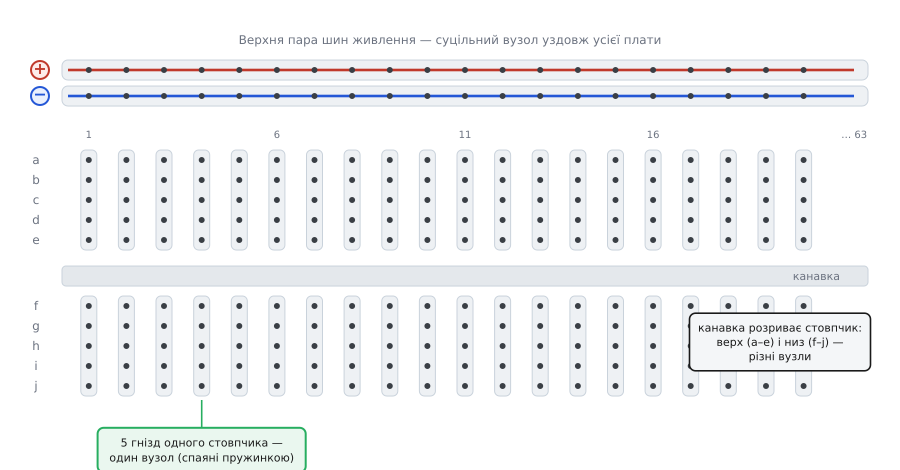
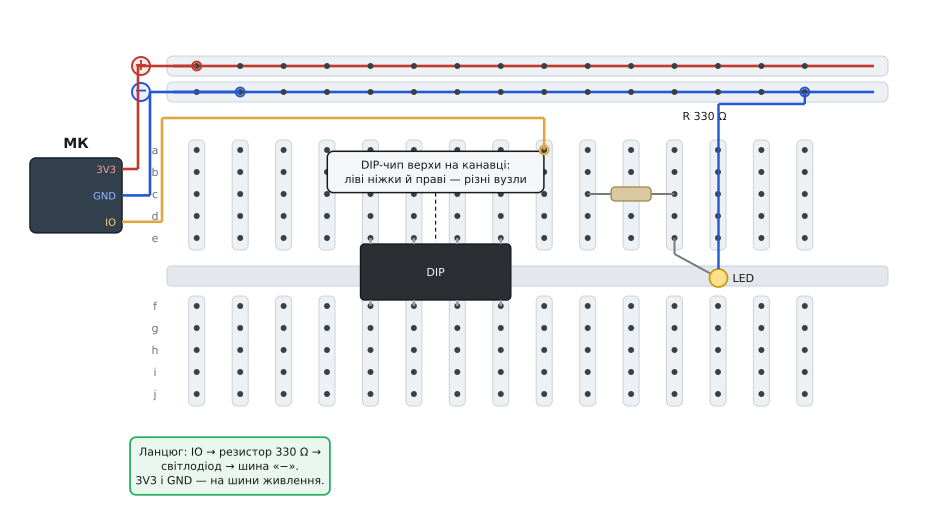

# Макетна плата (велика)

<preknowlist>
- [Вузли, гілки, контури](topic:electronics/nodes-branches-loops) — що таке вузол: точка, де електрично сходяться кінці кількох гілок. Кожна смужка гнізд плати і є вузол.
- [Корпуси й розпіновка](topic:electronics/packages-pinout) — крок 2.54 мм (0.1 дюйма), спільна сітка виводів, у яку лягають отвори плати, ніжки DIP-мікросхем і штирі.
- [Dupont дроти](topic:components/dupont-wires) — перемички зі штировими наконечниками, якими зшивають гнізда плати між собою й до модулів.
</preknowlist>

Візьміть у руки прямокутник білої пластмаси завдовжки з долоню, весь у дрібних квадратних дірочках — рядами, тисячами. З одного боку двома парами ліній тягнуться червона й синя смуги. Це **велика макетна плата** (англ. *breadboard* — буквально «дошка для хліба») на **830 гнізд** — робочий стіл, на якому схему збирають **без паяння**: устромив ніжку деталі в дірку, устромив другу поруч — і вони з'єдналися. Спробував, не вийшло, висмикнув, переставив. Уся принада в тому, що **частина гнізд уже з'єднана всередині заздалегідь**, і вміти користуватися платою — це знати карту цих прихованих з'єднань.

Ім'я лишилося від часів, коли макета в нинішньому вигляді не існувало. У 1910–1930-х радіоаматори прибивали лампові панельки й монтували дроти цвяхами просто до дерев'яної дошки — і нерідко брали для цього справжню кухонну дошку, на якій ріжуть хліб: рівну, тверду, неструмопровідну, легку свердлити. Сучасну ж плату без паяння — з пружинними контактами під отворами на кроці 0.1 дюйма — придумав і запатентував Рональд Портуґал (Ronald J. Portugal) з фірми E&L Instruments; заявку на дизайн-патент D228,136 подано 1 грудня 1971 року (усталений факт). Дошки не стало, а назва прижилася. Ця дорога від хлібної дошки з цвяхами до пластмаси з пружинками — [окрема історія назви й винаходу](topic:instruments/breadboard-large/hist-breadboard-name.md): чому паяли до дерева, як «solderless breadboard» скоротилося до просто «breadboard» і що саме запатентував Портуґал.

> 🔧 **Навіщо це.** Макетна плата — це «чернетка» схеми. Перш ніж травити друковану плату чи паяти щось начисто, ідею перевіряють на макеті: чи запускається мікроконтролер, чи світиться індикатор, чи міряє давач те, що треба. Помилку тут виправляють за секунди — переткнули дріт. Саме тому з макетної плати починається майже кожен прототип на столі розробника.

## Як упізнати «велику»

Макетки бувають різних розмірів, і «велика» (*full-size*) — це цілком означений стандарт, а не просто «більша за іншу». Її прикмети сталі в усіх виробників:

- **830 гнізд** (англ. *tie points* — «точки під'єднання»). Звідси й народна назва плати — «на 830».
- **63 пронумеровані ряди** в центральній зоні, по **10 гнізд** у кожному, поділені навпіл: колонки позначені літерами **a b c d e** ліворуч і **f g h i j** праворуч від центральної канавки.
- **Чотири шини живлення** — по дві довгі лінії вздовж кожного довгого краю, з червоною та синьою смужками.
- Габарит близько **165 × 55 × 9 мм** — акурат щоб поряд лягла типова плата-«мозок» і вистачило місця на кілька модулів: Arduino UNO чи STM32 Nucleo-64 стають збоку від поля, а вужчі модулі на кшталт ESP32-DevKit або Raspberry Pi Pico сідають верхи на канавку, лишаючи по одному вільному стовпчику з кожного боку.

Ці 830 складаються просто: **630** гнізд у центральному полі під деталі (63 ряди × 10) плюс **чотири шини по 50** гнізд для живлення (усталено з фірмових даташитів). Знизу вся ця пластмаса напхана металевими пружинними затискачами — типово з **лудженої фосфористої бронзи** або **нейзильберу** (мідно-нікелевий сплав); саме ці пружинки хапають ніжку деталі й водночас **з'єднують гнізда однієї смужки** в єдиний вузол.

## Що з'єднано всередині

Це серце всієї справи, тож розберімо повільно. Металеві смужки під пластмасою розкладені за суворою картою — і поки її не бачиш подумки, плата здається хаосом дірок.


*Що з'єднано заздалегідь. У центральному полі гнізда спаяні пружинкою у **вертикальні стовпчики по 5**: усі п'ять гнізд одного стовпчика — це один вузол, сусідній стовпчик — уже інший. **Канавка** посередині розриває стовпчик: верхні п'ять гнізд (ряди a–e) і нижні п'ять (f–j) — два різні вузли. Уздовж країв ідуть **шини живлення**, з'єднані по всій довжині плати.*

Карта зводиться до трьох правил:

**Стовпчик із 5 гнізд — один [вузол](topic:electronics/nodes-branches-loops).** У центральному полі гнізда з'єднані короткими вертикальними смужками по п'ять. Устромили в один стовпчик ніжку резистора й кінець дроту — ви їх **з'єднали**, бо обидва торкнулися однієї металевої смужки. Сусідній стовпчик за міліметри — **окремий** вузол, там уже інша смужка.

**Канавка ділить верх і низ.** Центральна поздовжня канавка — не просто щілина: під нею смужки **не** переходять. Тому стовпчик із десяти гнізд насправді два вузли: верхня п'ятірка (a–e) і нижня (f–j) незалежні. Найпоширеніша помилка новачка — гадати, що всі десять гнізд стовпчика спільні.

**Шини живлення тягнуться вздовж усього краю.** Довгі ряди по боках (з червоною «+» і синьою «−» лініями) з'єднані по **всій довжині** плати. Це довгі вузли-роздавачі: подали на один кінець шини живлення й землю — і вони доступні будь-де вздовж плати, щоб коротким дротиком узяти живлення поряд із деталлю.

### Навіщо канавка: під мікросхему

Ширину канавки задано не навмання — вона точно під **DIP-мікросхему** (корпус із двома рядами ніжок; від англ. *dual in-line package*). Чип сідає верхи на канавку так, що ліві його ніжки потрапляють у стовпчики рядів e, а праві — у стовпчики рядів f, і **ліва ніжка з правою не закорочені**, бо канавка розриває смужку. Кожна ніжка дістає власний вузол-стовпчик, до якого зручно підвести решту схеми. Не було б канавки — протилежні ніжки чипа сиділи б в одному стовпчику й замикалися накоротко.

## Як під'єднати: розводка пін-у-пін

Тепер від карти — до діла. Зберімо на платі простий, але повний ланцюг: мікроконтролер живить плату, а один його вихід запалює світлодіод через струмообмежувальний резистор. Це той самий «Hello, world» заліза, і на ньому видно всю логіку розводки.


*Конкретне підключення. Виводи 3V3 і GND мікроконтролера йдуть перемичками на **шини живлення** («+» і «−»). DIP-чип сидить верхи на канавці, кожна ніжка — у власному стовпчику. Вихід IO заходить у стовпчик поля; звідти резистор веде в сусідній стовпчик, з нього — світлодіод, а його другий вивід перемичкою повертається на шину «−». Кружечки — куди саме встромлено кінці дротів.*

Розберімо по кроках, і ключ до всього — думати вузлами:

**Живлення — спершу на шини.** Вивід **3V3** мікроконтролера перемичкою заводять на шину «+», вивід **GND** — на шину «−». Тепер уздовж усієї плати є звідки взяти живлення й землю коротким дротиком — не тягнути щоразу через усю плату до мікроконтролера.

**Деталь замикає два вузли.** Резистор устромлений ніжками у **два різні стовпчики** — інакше він нічого не робив би. Одна ніжка сидить у стовпчику, куди приходить вихід IO; друга — у сусідньому стовпчику. Через резистор ці два вузли з'єднані «через опір».

**Ланцюг веде далі тим самим правилом.** Зі стовпчика, де друга ніжка резистора, устромлено анод світлодіода; катод світлодіода перемичкою йде на шину «−». Струм тече: вихід IO → стовпчик → резистор → стовпчик → світлодіод → шина «−» → земля. Кожен «стрибок» — це деталь чи дріт, що замикає один вузол на інший.

**Канавку не забуваймо.** Якби ви за звичкою встромили обидві ніжки резистора у верхню й нижню половини **одного** стовпчика (через канавку), кола не було б: це різні вузли, між ними всередині нічого не з'єднано. Тому перемички через ланцюг ведуть у **сусідні стовпчики**, а не «крізь» канавку.

Порахуймо резистор, бо його беруть не навмання. Червоний світлодіод світиться приблизно на **2 В** на собі й хоче близько **10 мА**; живлення логіки — 3.3 В. Опір, що гасить різницю, — за [законом Ома](topic:electronics/ohms-law):

```
Напруга, яку гасить резистор:
   U_R = U_жив − U_LED = 3.3 В − 2.0 В   = 1.3 В

Потрібний опір під 10 мА:
   R = U_R / I = 1.3 В / 0.010 А          = 130 Ом

Найближчий ходовий номінал більший (безпечніше, трохи тьмяніше):
   R ≈ 150…330 Ом
```

На схемі стоїть 330 Ом — світлодіод світить трохи тьмяніше за максимум, зате з добрим запасом за струмом; для індикатора це саме те. Дроти-перемички між гніздами — це [Dupont дроти](topic:components/dupont-wires) зі штировими кінцями (штир входить у гніздо плати), а живлення й сигнали з зовнішніх модулів заводять їхніми ж штировими [зʼєднувачами](topic:components/pin-headers).

Зібраний ланцюг лишається оживити кодом: налаштувати вихід мікроконтролера й перемкнути його, щоб світлодіод блимав. Робочий приклад — від під'єднання до готового блимання — у [коді для макетного ланцюга «кнопка → світлодіод»](topic:instruments/breadboard-large/proj-blink-wiring.md): яку ніжку оголосити виходом, як читати кнопку з підтяжкою, типові пастки макета (плавучий вхід, брязкіт контактів) і чому це той самий «Hello, world» заліза.

> 🔧 **Навіщо це.** Уся швидкість макета тримається на тому, що деталь **не паяють, а встромляють**. Зібрати такий ланцюг — секунди; помилився з номіналом резистора — висмикнув, поставив інший, і знову за секунди. Ось чому перевірку ідеї — «а чи взагалі засвітиться?» — роблять на макетці, а на друковану плату переносять уже те, що завідомо працює.

## Чому саме крок 2.54 мм

Усі отвори плати розкладено по сітці з кроком **2.54 мм**, він же рівно **0.1 дюйма**. Це не примха: ніжки DIP-мікросхем, штирі гребінок-хедерів, отвори перфорованих плат — усе стоїть на цій самій дюймовій сітці. Тому будь-яку деталь із «нормальними» ніжками або будь-який модуль зі штирями на 2.54 мм можна встромити в макетку без жодних перехідників — усе просто лягає в отвори. Число дивне для метричної країни, і має воно [свою історію](topic:electronics/packages-pinout/hist-inch-grid.md), що пережила перехід світу на міліметри.

## Скільки вона тримає й де підводить

Макетна плата — інструмент для **слабкострумових, низькочастотних** прототипів, і межі тут варто знати, бо за ними починаються примарні збої.

**Струм і напруга.** Один пружинний контакт розрахований орієнтовно на **1 ампер за 5 вольтів** і десь **0.33 ампера за 15 вольтів** (тобто близько 5 Вт межі; усталено з даташитів). Це стеля **на гніздо**, і для логіки з її десятками міліампер вона недосяжно висока. А от мотор чи силова світлодіодна стрічка легко просять кілька амперів — і тоді контакт гріється, напруга просідає, схема капризує. Живлення потужного через макетку **не ведуть**: силове йде окремим товстим проводом і паяним чи гвинтовим з'єднанням.

**Частота.** Через паразитну ємність між сусідніми стовпчиками — приблизно **2 пФ** на пару (усталено з вимірів) — і помітну індуктивність довгих смужок макетка придатна лише десь **до 10 МГц**. Швидка цифрова шина чи високочастотний аналог на ній «попливуть»: з'являться дзвони, наведення, нестабільність. Для такого потрібна вже друкована плата з коротким заземленням.

**Плавучий контакт — головна болячка.** Гнізда з часом розношуються, а пружинки слабшають від багатьох втиків. Товста чи крива ніжка тримається нещільно, контакт стає непевним — схема «то працює, то ні», особливо як торкнутися дротів. Це найпідступніший дефект макета: помилки ніби нема, а поведінка стрибає. Лік — переткнути в інший стовпчик, а зношену плату під точну роботу замінити.

**Дроти вивалюються.** Легкі перемички погано сидять у розношених гніздах і випадають від поштовху стола. Тому макетка — для «зібрав-перевірив-розібрав», а не для пристрою, що має пожити: те, що вистоялося, переносять на паяну перфоровану плату.

## Що брати

Для столу «на все» беруть саме **велику** плату на 830: місця вистачає і на мікроконтролер, і на кілька модулів поряд, а чотири шини дають зручно розводити живлення й землю з обох боків. Мала макетка (на пів сотні–три сотні гнізд) добра для крихітної схеми чи коли місця обмаль, але велика зайвою не буває.

До плати одразу кладуть **набір перемичок**: [Dupont дроти](topic:components/dupont-wires) різної довжини та жорсткі перемички «літерою П», що лягають упритул до плати й не плутаються в макаронину. Живлення зручно подавати спеціальним модулем-адаптером, що сідає просто на шини, — але й пари дротів від плати мікроконтролера цілком досить. Головне, з чого починають, — навчитися **бачити вузли**: коли карта прихованих з'єднань стоїть перед очима, збирання схеми стає буквальним «поєднай потрібні вузли перемичками», і макетка з поля дірок перетворюється на зрозумілий верстак.
