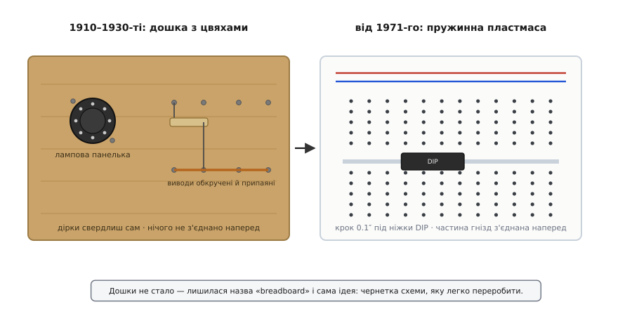

# 📜 Чому «дошка для хліба»

Слово тримається за річ, якої давно немає. Ви берете зі столу білий пластмасовий прямокутник у дірочках, а зветься він — *breadboard*, «дошка для хліба». Ніякого хліба, ніякої дошки: суцільна синтетика й метал усередині. І все ж інженер у Каліфорнії, студент у Києві, паяльник-аматор у Токіо кажуть те саме слово — і всі розуміють один одного. Назва пережила свою річ на ціле століття, і в цьому розриві між словом і предметом захована ціла історія раннього радіо, кухонного начиння та одного дизайн-патенту 1971 року.

Розберімо цю історію по-чесному, бо навколо неї наросло чимало напівлегенд — «інженер узяв дружинину дошку для хліба» переказують так упевнено, наче хтось стояв поруч і бачив. Що з цього документований факт, що — правдоподібна традиція, а що просто гарна оповідка, варто розділити.

## Доба, коли дошка була справжня

Щоб зрозуміти назву, треба уявити, як узагалі виглядала радіосхема на початку 1920-х. Транзистора ще немає — його винайдуть аж 1947-го. Уся активна електроніка тримається на **вакуумній лампі** (англ. *vacuum tube*, брит. *valve*): скляна колба завбільшки з невелику грушу, всередині розжарена нитка, сітки, пластини. Лампа гаряча, важка, крихка, і вставляють її не в плату, а в **панельку** (англ. *socket*) — керамічний чи бакелітовий стакан із пружинними гніздами під штирі цоколя.

А тепер спитаймо найпростіше: на **що** цю панельку поставити? Схема ранніх 1920-х — це жменя великих деталей: дві-три лампові панельки, змінний конденсатор завбільшки з кулак, котушки, дротяні резистори, клеми під батарею. Усе це важке й об'ємне, усе треба десь закріпити так, щоб трималося міцно, не коротило й не билося струмом об руки. Потрібна основа: рівна, тверда, така, що не проводить струм, і щоб легко було в неї щось угвинтити чи вбити цвях.

І тут відповідь лежала буквально на кухні. **Дерев'яна обробна дошка** — та сама, на якій ріжуть хліб, — має рівно ті властивості, яких треба:

```
Чого хоче радіоаматор 1922 року   →   що дає кухонна дошка
─────────────────────────────────────────────────────────
рівна тверда поверхня             →   так, стругана дошка
не проводить струм (діелектрик)   →   так, сухе дерево ізолює
легко свердлити й бити цвяхи      →   так, м'яка деревина
дешево й у кожній хаті            →   так, лежить на кухні
```

Дерево тут не примха, а інженерно вдалий вибір: сухе дерево — пристойний ізолятор, тримає цвях, глушить вібрацію крихкого скла, і його не треба купувати. Тож радіоаматори брали дошку — часом справді кухонну, часом просто стругану дощечку з крамниці залізяччя — і **прибивали** до неї панельки й клеми, а між ними тягли дроти, обкручуючи їх навколо вбитих цвяхів або дрібних мідних гвіздочків. Де треба надійніше — місце скрутки ще й пропаювали.

> 🔧 **Навіщо це знати.** Тут закладено головну ідею, що дожила до сьогодні: макет — це не готовий пристрій, а **чернетка**, яку не шкода переробити. Цвях можна висмикнути, дріт перемотати, деталь пересунути. Саме ця свобода «зібрав — не вийшло — переробив», а не конкретний матеріал основи, і є суть макетування. Пластмаса з пружинками просто зробила ту саму свободу ще швидшою.

Погляньте, як мало змінилася сама **логіка**, попри те що фізично річ невпізнанна:


*Ліворуч — як збирали в добу ламп: панельку прибивали цвяхами до дошки, виводи деталей обкручували навколо гвіздків і припаювали, товстий мідний дріт правив за шину живлення. Праворуч — те саме завдання сьогодні: устромив ніжки в гнізда, і частина з'єднань уже готова наперед. Дошки не стало — лишилася назва і сама ідея чернетки схеми.*

Зверніть увагу на праву панель: мідна шина живлення, прибита вздовж дошки, — це прямий предок тих **довгих шин** («+» і «−») уздовж країв сучасної плати. Ідея «одна довга лінія роздає живлення всій схемі» народилася ще на дереві; пластмаса лише сховала мідь під корпус.

## Звідки ми знаємо, що дошка була саме хлібна

Тепер — чесно про доказовість, бо це якраз те місце, де оповідка любить випереджати факти.

Що **надійно засвідчено**: у 1910–1930-х радіосхеми справді монтували на пласких дерев'яних дошках, кріплячи деталі цвяхами, кнопками (англ. *thumbtacks*) чи гвинтами й тягнучи між ними дроти. Це не легенда — так виглядають незліченні саморобки з тодішніх радіожурналів, посібників для аматорів і збережені експонати. Практику часом описують ще колоритніше: до дошки приклеювали паперову схему, а деталі ставили просто поверх намальованих символів, наче збираючи за викрійкою.

Що **правдоподібно, але не документовано поіменно**: що бралася саме **кухонна дошка для нарізання хліба**, а не будь-яка дощечка. Тут джерела обережніші й розходяться. Одні кажуть, що аматори буквально несли дошку з кухні; інші уточнюють — «часом справді хлібну, але частіше просто дошку з залізної крамниці». Тобто термін *breadboard* міг прикріпитися і як точний опис (брали саме ту дошку), і як **жартівливе перебільшення**: «монтуєш, як на кухонній дошці». Історія не зберегла ані імені першого, хто так зробив, ані першого запису, де дошку для схеми назвали «хлібною». Тож правильний статус тут — **усталена традиція без задокументованого першоджерела**: сам факт монтажу на дереві безсумнівний, а «саме хлібна дошка» — радше добре обґрунтована народна етимологія, ніж запротокольований епізод.

Ця чесність важлива. Спокусливо розповісти яскраву сценку — «інженер приніс дружинину дошку для хліба, і так народилася назва», — але ніхто такої конкретної події не зафіксував. Народна назва зазвичай і не має «дня народження»: вона проступає в мові поступово, з десятків кухонь і майстерень одразу.

Певно одне: до 1940–1950-х **breadboarding** уже стало ходовим слівцем на будь-яке тимчасове, чорнове збирання схеми — байдуже, на чому саме. Дошка ще подеколи траплялася в майстернях, але слово вже відірвалося від матеріалу й означало **спосіб роботи**, а не предмет: нашвидку, для перевірки, без наміру лишати назавжди.

## Проблема, яку дерево так і не розв'язало

Дерев'яна дошка з цвяхами добре служила добі великих деталей, але мала одну вроджену ваду, яка з часом стала нестерпною: **кожне з'єднання доводилося робити руками й закріплювати назавжди-на-час**. Обкрутив дріт навколо цвяха, пропаяв — тримається. Але передумав, схотів перенести деталь на два цвяхи вбік — і треба відпаювати, розкручувати, свердлити нову дірку. Чернетка виходила не така вже й швидка на переробку.

Далі стало гірше — точніше, дрібніше. Крізь 1950–1960-ті деталі **зменшувалися**. Замість грушоподібної лампи — крихітний транзистор із трьома тонкими ніжками. А наприкінці 1950-х з'явилася **інтегральна схема** (англ. *integrated circuit*, IC): десятки транзисторів у корпусі завбільшки з нігтик, і в найпоширенішому виконанні — **DIP** (англ. *dual in-line package*, «корпус із двома рядами ніжок») — ці ніжки стоять двома рівними гребінцями з дрібним, строго витриманим кроком.

І ось тут стара дошка спасувала остаточно. Прибивати цвяхи під ніжки, що стоять за 2.54 міліметра одна від одної, руками — марна праця: не поцілиш, закоротиш сусідні. Потрібна була основа, у якій **точні контакти під цей дрібний крок уже зроблені на заводі**, а інженерові лишалося б тільки встромляти й висмикувати, нічого не паяючи. Дерево такого дати не могло в принципі. Назрів інший пристрій — і він з'явився двома кроками, від різних людей.

## Перший крок: пружина замість цвяха

Ідею «замінити цвях і паяння на пружинний затискач, що сам хапає вставлений дріт» запатентували раніше, ніж з'явилася звична нам плоска плата.

**Орвілл Томпсон (Orville I. Thompson)** з навчального закладу DeVry Technical Institute подав заявку **7 липня 1960 року**; патент США **3 085 177** — «Device for facilitating construction of electrical apparatus» («Пристрій для полегшення збирання електричних апаратів») — видано **9 квітня 1963 року** (усталений факт; перевірено за реєстром патентів США). Це вже не дерево: прозора ізоляційна плита з рядами довгастих порожнин, а в кожній — пружинні контакти зі стуленими губками, що затискають устромлений вивід. Кілька дротів в одну порожнину — і вони з'єднані, **без жодного паяння**. Прозорість не випадкова: під плиту клали паперову схему, і збирали просто за нею — прямий нащадок звички «монтуй поверх намальованого», що дійшла ще від дерев'яної доби.

Але — і це важлива засторога проти спрощень — винахід Томпсона ще **не був** тією платою, що лежить на вашому столі. За устроєм він ближчий до пружинної **комутаційної панелі**: ряди затискачів, у які зводять дроти, а не дрібна дюймова сітка гнізд рівно під ніжки мікросхеми. Ключового кроку — **прив'язати крок гнізд до кроку ніжок DIP**, щоб чип просто сідав у плату, — цей патент іще не робив. Тобто «безпаяльність» народилася раніше за «плату під мікросхему»; це два різні винаходи, і плутати їх не варто.

## Другий крок: крок 0.1 дюйма під мікросхему

Той рішучий крок зробив **Рональд Портуґал (Ronald J. Portugal)**, інженер фірми **E&L Instruments** з міста Дербі, штат Коннектикут (англ. Derby, Connecticut). Він додав до пружинної ідеї те, що перетворило її на **сучасну макетну плату**: розклав гнізда суворою сіткою з кроком **0.1 дюйма** — рівно **2.54 міліметра**, — тим самим, що й крок ніжок DIP-мікросхем і штирів гребінок.

Наслідок цього дрібного числа величезний. Тепер **будь-яка** DIP-мікросхема сідає в плату просто так: ліві ніжки в один ряд гнізд, праві — в інший, кожна у власний вузол, і нічого не треба підганяти. Плата й панель мікросхем заговорили однією геометричною мовою — дюймовою сіткою. Саме ця збіжність кроку, а не сама по собі пружинка, і зробила плату універсальним столом, на якому збирають цифрову схему за хвилини.

Дати тут документовані точно (перевірено за реєстром патентів США):

```
Дизайн-патент США  D228,136
Назва   "Breadboard for electronic components or the like"
        («Макетна плата для електронних компонентів тощо»)
Автор   Ronald J. Portugal
Фірма   E&L Instruments (Дербі, Коннектикут)
Заявка  1 грудня 1971 року        ← усталений факт
Видано  14 серпня 1973 року
```

Варто пояснити слово **дизайн-патент** (англ. *design patent*), бо воно каже дещо про суть. Звичайний патент захищає, **як пристрій працює**, — механізм, спосіб. Дизайн-патент захищає **як він виглядає** — зовнішній, орнаментальний вигляд виробу. Те, що плату Портуґала запатентовано саме як дизайн, підказує: у центрі був **упізнаваний вигляд і розкладка** тієї білої плитки з певним візерунком гнізд, шинами вздовж країв і канавкою посередині, — та сама форма, яку ви й тримаєте в руках, майже незмінна дотепер.

Фірма E&L Instruments почала продавати такі плати на початку 1970-х під власними назвами (лінійка звалася, зокрема, *Elite* — цілі макетні системи з платою, живленням і генераторами сигналу в одному корпусі). Звідти плоска безпаяльна плата з дюймовою сіткою і розійшлася лабораторіями, класами та столами аматорів по всьому світу.

## Чиє це, як казати чесно

Тут варто спинитися, бо історію винаходів легко перекрутити на «одна людина одної нації все придумала». Правда стриманіша й точніша.

Сучасна макетна плата — не осяяння одного генія і **не «винахід нації»**. Це **американська фірмова розробка з персональним патентом**: конкретний інженер Рональд Портуґал у конкретній компанії E&L Instruments у Коннектикуті оформив конкретний дизайн-патент. Перед ним пружинну безпаяльну ідею запатентував Орвілл Томпсон у DeVry. А ще перед ними — ціла безіменна доба радіоаматорів, що монтували на дереві. Тобто це **накопичення**: дерев'яна дошка з цвяхами дала ідею чернетки й довгих шин живлення; Томпсон дав пружинний затискач замість паяння; Портуґал прив'язав сітку до дюймового кроку ніжок і дав виробу впізнаваний вигляд. Правильно казати «сучасну плату оформив патентом Портуґал у E&L Instruments (1971)», а не «плату винайшли американці» — рівно так, як правильно розрізняти, хто **подав ідею**, хто **побудував робочий зразок**, а хто **зробив із нього товар**.

Прізвище *Portugal* збігається з назвою країни, та це просто прізвище американського інженера — жодного стосунку до Португалії винахід не має. Дрібниця, але саме на таких співзвуччях і народжуються хибні «національні» історії, тож варто сказати прямо.

## Як «solderless breadboard» усохло до «breadboard»

Лишається останній вузол — чому нова пластмасова річ узяла собі стару «хлібну» назву, та ще й у скороченому вигляді.

Коли плата Портуґала виходила на ринок, її треба було якось **відрізнити** від того, що всі знали під словом *breadboard*, — від старого способу з паянням на дошці. Тому продавали її повною назвою: **solderless breadboard**, «**безпаяльна** макетна плата». Прикметник *solderless* («без паяння») ніс усе змістове навантаження: він казав головну новину — *ось макет, де нічого не треба паяти*. Слово *breadboard* при ньому лишалося як данина спадкоємності: це той самий чорновий стіл для схеми, тільки нового ґатунку.

А далі спрацювала звичайна економія мови. Придивімося, від чого залежить, виживе прикметник чи відсохне:

```
Прикметник тримається, поки є з чим плутати.
  «безпаяльна плата»  ↔  «паяльна плата»       — протиставлення живе → уточнюй
  «безпаяльна плата»  ↔  (а іншої вже й нема)   — протиставляти нема з чим → відпаде
```

Що сталося далі, зрозуміло само собою. Старий спосіб — монтаж на дошці з паянням — **вимер**. Нікому вже не спадало на думку прибивати лампову панельку до дощечки: усі перейшли на пружинну плату, а серйозне, «начисто» паяли вже на **друкованій платі**. Виходить, «повнопаяльної макетної плати», якій *solderless* мусив би протиставлятися, у побуті просто **не стало**. А прикметник, що ні з чим не контрастує, у живій мові завжди відпадає — навіщо щодня казати «безпаяльна», якщо паяльної однаково не буває?

Так *solderless breadboard* усохло до просто **breadboard**. Слово зробило повне коло: народилося як опис справжньої хлібної дошки з цвяхами, потім позначало будь-яке чорнове збирання, а тепер твердо сидить на пластмасовій плитці з пружинками — предметі, у якому від початкового образу не лишилося ні хліба, ні дошки, ні цвяха. Лишилася сама суть, заради якої все й затівалося: місце, де схему пробують начорно, легко переробляючи, перш ніж робити начисто.

І коли ви наступного разу візьмете зі столу цей прямокутник у дірочках, згадайте: у його імені захований столітній ланцюжок — від кухонної дошки радіоаматора, через пружину Томпсона, до дюймової сітки Портуґала. Річ змінилася до невпізнання. Слово встояло, бо встояла ідея.
