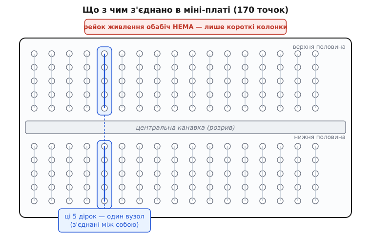
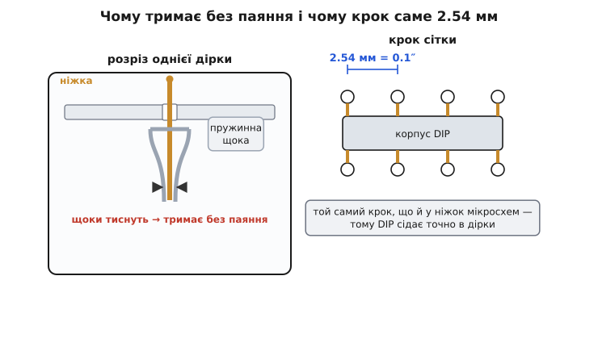

# Макетна плата (міні)

<preknowlist>
- [Мікросхема в DIP-корпусі](book:components/dip-ics) — двобічний ряд ніжок із кроком 2.54 мм; саме під нього зроблено дірки й центральну канавку плати.
- [Коротке замикання](book:electronics/short-circuit) — що стається, коли плюс і мінус з'єднати навпрямки; головна небезпека на макетці, коли випадково зведеш два сусідні вузли.
</preknowlist>

Береш у руку крихітний білий (чи синій, чорний, червоний — колір байдужий) прямокутник пластику завбільшки зі сірникову коробку, весь усіяний акуратними рядами дрібних дірочок, — і це **міні-макетна плата** (від англ. *breadboard* — «хлібна дошка»). На ній збирають електронну схему **без жодного паяння**: устромив ніжку деталі в одну дірку, дріт — у сусідній ряд, і вони вже з'єднані. Розібрав за секунду, переставив, спробував інакше. Це найшвидший спосіб перевірити ідею «в залізі», перш ніж паяти щось усерйоз, — і саме тому міні-плата лежить у шухляді кожного, хто бодай раз крутив у руках мікроконтролер чи давач.

Дивна назва — «хлібна дошка» — не випадкова й не жарт. У 1920-х радіоаматори, збираючи перші лампові приймачі, брали звичайну дерев'яну дошку для нарізання хліба, вбивали в неї цвяхи й накручували на них дроти та деталі. Дошка була дешева, під рукою й досить велика, щоб розкласти на ній усе громіздке нутро приймача. Схема тримається на дошці, дроти йдуть від цвяха до цвяха — от і весь «макет». Назва пережила і дерево, і цвяхи: сучасна пластикова плата робить те саме — тримає деталі й з'єднує їх, — тільки замість цвяхів усередині ховаються пружинні контакти, а замість накручування дроту досить його встромити. Як з дерев'яної дошки виросла ця пластикова коробочка й хто зробив її саме такою — коротко у [вставці про народження безпаяльної макетки](book:instruments/breadboard-mini/hist-solderless-breadboard.md).

Слово «міні» тут — не просто «менша за розміром», а **окремий тип** зі своїми правилами. Велика макетна плата має обабіч довгі суцільні смуги-**рейки** для роздачі живлення на всю схему; міні-плата їх **не має взагалі** — і саме це, а не габарити, її головна відмінність, на якій спотикається чи не кожен новачок. Розберімо цю конкретну річ так, щоб упізнати її серед іншого приладдя, зрозуміти, які дірки всередині з'єднані, а які ні, як правильно живити на ній схему за відсутності рейок і чого стерегтися, щоб не спалити деталь випадковим замиканням.

## Що це насправді: сітка дірок, де деякі з'єднані

Уся суть макетної плати — в одному питанні: **які дірки всередині з'єднані між собою, а які ні?** Ззовні всі дірочки однакові, рядок за рядком, і на око не сказати, що там під пластиком. Але саме прихована розводка й робить плату платою: одні дірки замкнені між собою металевою смужкою всередині, інші — електрично чужі. Устромиш дві ніжки в дірки, з'єднані всередині, — між ними є контакт; устромиш у чужі — контакту немає, хоч би як близько вони стояли.

Типова міні-плата — це **170 контактних точок** (англ. *tie points* — «точки в'язки», бо кожна дірка «зав'язує» ніжку в спільний вузол). Число не кругле й не випадкове: воно складається так — **17 колонок**, у кожній колонці **5 дірок згори й 5 знизу**, і 17 × 5 × 2 = 170. Правило з'єднання просте й строге:

- **По вертикалі всередині колонки — з'єднано.** П'ять дірок однієї колонки замкнені між собою в один спільний вузол. Устромив ніжку деталі в будь-яку з цих п'яти дірок — вона електрично та сама точка, що й решта чотири. Тому в одну колонку зручно збігати кілька ніжок, які мають бути з'єднані: вони самі поєднаються через плату.
- **По горизонталі між колонками — НЕ з'єднано.** Сусідні колонки — електрично чужі, хоч і стоять поряд. Дірка в п'ятій колонці й дірка в шостій — це два різні вузли.
- **Посередині — розрив.** Плату впоперек ділить **канавка** (заглиблення без дірок), і вона розтинає кожну колонку навпіл: верхні п'ять дірок — один вузол, нижні п'ять — інший, окремий. Верх і низ колонки між собою **не з'єднані**, хоч і стоять одна над одною.


*Що з чим з'єднано в міні-платі на 170 точок. Кожна колонка (синім виділено одну для прикладу) — це п'ять дірок згори, замкнених в один вузол, і окремі п'ять знизу; сусідні колонки між собою чужі. Центральна канавка розриває колонку навпіл — верхня половина й нижня половина не з'єднані. І, на відміну від великої плати, обабіч немає жодних довгих рейок живлення — тільки ці короткі колонки.*

Ось і вся «схемотехніка» самої плати: **вертикаль замкнена, горизонталь розімкнена, посередині розрив**. Знаючи це, ти читаєш плату як карту — бачиш дірку й одразу знаєш, із чим вона насправді сполучена.

> 🔧 **Навіщо це.** Центральна канавка — не просто щоб «розділити». Її ширина точно розрахована так, щоб верхи на неї сідала [мікросхема в DIP-корпусі](book:components/dip-ics): один ряд ніжок мікросхеми встромляється в колонки ліворуч від канавки, другий ряд — у колонки праворуч, і жодна ніжка не замикається на протилежну через плату (бо канавка їх розриває). Кожна ніжка мікросхеми дістає власну колонку з чотирьох вільних дірок, куди ти й підводиш дроти. Без розриву посередині два ряди ніжок замкнулися б між собою — і мікросхема згоріла б від того, що її вхід з'єднано з виходом. Тобто канавка — це те, що взагалі робить макетку придатною для мікросхем.

## Чому воно тримає без паяння: пружина всередині

Найдивніша річ у макетній платі — що ніжка деталі, просто встромлена в дірку, тримається там міцно й дає надійний електричний контакт, хоча її ніщо не припаяло й не прикрутило. Секрет — під пластиком. Під кожним рядом дірок ховається **смужка пружинної фосфористої бронзи**, зігнута так, що навпроти кожної дірки в ній є дві пружні «щоки», зведені майже впритул. Устромлюєш ніжку — вона розсуває щоки, а вони пружно тиснуть на неї з двох боків і затискають. Той самий метал водночас і **тримає** ніжку механічно, і **з'єднує** її з усіма іншими ніжками, встромленими в цю ж колонку, — бо смужка одна на всі п'ять дірок колонки.


*Ліворуч — що діється в одній дірці: ніжка деталі входить крізь отвір у пластику й розсуває дві пружні щоки бронзової смужки; щоки тиснуть на неї з боків — звідси і хват без паяння, і контакт. Праворуч — чому дірки стоять саме з кроком 2.54 мм (0.1 дюйма): це той самий крок, що й у ніжок мікросхем та штиркових гребінок, тому вони лягають у плату точно.*

Звідси випливають дві щоденні дрібниці. Перша: **надто тонкий дріт держатиметься погано**. Щоки розраховані на ніжку певної товщини (десь 0.4–0.7 мм у діаметрі — стандартні ніжки деталей і одножильний монтажний дріт близько 22 AWG). Тонша волосина ковзатиме, товща — не влізе або погне щоки. Тому для перемичок беруть саме [дроти-перемички «дюпон»](book:components/dupont-wires) чи одножильний дріт потрібного перерізу, а не будь-що. Друга: **багатожильний (гнучкий) дріт у макетку тицяти не можна голим** — його тонкі жилки розлазяться, не розсувають щоки як слід і лишаються в дірці, коли ти витягаєш дріт. Гнучкий дріт або оснащують твердим наконечником, або беруть замість нього одножильний.

І ще один наслідок пружини, про який мовчать, поки не припече: **щоки з часом слабнуть**. Кожне встромлення трохи їх розгинає; на дешевій платі після сотень циклів (або після одного товстого дроту, що розчепірив щоки) окрема дірка починає «не тримати» — ніжка в ній стоїть вільно й контакт то є, то немає. Це не поломка всієї плати, а зношена окрема дірка: просто не користуйся нею, перестався в сусідню.

> 🔧 **Навіщо це.** Крок дірок **2.54 мм (0.1 дюйма)** — не абищо, а стандарт, на якому тримається пів світу електроніки. Стільки ж — між ніжками мікросхем у DIP-корпусі, між штирями гребінок-«мама/тато», між виводами більшості модулів. Тому будь-яка така деталь сідає в макетку без перехідників: її ніжки самі потрапляють у дірки. А от дрібні сучасні мікросхеми з кроком 0.5 мм (корпуси QFN, BGA) у макетку **не встромиш** — крок не той, ніжки не туди попадають. Для них потрібна перехідна платка (breakout), яка переводить дрібний крок на ці самі 2.54 мм. Тобто макетка живе у світі кроку 0.1 дюйма — усе, що в ньому, лягає, усе поза ним — ні.

## Головна відмінність: у міні-плати немає рейок живлення

Тепер найважливіше, заради чого й варто розрізняти «міні» та «велику» плату. У великої макетної плати обабіч (згори й знизу, а часто й з боків) ідуть **довгі суцільні смуги дірок — рейки живлення** (англ. *power rails*, або *bus strips* — «шинні смуги»). Уся рейка — один довгий вузол на всю довжину плати, позначений червоною смугою (плюс) і синьою (мінус). Сенс рейок простий: ти один раз заводиш на них живлення від джерела, а далі по всій платі береш плюс і мінус із найближчої точки рейки — коротким дротиком униз до своєї колонки. Живлення «роздане» вздовж усієї плати.

**У міні-плати цих рейок немає взагалі.** Є тільки короткі колонки по п'ять дірок — і все. Ця відсутність — не дефект конкретного примірника, а сама природа типу «міні»: рейку нема куди вмістити на такій малій платі, тож її просто прибрали. І тут криється пастка, на якій горить майже кожен початківець: він, звикнувши до великої плати або до картинок з інтернету, шукає скраю довгу лінію живлення, заводить туди плюс від джерела — а там нема суцільної рейки, там така сама коротка п'ятидіркова колонка, розірвана до того ж канавкою. Плюс доходить до п'яти дірок і на цьому кінчається; решта схеми лишається без живлення, і людина годину шукає, «чому нічого не працює».


Як же тоді живити схему на міні-платі, якщо роздати живлення нема по чому? Двома способами, і обидва варто знати.

**Спосіб перший — виділити колонку під живлення.** Ти сам призначаєш якусь одну колонку «плюсовою», а сусідню «мінусовою»: заводиш у них живлення від джерела й далі береш плюс і мінус звідти короткими перемичками. По суті, ти вручну робиш собі крихітну «рейку» з однієї колонки — на п'ять відводів. Для простої схеми (мікросхема, кілька деталей, світлодіод) п'яти точок плюса й п'яти мінуса цілком досить. Мінус підходу: якщо відводів треба більше п'яти, колонка кінчається, і доводиться перестрибувати перемичкою в наступну колонку, дублюючи живлення.

**Спосіб другий — з'єднати дві міні-плати.** Міні-плати роблять із **ластівчиними хвостами** (пазами) по боках: їх можна засувати одна в одну, як пазли, збираючи більше поле з кількох плат. Одну плату тоді часто віддають цілком під живлення, а на іншій збирають схему. Але це вже, по суті, спроба зі складаного зробити велику — і якщо схема така, що потребує повноцінних рейок, простіше одразу взяти [велику макетну плату](book:instruments/breadboard-large), у якої рейки вже вбудовані.

> 🔧 **Навіщо це.** Перше правило роботи з міні-платою: **не шукай на ній рейку живлення — її нема, признач її сам.** Щойно розпакував плату, одразу подумки віддай крайню ліву колонку під «плюс», а сусідню — під «мінус», заведи туди живлення й далі живи всю схему звідти. Якщо звикнути робити це відразу, зникає найтупіша й найчастіша причина «мертвої» схеми на міні-платі. А коли відчуваєш, що п'яти точок живлення вже мало й перемичок-дублів забагато, — це чіткий сигнал, що схема переросла міні-плату й час брати велику з рейками, а не мучити маленьку.

## Як упізнати й що на ній написано

Міні-плату легко впізнати серед іншого приладдя за кількома прикметами. Розмір — приблизно **47 × 35 мм** (близько 1.8 × 1.4 дюйма), товщина десь 8–10 мм; вона справді завбільшки зі сірникову коробку й вільно лягає в долоню. Матеріал корпусу — тверда пластмаса (ABS), колір будь-який: класичні білі й прозорі, а ще сині, чорні, червоні, зелені, жовті — колір суто косметичний і на роботу не впливає.

Згори по краях зазвичай надруковано **координатну сітку**: колонки помічені цифрами (1, 5, 10, 15…), а п'ять рядів дірок у половині — буквами (A, B, C, D, E згори; F, G, H, I, J знизу). Це не електрична розводка, а просто **адреси**: щоб можна було сказати «встром у E5» і співрозмовник знайшов ту саму дірку. Самі букви й цифри нічого не з'єднують — з'єднує все та сама прихована вертикальна смужка в колонці.

Знизу міні-плата майже завжди має **клейкий шар** під захисною плівкою (і часто ще пару монтажних отворів). Здер плівку — і плату можна намертво приклеїти до корпусу приладу, до шасі робота, зверху на плату-контролер. Це зручно для того, що має лишитися жити на місці, а не бути розібраним, — але клей сильний і одноразовий: відклеїш — уже так добре не приклеїш назад, а сам клей лишиться на корпусі.

## Приклад: порахувати, чи вміститься схема

Раз у міні-плати всього 17 колонок і немає рейок, головне практичне питання перед збиранням — **чи взагалі схема на неї влізе**. Прикинути це можна усно, і корисно вміти, щоб не почати збирати те, що не поміститься.

Візьмімо типову дрібну задачу: одна мікросхема в DIP-корпусі на 8 ніжок (скажімо, таймер) плюс кілька навісних деталей навколо неї.

**Умова: чи вміститься 8-ніжкова DIP-мікросхема з обв'язкою на міні-плату?**

```
міні-плата:   17 колонок; кожна дає окремий вузол згори й знизу канавки

мікросхема DIP-8 сідає верхи на канавку:
   4 ніжки в ряд згори, 4 ніжки в ряд знизу
   → займає 4 колонки завширшки (ніжки з кроком 2.54 мм = крок колонок)
   лишається:  17 − 4 = 13 вільних колонок обабіч мікросхеми

на живлення виділяємо 2 колонки (плюс і мінус):
   лишається:  13 − 2 = 11 колонок під навісні деталі

кожна навісна деталь (резистор, конденсатор) з'єднує
   дві точки → зазвичай займає частину 1–2 колонок

висновок:  11 колонок вистачає на ~5–8 простих навісних деталей
           → проста обв'язка таймера ВЛІЗЕ; складніша схема — ні
```

**Висновок.** Одна невелика мікросхема з простою обв'язкою на міні-плату сідає добре — рівно для цього вона й придатна. А от дві мікросхеми поряд, або одна з рясною обв'язкою й десятком деталей, уже впираються в межу 17 колонок і брак рейок: доводиться тиснути деталі впритул, дублювати живлення перемичками, і зрештою простіше взяти велику плату. Груба межа міні-плати — **одна мікросхема плюс пригорща деталей навколо**; усе, що більше, вона тягне вже з натугою.

## Чого стерегтися

Макетна плата прощає майже все — тим і цінна, — але кілька речей на ній справді псують життя, і про них варто знати заздалегідь.

**Випадкове коротке замикання.** Найнебезпечніше на макетці — ненароком звести живлення накоротко. Колонки стоять тісно, дроти стирчать урізнобіч, і легко втопити ніжку не в ту дірку або перемкнути перемичкою плюсову колонку прямо на мінусову. Тоді джерело живлення працює на [коротке замикання](book:electronics/short-circuit): струм рветься величезний, і що трапиться першим — просяде живлення, спрацює захист блока живлення, перегріється дріт чи згорить деталь — залежить лише від того, хто слабша ланка. Тому перед подачею живлення варто пробігти очима: чи не з'єднав я випадково плюс із мінусом, чи всі ніжки там, де мали бути.

**«Не тримає» окрема дірка.** Як уже мовилося, зношена чи розчепірена товстим дротом дірка перестає давати надійний контакт: ніжка в ній стоїть вільно, і схема поводиться примхливо — то працює, то ні, від найменшого доторку. Це збиває з пантелику, бо шукаєш помилку в схемі, а винна механіка однієї дірки. Правило: якщо ніжка сидить у дірці **вільно, без відчутного опору**, — перестався в іншу дірку тієї ж колонки (вони ж усі з'єднані), не мучся з розхитаною.

**Забутий розрив посередині.** Класична пастка новачка: він хоче з'єднати верхню й нижню половини однієї колонки й дивується, що контакту немає, — а їх же розділяє канавка. Верх і низ колонки — **різні вузли**; щоб їх з'єднати, треба перекинути коротку перемичку через канавку. Це не дефект, це задум (заради мікросхем), але про нього легко забути.

**Струм і напруга — помірні.** Макетна плата — інструмент для сигналів і слабкого струму, не для силових кіл. Пружинні контакти й тонкі смужки не розраховані на великі струми: практична межа — приблизно **до 1 ампера** на контакт, а напруга — до кількох сотень вольтів у сенсі ізоляції (типово плату не заводять понад кілька десятків вольтів). Гнати крізь макетку амперами живлення потужного мотора чи високу напругу не можна: контакти грітимуться, а на високій напрузі тісні сусідні колонки можуть пробити. Для потужного й високовольтного — паяна плата й товсті проводи, а не макетка.

**Тимчасовість — це не про надійність.** Схема на макетці **тримається на тертя й нічого більше**. Смикнув дріт, ворухнув плату, перевернув — щось випало чи від'єдналося, і не завжди помітиш. Тому макетка — для проби й налагодження, а не для того, що має працювати місяцями саме по собі. Коли схема доведена й має жити — її переносять на паяну плату. Макетка своє відпрацювала на етапі «чи взагалі воно працює».

На цьому предмет вичерпується. Міні-макетна плата — це не «маленька копія великої», а окремий простий інструмент зі своїм характером: сітка дірок, де з'єднано лише по вертикалі в межах короткої колонки, розрив посередині під мікросхему й **повна відсутність рейок живлення**, яку треба тримати в голові з першого дроту. Хто засвоїв ці три речі — читає плату як карту, живить схему без плутанини й не спалює деталей випадковим замиканням. Тоді ця пластикова коробочка зі сірникову коробку стає тим, чим і має бути: місцем, де ідея за хвилину перетворюється на живу схему, яку не шкода будь-коли розібрати й зібрати інакше.
