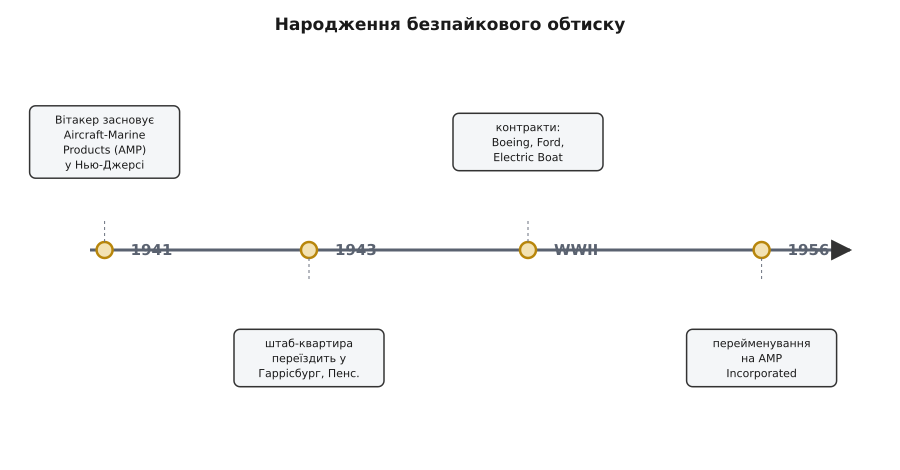

# 📜 Як народилося з'єднання обтиском

Тримаючи в руках обтискні кліщі, легко думати, що обтиск — річ самоочевидна: ну звісно, стисни латунне крило довкола дроту, воно й триматиме. Але це ілюзія заднього розуму. Пів століття електрику з'єднували інакше — **паяли**: розігрівали припій, він затікав у стик, застигав, і мідь трималася в олов'яній краплі. Паяння здавалося єдиним «справжнім» способом з'єднати метал із металом; усе інше виглядало як тимчасова скрутка. Ідея, що можна **взагалі не гріти** — просто чавнути холодний метал так, щоб він сам зварився, — була не просто новою, вона суперечила інженерній інтуїції часу. Хтось мусив довести, що холодний тиск тримає **надійніше** за розігрітий припій. І довести не в лабораторії заради статті, а там, де ціна помилки — літак, що падає.

Ця вставка — про те, як обтиск народився: чому паяний контакт почав підводити саме тоді, коли ставки різко зросли; хто побачив вихід у безпайковому стиску; і чому та перша воєнна форма контакту — відкритий латунний барабан з відігнутими крилами — дійшла до нас майже незмінною, і саме її сьогодні загортають кліщі на столі радіоаматора.

## Чому паяння почало підводити саме у війну

Щоб зрозуміти, навіщо взагалі шукали заміну паянню, треба відчути, що змінилося на межі 1930–40-х. Доти електрику з'єднували в умовах, де паяння працювало пречудово: телефонні станції, радіоприймачі, проводка в будинках — усе це нерухоме, тепле, просторе. Паяльник, флюс, крапля припою — і стик служить десятиліттями. Паяння підводить не саме по собі; воно підводить у конкретних умовах, і саме ці умови настали разом із воєнною авіацією й флотом.

Перше, що вбиває паяний стик, — **вібрація**. Літак кінця 1930-х — уже не фанерна етажерка: потужніший мотор, вищі швидкості, вищі стелі, і разом із ними — трясіння й ударні навантаження, яких попередні машини не знали. За матеріалами самої AMP, нові високоякісні літаки воєнного покоління працювали на висотах, при перевантаженнях і вібраціях, «драматично» вищих за попередників — і саме це стало вироком паяним контактам. Проблема тонша, ніж «трясе — відпаялося». Річ у **місці**, де припій уривається.

Розберімо це повільно, бо тут суть. Коли ви заливаєте пучок мідних жилок припоєм, олово затікає між волосинами й підіймається трохи вище — доти, доки є куди затікати. Виходить різкий перехід: **нижче** дріт просякнутий твердим припоєм і майже негнучкий; **вище** — вільні м'які мідні жилки, які гнуться. І рівно на межі, де тверде зустрічає м'яке, при кожному коливанні виникає **концентратор напруги** (англ. *stress riser* — «підіймач напруги»): у цій точці згин збирається весь, метал багато разів перегинається туди-сюди — і від утоми тріскається. Не припій відвалюється; ламається мідна жила рівно там, де скінчився припій. Що сильніша вібрація, то швидше настає ця втомна тріщина.


*Ліворуч — чому паяння ламається: припій робить різкий перехід від жорсткого до м'якого, і на цій межі вібрація збирає всю напругу (червоне коло) — метал перегинається й тріскається. Праворуч — чому обтиск тримає: тиск чавить круглі жили в щільний стільник, оксидні плівки тріскають і сходять, чистий метал притискається до чистого й зварюється холодним, без різкої межі, де б збиралася тріщина.*

Другий убивця — **тіснота й швидкість**. Воєнне виробництво — це не одна ретельно спаяна станція, а десятки тисяч однакових вузлів, які треба зібрати швидко, часто в тісняві планера чи корпусу корабля, куди паяльник фізично не підлізе, а розігрів поряд з паливом чи ізоляцією — ще й небезпечний. Паяння повільне: розігрій, дай затекти, дай застигнути, перевір. Помнож на масштаб війни — і повільність стає вузьким місцем.

Третій — **флюс і людський чинник**. Щоб припій пристав, поверхню треба очистити флюсом; лишки флюсу згодом роз'їдають метал, якщо їх не змити. А ще паяний стик добрий рівно настільки, наскільки твердою була рука того, хто паяв: холодна пайка (недогрів), перегрів, забагато чи замало припою — усе це приховані вади, які вилізуть уже в польоті. Масштабувати «золоті руки» на воєнні обсяги неможливо.

> 🔧 **Навіщо це.** Ці три слабини — тріщина від вібрації на межі припою, повільність у тісняві, залежність від майстра — це не історична екзотика, а рівно ті самі причини, чому й сьогодні на макеті свіжий обтиск часто надійніший за поспіхом припаяний кінець. Розуміючи, від чого відмовлялися 1941 року, ви розумієте, що обтискні кліщі вирішують не вигадану, а дуже конкретну фізичну проблему: прибрати жорстку межу, де метал утомлюється, і прибрати нагрів, який ту межу створює.

## Анкас Вітакер і фірма, названа за двома стихіями

Людину, що звела це докупи, звали **Анкас Еней Вітакер** (англ. *Uncas Aeneas Whitaker*, 22 березня 1900 — вересень 1975) — американський інженер. Ім'я звучить незвично навіть для англійського вуха: «Анкас» — з роману Фенімора Купера «Останній з могікан», «Еней» — з античного епосу; це американська родинна забаганка з іменами, а не етнічний маркер. Вітакер був американцем і за громадянством, і за освітою, здобутою суто в США: диплом інженера-механіка Массачусетського технологічного інституту (MIT), інженера-електрика Технологічного інституту Карнегі (Carnegie Institute of Technology, нині Carnegie Mellon) і диплом правника Клівлендської юридичної школи. Механік, електрик і юрист в одній особі — рідкісне поєднання, яке потім дуже стало в пригоді фірмі, що жила з патентів на з'єднувачі.

Важлива деталь про статус доказовості: **особа, дати життя, освіта й американська належність Вітакера — усталені** (збігаються у Вікіпедії та в довідці ETHW — Engineering and Technology History Wiki, майданчику історії техніки від IEEE). Тут нема жодної потреби когось «перепривласнювати»: це послідовно американська історія, без імперських нашарувань.

Перед власною справою Вітакер устиг попрацювати там, де вчаться робити речі надійними: у **Westinghouse Electric**, у **Hoover Company** (побутова техніка, де надійність масового виробу — питання виживання фірми), а безпосередньо перед заснуванням — старшим інженером у **American Machine & Foundry** (AMF) у Нью-Йорку. Тобто до ідеї безпайкового контакту він прийшов не студентом-мрійником, а зрілим інженером, що вже бачив зсередини і велику електротехніку, і масове виробництво. Цей послужний список — **усталений**, він повторюється в кількох незалежних оглядах історії AMP (FundingUniverse, Encyclopedia.com).

Тепер сама назва фірми, бо вона багато пояснює про задум. **15 вересня 1941 року** Вітакер заснував **Aircraft-Marine Products** — «авіаційно-морські вироби». Назва — це прямо технічне завдання, вписане у вивіску: контакти для **літаків** і для **кораблів**. Не «електричні з'єднувачі взагалі», а саме для двох середовищ, де паяння підводило найдужче — де вібрація, теснота й вимога швидкості збіглися разом. Абревіатура **AMP** прийшла звідси, з двох стихій; лише 1956 року, ставши публічною компанією, фірма офіційно перейменувалася на **AMP Incorporated**, а «Aircraft-Marine» лишилося в самій абревіатурі як спомин про початок.

Про точну дату й обставини заснування варто чесно розмежувати рівні доказовості. Що фірму засновано **1941 року** заради безпайкових контактів для авіації й флоту — **усталено** (Вікіпедія, ETHW, галузеві історії). А ось романтична конкретика — «15 вересня 1941 року о 15:30 у кімнаті над невеликим грецьким рестораном у Нью-Джерсі» — походить із **фірмової оповіді самої AMP/TE** (нинішній власник марки — TE Connectivity). Ця версія стабільно повторюється, вона мила й, найпевніше, правдива, але за походженням це **корпоративна легенда початку**, а не рядок із незалежного документа; тому точний час і грецький ресторан подаю саме як добре засвідчений переказ фірми, а не як засвідчений судово факт. Рік, місто заснування (Нью-Джерсі) і мета — тверді; хвилина й ресторан — фірмовий фольклор.

Що сталося далі з географією, теж варто зафіксувати, бо джерела на перший погляд «сперечаються». Одні кажуть «заснована в Нью-Джерсі», інші — «в Гаррісбурзі, Пенсильванія». Насправді суперечності нема: фірма **почалася** в Нью-Джерсі 1941-го, з воєнними замовленнями швидко переросла приміщення, переїхала на більший майданчик у **Глен-Рок** (Glen Rock), а **1943 року** перенесла штаб-квартиру до **Гаррісбурга** (Harrisburg) — де AMP і стала врешті світовим гігантом з'єднувачів. Ланцюг «Нью-Джерсі → Глен-Рок → Гаррісбург (1943)» **усталений** (FundingUniverse, Encyclopedia.com збігаються). Тримаймо це як просту хронологію переїздів, а не як розбіжність джерел.


*Народження безпайкового обтиску — коротка хронологія. Фірма з двома стихіями в назві починається 1941-го, воєнні замовлення женуть її з Нью-Джерсі до Гаррісбурга (1943), а сам обтиск за ці роки з ризикованої новинки стає стандартом воєнної проводки. «AMP Incorporated» — уже пізніша, публічна назва (1956).*

## Холодне зварювання: чому тиск тримає без нагріву

Ось серце всієї історії — фізична ідея, яка й досі здається трохи чаклунством: **два шматки металу можна зварити, не гріючи їх, самим лише тиском**. Не сплющити, не защемити механічно, а саме **зварити** — так, щоб на межі вони стали одним металом. Це називають **холодним зварюванням** (англ. *cold welding*), і саме воно робить обтиск надійним. Розберімо, чому воно взагалі можливе, бо без цього обтиск виглядає як «ну просто сильно стиснули».

Уявіть дві на око гладенькі металеві поверхні. Насправді жодна поверхня не гладенька: під мікроскопом це гори й западини, дрібні вершечки — **виступи** (англ. *asperities* — мікронерівності). Коли ви просто кладете метал на метал, вони торкаються лише вершечками виступів — крихітною часткою видимої площі. Тому й контакт поганий: справжня площа дотику мізерна. Але це ще пів біди. Головна перешкода — **оксид**: мідь, латунь, майже будь-який метал миттю вкривається на повітрі тонкою плівкою окису, і саме ця плівка ізолює, не пускає метал до металу. Два чисті метали, притиснуті чистими боками, самі по собі **злипаються** (це й є холодне зварювання) — але в житті між ними завжди стоїть оксидна плівка.

Тепер дивимось, що робить обтиск. Кліщі тиснуть із великою силою — і м'яка мідь та латунь не просто стискаються, вони **течуть**: метал під тиском поводиться майже як дуже густа рідина, розповзається, шукає, куди подітися. Круглі в перерізі мідні жилки чавляться одна об одну, їхні боки сплющуються, і пучок волосин перетворюється на щільний **стільник** без порожнин. І ось ключове: коли метал тече, його поверхня **розтягується й тріскається**, а разом із нею **тріскається й сходить тендітна оксидна плівка**. З-під розірваного оксиду назовні вилазить свіжий, чистий метал — і рівно в цю мить його притискають до такого ж свіжого чистого металу сусідньої жилки чи стінки барабана. Чистий метал до чистого металу під тиском — і вони **зварюються холодними**, без жодного нагріву.

Результат по-англійськи описують двома словами, які варто знати: з'єднання виходить **cold-welded** (холоднозварене) і **gas-tight** (газонепроникне). Друге слово — не про герметичність від протікань, а про **довговічність контакту**: у місцях холодного зварювання не лишається щілин, куди могли б проникнути повітря й волога, тож метал там **не окислюється з часом**. Паяний стик старіє, обтиснутий — практично ні, бо в зварених точках просто нема поверхні, яку є чому окислювати.

І тепер стає видно, чому обтиск обходить усі три слабини паяння разом:

```
Паяння                          Обтиск (холодне зварювання)
────────────────────────────    ─────────────────────────────────
жорсткий наплив → різка межа  → тиск, метал м'яко тече, межа розмита
                → тріщина від     → нема концентратора → тримає
                   вібрації           під вібрацією
розігрів, флюс, застигання    → один холодний рух, без нагріву й флюсу
якість = тверда рука майстра  → якість = сила й форма інструмента
```

> 🔧 **Навіщо це.** Оце й є прихована відповідь на питання «чому не можна просто стиснути плоскогубцями». Холодне зварювання стається **лише** тоді, коли метал по-справжньому потік і оксид зійшов — а це вимагає і великого тиску, і **правильної форми** тиску, яка чавить у потрібних напрямках. Плоскогубці дають силу, але не форму: вони плющать контакт убік, метал тече «не туди», оксид місцями лишається, а стільник не збирається. Тому обтискні кліщі — не «сильніші плоскогубці», а інструмент, що задає геометрію течії металу так, щоб холодне зварювання взагалі відбулося. Вітакер продавав не «стиск», він продавав **надійне холодне зварювання на конвеєрі** — те, чого паяльник у тісняві планера дати не міг.

Статус доказовості фізики: механізм холодного зварювання через **течію металу, руйнування оксидів на виступах і газонепроникний зварок** — це **усталене** інженерне пояснення, яке однаково викладають і фахові тексти про фізику обтиску, і галузеві матеріали (напр. розбір фізики обтиску в Hackaday). Слово «asperity» (виступ) — стандартний термін трибології й металургії контакту, а не пізніша вигадка маркетологів. Тут ми на твердому ґрунті: це не легенда про фірму, а перевірна фізика.

## Відкритий барабан: чому перша форма дожила до наших кліщів

Лишається пояснити останнє — чому саме **відкритий барабан** (англ. *open barrel*), та розкрита латунна форма з відігнутими крилами, стала тим, що ми досі тиснемо. Адже можна уявити безліч способів обхопити дріт; чому переміг саме цей профіль, народжений у воєнному контакті?

Згадаймо, що фізика вимагає від форми. Холодне зварювання станеться, якщо метал **потече** й **обійме** жили щільно, без порожнин. Значить, контакт має початково бути **розкритим** — щоб завести в нього оголений дріт, — а тоді його стінки треба **загорнути досередини** так, щоб вони охопили пучок з усіх боків і чавнули жили одна об одну. Саме це й робить відкритий барабан: латунний жолобок із відігнутими назовні крилами приймає дріт, а губка інструмента підхоплює кінчики крил і **закручує їх усередину**, доки вони не зустрінуться над жилою, обіймаючи її щільним кільцем. Крила течуть, жили чавляться в стільник, оксид сходить — усе, що треба для холодного зварювання, дає ця геометрія за один рух.

Ця форма несе в собі ще одну мудрість, теж родом із воєнної надійності. Барабан робили з **двома парами крил**, і кожна пара має свою роботу. Передня, ближча до контакту, лягає на **оголену жилу** — це електричний зварок, метал до металу. Задня лягає на **ізоляцію** дроту, не оголюючи її, — і це чисто механічне тримання: коли дріт смикнуть чи затрясе, тягне за ізоляцію, а не за тонкі зварені жилки. Так вібрація, що вбивала паяний стик, тут гаситься **до** того, як дійде до електричного контакту: механічна пара крил бере ривок на себе. Форма, по суті, вписала в себе відповідь на головну ваду попередника.

Чому ж вона дожила до наших днів майже незмінною? Через ту саму логіку, що робить стандартом будь-яку добру інженерну форму. Відкритий барабан виявився **простим у штампуванні** (латунну стрічку легко висікти й відігнути крила масово й дешево), **надійним** (дає холодне зварювання за один тиск) і **придатним до автоматизації** (стрічку контактів зручно подавати в прес). Коли форма одночасно дешева, надійна й механізовна, вона витісняє альтернативи й костеніє в стандарт. Крок сітки, ширина крил, профіль — усе це усталилося, і пізніші сімейства контактів (і Dupont-геометрія хедерів, і роз'єми JST) успадкували ту саму ідею відкритого барабана з двома парами крил. Тому кліщі, що загортають сьогодні перемичку макета, роблять по суті **те саме**, що воєнний прес 1940-х: беруть розкриту латунну форму й закручують її крила досередини у знайому «B»-подібну дугу.

Статус доказовості цього блоку варто розділити. Що **AMP від початку робила саме безпайкові обтискні контакти-наконечники** («короткий металевий барабанчик із кільцем на кінці та обтискний інструмент до нього») і що вони одразу пішли у воєнну авіацію й флот — **усталено** (це прямо описують історії AMP і сама TE). А ось твердження «саме AMP першою у світі винайшла обтиск як такий» тримаю **обережно, як правдоподібне, але не як доведену абсолютну першість**: обтискні й безпайкові з'єднання в різних формах пробували й раніше, і чесніше сказати, що **AMP зробила обтиск надійним, масовим воєнним стандартом і побудувала на ньому цілу індустрію**, ніж наліплювати їй ярлик «винахідник обтиску» без первинного патентного доказу першості. Її історична роль велика й без перебільшень: вона перетворила ризиковану ідею холодного зварювання тиском на буденний, перевірений спосіб з'єднувати дріт — той самий, яким ми користуємося досі.

## Що з цієї історії лишається в руках

Якщо звести все до кількох думок, які реально змінюють те, як ви дивитесь на інструмент у руці, — вони такі.

По-перше, обтиск народився не як «зручніша скрутка», а як **відповідь на конкретну фізичну катастрофу**: паяний стик тріскався від вібрації там, де жорсткий припій зустрічав гнучку мідь, і це стало нестерпним рівно тоді, коли літаки й кораблі війни почали трясти проводку сильніше, ніж будь-коли доти. Обтиск прибирає саму причину — жорстку межу, — бо метал у ньому тече, а не застигає краплею.

По-друге, надійність обтиску тримається на **холодному зварюванні**: тиск змушує метал текти, оксидні плівки тріскають і сходять, чистий метал зварюється з чистим без нагріву, і в цих точках уже нема чому старіти. Це не «сильно стиснули» — це справжній зварок, просто холодний. І він стається лише під правильним тиском правильної форми, чого голими плоскогубцями не досягти.

По-третє, **відкритий барабан із двома парами крил** — воєнна форма, що вписала в себе відповідь на ваду попередника (механічні крила беруть вібрацію на себе, електричні — тримають зварок) і виявилася настільки вдалою в штампуванні й автоматизації, що дожила до сьогоднішніх Dupont- і JST-контактів майже незмінною.

І по-четверте, коротка вправа на чесність із фактами. Тверде: американський інженер Анкас Вітакер, фірма Aircraft-Marine Products, 1941 рік, безпайкові контакти для авіації й флоту, переїзд до Гаррісбурга 1943-го, перейменування на AMP Incorporated 1956-го, фізика холодного зварювання. Фірмовий фольклор, поданий як такий: точна хвилина й грецький ресторан у Нью-Джерсі. Тримане обережно: абсолютна «першість» AMP у винаході обтиску — радше «зробила стандартом», ніж «винайшла з нуля». Знати цю різницю варто не заради педантизму, а щоб не переказувати гарну корпоративну легенду як історичний факт — і водночас не применшувати справжню, добре засвідчену роль людини, яка довела інженерам недовірливого до нагрівання світу, що холодний тиск тримає надійніше за припій.
