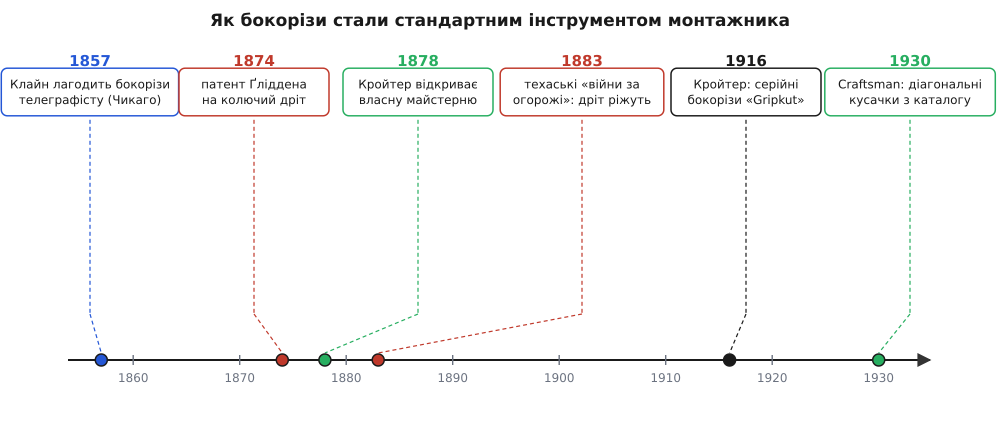

# 📜 Як бокорізи стали інструментом монтажника

У більшості історій про інструмент є ім'я на першій сторінці: хтось один щось вигадав, запатентував, і далі все пішло від нього. З бокорізами так не вийде. Якщо шукати «винахідника діагональних кусачок», пошук ні до кого не приведе — і це не тому, що ім'я загубилося в архівах, а тому, що його **ніколи не було**. Інструмент не з'явився в чиїйсь голові готовим; він **виріс** із простого важеля з ріжучою кромкою, поступово, руками сотень ковалів, під тиском цілком конкретної потреби, яка вибухнула в Америці другої половини XIX століття. Зрозуміти, звідки взявся цей маленький важіль на столі електронника, — значить простежити, як потреба перекушувати дріт із рідкісної стала масовою, і як відповідь на неї переїхала з ковальського горна на заводський конвеєр.

## Кусачки старші за будь-який патент

Сама ідея — важіль, що на одному кінці стискається рукою, а на іншому зводить дві тверді кромки, — давніша за писану історію інструмента. Пінцети, обценьки, кліщі коваля існували тисячоліттями: щоб тримати гаряче залізо, гнути, перекушувати цвяхи. Кусачки — це той самий важіль, у якого губки-захвати замінили на губки-леза. Ніякого «моменту винаходу» тут немає: коваль, якому треба було перекусити м'який залізний прут, просто заточував внутрішній бік губок своїх кліщів — і одержував кусачки. Форма визрівала повільно й у багатьох місцях одночасно, як визрівають ножиці чи молоток. Тому питання «хто винайшов кусачки» таке саме беззмістовне, як «хто винайшов ложку».

> 🔧 **Навіщо це.** Відсутність винахідника — не пробіл в оповіді, а сама її суть. Бокорізи — приклад інструмента, що еволюціонував під потребу, а не народився з ідеї. Це пояснює, чому їхня форма така «сама собою зрозуміла»: її не проєктували з нуля, її **відшліфував** попит. І пояснює, чому по всьому світу бокорізи виглядають майже однаково, хоч робили їх незалежно десятки фірм: усі йшли до тієї самої форми з того самого боку — від важеля з кромкою до найзручнішого способу дістатися дроту.

Питання, отже, не в тому, **хто** зробив перші кусачки, а в тому, **чому** з усіх кусачок саме діагональні — зі скошеною навскіс головою й короткими губками — стали стандартним інструментом того, хто монтує дроти. І відповідь починається не в майстерні інструментальника, а в американському степу.

## Америка раптом заростає колючим дротом

До 1870-х Великі рівнини Америки були майже безлісі й неогороджені. Фермер, що осідав на новій землі, мусив якось відмежувати своє поле від чужої худоби, але дерева на паркан не було, а привезена залізницею деревина коштувала дорого й важила багато. Потрібне було щось дешеве, легке й таке, що худоба поважає. Відповіддю став **колючий дріт** (англ. *barbed wire*) — і його поява за кілька років перетворила степ на мережу огорож, а заразом створила цілу країну людей, яким тепер регулярно треба було **різати тугий сталевий дріт**.

Історія колючого дроту сама по собі показова, бо теж не має одного автора. Поштовхом стала проста витівка: 1873 року на сільській виставці в Де-Калбі (штат Іллінойс) якийсь Генрі Роуз (англ. *Henry B. Rose*) показав дерев'яну планку з металевими шпичками — щоб корова не пхалася в паркан. Планку побачили троє місцевих і кожен по-своєму взявся зробити те саме, але з самого дроту. З цього змагання вийшла ціла «велика четвірка» (англ. *the Big Four*): Джозеф Ґлідден (англ. *Joseph Glidden*), Джейкоб Гейш (англ. *Jacob Haish*), Айзек Елвуд (англ. *Isaac Ellwood*) і Чарлз Вошберн (англ. *Charles Washburn*). Ґлідден додав головне — другий дріт, скручений із першим, що затискав шпичку й не давав їй сповзати, — і на цю конструкцію 24 листопада 1874 року дістав патент. *(Усталений факт: патент Ґліддена US 157124, 24.11.1874; пізніше, 1892 року, Верховний суд США у справі про пріоритет назвав саме Ґліддена «батьком колючого дроту» — але це присуд про патент, а не про те, що ідея була його одного: вона визріла зі спільного змагання після виставки Роуза.)*

Далі цифри говорять самі за себе. Виробництво колючого дроту підскочило з приблизно **10 000 фунтів** 1874 року до **80 500 000 фунтів** 1880-го — за шість років у вісім тисяч разів. *(Усталений факт, за архівними даними виробників дроту.)* За кожним таким фунтом стояла людина, яка цей дріт натягувала, лагодила, а часом і зрізала — і робила це руками, не машиною. Раптово по всьому континенту знадобився надійний інструмент, здатний перекушувати тугий загартований дріт день у день, не тупіючи й не кришачись. Попит на дротяні кусачки з ремісничої дрібниці став масовим і сталим.

Наскільки гострою була ця потреба, видно з того, що навколо самого різання дроту спалахнула справжня війна. Улітку й восени **1883 року** посушливий Техас охопили «війни за огорожі» (англ. *fence-cutting wars*): безземельні скотарі, яким обгороджений степ перекрив доступ до трави й води, ночами різали чужі паркани. Різали організовано — озброєні ватаги з назвами на кшталт «Сови» чи «Блакитні дияволи»; збитки за одну осінь оцінили в **20 мільйонів доларів**, і щонайменше троє людей загинули в сутичках. У січні 1884-го Техас мусив зробити різання огорожі кримінальним злочином. *(Усталений факт, за матеріалами Історичного товариства Техасу.)* Для нас тут важлива не політика, а одне: у ті роки **кусачки для дроту стали в Америці побутовою річчю**, як сокира чи лопата. Ринок, на якому такий інструмент можна продавати тисячами, вже існував — лишалося дати йому інструмент кращий за саморобний.

## Телеграф і струм: другий, тонший попит

Поки степ обростав колючим дротом, містом уже бігли інші дроти — телеграфні, а згодом телефонні й силові. І тут потреба різати дріт була не грубою, а **точною**: монтажник на стовпі мусив перекусити мідну чи сталеву жилу чисто, близько до затискача, часто однією рукою й не дивлячись. Саме з цього боку в історію входить ім'я, яке варто назвати правильно.

1857 року німецький емігрант **Матіас Клайн** (нім. *Mathias Klein*) тримав у Чикаго ковальську майстерню. За переказом самої фірми, до нього прийшов телеграфний монтажник зі зламаними бокорізами — тріснула одна половинка. Клайн викував нову половину, приклепав до старої, і монтажник пішов. Невдовзі той повернувся: тепер зламалася **друга**, стара половина. Клайн викував і її — і так на світ з'явилися перші суцільно «клайнівські» кусачки. *(Це фірмова легенда Klein Tools; датою заснування вважають 1857 рік — правдоподібно, але сама сценка про дві половинки — саме переказ, а не документ.)*

Тут критично важлива одна деталь, яку легко проґавити. Клайн **не винайшов** бокорізи — він їх **полагодив**. Монтажник прийшов до нього вже з готовим інструментом; Клайн лише зробив його кращим і почав робити такі самі на продаж. Це чудово лягає в загальну картину: діагональні кусачки на той час уже існували як звична річ, просто ще не як фабричний товар зі сталим іменем. Klein Tools виросла разом із телеграфом, телефоном і електрикою, а її кусачки для монтажника стали такими типовими, що в американському побуті лінійні пасатижі й досі часом звуть просто «клайнами» (англ. *Kleins*) — рідкісний випадок, коли назва фірми стала загальною назвою інструмента. *(Усталений факт: «Kleins» як загальна назва лінійних пасатижів фіксують і словники, і фахова література.)*

Отже, на злам століть зійшлися два потоки попиту. Один — грубий і масовий: колючий дріт, огорожі, ферма. Другий — точний і зростаючий: телеграф, електрика, монтаж. Обидва потребували інструмента, що перекушує дріт, і обидва вже не вдовольнялися саморобом від сільського коваля. Сцену для переходу було підготовлено.

*Ланцюг подій, що перетворив саморобну ковальську дрібницю на стандартний фабричний інструмент монтажника. Угорі — картки подій; кружечок на осі показує рік кожної. Ліворуч визріває попит (Клайн лагодить бокорізи телеграфісту, 1857; вибух колючого дроту після патенту Ґліддена, 1874; техаські «війни за огорожі», 1883), праворуч на цей попит відповідає фабрика (майстерня Кройтера, 1878; його серійні бокорізи «Gripkut», 1916; діагональні кусачки під маркою Sears Craftsman у каталозі, 1930).*

## Від горна до конвеєра: Кройтер і марка Craftsman

Перехід від ковальських кусачок до масового заводського інструмента добре видно на одній конкретній фірмі — **Kraeuter & Company** з Ньюарка (штат Нью-Джерсі). Її засновник, теж німецький емігрант, **Авґуст Кройтер** (нім. *August Kraeuter*), приїхав до Америки 1859 року, спершу працював у зброярів, а **1878 року** відкрив власну справу з виготовлення інструмента. Фірму офіційно зареєстрували корпорацією **1907 року**, і саме вона стала одним із взірцевих виробників якісних пасатижів і кусачок. *(Усталений факт, за архівами колекціонерів інструмента; прізвище Kraeuter українською точніше передавати як «Кройтер».)*

Показова тут одна деталь, що відразу видає, наскільки бокоріз тоді був у центрі уваги інженерів фірми: **1916 року** Кройтер почав продавати пасатижі No. 1873 «Gripkut» із **бічними ріжучими кромками** — тобто вбудував функцію бокоріза прямо в слюсарні пасатижі. Номер моделі — 1873 — сам по собі кумедний перегук із роком, коли Роуз показав ту дерев'яну планку, хоч це, найпевніше, збіг. *(Правдоподібно, документально не підтверджено, що номер обрано навмисне.)* Головне інше: до 1910-х різальна кромка перестала бути екзотикою й стала штатною частиною масового інструмента.

А тепер про той момент, коли фабричний бокоріз остаточно ввійшов у кожен дім. **1927 року** мережа універсальних магазинів Sears, Roebuck зареєструвала торгову марку **Craftsman** — назву, яку керівник господарчого відділу Артур Барровз (англ. *Arthur Barrows*) викупив у дрібної фірми Marion-Craftsman Tool Company за 500 доларів. *(Усталений факт: марку Craftsman зареєстровано 20 травня 1927 року.)* Sears сам інструмент не робив — його на замовлення виготовляли інші фірми, а Sears продавав під власною маркою через свій величезний поштовий каталог, що доходив до найглухішого хутора. І ось **1930 року** контракт на пасатижі та кусачки для Craftsman дістався саме Кройтеру: він постачав лінійні й електромонтажні пасатижі, кусачки «пуансонного» типу — і **діагональні кусачки**. *(Усталений факт, за атрибуцією ранніх кусачок Craftsman виробництву Kraeuter — їх упізнають за характерним ромбовим накатом на ручках.)*

Це і є та точка, де історія замикається. Через каталог Sears **діагональні кусачки заводської якості** — колись саморобна ковальська штука — стали товаром, який будь-хто в Америці міг замовити поштою за помірні гроші й одержати додому. Інструмент монтажника перестав бути привілеєм фахівця з міста й став масовою, звичною, доступною річчю. Те, що починалося як заточені губки на ковальських кліщах, пройшло крізь степовий вибух попиту на колючий дріт, крізь телеграфні стовпи й через заводський конвеєр — і осіло стандартом.

> 🔧 **Навіщо це.** Уся ця дуга пояснює, чому в бокорізів немає «оригіналу» й «еталона», зате є десятки майже однакових виконань. Форму задав не автор, а потреба: скошена голова, щоб дістатися впритул; короткі губки, щоб вистачало сили на тугий дріт; кромки, загартовані під мідь і залізо, але не під струну. Кожен виробник приходив до цієї форми самостійно, бо всіх тягнув до неї той самий попит. Тому й сьогодні, беручи зі столу дешеві китайські бокорізи чи дорогі фірмові, тримаєш ту саму відшліфовану століттям відповідь на одне запитання: як людині рукою чисто перекусити дріт.

Варто, до речі, тримати в голові й межу цієї відповіді, закладену ще в степу. Колючий і телеграфний дріт бували різної товщини й твердості, і саме тому монтажник завжди мусив знати, який дріт його кусачки подужають, а який зіпсує кромку. Ця залежність різальної спроможності від **товщини й матеріалу дроту** нікуди не поділася й досі; хто хоче розуміти, чому одні виводи ріжуться легко, а інші ні, тому варто окремо розібратися, як міряють товщину дроту й що вона означає для інструмента.

> 🔗 Щоб зв'язати «тугий дріт» із конкретними числами, знадобиться поняття калібру дроту: що таке номер калібру, як він відповідає діаметру в міліметрах і чому тонший дріт кусається легше. Коротко — калібр це стандартний номер товщини дроту, і що більший номер, то тонший дріт. Докладно: [калібр дроту](topic:electronics/wire-gauge).
