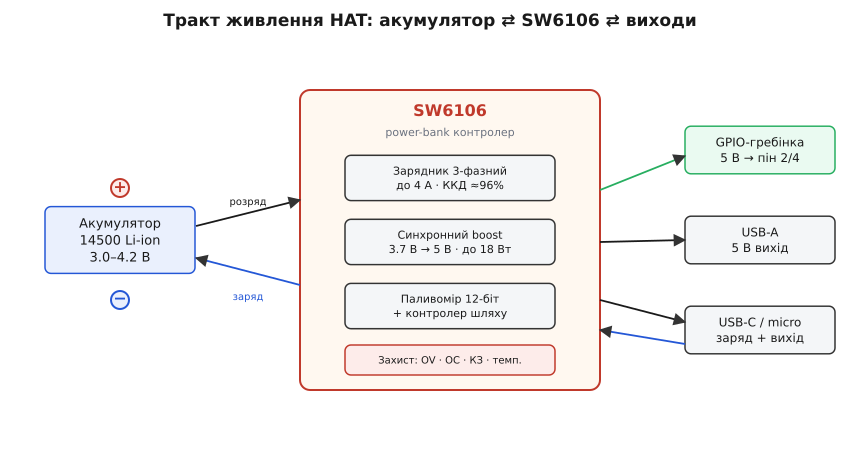
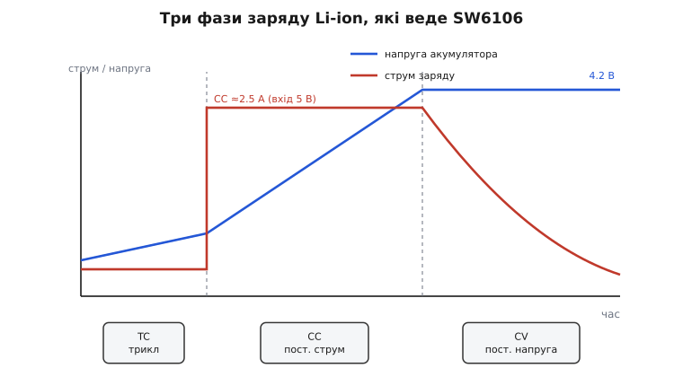
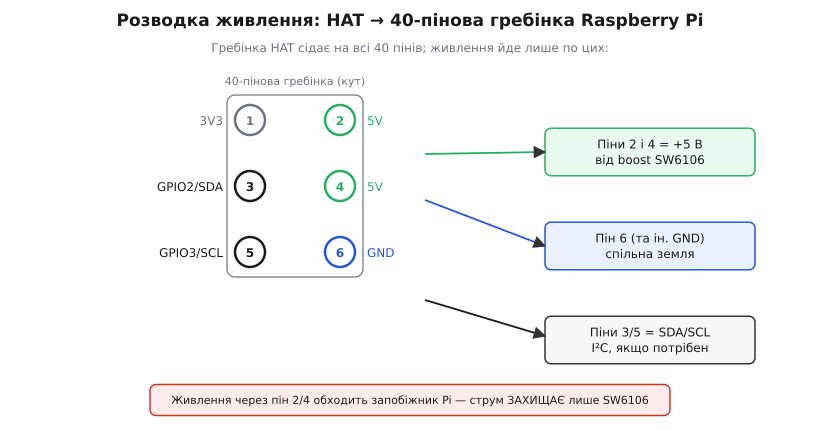

# Li-ion Battery HAT для Raspberry Pi

<preknowlist>
- [Літій-іонний акумулятор](book:power/videx-14500) — 3.7 В номінал, 4.2 В повний, 3.0 В межа розряду; чому його не можна ні перезарядити, ні глибоко розрядити.
- [40-пінова гребінка Raspberry Pi](book:boards/gpio-extension-board) — як влаштована гребінка, які піни несуть 5 В і землю; HAT сідає саме на неї.
- [Підвищувальний перетворювач (boost)](book:electronics/boost) — як зі змінних 3–4.2 В зробити стабільні 5 В і чому це не «просто резистор».
- [Шина I²C](book:communications/i2c-bus) — дві лінії SDA/SCL, адреса пристрою, читання регістрів; знадобиться, якщо хочеш опитувати контролер.
</preknowlist>

Raspberry Pi живиться від 5 вольтів і не любить, коли вони зникають: файлова система на microSD погано переживає раптове знеструмлення, а «майже 5 В» замало — плата починає скидати частоту або гасне. Тому щойно проєкт має поїхати з розетки — робот, метеостанція на балконі, датчик у полі — постає та сама задача: дати Pi чисті 5 В від акумулятора, при цьому акумулятор ще й заряджати, і бажано робити це так, щоб не спалити ні елемент, ні плату.

Li-ion Battery HAT (виробник — Waveshare) — це маленька плата саме під цю задачу. Вона сідає зверху на Raspberry Pi як «капелюх» (англ. HAT — Hardware Attached on Top), тримає в собі один літій-іонний елемент формату 14500 і віддає з нього стабілізовані 5 В прямо в гребінку Pi. Одна мікросхема на платі одночасно заряджає елемент від USB і піднімає його напругу до 5 В для живлення — і робить це з усіма запобіжниками, яких вимагає літій.

## Що це за річ і як її впізнати

Плата завбільшки приблизно з половину Raspberry Pi — **65 × 30 мм**. Її легко впізнати за кількома прикметами:

- **Тримач акумулятора** під елемент **14500** (циліндр, зовні як пальчикова батарейка AA, але це літій-іон на 3.7 В — не сплутати з лужною AA на 1.5 В: вставити «пальчик» сюди не можна й не треба).
- **40-пінова гребінка** знизу — нею плата сідає на Raspberry Pi.
- Три роз'єми по краю: **USB Type-C**, **USB Type-A** і **micro-USB**. Type-C і micro-USB заводять заряд усередину; Type-C і Type-A можуть і віддавати струм назовні (плата працює і як маленький повербанк).
- **Кнопка живлення** й **ряд світлодіодів**: п'ять показують рівень заряду, окремий блимає при розряді батареї, ще один світиться під час швидкого заряду.

> 🔧 **Навіщо це.** Формат 14500 обрано не випадково: він короткий, і плата з ним не стирчить над Pi так, як стирчав би 18650. Розплата — ємність. Типовий 14500 тримає близько 700–900 мА·год проти 2500–3500 мА·год у 18650, тож ця плата — про компактність і акуратне резервне живлення, а не про багатогодинну автономність. Треба довго — дивись у бік HAT-ів під 18650 чи 21700.

Ключова думка: **Li-ion Battery HAT — це не «батарейка», а зарядник плюс перетворювач плюс захист в одному корпусі**, а сам елемент — змінний. Уся інженерія плати захована в одній мікросхемі, тож із неї й почнемо.

## Одна мікросхема, що робить усе: SW6106

Серце плати — **SW6106** (виробник — ISMARTWARE), контролер повербанків у корпусі QFN-40. Це той клас мікросхем, який стоїть усередині звичайних кишенькових повербанків: у нього вбудовано відразу все, що потрібно, щоб керувати одним літієвим елементом і роздавати з нього живлення.

Що саме він поєднує:

- **Зарядник** (англ. switching charger — імпульсний, а не лінійний) зі струмом заряду до **4 А** і ККД до **96%**. Імпульсний означає, що зайву напругу він не «пропалює» в тепло, як лінійний, а перекачує порціями через котушку — тому й ККД високий, і плата не гріється.
- **Синхронний boost** (підвищувальний перетворювач) потужністю до **18 Вт** і ККД до **95%**: бере 3–4.2 В від елемента й піднімає до 5 В (а за протоколами швидкого заряду — і до 9 чи 12 В на USB-виходах).
- **Паливомір** (англ. fuel gauge) — 12-бітний АЦП, що оцінює рівень заряду й запалює ті самі п'ять світлодіодів.
- **Контролер шляху живлення** (англ. power path) — вирішує, звідки зараз брати струм: від USB, коли той під'єднано, чи від акумулятора, коли USB від'єднали.
- **Захист**: від перенапруги на виході, надструму, короткого замикання й перегріву елемента (через терморезистор).

SW6106 — не унікальний винахід цієї плати, а серійний контролер, який Waveshare ставить і в ширшу лінійку своїх живильних плат (Li-polymer Battery HAT, UPS HAT та інші) — усі вони мають спільну архітектуру, а різняться форматом елемента й дрібницями. Спільне про цю родину — [оглядова стаття про живильні HAT-и Waveshare](book:power/power-hat-family); тут говоримо лише про специфіку Li-ion-варіанта з елементом 14500.

> 🔧 **Навіщо це.** Розуміння, що вся плата — це «обв'язка навколо SW6106», відразу дає правильну ментальну модель. Хочеш дізнатися граничний струм, поведінку при перегріві чи протоколи заряду — шукай не «характеристики HAT», а **datasheet SW6106**: плата успадковує їх майже один в один.

## Як влаштований тракт живлення

Складімо шлях струму від елемента до Raspberry Pi. Він двобічний: у один бік іде заряд, у інший — розряд, і напрямок обирає контролер шляху.


*Тракт живлення: акумулятор через SW6106 (зарядник + boost + паливомір + захист) віддає 5 В на гребінку Pi та на USB. Заряд і розряд ідуть тими самими вузлами в різні боки.*

Коли **USB під'єднано** (Type-C або micro-USB до зарядки), контролер шляху спрямовує струм на дві речі одразу: заряджає елемент і живить вихід. Це важливо — Pi не «висне» на час заряду, він працює просто від USB, а надлишок іде в акумулятор.

Коли **USB від'єднали**, шлях перемикається: тепер джерело — сам елемент. Його 3–4.2 В заходять у boost, той піднімає їх до стабільних 5 В, і ці 5 В ідуть у гребінку. Перемикання відбувається без провалу напруги на виході — у цьому й сенс контролера шляху: Pi не помічає, що джерело змінилося. Саме тому таку плату можна використати як маленький **безперебійник** (UPS): поки USB є — живимось від нього й доливаємо батарею; USB зник — безшовно поїхали від батареї.

Boost видає **до 18 Вт**, але це стеля мікросхеми, не плати. На 5 В синхронний boost SW6106 тягне **до 3 А**; реально ж плата віддає в Pi близько **1.8 А** — і це головне обмеження, яке треба тримати в голові.

> 🔧 **Навіщо це.** 1.8 А × 5 В ≈ 9 Вт. Голий Raspberry Pi 4 у навантаженні бере ~3–5 Вт, Pi Zero — менше вата. Запас є. Але щойно ти навісиш на USB зовнішній диск, камеру, Wi-Fi-донгл і ще активне HAT-навантаження — 1.8 А стає тісно, напруга просяде, і почнуться загадкові перезавантаження. Правило просте: **важку периферію (диски, потужні мотори) живи окремо, не через цю плату.**

## Заряд: три фази, які веде мікросхема

Літій не можна заряджати «як заманеться» — його заливають за суворим профілем, інакше елемент деградує або спучується. SW6106 веде класичні **три фази**.


*Три фази заряду Li-ion. Синя — напруга елемента (росте, тоді впирається в 4.2 В), червона — струм заряду (малий на старті, плато посередині, спадає в кінці).*

**Трикл-заряд (TC, trickle — «крапельний»).** Якщо елемент розряджено глибоко (напруга нижча за 3 В), його не можна одразу бити повним струмом — спершу «розганяють» малим: 200 мА, коли напруга ще нижча за 1.5 В, і 300 мА в діапазоні 1.5–3.0 В. Це рятує елемент, який довго лежав розрядженим.

**Сталий струм (CC, constant current).** Щойно напруга дійшла до 3 В, зарядник дає повний струм і тримає його сталим. Величина залежить від того, що подано на вхід: при **вході 5 В струм заряду — 2.5 А**, при вищій вхідній напрузі (швидкий заряд) — до 4 А. Напруга елемента при цьому плавно росте.

**Стала напруга (CV, constant voltage).** Коли напруга дійшла до цільових **4.2 В**, зарядник перестає піднімати її й натомість тримає сталою, а струм сам спадає. Щойно струм упав до порогу завершення — заряд закінчено, зарядник вимикається. Просіла напруга нижче порога дозаряду — цикл автоматично почнеться знову.

Цільову напругу задає окремий вивід мікросхеми (BSET); на цій платі він налаштований на стандартні **4.2 В** для звичайного літій-іону. Плюс зарядник стежить за температурою елемента через терморезистор: холодно чи гаряче — струм ріжеться навпіл або заряд узагалі стоп, доки температура не повернеться в норму.

**Оцінімо, скільки протримається Pi Zero від повного елемента.**
```
Ємність 14500        ≈ 800 мА·год  (типова)
Напруга номінальна   ≈ 3.7 В
Запас енергії        = 0.8 А·год · 3.7 В ≈ 2.96 Вт·год

Споживання Pi Zero   ≈ 1.2 Вт  (легке навантаження)
ККД boost            ≈ 0.92

Корисна енергія      = 2.96 · 0.92 ≈ 2.72 Вт·год
Час роботи           = 2.72 / 1.2  ≈ 2.3 год
```
Отже, близько двох з половиною годин для дуже скромного Pi Zero. Поставиш Pi 4 під навантаженням (~4 Вт) — вийде менш ніж година. Це чесно повертає нас до головного: **14500-варіант — для компактності й короткого резерву, не для доби автономності.**

## Підключення пін-у-пін

HAT сідає на **всю 40-пінову гребінку** Raspberry Pi, але для живлення важливі лише кілька пінів. Плата подає свої 5 В у ті самі піни, якими Pi звик отримувати живлення від штатного блока.


*Живлення йде лише кількома пінами: 2 і 4 — це +5 В від boost SW6106, 6 (і решта GND-пінів) — спільна земля. Піни 3/5 (SDA/SCL) знадобляться, лише якщо опитувати контролер по I²C.*

- **Піни 2 і 4** гребінки — це **+5 В**. Сюди boost і подає стабілізовану п'ятірку. На стандартній розкладці Raspberry Pi ці два піни завжди 5 В — плата просто стає їхнім джерелом замість блока живлення.
- **Пін 6** (і всі інші піни землі гребінки) — **спільна земля** (GND). Без спільної землі жодне живлення не тече — це замикання кола.
- **Піни 3 і 5** — **SDA і SCL**, лінії шини I²C. Живленню вони не потрібні; вони знадобляться тільки якщо ти захочеш програмно опитувати контролер (про це — нижче).

Тут ховається важливе застереження. Штатно Raspberry Pi отримує живлення через свій роз'єм (USB-C на Pi 4/5), і на цьому вході стоїть **захисний запобіжник** (полізапобіжник). А ось **піни 2/4 гребінки під'єднані до шини 5 В плати Pi в обхід цього запобіжника**. Це не дефект HAT-а — так спроєктовано саму Raspberry Pi: піни 5 В на гребінці задумані як вихід живлення *назовні*, тому не захищені запобіжником на вхід.

> 🔧 **Навіщо це.** Наслідок практичний: коли живиш Pi через HAT (тобто через піни 2/4), єдиний захист від надструму й короткого замикання — це **сам SW6106**, а не запобіжник Pi. На щастя, SW6106 має і захист від надструму, і від КЗ, тож у нормі це безпечно. Але звідси випливає й заборона: **не став HAT і не подавай на нього живлення, коли Raspberry Pi ще під'єднано до штатного блока через USB-C**. Два джерела, що штовхають 5 В в одну шину назустріч одне одному, — прямий шлях спалити щось. Одне джерело за раз.

## Світлодіоди, кнопка й захист

Плата спілкується з тобою без жодного коду — світлодіодами й кнопкою; за все відповідає той самий SW6106.

**П'ять світлодіодів рівня** показують заряд грубою шкалою — приблизно 20% на поділку. У розряді паливомір гасить їх один за одним у міру спорожнення; коли лишається зовсім мало (близько 1–5%), останній починає блимати — це попередження «пора заряджати». Під час заряду вони, навпаки, «наливаються» вгору, показуючи, скільки вже влилося.

**Кнопка** (короткий/довгий/подвійний натиск) вмикає й вимикає виходи та підсвітку — типова логіка повербанка: коротке натискання будить вихід, подвійне — гасить.

**Захист** — не одна функція, а ешелон. Мікросхема стереже елемент від перезаряду (не дасть перелити понад 4.2 В) і глибокого розряду (відсіче навантаження, коли елемент виснажено), тримає надструм і коротке замикання, а через терморезистор — ще й температуру: заряджати чи розряджати гарячий або крижаний елемент вона не буде. Це саме той «дорослий» набір запобіжників, задля якого ставлять готову плату замість того, щоб паяти зарядник самому.

## Як опитувати плату з коду

Найчастіше цій платі код взагалі не потрібен: вставив елемент, під'єднав HAT — Pi живиться, світлодіоди показують заряд. Але SW6106 має **шину I²C**, і в неї можна зазирнути.

Тут потрібна чесність, бо в мережі повно плутанини. У SW6106 **чотири виводи спільні для світлодіодів і для I²C**: за замовчуванням вони світять індикацію, а працюють як шина, лише коли спеціальний вивід (LED4/I2C) притягнуто до землі. Datasheet описує доступ як **адресу пристрою 0x3C** і читання/запис через **регістр 0xB0** — але це вузький керувальний інтерфейс, а не багатий набір регістрів «прочитай напругу, прочитай відсоток», який дають спеціалізовані паливоміри на кшталт MAX17048. Простими словами: SW6106 радше *показує* заряд світлодіодами, ніж *віддає* його числом по шині.

Тому на практиці, якщо тобі потрібне точне число «скільки лишилось відсотків» для логіки Pi (коректно вимкнутись при 10%, надіслати попередження), надійніший шлях — **не покладатися на I²C цієї плати**, а виміряти напругу елемента окремим маленьким паливоміром чи АЦП і перерахувати її у відсоток. Це той рідкісний випадок, коли плата чудово робить своє (живить і заряджає), але для «розумного» моніторингу з коду краще додати окремий давач. Робочий приклад читання по I²C, розбір, чому «magic register» з інтернет-снипетів часто не працює, і як натомість зняти рівень заряду вимірюванням напруги — у [вставці з кодом](book:power/liion-hat-rpi/api-read-battery.md).

> 🔧 **Навіщо це.** Головна пастка новачка — знайти в мережі снипет «читаємо SW6106 по I²C» і чекати від нього рівня заряду, а він або мовчить, або віддає сире значення регістра без задокументованого сенсу. Зрозумій одразу: **індикація заряду тут — апаратна (світлодіоди), а не програмна.** Потрібне число в коді — плануй окремий паливомір.

## Чого стерегтися

Кілька речей, на яких найлегше обпектися саме з цією платою:

- **Не той елемент.** У тримач іде **14500 Li-ion на 3.7 В**, а не лужна AA на 1.5 В (однакові розміри — різна хімія й напруга). Лужну сюди — ні в якому разі; заряджати її не можна, це небезпечно.
- **Два джерела разом.** Не живи Raspberry Pi одночасно від штатного USB-C і від HAT — обери щось одне. Зустрічні 5 В у одній шині псують плати.
- **Обхід запобіжника.** Пам'ятай, що живлення через гребінку захищає лише SW6106, а не запобіжник Pi. У нормі це безпечно, але не роби на цих пінах саморобних замикань «щоб перевірити».
- **Струмовий стель ~1.8 А.** Важку периферію (жорсткі диски, потужні мотори, гріючі елементи) через цю плату не тягни — просяде напруга, Pi перезавантажиться. HAT — для самого Pi й легких давачів.
- **Скромна ємність.** 14500 — це десь година-дві для активного Pi, не доба. Для тривалої автономності бери плату під 18650/21700 або кілька елементів.
- **Полярність у тримачі.** Встав елемент за позначками «+» і «−» на платі. Переплутаєш — у кращому разі не запрацює, у гіршому спрацює захист; але правильний бік завжди підписано біля тримача.

Підсумок простий: Li-ion Battery HAT дає Raspberry Pi акуратне, захищене 5-вольтове живлення від одного змінного літієвого елемента, сам його заряджаючи від USB і показуючи рівень світлодіодами. Це компактне рішення для мобільних і резервних сценаріїв із помірним споживанням — рівно доти, доки пам'ятаєш про його стелю по струму й ємності та про єдине правило «одне джерело за раз».
