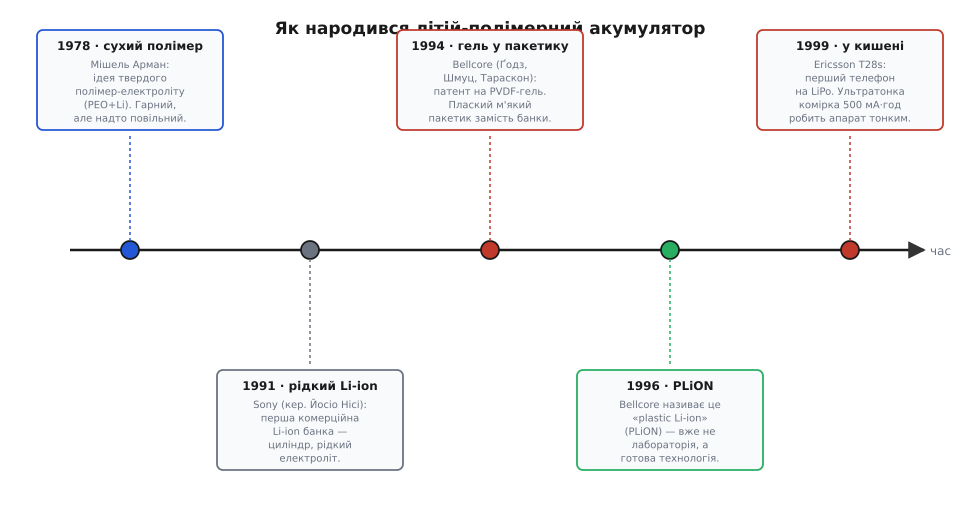

# 📜 Звідки взявся «полімер» у літій-полімерному

Візьми в руки хобі-LiPo — плаский, м'який, легкий брусок у кольоровій плівці — і спитай просту річ: **де тут полімер?** Пластик оболонки? Ні, оболонка — то алюмінієва фольга з тонким лаком. Тоді, може, всередині твердий пластик замість рідини, як обіцяє назва? Розкриєш здутий пакет (обережно, вони горять) — і всередині знайдеш вологу, схожу на желе масу. Не суху плівку, не тверду пластину, а **гель**. Виходить, назва «полімерний» описує не те, що ти тримаєш. І це не помилка перекладу — плутанина зашита в саму технологію з дня її народження. Щоб зрозуміти, чому LiPo так називають і чому назва трохи бреше, треба повернутися в 1970-ті, коли ще й слова «літій-іонний» не існувало.

## Мрія про твердий електроліт

Будь-яка батарея — це три шари: два електроди (куди йдуть і звідки виходять іони) і **електроліт** між ними — середовище, крізь яке іони переповзають з одного електрода на інший, замикаючи хімічне коло. Майже завжди цей електроліт — **рідина**: сіль, розчинена в розчиннику. Рідина добре проводить іони, бо в ній молекули вільно рухаються й іон легко протискається крізь них. Але за зручність доводиться платити. Рідкий електроліт треба **герметично замкнути** в міцний корпус, бо він тече, випаровується і — у літієвих системах — горить. Звідси беруться важкі металеві стакани й банки: не заради електрики, а щоб утримати рідину всередині.

Ще в 1970-х хіміки мріяли позбутися рідини зовсім. Уяви електроліт, який був би **твердим** — пружною плівкою, що сама тримає форму й не тече. Тоді відпав би важкий корпус: тверду батарею можна було б робити тонкою, гнучкою, будь-якої форми, різати ножицями, як листок паперу. Питання лише в тому, з чого зробити тверде тіло, яке при цьому **проводить іони**. Звичайні тверді речовини іони не пропускають — на те вони й тверді.

Прорив цієї ідеї пов'язують із французьким хіміком **Мішелем Арманом** (фр. *Michel Armand*). Близько **1978 року** він показав, що деякі **полімери** — довгі ланцюгові молекули — можуть проводити іони літію, якщо в них розчинити літієву сіль. Класика — поліетиленоксид (англ. *polyethylene oxide*, PEO): його ланцюги мають атоми кисню, за які чіпляється іон літію, і, поки ланцюги ворушаться від теплового руху, іон «перестрибує» з кисню на кисень уздовж ланцюга й далі до сусіднього. Виходить **сухий полімер-електроліт** (англ. *solid polymer electrolyte*, SPE) — тверда на дотик плівка, крізь яку все ж повзе струм. Оце і є справжній «полімерний» акумулятор у прямому значенні слова: електроліт — це полімер, і більше нічого.

> 🔧 **Навіщо це.** Тримай у голові цю первісну мрію — «твердий полімер замість рідини» — бо саме від неї пішла назва. Комерційний LiPo у твоїх руках цю мрію так і **не здійснив** до кінця: він лишив у собі рідину, лише загустив її. Назва прийшла від ідеї, а не від того, чим річ виявилася насправді. Хто цього не знає, той щиро дивується, чому «полімерний» акумулятор пухне від газу й горить, як будь-який рідкий літій, — а тому й пухне, що всередині нікуди не поділася горюча рідина.

Біда чистого сухого полімеру виявилася прозаїчною: **він надто повільний**. Іон літія повзе вздовж ворушких ланцюгів PEO в сотні й тисячі разів гірше, ніж крізь рідину. За кімнатної температури PEO ще й частково кристалізується — ланцюги застигають рівними рядами й перестають ворушитися, а разом із рухом ланцюгів завмирає й провідність. Щоб такий електроліт хоч якось працював, батарею треба гріти градусів до 60–80. Для великих стаціонарних установок чи електробуса з підігрівом це стерпно (лінію літій-металевих полімерних батарей на PEO згодом і будували саме для транспорту), але для чогось, що лежить у кишені за кімнатної температури, сухий полімер не годився. Мрія про тверду батарею повисла: гарна ідея, яку не виходить втиснути в щоденний пристрій.

*Оцінка доказовості: пріоритет Армана в ідеї полімерного електроліту (~1978, система PEO/Li) — усталений факт, його широко визнають в оглядах з історії літієвих акумуляторів. Точний рік у різних джерелах трохи гуляє (1978–1979), бо йшлося про серію робіт, а не одну дату.*

## Тим часом — рідкий літій перемагає ринок

Поки одні гналися за твердим полімером, інші пішли простим шляхом — узяли **рідкий** електроліт і зробили літієву батарею робочою тут і тепер. У **1991 році** японська **Sony** (спільно з Asahi Kasei; команду в Sony вів **Йосіо Нісі**, яп. *西美緒*, Yoshio Nishi) вивела на ринок **першу комерційну літій-іонну банку**. Хімію під неї підготували роботи Джона Ґуденафа (англ. *John Goodenough*) над катодом з оксиду кобальту й **Акіри Йосіно** (яп. *吉野彰*, Akira Yoshino), який у 1985-му зібрав робочий безпечний елемент із вугільним анодом; Sony довела це до серійного виробництва.

Форма тієї першої перемоги — **циліндр**. Металевий стаканчик, у якому змотані в рулет («джеллі-рол») стрічки електродів, залиті рідким електролітом і закатані кришкою. Знайомий формат пальчикової батарейки, тільки літієвий. Пізніше він викристалізується в стандартні розміри на кшталт 18650 (18 мм у діаметрі, 65 мм заввишки) — той самий циліндр, що й досі стоїть у ноутбуках, ліхтариках і батареях електромобілів.

Циліндр обрали не випадково — **кругла труба ідеально тримає внутрішній тиск**. Рідкий літій під час роботи трохи газить і розширюється, а циліндричний сталевий корпус розподіляє цей тиск рівномірно по стінці й не роздувається. Ціна за міцність — **форма й вага**. Циліндр не покладеш плазом у тонкий телефон, між круглими банками завжди лишається порожнеча, а сталевий стакан додає грамів, які не запасають ані краплі енергії. Літій-іонна батарея вже була легша й ємніша за все попереднє, але лишалася **товстою і круглою** — саме там, де ринок дедалі більше хотів **тонкого і плаского**.

> 🔧 **Навіщо це.** Ось де зустрічаються дві гілки історії. Sony 1991-го дала світу **правильну хімію** (літій-іон з вугільним анодом — те, що й досі всередині кожного LiPo), але в **незручній формі** — жорсткому циліндрі. Мрія Армана обіцяла **правильну форму** (тонку, гнучку, без важкого корпусу), але не давала **робочої провідності** за кімнатної температури. Хто перший поєднає ці дві половинки — правильну хімію рідкого літію з тонкою бескорпусною формою полімеру, — той і винайде те, що ми звемо LiPo. І поєднання виявилося не «або-або», а хитрий компроміс посередині.

*Оцінка доказовості: 1991 як рік першої комерційної Li-ion банки від Sony — усталений, багаторазово підтверджений факт. Внесок Ґуденафа (катод), Йосіно (робочий елемент) і Вітінгема (рання інтеркаляція) визнано Нобелівською премією з хімії 2019 року — це не спірне приписування, а офіційно засвідчений ланцюг авторства.*

## Компроміс із Bellcore: не тверде і не рідке, а гель

Розв'язок прийшов не з великої японської корпорації й не з академічної лабораторії полімерів, а з несподіваного місця — **Bellcore** (Bell Communications Research, дослідницький підрозділ американської телефонної системи, згодом перейменований на Telcordia). На початку 1990-х там працювала група, серед якої були **Антоні Ґодз** (польськ. *Antoni S. Gozdz*), **Каролін Шмуц** (фр. *Caroline N. Schmutz*) і той самий **Жан-Марі Тараскон** (фр. *Jean-Marie Tarascon*) — француз, що пізніше став одним із найвідоміших електрохіміків світу.

Їхня ідея — елегантний обхід глухого кута. Якщо сухий полімер надто повільний, а рідина надто текуча, то **чому не взяти полімер і не насотати його рідиною**? Уяви не тверду плівку й не калюжу, а губку: полімерний каркас, що тримає форму, з рідким електролітом, замкненим у його порах. Іони бігають по рідині в порах — тобто **швидко, як у рідині**; а назовні це не тече — бо рідину тримає полімерна сітка, як вода тримається у желе. Такий електроліт назвали **гелевим полімерним** (англ. *gel polymer electrolyte*, GPE). Це і є серцевина LiPo.

Каркасом вони взяли не PEO, а **PVDF** — полівін, точніше **полівініліденфторид** (англ. *polyvinylidene fluoride*), а ще краще його співполімер **PVDF-HFP** (з гексафторпропіленом). Цей фторований полімер має рідкісне поєднання рис: він хімічно стійкий до агресивного літієвого електроліту, добре набухає, вбираючи рідину, і при цьому лишається механічно міцною плівкою. У саму рідину брали звичні для літію карбонатні розчинники — етиленкарбонат, пропіленкарбонат — з розчиненою літієвою сіллю.

Оформили це патентом **US 5 296 318** — «Rechargeable lithium intercalation battery with hybrid polymeric electrolyte» («Перезаряджувана літій-інтеркаляційна батарея з гібридним полімерним електролітом»). Подали заявку **5 березня 1993 року**, видали патент **22 березня 1994-го**; власник — Bell Communications Research, винахідники — Ґодз, Шмуц і Тараскон. Уже сама назва патенту чесніша за майбутню маркетингову: електроліт там названо не «полімерним», а **гібридним** — і це рівно те, що воно є. Патент прямо описує плівку з PVDF-співполімеру, що містить **від 20 до 70 %** розчину літієвої солі, з іонною провідністю близько **10⁻³ S/см** — тобто на кілька порядків краще за сухий PEO й майже на рівні чистої рідини.

```
чому гель швидший за сухий полімер (порядок величини провідності):

  сухий PEO (кімн. t°):     ~10⁻⁷…10⁻⁶ S/см   (надто повільно)
  гель PVDF з рідиною:      ~10⁻³ S/см        (майже як рідина)
  чиста рідина:             ~10⁻²…10⁻³ S/см   (еталон)
```

Тобто перехід від «сухого полімеру» до «полімеру, насоченого рідиною» піднімає провідність приблизно **в тисячу разів** — рівно настільки, щоб батарея запрацювала за кімнатної температури без підігріву.

> 🔧 **Навіщо це.** Оце і є розгадка назви. Технологія Bellcore — це **не** тверда полімерна батарея з мрії Армана. Це **звичайна літій-іонна хімія з рідким електролітом**, лише рідину замкнули в полімерній губці замість того, щоб хлюпати нею в металевому стакані. Полімер тут — не електроліт, а **утримувач електроліту**, каркас-губка. Назва «літій-полімерний» прижилася від першої мрії про твердий полімер, але описує вона річ, у якій полімер грає геть іншу, скромнішу роль. Тому фахівці й наполягають: більшість комерційних LiPo — це **не** «справжні» полімерні акумулятори, а гібрид, де рідина живе всередині полімерної матриці.

*Оцінка доказовості: патент US 5 296 318, дати (заявка 5.03.1993, видача 22.03.1994), склад винахідників (Ґодз, Шмуц, Тараскон) і власник (Bellcore) — документально підтверджені за текстом самого патенту. Ключове застереження, що гелеві мембрани не можна вважати «справжніми» полімерними електролітами, а лише гібридними системами з рідиною в матриці, — усталена позиція в літературі (зокрема її обстоював електрохімік Бруно Скросаті, іт. *Bruno Scrosati*).*


*Дві гілки історії сходяться в LiPo. Ліва мрія — тонкий твердий полімер Армана — дає форму, але не швидкість; верхня перемога Sony — рідкий літій — дає швидкість, але у важкому циліндрі. Bellcore поєднує їх гелем (рідина в полімерній губці), і за кілька років ця технологія доходить від патенту до першого телефона в кишені.*

## Чому саме пакетик підкорив хобі

Гель дав ще один подарунок, менш очевидний за провідність, але саме він визначив долю LiPo в руках аматора — **форму корпусу**.

Пригадай, чому літій-іонна банка була круглою: рідина газить, тисне, і круглий сталевий стакан рівномірно тримає цей тиск. А тепер прибери вільну рідину — замкни її в гелі, приклей електроди до полімерної плівки в один щільний «бутерброд». Всередині більше нема калюжі, яка б хлюпала й тиснула на стінки. Отже, **міцний корпус більше не потрібен**. Досить загорнути пакет електродів у тонку **алюмінієву фольгу** (з боків заламіновану пластиком, щоб не пропускала вологу) і запаяти краї, як пакетик з-під чипсів. Так народилася **м'яка форма-пакетик** (англ. *pouch* — «торбинка», «пакетик»): плаский, легкий, без жодного грама сталі.

І тут вигоди сипляться одна за одною, кожна — точно те, за що хобіст любить LiPo:

- **Плаский і легкий.** Нема сталевого стакана — нема його ваги. Уся маса йде в активну речовину, а не в корпус. Для дрона чи літачка, де кожен грам б'є по часу польоту, це вирішальне.
- **Будь-яка форма.** Пакетик роблять під простір, що є: довгий і вузький під ручку телефона, широкий і тонкий під планшет, товщий і коротший під квадрокоптер. Круглу банку в цю щілину не покладеш; пакетик — точно за розміром.
- **Щільне пакування.** Пласкі пакетики складають упритул, без порожнеч між круглими боками. У той самий об'єм корпусу влазить більше енергії.
- **Дешевше у формуванні.** М'яку фольгу штампувати простіше й дешевше, ніж точити й закочувати міцний металевий стакан.

Ціна за все це — **крихкість**, і хобіст платить її щодня. Те, що робить пакетик легким (нема твердого корпусу), робить його **беззахисним**: його легко проколоти, зім'яти, роздути. Кинутий на бетон циліндр 18650 переживе падіння, а м'який пакет від удару може зам'ятися й закоротити зсередини. І газ, який у банці стримала б сталь, у пакетику **надуває фольгу, як подушку**, — звідси характерне роздування хворого LiPo. М'яка форма — це угода: віддаєш міцність, отримуєш легкість і форму. Для смартфона в жорсткому корпусі телефона й для дрона, де вага дорожча за все, ця угода вигідна — тому обидва світи й перейшли на пакетики.

> 🔧 **Навіщо це.** Хобі-світ обрав LiPo не за хімію (хімія в нього та сама, що в циліндричній Li-ion банці — той самий літій-іон) — а саме за **форму, яку дозволив гель**. Плаский пакетик — це єдиний спосіб отримати багато потужності з малої ваги в тонкому корпусі. Тому всі мінуси LiPo, з якими воює аматор — проколи, роздування, потреба у вогнетривкому мішку, — це зворотний бік того самого рішення, що зробило його таким привабливим: **м'якого корпусу**. Прибери м'який пакетик — зникнуть і біди, але зникне й сам сенс брати LiPo замість циліндричної банки.

## Від лабораторії до кишені

Патент — це ще не річ на полиці. Технологію Bellcore треба було довести до серії, а тоді вкласти в перший масовий пристрій.

Сама Bellcore не збиралася робити батареї — вона **ліцензувала** свою розробку виробникам. Близько **1996 року** вона представила відпрацьований елемент під торговою назвою **PLiON** — від «**pl**astic **li**thium-i**on**», «пластиковий літій-іон». Назва знову промовиста: не «полімерний», а **пластиковий** — тобто плаский і гнучкий, як пластинка, а не «зроблений з полімерного електроліту». До **1999 року** ліцензовану технологію довели до комерційного випуску (права на патенти Bellcore/Telcordia згодом викупила компанія Valence Technology).

А перший **гучний масовий пристрій** на LiPo — це мобільний телефон **Ericsson T28** (точніше версія **T28s**), що вийшов у **вересні 1999 року**. Його й запам'ятали як перший телефон з літій-полімерною батареєю. Родзинка — **ультратонка комірка на 500 мА·год**, завдяки якій апарат вийшов сенсаційно тонким і легким (близько 83 грамів) на тлі тодішніх «цеглин». Саме ця тонкість продала ідею світові: виявилося, що плаский пакетик дає зробити телефон, який раніше був неможливий. Далі шлях відомий — за LiPo пішли тонкі ноутбуки, планшети, а згодом і хобі-дрони, яким пласка легка батарея підійшла навіть краще, ніж телефонам.

*Оцінка доказовості: PLiON як торгова назва Bellcore і рік ~1996 його представлення — підтверджено кількома джерелами з історії літій-іона; «комерціалізовано 1999» теж усталене. Ericsson T28/T28s (вересень 1999) як перший телефон на LiPo та ємність ультратонкої комірки 500 мА·год — підтверджено джерелами про сам апарат; слід тримати обережність із категоричним «найперший у світі», бо різні виробники в ті самі роки теж переходили на пакетик — але за Ericsson T28 це твердження повторюється найчастіше й найстабільніше.*

## Що лишилося від назви

Отже, коли на боці хобі-пакета читаєш «Li-Po» — знай, що назва тягне за собою не одну, а **дві** історії. Одна — про мрію Мішеля Армана про тонку тверду батарею з полімерного електроліту; ця мрія формою надихнула все, але сама так і не втілилась у щоденний пристрій за кімнатної температури. Друга — про хитрий компроміс Bellcore, який узяв **правильну хімію** рідкого літію від Sony й **правильну форму** від полімерної мрії, а посередині поставив **гель**: рідину, замкнену в полімерній губці. Комерційний LiPo — це друга історія, що успадкувала ім'я від першої.

Тому й виходить, що назва трохи бреше — але брехня ця історична, а не зловмисна. «Полімерний» у LiPo означає радше **«полімер тримає електроліт»**, а не «електроліт є полімером». Всередині твого пакета — та сама літій-іонна хімія, що й у циліндричній банці, лише вбрана в м'який пакетик замість сталевого стакана, а рідину загущено в гель, щоб вона не текла й дозволила цей пакетик зробити. Усе, що ти знаєш про поводження з LiPo — не заряджати вище 4.2 В, не розряджати нижче 3.0, боятися роздування й проколу, — прямо росте з цього факту: **рідина нікуди не поділася**, вона просто причаїлася в гелі. Полімер дав форму й ім'я; горюча літієва хімія лишилася під ним такою ж, якою була в 1991-му.
