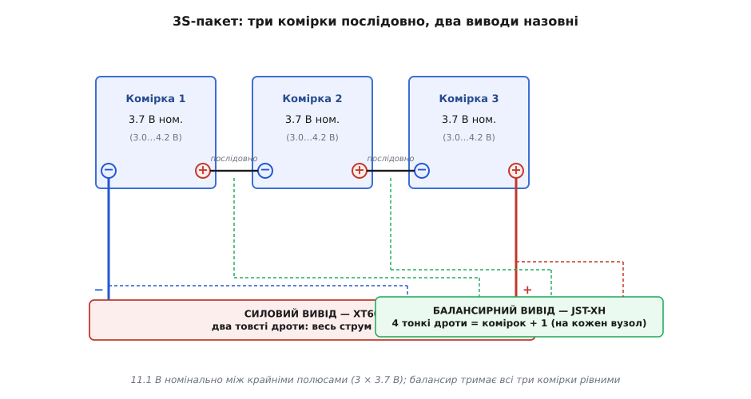
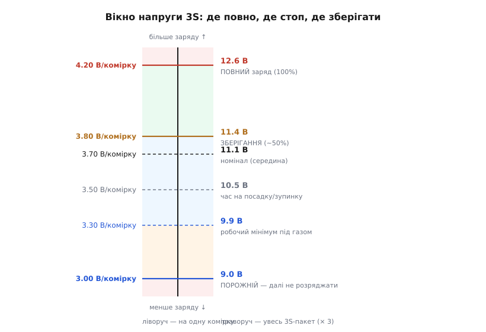
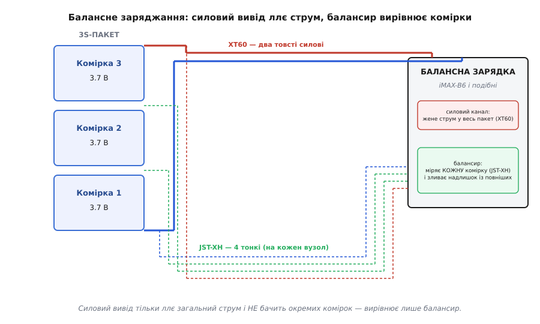

# LiPo-акумулятор (XT60, ~3S)

<preknowlist>
- [Вольт](topic:physics/volt) — що таке напруга й чому джерела рахують саме у вольтах; тут потрібно розуміти, що напруга комірок додається.
- [Струм](topic:physics/electric-current) — заряд, що тече за секунду, в амперах; від нього залежить, скільки пакет віддасть і чи не перегріється.
- [Закон Ома](topic:electronics/ohms-law) — зв'язок «напруга = струм · опір»; на ньому тримається розуміння, чому напруга пакета просідає під навантаженням.
- [Стандартний електродний потенціал](root:basic-chemistry/electrode-potential) — чому пара речовин у комірці дає саме ~3.7 В, а не інше число.
</preknowlist>

Це м'який брусок у щільній фользі, обгорнутий кольоровою термоплівкою, з якого виходять два товсті дроти під великим жовтим роз'ємом і жмуток тонших дротиків під маленьким білим гребінцем збоку. На боці написано щось на кшталт «**3S 2200mAh 11.1V 30C**». Важить він як плитка шоколаду, а віддати вміє струм, від якого плавляться тонкі дроти, — і саме тому з ним треба поводитися з повагою. Це літій-полімерний акумулятор (англ. *lithium polymer*, скорочено **LiPo**) — те, що живить майже кожен хобі-дрон, гоночну машинку чи літачок, коли треба багато потужності з малої ваги.

Щоб не потонути в цифрах на етикетці, варто спершу вхопити головну ідею, з якої випливає геть усе інше: **LiPo — це не одна батарейка, а кілька однакових комірок, з'єднаних послідовно в один блок**. Слово «пакет» (англ. *pack*) тут буквальне: усередині фольги лежать три пласкі комірки (у нашому випадку — саме три, звідси «3S»), кожна сама по собі — повноцінне джерело на ~3.7 вольта, і всі вони склеєні докупи. Виробник спакував їх разом, з'єднав дротом та вивів назовні два силові контакти. Усе, що бентежить новачка — навіщо другий роз'єм, чому не можна розряджати «в нуль», чому пакет пухне, — стає прозорим, щойно тримаєш у голові цю картинку: **три банки в одному корпусі**.

> 🔧 **Навіщо це розуміти.** Майже всі проблеми з LiPo — це проблеми **окремих комірок усередині**, а не пакета як цілого. Пакет показує 11 вольт і виглядає живим, а одна комірка в ньому тим часом просіла до небезпечного рівня й тихо вмирає. Хто бачить пакет як «одну батарейку», той цього не помітить; хто бачить три комірки — той одразу знає, куди дивитися і навіщо потрібен другий роз'єм.

## Що означає «3S» і звідки беруться 11.1 вольта

Позначення `3S` читається просто: **три комірки, з'єднані послідовно** (літера S — від англ. *series*, «послідовно»). Якби комірки з'єднали паралельно, писали б `P` (англ. *parallel*); бувають і складніші пакети типу `3S2P` — три послідовно, і таких гілок дві паралельно. Але базовий випадок — чистий `3S`.

Чому послідовне з'єднання дає більшу напругу — видно з фізики. Коли джерела стоять одне за одним, їхні напруги **додаються**: вихід «плюса» першої комірки стає «мінусом-опорою» для другої, і потенціал накопичується сходинками. Три комірки по 3.7 вольта дають 3 × 3.7 = **11.1 вольта** — це й є номінальна напруга 3S-пакета, те число, що красується на етикетці.


*Анатомія 3S-пакета. Три комірки по 3.7 В стоять послідовно: «плюс» однієї йде на «мінус» наступної, і напруги додаються до 11.1 В між крайніми полюсами. Товстий силовий роз'єм (XT60) знімає струм лише з двох крайніх полюсів усього пакета. Тонкий балансирний роз'єм (JST-XH) окремим дротом торкається кожного стику між комірками — тому в нього на один контакт більше, ніж комірок.*

Тут ховається перша тонкість, яку варто засвоїти твердо: **3.7 вольта — це «середнє», а не постійне число**. Напруга однієї літієвої комірки не стоїть на місці — вона повзе від **4.2 вольта** (повністю заряджена) вниз до **3.0 вольта** (повністю розряджена) в міру того, як з неї витягують енергію. Значить, реальна напруга нашого 3S-пакета гуляє в діапазоні:

```
повний заряд:     3 × 4.2 = 12.6 В
номінал (~50%):   3 × 3.7 = 11.1 В   ← число на етикетці
порожній:         3 × 3.0 =  9.0 В
```

Свіжозаряджений пакет видає 12.6 вольта, а не 11.1; сіла батарея — і мультиметр показує близько 9 вольт. «11.1 В» — це умовна середина, за якою пакет називають і продають, приблизно як «12-вольтовим» називають свинцевий автомобільний акумулятор, що насправді має 12.6–13 вольт зарядженим. Чому саме така пара речовин у комірці дає близько 3.7 вольта, а не два чи п'ять, визначає хімія електродів — це закладено [стандартним електродним потенціалом](root:basic-chemistry/electrode-potential) літієвої пари й не залежить від виробника.

> 🔧 **Навіщо це.** Плутанина «11.1 чи 12.6» коштує спалених пристроїв. Купуєте регулятор чи світлодіодну стрічку «на 12 В» і чіпляєте до свіжого 3S — а на нього приходить 12.6, і якщо пристрій розрахований рівно на 12.0 з вузьким запасом, він може постраждати. І навпаки: якщо ваш пристрій вимикається нижче 10 вольт, це нормально — 3S під навантаженням легко падає до 10 і нижче, це ще не «сіла батарея», а звичайне просідання. Завжди рахуйте від **реального вікна 9.0–12.6 В**, а не від напису на боці.

## Чому не можна розряджати «в нуль»

Зі свинцевим акумулятором чи лужною батарейкою звичка проста: використовуй, доки не сяде. З LiPo так **не можна** — і причина не в обережності заради обережності, а в тому, що комірка фізично псується, якщо витягти з неї забагато.

Літієва комірка має чіткий нижній поріг — **3.0 вольта під навантаженням** (а в спокої не давати їй опускатися нижче ~3.3). Опустишся нижче — і в комірці починаються незворотні хімічні зміни: мідний струмознімач анода розчиняється, і при наступному заряді метал осідає голками (дендритами), які колють роздільник між електродами. Наслідок — комірка втрачає ємність, роздувається, а в гіршому разі внутрішнє коротке замикання підпалює пакет. Один глибокий розряд не завжди вбиває комірку відразу, але щоразу відкушує від її життя й наближає до відмови.

Звідси практичне правило, яке в світі дронів звучить як закон: **3.0 вольта на комірку — це стіна, до якої не доходять, а зупиняються з запасом**. На практиці бортовий контролер налаштовують бити тривогу вже на 3.5 вольта («час на посадку») і рятувати апарат до 3.3, ніколи не доводячи до 3.0 під струмом. Ось чому в кожному польотному контролері є моніторинг напруги батареї, а гоночні пілоти чіпляють на пакет пискавку-сигналізатор, що верещить, коли будь-яка комірка просіла до порога.


*Робоче вікно 3S у двох шкалах одночасно: зліва напруга однієї комірки, справа — втричі більша напруга всього пакета. Угорі повний заряд (4.20 В / 12.6 В), унизу порожній поріг (3.00 В / 9.0 В), між ними — рівень тривалого зберігання (~3.8 В / 11.4 В). Червоні зони згори й знизу — перезаряд і переразряд — це те, чого комірка не пробачає.*

І дзеркальний бік тієї ж медалі — **верхній поріг 4.2 вольта**. Зарядити комірку вище — так само небезпечно, як розрядити нижче нуля: надлишок напруги розкладає електроліт, комірка гріється, пухне й може загорітися. Тому LiPo заряджають **лише спеціальною зарядкою**, яка сама зупиняється рівно на 4.2 вольта на комірку, а не «блоком живлення на 12 вольт» — такий блок не знає про поріг і зажене комірки за 4.2. Верхня й нижня стіни разом і задають те вузьке вікно 3.0–4.2 вольта, у якому літієва комірка живе; вийти за нього в будь-який бік — зіпсувати її.

## Навіщо другий роз'єм: балансир

Тепер стає зрозуміло, навіщо з пакета стирчить той дивний тонкий гребінець із чотирьох дротиків, окремо від товстого силового роз'єму. Це **балансирний вивід**, і він народжується прямо з того, що пакет — це три окремі комірки.

Уяви три відра, з'єднані трубою знизу (силовий вивід бачить лише сумарний рівень води). Ти набираєш і зливаєш воду через ту нижню трубу — і здається, що всі три відра завжди мають однаковий рівень. Але комірки не ідеально однакові: одна ледь старіша, друга ледь ємніша, і з часом вони розходяться. Через нижню трубу (силовий роз'єм, що торкається лише двох крайніх полюсів) цього не побачити — він знає тільки сумарну напругу 11 вольт і не має жодного уявлення, що всередині одна комірка на 4.2, а інша вже на 3.9.

Балансирний роз'єм — це **окремий тонкий дротик до кожного стику між комірками**. Саме тому в 3S-пакета в балансирному гнізді **чотири** контакти, а не три: щоб виміряти три комірки окремо, треба торкнутися чотирьох точок ланцюга — нижнього мінуса, двох стиків між комірками й верхнього плюса. Загальне правило: **балансирних дротів завжди на один більше, ніж комірок** (для 3S — чотири, для 4S — п'ять). Через ці дроти зарядка бачить напругу кожної комірки нарізно й може **зливати надлишок із тих, що зарядилися швидше**, доки всі три не зрівняються рівно на 4.2 вольта. Це й називають **балансуванням**.


*Куди на зарядці йдуть обидва виводи. Товстий силовий роз'єм (XT60) під'єднаний лише до двох крайніх полюсів — ним зарядка ллє загальний струм у весь пакет, але окремих комірок «не бачить». Тонкий балансирний роз'єм (JST-XH) дає зарядці по дроту до кожного вузла, тож вона міряє кожну комірку й зливає надлишок із повніших. Вирівнювання робить **лише** балансир — сам силовий струм цього не вміє.*

> 🔧 **Навіщо це.** Незбалансований пакет небезпечний навіть за нормальної сумарної напруги. Уяви 3S, де силовий роз'єм показує здорові 11.4 вольта, але всередині комірки стоять 4.2 / 4.2 / 3.0 — сума та сама, а третя комірка вже за нижнім порогом і гине. Балансир для того й існує: він не дає коміркам розійтися. Тому LiPo **завжди заряджають через балансирний роз'єм** (режим «balance charge»), а не лише через силовий — інакше зарядка зрівнює тільки суму й не бачить перекосу всередині. І при купівлі знімання напруги кожної комірки балансиром — найшвидший спосіб перевірити, чи пакет здоровий: рознесло комірки — пакет під заміну.

Балансирний роз'єм у хобі-пакетах майже завжди одного типу — **JST-XH** (з кроком контактів 2.5 мм, у білому корпусі); саме під нього зроблені гнізда на зарядках і на перехідниках. Це не універсальний стандарт (трапляються й інші), але для типового 3S-пакета в руках аматора — практично завжди JST-XH.

## Товстий роз'єм: XT60 і чому саме він

Другий, силовий вивід — це той самий великий жовтий роз'єм, за яким пакет часто й називають. **XT60** — конкретна модель силового роз'єму, названа за струмом, на який вона розрахована: приблизно **60 ампер** (звідси «60» у назві; літери XT — серійне позначення виробника). Розробила й запатентувала його китайська компанія **AMASS** (Changzhou Amass, м. Чанчжоу) — вона ж робить усю лінійку сумісних роз'ємів на різні струми: молодший XT30 (~30 А), старший XT90 (~90 А), потужніший XT120. Це ціла [родина силових роз'ємів XT](topic:components/xt-connectors) зі спільною конструкцією й вибором за струмом; тут — про те, чому саме XT60 опинився на нашому пакеті.

XT60 виграв на хобі-ринку кількома простими рішеннями, кожне з яких вирішує реальну біду великих струмів:

- **Товсті золочені контакти з міді** з дуже малим опором (близько 0.5 міліома). Опір тут критичний: через роз'єм тече весь струм пакета, а на будь-якому опорі струм гріє — за законом Ома втрати потужності ростуть як I²·R, тож при десятках ампер навіть частка ома перетворилася б на пекучі ватти й розплавлений пластик. Малий опір XT60 тримає роз'єм холодним.
- **Форма «не переплутати полярність»**: корпус зроблений так, що вставити роз'єм навпаки фізично важко — плюс до плюса, мінус до мінуса, інакше не заходить. Для LiPo це рятує життя пристрою: переплутати полярність джерела на 12 вольт і десятки ампер — це миттєвий дим.
- **Скошені контакти, що торкаються раніше за корпус**: при вставлянні спершу сходяться контакти, і невелика іскра (а на зарядженому пакеті вона є завжди — конденсатори навантаження заряджаються ривком) гасне в глибині роз'єму, а не на відкритому металі.

> 🔧 **Навіщо це.** Роз'єм на LiPo — не дрібниця, а елемент безпеки. Тонкий чи неякісний роз'єм на великому струмі гріється, підгоряє, збільшує опір — і далі гріється ще більше, аж до плавлення й короткого. Тому силові роз'єми беруть **під свій струм**: рахуєш максимальний струм навантаження (нижче) і береш роз'єм із запасом. XT60 добре тримає типові для 3S десятки ампер; якщо ж пакет живить щось прожерливіше (великий мотор, десятки ампер тривало) — переходять на XT90. І ще: усі пристрої в системі мають носити **однаковий** роз'єм — інакше в польових умовах не з'єднати або, гірше, з'єднати через перехідник із поганим контактом.

## C-рейтинг: скільки струму пакет віддасть

Останнє число на етикетці — оте `30C` — відповідає на питання «як **швидко** можна витягати з пакета енергію», тобто який струм він віддасть, не задихнувшись і не перегрівшись. Це і є **C-рейтинг** (англ. *C-rate*, від *capacity* — ємність), і читається він через ємність пакета.

Ємність міряють в ампер-годинах (А·год) чи міліампер-годинах (мА·год): `2200mAh` означає, що пакет віддасть 2.2 ампера протягом години (або 4.4 ампера пів години — добуток струму на час сталий). «1C» — це струм, що чисельно дорівнює ємності: для 2200 мА·год пакета 1C = 2.2 ампера. А C-рейтинг каже, у скільки разів більший струм пакет витримує тривало:

```
максимальний тривалий струм = C-рейтинг × ємність (в А·год)

для 30C 2200 мА·год:
  30 × 2.2 А·год = 66 А   ← стільки пакет обіцяє віддавати тривало
```

Тобто 30C-пакет на 2200 мА·год теоретично готовий до 66 ампер розряду. Розгортка цієї арифметики — скільки протримається апарат, як напруга просідає під струмом і чому насправді треба закладати запас — [винесена окремо](topic:power/lipo-3s/math-c-rate.md).

Але тут причаїлася чи не найбільша пастка LiPo, і про неї треба знати прямо: **надрукований C-рейтинг майже завжди завищений**. Стандарту, який змушував би вимірювати його чесно, немає, тож маркетинг ставить число, яке краще продає. Незалежні виміри ентузіастів раз за разом показують, що «50C»-пакет на ділі витримує 20–30C, доки не почне небезпечно грітися. Реально розраховувати варто десь на 60–70% від надрукованої цифри — і ніколи не проєктувати систему так, щоб пакет постійно працював на межі своєї заявленої віддачі.

Через це на етикетках часто пишуть **два числа** — наприклад, `30C/60C`: перше — тривалий струм (на ньому пакет живе довго), друге — короткий сплеск (англ. *burst*), який дозволено лише на кілька секунд (типово до 10). Плутати їх дорого: спроектувавши апарат так, щоб він тривало тягнув «сплесковий» струм, ти зжереш пакет за кілька польотів.

> 🔧 **Навіщо це.** Правильний хід — рахувати не від C на етикетці, а від **свого струму**. Прикинь, скільки ампер тягне твій апарат на повному газі (з даних мотора й пропелера), а тоді перевір, чи покриває це пакет із чесним запасом: бери його реальну віддачу за 60–70% від напису й дивись, щоб твій струм у неї вкладався з великим ґандж. Задав струм менший за можливості пакета — він працює прохолодним і живе довго; сів на межу заявленого — пакет гріється, пухне й швидко здає. C-рейтинг — це стеля, під якою треба лишатися, а не мета, якої треба досягати.

## Чому воно «полімерне» й чому пухне

Назва «літій-**полімерний**» натякає на хімію, але для практика важливіша її механічна суть. На відміну від циліндричних літій-іонних банок (як 18650) у твердому металевому корпусі, LiPo-комірка — це **плаский пакетик у м'якій алюмінієвій фользі**, усередині якого електроди й густий, схожий на гель електроліт. Саме м'яка оболонка-пакетик (англ. *pouch*) дає LiPo дві його головні риси: він **плаский і легкий** (нема важкого сталевого стакана) і його можна зробити **будь-якої форми** під пристрій. Ціною за це стала крихкість: тверда банка тримає форму й терпить удар, а м'який пакетик легко проколоти, зім'яти чи роздути. Звідки саме взялася ця «полімерна» технологія й чому назва трохи вводить в оману — [окрема історія](topic:power/lipo-3s/hist-lipo-birth.md).

І звідси — **роздування** (англ. *puffing*), головний видимий симптом хворого LiPo. Коли комірку кривдять — перезаряджають, переразряджають, гріють чи просто зношують роками, — усередині йдуть побічні хімічні реакції, що виділяють газ. Твердий корпус стримав би тиск, а м'який пакетик під ним **надувається, як подушка**. Роздутий LiPo — це не «ще трохи попрацює», це чіткий сигнал: **комірка деградувала, пакет треба виводити з ужитку**. Далі він лише небезпечніший — здутий пакет ближчий до внутрішнього замикання й займання.

> 🔧 **Навіщо це.** Роздування — найпростіша й найнадійніша діагностика, яку видно оком і намацати рукою. Узяв пакет — він рівний, плаский, грані чіткі: живий. Роздувся, боки випнуті, «подушка»: на утилізацію, і то обережно (проколотий LiPo горить). Тому LiPo зберігають у вогнетривкому мішку (LiPo-safe bag) чи металевій коробці — на випадок, якщо прихована деградація перейде в займання в спокої. І тому ж LiPo ніколи не лишають набитим під зав'язку надовго (див. далі): повний заряд пришвидшує старіння й наближає роздування.

## Зберігання, заряд і безпека — короткий звід

Зі сказаного природно випливають кілька залізних правил поводження. Вони не примхи — кожне прямо росте з фізики вузького вікна напруг і м'якого корпусу.

**Зберігати наполовину зарядженим.** Найшкідливіше для LiPo — лежати місяцями повністю зарядженим (4.2 В/комірку) або повністю сівши. Тривалий спокій комірка любить при **~3.8 вольта на комірку**, тобто **11.4 вольта на 3S-пакет** — це «рівень зберігання» (англ. *storage*), і хороші зарядки мають окремий режим, що доводить пакет саме до нього. Не летиш кілька днів — постав пакети на зберігання, а не лишай після польоту повними.

**Заряджати з наглядом і через балансир.** LiPo заряджають спеціальною зарядкою в режимі балансування, не лишаючи без нагляду, на вогнетривкій поверхні. Типовий безпечний струм заряду — **1C** (для 2200 мА·год це 2.2 А); більше пришвидшує заряд, але й пришвидшує старіння. Зарядка сама веде напругу до 4.2 В/комірку й зупиняється — вручну цей поріг не «доганяють».

**Не переразряджати в польоті.** Ставте поріг тривоги з запасом (3.5 В/комірку на попередження, посадка до 3.3) і ніколи не тягніть пакет до вимкнення «в нуль». Просів під газом до 3.3 — досить, дайте йому відпочити, і напруга трохи відновиться.

**Берегти від проколу, удару й тепла.** М'який корпус не прощає механіки. Не возіть пакети навалом із гострими предметами, не лишайте на сонці чи в гарячій машині, кинутий і зім'ятий пакет — під заміну навіть без видимого роздування.

**Роздувся — на утиліз.** Будь-яке помітне здуття — кінець служби. Розряджають такий пакет до безпечного рівня й здають на переробку, не намагаючись «вичавити ще політ».

Звівши все докупи: 3S-LiPo — це три літієві комірки на 3.7 вольта в одній м'якій оболонці, з товстим силовим роз'ємом XT60 для струму й тонким балансирним JST-XH для нагляду за кожною коміркою окремо. Він дає багато потужності з малої ваги, але живе в тісному вікні 3.0–4.2 вольта на комірку й у м'якому корпусі, що не терпить кривди. Тримай його в цьому вікні, заряджай через балансир, зберігай напівповним і виводь з ужитку, щойно роздувся, — і він віддячить сотнями надійних циклів; знехтуй хоч одним із цих правил — і отримаєш роздутий, а то й палаючий брусок.
