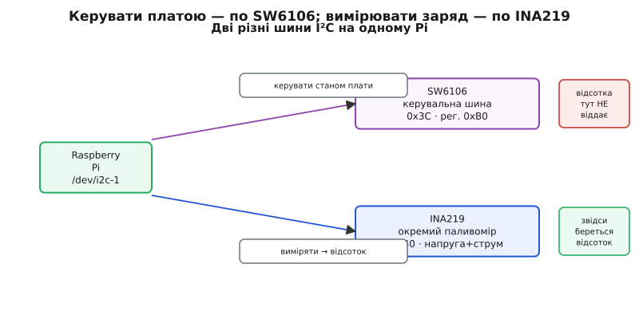
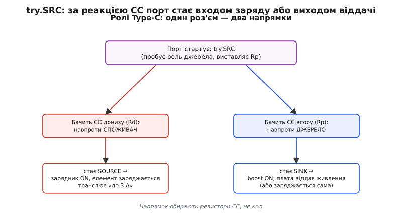

# ⚙️ Заглянути в SW6106 по I²C — і чому це не дає відсотка заряду

Задача звучить невинно: у мене на Raspberry Pi висить живильний HAT на SW6106, я хочу, щоб система сама знала, скільки лишилось заряду, і коректно вимкнулась, коли елемент майже сів. У чипа є I²C. Гуглиш «SW6106 read battery i2c», знаходиш снипет на п'ять рядків, запускаєш — і він або віддає `Remote I/O error`, або повертає одне число `0x24`, яке нічого тобі не каже. Знайоме?

Ця вставка розбирає три пов'язані речі, які разом пояснюють цю ситуацію до дна: (1) як **справді** достукатися до I²C-інтерфейсу SW6106 і чому «магічний регістр» з інтернету так часто мовчить; (2) чому надійний рівень заряду знімають **не** з керувального інтерфейсу цього чипа, а окремим паливоміром по напрузі — і як це зробити робочим кодом; (3) як SW6106 перемикає ролі Type-C у двобічному тракті (`try.SRC`, роль SOURCE/SINK, broadcast «я даю 3 А») і що ця механіка означає для твого коду, навіть якщо жодного рядка про Type-C ти не пишеш.

Скрізь буде реальний код, який запускається на Pi, а не псевдокод. Почнемо з того, чому інтерфейс взагалі мовчить.

## Ідея: керувальний інтерфейс ≠ паливомір

Головна помилка — очікувати від I²C цього чипа те, для чого він не призначений. Розділімо два зовсім різні поняття, які новачок зливає в одне.

**Паливомір** (англ. fuel gauge — «показник палива») — це вузол, що веде точний облік заряду: інтегрує струм у часі (скільки ампер-годин утекло), знає ємність елемента, коригується за напругою й температурою і віддає тобі **число у відсотках**, яке можна класти в логіку. Спеціалізовані паливоміри — це окремі мікросхеми (наприклад, сімейство TI BQ27xxx), у яких по I²C є десятки регістрів: `StateOfCharge`, `Voltage`, `AverageCurrent`, `RemainingCapacity`. Ти читаєш `SoC` — отримуєш «73%».

**Керувальний інтерфейс SW6106** — це зовсім інше. Так, у чипі **є** внутрішній паливомір із 12-бітним АЦП, і саме він гасить світлодіоди в міру розряду. Але назовні, по I²C, ISMARTWARE винесла **вузьку керувальну шину**: адреса пристрою `0x3C`, доступ через єдиний регістр `0xB0`, швидкість 100 або 400 кбіт/с. Це інтерфейс для **керування станом плати** (перемкнути режим, розбудити вихід, налаштувати поведінку), а **не** багатий телеметричний потік «віддай мені точний відсоток і напругу окремими регістрами». Datasheet DS008 описує I²C саме так скупо — і це не недогляд документації, а межа самого інтерфейсу.

> 🔧 **Навіщо це.** Уся плутанина в мережі росте з одного кореня: люди бачать слово «fuel gauge» у списку можливостей SW6106 і роблять хибний висновок, що по I²C можна прочитати відсоток, як у BQ27441. Насправді паливомір SW6106 **показує** заряд світлодіодами, а не **віддає** його числом по шині. Зрозумієш цю різницю одразу — заощадиш вечір, витрачений на «чому регістр повертає сміття».

Найкрасномовніший доказ — самі плати Waveshare. Їхні власні UPS HAT-и, побудовані на SW6106, для моніторингу рівня заряду в Python-прикладах читають **не SW6106**, а окрему мікросхему-паливомір **INA219** на тій самій шині I²C. Тобто навіть виробник, який поставив SW6106, для «скільки відсотків лишилось» ставить **другий** чип. Це і є відповідь на питання «чому не читати відсоток із самого SW6106»: бо навіть ті, хто його продає, так не роблять.


*Дві різні шини на одному Pi. Тонка (0x3C, регістр 0xB0) — керування станом SW6106. Товста (0x40) — окремий паливомір INA219, який і дає число у відсотках. Виробник власних UPS-плат іде саме другим шляхом.*

Тримаймо цю ідею як хребет: **керувати** платою — по I²C SW6106; **вимірювати** заряд надійно — окремим паливоміром. Тепер до коду обох шляхів.

## Крок 1. Достукатися до I²C SW6106 (і чому воно мовчить)

Перш ніж читати регістр, треба, щоб пристрій узагалі **з'явився** на шині. Ось де відпадає більшість інтернет-снипетів. Три умови мусять збігтися, і всі три легко проґавити.

**Умова перша — LED4/I2C притягнуто до землі.** У SW6106 чотири виводи **спільні** для драйвера світлодіодів і для I²C. За замовчуванням вони світять індикацію заряду; шиною вони стають, лише коли спеціальний вивід (`LED4/I2C`) притягнуто до землі. Якщо на **твоїй** конкретній платі цей вивід не розведено на землю — I²C фізично вимкнено, і будь-який код мовчатиме, хоч що ти пиши. Це причина №1, чому чужий снипет «у мене працював, а в тебе ні»: у автора плата з розведеним LED4/I2C, у тебе — ні.

**Умова друга — правильна адреса й правильна її форма.** Datasheet дає адресу `0x3C`. Але тут причаїлась класична пастка I²C: **7-бітна vs 8-бітна адреса**. Про неї нижче окремим блоком — це джерело половини `Remote I/O error`.

**Умова третя — шину Pi ввімкнено.** На Raspberry Pi I²C за замовчуванням вимкнено; його вмикають у `raspi-config` (або рядком `dtparam=i2c_arm=on` у `/boot/config.txt`), після чого з'являється пристрій `/dev/i2c-1`.

Найперше, що варто зробити, — **не писати код узагалі**, а просто спитати шину, хто на ній є:

```bash
# увімкнено I²C? має бути /dev/i2c-1
ls /dev/i2c-*

# хто відповідає на шині 1 (стандартна для 40-пінової гребінки)?
i2cdetect -y 1
```

Якщо `i2cdetect` показує `3c` у сітці — інтерфейс живий, LED4/I2C притягнуто, можна працювати. Якщо клітинка `3c` порожня — **жоден рядок Python чи C тебе не врятує**: проблема апаратна (LED4/I2C не на землі) або шину не ввімкнено. Це головний діагностичний крок, який пропускають снипети: вони одразу лізуть читати регістр, замість спершу переконатися, що пристрій узагалі відгукується.

> 🔧 **Навіщо це.** `i2cdetect` економить години наосліп. Порожня клітинка `3c` — це не «поганий код», це «пристрою нема на шині». Розділяй ці два світи: спершу апаратна присутність (`i2cdetect`), і **тільки потім** — семантика регістра. Плутати їх — значить дебажити софт там, де проблема в залізі.

Тепер, коли `3c` світиться в сітці, ось мінімальний доступ. Оскільки це прямий доступ до регістра пристрою на шині ядра — код на C через Linux `i2c-dev` (домашня мова для роботи з `/dev/i2c-*`), поряд — компактний Python через `smbus2` для швидкої перевірки:

:::tabs
== C (Linux i2c-dev)
```c
// sw6106_probe.c — прочитати керувальний регістр SW6106 по I²C.
// Збірка:  gcc -O2 -o sw6106_probe sw6106_probe.c
// Запуск:  ./sw6106_probe            (потрібні права на /dev/i2c-1)
#include <stdio.h>
#include <fcntl.h>
#include <unistd.h>
#include <errno.h>
#include <string.h>
#include <sys/ioctl.h>
#include <linux/i2c-dev.h>

#define SW6106_ADDR  0x3C   // 7-бітна адреса (саме 7-бітна — див. блок нижче)
#define SW6106_REG   0xB0   // єдиний керувальний регістр із datasheet

int main(void) {
    int fd = open("/dev/i2c-1", O_RDWR);
    if (fd < 0) { perror("open /dev/i2c-1"); return 1; }

    // ioctl бере САМЕ 7-бітну адресу; ядро само зсуне її й додасть біт R/W
    if (ioctl(fd, I2C_SLAVE, SW6106_ADDR) < 0) {
        perror("ioctl I2C_SLAVE"); close(fd); return 1;
    }

    // записати номер регістра, потім прочитати його байт (SMBus read-byte-data)
    unsigned char reg = SW6106_REG, val = 0;
    if (write(fd, &reg, 1) != 1) {          // виставити «покажчик» на 0xB0
        fprintf(stderr, "write reg: %s\n", strerror(errno));
        fprintf(stderr, "  порожньо у i2cdetect? LED4/I2C не на землі.\n");
        close(fd); return 1;
    }
    if (read(fd, &val, 1) != 1) {           // прочитати вміст 0xB0
        fprintf(stderr, "read val: %s\n", strerror(errno));
        close(fd); return 1;
    }

    printf("SW6106 reg 0xB0 = 0x%02X\n", val);
    printf("Це керувальне значення, НЕ відсоток заряду.\n");
    close(fd);
    return 0;
}
```
== Python (smbus2)
```python
# sw6106_probe.py — та сама перевірка, коротко.
#   pip install smbus2   (або: apt install python3-smbus)
from smbus2 import SMBus

BUS      = 1       # /dev/i2c-1 — гребінка Pi
SW6106   = 0x3C    # 7-бітна адреса; бібліотека сама зсуне її
REG      = 0xB0    # керувальний регістр із datasheet

try:
    with SMBus(BUS) as bus:
        val = bus.read_byte_data(SW6106, REG)
        print(f"SW6106 reg 0xB0 = 0x{val:02X}")
        print("Це керувальне значення, НЕ відсоток заряду.")
except OSError as e:
    # errno 121 == Remote I/O error: пристрій не відповів
    print(f"Немає відповіді (errno {e.errno}).")
    print("Спершу перевір i2cdetect -y 1: чи є 3c у сітці?")
    print("Порожньо → LED4/I2C не притягнуто до землі на цій платі.")
```
:::

Зверни увагу на послідовність «записати номер регістра → прочитати байт». Це стандартна для I²C схема доступу до регістра (у SMBus-термінах — `read-byte-data`): спершу транзакцією запису ти кажеш «мене цікавить регістр 0xB0», потім транзакцією читання забираєш його вміст. У бібліотеці `smbus2` це один виклик `read_byte_data(addr, reg)`, у C — явні `write` тоді `read`.

І от що критично: навіть якщо цей код **успішно** щось повернув — це «щось» є сирим значенням керувального регістра з недокументованим для сторонньої людини сенсом, а **не** відсотком заряду. Не будуй на ньому логіку «вимкнутись при 20%». Це підводить нас до пастки, яку варто винести окремо.

> 🔧 **Навіщо це.** Снипет із мережі часто виглядає так, ніби «читає рівень заряду», бо автор назвав змінну `battery`. Але назва змінної не робить регістр паливоміром. Значення `0xB0` може мінятися з зарядом (внутрішній стан таки корелює), і це створює **ілюзію**, що воно і є відсоток. Побудуєш на цій ілюзії відключення сервера — і одного дня Pi згасне на «половині», бо кореляція — не шкала.

## Пастка 7-біт / 8-біт: чому саме тут гине половина спроб

Це джерело `Remote I/O error` номер один, і воно варте окремого розбору, бо повторюється з **кожним** I²C-пристроєм, не лише SW6106.

Адреса на шині I²C — **7-бітна**. У кожному кадрі ці 7 біт адреси йдуть старшими, а наймолодшим, восьмим, бітом іде напрямок: `0` — запис, `1` — читання. Тобто в байті, що реально їде дротом, адреса вже **зсунута ліворуч на 1**, а на звільнене місце вставлено біт R/W.

Через це та сама фізична адреса виглядає **двома різними числами** залежно від того, як її записати:

```
7-бітна форма (як у Linux, smbus, i2cdetect):   0x3C
8-бітна форма запису  (7-біт << 1 | 0):          0x78
8-бітна форма читання (7-біт << 1 | 1):          0x79

перевірка:  0x3C = 0111100₂
            << 1 = 1111000₂ = 0x78   (біт запису)
            | 1  = 1111001₂ = 0x79   (біт читання)
```

Уся плутанина в тому, що **різні джерела наводять адресу в різній формі**. Datasheet або чужий снипет може написати `0x78` (8-бітна форма запису), а Linux-стек — `smbus2`, `i2cdetect`, `ioctl(I2C_SLAVE)` — очікує **7-бітну** `0x3C` і зсуває її сам. Підставиш `0x78` туди, де чекають 7-біт, — ядро зсуне ще раз, звернеться за зовсім іншою адресою (`0x78 << 1`), пристрій не відгукнеться — і ти отримаєш `Remote I/O error` на цілком правильному в усьому іншому коді.

> 🔧 **Навіщо це.** Правило, що знімає цей клас помилок раз і назавжди: **у Linux завжди підставляй те число, яке показує `i2cdetect`.** `i2cdetect` друкує саме 7-бітні адреси. Бачиш у сітці `3c` — у коді пиши `0x3C`, і крапка. Якщо десь у документі трапилось `0x78` — поділи навпіл (зсунь праворуч на 1): `0x78 >> 1 = 0x3C`. Не існує «правильної» відповіді в абсолюті; існує «форма, якої чекає цей конкретний API», а Linux-стек чекає 7-біт. Тонкі деталі адресації — у [статті про адресацію I²C](book:communications/i2c-addressing).

Ця пастка й «LED4/I2C не на землі» разом пояснюють, чому один і той самий п'ятирядковий снипет у одного працює, а в іншого мовчить: у першого плата з розведеним LED4/I2C і адреса в 7-бітній формі, у другого — котрась із двох умов порушена.

## Крок 2. Надійний рівень заряду — окремий паливомір по напрузі

Раз керувальний інтерфейс SW6106 не віддає відсотка, надійне число беруть **збоку** — вимірюють напругу (а краще й струм) елемента окремим давачем і перераховують у відсоток. Це шлях, яким іде сам Waveshare на своїх UPS-платах, і саме його варто повторити, коли логіка Pi мусить коректно завершитись при низькому заряді.

Робочий інструмент — той самий **INA219** (монітор напруги й струму по шунту, TI): маленька мікросхема, що сідає на I²C (типова адреса `0x40`), вимірює напругу на елементі й струм через невеликий шунтовий резистор. Ключові її регістри:

```
INA219, типова адреса 0x40
  регістр 0x02  Bus Voltage   — напруга; біти [15:3] значущі, крок 4 мВ
  регістр 0x01  Shunt Voltage — напруга на шунті; крок 10 мкВ (→ струм)
```

Спершу — сирий доступ до INA219 на C через `i2c-dev`, бо це знову прямий регістр пристрою (домашня мова для `/dev/i2c-*`). Bus-voltage регістр повертає 16 біт big-endian, значущі — старші 13; тому прочитане слово зсувають праворуч на 3 і множать на крок 4 мВ:

```c
// ina219_volt.c — прочитати напругу елемента з INA219 (адреса 0x40).
// Збірка:  gcc -O2 -o ina219_volt ina219_volt.c
#include <stdio.h>
#include <fcntl.h>
#include <unistd.h>
#include <sys/ioctl.h>
#include <linux/i2c-dev.h>

#define INA219_ADDR   0x40   // 7-бітна; div by 2, якщо десь бачиш 0x80
#define REG_BUSVOLT   0x02

int main(void) {
    int fd = open("/dev/i2c-1", O_RDWR);
    if (fd < 0) { perror("open"); return 1; }
    if (ioctl(fd, I2C_SLAVE, INA219_ADDR) < 0) { perror("addr"); return 1; }

    unsigned char reg = REG_BUSVOLT, buf[2];
    write(fd, &reg, 1);          // навести покажчик на регістр напруги
    if (read(fd, buf, 2) != 2) { perror("read"); return 1; }

    // 16 біт big-endian; значущі — старші 13 → зсув на 3; крок 4 мВ
    int raw = (buf[0] << 8) | buf[1];
    double volts = (raw >> 3) * 0.004;   // 4 мВ на одиницю
    printf("Напруга елемента: %.3f В\n", volts);
    close(fd);
    return 0;
}
```

Тепер — власне мета: з напруги зробити **відсоток**, який кладеться в логіку вимкнення. Тут доречніша не C, а мова прикладного шару — розрахунок і моніторинг у сервісі Pi зазвичай пишуть на Python (домінантна мова для такого glue), і поряд TypeScript (типовий вибір для сервісного демона на Node). Обидві читають напругу з паливоміра й перекладають її в грубий відсоток за кривою розряду літію:

:::tabs
== Python
```python
# battery_percent.py — напруга елемента → грубий відсоток → рішення вимкнутись.
#   pip install smbus2
from smbus2 import SMBus

INA219 = 0x40        # адреса паливоміра (7-біт)
REG_V  = 0x02        # Bus Voltage

def read_voltage(bus):
    raw = bus.read_word_data(INA219, REG_V)     # word: байти переставлено
    raw = ((raw << 8) | (raw >> 8)) & 0xFFFF    # → big-endian
    return (raw >> 3) * 0.004                    # значущі 13 біт · 4 мВ

# Груба крива розряду одного літієвого елемента (напруга під легким
# навантаженням → відсоток). Не лінійна: літій довго тримає ~3.7 В,
# а наприкінці напруга падає стрімко. Точні числа — під СВІЙ елемент.
CURVE = [
    (4.20, 100), (4.10, 90), (4.00, 80), (3.90, 65),
    (3.80, 50),  (3.70, 40), (3.60, 25), (3.50, 15),
    (3.40, 8),   (3.30, 3),  (3.00, 0),
]

def voltage_to_percent(v):
    if v >= CURVE[0][0]:  return 100
    if v <= CURVE[-1][0]: return 0
    for (v_hi, p_hi), (v_lo, p_lo) in zip(CURVE, CURVE[1:]):
        if v_lo <= v <= v_hi:                    # лінійна інтерполяція в сегменті
            k = (v - v_lo) / (v_hi - v_lo)
            return round(p_lo + k * (p_hi - p_lo))
    return 0

SHUTDOWN_AT = 10   # відсоток, на якому пора гасити систему коректно

with SMBus(1) as bus:
    v = read_voltage(bus)
    pct = voltage_to_percent(v)
    print(f"{v:.3f} В  →  ~{pct}%")
    if pct <= SHUTDOWN_AT:
        print("Низький заряд — коректне вимкнення.")
        # import os, subprocess
        # subprocess.run(["sudo", "shutdown", "-h", "now"])
```
== TypeScript (Node)
```typescript
// battery_percent.ts — те саме для сервісного демона на Node.
//   npm i i2c-bus     (bindings до /dev/i2c-*)
import { openSync } from "i2c-bus";

const INA219 = 0x40; // 7-бітна адреса паливоміра
const REG_V  = 0x02; // Bus Voltage

function readVoltage(): number {
  const bus = openSync(1); // /dev/i2c-1
  const raw = bus.readWordSync(INA219, REG_V);
  bus.closeSync();
  const be = ((raw << 8) | (raw >> 8)) & 0xffff; // → big-endian
  return (be >> 3) * 0.004;                        // 13 біт · 4 мВ
}

// Та сама груба крива розряду літію (напруга → відсоток).
const CURVE: [number, number][] = [
  [4.2, 100], [4.1, 90], [4.0, 80], [3.9, 65],
  [3.8, 50],  [3.7, 40], [3.6, 25], [3.5, 15],
  [3.4, 8],   [3.3, 3],  [3.0, 0],
];

function voltageToPercent(v: number): number {
  if (v >= CURVE[0][0]) return 100;
  if (v <= CURVE[CURVE.length - 1][0]) return 0;
  for (let i = 0; i < CURVE.length - 1; i++) {
    const [vHi, pHi] = CURVE[i];
    const [vLo, pLo] = CURVE[i + 1];
    if (v >= vLo && v <= vHi) {
      const k = (v - vLo) / (vHi - vLo); // інтерполяція в сегменті
      return Math.round(pLo + k * (pHi - pLo));
    }
  }
  return 0;
}

const SHUTDOWN_AT = 10;
const v = readVoltage();
const pct = voltageToPercent(v);
console.log(`${v.toFixed(3)} В  →  ~${pct}%`);
if (pct <= SHUTDOWN_AT) {
  console.log("Низький заряд — коректне вимкнення.");
  // import { execSync } from "child_process";
  // execSync("sudo shutdown -h now");
}
```
:::

Тут варто чесно сказати про межі методу. **Відсоток із напруги — грубий**, і ось чому. Літій під навантаженням «просідає»: під струмом та сама напруга відповідає вищому справжньому заряду, ніж у спокої (внутрішній опір з'їдає частину напруги). Крива не лінійна: у широкому «плато» біля 3.6–3.9 В напруга майже стоїть, поки заряд повзе від 30% до 70% — саме тут відсоток із напруги найгрубіший. Тому такий перерахунок добрий для **порогових рішень** («менше 10% — гасимо систему»), але поганий для точної шкали «показати користувачу 73%».

Справжній паливомір (той-таки BQ27441) точніший, бо не гадає з напруги, а **інтегрує струм** у часі (кулонометрія): рахує реально втрачені мілі-ампер-години й коригується. INA219 струм теж міряє (регістр 0x01), тож на його основі можна зробити власну кулонометрію — але це вже помітно складніша логіка з калібруванням і врахуванням саморозряду. Для «коректно вимкнутись при низькому заряді» вистачає порогу по напрузі; для «точний відсоток у інтерфейсі» — бери спеціалізований паливомір. Основи вимірювання напруги АЦП-ом — у [статті про АЦП](book:electronics/adc).

> 🔧 **Навіщо це.** Найпоширеніша хиба тут — накрутити точну шкалу відсотків на грубий вимір і здивуватись, чому Pi «бреше про заряд». Правильна установка: **напруга дає надійний ПОРІГ, а не точну ШКАЛУ.** Постав поріг вимкнення з запасом (напр. 3.4–3.5 В — це вже «майже сів»), додай гістерезис (щоб не смикалось біля порога), і система переживе розряд гідно, навіть не знаючи заряду до відсотка.

## Крок 3. Ролі Type-C у двобічному тракті — і чому це стосується коду

Тепер про частину, яку легко проґавити, бо здається «не про софт». SW6106 — двобічний: ті самі порти працюють і на вхід (заряд елемента), і на вихід (віддача назовні). За цю двобічність на Type-C відповідає механіка **ролей**, і вона впливає на те, як поводиться твоя система, навіть якщо жодного рядка про USB ти не пишеш.

Спершу — як Type-C взагалі розрізняє, хто джерело, а хто споживач. На відміну від старого USB, де роль задавав тип роз'єму (A — хост, B — пристрій), у Type-C роль визначають дві сигнальні лінії **CC** (Configuration Channel) через **резистори**:

```
Джерело (SOURCE, дає живлення)     підтягує CC вгору резистором Rp
Споживач (SINK, бере живлення)     підтягує CC вниз резистором Rd
```

Хто бачить на CC «низ» (Rd) — розуміє «навпроти мене споживач, я маю дати живлення». Хто бачить «верх» (Rp) — розуміє «навпроти джерело, я споживаю». А величина Rp у джерела ще й **транслює струм**, який воно готове дати: певний рівень Rp означає «я тягну до 3 А». Це і є той **broadcast power level 3A**, про який мова: SW6106, ставши джерелом, виставляє CC так, щоб під'єднаний пристрій прочитав «звідси можна брати до 3 А» — далі, якщо обидва вміють PD, вони уточнюють контракт цифрово (домовляються про 5/9/12 В). Механіка ролей і контрактів PD детально — у [статті про USB Power Delivery](book:electronics/usb-pd).

А тепер ключове для двобічного чипа: SW6106 не «або джерело, або споживач» назавжди — він **пробує ролі**. Порт стартує в режимі, де спершу намагається бути джерелом (`try.SRC` — «спробувати SRC»): виставляє Rp і дивиться, чи не підтягне хтось CC донизу (тобто чи не під'єднали споживача). Не підтягнув — пробує роль споживача. Ця «крутилка ролей» (DRP — Dual-Role Port) і робить один роз'єм двобічним: залежно від того, **що** увіткнули, той самий порт стає то входом заряду, то виходом віддачі.

Datasheet описує наслідок прямо: **коли під'єднано SOURCE — порт вмикається і автоматично стартує зарядник** (елемент заряджається); **коли під'єднано SINK — порт вмикається і автоматично стартує boost** (плата віддає живлення). Тобто напрямок енергії вибирає **апаратна** логіка ролей CC, миттєво, без участі твого коду.


*Порт пробує роль джерела (try.SRC). Побачив унизу CC споживача (Rd) → стає SOURCE, вмикає зарядник, транслює «до 3 А». Побачив угорі джерело (Rp) → стає SINK, вмикає boost. Один роз'єм — два напрямки, вибір апаратний.*

Що з цього випливає для **коду** — три дуже практичні речі:

- **Напрямок обирає не твій код, а те, що ти увіткнув.** Твоя програма на Pi **не перемикає** Type-C у вхід чи вихід через I²C — цим керує апаратна логіка CC. Не шукай регістра «зроби порт входом»: рішення ухвалюють резистори Rp/Rd у момент під'єднання, а не шина керування.
- **Двобічність — причина залізного правила «одне джерело за раз».** Раз порт може миттю стати або входом, або виходом, твоя система мусить **гарантувати**, що не тікають двоє джерел назустріч. Не подавай зовнішнє живлення на HAT, коли Pi ще під'єднано до штатного блока: два джерела штовхають 5 В в одну шину — псують електроніку. Це не «порада про дроти», це наслідок того, як влаштована рольова логіка.
- **Перемикання джерела впливає на твій моніторинг заряду.** Контролер шляху перемикає джерело (зовнішнє ↔ елемент) без провалу напруги для Pi — тобто твій код цього **не помітить** як збою живлення. Але паливомір це помітить: коли зовнішнє живлення прийшло, елемент **заряджається**, і напруга на ньому росте не через «відновлення», а через заряд. Отже логіку відсотка треба писати так, щоб вона розуміла: зростання напруги при наявному вході — це заряд, а не «елемент сам ожив». Простий вихід — читати ще й струм INA219: додатний (у бік елемента) — заряджається, від'ємний — розряджається під навантаженням.

> 🔧 **Навіщо це.** Новачок шукає в I²C SW6106 команду «перемкни порт у режим виходу» — і не знаходить, бо її **немає й не має бути**: напрямок Type-C — апаратне рішення за резисторами CC, а не програмне. Зрозумієш це — перестанеш дебажити неіснуючий регістр і побудуєш моніторинг правильно: напрямок енергії читаєш **зі знаку струму паливоміра**, а не намагаєшся ним керувати.

## Складність і пастки: підсумок

Збираючи докупи весь розбір, ось повний список пасток, у які влучають, підступаючись до SW6106 з кодом, — кожну ми проходили вище:

- **Очікувати відсоток заряду від керувального інтерфейсу.** SW6106 по I²C (0x3C, регістр 0xB0) — вузька керувальна шина, а не паливомір. Відсоток бери окремим давачем по напрузі (INA219 чи спеціалізований паливомір). Сам виробник на своїх UPS-платах робить саме так.
- **LED4/I2C не притягнуто до землі.** Тоді чотири спільні виводи лишаються драйвером світлодіодів, а I²C фізично вимкнено. `i2cdetect -y 1` покаже порожню клітинку `3c` — і жоден код не зарадить, бо проблема апаратна.
- **Плутанина 7-біт / 8-біт адреси.** У Linux (`smbus`, `i2cdetect`, `ioctl`) підставляй **7-бітну** `0x3C` — ту, що показує `i2cdetect`. Побачив у документі `0x78` — поділи навпіл (`>> 1`). Ця одна помилка дає більшість `Remote I/O error`.
- **Довіряти сирому значенню регістра як шкалі.** Навіть коли `0xB0` щось повернув і воно **корелює** із зарядом — це кореляція, а не задокументована шкала. Логіку вимкнення на ній не будують.
- **Крутити точну шкалу відсотків на грубий вимір напруги.** Літій має пласке плато й просідає під навантаженням: напруга дає надійний **поріг**, а не точну **шкалу**. Для «показати 73%» — кулонометрія (справжній паливомір); для «гасити при 10%» — вистачає порогу по напрузі з гістерезисом.
- **Шукати в I²C команду «перемкни Type-C у вхід/вихід».** Напрямок обирає апаратна логіка ролей CC (`try.SRC`, Rp/Rd) у момент під'єднання, а не твій код. Напрямок енергії **читай** зі знаку струму паливоміра, а не намагайся ним керувати по шині.

Головна думка, що зшиває все: **розділяй керування і вимірювання.** Керувати платою й розуміти її стан — це I²C SW6106 і апаратна логіка ролей, яку ти не програмуєш, а лише враховуєш. Надійно **вимірювати** заряд — це окремий паливомір по напрузі й струму. Змішаєш ці дві площини — і матимеш мовчазний регістр, брехливий відсоток і Pi, що гасне «на половині». Розділиш — і отримаєш систему, яка чесно знає, коли пора спати.
