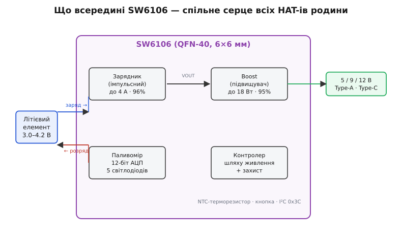
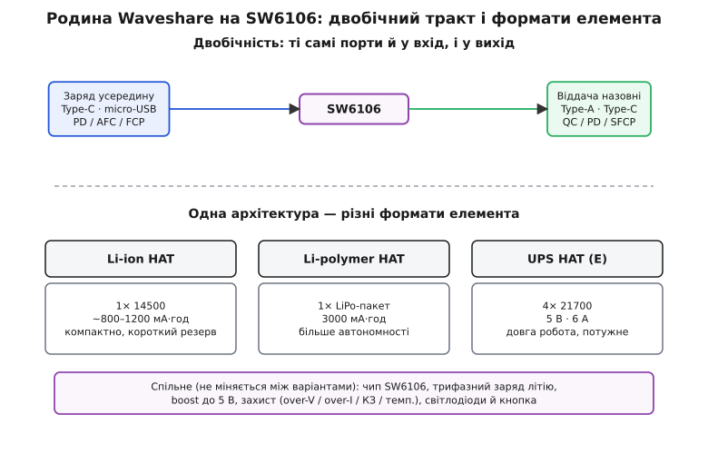

# Родина живильних HAT-ів Waveshare (SW6106)

<preknowlist>
- [Boost-перетворювач](topic:electronics/boost) — як зі змінних 3–4.2 В зробити стабільні 5 В і чому це не «просто резистор».
- [Літій-іонний акумулятор](topic:power/videx-14500) — 3.7 В номінал, 4.2 В повний, 3.0 В межа розряду; чому літій не можна ні перезарядити, ні глибоко розрядити.
- [USB Power Delivery](topic:electronics/usb-pd) — як по USB-C домовляються про напругу 5/9/12 В: хто «джерело», хто «споживач», що таке контракт.
- [Шина I²C](topic:communications/i2c-bus) — дві лінії SDA/SCL, адреса пристрою, читання/запис регістра; знадобиться для програмного доступу.
</preknowlist>

Коли Raspberry Pi чи інша 5-вольтова плата має поїхати з розетки, постає щоразу та сама трійця задач: віддати чисті стабільні 5 В від літієвого елемента, той елемент безпечно заряджати від USB і не спалити при цьому ні елемент, ні плату. Waveshare розв'язує цю трійцю не одним пристроєм, а цілою лінійкою «капелюхів» (англ. HAT — Hardware Attached on Top, «залізо, начеплене згори») — плат, що сідають зверху на 40-пінову гребінку Pi. І майже вся ця лінійка побудована навколо однієї мікросхеми — **SW6106**. Тому й говорити про них варто разом: зрозумієш чип — зрозумієш усю родину, а різняться варіанти здебільшого форматом елемента.

Ця стаття — про спільне: що вміє SW6106, чому ця родина «двобічна», як вона заряджає літій і чим захищає, і як обрати варіант під свою задачу. Специфіка кожної конкретної плати — на її власній сторінці; сюди варто заглянути, щоб не перечитувати спільну частину щоразу.

## Що об'єднує родину

Візьми будь-який із цих HAT-ів — Li-ion з елементом 14500, Li-polymer з пласким пакетом-«таблеткою», UPS-варіанти під 18650 чи 21700 — і зазирни під тримач акумулятора. Там майже завжди та сама картина: невеликий квадратний чип у корпусі QFN, поряд одна котушка-індуктивність, кілька конденсаторів, ряд світлодіодів і кнопка. Це не збіг. Це **типове рішення повербанка** (англ. power bank — «банк живлення», кишеньковий акумулятор із USB), яке Waveshare бере як готовий вузол і лише «одягає» в потрібний формат елемента.

Ключова думка, з якої випливає все інше: **ці плати — не «батарейки», а зарядник + перетворювач + захист + індикація в одному чипі, а сам елемент змінний.** Уся інженерія схована в SW6106; плата навколо нього — це роз'єми, тримач і світлодіоди. Тому логічно вивчати не «характеристики HAT», а можливості мікросхеми: плата успадковує їх майже один в один.

> 🔧 **Навіщо це.** Правильна ментальна модель економить години. Хочеш дізнатися граничний струм виходу, поведінку при перегріві, які протоколи швидкого заряду підтримуються — не шукай ці числа в короткому описі плати на сайті магазину. Шукай **datasheet SW6106**: там усі відповіді, а конкретна плата лише вирішує, який елемент і які роз'єми до чипа підключено.

## SW6106: одна мікросхема, що робить усе

**SW6106** — контролер повербанків від китайської компанії ISMARTWARE (повна назва — ZHUHAI ISMARTWARE TECHNOLOGY, м. Чжухай; datasheet DS008 v2.2, травень 2022). Корпус — **QFN-40 розміром 6×6 мм**: сорок виводів на квадратику завбільшки з ніготь мізинця. У цей квадратик втиснуто п'ять окремих вузлів, кожен з яких колись був би окремою мікросхемою.


*Спільне серце всіх HAT-ів родини. Заряд іде від входу через зарядник у елемент; розряд — від елемента через boost на виходи. Ті самі вузли працюють у два боки.*

Що саме поєднано в чипі:

- **Імпульсний зарядник** (англ. switching charger) зі струмом заряду **до 4 А** і ККД **до 96%**. «Імпульсний» означає, що зайву напругу він не «пропалює» в тепло, як лінійний зарядник, а перекачує порціями через котушку — звідси й високий ККД, і те, що плата не перетворюється на грілку. Робоча частота перемикання — до 400 кГц, тому вистачає крихітної котушки на 2.2 мкГн.
- **Синхронний boost** (підвищувальний перетворювач) потужністю **до 18 Вт** і ККД **до 95%**: бере 3–4.2 В від елемента й піднімає до 5 В, а за протоколами швидкого заряду — і до 9 чи 12 В на USB-виходах.
- **Паливомір** (англ. fuel gauge — «показник палива», як у авто) з 12-бітним АЦП: оцінює рівень заряду й показує його рядом світлодіодів (плата сама розпізнає, скільки їх — від 3 до 5).
- **Контролер шляху живлення** (англ. power path — «шлях живлення»): вирішує, звідки зараз брати струм — від USB, коли той під'єднано, чи від елемента, коли USB від'єднали, — і перемикає джерело без провалу напруги.
- **Захист**: від перенапруги на вході й виході, надструму, короткого замикання, перегріву чипа й аварійної температури елемента.

Плюс до цього — логіка кнопки й **шина I²C** для програмного доступу. Тобто одна мікросхема робить усе, що потрібно кишеньковому повербанку; Waveshare лише під'єднала до неї потрібний елемент і вивела роз'єми на край плати.

## Чому «двобічний»: заряд і віддача тими самими портами

Найважливіша риса цієї родини захована в слові, яким ISMARTWARE називає чип у datasheet: **Bidirectional Fast Charge Power Bank** — «двобічний швидкозарядний повербанк». Двобічність означає, що **ті самі USB-порти працюють і на вхід, і на вихід**, ще й зі швидкими протоколами в обидва боки.


*Угорі: заряд заходить через Type-C або micro-USB, віддача йде через Type-A або Type-C — і те, і те швидкими протоколами. Унизу: одна архітектура під різні елементи.*

Розберімо, що це дає на практиці. Порти чипа розподілені так:

- **Заряд усередину** приймають **Type-C** (протоколи PD3.0/PD2.0, AFC, FCP) і **micro-USB** (AFC, FCP). Тобто плату можна швидко заряджати від сучасного зарядного пристрою на 9 або 12 В, а не тільки повільно від звичайних 5 В.
- **Віддачу назовні** дають **Type-A** (QC3.0/QC2.0, AFC, FCP, PE, SFCP) і **Type-C** (той самий набір плюс PD). Тобто плата сама вміє швидко заряджати телефон, підключений до її USB-виходу.
- А ще ці 5 В (від boost) ідуть у гребінку — саме ними живиться Pi.

Двобічність — не просто маркетинг. Вона випливає з того, що boost і зарядник фізично поділяють вузол VOUT: коли на порт приходить зовнішнє живлення, чип бачить себе «споживачем» і вмикає зарядник; коли до порту під'єднують навантаження, чип стає «джерелом», вмикає boost і навіть повідомляє навантаженню «я можу дати до 3 А» (broadcast power level 3A — так вимагає протокол PD). Один і той самий роз'єм Type-C грає то одну роль, то іншу — про механізм цього перемикання ролей на рівні USB-C розказано у [вставці про двобічний тракт і ролі Type-C](topic:power/power-hat-family/api-i2c-fuel.md).

> 🔧 **Навіщо це.** Практичний наслідок: одна така плата замінює і зарядник елемента, і повербанк для телефона, і безперебійне джерело для Pi. Але звідси й пастка — **не подавай зовнішнє живлення на плату, коли Pi ще під'єднано до штатного блока**: два джерела, що штовхають 5 В в одну шину назустріч, псують електроніку. Двобічність зручна саме тому, що джерело в кожен момент **одне**, а чип сам вирішує, яке.

## Як родина заряджає літій: три фази

Літій не можна заряджати «як заманеться» — його заливають за суворим профілем, інакше елемент деградує, а то й спучується. SW6106 веде класичні **три фази**, і це поведінка спільна для всіх плат родини (різниться лише цільова напруга й струм — залежно від елемента).

**Трикл-заряд (TC, англ. trickle — «крапельний»).** Якщо елемент розряджено глибоко, бити його одразу повним струмом небезпечно — спершу «розганяють» малим. Datasheet задає це чітко: коли напруга елемента нижча за **1.5 В** — струм **200 мА**; у діапазоні **1.5–3.0 В** — **300 мА**. Це рятує елемент, який довго пролежав розрядженим у шухляді.

**Сталий струм (CC, англ. constant current).** Щойно напруга дійшла до **3 В**, зарядник дає повний струм і тримає його сталим. Величина залежить від того, чим живиться вхід: при **вході 5 В струм заряду — 2.5 А**, а при швидкому вході 9 або 12 В — аж до **4 А**. Напруга елемента при цьому плавно росте.

**Стала напруга (CV, англ. constant voltage).** Коли напруга дійшла до цільової, зарядник перестає її піднімати й натомість тримає сталою, а струм сам спадає. Щойно струм упав до порогу завершення — заряд закінчено, зарядник вимикається. Просіла напруга нижче порога дозаряду (**4.1 В** для стандартного літію) — цикл автоматично почнеться знову.

Цільову напругу задає окремий вивід чипа — **BSET**, і робить це елегантно, через один резистор до землі:

```
BSET висить у повітрі (не під'єднано) → 4.2 В   (звичайний Li-ion / LiPo)
BSET через 10 кОм на землю            → 4.3 В
BSET через 62 кОм на землю            → 4.35 В
BSET через 30 кОм на землю            → 4.4 В   (елементи високої напруги)
```

На платах під звичайний літій BSET лишають вільним — звідси стандартні **4.2 В**. Це і причина, чому в тримач не можна ставити «не той» елемент: чип заряджатиме до тієї напруги, яку задано резистором на платі, а не тієї, яку любить твій конкретний акумулятор.

**Прикинемо, скільки триватиме заряд плаского 3000-мА·год пакета від звичайного 5-вольтового зарядника.**
```
Ємність елемента     = 3000 мА·год = 3.0 А·год
Струм CC при вході 5В = 2.5 А
Груба оцінка фази CC  = 3.0 / 2.5 ≈ 1.2 год  (це ~70–80% ємності)
Хвіст CV (дозаряд)    ≈ +0.5–0.8 год  (струм там уже малий)

Разом                ≈ 1.7–2.0 год
```
Візьмеш зарядник на 9 В — фаза CC піде струмом до 4 А, і час скоротиться приблизно вдвічі. Це і є практична цінність швидкого входу: не «модна наліпка», а реально вдвічі коротший заряд.

## Захист: заради чого взагалі беруть готову плату

Можна купити зарядну мікросхему за копійки й спаяти зарядник самому. Причина, чому натомість беруть готовий HAT, — не лінощі, а **ешелон захисту**, який SW6106 забезпечує «з коробки». Літій прощає мало помилок, і кожна з них тут перекрита.

Що стереже чип:

- **Перезаряд** — не дасть перелити понад задану BSET напругу (4.2 В у нормі). Перезаряджений літій — це роздутий, а часом і палаючий елемент.
- **Глибокий розряд** — коли елемент виснажено до порогу UVLO (англ. undervoltage lockout — «замок за низькою напругою»), boost вимикається й відсікає навантаження. Глибоко розряджений літій незворотно деградує.
- **Надструм і коротке замикання** на виході — чип обмежить струм і вимкнеться, а не згорить.
- **Перегрів самого чипа** (thermal regulation): коли кристал нагрівається до порогу, boost сам **знижує вихідну напругу**, щоб температура перестала рости; дійде до порогу аварійного вимкнення — вимкнеться зовсім.
- **Аварійна температура елемента** — через терморезистор NTC (англ. negative temperature coefficient — «від'ємний температурний коефіцієнт», опір падає з нагрівом). Datasheet наводить приклад для типового датчика 103AT: **нижче −15 °C або вище +58 °C boost зупиняється** й вимикається, доки температура не повернеться в норму. Заряджати чи розряджати крижаний або гарячий літій — прямий шлях до аварії, і чип цього просто не дозволяє.

Одна тонкість про NTC-захист варта уваги: після спрацювання за температурою boost **не вмикається сам** — потрібна «подія пуску» (натиск кнопки або підключення навантаження). Це зроблено навмисно: щоб плата не почала блимати вмиканням-вимиканням, коливаючись біля порогу. Якщо ж терморезистор на конкретній платі не потрібен, його вивід просто садять на землю — і температурний захист вимкнено.

> 🔧 **Навіщо це.** Саме цей набір відрізняє «іграшку» від інженерного рішення. Робот у полі, метеостанція на морозі, датчик у гарячому корпусі — усе це сценарії, де без температурного захисту літій рано чи пізно постраждає. Беручи HAT на SW6106, ти отримуєш ці запобіжники безкоштовно; паяючи щось саморобне на дешевому TP4056 — уже ні.

## Виходи, boost і його стеля по струму

Boost видає до 18 Вт — але це стеля мікросхеми, і вона по-різному розкладається на різних напругах. Datasheet розписує це прямо:

```
Вихід 5 В:   струм до 3 А    (нижче 6 В обмеження саме по струму)
Вихід 9 В:   струм до 2 А    (вище 6 В обмеження вже по потужності — 18 Вт)
Вихід 12 В:  струм до 1.5 А
```

Для живлення Raspberry Pi важливий перший рядок: **на 5 В boost чипа тягне до 3 А**. Але тут критична різниця між «чип може» і «плата дає»: конкретні HAT-и часто віддають у гребінку менше — типово близько **1.8 А**, бо так закладено в розводку й тримач конкретної плати. Тому реальну стелю дивись на сторінці свого варіанта, а не в datasheet чипа.

> 🔧 **Навіщо це.** 1.8 А × 5 В ≈ 9 Вт. Голий Raspberry Pi 4 у навантаженні бере ~3–5 Вт, Pi Zero — менше вата, запас є. Але щойно навісиш зовнішній диск, камеру, Wi-Fi-донгл — 1.8 А стає тісно, напруга просяде, і почнуться «загадкові» перезавантаження, які насправді ніяка не загадка. Правило просте: **важку периферію (диски, потужні мотори) живи окремо, не через HAT.**

## Індикація й кнопка: спілкування без коду

Плата спілкується з тобою без жодного рядка коду — світлодіодами й кнопкою, і за все відповідає той самий чип.

**Ряд світлодіодів рівня** (плата сама розпізнає, скільки їх — 3, 4 чи 5) показує заряд грубою шкалою. У розряді паливомір гасить їх один за одним; коли лишається зовсім мало — останній починає блимати, попереджаючи «пора заряджати». Під час заряду вони, навпаки, «наливаються» вгору. Ще один світлодіод (окремий драйвер у чипі) світиться під час швидкого заряду — сигнал, що протокол PD/QC справді домовився про підвищену напругу.

**Кнопка** (англ. push key) реалізує типову логіку повербанка: короткий натиск будить вихід і підсвітку, подвійний — присипляє. Це важливо для економії: без навантаження чип сам іде в режим малого струму (одиниці мікроампер спокою), щоб не висмоктувати елемент, поки плата лежить без діла.

## Як зазирнути в плату з коду: I²C

Найчастіше цим платам код узагалі не потрібен: вставив елемент, начепив HAT — Pi живиться, світлодіоди показують заряд. Але SW6106 має **шину I²C**, і тут потрібна чесність, бо в мережі повно плутанини.

У чипі **чотири виводи спільні для світлодіодів і для I²C**: за замовчуванням вони світять індикацію, а працюють як шина, лише коли спеціальний вивід (LED4/I2C) притягнуто до землі — тобто на платі це має бути свідомо розведено. Datasheet описує доступ як **адресу пристрою 0x3C** і читання/запис через **регістр 0xB0**, на швидкостях 100 або 400 кбіт/с. Але це вузький керувальний інтерфейс, а не багатий набір «прочитай напругу, прочитай точний відсоток», який дають спеціалізовані паливоміри (окремі мікросхеми-газометри, що ведуть облік ампер-годин і віддають точний відсоток по I²C). Простими словами: SW6106 радше **показує** заряд світлодіодами, ніж **віддає** його точним числом по шині.

Тому на практиці, якщо тобі потрібне надійне число «скільки лишилось відсотків» для логіки Pi (коректно вимкнутись при 10%, надіслати попередження), розумніший шлях — не покладатися на I²C цієї плати, а виміряти напругу елемента окремим маленьким паливоміром чи АЦП і перерахувати її у відсоток. Робочий приклад доступу по I²C, розбір ролей Type-C у двобічному тракті й того, чому «magic register» з інтернет-снипетів часто мовчить, — у [вставці з кодом](topic:power/power-hat-family/api-i2c-fuel.md).

> 🔧 **Навіщо це.** Головна пастка новачка — знайти в мережі снипет «читаємо SW6106 по I²C» і чекати від нього рівня заряду, а він або мовчить (бо LED4/I2C не притягнуто до землі), або віддає сире значення регістра без задокументованого сенсу. Зрозумій одразу: **індикація заряду тут апаратна (світлодіоди), а не програмна.** Потрібне точне число в коді — плануй окремий паливомір.

## Як обрати варіант родини

Оскільки чип і вся його поведінка спільні, вибір між платами родини зводиться майже виключно до **формату елемента** — тобто до балансу «компактність ↔ автономність». Груба карта:

- **Li-ion HAT (елемент 14500).** Найкомпактніший: 14500 короткий, плата не стирчить над Pi. Розплата — ємність (~800–1200 мА·год), тобто година-дві для активного Pi. Для мобільних вузлів, де важлива компактність, а не доба роботи. Специфіка й повний розбір — на [сторінці Li-ion Battery HAT](topic:power/liion-hat-rpi).
- **Li-polymer HAT (плаский пакет ~3000 мА·год).** Той самий чип, але елемент — пласка «таблетка» LiPo (англ. lithium polymer — літій-полімерний, різновид літію з гелевим електролітом у м'якому пакеті). Ємність утричі більша за 14500, тож і автономність відповідна. Компроміс — товщина складання. Про сам тип елемента — [стаття про LiPo](topic:power/lipo-3s).
- **UPS-варіанти (18650, 21700, іноді кілька елементів).** Найбільша ємність і струм (окремі моделі дають 5 В аж до 6 А). Це вже про довгу роботу й потужне навантаження, ціною габаритів. Частина з них зроблена як справжній безперебійник (перемикання джерела без провалу для Pi), частина — ні; це варто перевіряти по конкретній моделі.

Важлива засторога, спільна для «battery HAT»-варіантів на SW6106: **Waveshare прямо зазначає, що Li-ion і Li-polymer HAT-и не є повноцінним UPS** — при надто низькій напрузі елемента вони просто вимкнуть Raspberry Pi. Контролер шляху перемикає джерело без провалу, коли ти **виймаєш** зовнішнє живлення, — і в цьому сенсі коротким безперебійником послужити може. Але сценарій «елемент сів під навантаженням, а зовнішнього живлення нема» вони відпрацьовують як звичайне вимкнення, не як плавну деградацію. Потрібен гарантований UPS із коректним завершенням роботи — дивись саме UPS-моделі родини й читай їхню специфіку.

## Чого стерегтися (спільне для всієї родини)

- **Не той елемент.** Чип заряджає до напруги, заданої резистором BSET на платі (у нормі 4.2 В). Ставити елемент іншої хімії чи напруги, ніж передбачено платою, — небезпечно. Лужну «пальчикову» AA у тримач 14500 — ні в якому разі: однаковий розмір не означає однакову хімію.
- **Два джерела разом.** Не живи Pi одночасно від штатного USB і від HAT — зустрічні 5 В в одній шині псують плати. Джерело — одне за раз.
- **Обхід запобіжника Pi.** Живлення через піни гребінки на багатьох платах Pi іде **в обхід** вхідного полізапобіжника Pi — єдиний захист там сам SW6106. У нормі його over-current/КЗ-захисту досить, але не роби на цих пінах саморобних замикань «щоб перевірити».
- **Стеля по струму.** Boost чипа тягне до 3 А на 5 В, але конкретна плата часто віддає менше (~1.8 А). Важку периферію через HAT не тягни.
- **«UPS» не завжди UPS.** Battery-HAT-и на SW6106 при сіданні елемента просто гасять Pi. Потрібне гарантоване безперебійне живлення — бери саме UPS-модель і перевіряй її поведінку.
- **I²C — не паливомір.** Не чекай від шини цього чипа точного відсотка заряду; для «розумного» моніторингу додавай окремий давач.

Підсумок простий: **родина живильних HAT-ів Waveshare — це одна мікросхема SW6106 у різних «одежах».** Знаєш чип — знаєш усю лінійку: трифазний заряд літію, boost до 5 В, двобічні USB-порти зі швидкими протоколами й дорослий ешелон захисту. Варіанти різняться майже виключно форматом елемента, тобто балансом компактності й автономності. А головні правила — «одне джерело за раз», «не той елемент — біда» і «стеля по струму реальна» — однакові для будь-якого з них.
